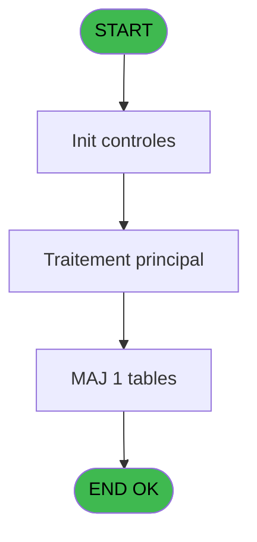

# REF IDE 601 - Browse - arc_hebergement

> **Analyse**: Phases 1-4 2026-02-03 13:03 -> 13:03 (15s) | Assemblage 13:03
> **Pipeline**: V7.2 Enrichi
> **Structure**: 4 onglets (Resume | Ecrans | Donnees | Connexions)

<!-- TAB:Resume -->

## 1. FICHE D'IDENTITE

| Attribut | Valeur |
|----------|--------|
| Projet | REF |
| IDE Position | 601 |
| Nom Programme | Browse - arc_hebergement |
| Fichier source | `Prg_601.xml` |
| Dossier IDE | General |
| Taches | 1 (1 ecrans visibles) |
| Tables modifiees | 1 |
| Programmes appeles | 0 |
| :warning: Statut | **ORPHELIN_POTENTIEL** |

## 2. DESCRIPTION FONCTIONNELLE

**Browse - arc_hebergement** assure la gestion complete de ce processus.

Le flux de traitement s'organise en **1 blocs fonctionnels** :

- **Traitement** (1 tache) : traitements metier divers

**Donnees modifiees** : 1 tables en ecriture (arc_hebergement______heb).

## 3. BLOCS FONCTIONNELS

### 3.1 Traitement (1 tache)

Traitements internes.

---

#### 601 - Browse - arc_hebergement [[ECRAN]](#ecran-t1)

**Role** : Traitement : Browse - arc_hebergement.
**Ecran** : 320 x 480 DLU | [Voir mockup](#ecran-t1)

## 5. REGLES METIER

*(Aucune regle metier identifiee)*

## 6. CONTEXTE

- **Appele par**: (aucun)
- **Appelle**: 0 programmes | **Tables**: 1 (W:1 R:0 L:0) | **Taches**: 1 | **Expressions**: 0

<!-- TAB:Ecrans -->

## 8. ECRANS

### 8.1 Forms visibles (1 / 1)

| # | Position | Tache | Nom | Type | Largeur | Hauteur | Bloc |
|---|----------|-------|-----|------|---------|---------|------|
| 1 | 601 | 601 | Browse - arc_hebergement | Type0 | 320 | 480 | Traitement |

### 8.2 Mockups Ecrans

---

#### 601 - Browse - arc_hebergement
**Tache** : [601](#t1) | **Type** : Type0 | **Dimensions** : 320 x 480 DLU
**Bloc** : Traitement | **Titre IDE** : Browse - arc_hebergement

<!-- FORM-DATA:
{
    "width":  320,
    "vFactor":  8,
    "type":  "Type0",
    "hFactor":  4,
    "controls":  [
                     {
                         "x":  8,
                         "type":  "table",
                         "var":  "",
                         "name":  "",
                         "titleH":  12,
                         "color":  "",
                         "w":  3472,
                         "y":  8,
                         "fmt":  "",
                         "parent":  null,
                         "text":  "",
                         "rowH":  13,
                         "h":  400,
                         "cols":  [
                                      {
                                          "title":  "arc_heb_societe",
                                          "layer":  1,
                                          "w":  66
                                      },
                                      {
                                          "title":  "arc_heb_num_compte",
                                          "layer":  2,
                                          "w":  88
                                      },
                                      {
                                          "title":  "arc_heb_filiation",
                                          "layer":  3,
                                          "w":  65
                                      },
                                      {
                                          "title":  "arc_heb_code_package",
                                          "layer":  4,
                                          "w":  97
                                      },
                                      {
                                          "title":  "arc_heb_statut_sejour",
                                          "layer":  5,
                                          "w":  87
                                      },
                                      {
                                          "title":  "arc_heb_date_debut",
                                          "layer":  6,
                                          "w":  82
                                      },
                                      {
                                          "title":  "arc_heb_heure_debut",
                                          "layer":  7,
                                          "w":  87
                                      },
                                      {
                                          "title":  "arc_heb_date_fin",
                                          "layer":  8,
                                          "w":  70
                                      },
                                      {
                                          "title":  "arc_heb_heure_fin",
                                          "layer":  9,
                                          "w":  74
                                      },
                                      {
                                          "title":  "arc_heb_u_p_nb_occup",
                                          "layer":  10,
                                          "w":  97
                                      },
                                      {
                                          "title":  "arc_heb_type_hebergement",
                                          "layer":  11,
                                          "w":  110
                                      },
                                      {
                                          "title":  "arc_heb_complement_type",
                                          "layer":  12,
                                          "w":  106
                                      },
                                      {
                                          "title":  "arc_heb_libelle",
                                          "layer":  13,
                                          "w":  296
                                      },
                                      {
                                          "title":  "arc_heb_age",
                                          "layer":  14,
                                          "w":  54
                                      },
                                      {
                                          "title":  "arc_heb_nationalite",
                                          "layer":  15,
                                          "w":  78
                                      },
                                      {
                                          "title":  "arc_heb_nom_logement",
                                          "layer":  16,
                                          "w":  94
                                      },
                                      {
                                          "title":  "arc_heb_code_sexe",
                                          "layer":  17,
                                          "w":  81
                                      },
                                      {
                                          "title":  "arc_heb_code_fumeur",
                                          "layer":  18,
                                          "w":  89
                                      },
                                      {
                                          "title":  "arc_heb_lieu_de_sejour",
                                          "layer":  19,
                                          "w":  94
                                      },
                                      {
                                          "title":  "arc_heb_code_logement",
                                          "layer":  20,
                                          "w":  98
                                      },
                                      {
                                          "title":  "arc_heb_compactage",
                                          "layer":  21,
                                          "w":  86
                                      },
                                      {
                                          "title":  "arc_heb_age_num",
                                          "layer":  22,
                                          "w":  74
                                      },
                                      {
                                          "title":  "arc_heb_age_nb_mois",
                                          "layer":  23,
                                          "w":  90
                                      },
                                      {
                                          "title":  "arc_heb_affec_auto",
                                          "layer":  24,
                                          "w":  80
                                      },
                                      {
                                          "title":  "arc_heb_affec_comment",
                                          "layer":  25,
                                          "w":  1130
                                      },
                                      {
                                          "title":  "arc_heb_date_purge",
                                          "layer":  26,
                                          "w":  82
                                      }
                                  ],
                         "rows":  26
                     },
                     {
                         "x":  12,
                         "type":  "edit",
                         "var":  "",
                         "y":  23,
                         "w":  9,
                         "fmt":  "",
                         "name":  "arc_heb_societe",
                         "h":  10,
                         "color":  "110",
                         "text":  "",
                         "parent":  1
                     },
                     {
                         "x":  78,
                         "type":  "edit",
                         "var":  "",
                         "y":  23,
                         "w":  42,
                         "fmt":  "",
                         "name":  "arc_heb_num_compte",
                         "h":  10,
                         "color":  "110",
                         "text":  "",
                         "parent":  1
                     },
                     {
                         "x":  166,
                         "type":  "edit",
                         "var":  "",
                         "y":  23,
                         "w":  18,
                         "fmt":  "",
                         "name":  "arc_heb_filiation",
                         "h":  10,
                         "color":  "110",
                         "text":  "",
                         "parent":  1
                     },
                     {
                         "x":  231,
                         "type":  "edit",
                         "var":  "",
                         "y":  23,
                         "w":  9,
                         "fmt":  "",
                         "name":  "arc_heb_code_package",
                         "h":  10,
                         "color":  "110",
                         "text":  "",
                         "parent":  1
                     },
                     {
                         "x":  328,
                         "type":  "edit",
                         "var":  "",
                         "y":  23,
                         "w":  9,
                         "fmt":  "",
                         "name":  "arc_heb_statut_sejour",
                         "h":  10,
                         "color":  "110",
                         "text":  "",
                         "parent":  1
                     },
                     {
                         "x":  415,
                         "type":  "edit",
                         "var":  "",
                         "y":  23,
                         "w":  61,
                         "fmt":  "",
                         "name":  "arc_heb_date_debut",
                         "h":  10,
                         "color":  "110",
                         "text":  "",
                         "parent":  1
                     },
                     {
                         "x":  497,
                         "type":  "edit",
                         "var":  "",
                         "y":  23,
                         "w":  14,
                         "fmt":  "",
                         "name":  "arc_heb_heure_debut",
                         "h":  10,
                         "color":  "110",
                         "text":  "",
                         "parent":  1
                     },
                     {
                         "x":  584,
                         "type":  "edit",
                         "var":  "",
                         "y":  23,
                         "w":  61,
                         "fmt":  "",
                         "name":  "arc_heb_date_fin",
                         "h":  10,
                         "color":  "110",
                         "text":  "",
                         "parent":  1
                     },
                     {
                         "x":  654,
                         "type":  "edit",
                         "var":  "",
                         "y":  23,
                         "w":  14,
                         "fmt":  "",
                         "name":  "arc_heb_heure_fin",
                         "h":  10,
                         "color":  "110",
                         "text":  "",
                         "parent":  1
                     },
                     {
                         "x":  728,
                         "type":  "edit",
                         "var":  "",
                         "y":  23,
                         "w":  20,
                         "fmt":  "",
                         "name":  "arc_heb_u_p_nb_occup",
                         "h":  10,
                         "color":  "110",
                         "text":  "",
                         "parent":  1
                     },
                     {
                         "x":  825,
                         "type":  "edit",
                         "var":  "",
                         "y":  23,
                         "w":  37,
                         "fmt":  "",
                         "name":  "arc_heb_type_hebergement",
                         "h":  10,
                         "color":  "110",
                         "text":  "",
                         "parent":  1
                     },
                     {
                         "x":  935,
                         "type":  "edit",
                         "var":  "",
                         "y":  23,
                         "w":  26,
                         "fmt":  "",
                         "name":  "arc_heb_complement_type",
                         "h":  10,
                         "color":  "110",
                         "text":  "",
                         "parent":  1
                     },
                     {
                         "x":  1041,
                         "type":  "edit",
                         "var":  "",
                         "y":  23,
                         "w":  289,
                         "fmt":  "",
                         "name":  "arc_heb_libelle",
                         "h":  10,
                         "color":  "110",
                         "text":  "",
                         "parent":  1
                     },
                     {
                         "x":  1337,
                         "type":  "edit",
                         "var":  "",
                         "y":  23,
                         "w":  9,
                         "fmt":  "",
                         "name":  "arc_heb_age",
                         "h":  10,
                         "color":  "110",
                         "text":  "",
                         "parent":  1
                     },
                     {
                         "x":  1391,
                         "type":  "edit",
                         "var":  "",
                         "y":  23,
                         "w":  14,
                         "fmt":  "",
                         "name":  "arc_heb_nationalite",
                         "h":  10,
                         "color":  "110",
                         "text":  "",
                         "parent":  1
                     },
                     {
                         "x":  1469,
                         "type":  "edit",
                         "var":  "",
                         "y":  23,
                         "w":  37,
                         "fmt":  "",
                         "name":  "arc_heb_nom_logement",
                         "h":  10,
                         "color":  "110",
                         "text":  "",
                         "parent":  1
                     },
                     {
                         "x":  1563,
                         "type":  "edit",
                         "var":  "",
                         "y":  23,
                         "w":  9,
                         "fmt":  "",
                         "name":  "arc_heb_code_sexe",
                         "h":  10,
                         "color":  "110",
                         "text":  "",
                         "parent":  1
                     },
                     {
                         "x":  1644,
                         "type":  "edit",
                         "var":  "",
                         "y":  23,
                         "w":  9,
                         "fmt":  "",
                         "name":  "arc_heb_code_fumeur",
                         "h":  10,
                         "color":  "110",
                         "text":  "",
                         "parent":  1
                     },
                     {
                         "x":  1733,
                         "type":  "edit",
                         "var":  "",
                         "y":  23,
                         "w":  9,
                         "fmt":  "",
                         "name":  "arc_heb_lieu_de_sejour",
                         "h":  10,
                         "color":  "110",
                         "text":  "",
                         "parent":  1
                     },
                     {
                         "x":  1827,
                         "type":  "edit",
                         "var":  "",
                         "y":  23,
                         "w":  37,
                         "fmt":  "",
                         "name":  "arc_heb_code_logement",
                         "h":  10,
                         "color":  "110",
                         "text":  "",
                         "parent":  1
                     },
                     {
                         "x":  1925,
                         "type":  "edit",
                         "var":  "",
                         "y":  23,
                         "w":  9,
                         "fmt":  "",
                         "name":  "arc_heb_compactage",
                         "h":  10,
                         "color":  "110",
                         "text":  "",
                         "parent":  1
                     },
                     {
                         "x":  2011,
                         "type":  "edit",
                         "var":  "",
                         "y":  23,
                         "w":  18,
                         "fmt":  "",
                         "name":  "arc_heb_age_num",
                         "h":  10,
                         "color":  "110",
                         "text":  "",
                         "parent":  1
                     },
                     {
                         "x":  2085,
                         "type":  "edit",
                         "var":  "",
                         "y":  23,
                         "w":  13,
                         "fmt":  "",
                         "name":  "arc_heb_age_nb_mois",
                         "h":  10,
                         "color":  "110",
                         "text":  "",
                         "parent":  1
                     },
                     {
                         "x":  2175,
                         "type":  "edit",
                         "var":  "",
                         "y":  23,
                         "w":  9,
                         "fmt":  "",
                         "name":  "arc_heb_affec_auto",
                         "h":  10,
                         "color":  "110",
                         "text":  "",
                         "parent":  1
                     },
                     {
                         "x":  2255,
                         "type":  "edit",
                         "var":  "",
                         "y":  23,
                         "w":  1123,
                         "fmt":  "",
                         "name":  "arc_heb_affec_comment",
                         "h":  10,
                         "color":  "110",
                         "text":  "",
                         "parent":  1
                     },
                     {
                         "x":  3385,
                         "type":  "edit",
                         "var":  "",
                         "y":  23,
                         "w":  61,
                         "fmt":  "",
                         "name":  "arc_heb_date_purge",
                         "h":  10,
                         "color":  "110",
                         "text":  "",
                         "parent":  1
                     }
                 ],
    "taskId":  "601",
    "height":  480
}
-->

<strong>Champs : 26 champs</strong>

| Pos (x,y) | Nom | Variable | Type |
|-----------|-----|----------|------|
| 12,23 | arc_heb_societe | - | edit |
| 78,23 | arc_heb_num_compte | - | edit |
| 166,23 | arc_heb_filiation | - | edit |
| 231,23 | arc_heb_code_package | - | edit |
| 328,23 | arc_heb_statut_sejour | - | edit |
| 415,23 | arc_heb_date_debut | - | edit |
| 497,23 | arc_heb_heure_debut | - | edit |
| 584,23 | arc_heb_date_fin | - | edit |
| 654,23 | arc_heb_heure_fin | - | edit |
| 728,23 | arc_heb_u_p_nb_occup | - | edit |
| 825,23 | arc_heb_type_hebergement | - | edit |
| 935,23 | arc_heb_complement_type | - | edit |
| 1041,23 | arc_heb_libelle | - | edit |
| 1337,23 | arc_heb_age | - | edit |
| 1391,23 | arc_heb_nationalite | - | edit |
| 1469,23 | arc_heb_nom_logement | - | edit |
| 1563,23 | arc_heb_code_sexe | - | edit |
| 1644,23 | arc_heb_code_fumeur | - | edit |
| 1733,23 | arc_heb_lieu_de_sejour | - | edit |
| 1827,23 | arc_heb_code_logement | - | edit |
| 1925,23 | arc_heb_compactage | - | edit |
| 2011,23 | arc_heb_age_num | - | edit |
| 2085,23 | arc_heb_age_nb_mois | - | edit |
| 2175,23 | arc_heb_affec_auto | - | edit |
| 2255,23 | arc_heb_affec_comment | - | edit |
| 3385,23 | arc_heb_date_purge | - | edit |

## 9. NAVIGATION

Ecran unique: **Browse - arc_hebergement**

### 9.3 Structure hierarchique (1 tache)

| Position | Tache | Type | Dimensions | Bloc |
|----------|-------|------|------------|------|
| **601.1** | [**Browse - arc_hebergement** (601)](#t1) [mockup](#ecran-t1) | - | 320x480 | Traitement |

### 9.4 Algorigramme

> **Legende**: Vert = START/END OK | Rouge = END KO | Bleu = Decisions
> *Algorigramme auto-genere. Utiliser `/algorigramme` pour une synthese metier detaillee.*

<!-- TAB:Donnees -->

## 10. TABLES

### Tables utilisees (1)

| ID | Nom | Description | Type | R | W | L | Usages |
|----|-----|-------------|------|---|---|---|--------|
| 853 | arc_hebergement______heb | Hebergement (chambres) | DB |   | **W** |   | 1 |

### Colonnes par table (0 / 1 tables avec colonnes identifiees)

Table 853 - arc_hebergement______heb (**W**) - 1 usages

*Table utilisee uniquement en Link ou aucune colonne Real identifiee dans le DataView.*

## 11. VARIABLES

*(Programme sans variables locales mappees)*

## 12. EXPRESSIONS

**0 / 0 expressions decodees (0%)**

### 12.1 Repartition par type

| Type | Expressions | Regles |
|------|-------------|--------|

### 12.2 Expressions cles par type

<!-- TAB:Connexions -->

## 13. GRAPHE D'APPELS

### 13.1 Chaine depuis Main (Callers)

**Chemin**: (pas de callers directs)

### 13.2 Callers

| IDE | Nom Programme | Nb Appels |
|-----|---------------|-----------|
| - | (aucun) | - |

### 13.3 Callees (programmes appeles)

### 13.4 Detail Callees avec contexte

| IDE | Nom Programme | Appels | Contexte |
|-----|---------------|--------|----------|
| - | (aucun) | - | - |

## 14. RECOMMANDATIONS MIGRATION

### 14.1 Profil du programme

| Metrique | Valeur | Impact migration |
|----------|--------|-----------------|
| Lignes de logique | 27 | Programme compact |
| Expressions | 0 | Peu de logique |
| Tables WRITE | 1 | Impact faible |
| Sous-programmes | 0 | Peu de dependances |
| Ecrans visibles | 1 | Ecran unique ou traitement batch |
| Code desactive | 0% (0 / 27) | Code sain |
| Regles metier | 0 | Pas de regle identifiee |

### 14.2 Plan de migration par bloc

#### Traitement (1 tache: 1 ecran, 0 traitement)

- **Strategie** : 1 composant(s) UI (Razor/React) avec formulaires et validation.
- Decomposer les taches en services unitaires testables.

### 14.3 Dependances critiques

| Dependance | Type | Appels | Impact |
|------------|------|--------|--------|
| arc_hebergement______heb | Table WRITE (Database) | 1x | Schema + repository |

---
*Spec DETAILED generee par Pipeline V7.2 - 2026-02-03 13:03*
