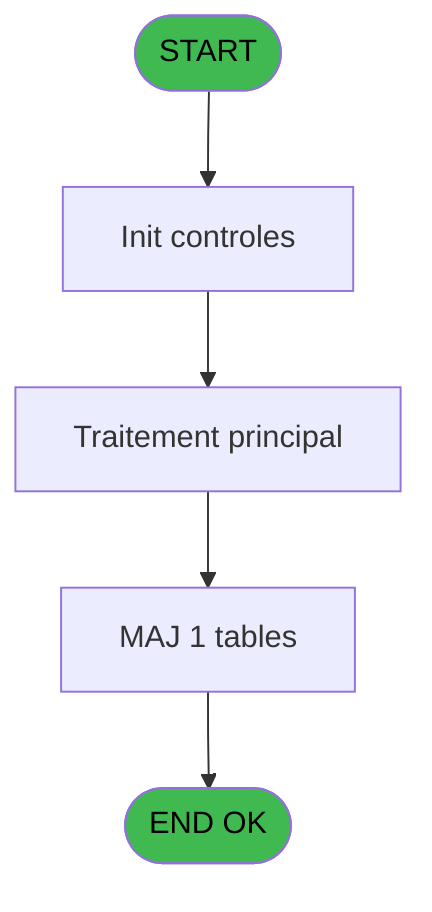

# REF IDE 604 - Browse - adresse_service_villa

> **Analyse**: Phases 1-4 2026-02-03 13:04 -> 13:04 (16s) | Assemblage 13:04
> **Pipeline**: V7.2 Enrichi
> **Structure**: 4 onglets (Resume | Ecrans | Donnees | Connexions)

<!-- TAB:Resume -->

## 1. FICHE D'IDENTITE

| Attribut | Valeur |
|----------|--------|
| Projet | REF |
| IDE Position | 604 |
| Nom Programme | Browse - adresse_service_villa |
| Fichier source | `Prg_604.xml` |
| Dossier IDE | General |
| Taches | 1 (1 ecrans visibles) |
| Tables modifiees | 1 |
| Programmes appeles | 0 |
| :warning: Statut | **ORPHELIN_POTENTIEL** |

## 2. DESCRIPTION FONCTIONNELLE

**Browse - adresse_service_villa** assure la gestion complete de ce processus.

Le flux de traitement s'organise en **1 blocs fonctionnels** :

- **Traitement** (1 tache) : traitements metier divers

**Donnees modifiees** : 1 tables en ecriture (adresse_service_village).

## 3. BLOCS FONCTIONNELS

### 3.1 Traitement (1 tache)

Traitements internes.

---

#### 604 - Browse - adresse_service_villa [[ECRAN]](#ecran-t1)

**Role** : Traitement : Browse - adresse_service_villa.
**Ecran** : 8119 x 480 DLU | [Voir mockup](#ecran-t1)

## 5. REGLES METIER

*(Aucune regle metier identifiee)*

## 6. CONTEXTE

- **Appele par**: (aucun)
- **Appelle**: 0 programmes | **Tables**: 1 (W:1 R:0 L:0) | **Taches**: 1 | **Expressions**: 0

<!-- TAB:Ecrans -->

## 8. ECRANS

### 8.1 Forms visibles (1 / 1)

| # | Position | Tache | Nom | Type | Largeur | Hauteur | Bloc |
|---|----------|-------|-----|------|---------|---------|------|
| 1 | 604 | 604 | Browse - adresse_service_villa | Type0 | 8119 | 480 | Traitement |

### 8.2 Mockups Ecrans

---

#### 604 - Browse - adresse_service_villa
**Tache** : [604](#t1) | **Type** : Type0 | **Dimensions** : 8119 x 480 DLU
**Bloc** : Traitement | **Titre IDE** : Browse - adresse_service_villa

<!-- FORM-DATA:
{
    "width":  8119,
    "vFactor":  8,
    "type":  "Type0",
    "hFactor":  4,
    "controls":  [
                     {
                         "x":  8,
                         "type":  "table",
                         "var":  "",
                         "name":  "",
                         "titleH":  12,
                         "color":  "",
                         "w":  8097,
                         "y":  8,
                         "fmt":  "",
                         "parent":  null,
                         "text":  "",
                         "rowH":  13,
                         "h":  446,
                         "cols":  [
                                      {
                                          "title":  "service",
                                          "layer":  1,
                                          "w":  33
                                      },
                                      {
                                          "title":  "identification",
                                          "layer":  2,
                                          "w":  50
                                      },
                                      {
                                          "title":  "club",
                                          "layer":  3,
                                          "w":  727
                                      },
                                      {
                                          "title":  "village",
                                          "layer":  4,
                                          "w":  727
                                      },
                                      {
                                          "title":  "adress_1",
                                          "layer":  5,
                                          "w":  727
                                      },
                                      {
                                          "title":  "adress_2",
                                          "layer":  6,
                                          "w":  727
                                      },
                                      {
                                          "title":  "adress_3",
                                          "layer":  7,
                                          "w":  727
                                      },
                                      {
                                          "title":  "zip_city",
                                          "layer":  8,
                                          "w":  727
                                      },
                                      {
                                          "title":  "phone",
                                          "layer":  9,
                                          "w":  727
                                      },
                                      {
                                          "title":  "fax",
                                          "layer":  10,
                                          "w":  727
                                      },
                                      {
                                          "title":  "siret",
                                          "layer":  11,
                                          "w":  727
                                      },
                                      {
                                          "title":  "tva_number",
                                          "layer":  12,
                                          "w":  727
                                      },
                                      {
                                          "title":  "email",
                                          "layer":  13,
                                          "w":  727
                                      }
                                  ],
                         "rows":  13
                     },
                     {
                         "x":  12,
                         "type":  "edit",
                         "var":  "",
                         "y":  23,
                         "w":  26,
                         "fmt":  "",
                         "name":  "service",
                         "h":  10,
                         "color":  "110",
                         "text":  "",
                         "parent":  1
                     },
                     {
                         "x":  45,
                         "type":  "edit",
                         "var":  "",
                         "y":  23,
                         "w":  20,
                         "fmt":  "",
                         "name":  "identification",
                         "h":  10,
                         "color":  "110",
                         "text":  "",
                         "parent":  1
                     },
                     {
                         "x":  95,
                         "type":  "edit",
                         "var":  "",
                         "y":  23,
                         "w":  720,
                         "fmt":  "",
                         "name":  "club",
                         "h":  10,
                         "color":  "110",
                         "text":  "",
                         "parent":  1
                     },
                     {
                         "x":  822,
                         "type":  "edit",
                         "var":  "",
                         "y":  23,
                         "w":  720,
                         "fmt":  "",
                         "name":  "village",
                         "h":  10,
                         "color":  "110",
                         "text":  "",
                         "parent":  1
                     },
                     {
                         "x":  1549,
                         "type":  "edit",
                         "var":  "",
                         "y":  23,
                         "w":  720,
                         "fmt":  "",
                         "name":  "adress_1",
                         "h":  10,
                         "color":  "110",
                         "text":  "",
                         "parent":  1
                     },
                     {
                         "x":  2276,
                         "type":  "edit",
                         "var":  "",
                         "y":  23,
                         "w":  720,
                         "fmt":  "",
                         "name":  "adress_2",
                         "h":  10,
                         "color":  "110",
                         "text":  "",
                         "parent":  1
                     },
                     {
                         "x":  3003,
                         "type":  "edit",
                         "var":  "",
                         "y":  23,
                         "w":  720,
                         "fmt":  "",
                         "name":  "adress_3",
                         "h":  10,
                         "color":  "110",
                         "text":  "",
                         "parent":  1
                     },
                     {
                         "x":  3730,
                         "type":  "edit",
                         "var":  "",
                         "y":  23,
                         "w":  720,
                         "fmt":  "",
                         "name":  "zip_city",
                         "h":  10,
                         "color":  "110",
                         "text":  "",
                         "parent":  1
                     },
                     {
                         "x":  4457,
                         "type":  "edit",
                         "var":  "",
                         "y":  23,
                         "w":  720,
                         "fmt":  "",
                         "name":  "phone",
                         "h":  10,
                         "color":  "110",
                         "text":  "",
                         "parent":  1
                     },
                     {
                         "x":  5184,
                         "type":  "edit",
                         "var":  "",
                         "y":  23,
                         "w":  720,
                         "fmt":  "",
                         "name":  "fax",
                         "h":  10,
                         "color":  "110",
                         "text":  "",
                         "parent":  1
                     },
                     {
                         "x":  5911,
                         "type":  "edit",
                         "var":  "",
                         "y":  23,
                         "w":  720,
                         "fmt":  "",
                         "name":  "siret",
                         "h":  10,
                         "color":  "110",
                         "text":  "",
                         "parent":  1
                     },
                     {
                         "x":  6638,
                         "type":  "edit",
                         "var":  "",
                         "y":  23,
                         "w":  720,
                         "fmt":  "",
                         "name":  "tva_number",
                         "h":  10,
                         "color":  "110",
                         "text":  "",
                         "parent":  1
                     },
                     {
                         "x":  7365,
                         "type":  "edit",
                         "var":  "",
                         "y":  23,
                         "w":  720,
                         "fmt":  "",
                         "name":  "email",
                         "h":  10,
                         "color":  "110",
                         "text":  "",
                         "parent":  1
                     }
                 ],
    "taskId":  "604",
    "height":  480
}
-->

<strong>Champs : 13 champs</strong>

| Pos (x,y) | Nom | Variable | Type |
|-----------|-----|----------|------|
| 12,23 | service | - | edit |
| 45,23 | identification | - | edit |
| 95,23 | club | - | edit |
| 822,23 | village | - | edit |
| 1549,23 | adress_1 | - | edit |
| 2276,23 | adress_2 | - | edit |
| 3003,23 | adress_3 | - | edit |
| 3730,23 | zip_city | - | edit |
| 4457,23 | phone | - | edit |
| 5184,23 | fax | - | edit |
| 5911,23 | siret | - | edit |
| 6638,23 | tva_number | - | edit |
| 7365,23 | email | - | edit |

## 9. NAVIGATION

Ecran unique: **Browse - adresse_service_villa**

### 9.3 Structure hierarchique (1 tache)

| Position | Tache | Type | Dimensions | Bloc |
|----------|-------|------|------------|------|
| **604.1** | [**Browse - adresse_service_villa** (604)](#t1) [mockup](#ecran-t1) | - | 8119x480 | Traitement |

### 9.4 Algorigramme

> **Legende**: Vert = START/END OK | Rouge = END KO | Bleu = Decisions
> *Algorigramme auto-genere. Utiliser `/algorigramme` pour une synthese metier detaillee.*

<!-- TAB:Donnees -->

## 10. TABLES

### Tables utilisees (1)

| ID | Nom | Description | Type | R | W | L | Usages |
|----|-----|-------------|------|---|---|---|--------|
| 856 | adresse_service_village | Services / filieres | DB |   | **W** |   | 1 |

### Colonnes par table (0 / 1 tables avec colonnes identifiees)

Table 856 - adresse_service_village (**W**) - 1 usages

*Table utilisee uniquement en Link ou aucune colonne Real identifiee dans le DataView.*

## 11. VARIABLES

*(Programme sans variables locales mappees)*

## 12. EXPRESSIONS

**0 / 0 expressions decodees (0%)**

### 12.1 Repartition par type

| Type | Expressions | Regles |
|------|-------------|--------|

### 12.2 Expressions cles par type

<!-- TAB:Connexions -->

## 13. GRAPHE D'APPELS

### 13.1 Chaine depuis Main (Callers)

**Chemin**: (pas de callers directs)

### 13.2 Callers

| IDE | Nom Programme | Nb Appels |
|-----|---------------|-----------|
| - | (aucun) | - |

### 13.3 Callees (programmes appeles)

### 13.4 Detail Callees avec contexte

| IDE | Nom Programme | Appels | Contexte |
|-----|---------------|--------|----------|
| - | (aucun) | - | - |

## 14. RECOMMANDATIONS MIGRATION

### 14.1 Profil du programme

| Metrique | Valeur | Impact migration |
|----------|--------|-----------------|
| Lignes de logique | 14 | Programme compact |
| Expressions | 0 | Peu de logique |
| Tables WRITE | 1 | Impact faible |
| Sous-programmes | 0 | Peu de dependances |
| Ecrans visibles | 1 | Ecran unique ou traitement batch |
| Code desactive | 0% (0 / 14) | Code sain |
| Regles metier | 0 | Pas de regle identifiee |

### 14.2 Plan de migration par bloc

#### Traitement (1 tache: 1 ecran, 0 traitement)

- **Strategie** : 1 composant(s) UI (Razor/React) avec formulaires et validation.
- Decomposer les taches en services unitaires testables.

### 14.3 Dependances critiques

| Dependance | Type | Appels | Impact |
|------------|------|--------|--------|
| adresse_service_village | Table WRITE (Database) | 1x | Schema + repository |

---
*Spec DETAILED generee par Pipeline V7.2 - 2026-02-03 13:04*
