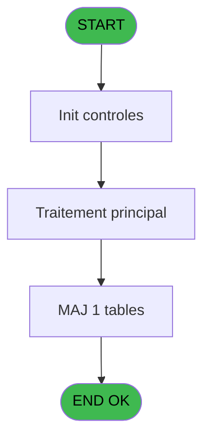

# REF IDE 614 - Maj Crédit Conso / Type

> **Analyse**: Phases 1-4 2026-02-03 13:08 -> 13:09 (17s) | Assemblage 13:09
> **Pipeline**: V7.2 Enrichi
> **Structure**: 4 onglets (Resume | Ecrans | Donnees | Connexions)

<!-- TAB:Resume -->

## 1. FICHE D'IDENTITE

| Attribut | Valeur |
|----------|--------|
| Projet | REF |
| IDE Position | 614 |
| Nom Programme | Maj Crédit Conso / Type |
| Fichier source | `Prg_614.xml` |
| Dossier IDE | General |
| Taches | 1 (0 ecrans visibles) |
| Tables modifiees | 1 |
| Programmes appeles | 0 |

## 2. DESCRIPTION FONCTIONNELLE

**Maj Crédit Conso / Type** assure la gestion complete de ce processus, accessible depuis [Auto Credits Bar (IDE 615)](REF-IDE-615.md).

Le flux de traitement s'organise en **1 blocs fonctionnels** :

- **Traitement** (1 tache) : traitements metier divers

**Donnees modifiees** : 1 tables en ecriture (cc_total_par_type).

## 3. BLOCS FONCTIONNELS

### 3.1 Traitement (1 tache)

Traitements internes.

---

#### 614 - Credit de conso [[ECRAN]](#ecran-t1)

**Role** : Calcul fidelite/avantage : Credit de conso.
**Ecran** : 639 x 7 DLU (MDI) | [Voir mockup](#ecran-t1)

## 5. REGLES METIER

*(Aucune regle metier identifiee)*

## 6. CONTEXTE

- **Appele par**: [Auto Credits Bar (IDE 615)](REF-IDE-615.md)
- **Appelle**: 0 programmes | **Tables**: 3 (W:1 R:0 L:2) | **Taches**: 1 | **Expressions**: 13

<!-- TAB:Ecrans -->

## 8. ECRANS

*(Programme sans ecran visible)*

## 9. NAVIGATION

### 9.3 Structure hierarchique (1 tache)

| Position | Tache | Type | Dimensions | Bloc |
|----------|-------|------|------------|------|
| **614.1** | [**Credit de conso** (614)](#t1) [mockup](#ecran-t1) | MDI | 639x7 | Traitement |

### 9.4 Algorigramme

> **Legende**: Vert = START/END OK | Rouge = END KO | Bleu = Decisions
> *Algorigramme auto-genere. Utiliser `/algorigramme` pour une synthese metier detaillee.*

<!-- TAB:Donnees -->

## 10. TABLES

### Tables utilisees (3)

| ID | Nom | Description | Type | R | W | L | Usages |
|----|-----|-------------|------|---|---|---|--------|
| 268 | cc_total_par_type |  | DB |   | **W** |   | 1 |
| 271 | cc_total |  | DB |   |   | L | 1 |
| 272 | cc_type_detail |  | DB |   |   | L | 1 |

### Colonnes par table (1 / 1 tables avec colonnes identifiees)

Table 268 - cc_total_par_type (**W**) - 1 usages

| Lettre | Variable | Acces | Type |
|--------|----------|-------|------|
| A | P Societe | W | Unicode |
| B | P Compte | W | Numeric |
| C | P Filiation | W | Numeric |
| D | P Montant | W | Numeric |
| E | P  Ajout ou Creation | W | Unicode |

## 11. VARIABLES

### 11.1 Parametres entrants (5)

Variables recues du programme appelant ([Auto Credits Bar (IDE 615)](REF-IDE-615.md)).

| Lettre | Nom | Type | Usage dans |
|--------|-----|------|-----------|
| A | P Societe | Unicode | 1x parametre entrant |
| B | P Compte | Numeric | 1x parametre entrant |
| C | P Filiation | Numeric | 1x parametre entrant |
| D | P Montant | Numeric | 4x parametre entrant |
| E | P  Ajout ou Creation | Unicode | 1x parametre entrant |

## 12. EXPRESSIONS

**13 / 13 expressions decodees (100%)**

### 12.1 Repartition par type

| Type | Expressions | Regles |
|------|-------------|--------|
| CALCULATION | 3 | 0 |
| CONSTANTE | 2 | 0 |
| DATE | 1 | 0 |
| OTHER | 6 | 0 |
| CONDITION | 1 | 0 |

### 12.2 Expressions cles par type

#### CALCULATION (3 expressions)

| Type | IDE | Expression | Regle |
|------|-----|------------|-------|
| CALCULATION | 13 | `[W]+P Montant [D]` | - |
| CALCULATION | 12 | `[I]+P Montant [D]` | - |
| CALCULATION | 11 | `[S]+P Montant [D]` | - |

#### CONSTANTE (2 expressions)

| Type | IDE | Expression | Regle |
|------|-----|------------|-------|
| CONSTANTE | 8 | `'AFFAUTO'` | - |
| CONSTANTE | 5 | `'30'` | - |

#### DATE (1 expressions)

| Type | IDE | Expression | Regle |
|------|-----|------------|-------|
| DATE | 6 | `Date()` | - |

#### OTHER (6 expressions)

| Type | IDE | Expression | Regle |
|------|-----|------------|-------|
| OTHER | 4 | `P Filiation [C]` | - |
| OTHER | 7 | `Time()` | - |
| OTHER | 9 | `[J]` | - |
| OTHER | 1 | `P Montant [D]` | - |
| OTHER | 2 | `P Societe [A]` | - |
| ... | | *+1 autres* | |

#### CONDITION (1 expressions)

| Type | IDE | Expression | Regle |
|------|-----|------------|-------|
| CONDITION | 10 | `P  Ajout ou Creation [E]='C' OR P  Ajout ou Creation [E]=''` | - |

<!-- TAB:Connexions -->

## 13. GRAPHE D'APPELS

### 13.1 Chaine depuis Main (Callers)

Main -> ... -> [Auto Credits Bar (IDE 615)](REF-IDE-615.md) -> **Maj Crédit Conso / Type (IDE 614)**

### 13.2 Callers

| IDE | Nom Programme | Nb Appels |
|-----|---------------|-----------|
| [615](REF-IDE-615.md) | Auto Credits Bar | 2 |

### 13.3 Callees (programmes appeles)

### 13.4 Detail Callees avec contexte

| IDE | Nom Programme | Appels | Contexte |
|-----|---------------|--------|----------|
| - | (aucun) | - | - |

## 14. RECOMMANDATIONS MIGRATION

### 14.1 Profil du programme

| Metrique | Valeur | Impact migration |
|----------|--------|-----------------|
| Lignes de logique | 41 | Programme compact |
| Expressions | 13 | Peu de logique |
| Tables WRITE | 1 | Impact faible |
| Sous-programmes | 0 | Peu de dependances |
| Ecrans visibles | 0 | Ecran unique ou traitement batch |
| Code desactive | 0% (0 / 41) | Code sain |
| Regles metier | 0 | Pas de regle identifiee |

### 14.2 Plan de migration par bloc

#### Traitement (1 tache: 1 ecran, 0 traitement)

- **Strategie** : 1 composant(s) UI (Razor/React) avec formulaires et validation.
- Decomposer les taches en services unitaires testables.

### 14.3 Dependances critiques

| Dependance | Type | Appels | Impact |
|------------|------|--------|--------|
| cc_total_par_type | Table WRITE (Database) | 1x | Schema + repository |

---
*Spec DETAILED generee par Pipeline V7.2 - 2026-02-03 13:09*
