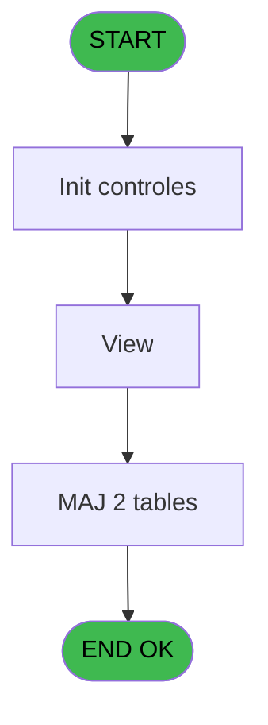

# REF IDE 615 - Auto Credits Bar

> **Analyse**: Phases 1-4 2026-02-03 13:09 -> 13:09 (19s) | Assemblage 13:09
> **Pipeline**: V7.2 Enrichi
> **Structure**: 4 onglets (Resume | Ecrans | Donnees | Connexions)

<!-- TAB:Resume -->

## 1. FICHE D'IDENTITE

| Attribut | Valeur |
|----------|--------|
| Projet | REF |
| IDE Position | 615 |
| Nom Programme | Auto Credits Bar |
| Fichier source | `Prg_615.xml` |
| Dossier IDE | General |
| Taches | 5 (0 ecrans visibles) |
| Tables modifiees | 2 |
| Programmes appeles | 1 |
| :warning: Statut | **ORPHELIN_POTENTIEL** |

## 2. DESCRIPTION FONCTIONNELLE

**Auto Credits Bar** assure la gestion complete de ce processus.

Le flux de traitement s'organise en **2 blocs fonctionnels** :

- **Traitement** (4 taches) : traitements metier divers
- **Calcul** (1 tache) : calculs de montants, stocks ou compteurs

**Donnees modifiees** : 2 tables en ecriture (personnel_go______go, valeur_credit_bar_defaut).

**Logique metier** : 1 regles identifiees couvrant conditions metier.

Detail : phases du traitement

#### Phase 1 : Traitement (4 taches)

- **615** - Auto Credits Bar
- **615.1** - Automate Credit Bar **[[ECRAN]](#ecran-t2)**
- **615.1.1** - (sans nom)
- **615.3** - View

Delegue a : [Maj Crédit Conso / Type (IDE 614)](REF-IDE-614.md)

#### Phase 2 : Calcul (1 tache)

- **615.2** - Comptes Spéciaux **[[ECRAN]](#ecran-t4)**

#### Tables impactees

| Table | Operations | Role metier |
|-------|-----------|-------------|
| valeur_credit_bar_defaut | **W** (1 usages) |  |
| personnel_go______go | **W** (1 usages) |  |

## 3. BLOCS FONCTIONNELS

### 3.1 Traitement (4 taches)

Traitements internes.

---

#### 615 - Auto Credits Bar

**Role** : Calcul fidelite/avantage : Auto Credits Bar.

3 sous-taches directes

| Tache | Nom | Bloc |
|-------|-----|------|
| [615.1](#t2) | Automate Credit Bar **[[ECRAN]](#ecran-t2)** | Traitement |
| [615.1.1](#t3) | (sans nom) | Traitement |
| [615.3](#t5) | View | Traitement |

**Delegue a** : [Maj Crédit Conso / Type (IDE 614)](REF-IDE-614.md)

---

#### 615.1 - Automate Credit Bar [[ECRAN]](#ecran-t2)

**Role** : Calcul fidelite/avantage : Automate Credit Bar.
**Ecran** : 424 x 401 DLU | [Voir mockup](#ecran-t2)
**Delegue a** : [Maj Crédit Conso / Type (IDE 614)](REF-IDE-614.md)

---

#### 615.1.1 - (sans nom)

**Role** : Traitement interne.
**Delegue a** : [Maj Crédit Conso / Type (IDE 614)](REF-IDE-614.md)

---

#### 615.3 - View

**Role** : Traitement : View.
**Delegue a** : [Maj Crédit Conso / Type (IDE 614)](REF-IDE-614.md)

### 3.2 Calcul (1 tache)

Calculs metier : montants, stocks, compteurs.

---

#### 615.2 - Comptes Spéciaux [[ECRAN]](#ecran-t4)

**Role** : Traitement : Comptes Spéciaux.
**Ecran** : 839 x 0 DLU | [Voir mockup](#ecran-t4)

## 5. REGLES METIER

1 regles identifiees:

### Autres (1 regles)

#### [RM-001] Si V vcb_Montant*Nbre de ... [F]<EOM(Date()) alors V vcb_Montant*Nbre de ... [F] sinon EOM(Date()))

| Element | Detail |
|---------|--------|
| **Condition** | `V vcb_Montant*Nbre de ... [F]<EOM(Date())` |
| **Si vrai** | V vcb_Montant*Nbre de ... [F] |
| **Si faux** | EOM(Date())) |
| **Expression source** | Expression 5 : `IF(V vcb_Montant*Nbre de ... [F]<EOM(Date()),V vcb_Montant*N` |
| **Exemple** | Si V vcb_Montant*Nbre de ... [F]<EOM(Date()) → V vcb_Montant*Nbre de ... [F]. Sinon → EOM(Date())) |

## 6. CONTEXTE

- **Appele par**: (aucun)
- **Appelle**: 1 programmes | **Tables**: 6 (W:2 R:2 L:2) | **Taches**: 5 | **Expressions**: 7

<!-- TAB:Ecrans -->

## 8. ECRANS

*(Programme sans ecran visible)*

## 9. NAVIGATION

### 9.3 Structure hierarchique (5 taches)

| Position | Tache | Type | Dimensions | Bloc |
|----------|-------|------|------------|------|
| **615.1** | [**Auto Credits Bar** (615)](#t1) | - | - | Traitement |
| 615.1.1 | [Automate Credit Bar (615.1)](#t2) [mockup](#ecran-t2) | - | 424x401 | |
| 615.1.2 | [(sans nom) (615.1.1)](#t3) | - | - | |
| 615.1.3 | [View (615.3)](#t5) | - | - | |
| **615.2** | [**Comptes Spéciaux** (615.2)](#t4) [mockup](#ecran-t4) | - | 839x0 | Calcul |

### 9.4 Algorigramme

> **Legende**: Vert = START/END OK | Rouge = END KO | Bleu = Decisions
> *Algorigramme auto-genere. Utiliser `/algorigramme` pour une synthese metier detaillee.*

<!-- TAB:Donnees -->

## 10. TABLES

### Tables utilisees (6)

| ID | Nom | Description | Type | R | W | L | Usages |
|----|-----|-------------|------|---|---|---|--------|
| 34 | hebergement______heb | Hebergement (chambres) | DB | R |   |   | 1 |
| 35 | personnel_go______go |  | DB |   | **W** |   | 1 |
| 131 | fichier_validation |  | DB |   |   | L | 1 |
| 368 | pms_village |  | DB | R |   |   | 1 |
| 758 | comptes_speciaux_spc_cash | Comptes GM (generaux) | DB |   |   | L | 1 |
| 804 | valeur_credit_bar_defaut |  | DB |   | **W** |   | 1 |

### Colonnes par table (4 / 4 tables avec colonnes identifiees)

Table 34 - hebergement______heb (R) - 1 usages

| Lettre | Variable | Acces | Type |
|--------|----------|-------|------|
| A | v.Nb Jours | R | Numeric |
| B | v.date debut | R | Date |
| C | v.date fin | R | Date |
| D | v.Montant | R | Numeric |

Table 35 - personnel_go______go (**W**) - 1 usages

| Lettre | Variable | Acces | Type |
|--------|----------|-------|------|
| A | v Nbre de jour | W | Numeric |
| B | v Date de Début Calculée | W | Date |
| C | v Date de Fin Calculée | W | Date |
| D | v Montant à créditer | W | Numeric |

Table 368 - pms_village (R) - 1 usages

| Lettre | Variable | Acces | Type |
|--------|----------|-------|------|
| A | P.Batch/Online ? | R | Unicode |
| B | V.Clause where | R | Alpha |
| C | v.date Debut Personnel | R | Date |
| D | v.date Fin Personnel | R | Date |

Table 804 - valeur_credit_bar_defaut (**W**) - 1 usages

| Lettre | Variable | Acces | Type |
|--------|----------|-------|------|
| A | V Nbre/ Jour Mois | W | Numeric |
| B | V Heure | W | Time |
| C | V Date Debut | W | Date |
| D | V Date de Fin | W | Date |
| E | V Nbre de jour reel | W | Numeric |
| F | V vcb_Montant*Nbre de jour | W | Numeric |

## 11. VARIABLES

### 11.1 Parametres entrants (1)

Variables recues en parametre.

| Lettre | Nom | Type | Usage dans |
|--------|-----|------|-----------|
| A | P.Batch/Online ? | Unicode | 1x parametre entrant |

### 11.2 Variables de session (5)

Variables persistantes pendant toute la session.

| Lettre | Nom | Type | Usage dans |
|--------|-----|------|-----------|
| B | V.Clause where | Alpha | - |
| C | v.date Debut Personnel | Date | - |
| D | v.date Fin Personnel | Date | 1x session |
| E | V Nbre de jour reel | Numeric | - |
| F | V vcb_Montant*Nbre de jour | Numeric | - |

## 12. EXPRESSIONS

**7 / 7 expressions decodees (100%)**

### 12.1 Repartition par type

| Type | Expressions | Regles |
|------|-------------|--------|
| CONDITION | 3 | 5 |
| CONSTANTE | 1 | 0 |
| FORMAT | 1 | 0 |
| DATE | 2 | 0 |

### 12.2 Expressions cles par type

#### CONDITION (3 expressions)

| Type | IDE | Expression | Regle |
|------|-----|------------|-------|
| CONDITION | 5 | `IF(V vcb_Montant*Nbre de ... [F]<EOM(Date()),V vcb_Montant*Nbre de ... [F],EOM(Date()))` | [RM-001](#rm-RM-001) |
| CONDITION | 2 | `v.date Fin Personnel [D]='N' OR Trim(v.date Fin Personnel [D])=''` | - |
| CONDITION | 7 | `P.Batch/Online ? [A] <> 'B'` | - |

#### CONSTANTE (1 expressions)

| Type | IDE | Expression | Regle |
|------|-----|------------|-------|
| CONSTANTE | 6 | `'Traitement fini.'` | - |

#### FORMAT (1 expressions)

| Type | IDE | Expression | Regle |
|------|-----|------------|-------|
| FORMAT | 1 | `'valide__o_n_ = ''O'''&' AND go_date_fin > '''&DStr(Date(),'YYYYMMDD')&''''` | - |

#### DATE (2 expressions)

| Type | IDE | Expression | Regle |
|------|-----|------------|-------|
| DATE | 4 | `EOM(Date())` | - |
| DATE | 3 | `BOM(Date())` | - |

<!-- TAB:Connexions -->

## 13. GRAPHE D'APPELS

### 13.1 Chaine depuis Main (Callers)

**Chemin**: (pas de callers directs)

### 13.2 Callers

| IDE | Nom Programme | Nb Appels |
|-----|---------------|-----------|
| - | (aucun) | - |

### 13.3 Callees (programmes appeles)

### 13.4 Detail Callees avec contexte

| IDE | Nom Programme | Appels | Contexte |
|-----|---------------|--------|----------|
| [614](REF-IDE-614.md) | Maj Crédit Conso / Type | 2 | Mise a jour donnees |

## 14. RECOMMANDATIONS MIGRATION

### 14.1 Profil du programme

| Metrique | Valeur | Impact migration |
|----------|--------|-----------------|
| Lignes de logique | 97 | Programme compact |
| Expressions | 7 | Peu de logique |
| Tables WRITE | 2 | Impact faible |
| Sous-programmes | 1 | Peu de dependances |
| Ecrans visibles | 0 | Ecran unique ou traitement batch |
| Code desactive | 1% (1 / 97) | Code sain |
| Regles metier | 1 | Quelques regles a preserver |

### 14.2 Plan de migration par bloc

#### Traitement (4 taches: 1 ecran, 3 traitements)

- **Strategie** : Orchestrateur avec 1 ecrans (Razor/React) et 3 traitements backend (services).
- Les ecrans deviennent des composants UI, les traitements invisibles deviennent des services injectables.
- 1 sous-programme(s) a migrer ou a reutiliser depuis les services existants.
- Decomposer les taches en services unitaires testables.

#### Calcul (1 tache: 1 ecran, 0 traitement)

- **Strategie** : Services de calcul purs (Domain Services).
- Migrer la logique de calcul (stock, compteurs, montants)

### 14.3 Dependances critiques

| Dependance | Type | Appels | Impact |
|------------|------|--------|--------|
| personnel_go______go | Table WRITE (Database) | 1x | Schema + repository |
| valeur_credit_bar_defaut | Table WRITE (Database) | 1x | Schema + repository |
| [Maj Crédit Conso / Type (IDE 614)](REF-IDE-614.md) | Sous-programme | 2x | Haute - Mise a jour donnees |

---
*Spec DETAILED generee par Pipeline V7.2 - 2026-02-03 13:09*
