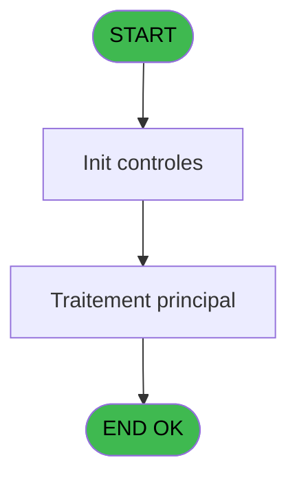
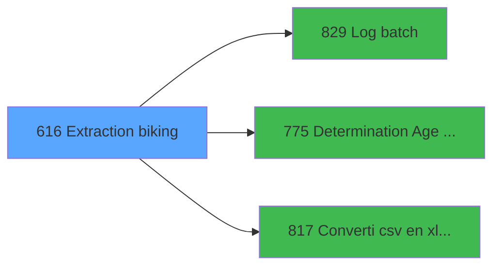

# REF IDE 616 - Extraction biking

> **Analyse**: Phases 1-4 2026-02-03 13:09 -> 13:10 (19s) | Assemblage 13:10
> **Pipeline**: V7.2 Enrichi
> **Structure**: 4 onglets (Resume | Ecrans | Donnees | Connexions)

<!-- TAB:Resume -->

## 1. FICHE D'IDENTITE

| Attribut | Valeur |
|----------|--------|
| Projet | REF |
| IDE Position | 616 |
| Nom Programme | Extraction biking |
| Fichier source | `Prg_616.xml` |
| Dossier IDE | General |
| Taches | 2 (0 ecrans visibles) |
| Tables modifiees | 0 |
| Programmes appeles | 3 |
| :warning: Statut | **ORPHELIN_POTENTIEL** |

## 2. DESCRIPTION FONCTIONNELLE

**Extraction biking** assure la gestion complete de ce processus.

Le flux de traitement s'organise en **1 blocs fonctionnels** :

- **Traitement** (2 taches) : traitements metier divers

**Logique metier** : 3 regles identifiees couvrant conditions metier, valeurs par defaut.

## 3. BLOCS FONCTIONNELS

### 3.1 Traitement (2 taches)

Traitements internes.

---

#### 616 - Extraction biking

**Role** : Traitement : Extraction biking.
**Delegue a** : [Log batch (IDE 829)](REF-IDE-829.md), [Determination Age Debut Sejour (IDE 775)](REF-IDE-775.md), [Converti csv en xlsx / Exe (IDE 817)](REF-IDE-817.md)

---

#### 616.1 - Extraction biking csv

**Role** : Traitement : Extraction biking csv.
**Delegue a** : [Log batch (IDE 829)](REF-IDE-829.md), [Determination Age Debut Sejour (IDE 775)](REF-IDE-775.md), [Converti csv en xlsx / Exe (IDE 817)](REF-IDE-817.md)

## 5. REGLES METIER

3 regles identifiees:

### Autres (3 regles)

#### [RM-001] Valeur par defaut si Translate('%club_excel_separator%') est vide

| Element | Detail |
|---------|--------|
| **Condition** | `Translate('%club_excel_separator%')=''` |
| **Si vrai** | ';' |
| **Si faux** | Translate('%club_excel_separator%')) |
| **Expression source** | Expression 1 : `IF(Translate('%club_excel_separator%')='', ';', Translate('%` |
| **Exemple** | Si Translate('%club_excel_separator%')='' → ';'. Sinon → Translate('%club_excel_separator%')) |

#### [RM-002] Si p.i.Batch SENl ? [D] alors ExpCalc('7'EXP) sinon ExpCalc('6'EXP))

| Element | Detail |
|---------|--------|
| **Condition** | `p.i.Batch SENl ? [D]` |
| **Si vrai** | ExpCalc('7'EXP) |
| **Si faux** | ExpCalc('6'EXP)) |
| **Variables** | D (p.i.Batch SENl ?) |
| **Expression source** | Expression 8 : `IF(p.i.Batch SENl ? [D], ExpCalc('7'EXP), ExpCalc('6'EXP))` |
| **Exemple** | Si p.i.Batch SENl ? [D] → ExpCalc('7'EXP). Sinon → ExpCalc('6'EXP)) |

#### [RM-003] Valeur par defaut si v.Statut conversion [J] est vide

| Element | Detail |
|---------|--------|
| **Condition** | `v.Statut conversion [J]=''` |
| **Si vrai** | 'OK' |
| **Si faux** | 'ERR') |
| **Variables** | J (v.Statut conversion) |
| **Expression source** | Expression 15 : `IF(v.Statut conversion [J]='', 'OK', 'ERR')` |
| **Exemple** | Si v.Statut conversion [J]='' → 'OK'. Sinon → 'ERR') |

## 6. CONTEXTE

- **Appele par**: (aucun)
- **Appelle**: 3 programmes | **Tables**: 6 (W:0 R:1 L:5) | **Taches**: 2 | **Expressions**: 17

<!-- TAB:Ecrans -->

## 8. ECRANS

*(Programme sans ecran visible)*

## 9. NAVIGATION

### 9.3 Structure hierarchique (2 taches)

| Position | Tache | Type | Dimensions | Bloc |
|----------|-------|------|------------|------|
| **616.1** | [**Extraction biking** (616)](#t1) | - | - | Traitement |
| 616.1.1 | [Extraction biking csv (616.1)](#t2) | - | - | |

### 9.4 Algorigramme

> **Legende**: Vert = START/END OK | Rouge = END KO | Bleu = Decisions
> *Algorigramme auto-genere. Utiliser `/algorigramme` pour une synthese metier detaillee.*

<!-- TAB:Donnees -->

## 10. TABLES

### Tables utilisees (6)

| ID | Nom | Description | Type | R | W | L | Usages |
|----|-----|-------------|------|---|---|---|--------|
| 31 | gm-complet_______gmc |  | DB | R |   |   | 1 |
| 34 | hebergement______heb | Hebergement (chambres) | DB |   |   | L | 1 |
| 40 | comptable________cte |  | DB |   |   | L | 1 |
| 263 | vente | Donnees de ventes | DB |   |   | L | 1 |
| 285 | email |  | DB |   |   | L | 1 |
| 925 | vente_complement_commun | Donnees de ventes | DB |   |   | L | 1 |

### Colonnes par table (1 / 1 tables avec colonnes identifiees)

Table 31 - gm-complet_______gmc (R) - 1 usages

| Lettre | Variable | Acces | Type |
|--------|----------|-------|------|
| A | v.Type article VAE | R | Unicode |
| B | v.Société | R | Unicode |
| C | v.Compte GM | R | Numeric |
| D | v.Fillation | R | Numeric |
| E | v.Libelllé article | R | Unicode |
| F | v.Ligne annulation | R | Numeric |
| G | v.Age | R | Numeric |
| H | v.Ligne export | R | Unicode |

## 11. VARIABLES

### 11.1 Parametres entrants (6)

Variables recues en parametre.

| Lettre | Nom | Type | Usage dans |
|--------|-----|------|-----------|
| A | p.i.Date debut | Date | 4x parametre entrant |
| B | p.i.Date fin | Date | 3x parametre entrant |
| C | p.i.AM/PM/( ) Tout | Unicode | 4x parametre entrant |
| D | p.i.Batch SENl ? | Logical | 2x parametre entrant |
| E | p.o.Fichier xslx | Unicode | 1x parametre entrant |
| F | p.o.Nb lignes extraites | Numeric | 1x parametre entrant |

### 11.2 Variables de session (4)

Variables persistantes pendant toute la session.

| Lettre | Nom | Type | Usage dans |
|--------|-----|------|-----------|
| G | v.Fichier temporaire csv | Unicode | 1x session |
| H | v.Sép | Unicode | 1x session |
| I | v.Batch ID | Numeric | - |
| J | v.Statut conversion | Unicode | 1x session |

## 12. EXPRESSIONS

**17 / 17 expressions decodees (100%)**

### 12.1 Repartition par type

| Type | Expressions | Regles |
|------|-------------|--------|
| CONDITION | 4 | 3 |
| CONSTANTE | 5 | 0 |
| FORMAT | 3 | 0 |
| NEGATION | 1 | 0 |
| OTHER | 4 | 0 |

### 12.2 Expressions cles par type

#### CONDITION (4 expressions)

| Type | IDE | Expression | Regle |
|------|-----|------------|-------|
| CONDITION | 15 | `IF(v.Statut conversion [J]='', 'OK', 'ERR')` | [RM-003](#rm-RM-003) |
| CONDITION | 8 | `IF(p.i.Batch SENl ? [D], ExpCalc('7'EXP), ExpCalc('6'EXP))` | [RM-002](#rm-RM-002) |
| CONDITION | 1 | `IF(Translate('%club_excel_separator%')='', ';', Translate('%club_excel_separator%'))` | [RM-001](#rm-RM-001) |
| CONDITION | 10 | `IF(p.i.Batch SENl ? [D], 'SEN~' & DStr(p.i.Date debut [A], 'YYYYMMDD') & '~' & p.i.AM/PM/( ) Tout [C], DStr(p.i.Date debut [A], 'YYYYMMDD') & '~' & DStr(p.i.Date fin [B], 'YYYYMMDD') & '~' & p.i.AM/PM/( ) Tout [C])` | - |

#### CONSTANTE (5 expressions)

| Type | IDE | Expression | Regle |
|------|-----|------------|-------|
| CONSTANTE | 14 | `'rows'` | - |
| CONSTANTE | 17 | `0` | - |
| CONSTANTE | 9 | `'DEB'` | - |
| CONSTANTE | 4 | `'BIKING'` | - |
| CONSTANTE | 5 | `'Biking extract'` | - |

#### FORMAT (3 expressions)

| Type | IDE | Expression | Regle |
|------|-----|------------|-------|
| FORMAT | 7 | `StrBuild('Automatic biking extract for @1@ @2@', DStr(p.i.Date debut [A], '##/##/####'), p.i.AM/PM/( ) Tout [C])` | - |
| FORMAT | 6 | `StrBuild('Biking extract for @1@-@2@ @3@', DStr(p.i.Date debut [A], '##/##/####'), DStr(p.i.Date fin [B], '##/##/####'), IF(p.i.AM/PM/( ) Tout [C]='', 'All', p.i.AM/PM/( ) Tout [C]))` | - |
| FORMAT | 3 | `StrBuild(Translate('%club_exportdata%biking\biking_@1@_@2@_@3@_@4@_@5@.csv'), DStr(p.i.Date debut [A], 'YYYY-MM-DD'), DStr(p.i.Date fin [B], 'YYYY-MM-DD'), p.i.AM/PM/( ) Tout [C], TStr(Time(), 'HHMMSS'), GetHostName ())` | - |

#### NEGATION (1 expressions)

| Type | IDE | Expression | Regle |
|------|-----|------------|-------|
| NEGATION | 2 | `NOT FileExist ('%club_exportdata%biking')` | - |

#### OTHER (4 expressions)

| Type | IDE | Expression | Regle |
|------|-----|------------|-------|
| OTHER | 13 | `p.o.Nb lignes extraites [F]` | - |
| OTHER | 16 | `p.o.Fichier xslx [E]` | - |
| OTHER | 11 | `v.Fichier temporaire csv [G]` | - |
| OTHER | 12 | `v.Sép [H]` | - |

<!-- TAB:Connexions -->

## 13. GRAPHE D'APPELS

### 13.1 Chaine depuis Main (Callers)

**Chemin**: (pas de callers directs)

### 13.2 Callers

| IDE | Nom Programme | Nb Appels |
|-----|---------------|-----------|
| - | (aucun) | - |

### 13.3 Callees (programmes appeles)

### 13.4 Detail Callees avec contexte

| IDE | Nom Programme | Appels | Contexte |
|-----|---------------|--------|----------|
| [829](REF-IDE-829.md) | Log batch | 2 | Sous-programme |
| [775](REF-IDE-775.md) | Determination Age Debut Sejour | 1 | Sous-programme |
| [817](REF-IDE-817.md) | Converti csv en xlsx / Exe | 1 | Sous-programme |

## 14. RECOMMANDATIONS MIGRATION

### 14.1 Profil du programme

| Metrique | Valeur | Impact migration |
|----------|--------|-----------------|
| Lignes de logique | 120 | Programme compact |
| Expressions | 17 | Peu de logique |
| Tables WRITE | 0 | Impact faible |
| Sous-programmes | 3 | Peu de dependances |
| Ecrans visibles | 0 | Ecran unique ou traitement batch |
| Code desactive | 0% (0 / 120) | Code sain |
| Regles metier | 3 | Quelques regles a preserver |

### 14.2 Plan de migration par bloc

#### Traitement (2 taches: 0 ecran, 2 traitements)

- **Strategie** : 2 service(s) backend injectable(s) (Domain Services).
- 3 sous-programme(s) a migrer ou a reutiliser depuis les services existants.
- Decomposer les taches en services unitaires testables.

### 14.3 Dependances critiques

| Dependance | Type | Appels | Impact |
|------------|------|--------|--------|
| [Log batch (IDE 829)](REF-IDE-829.md) | Sous-programme | 2x | Haute - Sous-programme |
| [Converti csv en xlsx / Exe (IDE 817)](REF-IDE-817.md) | Sous-programme | 1x | Normale - Sous-programme |
| [Determination Age Debut Sejour (IDE 775)](REF-IDE-775.md) | Sous-programme | 1x | Normale - Sous-programme |

---
*Spec DETAILED generee par Pipeline V7.2 - 2026-02-03 13:10*
