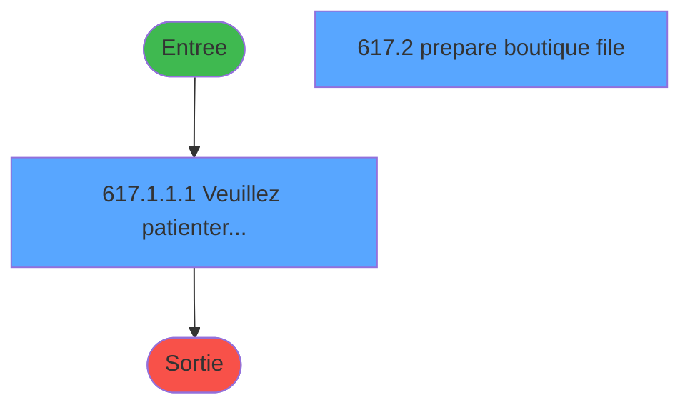
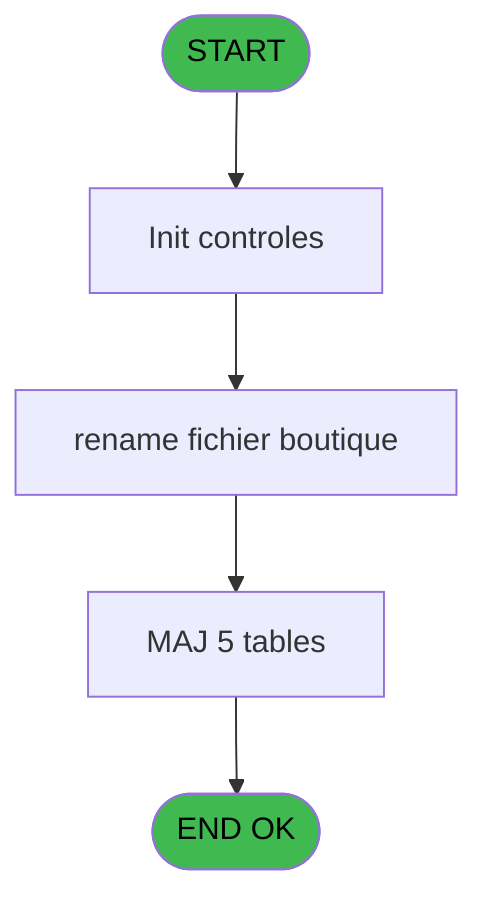

# REF IDE 617 - Transfert ODS Boutique

> **Analyse**: Phases 1-4 2026-02-03 13:10 -> 13:10 (18s) | Assemblage 13:10
> **Pipeline**: V7.2 Enrichi
> **Structure**: 4 onglets (Resume | Ecrans | Donnees | Connexions)

<!-- TAB:Resume -->

## 1. FICHE D'IDENTITE

| Attribut | Valeur |
|----------|--------|
| Projet | REF |
| IDE Position | 617 |
| Nom Programme | Transfert ODS Boutique |
| Fichier source | `Prg_617.xml` |
| Dossier IDE | General |
| Taches | 15 (2 ecrans visibles) |
| Tables modifiees | 5 |
| Programmes appeles | 0 |
| :warning: Statut | **ORPHELIN_POTENTIEL** |

## 2. DESCRIPTION FONCTIONNELLE

**Transfert ODS Boutique** assure la gestion complete de ce processus.

Le flux de traitement s'organise en **4 blocs fonctionnels** :

- **Traitement** (8 taches) : traitements metier divers
- **Creation** (4 taches) : insertion d'enregistrements en base (mouvements, prestations)
- **Transfert** (2 taches) : transferts de donnees entre modules ou deversements
- **Calcul** (1 tache) : calculs de montants, stocks ou compteurs

**Donnees modifiees** : 5 tables en ecriture (reseau_cloture___rec, comptable_gratuite, comptable________cte, date_comptable___dat, erreurs_retail).

Detail : phases du traitement

#### Phase 1 : Transfert (2 taches)

- **617** - Transfert ODS Boutique
- **617.1.1** - CB Transfert ODS boutique **[[ECRAN]](#ecran-t3)**

#### Phase 2 : Traitement (8 taches)

- **617.1** - Please wait ... **[[ECRAN]](#ecran-t2)**
- **617.1.1.1** - Veuillez patienter... **[[ECRAN]](#ecran-t4)**
- **617.2** - prepare boutique file **[[ECRAN]](#ecran-t9)**
- **617.3** - Test si cloture en cours
- **617.3.1** - Blocage cloture
- **617.3.2** - Blocage cloture
- **617.4** - Deblocage cloture
- **617.5** - Deblocage cloture

#### Phase 3 : Creation (4 taches)

- **617.1.1.1.1** - Creation OD boutique
- **617.1.1.1.2** - Creation OD boutique
- **617.1.1.1.3** - Creation OD boutique
- **617.1.1.2** - Create Err

#### Phase 4 : Calcul (1 tache)

- **617.6** - Lecture date comptable

#### Tables impactees

| Table | Operations | Role metier |
|-------|-----------|-------------|
| reseau_cloture___rec | R/**W** (5 usages) | Donnees reseau/cloture |
| comptable________cte | **W** (2 usages) |  |
| date_comptable___dat | **W** (1 usages) |  |
| comptable_gratuite | **W** (1 usages) |  |
| erreurs_retail | **W** (1 usages) |  |

## 3. BLOCS FONCTIONNELS

### 3.1 Transfert (2 taches)

Transfert de donnees entre modules.

---

#### 617 - Transfert ODS Boutique

**Role** : Transfert de donnees : Transfert ODS Boutique.

---

#### 617.1.1 - CB Transfert ODS boutique [[ECRAN]](#ecran-t3)

**Role** : Transfert de donnees : CB Transfert ODS boutique.
**Ecran** : 80 x 28 DLU (MDI) | [Voir mockup](#ecran-t3)

### 3.2 Traitement (8 taches)

Traitements internes.

---

#### 617.1 - Please wait ... [[ECRAN]](#ecran-t2)

**Role** : Traitement : Please wait ....
**Ecran** : 426 x 56 DLU (MDI) | [Voir mockup](#ecran-t2)

---

#### 617.1.1.1 - Veuillez patienter... [[ECRAN]](#ecran-t4)

**Role** : Traitement : Veuillez patienter....
**Ecran** : 768 x 172 DLU (MDI) | [Voir mockup](#ecran-t4)

---

#### 617.2 - prepare boutique file [[ECRAN]](#ecran-t9)

**Role** : Traitement : prepare boutique file.
**Ecran** : 273 x 58 DLU (MDI) | [Voir mockup](#ecran-t9)

---

#### 617.3 - Test si cloture en cours

**Role** : Verification : Test si cloture en cours.
**Variables liees** : D (v. retour cloture), E (v. operation durant cloture)

---

#### 617.3.1 - Blocage cloture

**Role** : Traitement : Blocage cloture.
**Variables liees** : D (v. retour cloture), E (v. operation durant cloture)

---

#### 617.3.2 - Blocage cloture

**Role** : Traitement : Blocage cloture.
**Variables liees** : D (v. retour cloture), E (v. operation durant cloture)

---

#### 617.4 - Deblocage cloture

**Role** : Traitement : Deblocage cloture.
**Variables liees** : D (v. retour cloture), E (v. operation durant cloture)

---

#### 617.5 - Deblocage cloture

**Role** : Traitement : Deblocage cloture.
**Variables liees** : D (v. retour cloture), E (v. operation durant cloture)

### 3.3 Creation (4 taches)

Insertion de nouveaux enregistrements en base.

---

#### 617.1.1.1.1 - Creation OD boutique

**Role** : Creation d'enregistrement : Creation OD boutique.

---

#### 617.1.1.1.2 - Creation OD boutique

**Role** : Creation d'enregistrement : Creation OD boutique.

---

#### 617.1.1.1.3 - Creation OD boutique

**Role** : Creation d'enregistrement : Creation OD boutique.

---

#### 617.1.1.2 - Create Err

**Role** : Traitement : Create Err.

### 3.4 Calcul (1 tache)

Calculs metier : montants, stocks, compteurs.

---

#### 617.6 - Lecture date comptable

**Role** : Traitement : Lecture date comptable.
**Variables liees** : H (W0 Date), A (> W date comptable), K (W1 date depart)

## 5. REGLES METIER

*(Aucune regle metier identifiee)*

## 6. CONTEXTE

- **Appele par**: (aucun)
- **Appelle**: 0 programmes | **Tables**: 15 (W:5 R:3 L:8) | **Taches**: 15 | **Expressions**: 14

<!-- TAB:Ecrans -->

## 8. ECRANS

### 8.1 Forms visibles (2 / 15)

| # | Position | Tache | Nom | Type | Largeur | Hauteur | Bloc |
|---|----------|-------|-----|------|---------|---------|------|
| 1 | 617.1.1.1 | 617.1.1.1 | Veuillez patienter... | MDI | 768 | 172 | Traitement |
| 2 | 617.2 | 617.2 | prepare boutique file | MDI | 273 | 58 | Traitement |

### 8.2 Mockups Ecrans

---

#### 617.1.1.1 - Veuillez patienter...
**Tache** : [617.1.1.1](#t4) | **Type** : MDI | **Dimensions** : 768 x 172 DLU
**Bloc** : Traitement | **Titre IDE** : Veuillez patienter...

<!-- FORM-DATA:
{
    "width":  768,
    "vFactor":  8,
    "type":  "MDI",
    "hFactor":  8,
    "controls":  [
                     {
                         "x":  8,
                         "type":  "label",
                         "var":  "",
                         "y":  3,
                         "w":  752,
                         "fmt":  "",
                         "name":  "",
                         "h":  29,
                         "color":  "",
                         "text":  "",
                         "parent":  null
                     },
                     {
                         "x":  233,
                         "type":  "label",
                         "var":  "",
                         "y":  13,
                         "w":  302,
                         "fmt":  "",
                         "name":  "",
                         "h":  8,
                         "color":  "7",
                         "text":  "Mise à jour des ODS...",
                         "parent":  null
                     },
                     {
                         "x":  8,
                         "type":  "label",
                         "var":  "",
                         "y":  32,
                         "w":  752,
                         "fmt":  "",
                         "name":  "",
                         "h":  139,
                         "color":  "",
                         "text":  "",
                         "parent":  null
                     },
                     {
                         "x":  62,
                         "type":  "table",
                         "var":  "",
                         "name":  "",
                         "titleH":  12,
                         "color":  "6",
                         "w":  638,
                         "y":  39,
                         "fmt":  "",
                         "parent":  null,
                         "text":  "",
                         "rowH":  12,
                         "h":  123,
                         "cols":  [
                                      {
                                          "title":  "",
                                          "layer":  1,
                                          "w":  638
                                      }
                                  ],
                         "rows":  1
                     },
                     {
                         "x":  68,
                         "type":  "label",
                         "var":  "",
                         "y":  41,
                         "w":  345,
                         "fmt":  "",
                         "name":  "",
                         "h":  8,
                         "color":  "146",
                         "text":  "GMC nom complet",
                         "parent":  5
                     },
                     {
                         "x":  430,
                         "type":  "label",
                         "var":  "",
                         "y":  41,
                         "w":  265,
                         "fmt":  "",
                         "name":  "",
                         "h":  8,
                         "color":  "146",
                         "text":  "GMC prenom complet",
                         "parent":  5
                     },
                     {
                         "x":  14,
                         "type":  "image",
                         "var":  "",
                         "y":  5,
                         "w":  72,
                         "fmt":  "",
                         "name":  "",
                         "h":  25,
                         "color":  "",
                         "text":  "",
                         "parent":  null
                     },
                     {
                         "x":  68,
                         "type":  "edit",
                         "var":  "",
                         "y":  53,
                         "w":  344,
                         "fmt":  "",
                         "name":  "",
                         "h":  8,
                         "color":  "6",
                         "text":  "",
                         "parent":  5
                     },
                     {
                         "x":  448,
                         "type":  "edit",
                         "var":  "",
                         "y":  53,
                         "w":  232,
                         "fmt":  "",
                         "name":  "",
                         "h":  8,
                         "color":  "6",
                         "text":  "",
                         "parent":  5
                     }
                 ],
    "taskId":  "617.1.1.1",
    "height":  172
}
-->

<strong>Champs : 2 champs</strong>

| Pos (x,y) | Nom | Variable | Type |
|-----------|-----|----------|------|
| 68,53 | (sans nom) | - | edit |
| 448,53 | (sans nom) | - | edit |

---

#### 617.2 - prepare boutique file
**Tache** : [617.2](#t9) | **Type** : MDI | **Dimensions** : 273 x 58 DLU
**Bloc** : Traitement | **Titre IDE** : prepare boutique file

<!-- FORM-DATA:
{
    "width":  273,
    "vFactor":  8,
    "type":  "MDI",
    "hFactor":  4,
    "controls":  [
                     {
                         "x":  3,
                         "type":  "label",
                         "var":  "",
                         "y":  0,
                         "w":  268,
                         "fmt":  "",
                         "name":  "",
                         "h":  29,
                         "color":  "",
                         "text":  "",
                         "parent":  null
                     },
                     {
                         "x":  84,
                         "type":  "label",
                         "var":  "",
                         "y":  10,
                         "w":  164,
                         "fmt":  "",
                         "name":  "",
                         "h":  8,
                         "color":  "7",
                         "text":  "Tranfer in progress",
                         "parent":  null
                     },
                     {
                         "x":  3,
                         "type":  "label",
                         "var":  "",
                         "y":  29,
                         "w":  268,
                         "fmt":  "",
                         "name":  "",
                         "h":  27,
                         "color":  "",
                         "text":  "",
                         "parent":  null
                     },
                     {
                         "x":  12,
                         "type":  "label",
                         "var":  "",
                         "y":  38,
                         "w":  248,
                         "fmt":  "",
                         "name":  "",
                         "h":  8,
                         "color":  "",
                         "text":  "Transfering boutique ODS",
                         "parent":  null
                     },
                     {
                         "x":  4,
                         "type":  "image",
                         "var":  "",
                         "y":  2,
                         "w":  72,
                         "fmt":  "",
                         "name":  "",
                         "h":  25,
                         "color":  "",
                         "text":  "",
                         "parent":  null
                     }
                 ],
    "taskId":  "617.2",
    "height":  58
}
-->

## 9. NAVIGATION

### 9.1 Enchainement des ecrans

**Detail par enchainement :**

| Depuis | Action | Vers | Retour |
|--------|--------|------|--------|

### 9.3 Structure hierarchique (15 taches)

| Position | Tache | Type | Dimensions | Bloc |
|----------|-------|------|------------|------|
| **617.1** | [**Transfert ODS Boutique** (617)](#t1) | MDI | - | Transfert |
| 617.1.1 | [CB Transfert ODS boutique (617.1.1)](#t3) [mockup](#ecran-t3) | MDI | 80x28 | |
| **617.2** | [**Please wait ...** (617.1)](#t2) [mockup](#ecran-t2) | MDI | 426x56 | Traitement |
| 617.2.1 | [Veuillez patienter... (617.1.1.1)](#t4) [mockup](#ecran-t4) | MDI | 768x172 | |
| 617.2.2 | [prepare boutique file (617.2)](#t9) [mockup](#ecran-t9) | MDI | 273x58 | |
| 617.2.3 | [Test si cloture en cours (617.3)](#t10) | MDI | - | |
| 617.2.4 | [Blocage cloture (617.3.1)](#t11) | MDI | - | |
| 617.2.5 | [Blocage cloture (617.3.2)](#t12) | MDI | - | |
| 617.2.6 | [Deblocage cloture (617.4)](#t13) | MDI | - | |
| 617.2.7 | [Deblocage cloture (617.5)](#t14) | MDI | - | |
| **617.3** | [**Creation OD boutique** (617.1.1.1.1)](#t5) | MDI | - | Creation |
| 617.3.1 | [Creation OD boutique (617.1.1.1.2)](#t6) | MDI | - | |
| 617.3.2 | [Creation OD boutique (617.1.1.1.3)](#t7) | MDI | - | |
| 617.3.3 | [Create Err (617.1.1.2)](#t8) | MDI | - | |
| **617.4** | [**Lecture date comptable** (617.6)](#t15) | MDI | - | Calcul |

### 9.4 Algorigramme

> **Legende**: Vert = START/END OK | Rouge = END KO | Bleu = Decisions
> *Algorigramme auto-genere. Utiliser `/algorigramme` pour une synthese metier detaillee.*

<!-- TAB:Donnees -->

## 10. TABLES

### Tables utilisees (15)

| ID | Nom | Description | Type | R | W | L | Usages |
|----|-----|-------------|------|---|---|---|--------|
| 23 | reseau_cloture___rec | Donnees reseau/cloture | DB | R | **W** |   | 5 |
| 31 | gm-complet_______gmc |  | DB | R |   |   | 1 |
| 38 | comptable_gratuite |  | DB |   | **W** |   | 1 |
| 40 | comptable________cte |  | DB |   | **W** |   | 2 |
| 47 | compte_gm________cgm | Comptes GM (generaux) | DB |   |   | L | 3 |
| 69 | initialisation___ini |  | DB | R |   |   | 1 |
| 70 | date_comptable___dat |  | DB |   | **W** |   | 1 |
| 77 | articles_________art | Articles et stock | DB |   |   | L | 1 |
| 79 | gratuites________gra |  | DB |   |   | L | 1 |
| 263 | vente | Donnees de ventes | DB |   |   | L | 2 |
| 264 | vente_gratuite | Donnees de ventes | DB |   |   | L | 1 |
| 444 | erreurs_retail |  | DB |   | **W** |   | 1 |
| 708 | param_retail |  | DB |   |   | L | 1 |
| 869 | Detail_Import_Boutique |  | DB |   |   | L | 1 |
| 870 | Rayons_Boutique |  | DB |   |   | L | 1 |

### Colonnes par table (10 / 7 tables avec colonnes identifiees)

Table 23 - reseau_cloture___rec (R/**W**) - 5 usages

| Lettre | Variable | Acces | Type |
|--------|----------|-------|------|
| D | v. retour cloture | W | Logical |
| E | v. operation durant cloture | W | Logical |

Table 31 - gm-complet_______gmc (R) - 1 usages

| Lettre | Variable | Acces | Type |
|--------|----------|-------|------|
| A | W2 retour lien GMC | R | Numeric |
| B | W2 ret.lien gratuite | R | Numeric |

Table 38 - comptable_gratuite (**W**) - 1 usages

| Lettre | Variable | Acces | Type |
|--------|----------|-------|------|
| A | V.RETOUR 18 | W | Logical |
| B | V.RETOUR 25 | W | Logical |

Table 40 - comptable________cte (**W**) - 2 usages

| Lettre | Variable | Acces | Type |
|--------|----------|-------|------|
| A | V.RETOUR 18 | W | Logical |
| B | V.RETOUR 25 | W | Logical |

Table 69 - initialisation___ini (R) - 1 usages

| Lettre | Variable | Acces | Type |
|--------|----------|-------|------|
| A | > W date comptable | R | Date |
| B | >Nb Transactions | R | Numeric |
| C | V.sauvedata exist | R | Logical |
| D | v. retour cloture | R | Logical |
| E | v. operation durant cloture | R | Logical |
| F | v.retour rename bout | R | Logical |
| G | v.retour rename golf | R | Logical |
| H | W0 Date | R | Date |
| I | W0 Time | R | Time |

Table 70 - date_comptable___dat (**W**) - 1 usages

| Lettre | Variable | Acces | Type |
|--------|----------|-------|------|
| A | > W date comptable | W | Date |
| E | W1 date jour | W | Date |
| H | W0 Date | W | Date |
| K | W1 date depart | W | Date |

Table 444 - erreurs_retail (**W**) - 1 usages

| Lettre | Variable | Acces | Type |
|--------|----------|-------|------|
| BC | W1 ID TV Retail | W | Alpha |

## 11. VARIABLES

### 11.1 Variables de session (5)

Variables persistantes pendant toute la session.

| Lettre | Nom | Type | Usage dans |
|--------|-----|------|-----------|
| C | V.sauvedata exist | Logical | 2x session |
| D | v. retour cloture | Logical | [617.3](#t10), [617.3.1](#t11), [617.3.2](#t12) |
| E | v. operation durant cloture | Logical | - |
| F | v.retour rename bout | Logical | - |
| G | v.retour rename golf | Logical | - |

### 11.2 Variables de travail (2)

Variables internes au programme.

| Lettre | Nom | Type | Usage dans |
|--------|-----|------|-----------|
| H | W0 Date | Date | [617.6](#t15) |
| I | W0 Time | Time | - |

### 11.3 Autres (25)

Variables diverses.

| Lettre | Nom | Type | Usage dans |
|--------|-----|------|-----------|
| A | > W date comptable | Date | - |
| B | >Nb Transactions | Numeric | - |
| J | W1 filiation | Numeric | - |
| K | W1 date depart | Date | - |
| L | W1 paiement | Alpha | - |
| M | W1 annulation | Alpha | - |
| N | W1 lieu | Numeric | - |
| O | W1 Code UVC Article | Alpha | - |
| P | W1 Code Barre | Alpha | - |
| Q | W1 Libellé Article | Alpha | - |
| R | W1 Code Rayon/Famille | Alpha | - |
| S | W1 Libelle Rayon Famille | Alpha | - |
| T | W1 Devise | Alpha | - |
| U | W1 Prix Unitaire | Alpha | - |
| V | W1 Quantite | Alpha | 1x refs |
| W | W1 Montant Remise | Alpha | 1x refs |
| X | W1 Code Taxe | Alpha | - |
| Y | W1 Taux Taxe | Alpha | - |
| Z | W1 Montant Ligne | Alpha | - |
| BA | W1 Mode Reglement | Alpha | - |
| BB | W1 Ticket HT | Alpha | - |
| BC | W1 ID TV Retail | Alpha | - |
| BD | W1 Num Ligne Ticket | Alpha | - |
| BE | W1 retour lien GMC | Numeric | - |
| BF | W1 etat compte | Alpha | - |

Toutes les 32 variables (liste complete)

| Cat | Lettre | Nom Variable | Type |
|-----|--------|--------------|------|
| W0 | **H** | W0 Date | Date |
| W0 | **I** | W0 Time | Time |
| V. | **C** | V.sauvedata exist | Logical |
| V. | **D** | v. retour cloture | Logical |
| V. | **E** | v. operation durant cloture | Logical |
| V. | **F** | v.retour rename bout | Logical |
| V. | **G** | v.retour rename golf | Logical |
| Autre | **A** | > W date comptable | Date |
| Autre | **B** | >Nb Transactions | Numeric |
| Autre | **J** | W1 filiation | Numeric |
| Autre | **K** | W1 date depart | Date |
| Autre | **L** | W1 paiement | Alpha |
| Autre | **M** | W1 annulation | Alpha |
| Autre | **N** | W1 lieu | Numeric |
| Autre | **O** | W1 Code UVC Article | Alpha |
| Autre | **P** | W1 Code Barre | Alpha |
| Autre | **Q** | W1 Libellé Article | Alpha |
| Autre | **R** | W1 Code Rayon/Famille | Alpha |
| Autre | **S** | W1 Libelle Rayon Famille | Alpha |
| Autre | **T** | W1 Devise | Alpha |
| Autre | **U** | W1 Prix Unitaire | Alpha |
| Autre | **V** | W1 Quantite | Alpha |
| Autre | **W** | W1 Montant Remise | Alpha |
| Autre | **X** | W1 Code Taxe | Alpha |
| Autre | **Y** | W1 Taux Taxe | Alpha |
| Autre | **Z** | W1 Montant Ligne | Alpha |
| Autre | **BA** | W1 Mode Reglement | Alpha |
| Autre | **BB** | W1 Ticket HT | Alpha |
| Autre | **BC** | W1 ID TV Retail | Alpha |
| Autre | **BD** | W1 Num Ligne Ticket | Alpha |
| Autre | **BE** | W1 retour lien GMC | Numeric |
| Autre | **BF** | W1 etat compte | Alpha |

## 12. EXPRESSIONS

**14 / 14 expressions decodees (100%)**

### 12.1 Repartition par type

| Type | Expressions | Regles |
|------|-------------|--------|
| CALCULATION | 1 | 0 |
| CONSTANTE | 2 | 0 |
| DATE | 1 | 0 |
| OTHER | 3 | 0 |
| NEGATION | 2 | 0 |
| CAST_LOGIQUE | 2 | 0 |
| CONDITION | 2 | 0 |
| REFERENCE_VG | 1 | 0 |

### 12.2 Expressions cles par type

#### CALCULATION (1 expressions)

| Type | IDE | Expression | Regle |
|------|-----|------------|-------|
| CALCULATION | 1 | `'cmd /c mkdir '&Translate('%club_boutique%history')` | - |

#### CONSTANTE (2 expressions)

| Type | IDE | Expression | Regle |
|------|-----|------------|-------|
| CONSTANTE | 8 | `'G'` | - |
| CONSTANTE | 6 | `'B'` | - |

#### DATE (1 expressions)

| Type | IDE | Expression | Regle |
|------|-----|------------|-------|
| DATE | 11 | `Date()` | - |

#### OTHER (3 expressions)

| Type | IDE | Expression | Regle |
|------|-----|------------|-------|
| OTHER | 12 | `Time()` | - |
| OTHER | 4 | `FileExist ('%club_ip_sauvdata%sauve.DAT')` | - |
| OTHER | 2 | `NOT(FileExist(Translate('%club_boutique%history')))` | - |

#### NEGATION (2 expressions)

| Type | IDE | Expression | Regle |
|------|-----|------------|-------|
| NEGATION | 13 | `NOT VG29` | - |
| NEGATION | 3 | `NOT (V.sauvedata exist [C])` | - |

#### CAST_LOGIQUE (2 expressions)

| Type | IDE | Expression | Regle |
|------|-----|------------|-------|
| CAST_LOGIQUE | 10 | `'FALSE'LOG` | - |
| CAST_LOGIQUE | 5 | `NOT (V.sauvedata exist [C]) AND IF (v. retour cloture [D],v. operation durant cl... [E],'TRUE'LOG)` | - |

#### CONDITION (2 expressions)

| Type | IDE | Expression | Regle |
|------|-----|------------|-------|
| CONDITION | 9 | `W1 Montant Remise [W] AND W0 Date [H]<>0` | - |
| CONDITION | 7 | `W1 Quantite [V] AND W0 Date [H]<>0` | - |

#### REFERENCE_VG (1 expressions)

| Type | IDE | Expression | Regle |
|------|-----|------------|-------|
| REFERENCE_VG | 14 | `VG29` | - |

<!-- TAB:Connexions -->

## 13. GRAPHE D'APPELS

### 13.1 Chaine depuis Main (Callers)

**Chemin**: (pas de callers directs)

### 13.2 Callers

| IDE | Nom Programme | Nb Appels |
|-----|---------------|-----------|
| - | (aucun) | - |

### 13.3 Callees (programmes appeles)

### 13.4 Detail Callees avec contexte

| IDE | Nom Programme | Appels | Contexte |
|-----|---------------|--------|----------|
| - | (aucun) | - | - |

## 14. RECOMMANDATIONS MIGRATION

### 14.1 Profil du programme

| Metrique | Valeur | Impact migration |
|----------|--------|-----------------|
| Lignes de logique | 586 | Programme volumineux |
| Expressions | 14 | Peu de logique |
| Tables WRITE | 5 | Impact modere |
| Sous-programmes | 0 | Peu de dependances |
| Ecrans visibles | 2 | Quelques ecrans |
| Code desactive | 0.2% (1 / 586) | Code sain |
| Regles metier | 0 | Pas de regle identifiee |

### 14.2 Plan de migration par bloc

#### Transfert (2 taches: 1 ecran, 1 traitement)

- **Strategie** : Service `ITransfertService` avec logique de deversement.

#### Traitement (8 taches: 3 ecrans, 5 traitements)

- **Strategie** : Orchestrateur avec 3 ecrans (Razor/React) et 5 traitements backend (services).
- Les ecrans deviennent des composants UI, les traitements invisibles deviennent des services injectables.
- Decomposer les taches en services unitaires testables.

#### Creation (4 taches: 0 ecran, 4 traitements)

- **Strategie** : Repository pattern avec Entity Framework Core.
- Insertion via `IRepository<T>.CreateAsync()`

#### Calcul (1 tache: 0 ecran, 1 traitement)

- **Strategie** : Services de calcul purs (Domain Services).
- Migrer la logique de calcul (stock, compteurs, montants)

### 14.3 Dependances critiques

| Dependance | Type | Appels | Impact |
|------------|------|--------|--------|
| reseau_cloture___rec | Table WRITE (Database) | 4x | Schema + repository |
| comptable_gratuite | Table WRITE (Database) | 1x | Schema + repository |
| comptable________cte | Table WRITE (Database) | 2x | Schema + repository |
| date_comptable___dat | Table WRITE (Database) | 1x | Schema + repository |
| erreurs_retail | Table WRITE (Database) | 1x | Schema + repository |

---
*Spec DETAILED generee par Pipeline V7.2 - 2026-02-03 13:10*
