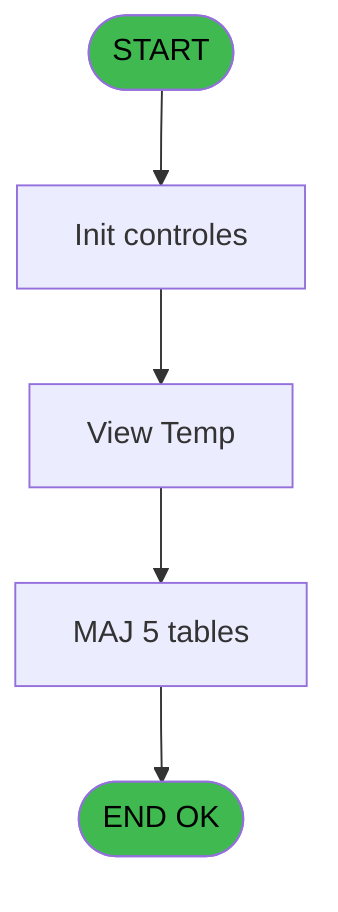

# REF IDE 619 - Calcul Cloture OB

> **Analyse**: Phases 1-4 2026-02-03 13:11 -> 13:11 (19s) | Assemblage 13:11
> **Pipeline**: V7.2 Enrichi
> **Structure**: 4 onglets (Resume | Ecrans | Donnees | Connexions)

<!-- TAB:Resume -->

## 1. FICHE D'IDENTITE

| Attribut | Valeur |
|----------|--------|
| Projet | REF |
| IDE Position | 619 |
| Nom Programme | Calcul Cloture OB |
| Fichier source | `Prg_619.xml` |
| Dossier IDE | General |
| Taches | 11 (1 ecrans visibles) |
| Tables modifiees | 5 |
| Programmes appeles | 1 |

## 2. DESCRIPTION FONCTIONNELLE

**Calcul Cloture OB** assure la gestion complete de ce processus, accessible depuis [Cloture OB (IDE 621)](REF-IDE-621.md).

Le flux de traitement s'organise en **3 blocs fonctionnels** :

- **Traitement** (8 taches) : traitements metier divers
- **Saisie** (2 taches) : ecrans de saisie utilisateur (formulaires, champs, donnees)
- **Calcul** (1 tache) : calculs de montants, stocks ou compteurs

**Donnees modifiees** : 5 tables en ecriture (comptable________cte, vente, total_ventes_par_mop_temp, web_api_cashup, web_api_cashup_details).

Detail : phases du traitement

#### Phase 1 : Calcul (1 tache)

- **619** - Calcul Cloture OB

#### Phase 2 : Traitement (8 taches)

- **619.1** - Chargement Cloture OB
- **619.1.1** - Cloture OB Detail
- **619.1.1.1** - Write Temp Files
- **619.2** - Chargement Cloture OB
- **619.2.1** - Cloture OB Detail
- **619.2.1.1** - Write Temp Files
- **619.3.1** - OD
- **619.4** - View Temp **[[ECRAN]](#ecran-t11)**

#### Phase 3 : Saisie (2 taches)

- **619.3** - Chargement Ventes
- **619.3.2** - Ventes

#### Tables impactees

| Table | Operations | Role metier |
|-------|-----------|-------------|
| total_ventes_par_mop_temp | **W**/L (5 usages) | Donnees de ventes |
| web_api_cashup_details | **W** (2 usages) |  |
| vente | **W** (1 usages) | Donnees de ventes |
| web_api_cashup | **W** (1 usages) |  |
| comptable________cte | **W** (1 usages) |  |

## 3. BLOCS FONCTIONNELS

### 3.1 Calcul (1 tache)

Calculs metier : montants, stocks, compteurs.

---

#### 619 - Calcul Cloture OB

**Role** : Calcul : Calcul Cloture OB.

### 3.2 Traitement (8 taches)

Traitements internes.

---

#### 619.1 - Chargement Cloture OB

**Role** : Traitement : Chargement Cloture OB.

---

#### 619.1.1 - Cloture OB Detail

**Role** : Traitement : Cloture OB Detail.

---

#### 619.1.1.1 - Write Temp Files

**Role** : Traitement : Write Temp Files.

---

#### 619.2 - Chargement Cloture OB

**Role** : Traitement : Chargement Cloture OB.

---

#### 619.2.1 - Cloture OB Detail

**Role** : Traitement : Cloture OB Detail.

---

#### 619.2.1.1 - Write Temp Files

**Role** : Traitement : Write Temp Files.

---

#### 619.3.1 - OD

**Role** : Traitement interne.

---

#### 619.4 - View Temp [[ECRAN]](#ecran-t11)

**Role** : Traitement : View Temp.
**Ecran** : 738 x 0 DLU | [Voir mockup](#ecran-t11)

### 3.3 Saisie (2 taches)

Ce bloc traite la saisie des donnees de la transaction.

---

#### 619.3 - Chargement Ventes

**Role** : Saisie des donnees : Chargement Ventes.

---

#### 619.3.2 - Ventes

**Role** : Saisie des donnees : Ventes.

## 5. REGLES METIER

*(Aucune regle metier identifiee)*

## 6. CONTEXTE

- **Appele par**: [Cloture OB (IDE 621)](REF-IDE-621.md)
- **Appelle**: 1 programmes | **Tables**: 6 (W:5 R:0 L:2) | **Taches**: 11 | **Expressions**: 2

<!-- TAB:Ecrans -->

## 8. ECRANS

### 8.1 Forms visibles (1 / 11)

| # | Position | Tache | Nom | Type | Largeur | Hauteur | Bloc |
|---|----------|-------|-----|------|---------|---------|------|
| 1 | 619.4 | 619.4 | View Temp | Type0 | 738 | 0 | Traitement |

### 8.2 Mockups Ecrans

---

#### 619.4 - View Temp
**Tache** : [619.4](#t11) | **Type** : Type0 | **Dimensions** : 738 x 0 DLU
**Bloc** : Traitement | **Titre IDE** : View Temp

<!-- FORM-DATA:
{
    "width":  738,
    "vFactor":  8,
    "type":  "Type0",
    "hFactor":  4,
    "controls":  [
                     {
                         "x":  8,
                         "type":  "table",
                         "var":  "",
                         "name":  "",
                         "titleH":  12,
                         "color":  "",
                         "w":  708,
                         "y":  8,
                         "fmt":  "",
                         "parent":  null,
                         "text":  "",
                         "rowH":  13,
                         "h":  184,
                         "cols":  [
                                      {
                                          "title":  "societe",
                                          "layer":  1,
                                          "w":  30
                                      },
                                      {
                                          "title":  "date_comptable",
                                          "layer":  2,
                                          "w":  68
                                      },
                                      {
                                          "title":  "service",
                                          "layer":  3,
                                          "w":  33
                                      },
                                      {
                                          "title":  "mop",
                                          "layer":  4,
                                          "w":  29
                                      },
                                      {
                                          "title":  "montant_calcule",
                                          "layer":  5,
                                          "w":  98
                                      },
                                      {
                                          "title":  "montant_saisi",
                                          "layer":  6,
                                          "w":  98
                                      },
                                      {
                                          "title":  "ecart",
                                          "layer":  7,
                                          "w":  38
                                      }
                                  ],
                         "rows":  7
                     },
                     {
                         "x":  12,
                         "type":  "edit",
                         "var":  "",
                         "y":  23,
                         "w":  9,
                         "fmt":  "",
                         "name":  "societe",
                         "h":  10,
                         "color":  "",
                         "text":  "",
                         "parent":  1
                     },
                     {
                         "x":  42,
                         "type":  "edit",
                         "var":  "",
                         "y":  23,
                         "w":  61,
                         "fmt":  "",
                         "name":  "date_comptable",
                         "h":  10,
                         "color":  "",
                         "text":  "",
                         "parent":  1
                     },
                     {
                         "x":  110,
                         "type":  "edit",
                         "var":  "",
                         "y":  23,
                         "w":  26,
                         "fmt":  "",
                         "name":  "service",
                         "h":  10,
                         "color":  "",
                         "text":  "",
                         "parent":  1
                     },
                     {
                         "x":  143,
                         "type":  "edit",
                         "var":  "",
                         "y":  23,
                         "w":  22,
                         "fmt":  "",
                         "name":  "mop",
                         "h":  8,
                         "color":  "",
                         "text":  "",
                         "parent":  1
                     },
                     {
                         "x":  172,
                         "type":  "edit",
                         "var":  "",
                         "y":  23,
                         "w":  91,
                         "fmt":  "",
                         "name":  "montant_calcule",
                         "h":  8,
                         "color":  "",
                         "text":  "",
                         "parent":  1
                     },
                     {
                         "x":  270,
                         "type":  "edit",
                         "var":  "",
                         "y":  23,
                         "w":  91,
                         "fmt":  "",
                         "name":  "montant_saisi",
                         "h":  8,
                         "color":  "",
                         "text":  "",
                         "parent":  1
                     },
                     {
                         "x":  368,
                         "type":  "edit",
                         "var":  "",
                         "y":  23,
                         "w":  31,
                         "fmt":  "",
                         "name":  "ecart",
                         "h":  10,
                         "color":  "",
                         "text":  "",
                         "parent":  1
                     }
                 ],
    "taskId":  "619.4",
    "height":  0
}
-->

<strong>Champs : 7 champs</strong>

| Pos (x,y) | Nom | Variable | Type |
|-----------|-----|----------|------|
| 12,23 | societe | - | edit |
| 42,23 | date_comptable | - | edit |
| 110,23 | service | - | edit |
| 143,23 | mop | - | edit |
| 172,23 | montant_calcule | - | edit |
| 270,23 | montant_saisi | - | edit |
| 368,23 | ecart | - | edit |

## 9. NAVIGATION

Ecran unique: **View Temp**

### 9.3 Structure hierarchique (11 taches)

| Position | Tache | Type | Dimensions | Bloc |
|----------|-------|------|------------|------|
| **619.1** | [**Calcul Cloture OB** (619)](#t1) | - | - | Calcul |
| **619.2** | [**Chargement Cloture OB** (619.1)](#t2) | - | - | Traitement |
| 619.2.1 | [Cloture OB Detail (619.1.1)](#t3) | - | - | |
| 619.2.2 | [Write Temp Files (619.1.1.1)](#t4) | - | - | |
| 619.2.3 | [Chargement Cloture OB (619.2)](#t5) | - | - | |
| 619.2.4 | [Cloture OB Detail (619.2.1)](#t6) | - | - | |
| 619.2.5 | [Write Temp Files (619.2.1.1)](#t7) | - | - | |
| 619.2.6 | [OD (619.3.1)](#t9) | - | - | |
| 619.2.7 | [View Temp (619.4)](#t11) [mockup](#ecran-t11) | - | 738x0 | |
| **619.3** | [**Chargement Ventes** (619.3)](#t8) | - | - | Saisie |
| 619.3.1 | [Ventes (619.3.2)](#t10) | - | - | |

### 9.4 Algorigramme

> **Legende**: Vert = START/END OK | Rouge = END KO | Bleu = Decisions
> *Algorigramme auto-genere. Utiliser `/algorigramme` pour une synthese metier detaillee.*

<!-- TAB:Donnees -->

## 10. TABLES

### Tables utilisees (6)

| ID | Nom | Description | Type | R | W | L | Usages |
|----|-----|-------------|------|---|---|---|--------|
| 40 | comptable________cte |  | DB |   | **W** |   | 1 |
| 263 | vente | Donnees de ventes | DB |   | **W** |   | 1 |
| 496 | ventes_par_imputation | Donnees de ventes | TMP |   |   | L | 2 |
| 539 | total_ventes_par_mop_temp | Donnees de ventes | TMP |   | **W** | L | 5 |
| 915 | web_api_cashup |  | DB |   | **W** |   | 1 |
| 916 | web_api_cashup_details |  | DB |   | **W** |   | 2 |

### Colonnes par table (3 / 5 tables avec colonnes identifiees)

Table 40 - comptable________cte (**W**) - 1 usages

| Lettre | Variable | Acces | Type |
|--------|----------|-------|------|
| A | P.i.Date Comptable | W | Date |

Table 263 - vente (**W**) - 1 usages

*Table utilisee uniquement en Link ou aucune colonne Real identifiee dans le DataView.*

Table 539 - total_ventes_par_mop_temp (**W**/L) - 5 usages

*Table utilisee uniquement en Link ou aucune colonne Real identifiee dans le DataView.*

Table 915 - web_api_cashup (**W**) - 1 usages

| Lettre | Variable | Acces | Type |
|--------|----------|-------|------|
| B | v.CashupId | W | Unicode |

Table 916 - web_api_cashup_details (**W**) - 2 usages

| Lettre | Variable | Acces | Type |
|--------|----------|-------|------|
| B | v.CashupId | W | Unicode |

## 11. VARIABLES

### 11.1 Parametres entrants (2)

Variables recues du programme appelant ([Cloture OB (IDE 621)](REF-IDE-621.md)).

| Lettre | Nom | Type | Usage dans |
|--------|-----|------|-----------|
| A | P.i.Date Comptable | Date | - |
| B | P.i.Service | Unicode | - |

### 11.2 Variables de session (1)

Variables persistantes pendant toute la session.

| Lettre | Nom | Type | Usage dans |
|--------|-----|------|-----------|
| C | v.Service | Unicode | - |

## 12. EXPRESSIONS

**2 / 2 expressions decodees (100%)**

### 12.1 Repartition par type

| Type | Expressions | Regles |
|------|-------------|--------|
| CALCULATION | 2 | 0 |

### 12.2 Expressions cles par type

#### CALCULATION (2 expressions)

| Type | IDE | Expression | Regle |
|------|-----|------------|-------|
| CALCULATION | 2 | `DbDel('{539,-1}'DSOURCE,'')` | - |
| CALCULATION | 1 | `DbDel('{496,-1}'DSOURCE,'')` | - |

<!-- TAB:Connexions -->

## 13. GRAPHE D'APPELS

### 13.1 Chaine depuis Main (Callers)

Main -> ... -> [Cloture OB (IDE 621)](REF-IDE-621.md) -> **Calcul Cloture OB (IDE 619)**

### 13.2 Callers

| IDE | Nom Programme | Nb Appels |
|-----|---------------|-----------|
| [621](REF-IDE-621.md) | Cloture OB | 1 |

### 13.3 Callees (programmes appeles)

### 13.4 Detail Callees avec contexte

| IDE | Nom Programme | Appels | Contexte |
|-----|---------------|--------|----------|
| [620](REF-IDE-620.md) | Paiements OB/PMS | 2 | Sous-programme |

## 14. RECOMMANDATIONS MIGRATION

### 14.1 Profil du programme

| Metrique | Valeur | Impact migration |
|----------|--------|-----------------|
| Lignes de logique | 163 | Programme compact |
| Expressions | 2 | Peu de logique |
| Tables WRITE | 5 | Impact modere |
| Sous-programmes | 1 | Peu de dependances |
| Ecrans visibles | 1 | Ecran unique ou traitement batch |
| Code desactive | 1.2% (2 / 163) | Code sain |
| Regles metier | 0 | Pas de regle identifiee |

### 14.2 Plan de migration par bloc

#### Calcul (1 tache: 0 ecran, 1 traitement)

- **Strategie** : Services de calcul purs (Domain Services).
- Migrer la logique de calcul (stock, compteurs, montants)

#### Traitement (8 taches: 1 ecran, 7 traitements)

- **Strategie** : Orchestrateur avec 1 ecrans (Razor/React) et 7 traitements backend (services).
- Les ecrans deviennent des composants UI, les traitements invisibles deviennent des services injectables.
- 1 sous-programme(s) a migrer ou a reutiliser depuis les services existants.
- Decomposer les taches en services unitaires testables.

#### Saisie (2 taches: 0 ecran, 2 traitements)

- **Strategie** : Formulaire React/Blazor avec validation Zod/FluentValidation.
- Validation temps reel cote client + serveur

### 14.3 Dependances critiques

| Dependance | Type | Appels | Impact |
|------------|------|--------|--------|
| comptable________cte | Table WRITE (Database) | 1x | Schema + repository |
| vente | Table WRITE (Database) | 1x | Schema + repository |
| total_ventes_par_mop_temp | Table WRITE (Temp) | 3x | Schema + repository |
| web_api_cashup | Table WRITE (Database) | 1x | Schema + repository |
| web_api_cashup_details | Table WRITE (Database) | 2x | Schema + repository |
| [Paiements OB/PMS (IDE 620)](REF-IDE-620.md) | Sous-programme | 2x | Haute - Sous-programme |

---
*Spec DETAILED generee par Pipeline V7.2 - 2026-02-03 13:11*
