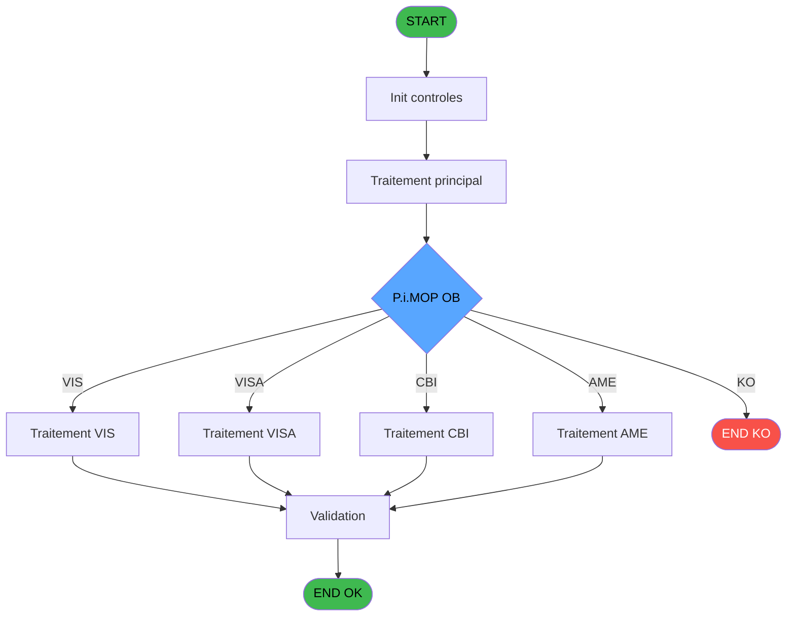

# REF IDE 620 - Paiements OB/PMS

> **Analyse**: Phases 1-4 2026-02-03 13:11 -> 13:11 (18s) | Assemblage 13:11
> **Pipeline**: V7.2 Enrichi
> **Structure**: 4 onglets (Resume | Ecrans | Donnees | Connexions)

<!-- TAB:Resume -->

## 1. FICHE D'IDENTITE

| Attribut | Valeur |
|----------|--------|
| Projet | REF |
| IDE Position | 620 |
| Nom Programme | Paiements OB/PMS |
| Fichier source | `Prg_620.xml` |
| Dossier IDE | General |
| Taches | 1 (0 ecrans visibles) |
| Tables modifiees | 0 |
| Programmes appeles | 0 |

## 2. DESCRIPTION FONCTIONNELLE

**Paiements OB/PMS** assure la gestion complete de ce processus, accessible depuis [Calcul Cloture OB (IDE 619)](REF-IDE-619.md).

Le flux de traitement s'organise en **1 blocs fonctionnels** :

- **Reglement** (1 tache) : gestion des moyens de paiement et reglements

## 3. BLOCS FONCTIONNELS

### 3.1 Reglement (1 tache)

Gestion des moyens de paiement : 1 tache de reglement.

---

#### 620 - Paiements OB/PMS

**Role** : Gestion du reglement : Paiements OB/PMS.

## 5. REGLES METIER

*(Aucune regle metier identifiee)*

## 6. CONTEXTE

- **Appele par**: [Calcul Cloture OB (IDE 619)](REF-IDE-619.md)
- **Appelle**: 0 programmes | **Tables**: 0 (W:0 R:0 L:0) | **Taches**: 1 | **Expressions**: 2

<!-- TAB:Ecrans -->

## 8. ECRANS

*(Programme sans ecran visible)*

## 9. NAVIGATION

### 9.3 Structure hierarchique (1 tache)

| Position | Tache | Type | Dimensions | Bloc |
|----------|-------|------|------------|------|
| **620.1** | [**Paiements OB/PMS** (620)](#t1) | - | - | Reglement |

### 9.4 Algorigramme

> **Legende**: Vert = START/END OK | Rouge = END KO | Bleu = Decisions
> *Algorigramme auto-genere. Utiliser `/algorigramme` pour une synthese metier detaillee.*

<!-- TAB:Donnees -->

## 10. TABLES

### Tables utilisees (0)

| ID | Nom | Description | Type | R | W | L | Usages |
|----|-----|-------------|------|---|---|---|--------|

### Colonnes par table (0 / 0 tables avec colonnes identifiees)

## 11. VARIABLES

### 11.1 Parametres entrants (2)

Variables recues du programme appelant ([Calcul Cloture OB (IDE 619)](REF-IDE-619.md)).

| Lettre | Nom | Type | Usage dans |
|--------|-----|------|-----------|
| A | P.i.MOP OB | Unicode | 2x parametre entrant |
| B | P.o.MOP PMS | Unicode | - |

## 12. EXPRESSIONS

**2 / 2 expressions decodees (100%)**

### 12.1 Repartition par type

| Type | Expressions | Regles |
|------|-------------|--------|
| CONDITION | 2 | 0 |

### 12.2 Expressions cles par type

#### CONDITION (2 expressions)

| Type | IDE | Expression | Regle |
|------|-----|------------|-------|
| CONDITION | 2 | `IF(InStr(Upper(P.i.MOP OB [A]),'BANK')<>0,'VISA',
IF(InStr(Upper(P.i.MOP OB [A]),'AMERICAN')<>0,'AMEX',
IF(InStr(Upper(P.i.MOP OB [A]),'AMEX')<>0,'AMEX',
IF(InStr(Upper(P.i.MOP OB [A]),'WECHAT')<>0,'WECH',
IF(InStr(Upper(P.i.MOP OB [A]),'APLIPAY')<>0,'ALIP',
IF(InStr(Upper(P.i.MOP OB [A]),'CLUB MED')<>0,'OD',
IF(InStr(Upper(P.i.MOP OB [A]),'GIFT PASS')<>0,'GP',Upper(P.i.MOP OB [A]))))))))` | - |
| CONDITION | 1 | `CASE(P.i.MOP OB [A],'VIS','VISA','CBI','VISA','AME','AMEX','AMI','AMEX','CAS','CASH','OD','OD','WEC','WECH','ALI','ALIP','ACB','CCAU','UNI','UNIO',Trim(P.i.MOP OB [A]))` | - |

<!-- TAB:Connexions -->

## 13. GRAPHE D'APPELS

### 13.1 Chaine depuis Main (Callers)

Main -> ... -> [Calcul Cloture OB (IDE 619)](REF-IDE-619.md) -> **Paiements OB/PMS (IDE 620)**

### 13.2 Callers

| IDE | Nom Programme | Nb Appels |
|-----|---------------|-----------|
| [619](REF-IDE-619.md) | Calcul Cloture OB | 2 |

### 13.3 Callees (programmes appeles)

### 13.4 Detail Callees avec contexte

| IDE | Nom Programme | Appels | Contexte |
|-----|---------------|--------|----------|
| - | (aucun) | - | - |

## 14. RECOMMANDATIONS MIGRATION

### 14.1 Profil du programme

| Metrique | Valeur | Impact migration |
|----------|--------|-----------------|
| Lignes de logique | 5 | Programme compact |
| Expressions | 2 | Peu de logique |
| Tables WRITE | 0 | Impact faible |
| Sous-programmes | 0 | Peu de dependances |
| Ecrans visibles | 0 | Ecran unique ou traitement batch |
| Code desactive | 20% (1 / 5) | Nettoyer avant migration |
| Regles metier | 0 | Pas de regle identifiee |

### 14.2 Plan de migration par bloc

#### Reglement (1 tache: 0 ecran, 1 traitement)

- **Strategie** : Service `IReglementService` avec pattern Strategy par mode de paiement.
- Integration TPE si applicable

### 14.3 Dependances critiques

| Dependance | Type | Appels | Impact |
|------------|------|--------|--------|

---
*Spec DETAILED generee par Pipeline V7.2 - 2026-02-03 13:11*
