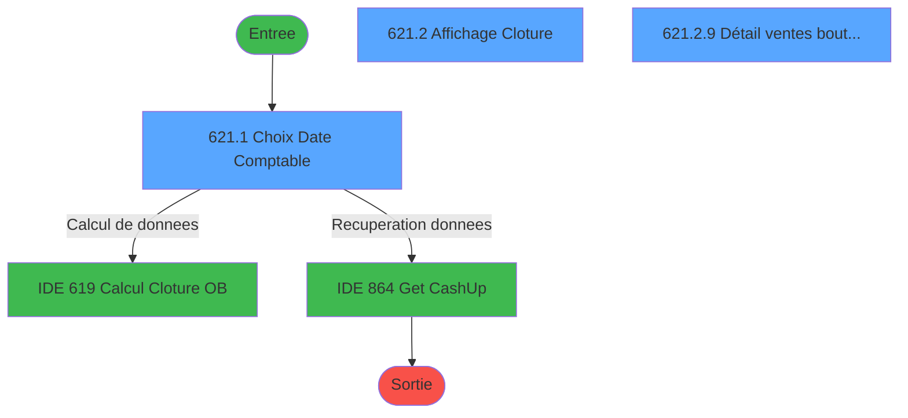
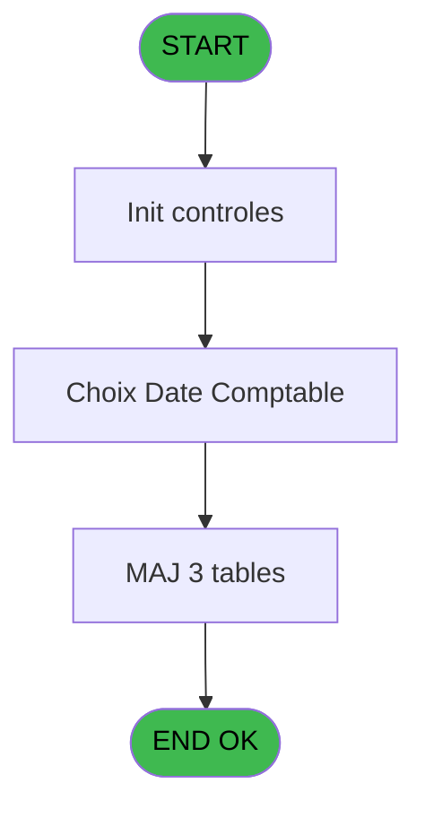
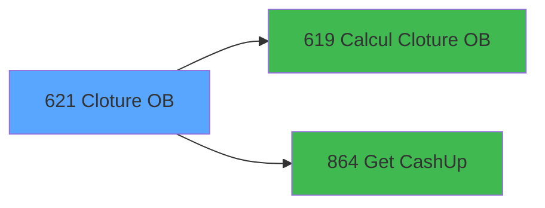

# REF IDE 621 - Cloture OB

> **Analyse**: Phases 1-4 2026-02-03 13:11 -> 13:12 (20s) | Assemblage 13:12
> **Pipeline**: V7.2 Enrichi
> **Structure**: 4 onglets (Resume | Ecrans | Donnees | Connexions)

<!-- TAB:Resume -->

## 1. FICHE D'IDENTITE

| Attribut | Valeur |
|----------|--------|
| Projet | REF |
| IDE Position | 621 |
| Nom Programme | Cloture OB |
| Fichier source | `Prg_621.xml` |
| Dossier IDE | General |
| Taches | 14 (3 ecrans visibles) |
| Tables modifiees | 3 |
| Programmes appeles | 2 |
| :warning: Statut | **ORPHELIN_POTENTIEL** |

## 2. DESCRIPTION FONCTIONNELLE

**Cloture OB** assure la gestion complete de ce processus.

Le flux de traitement s'organise en **6 blocs fonctionnels** :

- **Traitement** (7 taches) : traitements metier divers
- **Creation** (3 taches) : insertion d'enregistrements en base (mouvements, prestations)
- **Saisie** (1 tache) : ecrans de saisie utilisateur (formulaires, champs, donnees)
- **Impression** (1 tache) : generation de tickets et documents
- **Calcul** (1 tache) : calculs de montants, stocks ou compteurs
- **Consultation** (1 tache) : ecrans de recherche, selection et consultation

**Donnees modifiees** : 3 tables en ecriture (total_od, tickets_tpe, total_ventes_par_mop_temp).

Detail : phases du traitement

#### Phase 1 : Traitement (7 taches)

- **621** - Cloture OB
- **621.2.1** - Recup Num TPE
- **621.2.2** - Recup Num TPE
- **621.2.3.1** - Création Total
- **621.2.4.1** - Création Total
- **621.2.6** - PDC Boutique (QV)
- **621.2.7** - Correspittivi

Delegue a : [Get CashUp (IDE 864)](REF-IDE-864.md)

#### Phase 2 : Calcul (1 tache)

- **621.1** - Choix Date Comptable **[[ECRAN]](#ecran-t2)**

Delegue a : [Calcul Cloture OB (IDE 619)](REF-IDE-619.md)

#### Phase 3 : Consultation (1 tache)

- **621.2** - Affichage Cloture **[[ECRAN]](#ecran-t3)**

Delegue a : [Get CashUp (IDE 864)](REF-IDE-864.md)

#### Phase 4 : Creation (3 taches)

- **621.2.3** - Creation Telecollectes
- **621.2.4** - Creation Telecollectes
- **621.2.5** - Creation OD

#### Phase 5 : Impression (1 tache)

- **621.2.8** - Edition A4

#### Phase 6 : Saisie (1 tache)

- **621.2.9** - Détail ventes boutique **[[ECRAN]](#ecran-t14)**

#### Tables impactees

| Table | Operations | Role metier |
|-------|-----------|-------------|
| total_ventes_par_mop_temp | R/**W**/L (5 usages) | Donnees de ventes |
| tickets_tpe | **W**/L (4 usages) |  |
| total_od | **W** (1 usages) |  |

## 3. BLOCS FONCTIONNELS

### 3.1 Traitement (7 taches)

Traitements internes.

---

#### 621 - Cloture OB

**Role** : Tache d'orchestration : point d'entree du programme (7 sous-taches). Coordonne l'enchainement des traitements.

6 sous-taches directes

| Tache | Nom | Bloc |
|-------|-----|------|
| [621.2.1](#t4) | Recup Num TPE | Traitement |
| [621.2.2](#t5) | Recup Num TPE | Traitement |
| [621.2.3.1](#t7) | Création Total | Traitement |
| [621.2.4.1](#t9) | Création Total | Traitement |
| [621.2.6](#t11) | PDC Boutique (QV) | Traitement |
| [621.2.7](#t12) | Correspittivi | Traitement |

**Delegue a** : [Calcul Cloture OB (IDE 619)](REF-IDE-619.md), [Get CashUp (IDE 864)](REF-IDE-864.md)

---

#### 621.2.1 - Recup Num TPE

**Role** : Consultation/chargement : Recup Num TPE.
**Delegue a** : [Get CashUp (IDE 864)](REF-IDE-864.md)

---

#### 621.2.2 - Recup Num TPE

**Role** : Consultation/chargement : Recup Num TPE.
**Delegue a** : [Get CashUp (IDE 864)](REF-IDE-864.md)

---

#### 621.2.3.1 - Création Total

**Role** : Traitement : Création Total.
**Delegue a** : [Get CashUp (IDE 864)](REF-IDE-864.md)

---

#### 621.2.4.1 - Création Total

**Role** : Traitement : Création Total.
**Delegue a** : [Get CashUp (IDE 864)](REF-IDE-864.md)

---

#### 621.2.6 - PDC Boutique (QV)

**Role** : Traitement : PDC Boutique (QV).
**Delegue a** : [Get CashUp (IDE 864)](REF-IDE-864.md)

---

#### 621.2.7 - Correspittivi

**Role** : Traitement : Correspittivi.
**Delegue a** : [Get CashUp (IDE 864)](REF-IDE-864.md)

### 3.2 Calcul (1 tache)

Calculs metier : montants, stocks, compteurs.

---

#### 621.1 - Choix Date Comptable [[ECRAN]](#ecran-t2)

**Role** : Selection par l'operateur : Choix Date Comptable.
**Ecran** : 656 x 201 DLU | [Voir mockup](#ecran-t2)
**Variables liees** : B (v.Date Comptable), C (v.Date Validée)
**Delegue a** : [Calcul Cloture OB (IDE 619)](REF-IDE-619.md)

### 3.3 Consultation (1 tache)

Ecrans de recherche et consultation.

---

#### 621.2 - Affichage Cloture [[ECRAN]](#ecran-t3)

**Role** : Reinitialisation : Affichage Cloture.
**Ecran** : 784 x 247 DLU | [Voir mockup](#ecran-t3)

### 3.4 Creation (3 taches)

Insertion de nouveaux enregistrements en base.

---

#### 621.2.3 - Creation Telecollectes

**Role** : Creation d'enregistrement : Creation Telecollectes.

---

#### 621.2.4 - Creation Telecollectes

**Role** : Creation d'enregistrement : Creation Telecollectes.

---

#### 621.2.5 - Creation OD

**Role** : Creation d'enregistrement : Creation OD.

### 3.5 Impression (1 tache)

Generation des documents et tickets.

---

#### 621.2.8 - Edition A4

**Role** : Generation du document : Edition A4.

### 3.6 Saisie (1 tache)

L'operateur saisit les donnees de la transaction via 1 ecran (Détail ventes boutique).

---

#### 621.2.9 - Détail ventes boutique [[ECRAN]](#ecran-t14)

**Role** : Saisie des donnees : Détail ventes boutique.
**Ecran** : 578 x 365 DLU | [Voir mockup](#ecran-t14)

## 5. REGLES METIER

*(Aucune regle metier identifiee)*

## 6. CONTEXTE

- **Appele par**: (aucun)
- **Appelle**: 2 programmes | **Tables**: 17 (W:3 R:7 L:11) | **Taches**: 14 | **Expressions**: 7

<!-- TAB:Ecrans -->

## 8. ECRANS

### 8.1 Forms visibles (3 / 14)

| # | Position | Tache | Nom | Type | Largeur | Hauteur | Bloc |
|---|----------|-------|-----|------|---------|---------|------|
| 1 | 621.1 | 621.1 | Choix Date Comptable | Type0 | 656 | 201 | Calcul |
| 2 | 621.2 | 621.2 | Affichage Cloture | Type0 | 784 | 247 | Consultation |
| 3 | 621.2.9 | 621.2.9 | Détail ventes boutique | Type0 | 578 | 365 | Saisie |

### 8.2 Mockups Ecrans

---

#### 621.1 - Choix Date Comptable
**Tache** : [621.1](#t2) | **Type** : Type0 | **Dimensions** : 656 x 201 DLU
**Bloc** : Calcul | **Titre IDE** : Choix Date Comptable

<!-- FORM-DATA:
{
    "width":  656,
    "vFactor":  8,
    "type":  "Type0",
    "hFactor":  8,
    "controls":  [
                     {
                         "x":  0,
                         "type":  "label",
                         "var":  "",
                         "y":  1,
                         "w":  638,
                         "fmt":  "",
                         "name":  "",
                         "h":  148,
                         "color":  "",
                         "text":  "",
                         "parent":  null
                     },
                     {
                         "x":  2,
                         "type":  "label",
                         "var":  "",
                         "y":  1,
                         "w":  638,
                         "fmt":  "",
                         "name":  "",
                         "h":  18,
                         "color":  "",
                         "text":  "",
                         "parent":  null
                     },
                     {
                         "x":  292,
                         "type":  "label",
                         "var":  "",
                         "y":  45,
                         "w":  279,
                         "fmt":  "",
                         "name":  "",
                         "h":  18,
                         "color":  "",
                         "text":  "Date comptable demandée",
                         "parent":  null
                     },
                     {
                         "x":  292,
                         "type":  "label",
                         "var":  "",
                         "y":  100,
                         "w":  128,
                         "fmt":  "",
                         "name":  "",
                         "h":  13,
                         "color":  "",
                         "text":  "Type édition",
                         "parent":  null
                     },
                     {
                         "x":  2,
                         "type":  "label",
                         "var":  "",
                         "y":  174,
                         "w":  638,
                         "fmt":  "",
                         "name":  "",
                         "h":  24,
                         "color":  "",
                         "text":  "",
                         "parent":  null
                     },
                     {
                         "x":  9,
                         "type":  "edit",
                         "var":  "",
                         "y":  6,
                         "w":  267,
                         "fmt":  "30",
                         "name":  "VG.USER",
                         "h":  8,
                         "color":  "",
                         "text":  "",
                         "parent":  null
                     },
                     {
                         "x":  395,
                         "type":  "edit",
                         "var":  "",
                         "y":  6,
                         "w":  232,
                         "fmt":  "WWW  DD MMM YYYYT",
                         "name":  "",
                         "h":  8,
                         "color":  "",
                         "text":  "",
                         "parent":  null
                     },
                     {
                         "x":  85,
                         "type":  "image",
                         "var":  "",
                         "y":  45,
                         "w":  147,
                         "fmt":  "",
                         "name":  "",
                         "h":  45,
                         "color":  "",
                         "text":  "",
                         "parent":  null
                     },
                     {
                         "x":  292,
                         "type":  "edit",
                         "var":  "",
                         "y":  68,
                         "w":  279,
                         "fmt":  "",
                         "name":  "v.Date Comptable Demandée",
                         "h":  18,
                         "color":  "6",
                         "text":  "",
                         "parent":  null
                     },
                     {
                         "x":  446,
                         "type":  "combobox",
                         "var":  "",
                         "y":  100,
                         "w":  125,
                         "fmt":  "",
                         "name":  "",
                         "h":  12,
                         "color":  "",
                         "text":  "",
                         "parent":  null
                     },
                     {
                         "x":  473,
                         "type":  "button",
                         "var":  "",
                         "y":  177,
                         "w":  154,
                         "fmt":  "\u0026Validation",
                         "name":  "Bt.Validation",
                         "h":  18,
                         "color":  "",
                         "text":  "",
                         "parent":  null
                     }
                 ],
    "taskId":  "621.1",
    "height":  201
}
-->

<strong>Champs : 4 champs</strong>

| Pos (x,y) | Nom | Variable | Type |
|-----------|-----|----------|------|
| 9,6 | VG.USER | - | edit |
| 395,6 | WWW  DD MMM YYYYT | - | edit |
| 292,68 | v.Date Comptable Demandée | - | edit |
| 446,100 | (sans nom) | - | combobox |

<strong>Boutons : 1 boutons</strong>

| Bouton | Pos (x,y) | Action |
|--------|-----------|--------|
| Validation | 473,177 | Valide la saisie et enregistre |

---

#### 621.2 - Affichage Cloture
**Tache** : [621.2](#t3) | **Type** : Type0 | **Dimensions** : 784 x 247 DLU
**Bloc** : Consultation | **Titre IDE** : Affichage Cloture

<!-- FORM-DATA:
{
    "width":  784,
    "vFactor":  8,
    "type":  "Type0",
    "hFactor":  8,
    "controls":  [
                     {
                         "x":  3,
                         "type":  "label",
                         "var":  "",
                         "y":  1,
                         "w":  775,
                         "fmt":  "",
                         "name":  "",
                         "h":  18,
                         "color":  "",
                         "text":  "",
                         "parent":  null
                     },
                     {
                         "x":  411,
                         "type":  "label",
                         "var":  "",
                         "y":  5,
                         "w":  190,
                         "fmt":  "",
                         "name":  "",
                         "h":  10,
                         "color":  "7",
                         "text":  "Date comptable",
                         "parent":  null
                     },
                     {
                         "x":  3,
                         "type":  "label",
                         "var":  "",
                         "y":  216,
                         "w":  775,
                         "fmt":  "",
                         "name":  "",
                         "h":  24,
                         "color":  "",
                         "text":  "",
                         "parent":  null
                     },
                     {
                         "x":  35,
                         "type":  "table",
                         "var":  "",
                         "name":  "",
                         "titleH":  12,
                         "color":  "110",
                         "w":  714,
                         "y":  27,
                         "fmt":  "",
                         "parent":  null,
                         "text":  "",
                         "rowH":  15,
                         "h":  180,
                         "cols":  [
                                      {
                                          "title":  "MOP",
                                          "layer":  1,
                                          "w":  106
                                      },
                                      {
                                          "title":  "Montant Saisi",
                                          "layer":  2,
                                          "w":  244
                                      },
                                      {
                                          "title":  "Montant Calculé",
                                          "layer":  3,
                                          "w":  234
                                      },
                                      {
                                          "title":  "Ecart",
                                          "layer":  4,
                                          "w":  96
                                      }
                                  ],
                         "rows":  4
                     },
                     {
                         "x":  610,
                         "type":  "edit",
                         "var":  "",
                         "y":  5,
                         "w":  158,
                         "fmt":  "##/##/####",
                         "name":  "",
                         "h":  10,
                         "color":  "7",
                         "text":  "",
                         "parent":  null
                     },
                     {
                         "x":  10,
                         "type":  "edit",
                         "var":  "",
                         "y":  6,
                         "w":  197,
                         "fmt":  "30",
                         "name":  "",
                         "h":  8,
                         "color":  "",
                         "text":  "",
                         "parent":  null
                     },
                     {
                         "x":  38,
                         "type":  "edit",
                         "var":  "",
                         "y":  41,
                         "w":  101,
                         "fmt":  "",
                         "name":  "mop",
                         "h":  12,
                         "color":  "110",
                         "text":  "",
                         "parent":  6
                     },
                     {
                         "x":  155,
                         "type":  "edit",
                         "var":  "",
                         "y":  41,
                         "w":  222,
                         "fmt":  "N## ### ### ###.###Z",
                         "name":  "cob_montant_ttc",
                         "h":  12,
                         "color":  "110",
                         "text":  "",
                         "parent":  6
                     },
                     {
                         "x":  390,
                         "type":  "edit",
                         "var":  "",
                         "y":  42,
                         "w":  222,
                         "fmt":  "N## ### ### ###.###Z",
                         "name":  "montant_calcule",
                         "h":  12,
                         "color":  "6",
                         "text":  "",
                         "parent":  6
                     },
                     {
                         "x":  626,
                         "type":  "edit",
                         "var":  "",
                         "y":  42,
                         "w":  75,
                         "fmt":  "3",
                         "name":  "ecart",
                         "h":  10,
                         "color":  "110",
                         "text":  "",
                         "parent":  6
                     },
                     {
                         "x":  21,
                         "type":  "button",
                         "var":  "",
                         "y":  219,
                         "w":  154,
                         "fmt":  "\u0026Abandon",
                         "name":  "",
                         "h":  18,
                         "color":  "",
                         "text":  "",
                         "parent":  null
                     },
                     {
                         "x":  315,
                         "type":  "button",
                         "var":  "",
                         "y":  219,
                         "w":  154,
                         "fmt":  "\u0026Détail",
                         "name":  "",
                         "h":  18,
                         "color":  "",
                         "text":  "",
                         "parent":  null
                     },
                     {
                         "x":  614,
                         "type":  "button",
                         "var":  "",
                         "y":  219,
                         "w":  154,
                         "fmt":  "\u0026Validation",
                         "name":  "Bt.Validation Cloture",
                         "h":  18,
                         "color":  "",
                         "text":  "",
                         "parent":  null
                     }
                 ],
    "taskId":  "621.2",
    "height":  247
}
-->

<strong>Champs : 6 champs</strong>

| Pos (x,y) | Nom | Variable | Type |
|-----------|-----|----------|------|
| 610,5 | ##/##/#### | - | edit |
| 10,6 | 30 | - | edit |
| 38,41 | mop | - | edit |
| 155,41 | cob_montant_ttc | - | edit |
| 390,42 | montant_calcule | - | edit |
| 626,42 | ecart | - | edit |

<strong>Boutons : 3 boutons</strong>

| Bouton | Pos (x,y) | Action |
|--------|-----------|--------|
| Abandon | 21,219 | Annule et retour au menu |
| Détail | 315,219 | Bouton fonctionnel |
| Validation | 614,219 | Valide la saisie et enregistre |

---

#### 621.2.9 - Détail ventes boutique
**Tache** : [621.2.9](#t14) | **Type** : Type0 | **Dimensions** : 578 x 365 DLU
**Bloc** : Saisie | **Titre IDE** : Détail ventes boutique

<!-- FORM-DATA:
{
    "width":  578,
    "vFactor":  8,
    "type":  "Type0",
    "hFactor":  4,
    "controls":  [
                     {
                         "x":  8,
                         "type":  "table",
                         "var":  "",
                         "name":  "",
                         "titleH":  12,
                         "color":  "",
                         "w":  563,
                         "y":  8,
                         "fmt":  "",
                         "parent":  null,
                         "text":  "",
                         "rowH":  13,
                         "h":  350,
                         "cols":  [
                                      {
                                          "title":  "Nom",
                                          "layer":  1,
                                          "w":  178
                                      },
                                      {
                                          "title":  "Prénom",
                                          "layer":  2,
                                          "w":  122
                                      },
                                      {
                                          "title":  "Article",
                                          "layer":  3,
                                          "w":  122
                                      },
                                      {
                                          "title":  "Paiement",
                                          "layer":  4,
                                          "w":  44
                                      },
                                      {
                                          "title":  "Montant",
                                          "layer":  5,
                                          "w":  77
                                      }
                                  ],
                         "rows":  5
                     },
                     {
                         "x":  12,
                         "type":  "edit",
                         "var":  "",
                         "y":  23,
                         "w":  171,
                         "fmt":  "",
                         "name":  "nom",
                         "h":  10,
                         "color":  "",
                         "text":  "",
                         "parent":  1
                     },
                     {
                         "x":  190,
                         "type":  "edit",
                         "var":  "",
                         "y":  23,
                         "w":  115,
                         "fmt":  "",
                         "name":  "prenom",
                         "h":  10,
                         "color":  "",
                         "text":  "",
                         "parent":  1
                     },
                     {
                         "x":  312,
                         "type":  "edit",
                         "var":  "",
                         "y":  23,
                         "w":  115,
                         "fmt":  "",
                         "name":  "article",
                         "h":  10,
                         "color":  "",
                         "text":  "",
                         "parent":  1
                     },
                     {
                         "x":  434,
                         "type":  "edit",
                         "var":  "",
                         "y":  23,
                         "w":  37,
                         "fmt":  "",
                         "name":  "paiement",
                         "h":  10,
                         "color":  "",
                         "text":  "",
                         "parent":  1
                     },
                     {
                         "x":  478,
                         "type":  "edit",
                         "var":  "",
                         "y":  23,
                         "w":  70,
                         "fmt":  "",
                         "name":  "montant",
                         "h":  10,
                         "color":  "",
                         "text":  "",
                         "parent":  1
                     }
                 ],
    "taskId":  "621.2.9",
    "height":  365
}
-->

<strong>Champs : 5 champs</strong>

| Pos (x,y) | Nom | Variable | Type |
|-----------|-----|----------|------|
| 12,23 | nom | - | edit |
| 190,23 | prenom | - | edit |
| 312,23 | article | - | edit |
| 434,23 | paiement | - | edit |
| 478,23 | montant | - | edit |

## 9. NAVIGATION

### 9.1 Enchainement des ecrans

**Detail par enchainement :**

| Depuis | Action | Vers | Retour |
|--------|--------|------|--------|
| Choix Date Comptable | Calcul de donnees | [Calcul Cloture OB (IDE 619)](REF-IDE-619.md) | Retour ecran |
| Choix Date Comptable | Recuperation donnees | [Get CashUp (IDE 864)](REF-IDE-864.md) | Retour ecran |

### 9.3 Structure hierarchique (14 taches)

| Position | Tache | Type | Dimensions | Bloc |
|----------|-------|------|------------|------|
| **621.1** | [**Cloture OB** (621)](#t1) | - | - | Traitement |
| 621.1.1 | [Recup Num TPE (621.2.1)](#t4) | - | - | |
| 621.1.2 | [Recup Num TPE (621.2.2)](#t5) | - | - | |
| 621.1.3 | [Création Total (621.2.3.1)](#t7) | - | - | |
| 621.1.4 | [Création Total (621.2.4.1)](#t9) | - | - | |
| 621.1.5 | [PDC Boutique (QV) (621.2.6)](#t11) | - | - | |
| 621.1.6 | [Correspittivi (621.2.7)](#t12) | - | - | |
| **621.2** | [**Choix Date Comptable** (621.1)](#t2) [mockup](#ecran-t2) | - | 656x201 | Calcul |
| **621.3** | [**Affichage Cloture** (621.2)](#t3) [mockup](#ecran-t3) | - | 784x247 | Consultation |
| **621.4** | [**Creation Telecollectes** (621.2.3)](#t6) | - | - | Creation |
| 621.4.1 | [Creation Telecollectes (621.2.4)](#t8) | - | - | |
| 621.4.2 | [Creation OD (621.2.5)](#t10) | - | - | |
| **621.5** | [**Edition A4** (621.2.8)](#t13) | - | - | Impression |
| **621.6** | [**Détail ventes boutique** (621.2.9)](#t14) [mockup](#ecran-t14) | - | 578x365 | Saisie |

### 9.4 Algorigramme

> **Legende**: Vert = START/END OK | Rouge = END KO | Bleu = Decisions
> *Algorigramme auto-genere. Utiliser `/algorigramme` pour une synthese metier detaillee.*

<!-- TAB:Donnees -->

## 10. TABLES

### Tables utilisees (17)

| ID | Nom | Description | Type | R | W | L | Usages |
|----|-----|-------------|------|---|---|---|--------|
| 67 | tables___________tab |  | DB | R |   |   | 1 |
| 69 | initialisation___ini |  | DB |   |   | L | 1 |
| 70 | date_comptable___dat |  | DB |   |   | L | 1 |
| 89 | moyen_paiement___mop |  | DB | R |   |   | 2 |
| 209 | plan_comptable_central |  | DB | R |   |   | 1 |
| 239 | total_od |  | DB |   | **W** |   | 1 |
| 240 | saisie_pdc_boutique |  | DB |   |   | L | 1 |
| 258 | liste_des_tpe |  | DB |   |   | L | 2 |
| 259 | tpe_par_service | Services / filieres | DB | R |   |   | 1 |
| 260 | tickets_tpe |  | DB |   | **W** | L | 4 |
| 496 | ventes_par_imputation | Donnees de ventes | TMP | R |   | L | 2 |
| 539 | total_ventes_par_mop_temp | Donnees de ventes | TMP | R | **W** | L | 5 |
| 712 | services_ims_par_pc | Services / filieres | DB |   |   | L | 1 |
| 834 | tpe_par_terminal |  | DB | R |   |   | 1 |
| 835 | num_tpe_par_service | Services / filieres | DB |   |   | L | 1 |
| 850 | correspittivi_settings |  | DB |   |   | L | 1 |
| 854 | correspittivi_boutique |  | DB |   |   | L | 1 |

### Colonnes par table (9 / 9 tables avec colonnes identifiees)

Table 67 - tables___________tab (R) - 1 usages

| Lettre | Variable | Acces | Type |
|--------|----------|-------|------|
| A | P.i.Service | R | Unicode |
| B | v.Date Comptable | R | Date |
| C | v.Date Validée | R | Logical |
| D | v.Impression A4 / Ticket | R | Alpha |

Table 89 - moyen_paiement___mop (R) - 2 usages

| Lettre | Variable | Acces | Type |
|--------|----------|-------|------|
| E | paiement | R | Unicode |

Table 209 - plan_comptable_central (R) - 1 usages

| Lettre | Variable | Acces | Type |
|--------|----------|-------|------|
| A | v.Date Comptable Demandée | R | Date |
| B | v.Date Comptable | R | Date |

Table 239 - total_od (**W**) - 1 usages

| Lettre | Variable | Acces | Type |
|--------|----------|-------|------|
| A | v.Montant Total Cartes | W | Numeric |
| B | v.total calculé | W | Numeric |

Table 259 - tpe_par_service (R) - 1 usages

| Lettre | Variable | Acces | Type |
|--------|----------|-------|------|
| A | P.i.Service | R | Unicode |
| B | v.Service OK ? | R | Logical |

Table 260 - tickets_tpe (**W**/L) - 4 usages

*Table utilisee uniquement en Link ou aucune colonne Real identifiee dans le DataView.*

Table 496 - ventes_par_imputation (R/L) - 2 usages

*Table utilisee uniquement en Link ou aucune colonne Real identifiee dans le DataView.*

Table 539 - total_ventes_par_mop_temp (R/**W**/L) - 5 usages

| Lettre | Variable | Acces | Type |
|--------|----------|-------|------|
| A | v.num TPE | W | Numeric |
| B | v.num TPE réel | W | Unicode |
| C | v.num terminal générique | W | Numeric |

Table 834 - tpe_par_terminal (R) - 1 usages

| Lettre | Variable | Acces | Type |
|--------|----------|-------|------|
| A | v.Num TPE | R | Numeric |
| B | v.Service OK ? | R | Logical |

## 11. VARIABLES

### 11.1 Parametres entrants (1)

Variables recues en parametre.

| Lettre | Nom | Type | Usage dans |
|--------|-----|------|-----------|
| A | P.i.Service | Unicode | 2x parametre entrant |

### 11.2 Variables de session (3)

Variables persistantes pendant toute la session.

| Lettre | Nom | Type | Usage dans |
|--------|-----|------|-----------|
| B | v.Date Comptable | Date | - |
| C | v.Date Validée | Logical | - |
| D | v.Impression A4 / Ticket | Alpha | - |

### 11.3 Autres (2)

Variables diverses.

| Lettre | Nom | Type | Usage dans |
|--------|-----|------|-----------|
| E | paiement | Unicode | - |
| F | montant | Numeric | - |

## 12. EXPRESSIONS

**7 / 7 expressions decodees (100%)**

### 12.1 Repartition par type

| Type | Expressions | Regles |
|------|-------------|--------|
| CONSTANTE | 5 | 0 |
| OTHER | 1 | 0 |
| CONDITION | 1 | 0 |

### 12.2 Expressions cles par type

#### CONSTANTE (5 expressions)

| Type | IDE | Expression | Regle |
|------|-----|------------|-------|
| CONSTANTE | 5 | `'BOUT'` | - |
| CONSTANTE | 7 | `'A'` | - |
| CONSTANTE | 3 | `'O'` | - |
| CONSTANTE | 1 | `'C'` | - |
| CONSTANTE | 2 | `'VSERV'` | - |

#### OTHER (1 expressions)

| Type | IDE | Expression | Regle |
|------|-----|------------|-------|
| OTHER | 4 | `P.i.Service [A]` | - |

#### CONDITION (1 expressions)

| Type | IDE | Expression | Regle |
|------|-----|------------|-------|
| CONDITION | 6 | `Trim(P.i.Service [A])=''` | - |

<!-- TAB:Connexions -->

## 13. GRAPHE D'APPELS

### 13.1 Chaine depuis Main (Callers)

**Chemin**: (pas de callers directs)

### 13.2 Callers

| IDE | Nom Programme | Nb Appels |
|-----|---------------|-----------|
| - | (aucun) | - |

### 13.3 Callees (programmes appeles)

### 13.4 Detail Callees avec contexte

| IDE | Nom Programme | Appels | Contexte |
|-----|---------------|--------|----------|
| [619](REF-IDE-619.md) | Calcul Cloture OB | 1 | Calcul de donnees |
| [864](REF-IDE-864.md) | Get CashUp | 1 | Recuperation donnees |

## 14. RECOMMANDATIONS MIGRATION

### 14.1 Profil du programme

| Metrique | Valeur | Impact migration |
|----------|--------|-----------------|
| Lignes de logique | 306 | Taille moyenne |
| Expressions | 7 | Peu de logique |
| Tables WRITE | 3 | Impact modere |
| Sous-programmes | 2 | Peu de dependances |
| Ecrans visibles | 3 | Quelques ecrans |
| Code desactive | 0.7% (2 / 306) | Code sain |
| Regles metier | 0 | Pas de regle identifiee |

### 14.2 Plan de migration par bloc

#### Traitement (7 taches: 0 ecran, 7 traitements)

- **Strategie** : 7 service(s) backend injectable(s) (Domain Services).
- 2 sous-programme(s) a migrer ou a reutiliser depuis les services existants.
- Decomposer les taches en services unitaires testables.

#### Calcul (1 tache: 1 ecran, 0 traitement)

- **Strategie** : Services de calcul purs (Domain Services).
- Migrer la logique de calcul (stock, compteurs, montants)

#### Consultation (1 tache: 1 ecran, 0 traitement)

- **Strategie** : Composants de recherche/selection en modales.
- 1 ecran : Affichage Cloture

#### Creation (3 taches: 0 ecran, 3 traitements)

- **Strategie** : Repository pattern avec Entity Framework Core.
- Insertion via `IRepository<T>.CreateAsync()`

#### Impression (1 tache: 0 ecran, 1 traitement)

- **Strategie** : Templates HTML -> PDF via wkhtmltopdf ou Puppeteer.
- `PrintService` injectable avec choix imprimante

#### Saisie (1 tache: 1 ecran, 0 traitement)

- **Strategie** : Formulaire React/Blazor avec validation Zod/FluentValidation.
- Reproduire 1 ecran : Détail ventes boutique
- Validation temps reel cote client + serveur

### 14.3 Dependances critiques

| Dependance | Type | Appels | Impact |
|------------|------|--------|--------|
| total_od | Table WRITE (Database) | 1x | Schema + repository |
| tickets_tpe | Table WRITE (Database) | 2x | Schema + repository |
| total_ventes_par_mop_temp | Table WRITE (Temp) | 1x | Schema + repository |
| [Get CashUp (IDE 864)](REF-IDE-864.md) | Sous-programme | 1x | Normale - Recuperation donnees |
| [Calcul Cloture OB (IDE 619)](REF-IDE-619.md) | Sous-programme | 1x | Normale - Calcul de donnees |

---
*Spec DETAILED generee par Pipeline V7.2 - 2026-02-03 13:12*
