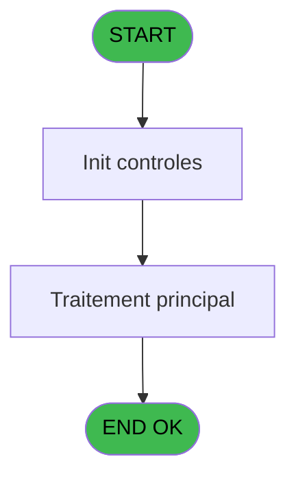
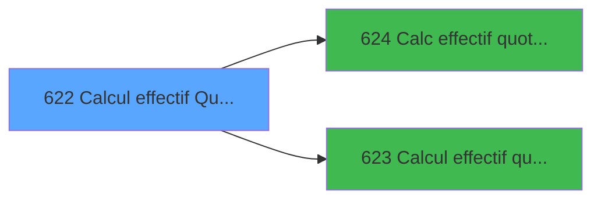

# REF IDE 622 - Calcul effectif Quotidien

> **Analyse**: Phases 1-4 2026-02-03 13:12 -> 13:12 (17s) | Assemblage 13:12
> **Pipeline**: V7.2 Enrichi
> **Structure**: 4 onglets (Resume | Ecrans | Donnees | Connexions)

<!-- TAB:Resume -->

## 1. FICHE D'IDENTITE

| Attribut | Valeur |
|----------|--------|
| Projet | REF |
| IDE Position | 622 |
| Nom Programme | Calcul effectif Quotidien |
| Fichier source | `Prg_622.xml` |
| Dossier IDE | General |
| Taches | 1 (0 ecrans visibles) |
| Tables modifiees | 0 |
| Programmes appeles | 2 |

## 2. DESCRIPTION FONCTIONNELLE

**Calcul effectif Quotidien** assure la gestion complete de ce processus, accessible depuis [Recalcul des effectifs (IDE 814)](REF-IDE-814.md).

Le flux de traitement s'organise en **1 blocs fonctionnels** :

- **Calcul** (1 tache) : calculs de montants, stocks ou compteurs

## 3. BLOCS FONCTIONNELS

### 3.1 Calcul (1 tache)

Calculs metier : montants, stocks, compteurs.

---

#### 622 - Calcul effectif quotidien(TRA) [[ECRAN]](#ecran-t1)

**Role** : Calcul : Calcul effectif quotidien(TRA).
**Ecran** : 310 x 145 DLU | [Voir mockup](#ecran-t1)
**Delegue a** : [Calcul effectif quotidien(TRA) (IDE 623)](REF-IDE-623.md)

## 5. REGLES METIER

*(Aucune regle metier identifiee)*

## 6. CONTEXTE

- **Appele par**: [Recalcul des effectifs (IDE 814)](REF-IDE-814.md)
- **Appelle**: 2 programmes | **Tables**: 0 (W:0 R:0 L:0) | **Taches**: 1 | **Expressions**: 1

<!-- TAB:Ecrans -->

## 8. ECRANS

*(Programme sans ecran visible)*

## 9. NAVIGATION

### 9.3 Structure hierarchique (1 tache)

| Position | Tache | Type | Dimensions | Bloc |
|----------|-------|------|------------|------|
| **622.1** | [**Calcul effectif quotidien(TRA)** (622)](#t1) [mockup](#ecran-t1) | - | 310x145 | Calcul |

### 9.4 Algorigramme

> **Legende**: Vert = START/END OK | Rouge = END KO | Bleu = Decisions
> *Algorigramme auto-genere. Utiliser `/algorigramme` pour une synthese metier detaillee.*

<!-- TAB:Donnees -->

## 10. TABLES

### Tables utilisees (0)

| ID | Nom | Description | Type | R | W | L | Usages |
|----|-----|-------------|------|---|---|---|--------|

### Colonnes par table (0 / 0 tables avec colonnes identifiees)

## 11. VARIABLES

### 11.1 Parametres entrants (4)

Variables recues du programme appelant ([Recalcul des effectifs (IDE 814)](REF-IDE-814.md)).

| Lettre | Nom | Type | Usage dans |
|--------|-----|------|-----------|
| A | P.Date | Date | - |
| B | P.From PBP | Logical | - |
| C | P.Nb Lieu sejour | Numeric | - |
| D | P.From gestion crise | Logical | - |

## 12. EXPRESSIONS

**1 / 1 expressions decodees (100%)**

### 12.1 Repartition par type

| Type | Expressions | Regles |
|------|-------------|--------|
| NEGATION | 1 | 0 |

### 12.2 Expressions cles par type

#### NEGATION (1 expressions)

| Type | IDE | Expression | Regle |
|------|-----|------------|-------|
| NEGATION | 1 | `NOT VG6` | - |

<!-- TAB:Connexions -->

## 13. GRAPHE D'APPELS

### 13.1 Chaine depuis Main (Callers)

Main -> ... -> [Recalcul des effectifs (IDE 814)](REF-IDE-814.md) -> **Calcul effectif Quotidien (IDE 622)**

### 13.2 Callers

| IDE | Nom Programme | Nb Appels |
|-----|---------------|-----------|
| [814](REF-IDE-814.md) | Recalcul des effectifs | 1 |

### 13.3 Callees (programmes appeles)

### 13.4 Detail Callees avec contexte

| IDE | Nom Programme | Appels | Contexte |
|-----|---------------|--------|----------|
| [624](REF-IDE-624.md) | Calc effectif quotidien PMS618 | 2 | Calcul de donnees |
| [623](REF-IDE-623.md) | Calcul effectif quotidien(TRA) | 1 | Calcul de donnees |

## 14. RECOMMANDATIONS MIGRATION

### 14.1 Profil du programme

| Metrique | Valeur | Impact migration |
|----------|--------|-----------------|
| Lignes de logique | 12 | Programme compact |
| Expressions | 1 | Peu de logique |
| Tables WRITE | 0 | Impact faible |
| Sous-programmes | 2 | Peu de dependances |
| Ecrans visibles | 0 | Ecran unique ou traitement batch |
| Code desactive | 41.7% (5 / 12) | Nettoyer avant migration |
| Regles metier | 0 | Pas de regle identifiee |

### 14.2 Plan de migration par bloc

#### Calcul (1 tache: 1 ecran, 0 traitement)

- **Strategie** : Services de calcul purs (Domain Services).
- Migrer la logique de calcul (stock, compteurs, montants)

### 14.3 Dependances critiques

| Dependance | Type | Appels | Impact |
|------------|------|--------|--------|
| [Calc effectif quotidien PMS618 (IDE 624)](REF-IDE-624.md) | Sous-programme | 2x | Haute - Calcul de donnees |
| [Calcul effectif quotidien(TRA) (IDE 623)](REF-IDE-623.md) | Sous-programme | 1x | Normale - Calcul de donnees |

---
*Spec DETAILED generee par Pipeline V7.2 - 2026-02-03 13:12*
