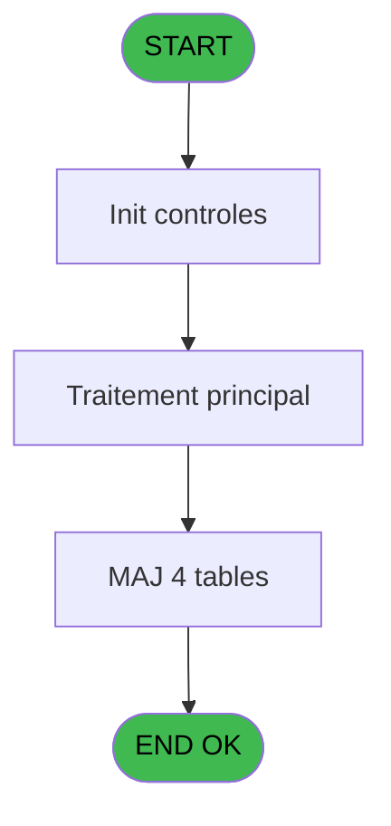
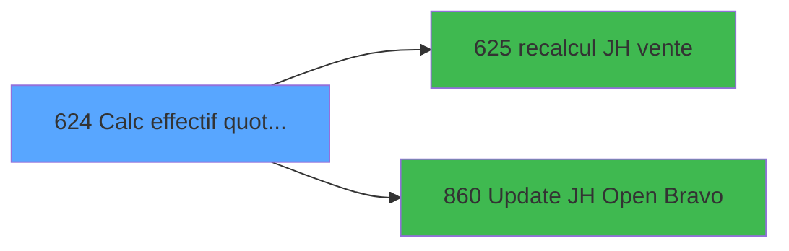

# REF IDE 624 - Calc effectif quotidien PMS618

> **Analyse**: Phases 1-4 2026-02-03 13:13 -> 13:13 (17s) | Assemblage 13:13
> **Pipeline**: V7.2 Enrichi
> **Structure**: 4 onglets (Resume | Ecrans | Donnees | Connexions)

<!-- TAB:Resume -->

## 1. FICHE D'IDENTITE

| Attribut | Valeur |
|----------|--------|
| Projet | REF |
| IDE Position | 624 |
| Nom Programme | Calc effectif quotidien PMS618 |
| Fichier source | `Prg_624.xml` |
| Dossier IDE | General |
| Taches | 27 (0 ecrans visibles) |
| Tables modifiees | 4 |
| Programmes appeles | 2 |

## 2. DESCRIPTION FONCTIONNELLE

**Calc effectif quotidien PMS618** assure la gestion complete de ce processus, accessible depuis [Calcul effectif Quotidien (IDE 622)](REF-IDE-622.md).

Le flux de traitement s'organise en **3 blocs fonctionnels** :

- **Traitement** (23 taches) : traitements metier divers
- **Calcul** (2 taches) : calculs de montants, stocks ou compteurs
- **Initialisation** (2 taches) : reinitialisation d'etats et de variables de travail

**Donnees modifiees** : 4 tables en ecriture (societe__________soc, absences_personnel, vrl_hp, effectif_personnes).

Detail : phases du traitement

#### Phase 1 : Calcul (2 taches)

- **624** - Calcul effectif quotidien(TRA) **[[ECRAN]](#ecran-t1)**
- **624.2.3.3** - Calcul JH absence

Delegue a : [recalcul JH vente (IDE 625)](REF-IDE-625.md)

#### Phase 2 : Initialisation (2 taches)

- **624.1** - Initialisation lieu sejour
- **624.3** - Initialisation heures

#### Phase 3 : Traitement (23 taches)

- **624.1.1** - Mise à jour effectif quotidien
- **624.1.2** - Mise à jour effectif quotidien
- **624.1.3** - Mise à jour effectif quotidien
- **624.2** - Parcours qualité **[[ECRAN]](#ecran-t6)**
- **624.2.1** - Traitement regul absences
- **624.2.2** - Vrl
- **624.2.3** - Traitement deval val diff
- **624.2.3.1** - Del effectif personnes inexist
- **624.2.3.2** - Maj personnes
- **624.2.4** - Vrl
- **624.2.5** - Vrl
- **624.2.6** - Vrl
- **624.2.7** - Vrl
- **624.2.8** - Realise
- **624.2.8.1** - Maj personnes
- **624.2.8.2** - Del effectif personnes inexist
- **624.2.8.2.1** - Maj personnes
- **624.2.9** - Previsionnel
- **624.2.10** - Vrl
- **624.2.11** - Correctif repas hors village
- **624.2.12** - delete eff quotidien SQL
- **624.4** - Maj Personnes  transportés **[[ECRAN]](#ecran-t26)**
- **624.4.1** - Maj personnes **[[ECRAN]](#ecran-t27)**

Delegue a : [Update JH Open Bravo (IDE 860)](REF-IDE-860.md)

#### Tables impactees

| Table | Operations | Role metier |
|-------|-----------|-------------|
| effectif_personnes | **W**/L (8 usages) |  |
| vrl_hp | R/**W**/L (5 usages) |  |
| absences_personnel | **W**/L (4 usages) |  |
| societe__________soc | R/**W** (3 usages) |  |

## 3. BLOCS FONCTIONNELS

### 3.1 Calcul (2 taches)

Calculs metier : montants, stocks, compteurs.

---

#### 624 - Calcul effectif quotidien(TRA) [[ECRAN]](#ecran-t1)

**Role** : Calcul : Calcul effectif quotidien(TRA).
**Ecran** : 310 x 145 DLU | [Voir mockup](#ecran-t1)

---

#### 624.2.3.3 - Calcul JH absence

**Role** : Calcul : Calcul JH absence.
**Delegue a** : [recalcul JH vente (IDE 625)](REF-IDE-625.md)

### 3.2 Initialisation (2 taches)

Reinitialisation d'etats et variables de travail.

---

#### 624.1 - Initialisation lieu sejour

**Role** : Reinitialisation : Initialisation lieu sejour.
**Variables liees** : C (P.Nb Lieu sejour)

---

#### 624.3 - Initialisation heures

**Role** : Reinitialisation : Initialisation heures.

### 3.3 Traitement (23 taches)

Traitements internes.

---

#### 624.1.1 - Mise à jour effectif quotidien

**Role** : Traitement : Mise à jour effectif quotidien.
**Variables liees** : C (P.Nb Lieu sejour)

---

#### 624.1.2 - Mise à jour effectif quotidien

**Role** : Traitement : Mise à jour effectif quotidien.
**Variables liees** : C (P.Nb Lieu sejour)

---

#### 624.1.3 - Mise à jour effectif quotidien

**Role** : Traitement : Mise à jour effectif quotidien.
**Variables liees** : C (P.Nb Lieu sejour)

---

#### 624.2 - Parcours qualité [[ECRAN]](#ecran-t6)

**Role** : Traitement : Parcours qualité.
**Ecran** : 667 x 153 DLU (MDI) | [Voir mockup](#ecran-t6)

---

#### 624.2.1 - Traitement regul absences

**Role** : Traitement : Traitement regul absences.

---

#### 624.2.2 - Vrl

**Role** : Traitement interne.

---

#### 624.2.3 - Traitement deval val diff

**Role** : Traitement : Traitement deval val diff.

---

#### 624.2.3.1 - Del effectif personnes inexist

**Role** : Traitement : Del effectif personnes inexist.

---

#### 624.2.3.2 - Maj personnes

**Role** : Traitement : Maj personnes.

---

#### 624.2.4 - Vrl

**Role** : Traitement interne.

---

#### 624.2.5 - Vrl

**Role** : Traitement interne.

---

#### 624.2.6 - Vrl

**Role** : Traitement interne.

---

#### 624.2.7 - Vrl

**Role** : Traitement interne.

---

#### 624.2.8 - Realise

**Role** : Traitement : Realise.

---

#### 624.2.8.1 - Maj personnes

**Role** : Traitement : Maj personnes.

---

#### 624.2.8.2 - Del effectif personnes inexist

**Role** : Traitement : Del effectif personnes inexist.

---

#### 624.2.8.2.1 - Maj personnes

**Role** : Traitement : Maj personnes.

---

#### 624.2.9 - Previsionnel

**Role** : Traitement : Previsionnel.

---

#### 624.2.10 - Vrl

**Role** : Traitement interne.

---

#### 624.2.11 - Correctif repas hors village

**Role** : Traitement : Correctif repas hors village.

---

#### 624.2.12 - delete eff quotidien SQL

**Role** : Traitement : delete eff quotidien SQL.

---

#### 624.4 - Maj Personnes  transportés [[ECRAN]](#ecran-t26)

**Role** : Traitement : Maj Personnes  transportés.
**Ecran** : 813 x 465 DLU | [Voir mockup](#ecran-t26)

---

#### 624.4.1 - Maj personnes [[ECRAN]](#ecran-t27)

**Role** : Traitement : Maj personnes.
**Ecran** : 263 x 39 DLU | [Voir mockup](#ecran-t27)

## 5. REGLES METIER

*(Aucune regle metier identifiee)*

## 6. CONTEXTE

- **Appele par**: [Calcul effectif Quotidien (IDE 622)](REF-IDE-622.md)
- **Appelle**: 2 programmes | **Tables**: 15 (W:4 R:5 L:13) | **Taches**: 27 | **Expressions**: 10

<!-- TAB:Ecrans -->

## 8. ECRANS

*(Programme sans ecran visible)*

## 9. NAVIGATION

### 9.3 Structure hierarchique (27 taches)

| Position | Tache | Type | Dimensions | Bloc |
|----------|-------|------|------------|------|
| **624.1** | [**Calcul effectif quotidien(TRA)** (624)](#t1) [mockup](#ecran-t1) | - | 310x145 | Calcul |
| 624.1.1 | [Calcul JH absence (624.2.3.3)](#t12) | - | - | |
| **624.2** | [**Initialisation lieu sejour** (624.1)](#t2) | - | - | Initialisation |
| 624.2.1 | [Initialisation heures (624.3)](#t25) | - | - | |
| **624.3** | [**Mise à jour effectif quotidien** (624.1.1)](#t3) | - | - | Traitement |
| 624.3.1 | [Mise à jour effectif quotidien (624.1.2)](#t4) | - | - | |
| 624.3.2 | [Mise à jour effectif quotidien (624.1.3)](#t5) | - | - | |
| 624.3.3 | [Parcours qualité (624.2)](#t6) [mockup](#ecran-t6) | MDI | 667x153 | |
| 624.3.4 | [Traitement regul absences (624.2.1)](#t7) | - | - | |
| 624.3.5 | [Vrl (624.2.2)](#t8) | - | - | |
| 624.3.6 | [Traitement deval val diff (624.2.3)](#t9) | - | - | |
| 624.3.7 | [Del effectif personnes inexist (624.2.3.1)](#t10) | - | - | |
| 624.3.8 | [Maj personnes (624.2.3.2)](#t11) | - | - | |
| 624.3.9 | [Vrl (624.2.4)](#t13) | - | - | |
| 624.3.10 | [Vrl (624.2.5)](#t14) | - | - | |
| 624.3.11 | [Vrl (624.2.6)](#t15) | - | - | |
| 624.3.12 | [Vrl (624.2.7)](#t16) | - | - | |
| 624.3.13 | [Realise (624.2.8)](#t17) | MDI | - | |
| 624.3.14 | [Maj personnes (624.2.8.1)](#t18) | - | - | |
| 624.3.15 | [Del effectif personnes inexist (624.2.8.2)](#t19) | - | - | |
| 624.3.16 | [Maj personnes (624.2.8.2.1)](#t20) | - | - | |
| 624.3.17 | [Previsionnel (624.2.9)](#t21) | MDI | - | |
| 624.3.18 | [Vrl (624.2.10)](#t22) | - | - | |
| 624.3.19 | [Correctif repas hors village (624.2.11)](#t23) | - | - | |
| 624.3.20 | [delete eff quotidien SQL (624.2.12)](#t24) | - | - | |
| 624.3.21 | [Maj Personnes  transportés (624.4)](#t26) [mockup](#ecran-t26) | - | 813x465 | |
| 624.3.22 | [Maj personnes (624.4.1)](#t27) [mockup](#ecran-t27) | - | 263x39 | |

### 9.4 Algorigramme

> **Legende**: Vert = START/END OK | Rouge = END KO | Bleu = Decisions
> *Algorigramme auto-genere. Utiliser `/algorigramme` pour une synthese metier detaillee.*

<!-- TAB:Donnees -->

## 10. TABLES

### Tables utilisees (15)

| ID | Nom | Description | Type | R | W | L | Usages |
|----|-----|-------------|------|---|---|---|--------|
| 30 | gm-recherche_____gmr | Index de recherche | DB | R |   |   | 6 |
| 31 | gm-complet_______gmc |  | DB |   |   | L | 2 |
| 34 | hebergement______heb | Hebergement (chambres) | DB | R |   | L | 14 |
| 35 | personnel_go______go |  | DB |   |   | L | 2 |
| 36 | client_gm |  | DB |   |   | L | 2 |
| 81 | societe__________soc |  | DB | R | **W** |   | 3 |
| 118 | tables_imports |  | DB |   |   | L | 1 |
| 120 | tables_qualites__qua |  | DB |   |   | L | 1 |
| 362 | absences_personnel |  | DB |   | **W** | L | 4 |
| 770 | vente_vrl_vsl | Donnees de ventes | DB |   |   | L | 2 |
| 783 | vrl_hp |  | DB | R | **W** | L | 5 |
| 784 | type_repas_nenc_vill |  | DB | R |   | L | 5 |
| 785 | effectif_quotidien |  | DB |   |   | L | 11 |
| 790 | log_valid_devalid |  | DB |   |   | L | 1 |
| 793 | effectif_personnes |  | DB |   | **W** | L | 8 |

### Colonnes par table (5 / 7 tables avec colonnes identifiees)

Table 30 - gm-recherche_____gmr (R) - 6 usages

| Lettre | Variable | Acces | Type |
|--------|----------|-------|------|
| A | V.Nb real correction | R | Numeric |
| B | V.Date operation | R | Date |
| C | V.Nb absence | R | Numeric |
| D | V.heure fin sejour | R | Alpha |
| E | V.Date debut calcul abs | R | Date |
| F | V.Date fin calcul abs | R | Date |

Table 34 - hebergement______heb (R/L) - 14 usages

| Lettre | Variable | Acces | Type |
|--------|----------|-------|------|
| A | V.Existe hebergement ? | R | Logical |
| B | v LienSegment Z Occup =V | R | Logical |

Table 81 - societe__________soc (R/**W**) - 3 usages

| Lettre | Variable | Acces | Type |
|--------|----------|-------|------|
| A | P.Date | W | Date |
| B | P.From PBP | W | Logical |
| C | P.Nb Lieu sejour | W | Numeric |
| D | P.From gestion crise | W | Logical |
| E | v.DateJ | W | Date |
| F | V.Where clause | W | Alpha |

Table 362 - absences_personnel (**W**/L) - 4 usages

| Lettre | Variable | Acces | Type |
|--------|----------|-------|------|
| A | V.Date debut absence | W | Date |
| B | V.Date fin absence | W | Date |
| C | V.J absence | W | Numeric |

Table 783 - vrl_hp (R/**W**/L) - 5 usages

| Lettre | Variable | Acces | Type |
|--------|----------|-------|------|
| A | V.qualite | W | Alpha |
| B | V.qualite_compl IGR | W | Alpha |
| C | V.Qualite compl GO | W | Alpha |
| D | V.Ancienne regul midi | W | Numeric |
| E | V.Ancienne regul soir | W | Numeric |

Table 784 - type_repas_nenc_vill (R/L) - 5 usages

*Table utilisee uniquement en Link ou aucune colonne Real identifiee dans le DataView.*

Table 793 - effectif_personnes (**W**/L) - 8 usages

*Table utilisee uniquement en Link ou aucune colonne Real identifiee dans le DataView.*

## 11. VARIABLES

### 11.1 Parametres entrants (4)

Variables recues du programme appelant ([Calcul effectif Quotidien (IDE 622)](REF-IDE-622.md)).

| Lettre | Nom | Type | Usage dans |
|--------|-----|------|-----------|
| A | P.Date | Date | 1x parametre entrant |
| B | P.From PBP | Logical | 1x parametre entrant |
| C | P.Nb Lieu sejour | Numeric | [624.1](#t2) |
| D | P.From gestion crise | Logical | - |

### 11.2 Variables de session (2)

Variables persistantes pendant toute la session.

| Lettre | Nom | Type | Usage dans |
|--------|-----|------|-----------|
| E | v.DateJ | Date | - |
| F | V.Where clause | Alpha | - |

## 12. EXPRESSIONS

**10 / 10 expressions decodees (100%)**

### 12.1 Repartition par type

| Type | Expressions | Regles |
|------|-------------|--------|
| CALCULATION | 2 | 0 |
| CONSTANTE | 1 | 0 |
| DATE | 1 | 0 |
| CONDITION | 2 | 0 |
| OTHER | 2 | 0 |
| CAST_LOGIQUE | 1 | 0 |
| REFERENCE_VG | 1 | 0 |

### 12.2 Expressions cles par type

#### CALCULATION (2 expressions)

| Type | IDE | Expression | Regle |
|------|-----|------------|-------|
| CALCULATION | 10 | `[G] + 1` | - |
| CALCULATION | 3 | `P.Date [A]-1` | - |

#### CONSTANTE (1 expressions)

| Type | IDE | Expression | Regle |
|------|-----|------------|-------|
| CONSTANTE | 2 | `'C'` | - |

#### DATE (1 expressions)

| Type | IDE | Expression | Regle |
|------|-----|------------|-------|
| DATE | 8 | `BOM(Date())` | - |

#### CONDITION (2 expressions)

| Type | IDE | Expression | Regle |
|------|-----|------------|-------|
| CONDITION | 1 | `VG8 AND P.Nb Lieu sejour [C]>1` | - |
| CONDITION | 9 | `[G] < Date()` | - |

#### OTHER (2 expressions)

| Type | IDE | Expression | Regle |
|------|-----|------------|-------|
| OTHER | 6 | `[G]` | - |
| OTHER | 4 | `P.From PBP [B]` | - |

#### CAST_LOGIQUE (1 expressions)

| Type | IDE | Expression | Regle |
|------|-----|------------|-------|
| CAST_LOGIQUE | 5 | `'FALSE'LOG` | - |

#### REFERENCE_VG (1 expressions)

| Type | IDE | Expression | Regle |
|------|-----|------------|-------|
| REFERENCE_VG | 7 | `VG34` | - |

<!-- TAB:Connexions -->

## 13. GRAPHE D'APPELS

### 13.1 Chaine depuis Main (Callers)

Main -> ... -> [Calcul effectif Quotidien (IDE 622)](REF-IDE-622.md) -> **Calc effectif quotidien PMS618 (IDE 624)**

### 13.2 Callers

| IDE | Nom Programme | Nb Appels |
|-----|---------------|-----------|
| [622](REF-IDE-622.md) | Calcul effectif Quotidien | 2 |

### 13.3 Callees (programmes appeles)

### 13.4 Detail Callees avec contexte

| IDE | Nom Programme | Appels | Contexte |
|-----|---------------|--------|----------|
| [625](REF-IDE-625.md) | recalcul JH vente | 1 | Calcul de donnees |
| [860](REF-IDE-860.md) | Update JH Open Bravo | 1 | Mise a jour donnees |

## 14. RECOMMANDATIONS MIGRATION

### 14.1 Profil du programme

| Metrique | Valeur | Impact migration |
|----------|--------|-----------------|
| Lignes de logique | 1542 | Programme volumineux |
| Expressions | 10 | Peu de logique |
| Tables WRITE | 4 | Impact modere |
| Sous-programmes | 2 | Peu de dependances |
| Ecrans visibles | 0 | Ecran unique ou traitement batch |
| Code desactive | 0.2% (3 / 1542) | Code sain |
| Regles metier | 0 | Pas de regle identifiee |

### 14.2 Plan de migration par bloc

#### Calcul (2 taches: 1 ecran, 1 traitement)

- **Strategie** : Services de calcul purs (Domain Services).
- Migrer la logique de calcul (stock, compteurs, montants)

#### Initialisation (2 taches: 0 ecran, 2 traitements)

- **Strategie** : Constructeur/methode `InitAsync()` dans l'orchestrateur.

#### Traitement (23 taches: 3 ecrans, 20 traitements)

- **Strategie** : Orchestrateur avec 3 ecrans (Razor/React) et 20 traitements backend (services).
- Les ecrans deviennent des composants UI, les traitements invisibles deviennent des services injectables.
- 2 sous-programme(s) a migrer ou a reutiliser depuis les services existants.
- Decomposer les taches en services unitaires testables.

### 14.3 Dependances critiques

| Dependance | Type | Appels | Impact |
|------------|------|--------|--------|
| societe__________soc | Table WRITE (Database) | 2x | Schema + repository |
| absences_personnel | Table WRITE (Database) | 1x | Schema + repository |
| vrl_hp | Table WRITE (Database) | 3x | Schema + repository |
| effectif_personnes | Table WRITE (Database) | 1x | Schema + repository |
| [Update JH Open Bravo (IDE 860)](REF-IDE-860.md) | Sous-programme | 1x | Normale - Mise a jour donnees |
| [recalcul JH vente (IDE 625)](REF-IDE-625.md) | Sous-programme | 1x | Normale - Calcul de donnees |

---
*Spec DETAILED generee par Pipeline V7.2 - 2026-02-03 13:13*
