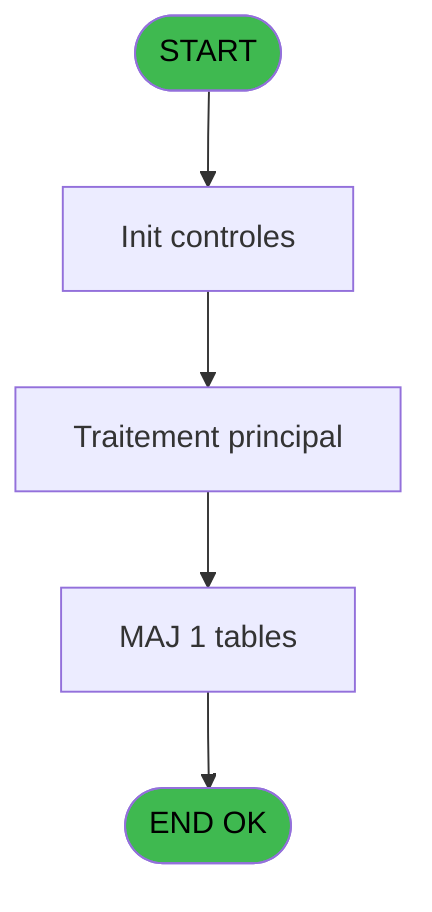
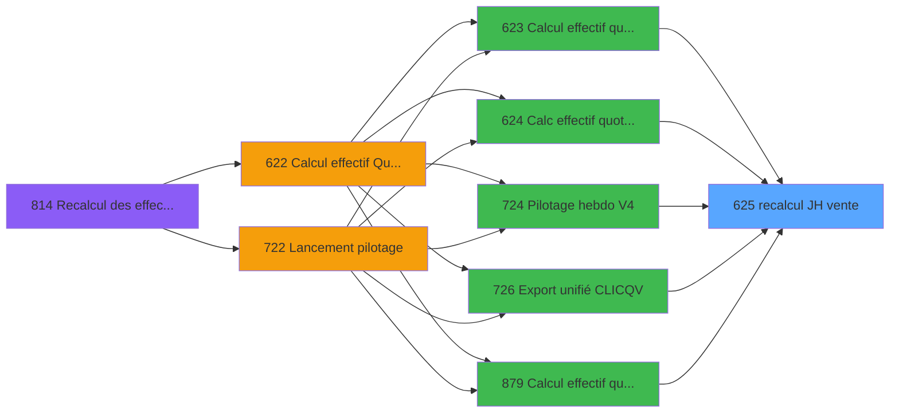

# REF IDE 625 - recalcul JH vente

> **Analyse**: Phases 1-4 2026-02-03 13:13 -> 13:14 (17s) | Assemblage 13:14
> **Pipeline**: V7.2 Enrichi
> **Structure**: 4 onglets (Resume | Ecrans | Donnees | Connexions)

<!-- TAB:Resume -->

## 1. FICHE D'IDENTITE

| Attribut | Valeur |
|----------|--------|
| Projet | REF |
| IDE Position | 625 |
| Nom Programme | recalcul JH vente |
| Fichier source | `Prg_625.xml` |
| Dossier IDE | Ventes |
| Taches | 3 (0 ecrans visibles) |
| Tables modifiees | 1 |
| Programmes appeles | 0 |

## 2. DESCRIPTION FONCTIONNELLE

**recalcul JH vente** assure la gestion complete de ce processus, accessible depuis [Calcul effectif quotidien(TRA) (IDE 623)](REF-IDE-623.md), [Calc effectif quotidien PMS618 (IDE 624)](REF-IDE-624.md), [Pilotage hebdo V4 (IDE 724)](REF-IDE-724.md), [Export unifié CLIC/QV (IDE 726)](REF-IDE-726.md), [Calcul effectif quotidien(SVG) (IDE 879)](REF-IDE-879.md), [Pilotage hebdo V2 new (IDE 885)](REF-IDE-885.md), [Pilotage hebdo (IDE 897)](REF-IDE-897.md), [Pilotage hebdo V3 (IDE 900)](REF-IDE-900.md).

Le flux de traitement s'organise en **3 blocs fonctionnels** :

- **Initialisation** (1 tache) : reinitialisation d'etats et de variables de travail
- **Calcul** (1 tache) : calculs de montants, stocks ou compteurs
- **Traitement** (1 tache) : traitements metier divers

**Donnees modifiees** : 1 tables en ecriture (effectif_quotidien).

Detail : phases du traitement

#### Phase 1 : Traitement (1 tache)

- **625** - (sans nom)

#### Phase 2 : Calcul (1 tache)

- **625.1** - Recalcul effectif vrl

#### Phase 3 : Initialisation (1 tache)

- **625.2** - Raz vrl

#### Tables impactees

| Table | Operations | Role metier |
|-------|-----------|-------------|
| effectif_quotidien | **W**/L (2 usages) |  |

## 3. BLOCS FONCTIONNELS

### 3.1 Traitement (1 tache)

Traitements internes.

---

#### 625 - (sans nom)

**Role** : Traitement interne.

### 3.2 Calcul (1 tache)

Calculs metier : montants, stocks, compteurs.

---

#### 625.1 - Recalcul effectif vrl

**Role** : Calcul : Recalcul effectif vrl.

### 3.3 Initialisation (1 tache)

Reinitialisation d'etats et variables de travail.

---

#### 625.2 - Raz vrl

**Role** : Reinitialisation : Raz vrl.

## 5. REGLES METIER

*(Aucune regle metier identifiee)*

## 6. CONTEXTE

- **Appele par**: [Calcul effectif quotidien(TRA) (IDE 623)](REF-IDE-623.md), [Calc effectif quotidien PMS618 (IDE 624)](REF-IDE-624.md), [Pilotage hebdo V4 (IDE 724)](REF-IDE-724.md), [Export unifié CLIC/QV (IDE 726)](REF-IDE-726.md), [Calcul effectif quotidien(SVG) (IDE 879)](REF-IDE-879.md), [Pilotage hebdo V2 new (IDE 885)](REF-IDE-885.md), [Pilotage hebdo (IDE 897)](REF-IDE-897.md), [Pilotage hebdo V3 (IDE 900)](REF-IDE-900.md)
- **Appelle**: 0 programmes | **Tables**: 3 (W:1 R:2 L:1) | **Taches**: 3 | **Expressions**: 2

<!-- TAB:Ecrans -->

## 8. ECRANS

*(Programme sans ecran visible)*

## 9. NAVIGATION

### 9.3 Structure hierarchique (3 taches)

| Position | Tache | Type | Dimensions | Bloc |
|----------|-------|------|------------|------|
| **625.1** | [**(sans nom)** (625)](#t1) | - | - | Traitement |
| **625.2** | [**Recalcul effectif vrl** (625.1)](#t2) | - | - | Calcul |
| **625.3** | [**Raz vrl** (625.2)](#t3) | - | - | Initialisation |

### 9.4 Algorigramme

> **Legende**: Vert = START/END OK | Rouge = END KO | Bleu = Decisions
> *Algorigramme auto-genere. Utiliser `/algorigramme` pour une synthese metier detaillee.*

<!-- TAB:Donnees -->

## 10. TABLES

### Tables utilisees (3)

| ID | Nom | Description | Type | R | W | L | Usages |
|----|-----|-------------|------|---|---|---|--------|
| 81 | societe__________soc |  | DB | R |   |   | 1 |
| 770 | vente_vrl_vsl | Donnees de ventes | DB | R |   |   | 1 |
| 785 | effectif_quotidien |  | DB |   | **W** | L | 2 |

### Colonnes par table (1 / 3 tables avec colonnes identifiees)

Table 81 - societe__________soc (R) - 1 usages

| Lettre | Variable | Acces | Type |
|--------|----------|-------|------|
| A | P.Date debut | R | Date |
| B | P.Date fin | R | Date |
| C | P.Nb Lieu sejour | R | Numeric |
| D | P.pour Calcul JH | R | Logical |
| E | P.IGR midi | R | Numeric |
| F | P.IGR soir | R | Numeric |
| G | P.VRL midi | R | Numeric |
| H | P.VRL soir | R | Numeric |

Table 770 - vente_vrl_vsl (R) - 1 usages

*Table utilisee uniquement en Link ou aucune colonne Real identifiee dans le DataView.*

Table 785 - effectif_quotidien (**W**/L) - 2 usages

*Table utilisee uniquement en Link ou aucune colonne Real identifiee dans le DataView.*

## 11. VARIABLES

### 11.1 Parametres entrants (8)

Variables recues du programme appelant ([Calcul effectif quotidien(TRA) (IDE 623)](REF-IDE-623.md)).

| Lettre | Nom | Type | Usage dans |
|--------|-----|------|-----------|
| A | P.Date debut | Date | - |
| B | P.Date fin | Date | - |
| C | P.Nb Lieu sejour | Numeric | - |
| D | P.pour Calcul JH | Logical | [625.1](#t2) |
| E | P.IGR midi | Numeric | - |
| F | P.IGR soir | Numeric | - |
| G | P.VRL midi | Numeric | - |
| H | P.VRL soir | Numeric | - |

## 12. EXPRESSIONS

**2 / 2 expressions decodees (100%)**

### 12.1 Repartition par type

| Type | Expressions | Regles |
|------|-------------|--------|
| CONSTANTE | 1 | 0 |
| NEGATION | 1 | 0 |

### 12.2 Expressions cles par type

#### CONSTANTE (1 expressions)

| Type | IDE | Expression | Regle |
|------|-----|------------|-------|
| CONSTANTE | 1 | `'C'` | - |

#### NEGATION (1 expressions)

| Type | IDE | Expression | Regle |
|------|-----|------------|-------|
| NEGATION | 2 | `NOT P.pour Calcul JH [D]` | - |

<!-- TAB:Connexions -->

## 13. GRAPHE D'APPELS

### 13.1 Chaine depuis Main (Callers)

Main -> ... -> [Calcul effectif quotidien(TRA) (IDE 623)](REF-IDE-623.md) -> **recalcul JH vente (IDE 625)**

Main -> ... -> [Calc effectif quotidien PMS618 (IDE 624)](REF-IDE-624.md) -> **recalcul JH vente (IDE 625)**

Main -> ... -> [Pilotage hebdo V4 (IDE 724)](REF-IDE-724.md) -> **recalcul JH vente (IDE 625)**

Main -> ... -> [Export unifié CLIC/QV (IDE 726)](REF-IDE-726.md) -> **recalcul JH vente (IDE 625)**

Main -> ... -> [Calcul effectif quotidien(SVG) (IDE 879)](REF-IDE-879.md) -> **recalcul JH vente (IDE 625)**

Main -> ... -> [Pilotage hebdo V2 new (IDE 885)](REF-IDE-885.md) -> **recalcul JH vente (IDE 625)**

Main -> ... -> [Pilotage hebdo (IDE 897)](REF-IDE-897.md) -> **recalcul JH vente (IDE 625)**

Main -> ... -> [Pilotage hebdo V3 (IDE 900)](REF-IDE-900.md) -> **recalcul JH vente (IDE 625)**

### 13.2 Callers

| IDE | Nom Programme | Nb Appels |
|-----|---------------|-----------|
| [623](REF-IDE-623.md) | Calcul effectif quotidien(TRA) | 1 |
| [624](REF-IDE-624.md) | Calc effectif quotidien PMS618 | 1 |
| [724](REF-IDE-724.md) | Pilotage hebdo V4 | 1 |
| [726](REF-IDE-726.md) | Export unifié CLIC/QV | 1 |
| [879](REF-IDE-879.md) | Calcul effectif quotidien(SVG) | 1 |
| [885](REF-IDE-885.md) | Pilotage hebdo V2 new | 1 |
| [897](REF-IDE-897.md) | Pilotage hebdo | 1 |
| [900](REF-IDE-900.md) | Pilotage hebdo V3 | 1 |

### 13.3 Callees (programmes appeles)

### 13.4 Detail Callees avec contexte

| IDE | Nom Programme | Appels | Contexte |
|-----|---------------|--------|----------|
| - | (aucun) | - | - |

## 14. RECOMMANDATIONS MIGRATION

### 14.1 Profil du programme

| Metrique | Valeur | Impact migration |
|----------|--------|-----------------|
| Lignes de logique | 75 | Programme compact |
| Expressions | 2 | Peu de logique |
| Tables WRITE | 1 | Impact faible |
| Sous-programmes | 0 | Peu de dependances |
| Ecrans visibles | 0 | Ecran unique ou traitement batch |
| Code desactive | 0% (0 / 75) | Code sain |
| Regles metier | 0 | Pas de regle identifiee |

### 14.2 Plan de migration par bloc

#### Traitement (1 tache: 0 ecran, 1 traitement)

- **Strategie** : 1 service(s) backend injectable(s) (Domain Services).
- Decomposer les taches en services unitaires testables.

#### Calcul (1 tache: 0 ecran, 1 traitement)

- **Strategie** : Services de calcul purs (Domain Services).
- Migrer la logique de calcul (stock, compteurs, montants)

#### Initialisation (1 tache: 0 ecran, 1 traitement)

- **Strategie** : Constructeur/methode `InitAsync()` dans l'orchestrateur.

### 14.3 Dependances critiques

| Dependance | Type | Appels | Impact |
|------------|------|--------|--------|
| effectif_quotidien | Table WRITE (Database) | 1x | Schema + repository |

---
*Spec DETAILED generee par Pipeline V7.2 - 2026-02-03 13:14*
