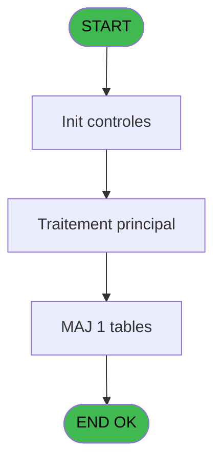

# REF IDE 626 - effectifs Sejour *

> **Analyse**: Phases 1-4 2026-02-03 13:14 -> 13:14 (17s) | Assemblage 13:14
> **Pipeline**: V7.2 Enrichi
> **Structure**: 4 onglets (Resume | Ecrans | Donnees | Connexions)

<!-- TAB:Resume -->

## 1. FICHE D'IDENTITE

| Attribut | Valeur |
|----------|--------|
| Projet | REF |
| IDE Position | 626 |
| Nom Programme | effectifs Sejour * |
| Fichier source | `Prg_626.xml` |
| Dossier IDE | General |
| Taches | 5 (0 ecrans visibles) |
| Tables modifiees | 1 |
| Programmes appeles | 0 |

## 2. DESCRIPTION FONCTIONNELLE

**effectifs Sejour *** assure la gestion complete de ce processus, accessible depuis [Lancement Sejour (IDE 628)](REF-IDE-628.md).

Le flux de traitement s'organise en **1 blocs fonctionnels** :

- **Traitement** (5 taches) : traitements metier divers

**Donnees modifiees** : 1 tables en ecriture (effectif_Q_new).

Detail : phases du traitement

#### Phase 1 : Traitement (5 taches)

- **626** - effectifs sav
- **626.1** - Création enregs
- **626.2** - Création/ modification
- **626.3** - (sans nom)
- **626.4** - (sans nom)

#### Tables impactees

| Table | Operations | Role metier |
|-------|-----------|-------------|
| effectif_Q_new | **W** (2 usages) |  |

## 3. BLOCS FONCTIONNELS

### 3.1 Traitement (5 taches)

Traitements internes.

---

#### 626 - effectifs sav

**Role** : Traitement : effectifs sav.

4 sous-taches directes

| Tache | Nom | Bloc |
|-------|-----|------|
| [626.1](#t2) | Création enregs | Traitement |
| [626.2](#t3) | Création/ modification | Traitement |
| [626.3](#t4) | (sans nom) | Traitement |
| [626.4](#t9) | (sans nom) | Traitement |

---

#### 626.1 - Création enregs

**Role** : Traitement : Création enregs.

---

#### 626.2 - Création/ modification

**Role** : Traitement : Création/ modification.

---

#### 626.3 - (sans nom)

**Role** : Traitement interne.

---

#### 626.4 - (sans nom)

**Role** : Traitement interne.

## 5. REGLES METIER

*(Aucune regle metier identifiee)*

## 6. CONTEXTE

- **Appele par**: [Lancement Sejour (IDE 628)](REF-IDE-628.md)
- **Appelle**: 0 programmes | **Tables**: 1 (W:1 R:0 L:0) | **Taches**: 5 | **Expressions**: 21

<!-- TAB:Ecrans -->

## 8. ECRANS

*(Programme sans ecran visible)*

## 9. NAVIGATION

### 9.3 Structure hierarchique (5 taches)

| Position | Tache | Type | Dimensions | Bloc |
|----------|-------|------|------------|------|
| **626.1** | [**effectifs sav** (626)](#t1) | - | - | Traitement |
| 626.1.1 | [Création enregs (626.1)](#t2) | - | - | |
| 626.1.2 | [Création/ modification (626.2)](#t3) | - | - | |
| 626.1.3 | [(sans nom) (626.3)](#t4) | - | - | |
| 626.1.4 | [(sans nom) (626.4)](#t9) | - | - | |

### 9.4 Algorigramme

> **Legende**: Vert = START/END OK | Rouge = END KO | Bleu = Decisions
> *Algorigramme auto-genere. Utiliser `/algorigramme` pour une synthese metier detaillee.*

<!-- TAB:Donnees -->

## 10. TABLES

### Tables utilisees (1)

| ID | Nom | Description | Type | R | W | L | Usages |
|----|-----|-------------|------|---|---|---|--------|
| 889 | effectif_Q_new |  | DB |   | **W** |   | 2 |

### Colonnes par table (1 / 1 tables avec colonnes identifiees)

Table 889 - effectif_Q_new (**W**) - 2 usages

| Lettre | Variable | Acces | Type |
|--------|----------|-------|------|
| A | P.date de début | W | Date |
| B | P.date de fin | W | Date |
| C | P . Code_Ope (‘V’,’D’) | W | Unicode |

## 11. VARIABLES

### 11.1 Parametres entrants (20)

Variables recues du programme appelant ([Lancement Sejour (IDE 628)](REF-IDE-628.md)).

| Lettre | Nom | Type | Usage dans |
|--------|-----|------|-----------|
| A | P.Mode (Créatio/Modif/Qualité/) | Unicode | - |
| B | P.Société | Unicode | - |
| C | P.compte | Numeric | - |
| D | P.Filiation | Numeric | - |
| E | P.Qualité | Unicode | - |
| F | P.Qualité_compl | Unicode | - |
| G | P.Code_repas_nenc_vil | Unicode | - |
| H | P.date de debut | Date | 2x parametre entrant |
| I | P.date de fin | Date | 1x parametre entrant |
| J | P.heure de début | Time | 2x parametre entrant |
| K | P.Heure de fin | Time | 2x parametre entrant |
| L | P.Nouvelle date de debut pas ut | Date | - |
| M | P. Nouvelle date de fin pas uti | Date | - |
| N | P. Nouvelle heure de début pas | Time | - |
| O | P. Nouvelle Heure de fin pas ut | Time | - |
| P | P.Groupe | Unicode | - |
| Q | P. Quantité (0,1) | Numeric | - |
| R | P.repas | Unicode | 2x parametre entrant |
| S | P .codeOpe(‘V’,’D’) | Unicode | - |
| T | P.Lieu_séjour_test | Unicode | - |

### 11.2 Variables de session (1)

Variables persistantes pendant toute la session.

| Lettre | Nom | Type | Usage dans |
|--------|-----|------|-----------|
| V | v. utiliser DSQL? | Logical | - |

### 11.3 Autres (1)

Variables diverses.

| Lettre | Nom | Type | Usage dans |
|--------|-----|------|-----------|
| U | v_comptage_enregistrement | Numeric | 3x refs |

Toutes les 22 variables (liste complete)

| Cat | Lettre | Nom Variable | Type |
|-----|--------|--------------|------|
| P0 | **A** | P.Mode (Créatio/Modif/Qualité/) | Unicode |
| P0 | **B** | P.Société | Unicode |
| P0 | **C** | P.compte | Numeric |
| P0 | **D** | P.Filiation | Numeric |
| P0 | **E** | P.Qualité | Unicode |
| P0 | **F** | P.Qualité_compl | Unicode |
| P0 | **G** | P.Code_repas_nenc_vil | Unicode |
| P0 | **H** | P.date de debut | Date |
| P0 | **I** | P.date de fin | Date |
| P0 | **J** | P.heure de début | Time |
| P0 | **K** | P.Heure de fin | Time |
| P0 | **L** | P.Nouvelle date de debut pas ut | Date |
| P0 | **M** | P. Nouvelle date de fin pas uti | Date |
| P0 | **N** | P. Nouvelle heure de début pas | Time |
| P0 | **O** | P. Nouvelle Heure de fin pas ut | Time |
| P0 | **P** | P.Groupe | Unicode |
| P0 | **Q** | P. Quantité (0,1) | Numeric |
| P0 | **R** | P.repas | Unicode |
| P0 | **S** | P .codeOpe(‘V’,’D’) | Unicode |
| P0 | **T** | P.Lieu_séjour_test | Unicode |
| V. | **V** | v. utiliser DSQL? | Logical |
| Autre | **U** | v_comptage_enregistrement | Numeric |

## 12. EXPRESSIONS

**21 / 21 expressions decodees (100%)**

### 12.1 Repartition par type

| Type | Expressions | Regles |
|------|-------------|--------|
| CALCULATION | 1 | 0 |
| CONSTANTE | 6 | 0 |
| CONDITION | 6 | 0 |
| DATE | 1 | 0 |
| CAST_LOGIQUE | 1 | 0 |
| OTHER | 2 | 0 |
| FORMAT | 4 | 0 |

### 12.2 Expressions cles par type

#### CALCULATION (1 expressions)

| Type | IDE | Expression | Regle |
|------|-----|------------|-------|
| CALCULATION | 14 | `v_comptage_enregistrement [U]+1` | - |

#### CONSTANTE (6 expressions)

| Type | IDE | Expression | Regle |
|------|-----|------------|-------|
| CONSTANTE | 12 | `'DEJ'` | - |
| CONSTANTE | 13 | `'DIN'` | - |
| CONSTANTE | 17 | `1` | - |
| CONSTANTE | 4 | `'DEJ'` | - |
| CONSTANTE | 5 | `'DIN'` | - |
| ... | | *+1 autres* | |

#### CONDITION (6 expressions)

| Type | IDE | Expression | Regle |
|------|-----|------------|-------|
| CONDITION | 15 | `P.repas [R]='DEJ' OR P.repas [R]='DDE' OR P.repas [R]=''` | - |
| CONDITION | 16 | `P.repas [R]='DIN' OR P.repas [R]='DDE' OR P.repas [R]=''` | - |
| CONDITION | 18 | `P.Mode (Créatio/Modif/... [A]='M' OR P.Mode (Créatio/Modif/... [A]='Q' OR P.Mode (Créatio/Modif/... [A]='A'` | - |
| CONDITION | 3 | `AddDate(P.date de debut [H],0,0,v_comptage_enregistrement [U]) <P.date de fin [I]` | - |
| CONDITION | 1 | `P.Mode (Créatio/Modif/... [A]='C'` | - |
| ... | | *+1 autres* | |

#### DATE (1 expressions)

| Type | IDE | Expression | Regle |
|------|-----|------------|-------|
| DATE | 6 | `AddDate(P.date de debut [H],0,0,v_comptage_enregistrement [U])` | - |

#### CAST_LOGIQUE (1 expressions)

| Type | IDE | Expression | Regle |
|------|-----|------------|-------|
| CAST_LOGIQUE | 19 | `'TRUE'LOG` | - |

#### OTHER (2 expressions)

| Type | IDE | Expression | Regle |
|------|-----|------------|-------|
| OTHER | 21 | `[W]` | - |
| OTHER | 20 | `NOT([W])` | - |

#### FORMAT (4 expressions)

| Type | IDE | Expression | Regle |
|------|-----|------------|-------|
| FORMAT | 10 | `Val(TStr(P.heure de début [J],'HH'),'2')<=15` | - |
| FORMAT | 11 | `Val(TStr(P.heure de début [J],'HH'),'2')<23` | - |
| FORMAT | 8 | `Val(TStr(P.Heure de fin [K],'HH'),'2')>=20` | - |
| FORMAT | 9 | `Val(TStr(P.Heure de fin [K],'HH'),'2')>=12` | - |

### 12.3 Toutes les expressions (21)

Voir les 21 expressions

#### CALCULATION (1)

| IDE | Expression Decodee |
|-----|-------------------|
| 14 | `v_comptage_enregistrement [U]+1` |

#### CONSTANTE (6)

| IDE | Expression Decodee |
|-----|-------------------|
| 4 | `'DEJ'` |
| 5 | `'DIN'` |
| 7 | `0` |
| 12 | `'DEJ'` |
| 13 | `'DIN'` |
| 17 | `1` |

#### CONDITION (6)

| IDE | Expression Decodee |
|-----|-------------------|
| 3 | `AddDate(P.date de debut [H],0,0,v_comptage_enregistrement [U]) <P.date de fin [I]` |
| 1 | `P.Mode (Créatio/Modif/... [A]='C'` |
| 2 | `P.Mode (Créatio/Modif/... [A]='S'` |
| 15 | `P.repas [R]='DEJ' OR P.repas [R]='DDE' OR P.repas [R]=''` |
| 16 | `P.repas [R]='DIN' OR P.repas [R]='DDE' OR P.repas [R]=''` |
| 18 | `P.Mode (Créatio/Modif/... [A]='M' OR P.Mode (Créatio/Modif/... [A]='Q' OR P.Mode (Créatio/Modif/... [A]='A'` |

#### DATE (1)

| IDE | Expression Decodee |
|-----|-------------------|
| 6 | `AddDate(P.date de debut [H],0,0,v_comptage_enregistrement [U])` |

#### CAST_LOGIQUE (1)

| IDE | Expression Decodee |
|-----|-------------------|
| 19 | `'TRUE'LOG` |

#### OTHER (2)

| IDE | Expression Decodee |
|-----|-------------------|
| 20 | `NOT([W])` |
| 21 | `[W]` |

#### FORMAT (4)

| IDE | Expression Decodee |
|-----|-------------------|
| 8 | `Val(TStr(P.Heure de fin [K],'HH'),'2')>=20` |
| 9 | `Val(TStr(P.Heure de fin [K],'HH'),'2')>=12` |
| 10 | `Val(TStr(P.heure de début [J],'HH'),'2')<=15` |
| 11 | `Val(TStr(P.heure de début [J],'HH'),'2')<23` |

<!-- TAB:Connexions -->

## 13. GRAPHE D'APPELS

### 13.1 Chaine depuis Main (Callers)

Main -> ... -> [Lancement Sejour (IDE 628)](REF-IDE-628.md) -> **effectifs Sejour * (IDE 626)**

### 13.2 Callers

| IDE | Nom Programme | Nb Appels |
|-----|---------------|-----------|
| [628](REF-IDE-628.md) | Lancement Sejour | 3 |

### 13.3 Callees (programmes appeles)

### 13.4 Detail Callees avec contexte

| IDE | Nom Programme | Appels | Contexte |
|-----|---------------|--------|----------|
| - | (aucun) | - | - |

## 14. RECOMMANDATIONS MIGRATION

### 14.1 Profil du programme

| Metrique | Valeur | Impact migration |
|----------|--------|-----------------|
| Lignes de logique | 243 | Taille moyenne |
| Expressions | 21 | Peu de logique |
| Tables WRITE | 1 | Impact faible |
| Sous-programmes | 0 | Peu de dependances |
| Ecrans visibles | 0 | Ecran unique ou traitement batch |
| Code desactive | 0% (0 / 243) | Code sain |
| Regles metier | 0 | Pas de regle identifiee |

### 14.2 Plan de migration par bloc

#### Traitement (5 taches: 0 ecran, 5 traitements)

- **Strategie** : 5 service(s) backend injectable(s) (Domain Services).
- Decomposer les taches en services unitaires testables.

### 14.3 Dependances critiques

| Dependance | Type | Appels | Impact |
|------------|------|--------|--------|
| effectif_Q_new | Table WRITE (Database) | 2x | Schema + repository |

---
*Spec DETAILED generee par Pipeline V7.2 - 2026-02-03 13:14*
