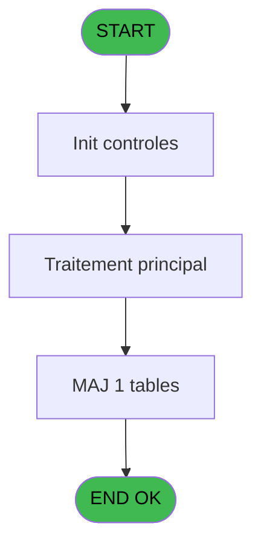
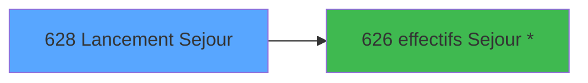

# REF IDE 628 - Lancement Sejour

> **Analyse**: Phases 1-4 2026-02-03 13:15 -> 13:15 (18s) | Assemblage 13:15
> **Pipeline**: V7.2 Enrichi
> **Structure**: 4 onglets (Resume | Ecrans | Donnees | Connexions)

<!-- TAB:Resume -->

## 1. FICHE D'IDENTITE

| Attribut | Valeur |
|----------|--------|
| Projet | REF |
| IDE Position | 628 |
| Nom Programme | Lancement Sejour |
| Fichier source | `Prg_628.xml` |
| Dossier IDE | General |
| Taches | 2 (1 ecrans visibles) |
| Tables modifiees | 1 |
| Programmes appeles | 1 |
| :warning: Statut | **ORPHELIN_POTENTIEL** |

## 2. DESCRIPTION FONCTIONNELLE

**Lancement Sejour** assure la gestion complete de ce processus.

Le flux de traitement s'organise en **1 blocs fonctionnels** :

- **Traitement** (2 taches) : traitements metier divers

**Donnees modifiees** : 1 tables en ecriture (effectif_Q_new).

## 3. BLOCS FONCTIONNELS

### 3.1 Traitement (2 taches)

Traitements internes.

---

#### 628 - effectifs sav [[ECRAN]](#ecran-t1)

**Role** : Traitement : effectifs sav.
**Ecran** : 965 x 464 DLU | [Voir mockup](#ecran-t1)
**Delegue a** : [effectifs Sejour * (IDE 626)](REF-IDE-626.md)

---

#### 628.1 - Delete

**Role** : Traitement : Delete.
**Delegue a** : [effectifs Sejour * (IDE 626)](REF-IDE-626.md)

## 5. REGLES METIER

*(Aucune regle metier identifiee)*

## 6. CONTEXTE

- **Appele par**: (aucun)
- **Appelle**: 1 programmes | **Tables**: 1 (W:1 R:0 L:0) | **Taches**: 2 | **Expressions**: 14

<!-- TAB:Ecrans -->

## 8. ECRANS

### 8.1 Forms visibles (1 / 2)

| # | Position | Tache | Nom | Type | Largeur | Hauteur | Bloc |
|---|----------|-------|-----|------|---------|---------|------|
| 1 | 628 | 628 | effectifs sav | Type0 | 965 | 464 | Traitement |

### 8.2 Mockups Ecrans

---

#### 628 - effectifs sav
**Tache** : [628](#t1) | **Type** : Type0 | **Dimensions** : 965 x 464 DLU
**Bloc** : Traitement | **Titre IDE** : effectifs sav

<!-- FORM-DATA:
{
    "width":  965,
    "vFactor":  8,
    "type":  "Type0",
    "hFactor":  4,
    "controls":  [
                     {
                         "x":  12,
                         "type":  "label",
                         "var":  "",
                         "y":  216,
                         "w":  104,
                         "fmt":  "",
                         "name":  "CodeOpe(‘V’,’D’)",
                         "h":  9,
                         "color":  "",
                         "text":  "CodeOpe(‘V’,’D’)",
                         "parent":  null
                     },
                     {
                         "x":  236,
                         "type":  "label",
                         "var":  "",
                         "y":  216,
                         "w":  72,
                         "fmt":  "",
                         "name":  "",
                         "h":  9,
                         "color":  "",
                         "text":  "Date de debut",
                         "parent":  null
                     },
                     {
                         "x":  420,
                         "type":  "label",
                         "var":  "",
                         "y":  216,
                         "w":  72,
                         "fmt":  "",
                         "name":  "",
                         "h":  9,
                         "color":  "",
                         "text":  "Date de fin",
                         "parent":  null
                     },
                     {
                         "x":  12,
                         "type":  "label",
                         "var":  "",
                         "y":  232,
                         "w":  104,
                         "fmt":  "",
                         "name":  "",
                         "h":  9,
                         "color":  "",
                         "text":  "heure debut",
                         "parent":  null
                     },
                     {
                         "x":  12,
                         "type":  "label",
                         "var":  "",
                         "y":  248,
                         "w":  104,
                         "fmt":  "",
                         "name":  "",
                         "h":  9,
                         "color":  "",
                         "text":  "Heure fin",
                         "parent":  null
                     },
                     {
                         "x":  12,
                         "type":  "label",
                         "var":  "",
                         "y":  264,
                         "w":  104,
                         "fmt":  "",
                         "name":  "",
                         "h":  9,
                         "color":  "",
                         "text":  "Qualité",
                         "parent":  null
                     },
                     {
                         "x":  12,
                         "type":  "label",
                         "var":  "",
                         "y":  280,
                         "w":  104,
                         "fmt":  "",
                         "name":  "",
                         "h":  9,
                         "color":  "",
                         "text":  "Qualité_compl",
                         "parent":  null
                     },
                     {
                         "x":  12,
                         "type":  "label",
                         "var":  "",
                         "y":  296,
                         "w":  104,
                         "fmt":  "",
                         "name":  "",
                         "h":  9,
                         "color":  "",
                         "text":  "quantité",
                         "parent":  null
                     },
                     {
                         "x":  12,
                         "type":  "label",
                         "var":  "",
                         "y":  312,
                         "w":  104,
                         "fmt":  "",
                         "name":  "",
                         "h":  9,
                         "color":  "",
                         "text":  "Groupe",
                         "parent":  null
                     },
                     {
                         "x":  12,
                         "type":  "label",
                         "var":  "",
                         "y":  328,
                         "w":  104,
                         "fmt":  "",
                         "name":  "",
                         "h":  9,
                         "color":  "",
                         "text":  "Societe",
                         "parent":  null
                     },
                     {
                         "x":  12,
                         "type":  "label",
                         "var":  "",
                         "y":  344,
                         "w":  104,
                         "fmt":  "",
                         "name":  "",
                         "h":  9,
                         "color":  "",
                         "text":  "Compte",
                         "parent":  null
                     },
                     {
                         "x":  12,
                         "type":  "label",
                         "var":  "",
                         "y":  360,
                         "w":  104,
                         "fmt":  "",
                         "name":  "",
                         "h":  9,
                         "color":  "",
                         "text":  "Filiation",
                         "parent":  null
                     },
                     {
                         "x":  12,
                         "type":  "label",
                         "var":  "",
                         "y":  376,
                         "w":  104,
                         "fmt":  "",
                         "name":  "",
                         "h":  9,
                         "color":  "",
                         "text":  "Repas",
                         "parent":  null
                     },
                     {
                         "x":  12,
                         "type":  "label",
                         "var":  "",
                         "y":  392,
                         "w":  104,
                         "fmt":  "",
                         "name":  "",
                         "h":  9,
                         "color":  "",
                         "text":  "Code_repas_nenc_vil",
                         "parent":  null
                     },
                     {
                         "x":  8,
                         "type":  "table",
                         "var":  "",
                         "name":  "",
                         "titleH":  12,
                         "color":  "",
                         "w":  2251,
                         "y":  8,
                         "fmt":  "",
                         "parent":  null,
                         "text":  "",
                         "rowH":  13,
                         "h":  182,
                         "cols":  [
                                      {
                                          "title":  "date_consommation",
                                          "layer":  1,
                                          "w":  79
                                      },
                                      {
                                          "title":  "qualite",
                                          "layer":  2,
                                          "w":  28
                                      },
                                      {
                                          "title":  "qualite_complementaire",
                                          "layer":  3,
                                          "w":  92
                                      },
                                      {
                                          "title":  "code_repas_nenc_vil",
                                          "layer":  4,
                                          "w":  85
                                      },
                                      {
                                          "title":  "groupe",
                                          "layer":  5,
                                          "w":  290
                                      },
                                      {
                                          "title":  "societe",
                                          "layer":  6,
                                          "w":  30
                                      },
                                      {
                                          "title":  "compte",
                                          "layer":  7,
                                          "w":  49
                                      },
                                      {
                                          "title":  "filiation",
                                          "layer":  8,
                                          "w":  29
                                      },
                                      {
                                          "title":  "repas",
                                          "layer":  9,
                                          "w":  27
                                      },
                                      {
                                          "title":  "motif_annulation",
                                          "layer":  10,
                                          "w":  570
                                      },
                                      {
                                          "title":  "nb_reel",
                                          "layer":  11,
                                          "w":  44
                                      },
                                      {
                                          "title":  "nb_prev",
                                          "layer":  12,
                                          "w":  44
                                      },
                                      {
                                          "title":  "statut_validation",
                                          "layer":  13,
                                          "w":  65
                                      },
                                      {
                                          "title":  "date_valdiation",
                                          "layer":  14,
                                          "w":  68
                                      },
                                      {
                                          "title":  "nb_ajustement",
                                          "layer":  15,
                                          "w":  58
                                      },
                                      {
                                          "title":  "date_der_modif",
                                          "layer":  16,
                                          "w":  68
                                      },
                                      {
                                          "title":  "heure_der_modif",
                                          "layer":  17,
                                          "w":  66
                                      },
                                      {
                                          "title":  "user_der_modif",
                                          "layer":  18,
                                          "w":  61
                                      },
                                      {
                                          "title":  "lieu_sejour",
                                          "layer":  19,
                                          "w":  43
                                      },
                                      {
                                          "title":  "v_comptage_enregistrement",
                                          "layer":  20,
                                          "w":  110
                                      }
                                  ],
                         "rows":  20
                     },
                     {
                         "x":  12,
                         "type":  "edit",
                         "var":  "",
                         "y":  23,
                         "w":  61,
                         "fmt":  "",
                         "name":  "date_consommation",
                         "h":  10,
                         "color":  "",
                         "text":  "",
                         "parent":  29
                     },
                     {
                         "x":  91,
                         "type":  "edit",
                         "var":  "",
                         "y":  23,
                         "w":  20,
                         "fmt":  "",
                         "name":  "qualite",
                         "h":  10,
                         "color":  "",
                         "text":  "",
                         "parent":  29
                     },
                     {
                         "x":  119,
                         "type":  "edit",
                         "var":  "",
                         "y":  23,
                         "w":  26,
                         "fmt":  "",
                         "name":  "qualite_complementaire",
                         "h":  10,
                         "color":  "",
                         "text":  "",
                         "parent":  29
                     },
                     {
                         "x":  211,
                         "type":  "edit",
                         "var":  "",
                         "y":  23,
                         "w":  37,
                         "fmt":  "",
                         "name":  "code_repas_nenc_vil",
                         "h":  10,
                         "color":  "",
                         "text":  "",
                         "parent":  29
                     },
                     {
                         "x":  296,
                         "type":  "edit",
                         "var":  "",
                         "y":  23,
                         "w":  283,
                         "fmt":  "",
                         "name":  "groupe",
                         "h":  10,
                         "color":  "",
                         "text":  "",
                         "parent":  29
                     },
                     {
                         "x":  586,
                         "type":  "edit",
                         "var":  "",
                         "y":  23,
                         "w":  9,
                         "fmt":  "",
                         "name":  "societe",
                         "h":  10,
                         "color":  "",
                         "text":  "",
                         "parent":  29
                     },
                     {
                         "x":  616,
                         "type":  "edit",
                         "var":  "",
                         "y":  23,
                         "w":  42,
                         "fmt":  "",
                         "name":  "compte",
                         "h":  10,
                         "color":  "",
                         "text":  "",
                         "parent":  29
                     },
                     {
                         "x":  665,
                         "type":  "edit",
                         "var":  "",
                         "y":  23,
                         "w":  18,
                         "fmt":  "",
                         "name":  "filiation",
                         "h":  10,
                         "color":  "",
                         "text":  "",
                         "parent":  29
                     },
                     {
                         "x":  694,
                         "type":  "edit",
                         "var":  "",
                         "y":  23,
                         "w":  20,
                         "fmt":  "",
                         "name":  "repas",
                         "h":  10,
                         "color":  "",
                         "text":  "",
                         "parent":  29
                     },
                     {
                         "x":  721,
                         "type":  "edit",
                         "var":  "",
                         "y":  23,
                         "w":  563,
                         "fmt":  "",
                         "name":  "motif_annulation",
                         "h":  10,
                         "color":  "",
                         "text":  "",
                         "parent":  29
                     },
                     {
                         "x":  1291,
                         "type":  "edit",
                         "var":  "",
                         "y":  23,
                         "w":  37,
                         "fmt":  "",
                         "name":  "nb_reel",
                         "h":  10,
                         "color":  "",
                         "text":  "",
                         "parent":  29
                     },
                     {
                         "x":  1335,
                         "type":  "edit",
                         "var":  "",
                         "y":  23,
                         "w":  37,
                         "fmt":  "",
                         "name":  "nb_prev",
                         "h":  10,
                         "color":  "",
                         "text":  "",
                         "parent":  29
                     },
                     {
                         "x":  1379,
                         "type":  "edit",
                         "var":  "",
                         "y":  23,
                         "w":  9,
                         "fmt":  "",
                         "name":  "statut_validation",
                         "h":  10,
                         "color":  "",
                         "text":  "",
                         "parent":  29
                     },
                     {
                         "x":  1444,
                         "type":  "edit",
                         "var":  "",
                         "y":  23,
                         "w":  61,
                         "fmt":  "",
                         "name":  "date_valdiation",
                         "h":  10,
                         "color":  "",
                         "text":  "",
                         "parent":  29
                     },
                     {
                         "x":  1512,
                         "type":  "edit",
                         "var":  "",
                         "y":  23,
                         "w":  37,
                         "fmt":  "",
                         "name":  "nb_ajustement",
                         "h":  10,
                         "color":  "",
                         "text":  "",
                         "parent":  29
                     },
                     {
                         "x":  1570,
                         "type":  "edit",
                         "var":  "",
                         "y":  23,
                         "w":  61,
                         "fmt":  "",
                         "name":  "date_der_modif",
                         "h":  10,
                         "color":  "",
                         "text":  "",
                         "parent":  29
                     },
                     {
                         "x":  1638,
                         "type":  "edit",
                         "var":  "",
                         "y":  23,
                         "w":  46,
                         "fmt":  "",
                         "name":  "heure_der_modif",
                         "h":  10,
                         "color":  "",
                         "text":  "",
                         "parent":  29
                     },
                     {
                         "x":  1704,
                         "type":  "edit",
                         "var":  "",
                         "y":  23,
                         "w":  48,
                         "fmt":  "",
                         "name":  "user_der_modif",
                         "h":  10,
                         "color":  "",
                         "text":  "",
                         "parent":  29
                     },
                     {
                         "x":  1765,
                         "type":  "edit",
                         "var":  "",
                         "y":  23,
                         "w":  9,
                         "fmt":  "",
                         "name":  "lieu_sejour",
                         "h":  10,
                         "color":  "",
                         "text":  "",
                         "parent":  29
                     },
                     {
                         "x":  1808,
                         "type":  "edit",
                         "var":  "",
                         "y":  23,
                         "w":  37,
                         "fmt":  "",
                         "name":  "v_comptage_enregistrement",
                         "h":  10,
                         "color":  "",
                         "text":  "",
                         "parent":  29
                     },
                     {
                         "x":  856,
                         "type":  "button",
                         "var":  "",
                         "y":  200,
                         "w":  80,
                         "fmt":  "modification",
                         "name":  "modification",
                         "h":  14,
                         "color":  "",
                         "text":  "",
                         "parent":  null
                     },
                     {
                         "x":  140,
                         "type":  "edit",
                         "var":  "",
                         "y":  216,
                         "w":  72,
                         "fmt":  "",
                         "name":  "P .codeOpe(‘V’,’D’)_0001",
                         "h":  10,
                         "color":  "",
                         "text":  "",
                         "parent":  null
                     },
                     {
                         "x":  320,
                         "type":  "edit",
                         "var":  "",
                         "y":  216,
                         "w":  72,
                         "fmt":  "##/##/####",
                         "name":  "Date de début",
                         "h":  10,
                         "color":  "",
                         "text":  "",
                         "parent":  null
                     },
                     {
                         "x":  504,
                         "type":  "edit",
                         "var":  "",
                         "y":  216,
                         "w":  61,
                         "fmt":  "",
                         "name":  "v.date de fin",
                         "h":  10,
                         "color":  "",
                         "text":  "",
                         "parent":  null
                     },
                     {
                         "x":  140,
                         "type":  "edit",
                         "var":  "",
                         "y":  232,
                         "w":  72,
                         "fmt":  "",
                         "name":  "v.heure debut",
                         "h":  10,
                         "color":  "",
                         "text":  "",
                         "parent":  null
                     },
                     {
                         "x":  140,
                         "type":  "edit",
                         "var":  "",
                         "y":  248,
                         "w":  72,
                         "fmt":  "",
                         "name":  "v.heure fin",
                         "h":  10,
                         "color":  "",
                         "text":  "",
                         "parent":  null
                     },
                     {
                         "x":  856,
                         "type":  "button",
                         "var":  "",
                         "y":  248,
                         "w":  80,
                         "fmt":  "creation",
                         "name":  "creation",
                         "h":  14,
                         "color":  "",
                         "text":  "",
                         "parent":  null
                     },
                     {
                         "x":  140,
                         "type":  "edit",
                         "var":  "",
                         "y":  264,
                         "w":  72,
                         "fmt":  "",
                         "name":  "P.Qualité N_0001",
                         "h":  10,
                         "color":  "",
                         "text":  "",
                         "parent":  null
                     },
                     {
                         "x":  140,
                         "type":  "edit",
                         "var":  "",
                         "y":  280,
                         "w":  72,
                         "fmt":  "",
                         "name":  "P.Qualité_compl N_0001",
                         "h":  10,
                         "color":  "",
                         "text":  "",
                         "parent":  null
                     },
                     {
                         "x":  140,
                         "type":  "edit",
                         "var":  "",
                         "y":  296,
                         "w":  72,
                         "fmt":  "",
                         "name":  "v.quantité",
                         "h":  10,
                         "color":  "",
                         "text":  "",
                         "parent":  null
                     },
                     {
                         "x":  856,
                         "type":  "button",
                         "var":  "",
                         "y":  296,
                         "w":  80,
                         "fmt":  "suppression",
                         "name":  "suppression",
                         "h":  14,
                         "color":  "",
                         "text":  "",
                         "parent":  null
                     },
                     {
                         "x":  140,
                         "type":  "edit",
                         "var":  "",
                         "y":  312,
                         "w":  283,
                         "fmt":  "",
                         "name":  "V.groupe",
                         "h":  10,
                         "color":  "",
                         "text":  "",
                         "parent":  null
                     },
                     {
                         "x":  140,
                         "type":  "edit",
                         "var":  "",
                         "y":  328,
                         "w":  20,
                         "fmt":  "",
                         "name":  "v.societe",
                         "h":  10,
                         "color":  "",
                         "text":  "",
                         "parent":  null
                     },
                     {
                         "x":  140,
                         "type":  "edit",
                         "var":  "",
                         "y":  344,
                         "w":  37,
                         "fmt":  "",
                         "name":  "v.compte",
                         "h":  10,
                         "color":  "",
                         "text":  "",
                         "parent":  null
                     },
                     {
                         "x":  140,
                         "type":  "edit",
                         "var":  "",
                         "y":  360,
                         "w":  18,
                         "fmt":  "",
                         "name":  "v.filiation",
                         "h":  10,
                         "color":  "",
                         "text":  "",
                         "parent":  null
                     },
                     {
                         "x":  140,
                         "type":  "edit",
                         "var":  "",
                         "y":  376,
                         "w":  20,
                         "fmt":  "",
                         "name":  "v.repas_0001",
                         "h":  10,
                         "color":  "",
                         "text":  "",
                         "parent":  null
                     },
                     {
                         "x":  140,
                         "type":  "edit",
                         "var":  "",
                         "y":  392,
                         "w":  37,
                         "fmt":  "",
                         "name":  "v.Code_repas_nenc_vil",
                         "h":  10,
                         "color":  "",
                         "text":  "",
                         "parent":  null
                     }
                 ],
    "taskId":  "628",
    "height":  464
}
-->

<strong>Champs : 34 champs</strong>

| Pos (x,y) | Nom | Variable | Type |
|-----------|-----|----------|------|
| 12,23 | date_consommation | - | edit |
| 91,23 | qualite | - | edit |
| 119,23 | qualite_complementaire | - | edit |
| 211,23 | code_repas_nenc_vil | - | edit |
| 296,23 | groupe | - | edit |
| 586,23 | societe | - | edit |
| 616,23 | compte | - | edit |
| 665,23 | filiation | - | edit |
| 694,23 | repas | - | edit |
| 721,23 | motif_annulation | - | edit |
| 1291,23 | nb_reel | - | edit |
| 1335,23 | nb_prev | - | edit |
| 1379,23 | statut_validation | - | edit |
| 1444,23 | date_valdiation | - | edit |
| 1512,23 | nb_ajustement | - | edit |
| 1570,23 | date_der_modif | - | edit |
| 1638,23 | heure_der_modif | - | edit |
| 1704,23 | user_der_modif | - | edit |
| 1765,23 | lieu_sejour | - | edit |
| 1808,23 | v_comptage_enregistrement | - | edit |
| 140,216 | P .codeOpe(‘V’,’D’)_0001 | - | edit |
| 320,216 | Date de début | - | edit |
| 504,216 | v.date de fin | - | edit |
| 140,232 | v.heure debut | - | edit |
| 140,248 | v.heure fin | - | edit |
| 140,264 | P.Qualité N_0001 | - | edit |
| 140,280 | P.Qualité_compl N_0001 | - | edit |
| 140,296 | v.quantité | - | edit |
| 140,312 | V.groupe | - | edit |
| 140,328 | v.societe | - | edit |
| 140,344 | v.compte | - | edit |
| 140,360 | v.filiation | - | edit |
| 140,376 | v.repas_0001 | - | edit |
| 140,392 | v.Code_repas_nenc_vil | - | edit |

<strong>Boutons : 3 boutons</strong>

| Bouton | Pos (x,y) | Action |
|--------|-----------|--------|
| modification | 856,200 | Modifie l'element |
| creation | 856,248 | Bouton fonctionnel |
| suppression | 856,296 | Supprime l'element selectionne |

## 9. NAVIGATION

Ecran unique: **effectifs sav**

### 9.3 Structure hierarchique (2 taches)

| Position | Tache | Type | Dimensions | Bloc |
|----------|-------|------|------------|------|
| **628.1** | [**effectifs sav** (628)](#t1) [mockup](#ecran-t1) | - | 965x464 | Traitement |
| 628.1.1 | [Delete (628.1)](#t2) | - | - | |

### 9.4 Algorigramme

> **Legende**: Vert = START/END OK | Rouge = END KO | Bleu = Decisions
> *Algorigramme auto-genere. Utiliser `/algorigramme` pour une synthese metier detaillee.*

<!-- TAB:Donnees -->

## 10. TABLES

### Tables utilisees (1)

| ID | Nom | Description | Type | R | W | L | Usages |
|----|-----|-------------|------|---|---|---|--------|
| 889 | effectif_Q_new |  | DB |   | **W** |   | 1 |

### Colonnes par table (1 / 1 tables avec colonnes identifiees)

Table 889 - effectif_Q_new (**W**) - 1 usages

| Lettre | Variable | Acces | Type |
|--------|----------|-------|------|
| A | v_comptage_enregistrement | W | Numeric |
| B | V. Date de consommation | W | Date |
| C | v.date de fin | W | Date |
| D | v.Mode (Créatio/Modif/Suppress) | W | Unicode |
| E | v .codeOpe(‘V’,’D’) | W | Unicode |
| F | v.Qualité N | W | Unicode |
| G | v.Qualité_compl N | W | Unicode |
| H | v.Code_repas_nenc_vil | W | Unicode |
| I | v.quantité | W | Numeric |
| J | v.heure debut | W | Time |
| K | v.heure fin | W | Time |
| L | V.groupe | W | Unicode |
| M | v.societe | W | Unicode |
| N | v.compte | W | Numeric |
| O | v.filiation | W | Numeric |
| P | v.repas | W | Unicode |

## 11. VARIABLES

### 11.1 Variables de session (15)

Variables persistantes pendant toute la session.

| Lettre | Nom | Type | Usage dans |
|--------|-----|------|-----------|
| B | V. Date de consommation | Date | - |
| C | v.date de fin | Date | - |
| D | v.Mode (Créatio/Modif/Suppress) | Unicode | - |
| E | v .codeOpe(‘V’,’D’) | Unicode | - |
| F | v.Qualité N | Unicode | - |
| G | v.Qualité_compl N | Unicode | - |
| H | v.Code_repas_nenc_vil | Unicode | - |
| I | v.quantité | Numeric | - |
| J | v.heure debut | Time | - |
| K | v.heure fin | Time | - |
| L | V.groupe | Unicode | - |
| M | v.societe | Unicode | - |
| N | v.compte | Numeric | - |
| O | v.filiation | Numeric | - |
| P | v.repas | Unicode | - |

### 11.2 Autres (1)

Variables diverses.

| Lettre | Nom | Type | Usage dans |
|--------|-----|------|-----------|
| A | v_comptage_enregistrement | Numeric | - |

Toutes les 16 variables (liste complete)

| Cat | Lettre | Nom Variable | Type |
|-----|--------|--------------|------|
| V. | **B** | V. Date de consommation | Date |
| V. | **C** | v.date de fin | Date |
| V. | **D** | v.Mode (Créatio/Modif/Suppress) | Unicode |
| V. | **E** | v .codeOpe(‘V’,’D’) | Unicode |
| V. | **F** | v.Qualité N | Unicode |
| V. | **G** | v.Qualité_compl N | Unicode |
| V. | **H** | v.Code_repas_nenc_vil | Unicode |
| V. | **I** | v.quantité | Numeric |
| V. | **J** | v.heure debut | Time |
| V. | **K** | v.heure fin | Time |
| V. | **L** | V.groupe | Unicode |
| V. | **M** | v.societe | Unicode |
| V. | **N** | v.compte | Numeric |
| V. | **O** | v.filiation | Numeric |
| V. | **P** | v.repas | Unicode |
| Autre | **A** | v_comptage_enregistrement | Numeric |

## 12. EXPRESSIONS

**14 / 14 expressions decodees (100%)**

### 12.1 Repartition par type

| Type | Expressions | Regles |
|------|-------------|--------|
| CONSTANTE | 10 | 0 |
| DATE | 2 | 0 |
| STRING | 2 | 0 |

### 12.2 Expressions cles par type

#### CONSTANTE (10 expressions)

| Type | IDE | Expression | Regle |
|------|-----|------------|-------|
| CONSTANTE | 8 | `1` | - |
| CONSTANTE | 7 | `'GE'` | - |
| CONSTANTE | 11 | `'C'` | - |
| CONSTANTE | 13 | `0` | - |
| CONSTANTE | 12 | `91105` | - |
| ... | | *+5 autres* | |

#### DATE (2 expressions)

| Type | IDE | Expression | Regle |
|------|-----|------------|-------|
| DATE | 14 | `DVal('14/04/2018','DD/MM/YYYY')` | - |
| DATE | 4 | `Date()` | - |

#### STRING (2 expressions)

| Type | IDE | Expression | Regle |
|------|-----|------------|-------|
| STRING | 10 | `TVal('23:00:00','')` | - |
| STRING | 9 | `TVal('10:00:00','')` | - |

<!-- TAB:Connexions -->

## 13. GRAPHE D'APPELS

### 13.1 Chaine depuis Main (Callers)

**Chemin**: (pas de callers directs)

### 13.2 Callers

| IDE | Nom Programme | Nb Appels |
|-----|---------------|-----------|
| - | (aucun) | - |

### 13.3 Callees (programmes appeles)

### 13.4 Detail Callees avec contexte

| IDE | Nom Programme | Appels | Contexte |
|-----|---------------|--------|----------|
| [626](REF-IDE-626.md) | effectifs Sejour * | 3 | Sous-programme |

## 14. RECOMMANDATIONS MIGRATION

### 14.1 Profil du programme

| Metrique | Valeur | Impact migration |
|----------|--------|-----------------|
| Lignes de logique | 65 | Programme compact |
| Expressions | 14 | Peu de logique |
| Tables WRITE | 1 | Impact faible |
| Sous-programmes | 1 | Peu de dependances |
| Ecrans visibles | 1 | Ecran unique ou traitement batch |
| Code desactive | 0% (0 / 65) | Code sain |
| Regles metier | 0 | Pas de regle identifiee |

### 14.2 Plan de migration par bloc

#### Traitement (2 taches: 1 ecran, 1 traitement)

- **Strategie** : Orchestrateur avec 1 ecrans (Razor/React) et 1 traitements backend (services).
- Les ecrans deviennent des composants UI, les traitements invisibles deviennent des services injectables.
- 1 sous-programme(s) a migrer ou a reutiliser depuis les services existants.
- Decomposer les taches en services unitaires testables.

### 14.3 Dependances critiques

| Dependance | Type | Appels | Impact |
|------------|------|--------|--------|
| effectif_Q_new | Table WRITE (Database) | 1x | Schema + repository |
| [effectifs Sejour * (IDE 626)](REF-IDE-626.md) | Sous-programme | 3x | **CRITIQUE** - Sous-programme |

---
*Spec DETAILED generee par Pipeline V7.2 - 2026-02-03 13:15*
