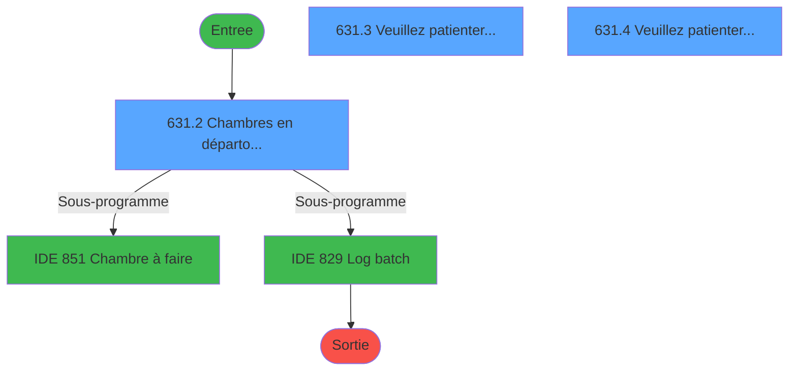
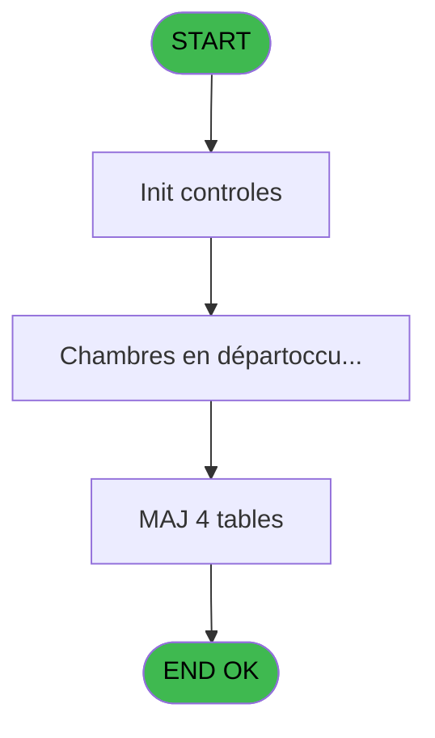
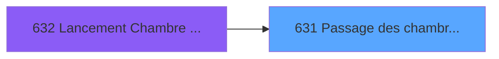
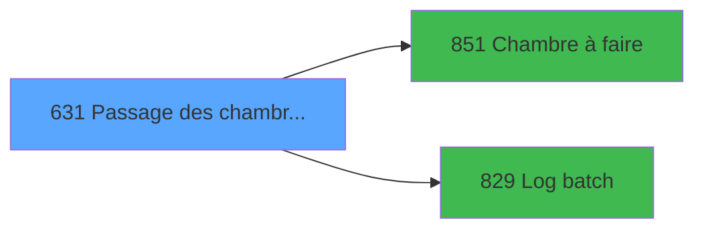

# REF IDE 631 - Passage des chambres en depart

> **Analyse**: Phases 1-4 2026-02-03 13:16 -> 13:16 (17s) | Assemblage 13:16
> **Pipeline**: V7.2 Enrichi
> **Structure**: 4 onglets (Resume | Ecrans | Donnees | Connexions)

<!-- TAB:Resume -->

## 1. FICHE D'IDENTITE

| Attribut | Valeur |
|----------|--------|
| Projet | REF |
| IDE Position | 631 |
| Nom Programme | Passage des chambres en depart |
| Fichier source | `Prg_631.xml` |
| Dossier IDE | General |
| Taches | 12 (3 ecrans visibles) |
| Tables modifiees | 4 |
| Programmes appeles | 2 |

## 2. DESCRIPTION FONCTIONNELLE

**Passage des chambres en depart** assure la gestion complete de ce processus, accessible depuis [Lancement Chambre en départ (IDE 632)](REF-IDE-632.md).

Le flux de traitement s'organise en **3 blocs fonctionnels** :

- **Traitement** (9 taches) : traitements metier divers
- **Consultation** (2 taches) : ecrans de recherche, selection et consultation
- **Creation** (1 tache) : insertion d'enregistrements en base (mouvements, prestations)

**Donnees modifiees** : 4 tables en ecriture (hebergement______heb, historik_station, logement_go______lop, logement_client__loc).

**Logique metier** : 5 regles identifiees couvrant conditions metier, valeurs par defaut.

Detail : phases du traitement

#### Phase 1 : Traitement (9 taches)

- **631** - Passage des chambres en depart
- **631.1** - Ménage standard ?
- **631.2** - Chambres en départ/occupées **[[ECRAN]](#ecran-t3)**
- **631.3** - Veuillez patienter... **[[ECRAN]](#ecran-t4)**
- **631.4** - Veuillez patienter... **[[ECRAN]](#ecran-t6)**
- **631.6** - (sans nom)
- **631.7** - (sans nom)
- **631.8** - (sans nom)
- **631.9** - (sans nom)

Delegue a : [Chambre à faire (IDE 851)](REF-IDE-851.md), [Log batch (IDE 829)](REF-IDE-829.md)

#### Phase 2 : Consultation (2 taches)

- **631.3.1** - Recherche si chambre en depart
- **631.4.1** - Recherche si chambre en depart

#### Phase 3 : Creation (1 tache)

- **631.5** - Creation Historique

#### Tables impactees

| Table | Operations | Role metier |
|-------|-----------|-------------|
| hebergement______heb | R/**W** (3 usages) | Hebergement (chambres) |
| logement_client__loc | **W**/L (2 usages) |  |
| logement_go______lop | **W**/L (2 usages) |  |
| historik_station | **W** (1 usages) | Historique / journal |

## 3. BLOCS FONCTIONNELS

### 3.1 Traitement (9 taches)

Traitements internes.

---

#### 631 - Passage des chambres en depart

**Role** : Tache d'orchestration : point d'entree du programme (9 sous-taches). Coordonne l'enchainement des traitements.

8 sous-taches directes

| Tache | Nom | Bloc |
|-------|-----|------|
| [631.1](#t2) | Ménage standard ? | Traitement |
| [631.2](#t3) | Chambres en départ/occupées **[[ECRAN]](#ecran-t3)** | Traitement |
| [631.3](#t4) | Veuillez patienter... **[[ECRAN]](#ecran-t4)** | Traitement |
| [631.4](#t6) | Veuillez patienter... **[[ECRAN]](#ecran-t6)** | Traitement |
| [631.6](#t9) | (sans nom) | Traitement |
| [631.7](#t10) | (sans nom) | Traitement |
| [631.8](#t13) | (sans nom) | Traitement |
| [631.9](#t16) | (sans nom) | Traitement |

**Variables liees** : G (v.Compteurs chambres)
**Delegue a** : [Chambre à faire (IDE 851)](REF-IDE-851.md), [Log batch (IDE 829)](REF-IDE-829.md)

---

#### 631.1 - Ménage standard ?

**Role** : Traitement : Ménage standard ?.
**Variables liees** : E (v.Ménage standard ?)
**Delegue a** : [Chambre à faire (IDE 851)](REF-IDE-851.md), [Log batch (IDE 829)](REF-IDE-829.md)

---

#### 631.2 - Chambres en départ/occupées [[ECRAN]](#ecran-t3)

**Role** : Traitement : Chambres en départ/occupées.
**Ecran** : 303 x 24 DLU (MDI) | [Voir mockup](#ecran-t3)
**Variables liees** : G (v.Compteurs chambres)
**Delegue a** : [Chambre à faire (IDE 851)](REF-IDE-851.md), [Log batch (IDE 829)](REF-IDE-829.md)

---

#### 631.3 - Veuillez patienter... [[ECRAN]](#ecran-t4)

**Role** : Traitement : Veuillez patienter....
**Ecran** : 422 x 56 DLU (MDI) | [Voir mockup](#ecran-t4)
**Delegue a** : [Chambre à faire (IDE 851)](REF-IDE-851.md), [Log batch (IDE 829)](REF-IDE-829.md)

---

#### 631.4 - Veuillez patienter... [[ECRAN]](#ecran-t6)

**Role** : Traitement : Veuillez patienter....
**Ecran** : 422 x 56 DLU (MDI) | [Voir mockup](#ecran-t6)
**Delegue a** : [Chambre à faire (IDE 851)](REF-IDE-851.md), [Log batch (IDE 829)](REF-IDE-829.md)

---

#### 631.6 - (sans nom)

**Role** : Traitement interne.
**Delegue a** : [Chambre à faire (IDE 851)](REF-IDE-851.md), [Log batch (IDE 829)](REF-IDE-829.md)

---

#### 631.7 - (sans nom)

**Role** : Traitement interne.
**Delegue a** : [Chambre à faire (IDE 851)](REF-IDE-851.md), [Log batch (IDE 829)](REF-IDE-829.md)

---

#### 631.8 - (sans nom)

**Role** : Traitement interne.
**Delegue a** : [Chambre à faire (IDE 851)](REF-IDE-851.md), [Log batch (IDE 829)](REF-IDE-829.md)

---

#### 631.9 - (sans nom)

**Role** : Traitement interne.
**Delegue a** : [Chambre à faire (IDE 851)](REF-IDE-851.md), [Log batch (IDE 829)](REF-IDE-829.md)

### 3.2 Consultation (2 taches)

Ecrans de recherche et consultation.

---

#### 631.3.1 - Recherche si chambre en depart

**Role** : Traitement : Recherche si chambre en depart.
**Variables liees** : G (v.Compteurs chambres)

---

#### 631.4.1 - Recherche si chambre en depart

**Role** : Traitement : Recherche si chambre en depart.
**Variables liees** : G (v.Compteurs chambres)

### 3.3 Creation (1 tache)

Insertion de nouveaux enregistrements en base.

---

#### 631.5 - Creation Historique

**Role** : Consultation/chargement : Creation Historique.

## 5. REGLES METIER

5 regles identifiees:

### Autres (5 regles)

#### [RM-001] Valeur par defaut si v.Code Societe [C] est vide

| Element | Detail |
|---------|--------|
| **Condition** | `v.Code Societe [C]=''` |
| **Si vrai** | 'C' |
| **Si faux** | v.Code Societe [C]) |
| **Variables** | C (v.Code Societe) |
| **Expression source** | Expression 1 : `IF (v.Code Societe [C]='','C',v.Code Societe [C])` |
| **Exemple** | Si v.Code Societe [C]='' → 'C'. Sinon → v.Code Societe [C]) |

#### [RM-002] Valeur par defaut si v.Code Langue [D] est vide

| Element | Detail |
|---------|--------|
| **Condition** | `v.Code Langue [D]=''` |
| **Si vrai** | 'F' |
| **Si faux** | v.Code Langue [D]) |
| **Variables** | D (v.Code Langue) |
| **Expression source** | Expression 2 : `IF (v.Code Langue [D]='','F',v.Code Langue [D])` |
| **Exemple** | Si v.Code Langue [D]='' → 'F'. Sinon → v.Code Langue [D]) |

#### [RM-003] Si P.i.Date [A]='00/00/0000'DATE alors Date() sinon P.i.Date [A])

| Element | Detail |
|---------|--------|
| **Condition** | `P.i.Date [A]='00/00/0000'DATE` |
| **Si vrai** | Date() |
| **Si faux** | P.i.Date [A]) |
| **Variables** | A (P.i.Date) |
| **Expression source** | Expression 4 : `IF(P.i.Date [A]='00/00/0000'DATE, Date(), P.i.Date [A])` |
| **Exemple** | Si P.i.Date [A]='00/00/0000'DATE → Date(). Sinon → P.i.Date [A]) |

#### [RM-004] Si v.Compteurs chambres [G]>0 alors MlsTrans('Chambres') sinon '')

| Element | Detail |
|---------|--------|
| **Condition** | `v.Compteurs chambres [G]>0` |
| **Si vrai** | MlsTrans('Chambres') |
| **Si faux** | '') |
| **Variables** | G (v.Compteurs chambres) |
| **Expression source** | Expression 12 : `IF(v.Compteurs chambres [G]>0, MlsTrans('Chambres'), '')` |
| **Exemple** | Si v.Compteurs chambres [G]>0 → MlsTrans('Chambres'). Sinon → '') |
| **Impact** | [631.2 - Chambres en départ/occupées](#t3) |

#### [RM-005] Si v.Compteurs tiers [H]>0 alors StrBuild('@1@ GM/GO' sinon Str(v.Compteurs tiers [H], '5')), '')

| Element | Detail |
|---------|--------|
| **Condition** | `v.Compteurs tiers [H]>0` |
| **Si vrai** | StrBuild('@1@ GM/GO' |
| **Si faux** | Str(v.Compteurs tiers [H], '5')), '') |
| **Variables** | H (v.Compteurs tiers) |
| **Expression source** | Expression 13 : `IF(v.Compteurs tiers [H]>0, StrBuild('@1@ GM/GO', Str(v.Comp` |
| **Exemple** | Si v.Compteurs tiers [H]>0 → StrBuild('@1@ GM/GO'. Sinon → Str(v.Compteurs tiers [H], '5')), '') |

## 6. CONTEXTE

- **Appele par**: [Lancement Chambre en départ (IDE 632)](REF-IDE-632.md)
- **Appelle**: 2 programmes | **Tables**: 5 (W:4 R:2 L:2) | **Taches**: 12 | **Expressions**: 17

<!-- TAB:Ecrans -->

## 8. ECRANS

### 8.1 Forms visibles (3 / 12)

| # | Position | Tache | Nom | Type | Largeur | Hauteur | Bloc |
|---|----------|-------|-----|------|---------|---------|------|
| 1 | 631.2 | 631.2 | Chambres en départ/occupées | MDI | 303 | 24 | Traitement |
| 2 | 631.3 | 631.3 | Veuillez patienter... | MDI | 422 | 56 | Traitement |
| 3 | 631.4 | 631.4 | Veuillez patienter... | MDI | 422 | 56 | Traitement |

### 8.2 Mockups Ecrans

---

#### 631.3 - Veuillez patienter...
**Tache** : [631.3](#t4) | **Type** : MDI | **Dimensions** : 422 x 56 DLU
**Bloc** : Traitement | **Titre IDE** : Veuillez patienter...

<!-- FORM-DATA:
{
    "width":  422,
    "vFactor":  8,
    "type":  "MDI",
    "hFactor":  8,
    "controls":  [
                     {
                         "x":  0,
                         "type":  "label",
                         "var":  "",
                         "y":  0,
                         "w":  423,
                         "fmt":  "",
                         "name":  "",
                         "h":  29,
                         "color":  "",
                         "text":  "",
                         "parent":  null
                     },
                     {
                         "x":  78,
                         "type":  "label",
                         "var":  "",
                         "y":  10,
                         "w":  341,
                         "fmt":  "",
                         "name":  "",
                         "h":  8,
                         "color":  "7",
                         "text":  "Marquage chambres GM en cours ...",
                         "parent":  null
                     },
                     {
                         "x":  0,
                         "type":  "label",
                         "var":  "",
                         "y":  29,
                         "w":  423,
                         "fmt":  "",
                         "name":  "",
                         "h":  27,
                         "color":  "",
                         "text":  "",
                         "parent":  null
                     },
                     {
                         "x":  4,
                         "type":  "image",
                         "var":  "",
                         "y":  2,
                         "w":  72,
                         "fmt":  "",
                         "name":  "",
                         "h":  25,
                         "color":  "",
                         "text":  "",
                         "parent":  null
                     },
                     {
                         "x":  36,
                         "type":  "edit",
                         "var":  "",
                         "y":  37,
                         "w":  350,
                         "fmt":  "30",
                         "name":  "",
                         "h":  10,
                         "color":  "",
                         "text":  "",
                         "parent":  null
                     }
                 ],
    "taskId":  "631.3",
    "height":  56
}
-->

<strong>Champs : 1 champs</strong>

| Pos (x,y) | Nom | Variable | Type |
|-----------|-----|----------|------|
| 36,37 | 30 | - | edit |

---

#### 631.4 - Veuillez patienter...
**Tache** : [631.4](#t6) | **Type** : MDI | **Dimensions** : 422 x 56 DLU
**Bloc** : Traitement | **Titre IDE** : Veuillez patienter...

<!-- FORM-DATA:
{
    "width":  422,
    "vFactor":  8,
    "type":  "MDI",
    "hFactor":  8,
    "controls":  [
                     {
                         "x":  0,
                         "type":  "label",
                         "var":  "",
                         "y":  0,
                         "w":  423,
                         "fmt":  "",
                         "name":  "",
                         "h":  29,
                         "color":  "",
                         "text":  "",
                         "parent":  null
                     },
                     {
                         "x":  78,
                         "type":  "label",
                         "var":  "",
                         "y":  10,
                         "w":  341,
                         "fmt":  "",
                         "name":  "",
                         "h":  8,
                         "color":  "7",
                         "text":  "Marquage chambres GO en cours ...",
                         "parent":  null
                     },
                     {
                         "x":  0,
                         "type":  "label",
                         "var":  "",
                         "y":  29,
                         "w":  423,
                         "fmt":  "",
                         "name":  "",
                         "h":  27,
                         "color":  "",
                         "text":  "",
                         "parent":  null
                     },
                     {
                         "x":  4,
                         "type":  "image",
                         "var":  "",
                         "y":  2,
                         "w":  72,
                         "fmt":  "",
                         "name":  "",
                         "h":  25,
                         "color":  "",
                         "text":  "",
                         "parent":  null
                     },
                     {
                         "x":  36,
                         "type":  "edit",
                         "var":  "",
                         "y":  37,
                         "w":  350,
                         "fmt":  "30",
                         "name":  "",
                         "h":  10,
                         "color":  "",
                         "text":  "",
                         "parent":  null
                     }
                 ],
    "taskId":  "631.4",
    "height":  56
}
-->

<strong>Champs : 1 champs</strong>

| Pos (x,y) | Nom | Variable | Type |
|-----------|-----|----------|------|
| 36,37 | 30 | - | edit |

## 9. NAVIGATION

### 9.1 Enchainement des ecrans

**Detail par enchainement :**

| Depuis | Action | Vers | Retour |
|--------|--------|------|--------|
| Chambres en départ/occupées | Sous-programme | [Chambre à faire (IDE 851)](REF-IDE-851.md) | Retour ecran |
| Chambres en départ/occupées | Sous-programme | [Log batch (IDE 829)](REF-IDE-829.md) | Retour ecran |

### 9.3 Structure hierarchique (12 taches)

| Position | Tache | Type | Dimensions | Bloc |
|----------|-------|------|------------|------|
| **631.1** | [**Passage des chambres en depart** (631)](#t1) | MDI | - | Traitement |
| 631.1.1 | [Ménage standard ? (631.1)](#t2) | - | - | |
| 631.1.2 | [Chambres en départ/occupées (631.2)](#t3) [mockup](#ecran-t3) | MDI | 303x24 | |
| 631.1.3 | [Veuillez patienter... (631.3)](#t4) [mockup](#ecran-t4) | MDI | 422x56 | |
| 631.1.4 | [Veuillez patienter... (631.4)](#t6) [mockup](#ecran-t6) | MDI | 422x56 | |
| 631.1.5 | [(sans nom) (631.6)](#t9) | - | - | |
| 631.1.6 | [(sans nom) (631.7)](#t10) | - | - | |
| 631.1.7 | [(sans nom) (631.8)](#t13) | - | - | |
| 631.1.8 | [(sans nom) (631.9)](#t16) | - | - | |
| **631.2** | [**Recherche si chambre en depart** (631.3.1)](#t5) | MDI | - | Consultation |
| 631.2.1 | [Recherche si chambre en depart (631.4.1)](#t7) | MDI | - | |
| **631.3** | [**Creation Historique** (631.5)](#t8) | MDI | - | Creation |

### 9.4 Algorigramme

> **Legende**: Vert = START/END OK | Rouge = END KO | Bleu = Decisions
> *Algorigramme auto-genere. Utiliser `/algorigramme` pour une synthese metier detaillee.*

<!-- TAB:Donnees -->

## 10. TABLES

### Tables utilisees (5)

| ID | Nom | Description | Type | R | W | L | Usages |
|----|-----|-------------|------|---|---|---|--------|
| 34 | hebergement______heb | Hebergement (chambres) | DB | R | **W** |   | 3 |
| 88 | historik_station | Historique / journal | DB |   | **W** |   | 1 |
| 102 | logement_go______lop |  | DB |   | **W** | L | 2 |
| 103 | logement_client__loc |  | DB |   | **W** | L | 2 |
| 368 | pms_village |  | DB | R |   |   | 1 |

### Colonnes par table (3 / 5 tables avec colonnes identifiees)

Table 34 - hebergement______heb (R/**W**) - 3 usages

| Lettre | Variable | Acces | Type |
|--------|----------|-------|------|
| A | v.Chambre précédente | W | Unicode |
| B | v.Hébergement suivant ? | W | Logical |
| C | v.Chambre en départ ? | W | Logical |
| D | V.Save_loc_code_menage_date | W | Date |
| E | v.Logement GM ? | W | Logical |
| F | v.Logement GO ? | W | Logical |

Table 88 - historik_station (**W**) - 1 usages

*Table utilisee uniquement en Link ou aucune colonne Real identifiee dans le DataView.*

Table 102 - logement_go______lop (**W**/L) - 2 usages

| Lettre | Variable | Acces | Type |
|--------|----------|-------|------|
| E | v.Logement GM ? | W | Logical |
| F | v.Logement GO ? | W | Logical |

Table 103 - logement_client__loc (**W**/L) - 2 usages

| Lettre | Variable | Acces | Type |
|--------|----------|-------|------|
| E | v.Logement GM ? | W | Logical |
| F | v.Logement GO ? | W | Logical |

Table 368 - pms_village (R) - 1 usages

*Table utilisee uniquement en Link ou aucune colonne Real identifiee dans le DataView.*

## 11. VARIABLES

### 11.1 Parametres entrants (1)

Variables recues du programme appelant ([Lancement Chambre en départ (IDE 632)](REF-IDE-632.md)).

| Lettre | Nom | Type | Usage dans |
|--------|-----|------|-----------|
| A | P.i.Date | Date | 1x parametre entrant |

### 11.2 Variables de session (7)

Variables persistantes pendant toute la session.

| Lettre | Nom | Type | Usage dans |
|--------|-----|------|-----------|
| B | v.Date | Date | 2x session |
| C | v.Code Societe | Alpha | 1x session |
| D | v.Code Langue | Alpha | 1x session |
| E | v.Ménage standard ? | Logical | - |
| F | v.Id batch | Numeric | - |
| G | v.Compteurs chambres | Numeric | [631](#t1), [631.2](#t3) |
| H | v.Compteurs tiers | Numeric | 1x session |

## 12. EXPRESSIONS

**17 / 17 expressions decodees (100%)**

### 12.1 Repartition par type

| Type | Expressions | Regles |
|------|-------------|--------|
| CONDITION | 5 | 5 |
| CONSTANTE | 3 | 0 |
| FORMAT | 2 | 0 |
| REFERENCE_VG | 3 | 0 |
| OTHER | 4 | 0 |

### 12.2 Expressions cles par type

#### CONDITION (5 expressions)

| Type | IDE | Expression | Regle |
|------|-----|------------|-------|
| CONDITION | 12 | `IF(v.Compteurs chambres [G]>0, MlsTrans('Chambres'), '')` | [RM-004](#rm-RM-004) |
| CONDITION | 13 | `IF(v.Compteurs tiers [H]>0, StrBuild('@1@ GM/GO', Str(v.Compteurs tiers [H], '5')), '')` | [RM-005](#rm-RM-005) |
| CONDITION | 4 | `IF(P.i.Date [A]='00/00/0000'DATE, Date(), P.i.Date [A])` | [RM-003](#rm-RM-003) |
| CONDITION | 1 | `IF (v.Code Societe [C]='','C',v.Code Societe [C])` | [RM-001](#rm-RM-001) |
| CONDITION | 2 | `IF (v.Code Langue [D]='','F',v.Code Langue [D])` | [RM-002](#rm-RM-002) |

#### CONSTANTE (3 expressions)

| Type | IDE | Expression | Regle |
|------|-----|------------|-------|
| CONSTANTE | 10 | `'OK'` | - |
| CONSTANTE | 9 | `'DEB'` | - |
| CONSTANTE | 5 | `'BATCH'` | - |

#### FORMAT (2 expressions)

| Type | IDE | Expression | Regle |
|------|-----|------------|-------|
| FORMAT | 8 | `DStr(v.Date [B], 'YYYY-MM-DD')` | - |
| FORMAT | 7 | `StrBuild(MlsTrans('Chambres en départ au @1@'), DStr(v.Date [B], '##/##/####'))` | - |

#### REFERENCE_VG (3 expressions)

| Type | IDE | Expression | Regle |
|------|-----|------------|-------|
| REFERENCE_VG | 17 | `VG150` | - |
| REFERENCE_VG | 14 | `VG120` | - |
| REFERENCE_VG | 3 | `VG43` | - |

#### OTHER (4 expressions)

| Type | IDE | Expression | Regle |
|------|-----|------------|-------|
| OTHER | 15 | `SetCrsr (2)` | - |
| OTHER | 16 | `SetCrsr (1)` | - |
| OTHER | 6 | `MlsTrans('Passage des chambres en départ')` | - |
| OTHER | 11 | `v.Compteurs chambres [G]` | - |

<!-- TAB:Connexions -->

## 13. GRAPHE D'APPELS

### 13.1 Chaine depuis Main (Callers)

Main -> ... -> [Lancement Chambre en départ (IDE 632)](REF-IDE-632.md) -> **Passage des chambres en depart (IDE 631)**

### 13.2 Callers

| IDE | Nom Programme | Nb Appels |
|-----|---------------|-----------|
| [632](REF-IDE-632.md) | Lancement Chambre en départ | 1 |

### 13.3 Callees (programmes appeles)

### 13.4 Detail Callees avec contexte

| IDE | Nom Programme | Appels | Contexte |
|-----|---------------|--------|----------|
| [851](REF-IDE-851.md) | Chambre à faire | 3 | Sous-programme |
| [829](REF-IDE-829.md) | Log batch | 2 | Sous-programme |

## 14. RECOMMANDATIONS MIGRATION

### 14.1 Profil du programme

| Metrique | Valeur | Impact migration |
|----------|--------|-----------------|
| Lignes de logique | 223 | Taille moyenne |
| Expressions | 17 | Peu de logique |
| Tables WRITE | 4 | Impact modere |
| Sous-programmes | 2 | Peu de dependances |
| Ecrans visibles | 3 | Quelques ecrans |
| Code desactive | 0.9% (2 / 223) | Code sain |
| Regles metier | 5 | Quelques regles a preserver |

### 14.2 Plan de migration par bloc

#### Traitement (9 taches: 3 ecrans, 6 traitements)

- **Strategie** : Orchestrateur avec 3 ecrans (Razor/React) et 6 traitements backend (services).
- Les ecrans deviennent des composants UI, les traitements invisibles deviennent des services injectables.
- 2 sous-programme(s) a migrer ou a reutiliser depuis les services existants.
- Decomposer les taches en services unitaires testables.

#### Consultation (2 taches: 0 ecran, 2 traitements)

- **Strategie** : Composants de recherche/selection en modales.

#### Creation (1 tache: 0 ecran, 1 traitement)

- **Strategie** : Repository pattern avec Entity Framework Core.
- Insertion via `IRepository<T>.CreateAsync()`

### 14.3 Dependances critiques

| Dependance | Type | Appels | Impact |
|------------|------|--------|--------|
| hebergement______heb | Table WRITE (Database) | 2x | Schema + repository |
| historik_station | Table WRITE (Database) | 1x | Schema + repository |
| logement_go______lop | Table WRITE (Database) | 1x | Schema + repository |
| logement_client__loc | Table WRITE (Database) | 1x | Schema + repository |
| [Chambre à faire (IDE 851)](REF-IDE-851.md) | Sous-programme | 3x | **CRITIQUE** - Sous-programme |
| [Log batch (IDE 829)](REF-IDE-829.md) | Sous-programme | 2x | Haute - Sous-programme |

---
*Spec DETAILED generee par Pipeline V7.2 - 2026-02-03 13:16*
