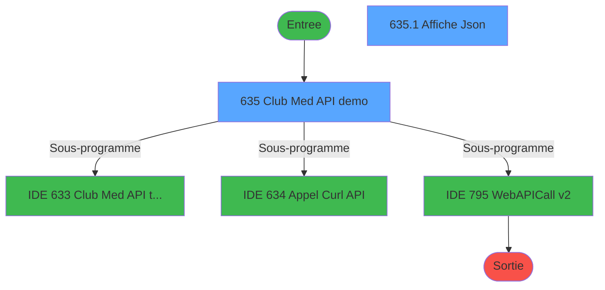
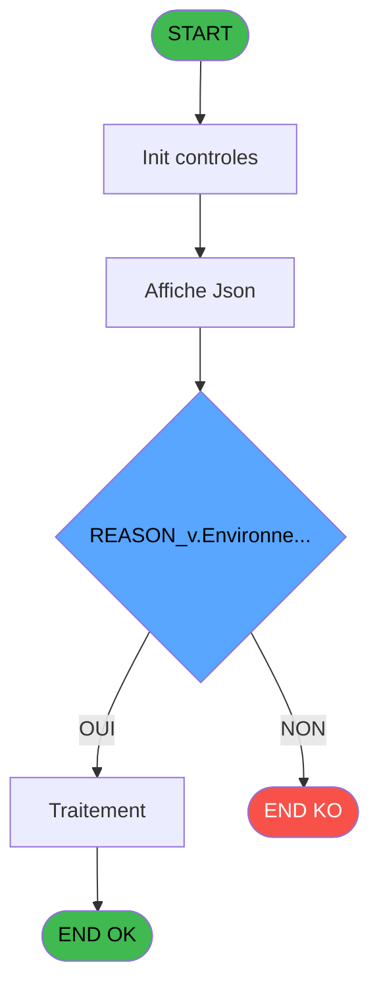
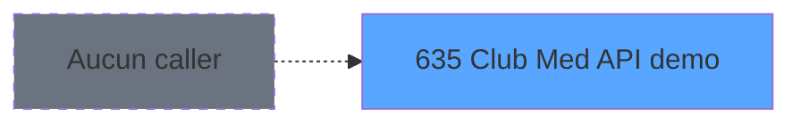
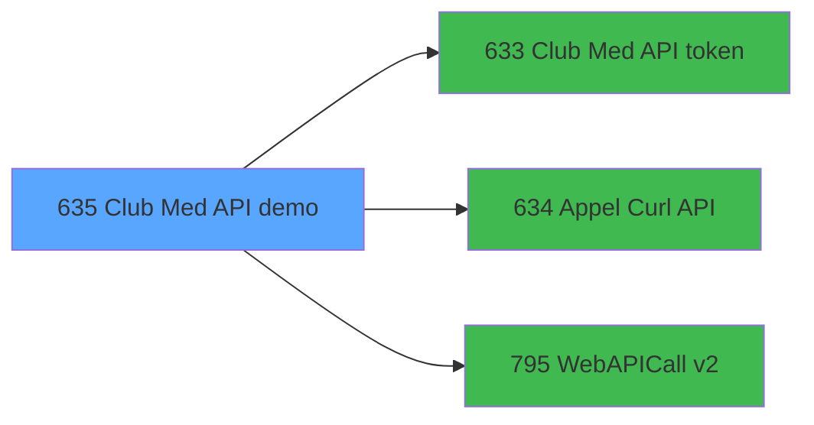

# REF IDE 635 - Club Med API demo

> **Analyse**: Phases 1-4 2026-02-03 13:18 -> 13:18 (25s) | Assemblage 13:18
> **Pipeline**: V7.2 Enrichi
> **Structure**: 4 onglets (Resume | Ecrans | Donnees | Connexions)

<!-- TAB:Resume -->

## 1. FICHE D'IDENTITE

| Attribut | Valeur |
|----------|--------|
| Projet | REF |
| IDE Position | 635 |
| Nom Programme | Club Med API demo |
| Fichier source | `Prg_635.xml` |
| Dossier IDE | General |
| Taches | 2 (2 ecrans visibles) |
| Tables modifiees | 0 |
| Programmes appeles | 3 |
| :warning: Statut | **ORPHELIN_POTENTIEL** |

## 2. DESCRIPTION FONCTIONNELLE

**Club Med API demo** assure la gestion complete de ce processus.

Le flux de traitement s'organise en **2 blocs fonctionnels** :

- **Consultation** (1 tache) : ecrans de recherche, selection et consultation
- **Traitement** (1 tache) : traitements metier divers

**Logique metier** : 1 regles identifiees couvrant valeurs par defaut.

Detail : phases du traitement

#### Phase 1 : Traitement (1 tache)

- **635** - Club Med API demo **[[ECRAN]](#ecran-t1)**

Delegue a : [Club Med API token (IDE 633)](REF-IDE-633.md), [Appel Curl API (IDE 634)](REF-IDE-634.md), [WebAPICall v2 (IDE 795)](REF-IDE-795.md)

#### Phase 2 : Consultation (1 tache)

- **635.1** - Affiche Json **[[ECRAN]](#ecran-t2)**

## 3. BLOCS FONCTIONNELS

### 3.1 Traitement (1 tache)

Traitements internes.

---

#### 635 - Club Med API demo [[ECRAN]](#ecran-t1)

**Role** : Traitement : Club Med API demo.
**Ecran** : 607 x 430 DLU | [Voir mockup](#ecran-t1)
**Delegue a** : [Club Med API token (IDE 633)](REF-IDE-633.md), [Appel Curl API (IDE 634)](REF-IDE-634.md), [WebAPICall v2 (IDE 795)](REF-IDE-795.md)

### 3.2 Consultation (1 tache)

Ecrans de recherche et consultation.

---

#### 635.1 - Affiche Json [[ECRAN]](#ecran-t2)

**Role** : Reinitialisation : Affiche Json.
**Ecran** : 434 x 330 DLU | [Voir mockup](#ecran-t2)
**Variables liees** : S (v.Json in), V (v.JSon out)

## 5. REGLES METIER

1 regles identifiees:

### Autres (1 regles)

#### [RM-001] Valeur par defaut si ISNULL(v.Methode [R]), 'Pas de retour', IF(v.Methode [R] est vide

| Element | Detail |
|---------|--------|
| **Condition** | `ISNULL(v.Methode [R])` |
| **Si vrai** | 'Pas de retour' |
| **Si faux** | IF(v.Methode [R]='', 'Retour vide', v.Methode [R])) |
| **Variables** | R (v.Methode) |
| **Expression source** | Expression 24 : `IF(ISNULL(v.Methode [R]), 'Pas de retour', IF(v.Methode [R]=` |
| **Exemple** | Si ISNULL(v.Methode [R]) → 'Pas de retour'. Sinon → IF(v.Methode [R]='', 'Retour vide', v.Methode [R])) |

## 6. CONTEXTE

- **Appele par**: (aucun)
- **Appelle**: 3 programmes | **Tables**: 0 (W:0 R:0 L:0) | **Taches**: 2 | **Expressions**: 66

<!-- TAB:Ecrans -->

## 8. ECRANS

### 8.1 Forms visibles (2 / 2)

| # | Position | Tache | Nom | Type | Largeur | Hauteur | Bloc |
|---|----------|-------|-----|------|---------|---------|------|
| 1 | 635 | 635 | Club Med API demo | Type0 | 607 | 430 | Traitement |
| 2 | 635.1 | 635.1 | Affiche Json | Type0 | 434 | 330 | Consultation |

### 8.2 Mockups Ecrans

---

#### 635 - Club Med API demo
**Tache** : [635](#t1) | **Type** : Type0 | **Dimensions** : 607 x 430 DLU
**Bloc** : Traitement | **Titre IDE** : Club Med API demo

<!-- FORM-DATA:
{
    "width":  607,
    "vFactor":  8,
    "type":  "Type0",
    "hFactor":  4,
    "controls":  [
                     {
                         "x":  16,
                         "type":  "label",
                         "var":  "",
                         "y":  40,
                         "w":  572,
                         "fmt":  "",
                         "name":  "",
                         "h":  148,
                         "color":  "",
                         "text":  "Paramètres connexion API",
                         "parent":  null
                     },
                     {
                         "x":  50,
                         "type":  "label",
                         "var":  "",
                         "y":  52,
                         "w":  84,
                         "fmt":  "",
                         "name":  "",
                         "h":  9,
                         "color":  "",
                         "text":  "Client_id",
                         "parent":  2
                     },
                     {
                         "x":  50,
                         "type":  "label",
                         "var":  "",
                         "y":  68,
                         "w":  84,
                         "fmt":  "",
                         "name":  "",
                         "h":  9,
                         "color":  "",
                         "text":  "Client_secret",
                         "parent":  2
                     },
                     {
                         "x":  50,
                         "type":  "label",
                         "var":  "",
                         "y":  84,
                         "w":  84,
                         "fmt":  "",
                         "name":  "",
                         "h":  9,
                         "color":  "",
                         "text":  "Grant_type",
                         "parent":  2
                     },
                     {
                         "x":  50,
                         "type":  "label",
                         "var":  "",
                         "y":  100,
                         "w":  84,
                         "fmt":  "",
                         "name":  "",
                         "h":  9,
                         "color":  "",
                         "text":  "Scope",
                         "parent":  2
                     },
                     {
                         "x":  50,
                         "type":  "label",
                         "var":  "",
                         "y":  116,
                         "w":  84,
                         "fmt":  "",
                         "name":  "",
                         "h":  9,
                         "color":  "",
                         "text":  "UrlApi pour token",
                         "parent":  2
                     },
                     {
                         "x":  50,
                         "type":  "label",
                         "var":  "",
                         "y":  132,
                         "w":  84,
                         "fmt":  "",
                         "name":  "",
                         "h":  9,
                         "color":  "",
                         "text":  "Proxy adress",
                         "parent":  2
                     },
                     {
                         "x":  50,
                         "type":  "label",
                         "var":  "",
                         "y":  148,
                         "w":  90,
                         "fmt":  "",
                         "name":  "",
                         "h":  9,
                         "color":  "",
                         "text":  "bypass Proxy Local",
                         "parent":  2
                     },
                     {
                         "x":  16,
                         "type":  "label",
                         "var":  "",
                         "y":  196,
                         "w":  572,
                         "fmt":  "",
                         "name":  "",
                         "h":  32,
                         "color":  "",
                         "text":  "Token API",
                         "parent":  null
                     },
                     {
                         "x":  16,
                         "type":  "label",
                         "var":  "",
                         "y":  244,
                         "w":  572,
                         "fmt":  "",
                         "name":  "",
                         "h":  156,
                         "color":  "",
                         "text":  "Paramètres fonction API",
                         "parent":  null
                     },
                     {
                         "x":  76,
                         "type":  "label",
                         "var":  "",
                         "y":  260,
                         "w":  72,
                         "fmt":  "",
                         "name":  "",
                         "h":  8,
                         "color":  "",
                         "text":  "Mode",
                         "parent":  19
                     },
                     {
                         "x":  76,
                         "type":  "label",
                         "var":  "",
                         "y":  276,
                         "w":  72,
                         "fmt":  "",
                         "name":  "",
                         "h":  8,
                         "color":  "",
                         "text":  "Dossier",
                         "parent":  19
                     },
                     {
                         "x":  76,
                         "type":  "label",
                         "var":  "",
                         "y":  332,
                         "w":  72,
                         "fmt":  "",
                         "name":  "",
                         "h":  8,
                         "color":  "",
                         "text":  "JSon in",
                         "parent":  19
                     },
                     {
                         "x":  76,
                         "type":  "label",
                         "var":  "",
                         "y":  380,
                         "w":  72,
                         "fmt":  "",
                         "name":  "",
                         "h":  8,
                         "color":  "",
                         "text":  "URL",
                         "parent":  19
                     },
                     {
                         "x":  50,
                         "type":  "label",
                         "var":  "",
                         "y":  164,
                         "w":  90,
                         "fmt":  "",
                         "name":  "",
                         "h":  9,
                         "color":  "",
                         "text":  "API Key",
                         "parent":  2
                     },
                     {
                         "x":  76,
                         "type":  "label",
                         "var":  "",
                         "y":  292,
                         "w":  72,
                         "fmt":  "",
                         "name":  "",
                         "h":  8,
                         "color":  "",
                         "text":  "Client",
                         "parent":  19
                     },
                     {
                         "x":  18,
                         "type":  "listbox",
                         "var":  "",
                         "y":  0,
                         "w":  138,
                         "fmt":  "",
                         "name":  "v.Test",
                         "h":  40,
                         "color":  "",
                         "text":  "P,R,Y,B,1,2,3,4",
                         "parent":  null
                     },
                     {
                         "x":  520,
                         "type":  "listbox",
                         "var":  "",
                         "y":  8,
                         "w":  68,
                         "fmt":  "",
                         "name":  "v.Environnement_0001",
                         "h":  32,
                         "color":  "",
                         "text":  "S,I,P",
                         "parent":  null
                     },
                     {
                         "x":  148,
                         "type":  "edit",
                         "var":  "",
                         "y":  52,
                         "w":  416,
                         "fmt":  "",
                         "name":  "v.Client_id",
                         "h":  10,
                         "color":  "",
                         "text":  "",
                         "parent":  2
                     },
                     {
                         "x":  148,
                         "type":  "edit",
                         "var":  "",
                         "y":  68,
                         "w":  416,
                         "fmt":  "",
                         "name":  "v.Client_secret",
                         "h":  10,
                         "color":  "",
                         "text":  "",
                         "parent":  2
                     },
                     {
                         "x":  148,
                         "type":  "edit",
                         "var":  "",
                         "y":  84,
                         "w":  416,
                         "fmt":  "",
                         "name":  "v.Grant_type",
                         "h":  10,
                         "color":  "",
                         "text":  "",
                         "parent":  2
                     },
                     {
                         "x":  148,
                         "type":  "edit",
                         "var":  "",
                         "y":  100,
                         "w":  416,
                         "fmt":  "",
                         "name":  "v.Scope",
                         "h":  10,
                         "color":  "",
                         "text":  "",
                         "parent":  2
                     },
                     {
                         "x":  148,
                         "type":  "edit",
                         "var":  "",
                         "y":  116,
                         "w":  416,
                         "fmt":  "",
                         "name":  "v.UrlApi",
                         "h":  10,
                         "color":  "",
                         "text":  "",
                         "parent":  2
                     },
                     {
                         "x":  148,
                         "type":  "edit",
                         "var":  "",
                         "y":  132,
                         "w":  416,
                         "fmt":  "",
                         "name":  "v.Proxy adress",
                         "h":  10,
                         "color":  "",
                         "text":  "",
                         "parent":  2
                     },
                     {
                         "x":  148,
                         "type":  "combobox",
                         "var":  "",
                         "y":  148,
                         "w":  52,
                         "fmt":  "",
                         "name":  "v.bypassProxyLocal",
                         "h":  12,
                         "color":  "",
                         "text":  "",
                         "parent":  2
                     },
                     {
                         "x":  148,
                         "type":  "edit",
                         "var":  "",
                         "y":  164,
                         "w":  416,
                         "fmt":  "",
                         "name":  "v.API Key",
                         "h":  10,
                         "color":  "",
                         "text":  "",
                         "parent":  2
                     },
                     {
                         "x":  28,
                         "type":  "edit",
                         "var":  "",
                         "y":  212,
                         "w":  552,
                         "fmt":  "",
                         "name":  "v.Access Token",
                         "h":  10,
                         "color":  "",
                         "text":  "",
                         "parent":  17
                     },
                     {
                         "x":  156,
                         "type":  "edit",
                         "var":  "",
                         "y":  260,
                         "w":  416,
                         "fmt":  "",
                         "name":  "v.Mode_0001",
                         "h":  12,
                         "color":  "",
                         "text":  "",
                         "parent":  19
                     },
                     {
                         "x":  156,
                         "type":  "edit",
                         "var":  "",
                         "y":  276,
                         "w":  172,
                         "fmt":  "",
                         "name":  "v.Dossier_0001",
                         "h":  12,
                         "color":  "",
                         "text":  "",
                         "parent":  19
                     },
                     {
                         "x":  156,
                         "type":  "edit",
                         "var":  "",
                         "y":  292,
                         "w":  172,
                         "fmt":  "",
                         "name":  "v.Client Id_0001",
                         "h":  12,
                         "color":  "",
                         "text":  "",
                         "parent":  19
                     },
                     {
                         "x":  156,
                         "type":  "edit",
                         "var":  "",
                         "y":  332,
                         "w":  416,
                         "fmt":  "",
                         "name":  "v.Json in_0001",
                         "h":  44,
                         "color":  "",
                         "text":  "",
                         "parent":  19
                     },
                     {
                         "x":  156,
                         "type":  "edit",
                         "var":  "",
                         "y":  380,
                         "w":  416,
                         "fmt":  "",
                         "name":  "v.URL api profile/room re_0001",
                         "h":  16,
                         "color":  "",
                         "text":  "",
                         "parent":  19
                     },
                     {
                         "x":  524,
                         "type":  "button",
                         "var":  "",
                         "y":  404,
                         "w":  64,
                         "fmt":  "Test",
                         "name":  "b.Test",
                         "h":  24,
                         "color":  "",
                         "text":  "",
                         "parent":  null
                     }
                 ],
    "taskId":  "635",
    "height":  430
}
-->

<strong>Champs : 14 champs</strong>

| Pos (x,y) | Nom | Variable | Type |
|-----------|-----|----------|------|
| 148,52 | v.Client_id | - | edit |
| 148,68 | v.Client_secret | - | edit |
| 148,84 | v.Grant_type | - | edit |
| 148,100 | v.Scope | - | edit |
| 148,116 | v.UrlApi | - | edit |
| 148,132 | v.Proxy adress | - | edit |
| 148,148 | v.bypassProxyLocal | - | combobox |
| 148,164 | v.API Key | - | edit |
| 28,212 | v.Access Token | - | edit |
| 156,260 | v.Mode_0001 | - | edit |
| 156,276 | v.Dossier_0001 | - | edit |
| 156,292 | v.Client Id_0001 | - | edit |
| 156,332 | v.Json in_0001 | - | edit |
| 156,380 | v.URL api profile/room re_0001 | - | edit |

<strong>Boutons : 1 boutons</strong>

| Bouton | Pos (x,y) | Action |
|--------|-----------|--------|
| Test | 524,404 | Bouton fonctionnel |

---

#### 635.1 - Affiche Json
**Tache** : [635.1](#t2) | **Type** : Type0 | **Dimensions** : 434 x 330 DLU
**Bloc** : Consultation | **Titre IDE** : Affiche Json

<!-- FORM-DATA:
{
    "width":  434,
    "vFactor":  8,
    "type":  "Type0",
    "hFactor":  4,
    "controls":  [
                     {
                         "x":  4,
                         "type":  "edit",
                         "var":  "",
                         "y":  0,
                         "w":  9,
                         "fmt":  "",
                         "name":  "v.Texte",
                         "h":  10,
                         "color":  "",
                         "text":  "",
                         "parent":  null
                     },
                     {
                         "x":  4,
                         "type":  "edit",
                         "var":  "",
                         "y":  16,
                         "w":  420,
                         "fmt":  "",
                         "name":  "",
                         "h":  288,
                         "color":  "",
                         "text":  "",
                         "parent":  null
                     }
                 ],
    "taskId":  "635.1",
    "height":  330
}
-->

<strong>Champs : 2 champs</strong>

| Pos (x,y) | Nom | Variable | Type |
|-----------|-----|----------|------|
| 4,0 | v.Texte | - | edit |
| 4,16 | (sans nom) | - | edit |

## 9. NAVIGATION

### 9.1 Enchainement des ecrans

**Detail par enchainement :**

| Depuis | Action | Vers | Retour |
|--------|--------|------|--------|
| Club Med API demo | Sous-programme | [Club Med API token (IDE 633)](REF-IDE-633.md) | Retour ecran |
| Club Med API demo | Sous-programme | [Appel Curl API (IDE 634)](REF-IDE-634.md) | Retour ecran |
| Club Med API demo | Sous-programme | [WebAPICall v2 (IDE 795)](REF-IDE-795.md) | Retour ecran |

### 9.3 Structure hierarchique (2 taches)

| Position | Tache | Type | Dimensions | Bloc |
|----------|-------|------|------------|------|
| **635.1** | [**Club Med API demo** (635)](#t1) [mockup](#ecran-t1) | - | 607x430 | Traitement |
| **635.2** | [**Affiche Json** (635.1)](#t2) [mockup](#ecran-t2) | - | 434x330 | Consultation |

### 9.4 Algorigramme

> **Legende**: Vert = START/END OK | Rouge = END KO | Bleu = Decisions
> *Algorigramme auto-genere. Utiliser `/algorigramme` pour une synthese metier detaillee.*

<!-- TAB:Donnees -->

## 10. TABLES

### Tables utilisees (0)

| ID | Nom | Description | Type | R | W | L | Usages |
|----|-----|-------------|------|---|---|---|--------|

### Colonnes par table (0 / 0 tables avec colonnes identifiees)

## 11. VARIABLES

### 11.1 Variables de session (21)

Variables persistantes pendant toute la session.

| Lettre | Nom | Type | Usage dans |
|--------|-----|------|-----------|
| A | v.Test Profile/Room ready | Alpha | 11x session |
| B | v.Environnement | Alpha | 2x session |
| C | v.Dossier | Numeric | 1x session |
| D | v.Customer Id (neolid) | Numeric | 1x session |
| E | v.Client_id | Unicode | 1x session |
| F | v.Client_secret | Unicode | 1x session |
| G | v.Grant_type | Unicode | 1x session |
| H | v.Scope | Unicode | 2x session |
| I | v.UrlApi auth | Unicode | 1x session |
| J | v.Proxy adress | Unicode | 1x session |
| K | v.URL API | Unicode | 1x session |
| L | v.URL api fonction | Unicode | 1x session |
| M | v.URL Complète | Unicode | 1x session |
| N | v.API Key | Unicode | 2x session |
| O | v.bypassProxyLocal | Logical | - |
| Q | v.Token | Unicode | - |
| R | v.Methode | Unicode | 2x session |
| S | v.Json in | Unicode | - |
| T | v.Is Success | Logical | - |
| U | v.Message | Unicode | - |
| V | v.JSon out | Blob | 3x session |

### 11.2 Autres (5)

Variables diverses.

| Lettre | Nom | Type | Usage dans |
|--------|-----|------|-----------|
| P | b.Test | Alpha | 1x refs |
| W | CHG_REASON_v.Test | Numeric | - |
| X | CHG_PRV_v.Test | Alpha | - |
| Y | CHG_REASON_v.Environnement | Numeric | - |
| Z | CHG_PRV_v.Environnement | Alpha | 1x refs |

Toutes les 26 variables (liste complete)

| Cat | Lettre | Nom Variable | Type |
|-----|--------|--------------|------|
| V. | **A** | v.Test Profile/Room ready | Alpha |
| V. | **B** | v.Environnement | Alpha |
| V. | **C** | v.Dossier | Numeric |
| V. | **D** | v.Customer Id (neolid) | Numeric |
| V. | **E** | v.Client_id | Unicode |
| V. | **F** | v.Client_secret | Unicode |
| V. | **G** | v.Grant_type | Unicode |
| V. | **H** | v.Scope | Unicode |
| V. | **I** | v.UrlApi auth | Unicode |
| V. | **J** | v.Proxy adress | Unicode |
| V. | **K** | v.URL API | Unicode |
| V. | **L** | v.URL api fonction | Unicode |
| V. | **M** | v.URL Complète | Unicode |
| V. | **N** | v.API Key | Unicode |
| V. | **O** | v.bypassProxyLocal | Logical |
| V. | **Q** | v.Token | Unicode |
| V. | **R** | v.Methode | Unicode |
| V. | **S** | v.Json in | Unicode |
| V. | **T** | v.Is Success | Logical |
| V. | **U** | v.Message | Unicode |
| V. | **V** | v.JSon out | Blob |
| Autre | **P** | b.Test | Alpha |
| Autre | **W** | CHG_REASON_v.Test | Numeric |
| Autre | **X** | CHG_PRV_v.Test | Alpha |
| Autre | **Y** | CHG_REASON_v.Environnement | Numeric |
| Autre | **Z** | CHG_PRV_v.Environnement | Alpha |

## 12. EXPRESSIONS

**66 / 66 expressions decodees (100%)**

### 12.1 Repartition par type

| Type | Expressions | Regles |
|------|-------------|--------|
| CONDITION | 12 | 5 |
| FORMAT | 2 | 0 |
| CAST_LOGIQUE | 3 | 0 |
| CONSTANTE | 31 | 0 |
| OTHER | 17 | 0 |
| CONCATENATION | 1 | 0 |

### 12.2 Expressions cles par type

#### CONDITION (12 expressions)

| Type | IDE | Expression | Regle |
|------|-----|------------|-------|
| CONDITION | 24 | `IF(ISNULL(v.Methode [R]), 'Pas de retour', IF(v.Methode [R]='', 'Retour vide', v.Methode [R]))` | [RM-001](#rm-RM-001) |
| CONDITION | 39 | `v.Test Profile/Room ready [A]='4'` | - |
| CONDITION | 38 | `v.Test Profile/Room ready [A]='3'` | - |
| CONDITION | 41 | `v.JSon out [V]='S'` | - |
| CONDITION | 50 | `v.JSon out [V]='P'` | - |
| ... | | *+7 autres* | |

#### FORMAT (2 expressions)

| Type | IDE | Expression | Regle |
|------|-----|------------|-------|
| FORMAT | 19 | `StrBuild(v.Scope [H], Str(v.API Key [N], '20'))` | - |
| FORMAT | 61 | `CASE(v.Test Profile/Room ready [A],'Y',StrBuild([AC],Trim(Str(CHG_PRV_v.Environnement [Z],'15')),Trim(Str(v.API Key [N],'15'))),'P',StrBuild([AC],Trim(Str(CHG_PRV_v.Environnement [Z],'15'))),'R',StrBuild([AC],Trim(Str(v.API Key [N],'15'))),'B',StrBuild([AC],Trim(Str(v.API Key [N],'15'))),'1',StrBuild([AC],Trim(Str(CHG_PRV_v.Environnement [Z],'15')),Trim(Str(v.API Key [N],'15'))),'2',StrBuild([AC],Trim(Str(CHG_PRV_v.Environnement [Z],'15')),Trim(Str(v.API Key [N],'15'))),'3',StrBuild([AC],Trim(Str(CHG_PRV_v.Environnement [Z],'15')),Trim(Str(v.API Key [N],'15'))),'4',StrBuild([AC],Trim(Str(CHG_PRV_v.Environnement [Z],'15')),Trim(Str(v.API Key [N],'15'))),[AC])` | - |

#### CAST_LOGIQUE (3 expressions)

| Type | IDE | Expression | Regle |
|------|-----|------------|-------|
| CAST_LOGIQUE | 40 | `'FALSE'LOG` | - |
| CAST_LOGIQUE | 32 | `'TRUE'LOG` | - |
| CAST_LOGIQUE | 63 | `CASE(v.Test Profile/Room ready [A],'Y','TRUE'LOG,'P','FALSE'LOG,'R','FALSE'LOG,'FALSE'LOG)` | - |

#### CONSTANTE (31 expressions)

| Type | IDE | Expression | Regle |
|------|-----|------------|-------|
| CONSTANTE | 47 | `'https://auth.integ.clubmed.com/token'` | - |
| CONSTANTE | 48 | `'https://api.integ.clubmed.com/'` | - |
| CONSTANTE | 49 | `'201908061614.pms.clubmed.com'` | - |
| CONSTANTE | 46 | `'edbd09f77f1c53e4a9ff'` | - |
| CONSTANTE | 43 | `'2f37a82a-1586-4488-82b9-bce2e88acf48'` | - |
| ... | | *+26 autres* | |

#### OTHER (17 expressions)

| Type | IDE | Expression | Regle |
|------|-----|------------|-------|
| OTHER | 29 | `v.URL Complète [M]` | - |
| OTHER | 53 | `SetCrsr (2)` | - |
| OTHER | 21 | `v.UrlApi auth [I]` | - |
| OTHER | 26 | `b.Test [P]` | - |
| OTHER | 64 | `v.Test Profile/Room ready [A]` | - |
| ... | | *+12 autres* | |

#### CONCATENATION (1 expressions)

| Type | IDE | Expression | Regle |
|------|-----|------------|-------|
| CONCATENATION | 65 | `Trim(CHG_REASON_v.Environne... [Y])&Trim(v.Scope [H])` | - |

### 12.3 Toutes les expressions (66)

Voir les 66 expressions

#### CONDITION (12)

| IDE | Expression Decodee |
|-----|-------------------|
| 24 | `IF(ISNULL(v.Methode [R]), 'Pas de retour', IF(v.Methode [R]='', 'Retour vide', v.Methode [R]))` |
| 30 | `v.Test Profile/Room ready [A]='R'` |
| 33 | `v.Test Profile/Room ready [A]='P'` |
| 34 | `v.Test Profile/Room ready [A]='Y'` |
| 35 | `v.Test Profile/Room ready [A]='B'` |
| 36 | `v.Test Profile/Room ready [A]='1'` |
| 37 | `v.Test Profile/Room ready [A]='2'` |
| 38 | `v.Test Profile/Room ready [A]='3'` |
| 39 | `v.Test Profile/Room ready [A]='4'` |
| 41 | `v.JSon out [V]='S'` |
| 42 | `v.JSon out [V]='I'` |
| 50 | `v.JSon out [V]='P'` |

#### FORMAT (2)

| IDE | Expression Decodee |
|-----|-------------------|
| 61 | `CASE(v.Test Profile/Room ready [A],'Y',StrBuild([AC],Trim(Str(CHG_PRV_v.Environnement [Z],'15')),Trim(Str(v.API Key [N],'15'))),'P',StrBuild([AC],Trim(Str(CHG_PRV_v.Environnement [Z],'15'))),'R',StrBuild([AC],Trim(Str(v.API Key [N],'15'))),'B',StrBuild([AC],Trim(Str(v.API Key [N],'15'))),'1',StrBuild([AC],Trim(Str(CHG_PRV_v.Environnement [Z],'15')),Trim(Str(v.API Key [N],'15'))),'2',StrBuild([AC],Trim(Str(CHG_PRV_v.Environnement [Z],'15')),Trim(Str(v.API Key [N],'15'))),'3',StrBuild([AC],Trim(Str(CHG_PRV_v.Environnement [Z],'15')),Trim(Str(v.API Key [N],'15'))),'4',StrBuild([AC],Trim(Str(CHG_PRV_v.Environnement [Z],'15')),Trim(Str(v.API Key [N],'15'))),[AC])` |
| 19 | `StrBuild(v.Scope [H], Str(v.API Key [N], '20'))` |

#### CAST_LOGIQUE (3)

| IDE | Expression Decodee |
|-----|-------------------|
| 63 | `CASE(v.Test Profile/Room ready [A],'Y','TRUE'LOG,'P','FALSE'LOG,'R','FALSE'LOG,'FALSE'LOG)` |
| 32 | `'TRUE'LOG` |
| 40 | `'FALSE'LOG` |

#### CONSTANTE (31)

| IDE | Expression Decodee |
|-----|-------------------|
| 1 | `'R'` |
| 2 | `'S'` |
| 3 | `'https://auth.staging.clubmed.com/token'` |
| 4 | `'https://api.staging.clubmed.com/'` |
| 5 | `'10abcaf0-4a4d-4ca3-81ce-2df810cf8b5c'` |
| 6 | `'bdca347f4eed5d74de10'` |
| 7 | `'client_credentials'` |
| 8 | `'openid pms'` |
| 17 | `'v0/customers/@1@/profile'` |
| 18 | `'v0/bookings/@1@/room_status'` |
| 22 | `152378796` |
| 23 | `12345678` |
| 25 | `'{
   "room_id": "432",
   "status": "pasREADY"
}'` |
| 27 | `'POST'` |
| 28 | `'GET'` |
| 31 | `''` |
| 43 | `'2f37a82a-1586-4488-82b9-bce2e88acf48'` |
| 44 | `'fcdd52c935ab795da02b'` |
| 45 | `'120cca0e-6ea8-405e-ba7e-4d531e44d163'` |
| 46 | `'edbd09f77f1c53e4a9ff'` |
| 47 | `'https://auth.integ.clubmed.com/token'` |
| 48 | `'https://api.integ.clubmed.com/'` |
| 49 | `'201908061614.pms.clubmed.com'` |
| 51 | `'https://auth.clubmed.com/token'` |
| 52 | `'https://api.clubmed.com/'` |
| 55 | `'v1/customers/@1@/bookings/@2@/stay_formalities'` |
| 56 | `'v3/customers/@1@/bookings/@2@'` |
| 57 | `'v2/customers/@1@/bookings/@2@/transport_details'` |
| 58 | `'v1/customers/@1@/bookings/@2@/services'` |
| 59 | `'v0/customers/@1@/bookings/@2@/easy_arrival/surveys'` |
| 60 | `'v1/bookings/@1@'` |

#### OTHER (17)

| IDE | Expression Decodee |
|-----|-------------------|
| 9 | `v.Environnement [B]` |
| 10 | `v.Dossier [C]` |
| 11 | `v.Customer Id (neolid) [D]` |
| 12 | `v.Client_id [E]` |
| 13 | `v.Client_secret [F]` |
| 14 | `v.Grant_type [G]` |
| 15 | `v.Proxy adress [J]` |
| 16 | `INIGet('HTTPProxyAddress')` |
| 20 | `v.URL api fonction [L]` |
| 21 | `v.UrlApi auth [I]` |
| 26 | `b.Test [P]` |
| 29 | `v.URL Complète [M]` |
| 53 | `SetCrsr (2)` |
| 54 | `SetCrsr (1)` |
| 62 | `Translate('%TempDir%')` |
| 64 | `v.Test Profile/Room ready [A]` |
| 66 | `Blb2File(v.Methode [R],'c:\temp\jsonout.txt')` |

#### CONCATENATION (1)

| IDE | Expression Decodee |
|-----|-------------------|
| 65 | `Trim(CHG_REASON_v.Environne... [Y])&Trim(v.Scope [H])` |

<!-- TAB:Connexions -->

## 13. GRAPHE D'APPELS

### 13.1 Chaine depuis Main (Callers)

**Chemin**: (pas de callers directs)

### 13.2 Callers

| IDE | Nom Programme | Nb Appels |
|-----|---------------|-----------|
| - | (aucun) | - |

### 13.3 Callees (programmes appeles)

### 13.4 Detail Callees avec contexte

| IDE | Nom Programme | Appels | Contexte |
|-----|---------------|--------|----------|
| [633](REF-IDE-633.md) | Club Med API token | 1 | Sous-programme |
| [634](REF-IDE-634.md) | Appel Curl API | 1 | Sous-programme |
| [795](REF-IDE-795.md) | WebAPICall v2 | 1 | Sous-programme |

## 14. RECOMMANDATIONS MIGRATION

### 14.1 Profil du programme

| Metrique | Valeur | Impact migration |
|----------|--------|-----------------|
| Lignes de logique | 128 | Programme compact |
| Expressions | 66 | Logique moderee |
| Tables WRITE | 0 | Impact faible |
| Sous-programmes | 3 | Peu de dependances |
| Ecrans visibles | 2 | Quelques ecrans |
| Code desactive | 1.6% (2 / 128) | Code sain |
| Regles metier | 1 | Quelques regles a preserver |

### 14.2 Plan de migration par bloc

#### Traitement (1 tache: 1 ecran, 0 traitement)

- **Strategie** : 1 composant(s) UI (Razor/React) avec formulaires et validation.
- 3 sous-programme(s) a migrer ou a reutiliser depuis les services existants.
- Decomposer les taches en services unitaires testables.

#### Consultation (1 tache: 1 ecran, 0 traitement)

- **Strategie** : Composants de recherche/selection en modales.
- 1 ecran : Affiche Json

### 14.3 Dependances critiques

| Dependance | Type | Appels | Impact |
|------------|------|--------|--------|
| [WebAPICall v2 (IDE 795)](REF-IDE-795.md) | Sous-programme | 1x | Normale - Sous-programme |
| [Appel Curl API (IDE 634)](REF-IDE-634.md) | Sous-programme | 1x | Normale - Sous-programme |
| [Club Med API token (IDE 633)](REF-IDE-633.md) | Sous-programme | 1x | Normale - Sous-programme |

---
*Spec DETAILED generee par Pipeline V7.2 - 2026-02-03 13:18*
