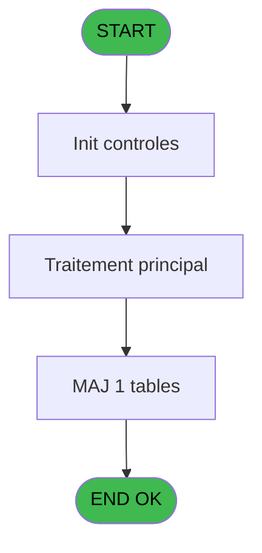
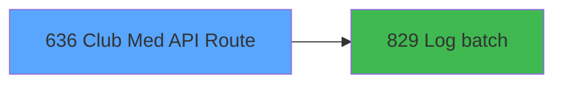

# REF IDE 636 - Club Med API Route

> **Analyse**: Phases 1-4 2026-02-03 13:18 -> 13:19 (24s) | Assemblage 13:19
> **Pipeline**: V7.2 Enrichi
> **Structure**: 4 onglets (Resume | Ecrans | Donnees | Connexions)

<!-- TAB:Resume -->

## 1. FICHE D'IDENTITE

| Attribut | Valeur |
|----------|--------|
| Projet | REF |
| IDE Position | 636 |
| Nom Programme | Club Med API Route |
| Fichier source | `Prg_636.xml` |
| Dossier IDE | General |
| Taches | 3 (0 ecrans visibles) |
| Tables modifiees | 1 |
| Programmes appeles | 1 |
| :warning: Statut | **ORPHELIN_POTENTIEL** |

## 2. DESCRIPTION FONCTIONNELLE

**Club Med API Route** assure la gestion complete de ce processus.

Le flux de traitement s'organise en **1 blocs fonctionnels** :

- **Traitement** (3 taches) : traitements metier divers

**Donnees modifiees** : 1 tables en ecriture (initialisation___ini).

**Logique metier** : 1 regles identifiees couvrant conditions metier.

## 3. BLOCS FONCTIONNELS

### 3.1 Traitement (3 taches)

Traitements internes.

---

#### 636 - Club Med API Route

**Role** : Traitement : Club Med API Route.
**Delegue a** : [Log batch (IDE 829)](REF-IDE-829.md)

---

#### 636.1 - XML refresh/access token

**Role** : Traitement : XML refresh/access token.
**Variables liees** : A (p.o.Access Token), T (v.Access Token), U (v.Token type)
**Delegue a** : [Log batch (IDE 829)](REF-IDE-829.md)

---

#### 636.2 - Lecture paramètres API

**Role** : Traitement : Lecture paramètres API.
**Delegue a** : [Log batch (IDE 829)](REF-IDE-829.md)

## 5. REGLES METIER

1 regles identifiees:

### Autres (1 regles)

#### [RM-001] Si v.IsSuccess [R] alors 'OK' sinon 'ERR')

| Element | Detail |
|---------|--------|
| **Condition** | `v.IsSuccess [R]` |
| **Si vrai** | 'OK' |
| **Si faux** | 'ERR') |
| **Variables** | R (v.IsSuccess) |
| **Expression source** | Expression 11 : `IF(v.IsSuccess [R], 'OK', 'ERR')` |
| **Exemple** | Si v.IsSuccess [R] → 'OK'. Sinon → 'ERR') |

## 6. CONTEXTE

- **Appele par**: (aucun)
- **Appelle**: 1 programmes | **Tables**: 2 (W:1 R:0 L:1) | **Taches**: 3 | **Expressions**: 21

<!-- TAB:Ecrans -->

## 8. ECRANS

*(Programme sans ecran visible)*

## 9. NAVIGATION

### 9.3 Structure hierarchique (3 taches)

| Position | Tache | Type | Dimensions | Bloc |
|----------|-------|------|------------|------|
| **636.1** | [**Club Med API Route** (636)](#t1) | - | - | Traitement |
| 636.1.1 | [XML refresh/access token (636.1)](#t2) | - | - | |
| 636.1.2 | [Lecture paramètres API (636.2)](#t3) | - | - | |

### 9.4 Algorigramme

> **Legende**: Vert = START/END OK | Rouge = END KO | Bleu = Decisions
> *Algorigramme auto-genere. Utiliser `/algorigramme` pour une synthese metier detaillee.*

<!-- TAB:Donnees -->

## 10. TABLES

### Tables utilisees (2)

| ID | Nom | Description | Type | R | W | L | Usages |
|----|-----|-------------|------|---|---|---|--------|
| 69 | initialisation___ini |  | DB |   | **W** |   | 1 |
| 368 | pms_village |  | DB |   |   | L | 1 |

### Colonnes par table (0 / 1 tables avec colonnes identifiees)

Table 69 - initialisation___ini (**W**) - 1 usages

*Table utilisee uniquement en Link ou aucune colonne Real identifiee dans le DataView.*

## 11. VARIABLES

### 11.1 Parametres entrants (1)

Variables recues en parametre.

| Lettre | Nom | Type | Usage dans |
|--------|-----|------|-----------|
| A | p.o.Access Token | Unicode | - |

### 11.2 Variables de session (15)

Variables persistantes pendant toute la session.

| Lettre | Nom | Type | Usage dans |
|--------|-----|------|-----------|
| I | v.Client_id | Unicode | 1x session |
| J | v.Client_secret | Unicode | 1x session |
| K | v.Grant_type | Unicode | - |
| L | v.Scope | Unicode | - |
| M | v.UrlApi | Unicode | 1x session |
| N | v.Proxy adress http | Unicode | - |
| O | v.BypassProxyOnLocalAdr | Logical | - |
| P | v.JSonResponse | Blob | 2x session |
| Q | v.XML response | Blob | - |
| R | v.IsSuccess | Logical | 1x session |
| S | v.ErrorMessage | Alpha | 2x session |
| T | v.Access Token | Unicode | [636.1](#t2) |
| U | v.Token type | Unicode | 1x session |
| V | v.Expiration | Unicode | - |
| W | v.Id batch | Numeric | 1x session |

### 11.3 Autres (7)

Variables diverses.

| Lettre | Nom | Type | Usage dans |
|--------|-----|------|-----------|
| B | i.Client_id | Unicode | 2x refs |
| C | i.Client_secret | Unicode | 1x refs |
| D | i.Grant_type | Unicode | 1x refs |
| E | i.Scope | Unicode | 1x refs |
| F | i.UrlApi | Unicode | 1x refs |
| G | i.Proxy adress http | Unicode | 1x refs |
| H | i.BypassProxyOnLocalAdr | Logical | 1x refs |

Toutes les 23 variables (liste complete)

| Cat | Lettre | Nom Variable | Type |
|-----|--------|--------------|------|
| P0 | **A** | p.o.Access Token | Unicode |
| V. | **I** | v.Client_id | Unicode |
| V. | **J** | v.Client_secret | Unicode |
| V. | **K** | v.Grant_type | Unicode |
| V. | **L** | v.Scope | Unicode |
| V. | **M** | v.UrlApi | Unicode |
| V. | **N** | v.Proxy adress http | Unicode |
| V. | **O** | v.BypassProxyOnLocalAdr | Logical |
| V. | **P** | v.JSonResponse | Blob |
| V. | **Q** | v.XML response | Blob |
| V. | **R** | v.IsSuccess | Logical |
| V. | **S** | v.ErrorMessage | Alpha |
| V. | **T** | v.Access Token | Unicode |
| V. | **U** | v.Token type | Unicode |
| V. | **V** | v.Expiration | Unicode |
| V. | **W** | v.Id batch | Numeric |
| Autre | **B** | i.Client_id | Unicode |
| Autre | **C** | i.Client_secret | Unicode |
| Autre | **D** | i.Grant_type | Unicode |
| Autre | **E** | i.Scope | Unicode |
| Autre | **F** | i.UrlApi | Unicode |
| Autre | **G** | i.Proxy adress http | Unicode |
| Autre | **H** | i.BypassProxyOnLocalAdr | Logical |

## 12. EXPRESSIONS

**21 / 21 expressions decodees (100%)**

### 12.1 Repartition par type

| Type | Expressions | Regles |
|------|-------------|--------|
| CONCATENATION | 1 | 0 |
| CONDITION | 3 | 5 |
| CONSTANTE | 4 | 0 |
| OTHER | 13 | 0 |

### 12.2 Expressions cles par type

#### CONCATENATION (1 expressions)

| Type | IDE | Expression | Regle |
|------|-----|------------|-------|
| CONCATENATION | 1 | `'<?xml version="1.0" encoding="UTF-8"?>' &
ASCIIChr(13)& ASCIIChr(10)&
DotNet.System.Xml.Linq.XElement.Load(
  DotNet.System.Runtime.Serialization.Json.JsonReaderWriterFactory.CreateJsonReader( 
     v.JSonResponse [P],
     DotNet.System.Xml.XmlDictionaryReaderQuotas()
   )
).ToString()` | - |

#### CONDITION (3 expressions)

| Type | IDE | Expression | Regle |
|------|-----|------------|-------|
| CONDITION | 11 | `IF(v.IsSuccess [R], 'OK', 'ERR')` | [RM-001](#rm-RM-001) |
| CONDITION | 14 | `Trim(i.Client_id [B])=''` | - |
| CONDITION | 2 | `v.Token type [U]='Bearer' AND v.Access Token [T]<>''` | - |

#### CONSTANTE (4 expressions)

| Type | IDE | Expression | Regle |
|------|-----|------------|-------|
| CONSTANTE | 7 | `'DEB'` | - |
| CONSTANTE | 10 | `'json'` | - |
| CONSTANTE | 4 | `'ClubMedAPI'` | - |
| CONSTANTE | 5 | `'Token'` | - |

#### OTHER (13 expressions)

| Type | IDE | Expression | Regle |
|------|-----|------------|-------|
| OTHER | 18 | `i.Scope [E]` | - |
| OTHER | 17 | `i.Grant_type [D]` | - |
| OTHER | 16 | `i.Client_secret [C]` | - |
| OTHER | 21 | `i.BypassProxyOnLocalAdr [H]` | - |
| OTHER | 20 | `i.Proxy adress http [G]` | - |
| ... | | *+8 autres* | |

### 12.3 Toutes les expressions (21)

Voir les 21 expressions

#### CONCATENATION (1)

| IDE | Expression Decodee |
|-----|-------------------|
| 1 | `'<?xml version="1.0" encoding="UTF-8"?>' &
ASCIIChr(13)& ASCIIChr(10)&
DotNet.System.Xml.Linq.XElement.Load(
  DotNet.System.Runtime.Serialization.Json.JsonReaderWriterFactory.CreateJsonReader( 
     v.JSonResponse [P],
     DotNet.System.Xml.XmlDictionaryReaderQuotas()
   )
).ToString()` |

#### CONDITION (3)

| IDE | Expression Decodee |
|-----|-------------------|
| 11 | `IF(v.IsSuccess [R], 'OK', 'ERR')` |
| 2 | `v.Token type [U]='Bearer' AND v.Access Token [T]<>''` |
| 14 | `Trim(i.Client_id [B])=''` |

#### CONSTANTE (4)

| IDE | Expression Decodee |
|-----|-------------------|
| 4 | `'ClubMedAPI'` |
| 5 | `'Token'` |
| 7 | `'DEB'` |
| 10 | `'json'` |

#### OTHER (13)

| IDE | Expression Decodee |
|-----|-------------------|
| 3 | `StrBuild('Json error @1@ ; Client Id @2@, Client Secret @3@', v.ErrorMessage [S], v.Client_id [I], v.Client_secret [J])` |
| 6 | `v.UrlApi [M]` |
| 8 | `v.Id batch [W]` |
| 9 | `v.JSonResponse [P]` |
| 12 | `v.ErrorMessage [S]` |
| 13 | `v.Access Token [T]` |
| 15 | `i.Client_id [B]` |
| 16 | `i.Client_secret [C]` |
| 17 | `i.Grant_type [D]` |
| 18 | `i.Scope [E]` |
| 19 | `i.UrlApi [F]` |
| 20 | `i.Proxy adress http [G]` |
| 21 | `i.BypassProxyOnLocalAdr [H]` |

<!-- TAB:Connexions -->

## 13. GRAPHE D'APPELS

### 13.1 Chaine depuis Main (Callers)

**Chemin**: (pas de callers directs)

### 13.2 Callers

| IDE | Nom Programme | Nb Appels |
|-----|---------------|-----------|
| - | (aucun) | - |

### 13.3 Callees (programmes appeles)

### 13.4 Detail Callees avec contexte

| IDE | Nom Programme | Appels | Contexte |
|-----|---------------|--------|----------|
| [829](REF-IDE-829.md) | Log batch | 2 | Sous-programme |

## 14. RECOMMANDATIONS MIGRATION

### 14.1 Profil du programme

| Metrique | Valeur | Impact migration |
|----------|--------|-----------------|
| Lignes de logique | 83 | Programme compact |
| Expressions | 21 | Peu de logique |
| Tables WRITE | 1 | Impact faible |
| Sous-programmes | 1 | Peu de dependances |
| Ecrans visibles | 0 | Ecran unique ou traitement batch |
| Code desactive | 0% (0 / 83) | Code sain |
| Regles metier | 1 | Quelques regles a preserver |

### 14.2 Plan de migration par bloc

#### Traitement (3 taches: 0 ecran, 3 traitements)

- **Strategie** : 3 service(s) backend injectable(s) (Domain Services).
- 1 sous-programme(s) a migrer ou a reutiliser depuis les services existants.
- Decomposer les taches en services unitaires testables.

### 14.3 Dependances critiques

| Dependance | Type | Appels | Impact |
|------------|------|--------|--------|
| initialisation___ini | Table WRITE (Database) | 1x | Schema + repository |
| [Log batch (IDE 829)](REF-IDE-829.md) | Sous-programme | 2x | Haute - Sous-programme |

---
*Spec DETAILED generee par Pipeline V7.2 - 2026-02-03 13:19*
