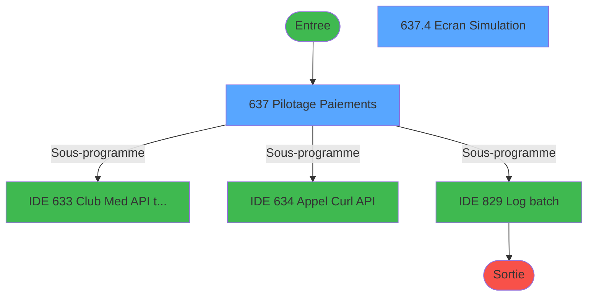
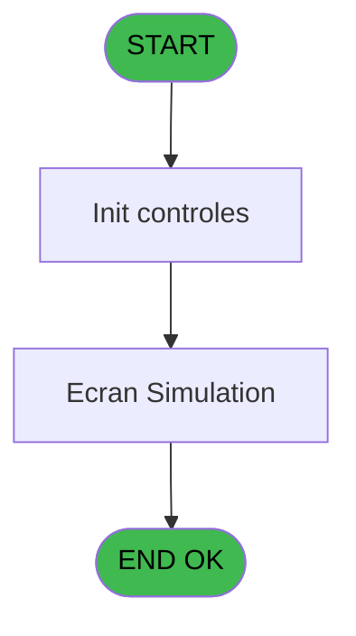
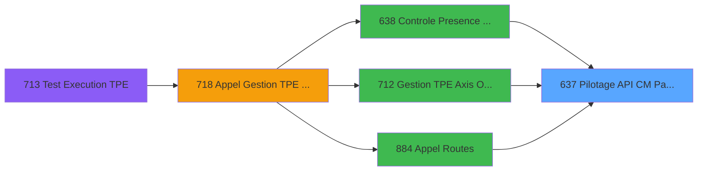
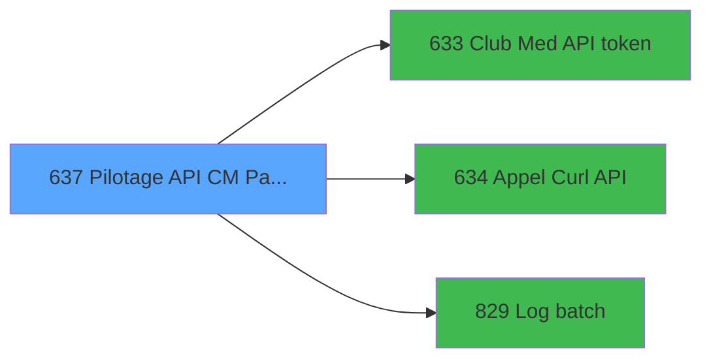

# REF IDE 637 - Pilotage API CM Paiements

> **Analyse**: Phases 1-4 2026-02-03 13:19 -> 13:19 (17s) | Assemblage 13:19
> **Pipeline**: V7.2 Enrichi
> **Structure**: 4 onglets (Resume | Ecrans | Donnees | Connexions)

<!-- TAB:Resume -->

## 1. FICHE D'IDENTITE

| Attribut | Valeur |
|----------|--------|
| Projet | REF |
| IDE Position | 637 |
| Nom Programme | Pilotage API CM Paiements |
| Fichier source | `Prg_637.xml` |
| Dossier IDE | General |
| Taches | 5 (2 ecrans visibles) |
| Tables modifiees | 0 |
| Programmes appeles | 3 |

## 2. DESCRIPTION FONCTIONNELLE

**Pilotage API CM Paiements** assure la gestion complete de ce processus, accessible depuis [Controle Presence Garantie (IDE 638)](REF-IDE-638.md), [Gestion TPE Axis Omnicanal (IDE 712)](REF-IDE-712.md), [Appel Routes (IDE 884)](REF-IDE-884.md).

Le flux de traitement s'organise en **2 blocs fonctionnels** :

- **Traitement** (4 taches) : traitements metier divers
- **Reglement** (1 tache) : gestion des moyens de paiement et reglements

**Logique metier** : 3 regles identifiees couvrant conditions metier.

Detail : phases du traitement

#### Phase 1 : Reglement (1 tache)

- **637** - Pilotage Paiements **[[ECRAN]](#ecran-t1)**

#### Phase 2 : Traitement (4 taches)

- **637.1** - Lecture paramètres API
- **637.2** - Recup info client
- **637.3** - XML refresh/access token
- **637.4** - Ecran Simulation **[[ECRAN]](#ecran-t11)**

Delegue a : [Club Med API token (IDE 633)](REF-IDE-633.md), [Appel Curl API (IDE 634)](REF-IDE-634.md), [Log batch (IDE 829)](REF-IDE-829.md)

## 3. BLOCS FONCTIONNELS

### 3.1 Reglement (1 tache)

Gestion des moyens de paiement : 1 tache de reglement.

---

#### 637 - Pilotage Paiements [[ECRAN]](#ecran-t1)

**Role** : Gestion du reglement : Pilotage Paiements.
**Ecran** : 427 x 62 DLU | [Voir mockup](#ecran-t1)

### 3.2 Traitement (4 taches)

Traitements internes.

---

#### 637.1 - Lecture paramètres API

**Role** : Traitement : Lecture paramètres API.
**Delegue a** : [Club Med API token (IDE 633)](REF-IDE-633.md), [Appel Curl API (IDE 634)](REF-IDE-634.md), [Log batch (IDE 829)](REF-IDE-829.md)

---

#### 637.2 - Recup info client

**Role** : Consultation/chargement : Recup info client.
**Variables liees** : L (v.Client Id), M (v.Client Secret)
**Delegue a** : [Club Med API token (IDE 633)](REF-IDE-633.md), [Appel Curl API (IDE 634)](REF-IDE-634.md), [Log batch (IDE 829)](REF-IDE-829.md)

---

#### 637.3 - XML refresh/access token

**Role** : Traitement : XML refresh/access token.
**Variables liees** : A (P.i.Access Token), B (P.i.Token Expiration Time), G (P.i.o.Token Carte de Crédit)
**Delegue a** : [Club Med API token (IDE 633)](REF-IDE-633.md), [Appel Curl API (IDE 634)](REF-IDE-634.md), [Log batch (IDE 829)](REF-IDE-829.md)

---

#### 637.4 - Ecran Simulation [[ECRAN]](#ecran-t11)

**Role** : Traitement : Ecran Simulation.
**Ecran** : 762 x 278 DLU | [Voir mockup](#ecran-t11)
**Delegue a** : [Club Med API token (IDE 633)](REF-IDE-633.md), [Appel Curl API (IDE 634)](REF-IDE-634.md), [Log batch (IDE 829)](REF-IDE-829.md)

## 5. REGLES METIER

3 regles identifiees:

### Autres (3 regles)

#### [RM-001] Si P.i.Operation [C] alors 'OK' sinon 'ERR')

| Element | Detail |
|---------|--------|
| **Condition** | `P.i.Operation [C]` |
| **Si vrai** | 'OK' |
| **Si faux** | 'ERR') |
| **Variables** | C (P.i.Operation) |
| **Expression source** | Expression 22 : `IF(P.i.Operation [C],'OK','ERR')` |
| **Exemple** | Si P.i.Operation [C] → 'OK'. Sinon → 'ERR') |

#### [RM-002] Si [AH] alors 'Appel API Ok' sinon 'Appel API KO')

| Element | Detail |
|---------|--------|
| **Condition** | `[AH]` |
| **Si vrai** | 'Appel API Ok' |
| **Si faux** | 'Appel API KO') |
| **Expression source** | Expression 28 : `IF([AH],'Appel API Ok','Appel API KO')` |
| **Exemple** | Si [AH] → 'Appel API Ok'. Sinon → 'Appel API KO') |

#### [RM-003] Verification d'appartenance de P.i.Compte [D] a une liste de valeurs

| Element | Detail |
|---------|--------|
| **Condition** | `IN(P.i.Compte [D]` |
| **Si vrai** | 'PAY' |
| **Si faux** | 'BLO'),Trim([AB])<>'','TRUE'LOG) |
| **Variables** | D (P.i.Compte) |
| **Expression source** | Expression 31 : `IF(IN(P.i.Compte [D],'PAY','BLO'),Trim([AB])<>'','TRUE'LOG)` |
| **Exemple** | Si IN(P.i.Compte [D] → 'PAY'. Sinon → 'BLO'),Trim([AB])<>'','TRUE'LOG) |

## 6. CONTEXTE

- **Appele par**: [Controle Presence Garantie (IDE 638)](REF-IDE-638.md), [Gestion TPE Axis Omnicanal (IDE 712)](REF-IDE-712.md), [Appel Routes (IDE 884)](REF-IDE-884.md)
- **Appelle**: 3 programmes | **Tables**: 6 (W:0 R:2 L:4) | **Taches**: 5 | **Expressions**: 32

<!-- TAB:Ecrans -->

## 8. ECRANS

### 8.1 Forms visibles (2 / 5)

| # | Position | Tache | Nom | Type | Largeur | Hauteur | Bloc |
|---|----------|-------|-----|------|---------|---------|------|
| 1 | 637 | 637 | Pilotage Paiements | Type0 | 427 | 62 | Reglement |
| 2 | 637.1 | 637.4 | Ecran Simulation | Type0 | 762 | 278 | Traitement |

### 8.2 Mockups Ecrans

---

#### 637 - Pilotage Paiements
**Tache** : [637](#t1) | **Type** : Type0 | **Dimensions** : 427 x 62 DLU
**Bloc** : Reglement | **Titre IDE** : Pilotage Paiements

<!-- FORM-DATA:
{
    "width":  427,
    "vFactor":  8,
    "type":  "Type0",
    "hFactor":  8,
    "controls":  [
                     {
                         "x":  0,
                         "type":  "label",
                         "var":  "",
                         "y":  1,
                         "w":  423,
                         "fmt":  "",
                         "name":  "",
                         "h":  29,
                         "color":  "",
                         "text":  "",
                         "parent":  null
                     },
                     {
                         "x":  120,
                         "type":  "label",
                         "var":  "",
                         "y":  11,
                         "w":  221,
                         "fmt":  "",
                         "name":  "",
                         "h":  8,
                         "color":  "7",
                         "text":  "Traitement en cours ...",
                         "parent":  null
                     },
                     {
                         "x":  0,
                         "type":  "label",
                         "var":  "",
                         "y":  30,
                         "w":  423,
                         "fmt":  "",
                         "name":  "",
                         "h":  27,
                         "color":  "",
                         "text":  "",
                         "parent":  null
                     },
                     {
                         "x":  4,
                         "type":  "image",
                         "var":  "",
                         "y":  3,
                         "w":  72,
                         "fmt":  "",
                         "name":  "",
                         "h":  25,
                         "color":  "",
                         "text":  "",
                         "parent":  null
                     },
                     {
                         "x":  21,
                         "type":  "edit",
                         "var":  "",
                         "y":  39,
                         "w":  382,
                         "fmt":  "30",
                         "name":  "",
                         "h":  10,
                         "color":  "7",
                         "text":  "",
                         "parent":  null
                     }
                 ],
    "taskId":  "637",
    "height":  62
}
-->

<strong>Champs : 1 champs</strong>

| Pos (x,y) | Nom | Variable | Type |
|-----------|-----|----------|------|
| 21,39 | 30 | - | edit |

---

#### 637.1 - Ecran Simulation
**Tache** : [637.4](#t11) | **Type** : Type0 | **Dimensions** : 762 x 278 DLU
**Bloc** : Traitement | **Titre IDE** : Ecran Simulation

<!-- FORM-DATA:
{
    "width":  762,
    "vFactor":  8,
    "type":  "Type0",
    "hFactor":  8,
    "controls":  [
                     {
                         "x":  0,
                         "type":  "label",
                         "var":  "",
                         "y":  46,
                         "w":  138,
                         "fmt":  "",
                         "name":  "",
                         "h":  9,
                         "color":  "",
                         "text":  "Access Token",
                         "parent":  null
                     },
                     {
                         "x":  0,
                         "type":  "label",
                         "var":  "",
                         "y":  67,
                         "w":  142,
                         "fmt":  "",
                         "name":  "",
                         "h":  9,
                         "color":  "",
                         "text":  "Expiration Time",
                         "parent":  null
                     },
                     {
                         "x":  0,
                         "type":  "label",
                         "var":  "",
                         "y":  88,
                         "w":  85,
                         "fmt":  "",
                         "name":  "",
                         "h":  9,
                         "color":  "",
                         "text":  "Compte",
                         "parent":  null
                     },
                     {
                         "x":  0,
                         "type":  "label",
                         "var":  "",
                         "y":  109,
                         "w":  83,
                         "fmt":  "",
                         "name":  "",
                         "h":  9,
                         "color":  "",
                         "text":  "Filiation",
                         "parent":  null
                     },
                     {
                         "x":  0,
                         "type":  "label",
                         "var":  "",
                         "y":  130,
                         "w":  90,
                         "fmt":  "",
                         "name":  "",
                         "h":  9,
                         "color":  "",
                         "text":  "Montant",
                         "parent":  null
                     },
                     {
                         "x":  0,
                         "type":  "label",
                         "var":  "",
                         "y":  151,
                         "w":  184,
                         "fmt":  "",
                         "name":  "",
                         "h":  9,
                         "color":  "",
                         "text":  "Token Carte Credit",
                         "parent":  null
                     },
                     {
                         "x":  0,
                         "type":  "label",
                         "var":  "",
                         "y":  172,
                         "w":  117,
                         "fmt":  "",
                         "name":  "",
                         "h":  9,
                         "color":  "",
                         "text":  "Type Carte",
                         "parent":  null
                     },
                     {
                         "x":  0,
                         "type":  "label",
                         "var":  "",
                         "y":  193,
                         "w":  117,
                         "fmt":  "",
                         "name":  "",
                         "h":  9,
                         "color":  "",
                         "text":  "Is Success",
                         "parent":  null
                     },
                     {
                         "x":  0,
                         "type":  "label",
                         "var":  "",
                         "y":  214,
                         "w":  142,
                         "fmt":  "",
                         "name":  "",
                         "h":  9,
                         "color":  "",
                         "text":  "Error Message",
                         "parent":  null
                     },
                     {
                         "x":  3,
                         "type":  "label",
                         "var":  "",
                         "y":  233,
                         "w":  205,
                         "fmt":  "",
                         "name":  "",
                         "h":  9,
                         "color":  "",
                         "text":  "Accepte Easy Checkout",
                         "parent":  null
                     },
                     {
                         "x":  14,
                         "type":  "edit",
                         "var":  "",
                         "y":  9,
                         "w":  733,
                         "fmt":  "30",
                         "name":  "",
                         "h":  19,
                         "color":  "",
                         "text":  "",
                         "parent":  null
                     },
                     {
                         "x":  229,
                         "type":  "edit",
                         "var":  "",
                         "y":  46,
                         "w":  508,
                         "fmt":  "",
                         "name":  "P.i.Access Token",
                         "h":  10,
                         "color":  "",
                         "text":  "",
                         "parent":  null
                     },
                     {
                         "x":  229,
                         "type":  "edit",
                         "var":  "",
                         "y":  66,
                         "w":  508,
                         "fmt":  "",
                         "name":  "P.i.Expiration Time",
                         "h":  10,
                         "color":  "",
                         "text":  "",
                         "parent":  null
                     },
                     {
                         "x":  229,
                         "type":  "edit",
                         "var":  "",
                         "y":  87,
                         "w":  508,
                         "fmt":  "",
                         "name":  "P.i.Compte",
                         "h":  10,
                         "color":  "",
                         "text":  "",
                         "parent":  null
                     },
                     {
                         "x":  229,
                         "type":  "edit",
                         "var":  "",
                         "y":  108,
                         "w":  508,
                         "fmt":  "",
                         "name":  "P.i.Filiation",
                         "h":  10,
                         "color":  "",
                         "text":  "",
                         "parent":  null
                     },
                     {
                         "x":  229,
                         "type":  "edit",
                         "var":  "",
                         "y":  129,
                         "w":  508,
                         "fmt":  "",
                         "name":  "P.i.Montant",
                         "h":  10,
                         "color":  "",
                         "text":  "",
                         "parent":  null
                     },
                     {
                         "x":  229,
                         "type":  "edit",
                         "var":  "",
                         "y":  150,
                         "w":  508,
                         "fmt":  "",
                         "name":  "P.i.o.Token Carte Credit",
                         "h":  10,
                         "color":  "",
                         "text":  "",
                         "parent":  null
                     },
                     {
                         "x":  229,
                         "type":  "edit",
                         "var":  "",
                         "y":  172,
                         "w":  508,
                         "fmt":  "",
                         "name":  "P.o.Type Carte",
                         "h":  10,
                         "color":  "",
                         "text":  "",
                         "parent":  null
                     },
                     {
                         "x":  229,
                         "type":  "combobox",
                         "var":  "",
                         "y":  193,
                         "w":  508,
                         "fmt":  "",
                         "name":  "P.o.Is Success",
                         "h":  12,
                         "color":  "",
                         "text":  "",
                         "parent":  null
                     },
                     {
                         "x":  229,
                         "type":  "edit",
                         "var":  "",
                         "y":  214,
                         "w":  508,
                         "fmt":  "",
                         "name":  "P.o.Error Message",
                         "h":  10,
                         "color":  "",
                         "text":  "",
                         "parent":  null
                     },
                     {
                         "x":  229,
                         "type":  "combobox",
                         "var":  "",
                         "y":  233,
                         "w":  508,
                         "fmt":  "",
                         "name":  "P.o. ECO validated?",
                         "h":  12,
                         "color":  "",
                         "text":  "",
                         "parent":  null
                     },
                     {
                         "x":  341,
                         "type":  "button",
                         "var":  "",
                         "y":  258,
                         "w":  78,
                         "fmt":  "Valider",
                         "name":  "",
                         "h":  14,
                         "color":  "",
                         "text":  "",
                         "parent":  null
                     }
                 ],
    "taskId":  "637.1",
    "height":  278
}
-->

<strong>Champs : 11 champs</strong>

| Pos (x,y) | Nom | Variable | Type |
|-----------|-----|----------|------|
| 14,9 | 30 | - | edit |
| 229,46 | P.i.Access Token | - | edit |
| 229,66 | P.i.Expiration Time | - | edit |
| 229,87 | P.i.Compte | - | edit |
| 229,108 | P.i.Filiation | - | edit |
| 229,129 | P.i.Montant | - | edit |
| 229,150 | P.i.o.Token Carte Credit | - | edit |
| 229,172 | P.o.Type Carte | - | edit |
| 229,193 | P.o.Is Success | - | combobox |
| 229,214 | P.o.Error Message | - | edit |
| 229,233 | P.o. ECO validated? | - | combobox |

<strong>Boutons : 1 boutons</strong>

| Bouton | Pos (x,y) | Action |
|--------|-----------|--------|
| Valider | 341,258 | Valide la saisie et enregistre |

## 9. NAVIGATION

### 9.1 Enchainement des ecrans

**Detail par enchainement :**

| Depuis | Action | Vers | Retour |
|--------|--------|------|--------|
| Pilotage Paiements | Sous-programme | [Club Med API token (IDE 633)](REF-IDE-633.md) | Retour ecran |
| Pilotage Paiements | Sous-programme | [Appel Curl API (IDE 634)](REF-IDE-634.md) | Retour ecran |
| Pilotage Paiements | Sous-programme | [Log batch (IDE 829)](REF-IDE-829.md) | Retour ecran |

### 9.3 Structure hierarchique (5 taches)

| Position | Tache | Type | Dimensions | Bloc |
|----------|-------|------|------------|------|
| **637.1** | [**Pilotage Paiements** (637)](#t1) [mockup](#ecran-t1) | - | 427x62 | Reglement |
| **637.2** | [**Lecture paramètres API** (637.1)](#t6) | - | - | Traitement |
| 637.2.1 | [Recup info client (637.2)](#t7) | - | - | |
| 637.2.2 | [XML refresh/access token (637.3)](#t10) | - | - | |
| 637.2.3 | [Ecran Simulation (637.4)](#t11) [mockup](#ecran-t11) | - | 762x278 | |

### 9.4 Algorigramme

> **Legende**: Vert = START/END OK | Rouge = END KO | Bleu = Decisions
> *Algorigramme auto-genere. Utiliser `/algorigramme` pour une synthese metier detaillee.*

<!-- TAB:Donnees -->

## 10. TABLES

### Tables utilisees (6)

| ID | Nom | Description | Type | R | W | L | Usages |
|----|-----|-------------|------|---|---|---|--------|
| 31 | gm-complet_______gmc |  | DB | R |   |   | 1 |
| 34 | hebergement______heb | Hebergement (chambres) | DB |   |   | L | 1 |
| 69 | initialisation___ini |  | DB | R |   |   | 1 |
| 118 | tables_imports |  | DB |   |   | L | 1 |
| 368 | pms_village |  | DB |   |   | L | 1 |
| 938 | Paramètres Odyssey |  | DB |   |   | L | 1 |

### Colonnes par table (0 / 2 tables avec colonnes identifiees)

Table 31 - gm-complet_______gmc (R) - 1 usages

*Table utilisee uniquement en Link ou aucune colonne Real identifiee dans le DataView.*

Table 69 - initialisation___ini (R) - 1 usages

*Table utilisee uniquement en Link ou aucune colonne Real identifiee dans le DataView.*

## 11. VARIABLES

### 11.1 Parametres entrants (11)

Variables recues du programme appelant ([Controle Presence Garantie (IDE 638)](REF-IDE-638.md)).

| Lettre | Nom | Type | Usage dans |
|--------|-----|------|-----------|
| A | P.i.Access Token | Unicode | [637.3](#t10) |
| B | P.i.Token Expiration Time | Time | 1x parametre entrant |
| C | P.i.Operation | Unicode | 1x parametre entrant |
| D | P.i.Compte | Numeric | 7x parametre entrant |
| E | P.i.Filiation | Numeric | - |
| F | P.i.Montant | Numeric | - |
| G | P.i.o.Token Carte de Crédit | Unicode | - |
| H | P.o.Type de Carte | Unicode | - |
| I | P.o.Is Success | Logical | - |
| J | P.o.Error Message | Unicode | - |
| K | P.o ECO activated? | Logical | - |

### 11.2 Variables de session (21)

Variables persistantes pendant toute la session.

| Lettre | Nom | Type | Usage dans |
|--------|-----|------|-----------|
| L | v.Client Id | Unicode | - |
| M | v.Client Secret | Unicode | 1x session |
| N | v.API Key | Unicode | - |
| O | v.Grant Type | Unicode | - |
| P | v.Scope | Unicode | - |
| Q | v.Url Auth API | Unicode | - |
| R | v.Url API | Unicode | 2x session |
| S | v.Proxy | Unicode | 1x session |
| T | v.Bypass Proxy | Logical | - |
| U | v.Methode | Unicode | - |
| V | v.Json In | Blob | - |
| W | v.Json Response | Blob | - |
| X | v.XML Response | Blob | 6x session |
| Y | v.customer id (neolid) | Numeric | 6x session |
| Z | v.num dossier | Numeric | - |
| BA | v.resort_id | Unicode | - |
| BB | v.nom | Unicode | - |
| BC | v.prenom | Unicode | - |
| BD | v.success call api | Logical | - |
| BE | v.error message call api | Unicode | - |
| BF | v.Id Batch | Numeric | - |

Toutes les 32 variables (liste complete)

| Cat | Lettre | Nom Variable | Type |
|-----|--------|--------------|------|
| P0 | **A** | P.i.Access Token | Unicode |
| P0 | **B** | P.i.Token Expiration Time | Time |
| P0 | **C** | P.i.Operation | Unicode |
| P0 | **D** | P.i.Compte | Numeric |
| P0 | **E** | P.i.Filiation | Numeric |
| P0 | **F** | P.i.Montant | Numeric |
| P0 | **G** | P.i.o.Token Carte de Crédit | Unicode |
| P0 | **H** | P.o.Type de Carte | Unicode |
| P0 | **I** | P.o.Is Success | Logical |
| P0 | **J** | P.o.Error Message | Unicode |
| P0 | **K** | P.o ECO activated? | Logical |
| V. | **L** | v.Client Id | Unicode |
| V. | **M** | v.Client Secret | Unicode |
| V. | **N** | v.API Key | Unicode |
| V. | **O** | v.Grant Type | Unicode |
| V. | **P** | v.Scope | Unicode |
| V. | **Q** | v.Url Auth API | Unicode |
| V. | **R** | v.Url API | Unicode |
| V. | **S** | v.Proxy | Unicode |
| V. | **T** | v.Bypass Proxy | Logical |
| V. | **U** | v.Methode | Unicode |
| V. | **V** | v.Json In | Blob |
| V. | **W** | v.Json Response | Blob |
| V. | **X** | v.XML Response | Blob |
| V. | **Y** | v.customer id (neolid) | Numeric |
| V. | **Z** | v.num dossier | Numeric |
| V. | **BA** | v.resort_id | Unicode |
| V. | **BB** | v.nom | Unicode |
| V. | **BC** | v.prenom | Unicode |
| V. | **BD** | v.success call api | Logical |
| V. | **BE** | v.error message call api | Unicode |
| V. | **BF** | v.Id Batch | Numeric |

## 12. EXPRESSIONS

**32 / 32 expressions decodees (100%)**

### 12.1 Repartition par type

| Type | Expressions | Regles |
|------|-------------|--------|
| CONCATENATION | 1 | 0 |
| CONDITION | 10 | 2 |
| CAST_LOGIQUE | 2 | 5 |
| CONSTANTE | 5 | 0 |
| OTHER | 9 | 0 |
| FORMAT | 5 | 0 |

### 12.2 Expressions cles par type

#### CONCATENATION (1 expressions)

| Type | IDE | Expression | Regle |
|------|-----|------------|-------|
| CONCATENATION | 15 | `'<?xml version="1.0" encoding="UTF-8"?>' &ASCIIChr(13)& ASCIIChr(10)&DotNet.System.Xml.Linq.XElement.Load(DotNet.System.Runtime.Serialization.Json.JsonReaderWriterFactory.CreateJsonReader(v.Url API [R],DotNet.System.Xml.XmlDictionaryReaderQuotas())).ToString()` | - |

#### CONDITION (10 expressions)

| Type | IDE | Expression | Regle |
|------|-----|------------|-------|
| CONDITION | 22 | `IF(P.i.Operation [C],'OK','ERR')` | [RM-001](#rm-RM-001) |
| CONDITION | 28 | `IF([AH],'Appel API Ok','Appel API KO')` | [RM-002](#rm-RM-002) |
| CONDITION | 13 | `P.i.Compte [D]='VER'` | - |
| CONDITION | 6 | `P.i.Compte [D]='VER'` | - |
| CONDITION | 4 | `Trim(P.i.Access Token [A])='' OR (Trim(P.i.Access Token [A])<>'' AND Time()>P.i.Token Expiration Time [B])` | - |
| ... | | *+5 autres* | |

#### CAST_LOGIQUE (2 expressions)

| Type | IDE | Expression | Regle |
|------|-----|------------|-------|
| CAST_LOGIQUE | 31 | `IF(IN(P.i.Compte [D],'PAY','BLO'),Trim([AB])<>'','TRUE'LOG)` | [RM-003](#rm-RM-003) |
| CAST_LOGIQUE | 30 | `'FALSE'LOG` | - |

#### CONSTANTE (5 expressions)

| Type | IDE | Expression | Regle |
|------|-----|------------|-------|
| CONSTANTE | 24 | `'xml'` | - |
| CONSTANTE | 29 | `''` | - |
| CONSTANTE | 23 | `'json'` | - |
| CONSTANTE | 8 | `'{  \"customer_id\": \"@1@\",  \"booking_id\": \"@2@\",  \"amount\": @3@,  \"resort_id\": \"@4@\",@5@  \"payment_instrument\": {    \"token\": \"@6@\"  }}'` | - |
| CONSTANTE | 18 | `'PAIEMENT API'` | - |

#### OTHER (9 expressions)

| Type | IDE | Expression | Regle |
|------|-----|------------|-------|
| OTHER | 25 | `Blb2File(v.Url API [R],'c:\temp\json.txt')` | - |
| OTHER | 17 | `SetCrsr(1)` | - |
| OTHER | 27 | `Blb2File(v.Proxy [S],'c:\temp\xml.txt')` | - |
| OTHER | 26 | `Blb2File([AA],'c:\temp\json_in.txt')` | - |
| OTHER | 16 | `SetCrsr(2)` | - |
| ... | | *+4 autres* | |

#### FORMAT (5 expressions)

| Type | IDE | Expression | Regle |
|------|-----|------------|-------|
| FORMAT | 20 | `StrBuild('@1@ @2@ (neolid @3@, booking id @4@)', [AK], [AL], Trim(Str(v.XML Response [X],'18')), Str(v.customer id (neolid) [Y],'9'))` | - |
| FORMAT | 21 | `StrBuild('@1@~@2@~@3@', [AD], Trim(Str(v.XML Response [X],'18')),Str(v.customer id (neolid) [Y], '10'))` | - |
| FORMAT | 11 | `StrBuild([AA],Trim(Str([AC],'N12.2')),Trim([AD]),IF(P.i.Compte [D]='BLO','\"preauthorize_only\": true,',''),Trim([AB]))` | - |
| FORMAT | 5 | `StrBuild(v.Client Secret [M],Trim(Str(v.XML Response [X],'18')),Trim(Str(v.customer id (neolid) [Y],'10')))` | - |
| FORMAT | 9 | `StrBuild([AA],Trim(Str(v.XML Response [X],'18')),Trim(Str(v.customer id (neolid) [Y],'10')),Trim(Str([AC],'N12.2')),Trim([AD]),IF(P.i.Compte [D]='BLO','\"preauthorize_only\": true,',''),Trim([AB]))` | - |

### 12.3 Toutes les expressions (32)

Voir les 32 expressions

#### CONCATENATION (1)

| IDE | Expression Decodee |
|-----|-------------------|
| 15 | `'<?xml version="1.0" encoding="UTF-8"?>' &ASCIIChr(13)& ASCIIChr(10)&DotNet.System.Xml.Linq.XElement.Load(DotNet.System.Runtime.Serialization.Json.JsonReaderWriterFactory.CreateJsonReader(v.Url API [R],DotNet.System.Xml.XmlDictionaryReaderQuotas())).ToString()` |

#### CONDITION (10)

| IDE | Expression Decodee |
|-----|-------------------|
| 19 | `CASE(P.i.Compte [D],'VER',MlsTrans('Verification Garantie'),'BLO',MlsTrans('Blocage de fonds'),'PAY',MlsTrans('Paiement'),MlsTrans('Inconnu'))` |
| 22 | `IF(P.i.Operation [C],'OK','ERR')` |
| 28 | `IF([AH],'Appel API Ok','Appel API KO')` |
| 1 | `Translate('%simultpe%')='O'` |
| 2 | `Translate('%simultpe%')<>'O'` |
| 3 | `v.XML Response [X]<>0 AND v.customer id (neolid) [Y]<>0` |
| 6 | `P.i.Compte [D]='VER'` |
| 13 | `P.i.Compte [D]='VER'` |
| 32 | `v.XML Response [X]<>0 AND v.customer id (neolid) [Y]<>0` |
| 4 | `Trim(P.i.Access Token [A])='' OR (Trim(P.i.Access Token [A])<>'' AND Time()>P.i.Token Expiration Time [B])` |

#### CAST_LOGIQUE (2)

| IDE | Expression Decodee |
|-----|-------------------|
| 31 | `IF(IN(P.i.Compte [D],'PAY','BLO'),Trim([AB])<>'','TRUE'LOG)` |
| 30 | `'FALSE'LOG` |

#### CONSTANTE (5)

| IDE | Expression Decodee |
|-----|-------------------|
| 8 | `'{  \"customer_id\": \"@1@\",  \"booking_id\": \"@2@\",  \"amount\": @3@,  \"resort_id\": \"@4@\",@5@  \"payment_instrument\": {    \"token\": \"@6@\"  }}'` |
| 18 | `'PAIEMENT API'` |
| 23 | `'json'` |
| 24 | `'xml'` |
| 29 | `''` |

#### OTHER (9)

| IDE | Expression Decodee |
|-----|-------------------|
| 7 | `IN(P.i.Compte [D],'PAY','BLO')` |
| 10 | `'{  \"amount\": @1@,  \"resort_id\": \"@2@\",@3@  \"payment_instrument\": {    \"token\": \"@4@\"  }}'
` |
| 12 | `Translate('%TempDir%')` |
| 14 | `[AH]` |
| 16 | `SetCrsr(2)` |
| 17 | `SetCrsr(1)` |
| 25 | `Blb2File(v.Url API [R],'c:\temp\json.txt')` |
| 26 | `Blb2File([AA],'c:\temp\json_in.txt')` |
| 27 | `Blb2File(v.Proxy [S],'c:\temp\xml.txt')` |

#### FORMAT (5)

| IDE | Expression Decodee |
|-----|-------------------|
| 5 | `StrBuild(v.Client Secret [M],Trim(Str(v.XML Response [X],'18')),Trim(Str(v.customer id (neolid) [Y],'10')))` |
| 9 | `StrBuild([AA],Trim(Str(v.XML Response [X],'18')),Trim(Str(v.customer id (neolid) [Y],'10')),Trim(Str([AC],'N12.2')),Trim([AD]),IF(P.i.Compte [D]='BLO','\"preauthorize_only\": true,',''),Trim([AB]))` |
| 11 | `StrBuild([AA],Trim(Str([AC],'N12.2')),Trim([AD]),IF(P.i.Compte [D]='BLO','\"preauthorize_only\": true,',''),Trim([AB]))` |
| 20 | `StrBuild('@1@ @2@ (neolid @3@, booking id @4@)', [AK], [AL], Trim(Str(v.XML Response [X],'18')), Str(v.customer id (neolid) [Y],'9'))` |
| 21 | `StrBuild('@1@~@2@~@3@', [AD], Trim(Str(v.XML Response [X],'18')),Str(v.customer id (neolid) [Y], '10'))` |

<!-- TAB:Connexions -->

## 13. GRAPHE D'APPELS

### 13.1 Chaine depuis Main (Callers)

Main -> ... -> [Controle Presence Garantie (IDE 638)](REF-IDE-638.md) -> **Pilotage API CM Paiements (IDE 637)**

Main -> ... -> [Gestion TPE Axis Omnicanal (IDE 712)](REF-IDE-712.md) -> **Pilotage API CM Paiements (IDE 637)**

Main -> ... -> [Appel Routes (IDE 884)](REF-IDE-884.md) -> **Pilotage API CM Paiements (IDE 637)**

### 13.2 Callers

| IDE | Nom Programme | Nb Appels |
|-----|---------------|-----------|
| [638](REF-IDE-638.md) | Controle Presence Garantie | 2 |
| [712](REF-IDE-712.md) | Gestion TPE Axis Omnicanal | 1 |
| [884](REF-IDE-884.md) | Appel Routes | 1 |

### 13.3 Callees (programmes appeles)

### 13.4 Detail Callees avec contexte

| IDE | Nom Programme | Appels | Contexte |
|-----|---------------|--------|----------|
| [633](REF-IDE-633.md) | Club Med API token | 1 | Sous-programme |
| [634](REF-IDE-634.md) | Appel Curl API | 1 | Sous-programme |
| [829](REF-IDE-829.md) | Log batch | 1 | Sous-programme |

## 14. RECOMMANDATIONS MIGRATION

### 14.1 Profil du programme

| Metrique | Valeur | Impact migration |
|----------|--------|-----------------|
| Lignes de logique | 188 | Programme compact |
| Expressions | 32 | Peu de logique |
| Tables WRITE | 0 | Impact faible |
| Sous-programmes | 3 | Peu de dependances |
| Ecrans visibles | 2 | Quelques ecrans |
| Code desactive | 0.5% (1 / 188) | Code sain |
| Regles metier | 3 | Quelques regles a preserver |

### 14.2 Plan de migration par bloc

#### Reglement (1 tache: 1 ecran, 0 traitement)

- **Strategie** : Service `IReglementService` avec pattern Strategy par mode de paiement.
- Integration TPE si applicable

#### Traitement (4 taches: 1 ecran, 3 traitements)

- **Strategie** : Orchestrateur avec 1 ecrans (Razor/React) et 3 traitements backend (services).
- Les ecrans deviennent des composants UI, les traitements invisibles deviennent des services injectables.
- 3 sous-programme(s) a migrer ou a reutiliser depuis les services existants.
- Decomposer les taches en services unitaires testables.

### 14.3 Dependances critiques

| Dependance | Type | Appels | Impact |
|------------|------|--------|--------|
| [Log batch (IDE 829)](REF-IDE-829.md) | Sous-programme | 1x | Normale - Sous-programme |
| [Appel Curl API (IDE 634)](REF-IDE-634.md) | Sous-programme | 1x | Normale - Sous-programme |
| [Club Med API token (IDE 633)](REF-IDE-633.md) | Sous-programme | 1x | Normale - Sous-programme |

---
*Spec DETAILED generee par Pipeline V7.2 - 2026-02-03 13:19*
