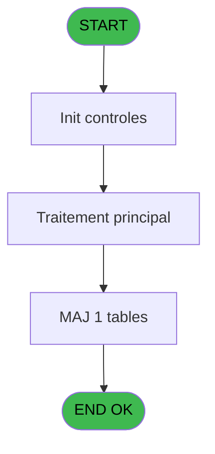
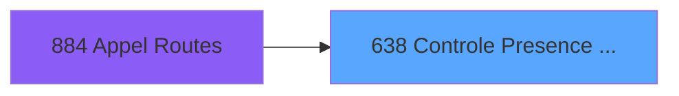

# REF IDE 638 - Controle Presence Garantie

> **Analyse**: Phases 1-4 2026-02-03 13:19 -> 13:20 (17s) | Assemblage 13:20
> **Pipeline**: V7.2 Enrichi
> **Structure**: 4 onglets (Resume | Ecrans | Donnees | Connexions)

<!-- TAB:Resume -->

## 1. FICHE D'IDENTITE

| Attribut | Valeur |
|----------|--------|
| Projet | REF |
| IDE Position | 638 |
| Nom Programme | Controle Presence Garantie |
| Fichier source | `Prg_638.xml` |
| Dossier IDE | Garanties |
| Taches | 3 (0 ecrans visibles) |
| Tables modifiees | 1 |
| Programmes appeles | 1 |

## 2. DESCRIPTION FONCTIONNELLE

**Controle Presence Garantie** assure la gestion complete de ce processus, accessible depuis [Appel Routes (IDE 884)](REF-IDE-884.md).

Le flux de traitement s'organise en **2 blocs fonctionnels** :

- **Traitement** (2 taches) : traitements metier divers
- **Validation** (1 tache) : controles et verifications de coherence

**Donnees modifiees** : 1 tables en ecriture (depot_garantie___dga).

Detail : phases du traitement

#### Phase 1 : Validation (1 tache)

- **638** - Controle Presence Garantie

#### Phase 2 : Traitement (2 taches)

- **638.1** - Création Garantie
- **638.1.1** - update gmc_accept_exp_co C9

#### Tables impactees

| Table | Operations | Role metier |
|-------|-----------|-------------|
| depot_garantie___dga | **W** (1 usages) | Depots et garanties |

## 3. BLOCS FONCTIONNELS

### 3.1 Validation (1 tache)

Controles de coherence : 1 tache verifie les donnees et conditions.

---

#### 638 - Controle Presence Garantie

**Role** : Verification : Controle Presence Garantie.
**Variables liees** : D (P.o.Garantie Valide), F (P.o.Garantie Prise)

### 3.2 Traitement (2 taches)

Traitements internes.

---

#### 638.1 - Création Garantie

**Role** : Traitement : Création Garantie.
**Variables liees** : D (P.o.Garantie Valide), F (P.o.Garantie Prise)

---

#### 638.1.1 - update gmc_accept_exp_co C9

**Role** : Traitement : update gmc_accept_exp_co C9.

## 5. REGLES METIER

*(Aucune regle metier identifiee)*

## 6. CONTEXTE

- **Appele par**: [Appel Routes (IDE 884)](REF-IDE-884.md)
- **Appelle**: 1 programmes | **Tables**: 4 (W:1 R:1 L:2) | **Taches**: 3 | **Expressions**: 10

<!-- TAB:Ecrans -->

## 8. ECRANS

*(Programme sans ecran visible)*

## 9. NAVIGATION

### 9.3 Structure hierarchique (3 taches)

| Position | Tache | Type | Dimensions | Bloc |
|----------|-------|------|------------|------|
| **638.1** | [**Controle Presence Garantie** (638)](#t1) | - | - | Validation |
| **638.2** | [**Création Garantie** (638.1)](#t2) | - | - | Traitement |
| 638.2.1 | [update gmc_accept_exp_co C9 (638.1.1)](#t3) | - | - | |

### 9.4 Algorigramme

> **Legende**: Vert = START/END OK | Rouge = END KO | Bleu = Decisions
> *Algorigramme auto-genere. Utiliser `/algorigramme` pour une synthese metier detaillee.*

<!-- TAB:Donnees -->

## 10. TABLES

### Tables utilisees (4)

| ID | Nom | Description | Type | R | W | L | Usages |
|----|-----|-------------|------|---|---|---|--------|
| 39 | depot_garantie___dga | Depots et garanties | DB |   | **W** |   | 1 |
| 47 | compte_gm________cgm | Comptes GM (generaux) | DB |   |   | L | 1 |
| 69 | initialisation___ini |  | DB | R |   |   | 1 |
| 91 | garantie_________gar | Depots et garanties | DB |   |   | L | 1 |

### Colonnes par table (4 / 2 tables avec colonnes identifiees)

Table 39 - depot_garantie___dga (**W**) - 1 usages

| Lettre | Variable | Acces | Type |
|--------|----------|-------|------|
| D | P.o.Garantie Valide | W | Logical |
| F | P.o.Garantie Prise | W | Logical |

Table 69 - initialisation___ini (R) - 1 usages

| Lettre | Variable | Acces | Type |
|--------|----------|-------|------|
| A | P.i.Société | R | Unicode |
| B | P.i.Compte | R | Numeric |
| C | P.i.Filiation | R | Numeric |
| D | P.o.Garantie Valide | R | Logical |
| E | P.o.Error Message | R | Unicode |
| F | P.o.Garantie Prise | R | Logical |
| G | P.i.o.API Access Token | R | Unicode |
| H | P.i.o.API Token Expiration Time | R | Time |
| I | v.Credit Card Token | R | Unicode |
| J | v.Credit Card Type | R | Unicode |
| K | v. ECO accepté | R | Logical |

## 11. VARIABLES

### 11.1 Parametres entrants (8)

Variables recues du programme appelant ([Appel Routes (IDE 884)](REF-IDE-884.md)).

| Lettre | Nom | Type | Usage dans |
|--------|-----|------|-----------|
| A | P.i.Société | Unicode | 1x parametre entrant |
| B | P.i.Compte | Numeric | - |
| C | P.i.Filiation | Numeric | - |
| D | P.o.Garantie Valide | Logical | 1x parametre entrant |
| E | P.o.Error Message | Unicode | - |
| F | P.o.Garantie Prise | Logical | - |
| G | P.i.o.API Access Token | Unicode | - |
| H | P.i.o.API Token Expiration Time | Time | - |

### 11.2 Variables de session (3)

Variables persistantes pendant toute la session.

| Lettre | Nom | Type | Usage dans |
|--------|-----|------|-----------|
| I | v.Credit Card Token | Unicode | - |
| J | v.Credit Card Type | Unicode | - |
| K | v. ECO accepté | Logical | - |

## 12. EXPRESSIONS

**10 / 10 expressions decodees (100%)**

### 12.1 Repartition par type

| Type | Expressions | Regles |
|------|-------------|--------|
| CONSTANTE | 4 | 0 |
| OTHER | 6 | 0 |

### 12.2 Expressions cles par type

#### CONSTANTE (4 expressions)

| Type | IDE | Expression | Regle |
|------|-----|------------|-------|
| CONSTANTE | 5 | `'VER'` | - |
| CONSTANTE | 7 | `'BLO'` | - |
| CONSTANTE | 2 | `'$CARD'` | - |
| CONSTANTE | 3 | `1` | - |

#### OTHER (6 expressions)

| Type | IDE | Expression | Regle |
|------|-----|------------|-------|
| OTHER | 8 | `NOT(VG121) AND NOT(VG139)` | - |
| OTHER | 9 | `P.o.Garantie Valide [D] OR VG121 OR VG139` | - |
| OTHER | 10 | `SetCrsr(1)` | - |
| OTHER | 1 | `P.i.Société [A]` | - |
| OTHER | 4 | `SetCrsr(2)` | - |
| ... | | *+1 autres* | |

<!-- TAB:Connexions -->

## 13. GRAPHE D'APPELS

### 13.1 Chaine depuis Main (Callers)

Main -> ... -> [Appel Routes (IDE 884)](REF-IDE-884.md) -> **Controle Presence Garantie (IDE 638)**

### 13.2 Callers

| IDE | Nom Programme | Nb Appels |
|-----|---------------|-----------|
| [884](REF-IDE-884.md) | Appel Routes | 1 |

### 13.3 Callees (programmes appeles)

### 13.4 Detail Callees avec contexte

| IDE | Nom Programme | Appels | Contexte |
|-----|---------------|--------|----------|
| [637](REF-IDE-637.md) | Pilotage API CM Paiements | 2 | Sous-programme |

## 14. RECOMMANDATIONS MIGRATION

### 14.1 Profil du programme

| Metrique | Valeur | Impact migration |
|----------|--------|-----------------|
| Lignes de logique | 101 | Programme compact |
| Expressions | 10 | Peu de logique |
| Tables WRITE | 1 | Impact faible |
| Sous-programmes | 1 | Peu de dependances |
| Ecrans visibles | 0 | Ecran unique ou traitement batch |
| Code desactive | 0% (0 / 101) | Code sain |
| Regles metier | 0 | Pas de regle identifiee |

### 14.2 Plan de migration par bloc

#### Validation (1 tache: 0 ecran, 1 traitement)

- **Strategie** : FluentValidation avec validators specifiques.
- Chaque tache de validation -> un validator injectable

#### Traitement (2 taches: 0 ecran, 2 traitements)

- **Strategie** : 2 service(s) backend injectable(s) (Domain Services).
- 1 sous-programme(s) a migrer ou a reutiliser depuis les services existants.
- Decomposer les taches en services unitaires testables.

### 14.3 Dependances critiques

| Dependance | Type | Appels | Impact |
|------------|------|--------|--------|
| depot_garantie___dga | Table WRITE (Database) | 1x | Schema + repository |
| [Pilotage API CM Paiements (IDE 637)](REF-IDE-637.md) | Sous-programme | 2x | Haute - Sous-programme |

---
*Spec DETAILED generee par Pipeline V7.2 - 2026-02-03 13:20*
