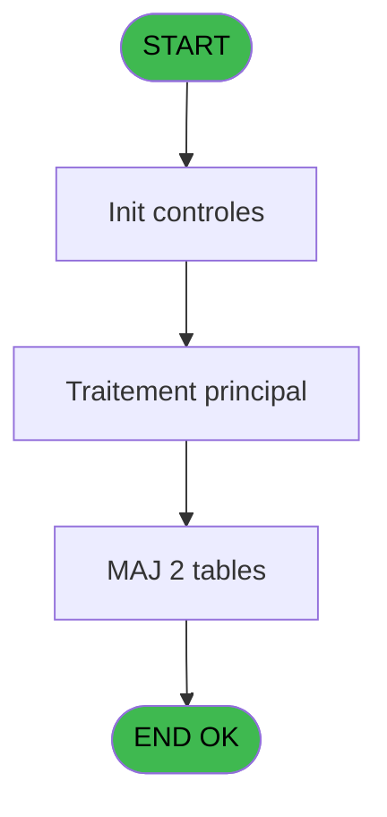
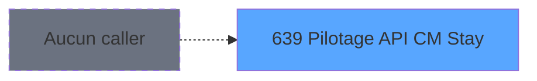
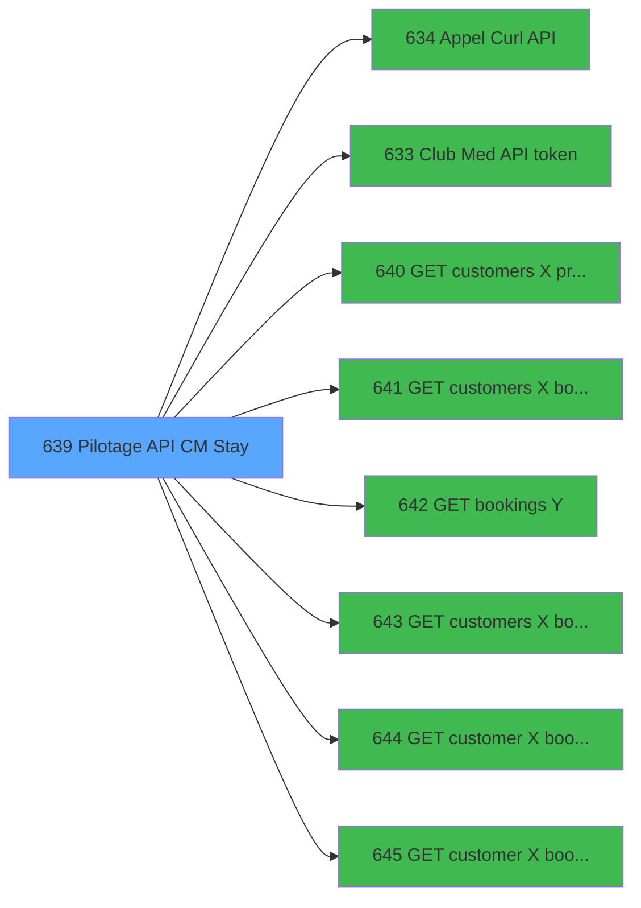

# REF IDE 639 - Pilotage API CM Stay

> **Analyse**: Phases 1-4 2026-02-03 13:20 -> 13:20 (18s) | Assemblage 13:20
> **Pipeline**: V7.2 Enrichi
> **Structure**: 4 onglets (Resume | Ecrans | Donnees | Connexions)

<!-- TAB:Resume -->

## 1. FICHE D'IDENTITE

| Attribut | Valeur |
|----------|--------|
| Projet | REF |
| IDE Position | 639 |
| Nom Programme | Pilotage API CM Stay |
| Fichier source | `Prg_639.xml` |
| Dossier IDE | General |
| Taches | 7 (0 ecrans visibles) |
| Tables modifiees | 2 |
| Programmes appeles | 8 |
| :warning: Statut | **ORPHELIN_POTENTIEL** |

## 2. DESCRIPTION FONCTIONNELLE

**Pilotage API CM Stay** assure la gestion complete de ce processus.

Le flux de traitement s'organise en **4 blocs fonctionnels** :

- **Traitement** (3 taches) : traitements metier divers
- **Creation** (2 taches) : insertion d'enregistrements en base (mouvements, prestations)
- **Calcul** (1 tache) : calculs de montants, stocks ou compteurs
- **Transfert** (1 tache) : transferts de donnees entre modules ou deversements

**Donnees modifiees** : 2 tables en ecriture (compteurs________cpt, Table_955).

Detail : phases du traitement

#### Phase 1 : Traitement (3 taches)

- **639** - Pilotage API CM Stay
- **639.1** - (sans nom)
- **639.1.1** - (sans nom)

Delegue a : [Appel Curl API (IDE 634)](REF-IDE-634.md), [Club Med API token (IDE 633)](REF-IDE-633.md), [GET customers X profile (IDE 640)](REF-IDE-640.md), [GET customers X booking Y stay (IDE 641)](REF-IDE-641.md), [GET bookings Y (IDE 642)](REF-IDE-642.md), [GET customers X bookings Y tsp (IDE 643)](REF-IDE-643.md), [GET customer X bookings Y serv (IDE 644)](REF-IDE-644.md), [GET customer X booking Y EA (IDE 645)](REF-IDE-645.md)

#### Phase 2 : Creation (2 taches)

- **639.1.2** - create stay
- **639.1.5** - create services

#### Phase 3 : Transfert (1 tache)

- **639.1.3** - create transfert

#### Phase 4 : Calcul (1 tache)

- **639.1.4** - leture compteur

#### Tables impactees

| Table | Operations | Role metier |
|-------|-----------|-------------|
| Table_955 | **W** (1 usages) |  |
| compteurs________cpt | **W** (1 usages) | Comptes GM (generaux) |

## 3. BLOCS FONCTIONNELS

### 3.1 Traitement (3 taches)

Traitements internes.

---

#### 639 - Pilotage API CM Stay

**Role** : Traitement : Pilotage API CM Stay.
**Variables liees** : D (v. cust_booking_stay link CB)
**Delegue a** : [Appel Curl API (IDE 634)](REF-IDE-634.md), [Club Med API token (IDE 633)](REF-IDE-633.md), [GET customers X profile (IDE 640)](REF-IDE-640.md)

---

#### 639.1 - (sans nom)

**Role** : Traitement interne.
**Delegue a** : [Appel Curl API (IDE 634)](REF-IDE-634.md), [Club Med API token (IDE 633)](REF-IDE-633.md), [GET customers X profile (IDE 640)](REF-IDE-640.md)

---

#### 639.1.1 - (sans nom)

**Role** : Traitement interne.
**Delegue a** : [Appel Curl API (IDE 634)](REF-IDE-634.md), [Club Med API token (IDE 633)](REF-IDE-633.md), [GET customers X profile (IDE 640)](REF-IDE-640.md)

### 3.2 Creation (2 taches)

Insertion de nouveaux enregistrements en base.

---

#### 639.1.2 - create stay

**Role** : Traitement : create stay.
**Variables liees** : D (v. cust_booking_stay link CB)

---

#### 639.1.5 - create services

**Role** : Traitement : create services.

### 3.3 Transfert (1 tache)

Transfert de donnees entre modules.

---

#### 639.1.3 - create transfert

**Role** : Transfert de donnees : create transfert.

### 3.4 Calcul (1 tache)

Calculs metier : montants, stocks, compteurs.

---

#### 639.1.4 - leture compteur

**Role** : Calcul : leture compteur.

## 5. REGLES METIER

*(Aucune regle metier identifiee)*

## 6. CONTEXTE

- **Appele par**: (aucun)
- **Appelle**: 8 programmes | **Tables**: 12 (W:2 R:3 L:7) | **Taches**: 7 | **Expressions**: 36

<!-- TAB:Ecrans -->

## 8. ECRANS

*(Programme sans ecran visible)*

## 9. NAVIGATION

### 9.3 Structure hierarchique (7 taches)

| Position | Tache | Type | Dimensions | Bloc |
|----------|-------|------|------------|------|
| **639.1** | [**Pilotage API CM Stay** (639)](#t1) | - | - | Traitement |
| 639.1.1 | [(sans nom) (639.1)](#t2) | - | - | |
| 639.1.2 | [(sans nom) (639.1.1)](#t3) | - | - | |
| **639.2** | [**create stay** (639.1.2)](#t4) | - | - | Creation |
| 639.2.1 | [create services (639.1.5)](#t7) | - | - | |
| **639.3** | [**create transfert** (639.1.3)](#t5) | - | - | Transfert |
| **639.4** | [**leture compteur** (639.1.4)](#t6) | - | - | Calcul |

### 9.4 Algorigramme

> **Legende**: Vert = START/END OK | Rouge = END KO | Bleu = Decisions
> *Algorigramme auto-genere. Utiliser `/algorigramme` pour une synthese metier detaillee.*

<!-- TAB:Donnees -->

## 10. TABLES

### Tables utilisees (12)

| ID | Nom | Description | Type | R | W | L | Usages |
|----|-----|-------------|------|---|---|---|--------|
| 30 | gm-recherche_____gmr | Index de recherche | DB | R |   |   | 1 |
| 31 | gm-complet_______gmc |  | DB |   |   | L | 1 |
| 34 | hebergement______heb | Hebergement (chambres) | DB | R |   |   | 1 |
| 35 | personnel_go______go |  | DB |   |   | L | 1 |
| 36 | client_gm |  | DB |   |   | L | 1 |
| 68 | compteurs________cpt | Comptes GM (generaux) | DB |   | **W** |   | 1 |
| 285 | email |  | DB |   |   | L | 1 |
| 461 | trf_transfert_new |  | DB | R |   |   | 1 |
| 949 | Table_949 |  | MEM |   |   | L | 1 |
| 950 | Table_950 |  | MEM |   |   | L | 1 |
| 954 | Table_954 |  | MEM |   |   | L | 1 |
| 955 | Table_955 |  | MEM |   | **W** |   | 1 |

### Colonnes par table (1 / 5 tables avec colonnes identifiees)

Table 30 - gm-recherche_____gmr (R) - 1 usages

*Table utilisee uniquement en Link ou aucune colonne Real identifiee dans le DataView.*

Table 34 - hebergement______heb (R) - 1 usages

*Table utilisee uniquement en Link ou aucune colonne Real identifiee dans le DataView.*

Table 68 - compteurs________cpt (**W**) - 1 usages

*Table utilisee uniquement en Link ou aucune colonne Real identifiee dans le DataView.*

Table 461 - trf_transfert_new (R) - 1 usages

*Table utilisee uniquement en Link ou aucune colonne Real identifiee dans le DataView.*

Table 955 - Table_955 (**W**) - 1 usages

*Table utilisee uniquement en Link ou aucune colonne Real identifiee dans le DataView.*

## 11. VARIABLES

### 11.1 Parametres entrants (2)

Variables recues en parametre.

| Lettre | Nom | Type | Usage dans |
|--------|-----|------|-----------|
| A | p. booking_id | Numeric | - |
| B | p. customer_id | Numeric | - |

### 11.2 Variables de session (25)

Variables persistantes pendant toute la session.

| Lettre | Nom | Type | Usage dans |
|--------|-----|------|-----------|
| C | v. customers_profile link C | Unicode | - |
| D | v. cust_booking_stay link CB | Unicode | - |
| E | v. bookings link B | Unicode | - |
| F | v. cust_booking_transport CB | Unicode | - |
| G | v. cust_booking_service CB | Unicode | - |
| H | v. cust_booking_EA_surveys CB | Unicode | - |
| I | v.url api | Unicode | 1x session |
| J | v. api key | Unicode | 1x session |
| K | v. Token | Unicode | 1x session |
| L | v. Client_id | Unicode | 1x session |
| M | v. Client_secret | Unicode | 1x session |
| N | v. Grant_type | Unicode | 1x session |
| O | v. Scope | Unicode | 1x session |
| P | v. UrlApi Auth | Unicode | - |
| Q | v. ProxyAdressHttp | Unicode | 7x session |
| R | v. BypassProxyOnLocalAdr | Logical | - |
| S | v. isSuccess? | Logical | - |
| T | v. ErrorMessage | Alpha | - |
| U | v. TestMode | Logical | - |
| V | v. json out | Blob | 2x session |
| W | v. json out | Blob | 2x session |
| X | v. json out | Blob | 2x session |
| Y | v. json out | Blob | 2x session |
| Z | v. json out | Blob | 2x session |
| BA | v. json out | Blob | 2x session |

Toutes les 27 variables (liste complete)

| Cat | Lettre | Nom Variable | Type |
|-----|--------|--------------|------|
| P0 | **A** | p. booking_id | Numeric |
| P0 | **B** | p. customer_id | Numeric |
| V. | **C** | v. customers_profile link C | Unicode |
| V. | **D** | v. cust_booking_stay link CB | Unicode |
| V. | **E** | v. bookings link B | Unicode |
| V. | **F** | v. cust_booking_transport CB | Unicode |
| V. | **G** | v. cust_booking_service CB | Unicode |
| V. | **H** | v. cust_booking_EA_surveys CB | Unicode |
| V. | **I** | v.url api | Unicode |
| V. | **J** | v. api key | Unicode |
| V. | **K** | v. Token | Unicode |
| V. | **L** | v. Client_id | Unicode |
| V. | **M** | v. Client_secret | Unicode |
| V. | **N** | v. Grant_type | Unicode |
| V. | **O** | v. Scope | Unicode |
| V. | **P** | v. UrlApi Auth | Unicode |
| V. | **Q** | v. ProxyAdressHttp | Unicode |
| V. | **R** | v. BypassProxyOnLocalAdr | Logical |
| V. | **S** | v. isSuccess? | Logical |
| V. | **T** | v. ErrorMessage | Alpha |
| V. | **U** | v. TestMode | Logical |
| V. | **V** | v. json out | Blob |
| V. | **W** | v. json out | Blob |
| V. | **X** | v. json out | Blob |
| V. | **Y** | v. json out | Blob |
| V. | **Z** | v. json out | Blob |
| V. | **BA** | v. json out | Blob |

## 12. EXPRESSIONS

**36 / 36 expressions decodees (100%)**

### 12.1 Repartition par type

| Type | Expressions | Regles |
|------|-------------|--------|
| CONSTANTE | 14 | 0 |
| OTHER | 14 | 0 |
| CAST_LOGIQUE | 2 | 0 |
| FORMAT | 6 | 0 |

### 12.2 Expressions cles par type

#### CONSTANTE (14 expressions)

| Type | IDE | Expression | Regle |
|------|-----|------------|-------|
| CONSTANTE | 12 | `'openid pms'` | - |
| CONSTANTE | 11 | `'client_credentials'` | - |
| CONSTANTE | 10 | `'edbd09f77f1c53e4a9ff'` | - |
| CONSTANTE | 13 | `'https://auth.clubmed.com/token'` | - |
| CONSTANTE | 18 | `'GET'` | - |
| ... | | *+9 autres* | |

#### OTHER (14 expressions)

| Type | IDE | Expression | Regle |
|------|-----|------------|-------|
| OTHER | 32 | `v. Token [K]` | - |
| OTHER | 31 | `v. Client_id [L]` | - |
| OTHER | 30 | `[AF]` | - |
| OTHER | 33 | `v. api key [J]` | - |
| OTHER | 36 | `v. Scope [O]` | - |
| ... | | *+9 autres* | |

#### CAST_LOGIQUE (2 expressions)

| Type | IDE | Expression | Regle |
|------|-----|------------|-------|
| CAST_LOGIQUE | 29 | `'TRUE'LOG` | - |
| CAST_LOGIQUE | 17 | `'FALSE'LOG` | - |

#### FORMAT (6 expressions)

| Type | IDE | Expression | Regle |
|------|-----|------------|-------|
| FORMAT | 24 | `RepStr(RepStr(v. ProxyAdressHttp [Q],'{booking_id}',''),'{customer_id}','')` | - |
| FORMAT | 25 | `RepStr(RepStr(v. ProxyAdressHttp [Q],'{booking_id}',''),'{customer_id}','')` | - |
| FORMAT | 26 | `RepStr(RepStr(v. ProxyAdressHttp [Q],'{booking_id}',''),'{customer_id}','')` | - |
| FORMAT | 21 | `RepStr(RepStr(v. ProxyAdressHttp [Q],'{booking_id}',''),'{customer_id}','')` | - |
| FORMAT | 22 | `RepStr(RepStr(v. ProxyAdressHttp [Q],'{booking_id}',''),'{customer_id}','')` | - |
| ... | | *+1 autres* | |

### 12.3 Toutes les expressions (36)

Voir les 36 expressions

#### CONSTANTE (14)

| IDE | Expression Decodee |
|-----|-------------------|
| 1 | `'/v1/customers/{customer_id}/bookings/{booking_id}/stay_formalities'` |
| 2 | `'/v1/customers/{customer_id}/profile'` |
| 3 | `'​/v1​/bookings​/{booking_id}'` |
| 4 | `'​/v2​/customers​/{customer_id}​/bookings​/{booking_id}​/transport_details'` |
| 5 | `'/v1/customers/{customer_id}/bookings/{booking_id}/services'` |
| 6 | `'/v0/customers/{customer_id}/bookings/{booking_id}/easy_arrival/surveys'` |
| 9 | `'120cca0e-6ea8-405e-ba7e-4d531e44d163'` |
| 10 | `'edbd09f77f1c53e4a9ff'` |
| 11 | `'client_credentials'` |
| 12 | `'openid pms'` |
| 13 | `'https://auth.clubmed.com/token'` |
| 14 | `'https://api.clubmed.com'` |
| 15 | `'201908061614.pms.clubmed.com'` |
| 18 | `'GET'` |

#### OTHER (14)

| IDE | Expression Decodee |
|-----|-------------------|
| 7 | `v.url api [I]` |
| 8 | `[AA]` |
| 16 | `INIGet('HTTPProxyAddress')` |
| 19 | `Translate('%TempDir%')` |
| 20 | `v. ProxyAdressHttp [Q]` |
| 27 | `v. json out [W]` |
| 28 | `v. json out [Z]` |
| 30 | `[AF]` |
| 31 | `v. Client_id [L]` |
| 32 | `v. Token [K]` |
| 33 | `v. api key [J]` |
| 34 | `v. Client_secret [M]` |
| 35 | `v. Grant_type [N]` |
| 36 | `v. Scope [O]` |

#### CAST_LOGIQUE (2)

| IDE | Expression Decodee |
|-----|-------------------|
| 17 | `'FALSE'LOG` |
| 29 | `'TRUE'LOG` |

#### FORMAT (6)

| IDE | Expression Decodee |
|-----|-------------------|
| 21 | `RepStr(RepStr(v. ProxyAdressHttp [Q],'{booking_id}',''),'{customer_id}','')` |
| 22 | `RepStr(RepStr(v. ProxyAdressHttp [Q],'{booking_id}',''),'{customer_id}','')` |
| 23 | `RepStr(RepStr(v. ProxyAdressHttp [Q],'{booking_id}',''),'{customer_id}','')` |
| 24 | `RepStr(RepStr(v. ProxyAdressHttp [Q],'{booking_id}',''),'{customer_id}','')` |
| 25 | `RepStr(RepStr(v. ProxyAdressHttp [Q],'{booking_id}',''),'{customer_id}','')` |
| 26 | `RepStr(RepStr(v. ProxyAdressHttp [Q],'{booking_id}',''),'{customer_id}','')` |

<!-- TAB:Connexions -->

## 13. GRAPHE D'APPELS

### 13.1 Chaine depuis Main (Callers)

**Chemin**: (pas de callers directs)

### 13.2 Callers

| IDE | Nom Programme | Nb Appels |
|-----|---------------|-----------|
| - | (aucun) | - |

### 13.3 Callees (programmes appeles)

### 13.4 Detail Callees avec contexte

| IDE | Nom Programme | Appels | Contexte |
|-----|---------------|--------|----------|
| [634](REF-IDE-634.md) | Appel Curl API | 6 | Sous-programme |
| [633](REF-IDE-633.md) | Club Med API token | 1 | Sous-programme |
| [640](REF-IDE-640.md) | GET customers X profile | 1 | Recuperation donnees |
| [641](REF-IDE-641.md) | GET customers X booking Y stay | 1 | Recuperation donnees |
| [642](REF-IDE-642.md) | GET bookings Y | 1 | Recuperation donnees |
| [643](REF-IDE-643.md) | GET customers X bookings Y tsp | 1 | Recuperation donnees |
| [644](REF-IDE-644.md) | GET customer X bookings Y serv | 1 | Recuperation donnees |
| [645](REF-IDE-645.md) | GET customer X booking Y EA | 1 | Recuperation donnees |

## 14. RECOMMANDATIONS MIGRATION

### 14.1 Profil du programme

| Metrique | Valeur | Impact migration |
|----------|--------|-----------------|
| Lignes de logique | 378 | Taille moyenne |
| Expressions | 36 | Peu de logique |
| Tables WRITE | 2 | Impact faible |
| Sous-programmes | 8 | Dependances moderees |
| Ecrans visibles | 0 | Ecran unique ou traitement batch |
| Code desactive | 1.3% (5 / 378) | Code sain |
| Regles metier | 0 | Pas de regle identifiee |

### 14.2 Plan de migration par bloc

#### Traitement (3 taches: 0 ecran, 3 traitements)

- **Strategie** : 3 service(s) backend injectable(s) (Domain Services).
- 8 sous-programme(s) a migrer ou a reutiliser depuis les services existants.
- Decomposer les taches en services unitaires testables.

#### Creation (2 taches: 0 ecran, 2 traitements)

- **Strategie** : Repository pattern avec Entity Framework Core.
- Insertion via `IRepository<T>.CreateAsync()`

#### Transfert (1 tache: 0 ecran, 1 traitement)

- **Strategie** : Service `ITransfertService` avec logique de deversement.

#### Calcul (1 tache: 0 ecran, 1 traitement)

- **Strategie** : Services de calcul purs (Domain Services).
- Migrer la logique de calcul (stock, compteurs, montants)

### 14.3 Dependances critiques

| Dependance | Type | Appels | Impact |
|------------|------|--------|--------|
| compteurs________cpt | Table WRITE (Database) | 1x | Schema + repository |
| Table_955 | Table WRITE (Memory) | 1x | Schema + repository |
| [Appel Curl API (IDE 634)](REF-IDE-634.md) | Sous-programme | 6x | **CRITIQUE** - Sous-programme |
| [GET customers X bookings Y tsp (IDE 643)](REF-IDE-643.md) | Sous-programme | 1x | Normale - Recuperation donnees |
| [GET customer X bookings Y serv (IDE 644)](REF-IDE-644.md) | Sous-programme | 1x | Normale - Recuperation donnees |
| [GET customer X booking Y EA (IDE 645)](REF-IDE-645.md) | Sous-programme | 1x | Normale - Recuperation donnees |
| [GET bookings Y (IDE 642)](REF-IDE-642.md) | Sous-programme | 1x | Normale - Recuperation donnees |
| [Club Med API token (IDE 633)](REF-IDE-633.md) | Sous-programme | 1x | Normale - Sous-programme |
| [GET customers X profile (IDE 640)](REF-IDE-640.md) | Sous-programme | 1x | Normale - Recuperation donnees |
| [GET customers X booking Y stay (IDE 641)](REF-IDE-641.md) | Sous-programme | 1x | Normale - Recuperation donnees |

---
*Spec DETAILED generee par Pipeline V7.2 - 2026-02-03 13:20*
