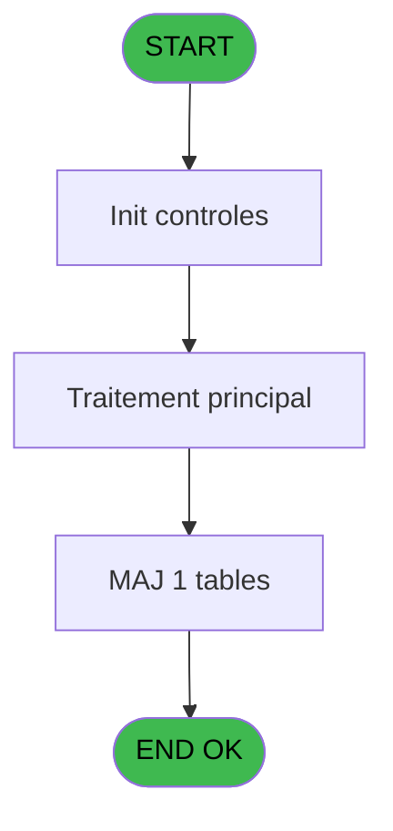

# REF IDE 640 - GET customers X profile

> **Analyse**: Phases 1-4 2026-02-03 13:20 -> 13:21 (18s) | Assemblage 13:21
> **Pipeline**: V7.2 Enrichi
> **Structure**: 4 onglets (Resume | Ecrans | Donnees | Connexions)

<!-- TAB:Resume -->

## 1. FICHE D'IDENTITE

| Attribut | Valeur |
|----------|--------|
| Projet | REF |
| IDE Position | 640 |
| Nom Programme | GET customers X profile |
| Fichier source | `Prg_640.xml` |
| Dossier IDE | General |
| Taches | 3 (0 ecrans visibles) |
| Tables modifiees | 1 |
| Programmes appeles | 0 |

## 2. DESCRIPTION FONCTIONNELLE

**GET customers X profile** assure la gestion complete de ce processus, accessible depuis [Pilotage API CM Stay (IDE 639)](REF-IDE-639.md).

Le flux de traitement s'organise en **1 blocs fonctionnels** :

- **Traitement** (3 taches) : traitements metier divers

**Donnees modifiees** : 1 tables en ecriture (Table_950).

## 3. BLOCS FONCTIONNELS

### 3.1 Traitement (3 taches)

Traitements internes.

---

#### 640 - GET cutomer_profile

**Role** : Consultation/chargement : GET cutomer_profile.

---

#### 640.1 - (sans nom)

**Role** : Traitement interne.

---

#### 640.1.1 - (sans nom)

**Role** : Traitement interne.

## 5. REGLES METIER

*(Aucune regle metier identifiee)*

## 6. CONTEXTE

- **Appele par**: [Pilotage API CM Stay (IDE 639)](REF-IDE-639.md)
- **Appelle**: 0 programmes | **Tables**: 1 (W:1 R:0 L:0) | **Taches**: 3 | **Expressions**: 36

<!-- TAB:Ecrans -->

## 8. ECRANS

*(Programme sans ecran visible)*

## 9. NAVIGATION

### 9.3 Structure hierarchique (3 taches)

| Position | Tache | Type | Dimensions | Bloc |
|----------|-------|------|------------|------|
| **640.1** | [**GET cutomer_profile** (640)](#t1) | - | - | Traitement |
| 640.1.1 | [(sans nom) (640.1)](#t2) | - | - | |
| 640.1.2 | [(sans nom) (640.1.1)](#t3) | - | - | |

### 9.4 Algorigramme

> **Legende**: Vert = START/END OK | Rouge = END KO | Bleu = Decisions
> *Algorigramme auto-genere. Utiliser `/algorigramme` pour une synthese metier detaillee.*

<!-- TAB:Donnees -->

## 10. TABLES

### Tables utilisees (1)

| ID | Nom | Description | Type | R | W | L | Usages |
|----|-----|-------------|------|---|---|---|--------|
| 950 | Table_950 |  | MEM |   | **W** |   | 1 |

### Colonnes par table (0 / 1 tables avec colonnes identifiees)

Table 950 - Table_950 (**W**) - 1 usages

*Table utilisee uniquement en Link ou aucune colonne Real identifiee dans le DataView.*

## 11. VARIABLES

### 11.1 Parametres entrants (2)

Variables recues du programme appelant ([Pilotage API CM Stay (IDE 639)](REF-IDE-639.md)).

| Lettre | Nom | Type | Usage dans |
|--------|-----|------|-----------|
| A | p. customer_id | Numeric | 1x parametre entrant |
| B | p. Json IN | Blob | - |

### 11.2 Variables de session (34)

Variables persistantes pendant toute la session.

| Lettre | Nom | Type | Usage dans |
|--------|-----|------|-----------|
| C | v. XML data | Blob | - |
| D | v.civility | Unicode | - |
| E | v.unicode_civility | Unicode | - |
| F | v.first_name | Unicode | - |
| G | v.unicode_first_name | Unicode | - |
| H | v.last_name | Unicode | - |
| I | v.unicode_last_name | Unicode | - |
| J | v.health_pass_id | Unicode | - |
| K | v.customer_type | Unicode | - |
| L | v.customer_status | Unicode | - |
| M | v.birthday | Date | - |
| N | v.birthdate | Date | - |
| O | v.birth_country_code | Unicode | - |
| P | v.language_code | Unicode | - |
| Q | v.personnal_data_usage_allowed | Logical | - |
| R | v.blacklisted | Logical | - |
| S | v.loyalty_program_status | Unicode | - |
| T | v.loyalty_program_points | Numeric | - |
| U | v.adress_number | Unicode | - |
| V | v.adress_street | Unicode | - |
| W | v.adress_add_on | Unicode | - |
| X | v.adress_town | Unicode | - |
| Y | v.adress_city | Unicode | - |
| Z | v.adress_zip_code | Unicode | - |
| BA | v.adress_state_or_district | Unicode | - |
| BB | v.adress_country | Unicode | - |
| BC | v.adress_country_code | Unicode | - |
| BD | v.adress_additional_informatio1 | Unicode | - |
| BE | v.adress_addition_information_2 | Unicode | - |
| BF | v.identity_number | Unicode | - |
| BG | v.identity_type | Unicode | - |
| BH | v.id_phone | Unicode | - |
| BI | v.type | Unicode | - |
| BJ | v.filiation_number | Numeric | - |

Toutes les 36 variables (liste complete)

| Cat | Lettre | Nom Variable | Type |
|-----|--------|--------------|------|
| P0 | **A** | p. customer_id | Numeric |
| P0 | **B** | p. Json IN | Blob |
| V. | **C** | v. XML data | Blob |
| V. | **D** | v.civility | Unicode |
| V. | **E** | v.unicode_civility | Unicode |
| V. | **F** | v.first_name | Unicode |
| V. | **G** | v.unicode_first_name | Unicode |
| V. | **H** | v.last_name | Unicode |
| V. | **I** | v.unicode_last_name | Unicode |
| V. | **J** | v.health_pass_id | Unicode |
| V. | **K** | v.customer_type | Unicode |
| V. | **L** | v.customer_status | Unicode |
| V. | **M** | v.birthday | Date |
| V. | **N** | v.birthdate | Date |
| V. | **O** | v.birth_country_code | Unicode |
| V. | **P** | v.language_code | Unicode |
| V. | **Q** | v.personnal_data_usage_allowed | Logical |
| V. | **R** | v.blacklisted | Logical |
| V. | **S** | v.loyalty_program_status | Unicode |
| V. | **T** | v.loyalty_program_points | Numeric |
| V. | **U** | v.adress_number | Unicode |
| V. | **V** | v.adress_street | Unicode |
| V. | **W** | v.adress_add_on | Unicode |
| V. | **X** | v.adress_town | Unicode |
| V. | **Y** | v.adress_city | Unicode |
| V. | **Z** | v.adress_zip_code | Unicode |
| V. | **BA** | v.adress_state_or_district | Unicode |
| V. | **BB** | v.adress_country | Unicode |
| V. | **BC** | v.adress_country_code | Unicode |
| V. | **BD** | v.adress_additional_informatio1 | Unicode |
| V. | **BE** | v.adress_addition_information_2 | Unicode |
| V. | **BF** | v.identity_number | Unicode |
| V. | **BG** | v.identity_type | Unicode |
| V. | **BH** | v.id_phone | Unicode |
| V. | **BI** | v.type | Unicode |
| V. | **BJ** | v.filiation_number | Numeric |

## 12. EXPRESSIONS

**36 / 36 expressions decodees (100%)**

### 12.1 Repartition par type

| Type | Expressions | Regles |
|------|-------------|--------|
| CALCULATION | 30 | 0 |
| CONDITION | 2 | 0 |
| DATE | 2 | 0 |
| CONCATENATION | 1 | 0 |
| OTHER | 1 | 0 |

### 12.2 Expressions cles par type

#### CALCULATION (30 expressions)

| Type | IDE | Expression | Regle |
|------|-----|------------|-------|
| CALCULATION | 25 | `XMLGet(0,1,'/root/adress/town')` | - |
| CALCULATION | 26 | `XMLGet(0,1,'/root/adress/city')` | - |
| CALCULATION | 27 | `XMLGet(0,1,'/root/adress/zip_code')` | - |
| CALCULATION | 24 | `XMLGet(0,1,'/root/adress_add_on/')` | - |
| CALCULATION | 21 | `Val(XMLGet(0,1,'/root/loyalty_program/points'),'10')` | - |
| ... | | *+25 autres* | |

#### CONDITION (2 expressions)

| Type | IDE | Expression | Regle |
|------|-----|------------|-------|
| CONDITION | 19 | `XMLGet(0,1,'/root/blacklisted')='true'` | - |
| CONDITION | 18 | `XMLGet(0,1,'/root/personnal_data_usage_allowed')='true'` | - |

#### DATE (2 expressions)

| Type | IDE | Expression | Regle |
|------|-----|------------|-------|
| DATE | 15 | `DVal(XMLGet(0,1,'/root/birthdate'),'YYYYMMDD')` | - |
| DATE | 14 | `DVal(XMLGet(0,1,'/root/birthday'),'YYYYMMDD')` | - |

#### CONCATENATION (1 expressions)

| Type | IDE | Expression | Regle |
|------|-----|------------|-------|
| CONCATENATION | 1 | `'<?xml version="1.0"?>' &ASCIIChr(13)& ASCIIChr(10)&DotNet.System.Xml.Linq.XElement.Load(DotNet.System.Runtime.Serialization.Json.JsonReaderWriterFactory.CreateJsonReader(p. customer_id [A],DotNet.System.Xml.XmlDictionaryReaderQuotas())).ToString()` | - |

#### OTHER (1 expressions)

| Type | IDE | Expression | Regle |
|------|-----|------------|-------|
| OTHER | 36 | `{1,26}` | - |

### 12.3 Toutes les expressions (36)

Voir les 36 expressions

#### CALCULATION (30)

| IDE | Expression Decodee |
|-----|-------------------|
| 2 | `XMLGet(0,1,'/root/email')` |
| 3 | `XMLGet(0,1,'/root/gm_number')` |
| 4 | `XMLGet(0,1,'/root/gender')` |
| 5 | `XMLGet(0,1,'/root/civility')` |
| 6 | `XMLGet(0,1,'/root/unicode_civility')` |
| 7 | `XMLGet(0,1,'/root/first_name')` |
| 8 | `XMLGet(0,1,'/root/unicode_first_name')` |
| 9 | `XMLGet(0,1,'/root/last_name')` |
| 10 | `XMLGet(0,1,'/root/unicode_last_name')` |
| 11 | `XMLGet(0,1,'/root/health_pass_id')` |
| 12 | `XMLGet(0,1,'/root/customer_type')` |
| 13 | `XMLGet(0,1,'/root/customer_status')` |
| 16 | `XMLGet(0,1,'/root/birth_country_code')` |
| 17 | `XMLGet(0,1,'/root/language_code')` |
| 20 | `XMLGet(0,1,'/root/loyalty_program/status')` |
| 21 | `Val(XMLGet(0,1,'/root/loyalty_program/points'),'10')` |
| 22 | `XMLGet(0,1,'/root/adress/number')` |
| 23 | `XMLGet(0,1,'/root/adress/street')` |
| 24 | `XMLGet(0,1,'/root/adress_add_on/')` |
| 25 | `XMLGet(0,1,'/root/adress/town')` |
| 26 | `XMLGet(0,1,'/root/adress/city')` |
| 27 | `XMLGet(0,1,'/root/adress/zip_code')` |
| 28 | `XMLGet(0,1,'/root/adress/state_or_district')` |
| 29 | `XMLGet(0,1,'/root/adress/country')` |
| 30 | `XMLGet(0,1,'/root/adress/country_code')` |
| 31 | `XMLGet(0,1,'/root/adress/additional_information_1')` |
| 32 | `XMLGet(0,1,'/root/adress/additional_information_2')` |
| 33 | `XMLGet(0,1,'/root/identity/number')` |
| 34 | `XMLGet(0,1,'/root/identity/type')` |
| 35 | `Val(XMLGet(0,1,'/root/filiation_number'),'10')` |

#### CONDITION (2)

| IDE | Expression Decodee |
|-----|-------------------|
| 18 | `XMLGet(0,1,'/root/personnal_data_usage_allowed')='true'` |
| 19 | `XMLGet(0,1,'/root/blacklisted')='true'` |

#### DATE (2)

| IDE | Expression Decodee |
|-----|-------------------|
| 14 | `DVal(XMLGet(0,1,'/root/birthday'),'YYYYMMDD')` |
| 15 | `DVal(XMLGet(0,1,'/root/birthdate'),'YYYYMMDD')` |

#### CONCATENATION (1)

| IDE | Expression Decodee |
|-----|-------------------|
| 1 | `'<?xml version="1.0"?>' &ASCIIChr(13)& ASCIIChr(10)&DotNet.System.Xml.Linq.XElement.Load(DotNet.System.Runtime.Serialization.Json.JsonReaderWriterFactory.CreateJsonReader(p. customer_id [A],DotNet.System.Xml.XmlDictionaryReaderQuotas())).ToString()` |

#### OTHER (1)

| IDE | Expression Decodee |
|-----|-------------------|
| 36 | `{1,26}` |

<!-- TAB:Connexions -->

## 13. GRAPHE D'APPELS

### 13.1 Chaine depuis Main (Callers)

Main -> ... -> [Pilotage API CM Stay (IDE 639)](REF-IDE-639.md) -> **GET customers X profile (IDE 640)**

### 13.2 Callers

| IDE | Nom Programme | Nb Appels |
|-----|---------------|-----------|
| [639](REF-IDE-639.md) | Pilotage API CM Stay | 1 |

### 13.3 Callees (programmes appeles)

### 13.4 Detail Callees avec contexte

| IDE | Nom Programme | Appels | Contexte |
|-----|---------------|--------|----------|
| - | (aucun) | - | - |

## 14. RECOMMANDATIONS MIGRATION

### 14.1 Profil du programme

| Metrique | Valeur | Impact migration |
|----------|--------|-----------------|
| Lignes de logique | 125 | Programme compact |
| Expressions | 36 | Peu de logique |
| Tables WRITE | 1 | Impact faible |
| Sous-programmes | 0 | Peu de dependances |
| Ecrans visibles | 0 | Ecran unique ou traitement batch |
| Code desactive | 0% (0 / 125) | Code sain |
| Regles metier | 0 | Pas de regle identifiee |

### 14.2 Plan de migration par bloc

#### Traitement (3 taches: 0 ecran, 3 traitements)

- **Strategie** : 3 service(s) backend injectable(s) (Domain Services).
- Decomposer les taches en services unitaires testables.

### 14.3 Dependances critiques

| Dependance | Type | Appels | Impact |
|------------|------|--------|--------|
| Table_950 | Table WRITE (Memory) | 1x | Schema + repository |

---
*Spec DETAILED generee par Pipeline V7.2 - 2026-02-03 13:21*
