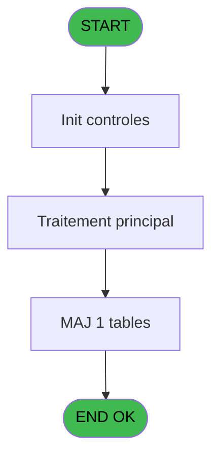
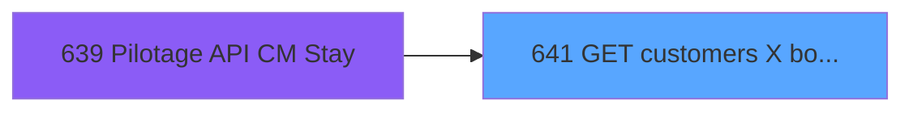

# REF IDE 641 - GET customers X booking Y stay

> **Analyse**: Phases 1-4 2026-02-03 13:21 -> 13:21 (17s) | Assemblage 13:21
> **Pipeline**: V7.2 Enrichi
> **Structure**: 4 onglets (Resume | Ecrans | Donnees | Connexions)

<!-- TAB:Resume -->

## 1. FICHE D'IDENTITE

| Attribut | Valeur |
|----------|--------|
| Projet | REF |
| IDE Position | 641 |
| Nom Programme | GET customers X booking Y stay |
| Fichier source | `Prg_641.xml` |
| Dossier IDE | General |
| Taches | 3 (0 ecrans visibles) |
| Tables modifiees | 1 |
| Programmes appeles | 0 |

## 2. DESCRIPTION FONCTIONNELLE

**GET customers X booking Y stay** assure la gestion complete de ce processus, accessible depuis [Pilotage API CM Stay (IDE 639)](REF-IDE-639.md).

Le flux de traitement s'organise en **1 blocs fonctionnels** :

- **Traitement** (3 taches) : traitements metier divers

**Donnees modifiees** : 1 tables en ecriture (Table_953).

## 3. BLOCS FONCTIONNELS

### 3.1 Traitement (3 taches)

Traitements internes.

---

#### 641 - GET customers X

**Role** : Consultation/chargement : GET customers X.

---

#### 641.1 - (sans nom)

**Role** : Traitement interne.

---

#### 641.1.1 - (sans nom)

**Role** : Traitement interne.

## 5. REGLES METIER

*(Aucune regle metier identifiee)*

## 6. CONTEXTE

- **Appele par**: [Pilotage API CM Stay (IDE 639)](REF-IDE-639.md)
- **Appelle**: 0 programmes | **Tables**: 1 (W:1 R:0 L:0) | **Taches**: 3 | **Expressions**: 15

<!-- TAB:Ecrans -->

## 8. ECRANS

*(Programme sans ecran visible)*

## 9. NAVIGATION

### 9.3 Structure hierarchique (3 taches)

| Position | Tache | Type | Dimensions | Bloc |
|----------|-------|------|------------|------|
| **641.1** | [**GET customers X** (641)](#t1) | - | - | Traitement |
| 641.1.1 | [(sans nom) (641.1)](#t2) | - | - | |
| 641.1.2 | [(sans nom) (641.1.1)](#t3) | - | - | |

### 9.4 Algorigramme

> **Legende**: Vert = START/END OK | Rouge = END KO | Bleu = Decisions
> *Algorigramme auto-genere. Utiliser `/algorigramme` pour une synthese metier detaillee.*

<!-- TAB:Donnees -->

## 10. TABLES

### Tables utilisees (1)

| ID | Nom | Description | Type | R | W | L | Usages |
|----|-----|-------------|------|---|---|---|--------|
| 953 | Table_953 |  | MEM |   | **W** |   | 1 |

### Colonnes par table (0 / 1 tables avec colonnes identifiees)

Table 953 - Table_953 (**W**) - 1 usages

*Table utilisee uniquement en Link ou aucune colonne Real identifiee dans le DataView.*

## 11. VARIABLES

### 11.1 Parametres entrants (3)

Variables recues du programme appelant ([Pilotage API CM Stay (IDE 639)](REF-IDE-639.md)).

| Lettre | Nom | Type | Usage dans |
|--------|-----|------|-----------|
| A | p. customer_id | Numeric | 1x parametre entrant |
| B | p. booking_id | Numeric | - |
| C | p. Json IN | Blob | - |

### 11.2 Variables de session (1)

Variables persistantes pendant toute la session.

| Lettre | Nom | Type | Usage dans |
|--------|-----|------|-----------|
| D | v. XML data | Blob | - |

### 11.3 Autres (9)

Variables diverses.

| Lettre | Nom | Type | Usage dans |
|--------|-----|------|-----------|
| E | payment_check_out_status | Unicode | - |
| F | payment_ckeck_out_activated | Logical | - |
| G | gm_feedback_available | Unicode | - |
| H | easy_arrival_status | Unicode | - |
| I | esf_widget_catalog_code | Unicode | - |
| J | esf_widget_station_code | Unicode | - |
| K | transfer_service_status | Unicode | - |
| L | transfer_traveling_information_ | Unicode | - |
| M | room_selection_status | Unicode | - |

## 12. EXPRESSIONS

**15 / 15 expressions decodees (100%)**

### 12.1 Repartition par type

| Type | Expressions | Regles |
|------|-------------|--------|
| CALCULATION | 10 | 0 |
| CONDITION | 2 | 0 |
| CONCATENATION | 1 | 0 |
| OTHER | 2 | 0 |

### 12.2 Expressions cles par type

#### CALCULATION (10 expressions)

| Type | IDE | Expression | Regle |
|------|-----|------------|-------|
| CALCULATION | 10 | `XMLGet(0,1,'/root/esf_widget/catalog_code')` | - |
| CALCULATION | 9 | `XMLGet(0,1,'/root/easy_arrival/status')` | - |
| CALCULATION | 11 | `XMLGet(0,1,'/root/esf_widget/station_code')` | - |
| CALCULATION | 13 | `XMLGet(0,1,'/root/transfer/traveling_information_status')` | - |
| CALCULATION | 12 | `XMLGet(0,1,'/root/transfer/service_status')` | - |
| ... | | *+5 autres* | |

#### CONDITION (2 expressions)

| Type | IDE | Expression | Regle |
|------|-----|------------|-------|
| CONDITION | 7 | `XMLGet(0,1,'/root/payment_check_out/activated')='true'` | - |
| CONDITION | 4 | `XMLGet(0,1,'/root/credit_card_check_in/activated')='true'` | - |

#### CONCATENATION (1 expressions)

| Type | IDE | Expression | Regle |
|------|-----|------------|-------|
| CONCATENATION | 1 | `'<?xml version="1.0"?>' &ASCIIChr(13)& ASCIIChr(10)&DotNet.System.Xml.Linq.XElement.Load(DotNet.System.Runtime.Serialization.Json.JsonReaderWriterFactory.CreateJsonReader(p. customer_id [A],DotNet.System.Xml.XmlDictionaryReaderQuotas())).ToString()` | - |

#### OTHER (2 expressions)

| Type | IDE | Expression | Regle |
|------|-----|------------|-------|
| OTHER | 15 | `{1,2}` | - |
| OTHER | 14 | `{1,1}` | - |

<!-- TAB:Connexions -->

## 13. GRAPHE D'APPELS

### 13.1 Chaine depuis Main (Callers)

Main -> ... -> [Pilotage API CM Stay (IDE 639)](REF-IDE-639.md) -> **GET customers X booking Y stay (IDE 641)**

### 13.2 Callers

| IDE | Nom Programme | Nb Appels |
|-----|---------------|-----------|
| [639](REF-IDE-639.md) | Pilotage API CM Stay | 1 |

### 13.3 Callees (programmes appeles)

### 13.4 Detail Callees avec contexte

| IDE | Nom Programme | Appels | Contexte |
|-----|---------------|--------|----------|
| - | (aucun) | - | - |

## 14. RECOMMANDATIONS MIGRATION

### 14.1 Profil du programme

| Metrique | Valeur | Impact migration |
|----------|--------|-----------------|
| Lignes de logique | 64 | Programme compact |
| Expressions | 15 | Peu de logique |
| Tables WRITE | 1 | Impact faible |
| Sous-programmes | 0 | Peu de dependances |
| Ecrans visibles | 0 | Ecran unique ou traitement batch |
| Code desactive | 0% (0 / 64) | Code sain |
| Regles metier | 0 | Pas de regle identifiee |

### 14.2 Plan de migration par bloc

#### Traitement (3 taches: 0 ecran, 3 traitements)

- **Strategie** : 3 service(s) backend injectable(s) (Domain Services).
- Decomposer les taches en services unitaires testables.

### 14.3 Dependances critiques

| Dependance | Type | Appels | Impact |
|------------|------|--------|--------|
| Table_953 | Table WRITE (Memory) | 1x | Schema + repository |

---
*Spec DETAILED generee par Pipeline V7.2 - 2026-02-03 13:21*
