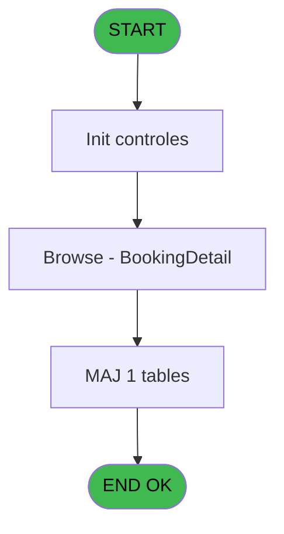
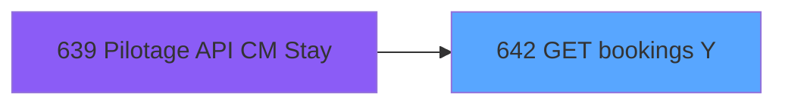

# REF IDE 642 - GET bookings Y

> **Analyse**: Phases 1-4 2026-02-03 13:21 -> 13:21 (17s) | Assemblage 13:21
> **Pipeline**: V7.2 Enrichi
> **Structure**: 4 onglets (Resume | Ecrans | Donnees | Connexions)

<!-- TAB:Resume -->

## 1. FICHE D'IDENTITE

| Attribut | Valeur |
|----------|--------|
| Projet | REF |
| IDE Position | 642 |
| Nom Programme | GET bookings Y |
| Fichier source | `Prg_642.xml` |
| Dossier IDE | General |
| Taches | 4 (1 ecrans visibles) |
| Tables modifiees | 1 |
| Programmes appeles | 0 |

## 2. DESCRIPTION FONCTIONNELLE

**GET bookings Y** assure la gestion complete de ce processus, accessible depuis [Pilotage API CM Stay (IDE 639)](REF-IDE-639.md).

Le flux de traitement s'organise en **1 blocs fonctionnels** :

- **Traitement** (4 taches) : traitements metier divers

**Donnees modifiees** : 1 tables en ecriture (Table_949).

Detail : phases du traitement

#### Phase 1 : Traitement (4 taches)

- **642** - GET bookings Y
- **642.1** - (sans nom)
- **642.1.1** - (sans nom)
- **642.2** - Browse - BookingDetail **[[ECRAN]](#ecran-t5)**

#### Tables impactees

| Table | Operations | Role metier |
|-------|-----------|-------------|
| Table_949 | **W** (2 usages) |  |

## 3. BLOCS FONCTIONNELS

### 3.1 Traitement (4 taches)

Traitements internes.

---

#### 642 - GET bookings Y

**Role** : Consultation/chargement : GET bookings Y.

3 sous-taches directes

| Tache | Nom | Bloc |
|-------|-----|------|
| [642.1](#t2) | (sans nom) | Traitement |
| [642.1.1](#t4) | (sans nom) | Traitement |
| [642.2](#t5) | Browse - BookingDetail **[[ECRAN]](#ecran-t5)** | Traitement |

---

#### 642.1 - (sans nom)

**Role** : Traitement interne.

---

#### 642.1.1 - (sans nom)

**Role** : Traitement interne.

---

#### 642.2 - Browse - BookingDetail [[ECRAN]](#ecran-t5)

**Role** : Traitement : Browse - BookingDetail.
**Ecran** : 2797 x 195 DLU | [Voir mockup](#ecran-t5)

## 5. REGLES METIER

*(Aucune regle metier identifiee)*

## 6. CONTEXTE

- **Appele par**: [Pilotage API CM Stay (IDE 639)](REF-IDE-639.md)
- **Appelle**: 0 programmes | **Tables**: 1 (W:1 R:0 L:0) | **Taches**: 4 | **Expressions**: 26

<!-- TAB:Ecrans -->

## 8. ECRANS

### 8.1 Forms visibles (1 / 4)

| # | Position | Tache | Nom | Type | Largeur | Hauteur | Bloc |
|---|----------|-------|-----|------|---------|---------|------|
| 1 | 642.2 | 642.2 | Browse - BookingDetail | Type0 | 2797 | 195 | Traitement |

### 8.2 Mockups Ecrans

---

#### 642.2 - Browse - BookingDetail
**Tache** : [642.2](#t5) | **Type** : Type0 | **Dimensions** : 2797 x 195 DLU
**Bloc** : Traitement | **Titre IDE** : Browse - BookingDetail

<!-- FORM-DATA:
{
    "width":  2797,
    "vFactor":  8,
    "type":  "Type0",
    "hFactor":  4,
    "controls":  [
                     {
                         "x":  8,
                         "type":  "table",
                         "var":  "",
                         "name":  "",
                         "titleH":  12,
                         "color":  "",
                         "w":  2775,
                         "y":  8,
                         "fmt":  "",
                         "parent":  null,
                         "text":  "",
                         "rowH":  13,
                         "h":  182,
                         "cols":  [
                                      {
                                          "title":  "booking_id",
                                          "layer":  1,
                                          "w":  53
                                      },
                                      {
                                          "title":  "creation_date",
                                          "layer":  2,
                                          "w":  68
                                      },
                                      {
                                          "title":  "departure_date",
                                          "layer":  3,
                                          "w":  68
                                      },
                                      {
                                          "title":  "return_date",
                                          "layer":  4,
                                          "w":  68
                                      },
                                      {
                                          "title":  "duration",
                                          "layer":  5,
                                          "w":  34
                                      },
                                      {
                                          "title":  "booking_status",
                                          "layer":  6,
                                          "w":  122
                                      },
                                      {
                                          "title":  "locale",
                                          "layer":  7,
                                          "w":  38
                                      },
                                      {
                                          "title":  "multiple_sale_contrats",
                                          "layer":  8,
                                          "w":  86
                                      },
                                      {
                                          "title":  "last_modified_date",
                                          "layer":  9,
                                          "w":  74
                                      },
                                      {
                                          "title":  "last_modified_time",
                                          "layer":  10,
                                          "w":  72
                                      },
                                      {
                                          "title":  "vendor_sold_by",
                                          "layer":  11,
                                          "w":  290
                                      },
                                      {
                                          "title":  "vendor_name",
                                          "layer":  12,
                                          "w":  290
                                      },
                                      {
                                          "title":  "vendor_contact",
                                          "layer":  13,
                                          "w":  290
                                      },
                                      {
                                          "title":  "vendor_type",
                                          "layer":  14,
                                          "w":  290
                                      },
                                      {
                                          "title":  "attendees_adults_count",
                                          "layer":  15,
                                          "w":  94
                                      },
                                      {
                                          "title":  "attendees_children_count",
                                          "layer":  16,
                                          "w":  102
                                      },
                                      {
                                          "title":  "total_price_total",
                                          "layer":  17,
                                          "w":  92
                                      },
                                      {
                                          "title":  "total_price_currency",
                                          "layer":  18,
                                          "w":  290
                                      },
                                      {
                                          "title":  "option_durability_expiration_D",
                                          "layer":  19,
                                          "w":  116
                                      },
                                      {
                                          "title":  "option_durability_expiration_T",
                                          "layer":  20,
                                          "w":  115
                                      },
                                      {
                                          "title":  "option_durability_is_reliable",
                                          "layer":  21,
                                          "w":  106
                                      }
                                  ],
                         "rows":  21
                     },
                     {
                         "x":  12,
                         "type":  "edit",
                         "var":  "",
                         "y":  23,
                         "w":  46,
                         "fmt":  "",
                         "name":  "booking_id",
                         "h":  10,
                         "color":  "",
                         "text":  "",
                         "parent":  1
                     },
                     {
                         "x":  65,
                         "type":  "edit",
                         "var":  "",
                         "y":  23,
                         "w":  61,
                         "fmt":  "",
                         "name":  "creation_date",
                         "h":  10,
                         "color":  "",
                         "text":  "",
                         "parent":  1
                     },
                     {
                         "x":  133,
                         "type":  "edit",
                         "var":  "",
                         "y":  23,
                         "w":  61,
                         "fmt":  "",
                         "name":  "departure_date",
                         "h":  10,
                         "color":  "",
                         "text":  "",
                         "parent":  1
                     },
                     {
                         "x":  201,
                         "type":  "edit",
                         "var":  "",
                         "y":  23,
                         "w":  61,
                         "fmt":  "",
                         "name":  "return_date",
                         "h":  10,
                         "color":  "",
                         "text":  "",
                         "parent":  1
                     },
                     {
                         "x":  269,
                         "type":  "edit",
                         "var":  "",
                         "y":  23,
                         "w":  22,
                         "fmt":  "",
                         "name":  "duration",
                         "h":  10,
                         "color":  "",
                         "text":  "",
                         "parent":  1
                     },
                     {
                         "x":  303,
                         "type":  "edit",
                         "var":  "",
                         "y":  23,
                         "w":  115,
                         "fmt":  "",
                         "name":  "booking_status",
                         "h":  10,
                         "color":  "",
                         "text":  "",
                         "parent":  1
                     },
                     {
                         "x":  425,
                         "type":  "edit",
                         "var":  "",
                         "y":  23,
                         "w":  31,
                         "fmt":  "",
                         "name":  "locale",
                         "h":  10,
                         "color":  "",
                         "text":  "",
                         "parent":  1
                     },
                     {
                         "x":  463,
                         "type":  "edit",
                         "var":  "",
                         "y":  23,
                         "w":  31,
                         "fmt":  "",
                         "name":  "multiple_sale_contrats",
                         "h":  10,
                         "color":  "",
                         "text":  "",
                         "parent":  1
                     },
                     {
                         "x":  549,
                         "type":  "edit",
                         "var":  "",
                         "y":  23,
                         "w":  61,
                         "fmt":  "",
                         "name":  "last_modified_date",
                         "h":  10,
                         "color":  "",
                         "text":  "",
                         "parent":  1
                     },
                     {
                         "x":  623,
                         "type":  "edit",
                         "var":  "",
                         "y":  23,
                         "w":  46,
                         "fmt":  "",
                         "name":  "last_modified_time",
                         "h":  10,
                         "color":  "",
                         "text":  "",
                         "parent":  1
                     },
                     {
                         "x":  695,
                         "type":  "edit",
                         "var":  "",
                         "y":  23,
                         "w":  283,
                         "fmt":  "",
                         "name":  "vendor_sold_by",
                         "h":  10,
                         "color":  "",
                         "text":  "",
                         "parent":  1
                     },
                     {
                         "x":  985,
                         "type":  "edit",
                         "var":  "",
                         "y":  23,
                         "w":  283,
                         "fmt":  "",
                         "name":  "vendor_name",
                         "h":  10,
                         "color":  "",
                         "text":  "",
                         "parent":  1
                     },
                     {
                         "x":  1275,
                         "type":  "edit",
                         "var":  "",
                         "y":  23,
                         "w":  283,
                         "fmt":  "",
                         "name":  "vendor_contact",
                         "h":  10,
                         "color":  "",
                         "text":  "",
                         "parent":  1
                     },
                     {
                         "x":  1565,
                         "type":  "edit",
                         "var":  "",
                         "y":  23,
                         "w":  283,
                         "fmt":  "",
                         "name":  "vendor_type",
                         "h":  10,
                         "color":  "",
                         "text":  "",
                         "parent":  1
                     },
                     {
                         "x":  1855,
                         "type":  "edit",
                         "var":  "",
                         "y":  23,
                         "w":  22,
                         "fmt":  "",
                         "name":  "attendees_adults_count",
                         "h":  10,
                         "color":  "",
                         "text":  "",
                         "parent":  1
                     },
                     {
                         "x":  1949,
                         "type":  "edit",
                         "var":  "",
                         "y":  23,
                         "w":  22,
                         "fmt":  "",
                         "name":  "attendees_children_count",
                         "h":  10,
                         "color":  "",
                         "text":  "",
                         "parent":  1
                     },
                     {
                         "x":  2051,
                         "type":  "edit",
                         "var":  "",
                         "y":  23,
                         "w":  85,
                         "fmt":  "",
                         "name":  "total_price_total",
                         "h":  10,
                         "color":  "",
                         "text":  "",
                         "parent":  1
                     },
                     {
                         "x":  2143,
                         "type":  "edit",
                         "var":  "",
                         "y":  23,
                         "w":  283,
                         "fmt":  "",
                         "name":  "total_price_currency",
                         "h":  10,
                         "color":  "",
                         "text":  "",
                         "parent":  1
                     },
                     {
                         "x":  2433,
                         "type":  "edit",
                         "var":  "",
                         "y":  23,
                         "w":  61,
                         "fmt":  "",
                         "name":  "option_durability_expiration_D",
                         "h":  10,
                         "color":  "",
                         "text":  "",
                         "parent":  1
                     },
                     {
                         "x":  2549,
                         "type":  "edit",
                         "var":  "",
                         "y":  23,
                         "w":  46,
                         "fmt":  "",
                         "name":  "option_durability_expiration_T",
                         "h":  10,
                         "color":  "",
                         "text":  "",
                         "parent":  1
                     },
                     {
                         "x":  2664,
                         "type":  "edit",
                         "var":  "",
                         "y":  23,
                         "w":  31,
                         "fmt":  "",
                         "name":  "option_durability_is_reliable",
                         "h":  10,
                         "color":  "",
                         "text":  "",
                         "parent":  1
                     }
                 ],
    "taskId":  "642.2",
    "height":  195
}
-->

<strong>Champs : 21 champs</strong>

| Pos (x,y) | Nom | Variable | Type |
|-----------|-----|----------|------|
| 12,23 | booking_id | - | edit |
| 65,23 | creation_date | - | edit |
| 133,23 | departure_date | - | edit |
| 201,23 | return_date | - | edit |
| 269,23 | duration | - | edit |
| 303,23 | booking_status | - | edit |
| 425,23 | locale | - | edit |
| 463,23 | multiple_sale_contrats | - | edit |
| 549,23 | last_modified_date | - | edit |
| 623,23 | last_modified_time | - | edit |
| 695,23 | vendor_sold_by | - | edit |
| 985,23 | vendor_name | - | edit |
| 1275,23 | vendor_contact | - | edit |
| 1565,23 | vendor_type | - | edit |
| 1855,23 | attendees_adults_count | - | edit |
| 1949,23 | attendees_children_count | - | edit |
| 2051,23 | total_price_total | - | edit |
| 2143,23 | total_price_currency | - | edit |
| 2433,23 | option_durability_expiration_D | - | edit |
| 2549,23 | option_durability_expiration_T | - | edit |
| 2664,23 | option_durability_is_reliable | - | edit |

## 9. NAVIGATION

Ecran unique: **Browse - BookingDetail**

### 9.3 Structure hierarchique (4 taches)

| Position | Tache | Type | Dimensions | Bloc |
|----------|-------|------|------------|------|
| **642.1** | [**GET bookings Y** (642)](#t1) | - | - | Traitement |
| 642.1.1 | [(sans nom) (642.1)](#t2) | - | - | |
| 642.1.2 | [(sans nom) (642.1.1)](#t4) | - | - | |
| 642.1.3 | [Browse - BookingDetail (642.2)](#t5) [mockup](#ecran-t5) | - | 2797x195 | |

### 9.4 Algorigramme

> **Legende**: Vert = START/END OK | Rouge = END KO | Bleu = Decisions
> *Algorigramme auto-genere. Utiliser `/algorigramme` pour une synthese metier detaillee.*

<!-- TAB:Donnees -->

## 10. TABLES

### Tables utilisees (1)

| ID | Nom | Description | Type | R | W | L | Usages |
|----|-----|-------------|------|---|---|---|--------|
| 949 | Table_949 |  | MEM |   | **W** |   | 2 |

### Colonnes par table (0 / 1 tables avec colonnes identifiees)

Table 949 - Table_949 (**W**) - 2 usages

*Table utilisee uniquement en Link ou aucune colonne Real identifiee dans le DataView.*

## 11. VARIABLES

### 11.1 Parametres entrants (3)

Variables recues du programme appelant ([Pilotage API CM Stay (IDE 639)](REF-IDE-639.md)).

| Lettre | Nom | Type | Usage dans |
|--------|-----|------|-----------|
| A | p.i booking_id | Numeric | 1x parametre entrant |
| B | p.i Json IN | Blob | - |
| C | p.o attendees number | Unicode | - |

### 11.2 Variables de session (1)

Variables persistantes pendant toute la session.

| Lettre | Nom | Type | Usage dans |
|--------|-----|------|-----------|
| D | v. XML data | Blob | - |

### 11.3 Autres (18)

Variables diverses.

| Lettre | Nom | Type | Usage dans |
|--------|-----|------|-----------|
| E | duration | Numeric | 1x refs |
| F | booking_status | Unicode | 1x refs |
| G | locale | Unicode | 1x refs |
| H | multiple_sale_contrats | Logical | 1x refs |
| I | last_modified_date | Date | 2x refs |
| J | last_modified_time | Time | - |
| K | vendor_sold_by | Unicode | - |
| L | vendor_name | Unicode | - |
| M | vendor_contact | Unicode | - |
| N | vendor_type | Unicode | - |
| O | attendees_adults_count | Numeric | 1x refs |
| P | attendees_children_count | Numeric | 1x refs |
| Q | total_price_total | Numeric | - |
| R | total_price_currency | Unicode | - |
| S | option_durability_experation_D | Date | - |
| T | option_durability_expiration_T | Time | - |
| U | option_durability_is_reliable | Logical | - |
| V | attendees_id_list | Unicode | - |

Toutes les 22 variables (liste complete)

| Cat | Lettre | Nom Variable | Type |
|-----|--------|--------------|------|
| P0 | **A** | p.i booking_id | Numeric |
| P0 | **B** | p.i Json IN | Blob |
| P0 | **C** | p.o attendees number | Unicode |
| V. | **D** | v. XML data | Blob |
| Autre | **E** | duration | Numeric |
| Autre | **F** | booking_status | Unicode |
| Autre | **G** | locale | Unicode |
| Autre | **H** | multiple_sale_contrats | Logical |
| Autre | **I** | last_modified_date | Date |
| Autre | **J** | last_modified_time | Time |
| Autre | **K** | vendor_sold_by | Unicode |
| Autre | **L** | vendor_name | Unicode |
| Autre | **M** | vendor_contact | Unicode |
| Autre | **N** | vendor_type | Unicode |
| Autre | **O** | attendees_adults_count | Numeric |
| Autre | **P** | attendees_children_count | Numeric |
| Autre | **Q** | total_price_total | Numeric |
| Autre | **R** | total_price_currency | Unicode |
| Autre | **S** | option_durability_experation_D | Date |
| Autre | **T** | option_durability_expiration_T | Time |
| Autre | **U** | option_durability_is_reliable | Logical |
| Autre | **V** | attendees_id_list | Unicode |

## 12. EXPRESSIONS

**26 / 26 expressions decodees (100%)**

### 12.1 Repartition par type

| Type | Expressions | Regles |
|------|-------------|--------|
| CALCULATION | 14 | 0 |
| CONDITION | 3 | 0 |
| FORMAT | 1 | 0 |
| DATE | 5 | 0 |
| CONCATENATION | 1 | 0 |
| OTHER | 2 | 0 |

### 12.2 Expressions cles par type

#### CALCULATION (14 expressions)

| Type | IDE | Expression | Regle |
|------|-----|------------|-------|
| CALCULATION | 16 | `Val(XMLGet(0,1,'/root/attendees_children_count'),'10')` | - |
| CALCULATION | 15 | `Val(XMLGet(0,1,'/root/attendees_adults_count'),'10')` | - |
| CALCULATION | 14 | `XMLGet(0,1,'/root/vendor/contact')` | - |
| CALCULATION | 17 | `Val(XMLGet(0,1,'/root/total_price/total'),'12.4')` | - |
| CALCULATION | 25 | `Left(Trim([AE]),Len(Trim([AE]))-1)` | - |
| ... | | *+9 autres* | |

#### CONDITION (3 expressions)

| Type | IDE | Expression | Regle |
|------|-----|------------|-------|
| CONDITION | 22 | `LoopCounter() < XMLCnt(0,1,'/root/attendees/details_attendees/item')+1` | - |
| CONDITION | 21 | `XMLGet(0,1,'/root/option_durability/is_reliable')='true'` | - |
| CONDITION | 9 | `XMLGet(0,1,'/root/multiple_sale_contrats')='true'` | - |

#### FORMAT (1 expressions)

| Type | IDE | Expression | Regle |
|------|-----|------------|-------|
| FORMAT | 23 | `Trim([AE])&Trim(XMLGet(0,1,'/root/attendees/details_attendees/item['&Trim(Str(LoopCounter(),'8'))&']/attendee_ids/item[1]/customer_id'))&';'` | - |

#### DATE (5 expressions)

| Type | IDE | Expression | Regle |
|------|-----|------------|-------|
| DATE | 10 | `DVal(Left(XMLGet(0,1,'/root/last_modified_datetime'),8),'YYYYMMDD')` | - |
| DATE | 19 | `DVal(Left(XMLGet(0,1,'/root/option_durability/expiration_date'),8),'DDMMYYYY')` | - |
| DATE | 5 | `DVal(XMLGet(0,1,'/root/return_date'),'YYYYMMDD')` | - |
| DATE | 3 | `DVal(XMLGet(0,1,'/root/creation_date'),'YYYYMMDD')` | - |
| DATE | 4 | `DVal(XMLGet(0,1,'/root/departure_date'),'YYYYMMDD')` | - |

#### CONCATENATION (1 expressions)

| Type | IDE | Expression | Regle |
|------|-----|------------|-------|
| CONCATENATION | 1 | `'<?xml version="1.0"?>' &ASCIIChr(13)& ASCIIChr(10)&DotNet.System.Xml.Linq.XElement.Load(DotNet.System.Runtime.Serialization.Json.JsonReaderWriterFactory.CreateJsonReader(p.i booking_id [A],DotNet.System.Xml.XmlDictionaryReaderQuotas())).ToString()` | - |

#### OTHER (2 expressions)

| Type | IDE | Expression | Regle |
|------|-----|------------|-------|
| OTHER | 26 | `{1,1}` | - |
| OTHER | 24 | `[AE]` | - |

### 12.3 Toutes les expressions (26)

Voir les 26 expressions

#### CALCULATION (14)

| IDE | Expression Decodee |
|-----|-------------------|
| 2 | `Val(XMLGet(0,1,'/root/id'),'9')` |
| 6 | `Val(XMLGet(0,1,'/root/duration'),'9')` |
| 7 | `XMLGet(0,1,'/root/booking_status')` |
| 8 | `XMLGet(0,1,'/root/locale')` |
| 11 | `TVal(MID(XMLGet(0,1,'/root/last_modified_datetime'),10,8),'HH:MM:SS')` |
| 12 | `XMLGet(0,1,'/root/vendor/sold_by')` |
| 13 | `XMLGet(0,1,'/root/vendor/name')` |
| 14 | `XMLGet(0,1,'/root/vendor/contact')` |
| 15 | `Val(XMLGet(0,1,'/root/attendees_adults_count'),'10')` |
| 16 | `Val(XMLGet(0,1,'/root/attendees_children_count'),'10')` |
| 17 | `Val(XMLGet(0,1,'/root/total_price/total'),'12.4')` |
| 18 | `XMLGet(0,1,'/root/total_price/currency')` |
| 20 | `TVal(MID(XMLGet(0,1,'/root/option_durability/expiration_date'),10,8),'HH:MM:SS')` |
| 25 | `Left(Trim([AE]),Len(Trim([AE]))-1)` |

#### CONDITION (3)

| IDE | Expression Decodee |
|-----|-------------------|
| 9 | `XMLGet(0,1,'/root/multiple_sale_contrats')='true'` |
| 21 | `XMLGet(0,1,'/root/option_durability/is_reliable')='true'` |
| 22 | `LoopCounter() < XMLCnt(0,1,'/root/attendees/details_attendees/item')+1` |

#### FORMAT (1)

| IDE | Expression Decodee |
|-----|-------------------|
| 23 | `Trim([AE])&Trim(XMLGet(0,1,'/root/attendees/details_attendees/item['&Trim(Str(LoopCounter(),'8'))&']/attendee_ids/item[1]/customer_id'))&';'` |

#### DATE (5)

| IDE | Expression Decodee |
|-----|-------------------|
| 3 | `DVal(XMLGet(0,1,'/root/creation_date'),'YYYYMMDD')` |
| 4 | `DVal(XMLGet(0,1,'/root/departure_date'),'YYYYMMDD')` |
| 5 | `DVal(XMLGet(0,1,'/root/return_date'),'YYYYMMDD')` |
| 10 | `DVal(Left(XMLGet(0,1,'/root/last_modified_datetime'),8),'YYYYMMDD')` |
| 19 | `DVal(Left(XMLGet(0,1,'/root/option_durability/expiration_date'),8),'DDMMYYYY')` |

#### CONCATENATION (1)

| IDE | Expression Decodee |
|-----|-------------------|
| 1 | `'<?xml version="1.0"?>' &ASCIIChr(13)& ASCIIChr(10)&DotNet.System.Xml.Linq.XElement.Load(DotNet.System.Runtime.Serialization.Json.JsonReaderWriterFactory.CreateJsonReader(p.i booking_id [A],DotNet.System.Xml.XmlDictionaryReaderQuotas())).ToString()` |

#### OTHER (2)

| IDE | Expression Decodee |
|-----|-------------------|
| 24 | `[AE]` |
| 26 | `{1,1}` |

<!-- TAB:Connexions -->

## 13. GRAPHE D'APPELS

### 13.1 Chaine depuis Main (Callers)

Main -> ... -> [Pilotage API CM Stay (IDE 639)](REF-IDE-639.md) -> **GET bookings Y (IDE 642)**

### 13.2 Callers

| IDE | Nom Programme | Nb Appels |
|-----|---------------|-----------|
| [639](REF-IDE-639.md) | Pilotage API CM Stay | 1 |

### 13.3 Callees (programmes appeles)

### 13.4 Detail Callees avec contexte

| IDE | Nom Programme | Appels | Contexte |
|-----|---------------|--------|----------|
| - | (aucun) | - | - |

## 14. RECOMMANDATIONS MIGRATION

### 14.1 Profil du programme

| Metrique | Valeur | Impact migration |
|----------|--------|-----------------|
| Lignes de logique | 116 | Programme compact |
| Expressions | 26 | Peu de logique |
| Tables WRITE | 1 | Impact faible |
| Sous-programmes | 0 | Peu de dependances |
| Ecrans visibles | 1 | Ecran unique ou traitement batch |
| Code desactive | 0% (0 / 116) | Code sain |
| Regles metier | 0 | Pas de regle identifiee |

### 14.2 Plan de migration par bloc

#### Traitement (4 taches: 1 ecran, 3 traitements)

- **Strategie** : Orchestrateur avec 1 ecrans (Razor/React) et 3 traitements backend (services).
- Les ecrans deviennent des composants UI, les traitements invisibles deviennent des services injectables.
- Decomposer les taches en services unitaires testables.

### 14.3 Dependances critiques

| Dependance | Type | Appels | Impact |
|------------|------|--------|--------|
| Table_949 | Table WRITE (Memory) | 2x | Schema + repository |

---
*Spec DETAILED generee par Pipeline V7.2 - 2026-02-03 13:22*
