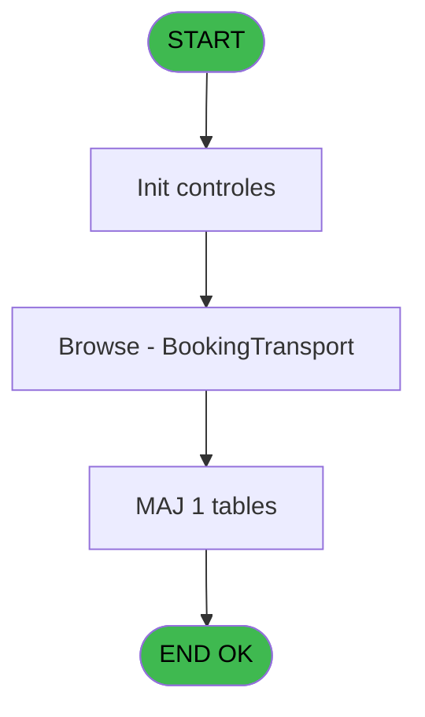

# REF IDE 643 - GET customers X bookings Y tsp

> **Analyse**: Phases 1-4 2026-02-03 13:22 -> 13:22 (17s) | Assemblage 13:22
> **Pipeline**: V7.2 Enrichi
> **Structure**: 4 onglets (Resume | Ecrans | Donnees | Connexions)

<!-- TAB:Resume -->

## 1. FICHE D'IDENTITE

| Attribut | Valeur |
|----------|--------|
| Projet | REF |
| IDE Position | 643 |
| Nom Programme | GET customers X bookings Y tsp |
| Fichier source | `Prg_643.xml` |
| Dossier IDE | General |
| Taches | 4 (1 ecrans visibles) |
| Tables modifiees | 1 |
| Programmes appeles | 0 |

## 2. DESCRIPTION FONCTIONNELLE

**GET customers X bookings Y tsp** assure la gestion complete de ce processus, accessible depuis [Pilotage API CM Stay (IDE 639)](REF-IDE-639.md).

Le flux de traitement s'organise en **1 blocs fonctionnels** :

- **Traitement** (4 taches) : traitements metier divers

**Donnees modifiees** : 1 tables en ecriture (Table_954).

Detail : phases du traitement

#### Phase 1 : Traitement (4 taches)

- **643** - GETcustomers X bookings Y tran
- **643.1** - (sans nom)
- **643.1.1** - (sans nom)
- **643.2** - Browse - BookingTransport **[[ECRAN]](#ecran-t4)**

#### Tables impactees

| Table | Operations | Role metier |
|-------|-----------|-------------|
| Table_954 | **W** (2 usages) |  |

## 3. BLOCS FONCTIONNELS

### 3.1 Traitement (4 taches)

Traitements internes.

---

#### 643 - GETcustomers X bookings Y tran

**Role** : Consultation/chargement : GETcustomers X bookings Y tran.

3 sous-taches directes

| Tache | Nom | Bloc |
|-------|-----|------|
| [643.1](#t2) | (sans nom) | Traitement |
| [643.1.1](#t3) | (sans nom) | Traitement |
| [643.2](#t4) | Browse - BookingTransport **[[ECRAN]](#ecran-t4)** | Traitement |

---

#### 643.1 - (sans nom)

**Role** : Traitement interne.

---

#### 643.1.1 - (sans nom)

**Role** : Traitement interne.

---

#### 643.2 - Browse - BookingTransport [[ECRAN]](#ecran-t4)

**Role** : Traitement : Browse - BookingTransport.
**Ecran** : 4598 x 195 DLU | [Voir mockup](#ecran-t4)

## 5. REGLES METIER

*(Aucune regle metier identifiee)*

## 6. CONTEXTE

- **Appele par**: [Pilotage API CM Stay (IDE 639)](REF-IDE-639.md)
- **Appelle**: 0 programmes | **Tables**: 1 (W:1 R:0 L:0) | **Taches**: 4 | **Expressions**: 21

<!-- TAB:Ecrans -->

## 8. ECRANS

### 8.1 Forms visibles (1 / 4)

| # | Position | Tache | Nom | Type | Largeur | Hauteur | Bloc |
|---|----------|-------|-----|------|---------|---------|------|
| 1 | 643.2 | 643.2 | Browse - BookingTransport | Type0 | 4598 | 195 | Traitement |

### 8.2 Mockups Ecrans

---

#### 643.2 - Browse - BookingTransport
**Tache** : [643.2](#t4) | **Type** : Type0 | **Dimensions** : 4598 x 195 DLU
**Bloc** : Traitement | **Titre IDE** : Browse - BookingTransport

<!-- FORM-DATA:
{
    "width":  4598,
    "vFactor":  8,
    "type":  "Type0",
    "hFactor":  4,
    "controls":  [
                     {
                         "x":  8,
                         "type":  "table",
                         "var":  "",
                         "name":  "",
                         "titleH":  12,
                         "color":  "",
                         "w":  4576,
                         "y":  8,
                         "fmt":  "",
                         "parent":  null,
                         "text":  "",
                         "rowH":  13,
                         "h":  182,
                         "cols":  [
                                      {
                                          "title":  "customer_id",
                                          "layer":  1,
                                          "w":  53
                                      },
                                      {
                                          "title":  "booking_id",
                                          "layer":  2,
                                          "w":  53
                                      },
                                      {
                                          "title":  "way",
                                          "layer":  3,
                                          "w":  290
                                      },
                                      {
                                          "title":  "stay_id",
                                          "layer":  4,
                                          "w":  290
                                      },
                                      {
                                          "title":  "pre_post_trip",
                                          "layer":  5,
                                          "w":  52
                                      },
                                      {
                                          "title":  "attendees_id",
                                          "layer":  6,
                                          "w":  290
                                      },
                                      {
                                          "title":  "attendees_status",
                                          "layer":  7,
                                          "w":  290
                                      },
                                      {
                                          "title":  "section_departure_city_id",
                                          "layer":  8,
                                          "w":  290
                                      },
                                      {
                                          "title":  "section_departure_city_label",
                                          "layer":  9,
                                          "w":  290
                                      },
                                      {
                                          "title":  "section_departure_location_id",
                                          "layer":  10,
                                          "w":  290
                                      },
                                      {
                                          "title":  "section_departure_location_labe",
                                          "layer":  11,
                                          "w":  290
                                      },
                                      {
                                          "title":  "section_departure_location_term",
                                          "layer":  12,
                                          "w":  290
                                      },
                                      {
                                          "title":  "section_departure_date",
                                          "layer":  13,
                                          "w":  93
                                      },
                                      {
                                          "title":  "section_departure_time",
                                          "layer":  14,
                                          "w":  91
                                      },
                                      {
                                          "title":  "section_arrival_city_id",
                                          "layer":  15,
                                          "w":  290
                                      },
                                      {
                                          "title":  "section_arrival_city_label",
                                          "layer":  16,
                                          "w":  290
                                      },
                                      {
                                          "title":  "section_arrival_location_id",
                                          "layer":  17,
                                          "w":  290
                                      },
                                      {
                                          "title":  "section_arrival_location_label",
                                          "layer":  18,
                                          "w":  290
                                      },
                                      {
                                          "title":  "section_arrival_location_term",
                                          "layer":  19,
                                          "w":  290
                                      },
                                      {
                                          "title":  "section_arrival_date",
                                          "layer":  20,
                                          "w":  79
                                      },
                                      {
                                          "title":  "section_arrival_time",
                                          "layer":  21,
                                          "w":  78
                                      }
                                  ],
                         "rows":  21
                     },
                     {
                         "x":  12,
                         "type":  "edit",
                         "var":  "",
                         "y":  23,
                         "w":  46,
                         "fmt":  "",
                         "name":  "customer_id",
                         "h":  10,
                         "color":  "",
                         "text":  "",
                         "parent":  1
                     },
                     {
                         "x":  65,
                         "type":  "edit",
                         "var":  "",
                         "y":  23,
                         "w":  46,
                         "fmt":  "",
                         "name":  "booking_id",
                         "h":  10,
                         "color":  "",
                         "text":  "",
                         "parent":  1
                     },
                     {
                         "x":  118,
                         "type":  "edit",
                         "var":  "",
                         "y":  23,
                         "w":  283,
                         "fmt":  "",
                         "name":  "way",
                         "h":  10,
                         "color":  "",
                         "text":  "",
                         "parent":  1
                     },
                     {
                         "x":  408,
                         "type":  "edit",
                         "var":  "",
                         "y":  23,
                         "w":  283,
                         "fmt":  "",
                         "name":  "stay_id",
                         "h":  10,
                         "color":  "",
                         "text":  "",
                         "parent":  1
                     },
                     {
                         "x":  698,
                         "type":  "edit",
                         "var":  "",
                         "y":  23,
                         "w":  31,
                         "fmt":  "",
                         "name":  "pre_post_trip",
                         "h":  10,
                         "color":  "",
                         "text":  "",
                         "parent":  1
                     },
                     {
                         "x":  750,
                         "type":  "edit",
                         "var":  "",
                         "y":  23,
                         "w":  283,
                         "fmt":  "",
                         "name":  "attendees_id",
                         "h":  10,
                         "color":  "",
                         "text":  "",
                         "parent":  1
                     },
                     {
                         "x":  1040,
                         "type":  "edit",
                         "var":  "",
                         "y":  23,
                         "w":  283,
                         "fmt":  "",
                         "name":  "attendees_status",
                         "h":  10,
                         "color":  "",
                         "text":  "",
                         "parent":  1
                     },
                     {
                         "x":  1330,
                         "type":  "edit",
                         "var":  "",
                         "y":  23,
                         "w":  283,
                         "fmt":  "",
                         "name":  "section_departure_city_id",
                         "h":  10,
                         "color":  "",
                         "text":  "",
                         "parent":  1
                     },
                     {
                         "x":  1620,
                         "type":  "edit",
                         "var":  "",
                         "y":  23,
                         "w":  283,
                         "fmt":  "",
                         "name":  "section_departure_city_label",
                         "h":  10,
                         "color":  "",
                         "text":  "",
                         "parent":  1
                     },
                     {
                         "x":  1910,
                         "type":  "edit",
                         "var":  "",
                         "y":  23,
                         "w":  283,
                         "fmt":  "",
                         "name":  "section_departure_location_id",
                         "h":  10,
                         "color":  "",
                         "text":  "",
                         "parent":  1
                     },
                     {
                         "x":  2200,
                         "type":  "edit",
                         "var":  "",
                         "y":  23,
                         "w":  283,
                         "fmt":  "",
                         "name":  "section_departure_location_labe",
                         "h":  10,
                         "color":  "",
                         "text":  "",
                         "parent":  1
                     },
                     {
                         "x":  2490,
                         "type":  "edit",
                         "var":  "",
                         "y":  23,
                         "w":  283,
                         "fmt":  "",
                         "name":  "section_departure_location_term",
                         "h":  10,
                         "color":  "",
                         "text":  "",
                         "parent":  1
                     },
                     {
                         "x":  2780,
                         "type":  "edit",
                         "var":  "",
                         "y":  23,
                         "w":  61,
                         "fmt":  "",
                         "name":  "section_departure_date",
                         "h":  10,
                         "color":  "",
                         "text":  "",
                         "parent":  1
                     },
                     {
                         "x":  2873,
                         "type":  "edit",
                         "var":  "",
                         "y":  23,
                         "w":  46,
                         "fmt":  "",
                         "name":  "section_departure_time",
                         "h":  10,
                         "color":  "",
                         "text":  "",
                         "parent":  1
                     },
                     {
                         "x":  2964,
                         "type":  "edit",
                         "var":  "",
                         "y":  23,
                         "w":  283,
                         "fmt":  "",
                         "name":  "section_arrival_city_id",
                         "h":  10,
                         "color":  "",
                         "text":  "",
                         "parent":  1
                     },
                     {
                         "x":  3254,
                         "type":  "edit",
                         "var":  "",
                         "y":  23,
                         "w":  283,
                         "fmt":  "",
                         "name":  "section_arrival_city_label",
                         "h":  10,
                         "color":  "",
                         "text":  "",
                         "parent":  1
                     },
                     {
                         "x":  3544,
                         "type":  "edit",
                         "var":  "",
                         "y":  23,
                         "w":  283,
                         "fmt":  "",
                         "name":  "section_arrival_location_id",
                         "h":  10,
                         "color":  "",
                         "text":  "",
                         "parent":  1
                     },
                     {
                         "x":  3834,
                         "type":  "edit",
                         "var":  "",
                         "y":  23,
                         "w":  283,
                         "fmt":  "",
                         "name":  "section_arrival_location_label",
                         "h":  10,
                         "color":  "",
                         "text":  "",
                         "parent":  1
                     },
                     {
                         "x":  4124,
                         "type":  "edit",
                         "var":  "",
                         "y":  23,
                         "w":  283,
                         "fmt":  "",
                         "name":  "section_arrival_location_term",
                         "h":  10,
                         "color":  "",
                         "text":  "",
                         "parent":  1
                     },
                     {
                         "x":  4414,
                         "type":  "edit",
                         "var":  "",
                         "y":  23,
                         "w":  61,
                         "fmt":  "",
                         "name":  "section_arrival_date",
                         "h":  10,
                         "color":  "",
                         "text":  "",
                         "parent":  1
                     },
                     {
                         "x":  4493,
                         "type":  "edit",
                         "var":  "",
                         "y":  23,
                         "w":  46,
                         "fmt":  "",
                         "name":  "section_arrival_time",
                         "h":  10,
                         "color":  "",
                         "text":  "",
                         "parent":  1
                     }
                 ],
    "taskId":  "643.2",
    "height":  195
}
-->

<strong>Champs : 21 champs</strong>

| Pos (x,y) | Nom | Variable | Type |
|-----------|-----|----------|------|
| 12,23 | customer_id | - | edit |
| 65,23 | booking_id | - | edit |
| 118,23 | way | - | edit |
| 408,23 | stay_id | - | edit |
| 698,23 | pre_post_trip | - | edit |
| 750,23 | attendees_id | - | edit |
| 1040,23 | attendees_status | - | edit |
| 1330,23 | section_departure_city_id | - | edit |
| 1620,23 | section_departure_city_label | - | edit |
| 1910,23 | section_departure_location_id | - | edit |
| 2200,23 | section_departure_location_labe | - | edit |
| 2490,23 | section_departure_location_term | - | edit |
| 2780,23 | section_departure_date | - | edit |
| 2873,23 | section_departure_time | - | edit |
| 2964,23 | section_arrival_city_id | - | edit |
| 3254,23 | section_arrival_city_label | - | edit |
| 3544,23 | section_arrival_location_id | - | edit |
| 3834,23 | section_arrival_location_label | - | edit |
| 4124,23 | section_arrival_location_term | - | edit |
| 4414,23 | section_arrival_date | - | edit |
| 4493,23 | section_arrival_time | - | edit |

## 9. NAVIGATION

Ecran unique: **Browse - BookingTransport**

### 9.3 Structure hierarchique (4 taches)

| Position | Tache | Type | Dimensions | Bloc |
|----------|-------|------|------------|------|
| **643.1** | [**GETcustomers X bookings Y tran** (643)](#t1) | - | - | Traitement |
| 643.1.1 | [(sans nom) (643.1)](#t2) | - | - | |
| 643.1.2 | [(sans nom) (643.1.1)](#t3) | - | - | |
| 643.1.3 | [Browse - BookingTransport (643.2)](#t4) [mockup](#ecran-t4) | - | 4598x195 | |

### 9.4 Algorigramme

> **Legende**: Vert = START/END OK | Rouge = END KO | Bleu = Decisions
> *Algorigramme auto-genere. Utiliser `/algorigramme` pour une synthese metier detaillee.*

<!-- TAB:Donnees -->

## 10. TABLES

### Tables utilisees (1)

| ID | Nom | Description | Type | R | W | L | Usages |
|----|-----|-------------|------|---|---|---|--------|
| 954 | Table_954 |  | MEM |   | **W** |   | 2 |

### Colonnes par table (0 / 1 tables avec colonnes identifiees)

Table 954 - Table_954 (**W**) - 2 usages

*Table utilisee uniquement en Link ou aucune colonne Real identifiee dans le DataView.*

## 11. VARIABLES

### 11.1 Parametres entrants (3)

Variables recues du programme appelant ([Pilotage API CM Stay (IDE 639)](REF-IDE-639.md)).

| Lettre | Nom | Type | Usage dans |
|--------|-----|------|-----------|
| A | p. customer_id | Numeric | 1x parametre entrant |
| B | p. booking_id | Numeric | - |
| C | p. Json IN | Blob | - |

### 11.2 Variables de session (5)

Variables persistantes pendant toute la session.

| Lettre | Nom | Type | Usage dans |
|--------|-----|------|-----------|
| D | v. XML data | Blob | - |
| E | v.attendees_status | Unicode | - |
| F | v.section_departure_city_id | Unicode | - |
| G | v.section_departure_city_label | Unicode | - |
| H | v.section_departure_location_id | Unicode | - |

### 11.3 Autres (11)

Variables diverses.

| Lettre | Nom | Type | Usage dans |
|--------|-----|------|-----------|
| I | section_departure_location_labe | Unicode | - |
| J | section_departure_location_term | Unicode | - |
| K | section_departure_date | Date | - |
| L | section_departure_time | Time | - |
| M | section_arrival_city_id | Unicode | - |
| N | section_arrival_city_label | Unicode | - |
| O | section_arrival_location_id | Unicode | - |
| P | section_arrival_location_labe | Unicode | - |
| Q | section_arrival_location_term | Unicode | - |
| R | section_arrival_date | Date | - |
| S | section_arrival_time | Time | - |

Toutes les 19 variables (liste complete)

| Cat | Lettre | Nom Variable | Type |
|-----|--------|--------------|------|
| P0 | **A** | p. customer_id | Numeric |
| P0 | **B** | p. booking_id | Numeric |
| P0 | **C** | p. Json IN | Blob |
| V. | **D** | v. XML data | Blob |
| V. | **E** | v.attendees_status | Unicode |
| V. | **F** | v.section_departure_city_id | Unicode |
| V. | **G** | v.section_departure_city_label | Unicode |
| V. | **H** | v.section_departure_location_id | Unicode |
| Autre | **I** | section_departure_location_labe | Unicode |
| Autre | **J** | section_departure_location_term | Unicode |
| Autre | **K** | section_departure_date | Date |
| Autre | **L** | section_departure_time | Time |
| Autre | **M** | section_arrival_city_id | Unicode |
| Autre | **N** | section_arrival_city_label | Unicode |
| Autre | **O** | section_arrival_location_id | Unicode |
| Autre | **P** | section_arrival_location_labe | Unicode |
| Autre | **Q** | section_arrival_location_term | Unicode |
| Autre | **R** | section_arrival_date | Date |
| Autre | **S** | section_arrival_time | Time |

## 12. EXPRESSIONS

**21 / 21 expressions decodees (100%)**

### 12.1 Repartition par type

| Type | Expressions | Regles |
|------|-------------|--------|
| CALCULATION | 16 | 0 |
| CONDITION | 1 | 0 |
| DATE | 2 | 0 |
| CONCATENATION | 1 | 0 |
| OTHER | 1 | 0 |

### 12.2 Expressions cles par type

#### CALCULATION (16 expressions)

| Type | IDE | Expression | Regle |
|------|-----|------------|-------|
| CALCULATION | 14 | `XMLGet(0,1,'/root/travel_sections/arrival/city/id')` | - |
| CALCULATION | 15 | `XMLGet(0,1,'/root/travel_sections/arrival/city/label')` | - |
| CALCULATION | 11 | `XMLGet(0,1,'/root/travel_sections/departure/location/terminal_code')` | - |
| CALCULATION | 13 | `TVal(MID(XMLGet(0,1,'/root/travel_sections/departure/time'),10,8),'HH:MM:SS')` | - |
| CALCULATION | 18 | `XMLGet(0,1,'/root/travel_sections/arrival/location/terminal_code')` | - |
| ... | | *+11 autres* | |

#### CONDITION (1 expressions)

| Type | IDE | Expression | Regle |
|------|-----|------------|-------|
| CONDITION | 4 | `XMLGet(0,1,'/root/pre_post_trip')='true'` | - |

#### DATE (2 expressions)

| Type | IDE | Expression | Regle |
|------|-----|------------|-------|
| DATE | 19 | `DVal(XMLGet(0,1,'/root/travel_sections/arrival/date'),'YYYYMMDD')` | - |
| DATE | 12 | `DVal(XMLGet(0,1,'/root/travel_sections/departure/date'),'YYYYMMDD')` | - |

#### CONCATENATION (1 expressions)

| Type | IDE | Expression | Regle |
|------|-----|------------|-------|
| CONCATENATION | 1 | `'<?xml version="1.0"?>' &ASCIIChr(13)& ASCIIChr(10)&DotNet.System.Xml.Linq.XElement.Load(DotNet.System.Runtime.Serialization.Json.JsonReaderWriterFactory.CreateJsonReader(p. customer_id [A],DotNet.System.Xml.XmlDictionaryReaderQuotas())).ToString()` | - |

#### OTHER (1 expressions)

| Type | IDE | Expression | Regle |
|------|-----|------------|-------|
| OTHER | 21 | `{1,1}` | - |

### 12.3 Toutes les expressions (21)

Voir les 21 expressions

#### CALCULATION (16)

| IDE | Expression Decodee |
|-----|-------------------|
| 2 | `XMLGet(0,1,'/root/way')` |
| 3 | `XMLGet(0,1,'/root/stay_id')` |
| 5 | `XMLGet(0,1,'/root/attendes/id')` |
| 6 | `XMLGet(0,1,'/root/attendes/status')` |
| 7 | `XMLGet(0,1,'/root/travel_sections/departure/city/id')` |
| 8 | `XMLGet(0,1,'/root/travel_sections/departure/city/label')` |
| 9 | `XMLGet(0,1,'/root/travel_sections/departure/location/id')` |
| 10 | `XMLGet(0,1,'/root/travel_sections/departure/location/label')` |
| 11 | `XMLGet(0,1,'/root/travel_sections/departure/location/terminal_code')` |
| 13 | `TVal(MID(XMLGet(0,1,'/root/travel_sections/departure/time'),10,8),'HH:MM:SS')` |
| 14 | `XMLGet(0,1,'/root/travel_sections/arrival/city/id')` |
| 15 | `XMLGet(0,1,'/root/travel_sections/arrival/city/label')` |
| 16 | `XMLGet(0,1,'/root/travel_sections/arrival/location/id')` |
| 17 | `XMLGet(0,1,'/root/travel_sections/arrival/location/label')` |
| 18 | `XMLGet(0,1,'/root/travel_sections/arrival/location/terminal_code')` |
| 20 | `TVal(MID(XMLGet(0,1,'/root/travel_sections/arrival/time'),10,8),'HH:MM:SS')` |

#### CONDITION (1)

| IDE | Expression Decodee |
|-----|-------------------|
| 4 | `XMLGet(0,1,'/root/pre_post_trip')='true'` |

#### DATE (2)

| IDE | Expression Decodee |
|-----|-------------------|
| 12 | `DVal(XMLGet(0,1,'/root/travel_sections/departure/date'),'YYYYMMDD')` |
| 19 | `DVal(XMLGet(0,1,'/root/travel_sections/arrival/date'),'YYYYMMDD')` |

#### CONCATENATION (1)

| IDE | Expression Decodee |
|-----|-------------------|
| 1 | `'<?xml version="1.0"?>' &ASCIIChr(13)& ASCIIChr(10)&DotNet.System.Xml.Linq.XElement.Load(DotNet.System.Runtime.Serialization.Json.JsonReaderWriterFactory.CreateJsonReader(p. customer_id [A],DotNet.System.Xml.XmlDictionaryReaderQuotas())).ToString()` |

#### OTHER (1)

| IDE | Expression Decodee |
|-----|-------------------|
| 21 | `{1,1}` |

<!-- TAB:Connexions -->

## 13. GRAPHE D'APPELS

### 13.1 Chaine depuis Main (Callers)

Main -> ... -> [Pilotage API CM Stay (IDE 639)](REF-IDE-639.md) -> **GET customers X bookings Y tsp (IDE 643)**

### 13.2 Callers

| IDE | Nom Programme | Nb Appels |
|-----|---------------|-----------|
| [639](REF-IDE-639.md) | Pilotage API CM Stay | 1 |

### 13.3 Callees (programmes appeles)

### 13.4 Detail Callees avec contexte

| IDE | Nom Programme | Appels | Contexte |
|-----|---------------|--------|----------|
| - | (aucun) | - | - |

## 14. RECOMMANDATIONS MIGRATION

### 14.1 Profil du programme

| Metrique | Valeur | Impact migration |
|----------|--------|-----------------|
| Lignes de logique | 117 | Programme compact |
| Expressions | 21 | Peu de logique |
| Tables WRITE | 1 | Impact faible |
| Sous-programmes | 0 | Peu de dependances |
| Ecrans visibles | 1 | Ecran unique ou traitement batch |
| Code desactive | 0% (0 / 117) | Code sain |
| Regles metier | 0 | Pas de regle identifiee |

### 14.2 Plan de migration par bloc

#### Traitement (4 taches: 1 ecran, 3 traitements)

- **Strategie** : Orchestrateur avec 1 ecrans (Razor/React) et 3 traitements backend (services).
- Les ecrans deviennent des composants UI, les traitements invisibles deviennent des services injectables.
- Decomposer les taches en services unitaires testables.

### 14.3 Dependances critiques

| Dependance | Type | Appels | Impact |
|------------|------|--------|--------|
| Table_954 | Table WRITE (Memory) | 2x | Schema + repository |

---
*Spec DETAILED generee par Pipeline V7.2 - 2026-02-03 13:22*
