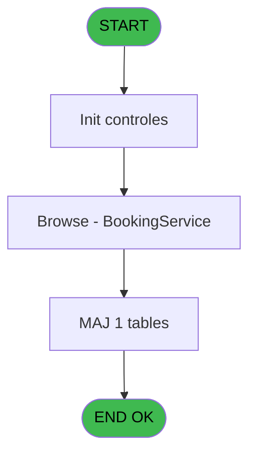
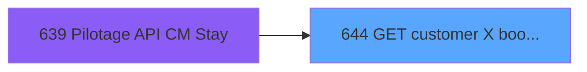
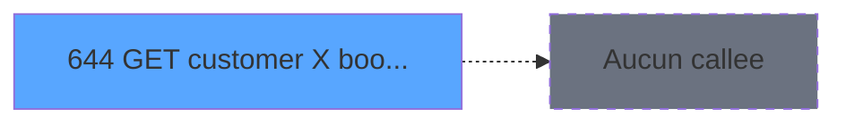

# REF IDE 644 - GET customer X bookings Y serv

> **Analyse**: Phases 1-4 2026-02-03 13:22 -> 13:22 (17s) | Assemblage 13:22
> **Pipeline**: V7.2 Enrichi
> **Structure**: 4 onglets (Resume | Ecrans | Donnees | Connexions)

<!-- TAB:Resume -->

## 1. FICHE D'IDENTITE

| Attribut | Valeur |
|----------|--------|
| Projet | REF |
| IDE Position | 644 |
| Nom Programme | GET customer X bookings Y serv |
| Fichier source | `Prg_644.xml` |
| Dossier IDE | General |
| Taches | 4 (1 ecrans visibles) |
| Tables modifiees | 1 |
| Programmes appeles | 0 |

## 2. DESCRIPTION FONCTIONNELLE

**GET customer X bookings Y serv** assure la gestion complete de ce processus, accessible depuis [Pilotage API CM Stay (IDE 639)](REF-IDE-639.md).

Le flux de traitement s'organise en **1 blocs fonctionnels** :

- **Traitement** (4 taches) : traitements metier divers

**Donnees modifiees** : 1 tables en ecriture (Table_955).

Detail : phases du traitement

#### Phase 1 : Traitement (4 taches)

- **644** - GET customer X bookings Y serv
- **644.1** - (sans nom)
- **644.1.1** - (sans nom)
- **644.2** - Browse - BookingService **[[ECRAN]](#ecran-t4)**

#### Tables impactees

| Table | Operations | Role metier |
|-------|-----------|-------------|
| Table_955 | **W** (2 usages) |  |

## 3. BLOCS FONCTIONNELS

### 3.1 Traitement (4 taches)

Traitements internes.

---

#### 644 - GET customer X bookings Y serv

**Role** : Consultation/chargement : GET customer X bookings Y serv.

3 sous-taches directes

| Tache | Nom | Bloc |
|-------|-----|------|
| [644.1](#t2) | (sans nom) | Traitement |
| [644.1.1](#t3) | (sans nom) | Traitement |
| [644.2](#t4) | Browse - BookingService **[[ECRAN]](#ecran-t4)** | Traitement |

**Variables liees** : A (p. customer_id)

---

#### 644.1 - (sans nom)

**Role** : Traitement interne.

---

#### 644.1.1 - (sans nom)

**Role** : Traitement interne.

---

#### 644.2 - Browse - BookingService [[ECRAN]](#ecran-t4)

**Role** : Traitement : Browse - BookingService.
**Ecran** : 967 x 195 DLU | [Voir mockup](#ecran-t4)

## 5. REGLES METIER

*(Aucune regle metier identifiee)*

## 6. CONTEXTE

- **Appele par**: [Pilotage API CM Stay (IDE 639)](REF-IDE-639.md)
- **Appelle**: 0 programmes | **Tables**: 1 (W:1 R:0 L:0) | **Taches**: 4 | **Expressions**: 6

<!-- TAB:Ecrans -->

## 8. ECRANS

### 8.1 Forms visibles (1 / 4)

| # | Position | Tache | Nom | Type | Largeur | Hauteur | Bloc |
|---|----------|-------|-----|------|---------|---------|------|
| 1 | 644.2 | 644.2 | Browse - BookingService | Type0 | 967 | 195 | Traitement |

### 8.2 Mockups Ecrans

---

#### 644.2 - Browse - BookingService
**Tache** : [644.2](#t4) | **Type** : Type0 | **Dimensions** : 967 x 195 DLU
**Bloc** : Traitement | **Titre IDE** : Browse - BookingService

<!-- FORM-DATA:
{
    "width":  967,
    "vFactor":  8,
    "type":  "Type0",
    "hFactor":  4,
    "controls":  [
                     {
                         "x":  8,
                         "type":  "table",
                         "var":  "",
                         "name":  "",
                         "titleH":  12,
                         "color":  "",
                         "w":  945,
                         "y":  8,
                         "fmt":  "",
                         "parent":  null,
                         "text":  "",
                         "rowH":  13,
                         "h":  182,
                         "cols":  [
                                      {
                                          "title":  "id",
                                          "layer":  1,
                                          "w":  290
                                      },
                                      {
                                          "title":  "type",
                                          "layer":  2,
                                          "w":  290
                                      },
                                      {
                                          "title":  "currency",
                                          "layer":  3,
                                          "w":  290
                                      },
                                      {
                                          "title":  "stay_index",
                                          "layer":  4,
                                          "w":  58
                                      }
                                  ],
                         "rows":  4
                     },
                     {
                         "x":  12,
                         "type":  "edit",
                         "var":  "",
                         "y":  23,
                         "w":  283,
                         "fmt":  "",
                         "name":  "id",
                         "h":  10,
                         "color":  "",
                         "text":  "",
                         "parent":  1
                     },
                     {
                         "x":  302,
                         "type":  "edit",
                         "var":  "",
                         "y":  23,
                         "w":  283,
                         "fmt":  "",
                         "name":  "type",
                         "h":  10,
                         "color":  "",
                         "text":  "",
                         "parent":  1
                     },
                     {
                         "x":  592,
                         "type":  "edit",
                         "var":  "",
                         "y":  23,
                         "w":  283,
                         "fmt":  "",
                         "name":  "currency",
                         "h":  10,
                         "color":  "",
                         "text":  "",
                         "parent":  1
                     },
                     {
                         "x":  882,
                         "type":  "edit",
                         "var":  "",
                         "y":  23,
                         "w":  51,
                         "fmt":  "",
                         "name":  "stay_index",
                         "h":  10,
                         "color":  "",
                         "text":  "",
                         "parent":  1
                     }
                 ],
    "taskId":  "644.2",
    "height":  195
}
-->

<strong>Champs : 4 champs</strong>

| Pos (x,y) | Nom | Variable | Type |
|-----------|-----|----------|------|
| 12,23 | id | - | edit |
| 302,23 | type | - | edit |
| 592,23 | currency | - | edit |
| 882,23 | stay_index | - | edit |

## 9. NAVIGATION

Ecran unique: **Browse - BookingService**

### 9.3 Structure hierarchique (4 taches)

| Position | Tache | Type | Dimensions | Bloc |
|----------|-------|------|------------|------|
| **644.1** | [**GET customer X bookings Y serv** (644)](#t1) | - | - | Traitement |
| 644.1.1 | [(sans nom) (644.1)](#t2) | - | - | |
| 644.1.2 | [(sans nom) (644.1.1)](#t3) | - | - | |
| 644.1.3 | [Browse - BookingService (644.2)](#t4) [mockup](#ecran-t4) | - | 967x195 | |

### 9.4 Algorigramme

> **Legende**: Vert = START/END OK | Rouge = END KO | Bleu = Decisions
> *Algorigramme auto-genere. Utiliser `/algorigramme` pour une synthese metier detaillee.*

<!-- TAB:Donnees -->

## 10. TABLES

### Tables utilisees (1)

| ID | Nom | Description | Type | R | W | L | Usages |
|----|-----|-------------|------|---|---|---|--------|
| 955 | Table_955 |  | MEM |   | **W** |   | 2 |

### Colonnes par table (0 / 1 tables avec colonnes identifiees)

Table 955 - Table_955 (**W**) - 2 usages

*Table utilisee uniquement en Link ou aucune colonne Real identifiee dans le DataView.*

## 11. VARIABLES

### 11.1 Parametres entrants (3)

Variables recues du programme appelant ([Pilotage API CM Stay (IDE 639)](REF-IDE-639.md)).

| Lettre | Nom | Type | Usage dans |
|--------|-----|------|-----------|
| A | p. customer_id | Numeric | 1x parametre entrant |
| B | p. booking_id | Numeric | - |
| C | p. Json IN | Blob | - |

### 11.2 Variables de session (1)

Variables persistantes pendant toute la session.

| Lettre | Nom | Type | Usage dans |
|--------|-----|------|-----------|
| D | v. XML data | Blob | - |

## 12. EXPRESSIONS

**6 / 6 expressions decodees (100%)**

### 12.1 Repartition par type

| Type | Expressions | Regles |
|------|-------------|--------|
| CALCULATION | 4 | 0 |
| CONCATENATION | 1 | 0 |
| OTHER | 1 | 0 |

### 12.2 Expressions cles par type

#### CALCULATION (4 expressions)

| Type | IDE | Expression | Regle |
|------|-----|------------|-------|
| CALCULATION | 4 | `XMLGet(0,1,'/root/currency')` | - |
| CALCULATION | 5 | `Val(XMLGet(0,1,'/root/stay_index'),'10')` | - |
| CALCULATION | 2 | `XMLGet(0,1,'/root/id')` | - |
| CALCULATION | 3 | `XMLGet(0,1,'/root/type')` | - |

#### CONCATENATION (1 expressions)

| Type | IDE | Expression | Regle |
|------|-----|------------|-------|
| CONCATENATION | 1 | `'<?xml version="1.0"?>' &ASCIIChr(13)& ASCIIChr(10)&DotNet.System.Xml.Linq.XElement.Load(DotNet.System.Runtime.Serialization.Json.JsonReaderWriterFactory.CreateJsonReader(p. customer_id [A],DotNet.System.Xml.XmlDictionaryReaderQuotas())).ToString()` | - |

#### OTHER (1 expressions)

| Type | IDE | Expression | Regle |
|------|-----|------------|-------|
| OTHER | 6 | `{1,1}` | - |

<!-- TAB:Connexions -->

## 13. GRAPHE D'APPELS

### 13.1 Chaine depuis Main (Callers)

Main -> ... -> [Pilotage API CM Stay (IDE 639)](REF-IDE-639.md) -> **GET customer X bookings Y serv (IDE 644)**

### 13.2 Callers

| IDE | Nom Programme | Nb Appels |
|-----|---------------|-----------|
| [639](REF-IDE-639.md) | Pilotage API CM Stay | 1 |

### 13.3 Callees (programmes appeles)

### 13.4 Detail Callees avec contexte

| IDE | Nom Programme | Appels | Contexte |
|-----|---------------|--------|----------|
| - | (aucun) | - | - |

## 14. RECOMMANDATIONS MIGRATION

### 14.1 Profil du programme

| Metrique | Valeur | Impact migration |
|----------|--------|-----------------|
| Lignes de logique | 31 | Programme compact |
| Expressions | 6 | Peu de logique |
| Tables WRITE | 1 | Impact faible |
| Sous-programmes | 0 | Peu de dependances |
| Ecrans visibles | 1 | Ecran unique ou traitement batch |
| Code desactive | 0% (0 / 31) | Code sain |
| Regles metier | 0 | Pas de regle identifiee |

### 14.2 Plan de migration par bloc

#### Traitement (4 taches: 1 ecran, 3 traitements)

- **Strategie** : Orchestrateur avec 1 ecrans (Razor/React) et 3 traitements backend (services).
- Les ecrans deviennent des composants UI, les traitements invisibles deviennent des services injectables.
- Decomposer les taches en services unitaires testables.

### 14.3 Dependances critiques

| Dependance | Type | Appels | Impact |
|------------|------|--------|--------|
| Table_955 | Table WRITE (Memory) | 2x | Schema + repository |

---
*Spec DETAILED generee par Pipeline V7.2 - 2026-02-03 13:22*
