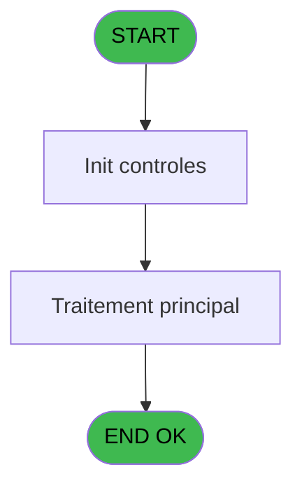

# REF IDE 645 - GET customer X booking Y EA

> **Analyse**: Phases 1-4 2026-02-03 13:22 -> 13:23 (18s) | Assemblage 13:23
> **Pipeline**: V7.2 Enrichi
> **Structure**: 4 onglets (Resume | Ecrans | Donnees | Connexions)

<!-- TAB:Resume -->

## 1. FICHE D'IDENTITE

| Attribut | Valeur |
|----------|--------|
| Projet | REF |
| IDE Position | 645 |
| Nom Programme | GET customer X booking Y EA |
| Fichier source | `Prg_645.xml` |
| Dossier IDE | General |
| Taches | 2 (0 ecrans visibles) |
| Tables modifiees | 0 |
| Programmes appeles | 0 |

## 2. DESCRIPTION FONCTIONNELLE

**GET customer X booking Y EA** assure la gestion complete de ce processus, accessible depuis [Pilotage API CM Stay (IDE 639)](REF-IDE-639.md).

Le flux de traitement s'organise en **1 blocs fonctionnels** :

- **Traitement** (2 taches) : traitements metier divers

## 3. BLOCS FONCTIONNELS

### 3.1 Traitement (2 taches)

Traitements internes.

---

#### 645 - GET customer X booking Y EA

**Role** : Consultation/chargement : GET customer X booking Y EA.
**Variables liees** : A (p. customer_id), B (p. booking_id), F (booking_status)

---

#### 645.1 - (sans nom)

**Role** : Traitement interne.

## 5. REGLES METIER

*(Aucune regle metier identifiee)*

## 6. CONTEXTE

- **Appele par**: [Pilotage API CM Stay (IDE 639)](REF-IDE-639.md)
- **Appelle**: 0 programmes | **Tables**: 0 (W:0 R:0 L:0) | **Taches**: 2 | **Expressions**: 19

<!-- TAB:Ecrans -->

## 8. ECRANS

*(Programme sans ecran visible)*

## 9. NAVIGATION

### 9.3 Structure hierarchique (2 taches)

| Position | Tache | Type | Dimensions | Bloc |
|----------|-------|------|------------|------|
| **645.1** | [**GET customer X booking Y EA** (645)](#t1) | - | - | Traitement |
| 645.1.1 | [(sans nom) (645.1)](#t2) | - | - | |

### 9.4 Algorigramme

> **Legende**: Vert = START/END OK | Rouge = END KO | Bleu = Decisions
> *Algorigramme auto-genere. Utiliser `/algorigramme` pour une synthese metier detaillee.*

<!-- TAB:Donnees -->

## 10. TABLES

### Tables utilisees (0)

| ID | Nom | Description | Type | R | W | L | Usages |
|----|-----|-------------|------|---|---|---|--------|

### Colonnes par table (0 / 0 tables avec colonnes identifiees)

## 11. VARIABLES

### 11.1 Parametres entrants (3)

Variables recues du programme appelant ([Pilotage API CM Stay (IDE 639)](REF-IDE-639.md)).

| Lettre | Nom | Type | Usage dans |
|--------|-----|------|-----------|
| A | p. customer_id | Numeric | 1x parametre entrant |
| B | p. booking_id | Numeric | - |
| C | p. Json IN | Blob | - |

### 11.2 Variables de session (1)

Variables persistantes pendant toute la session.

| Lettre | Nom | Type | Usage dans |
|--------|-----|------|-----------|
| D | v. XML data | Blob | - |

### 11.3 Autres (15)

Variables diverses.

| Lettre | Nom | Type | Usage dans |
|--------|-----|------|-----------|
| E | duration | Numeric | 1x refs |
| F | booking_status | Unicode | 1x refs |
| G | locale | Unicode | 1x refs |
| H | multiple_sale_contrats | Logical | 1x refs |
| I | last_modified_date | Date | 2x refs |
| J | last_modified_time | Time | - |
| K | vendor_sold_by | Unicode | - |
| L | vendor_name | Unicode | - |
| M | vendor_contact | Unicode | - |
| N | vendor_type | Unicode | - |
| O | total_price_total | Numeric | - |
| P | total_price_currency | Unicode | - |
| Q | option_durability_experation_D | Date | - |
| R | option_durability_expiration_T | Time | - |
| S | option_durability_is_reliable | Logical | - |

Toutes les 19 variables (liste complete)

| Cat | Lettre | Nom Variable | Type |
|-----|--------|--------------|------|
| P0 | **A** | p. customer_id | Numeric |
| P0 | **B** | p. booking_id | Numeric |
| P0 | **C** | p. Json IN | Blob |
| V. | **D** | v. XML data | Blob |
| Autre | **E** | duration | Numeric |
| Autre | **F** | booking_status | Unicode |
| Autre | **G** | locale | Unicode |
| Autre | **H** | multiple_sale_contrats | Logical |
| Autre | **I** | last_modified_date | Date |
| Autre | **J** | last_modified_time | Time |
| Autre | **K** | vendor_sold_by | Unicode |
| Autre | **L** | vendor_name | Unicode |
| Autre | **M** | vendor_contact | Unicode |
| Autre | **N** | vendor_type | Unicode |
| Autre | **O** | total_price_total | Numeric |
| Autre | **P** | total_price_currency | Unicode |
| Autre | **Q** | option_durability_experation_D | Date |
| Autre | **R** | option_durability_expiration_T | Time |
| Autre | **S** | option_durability_is_reliable | Logical |

## 12. EXPRESSIONS

**19 / 19 expressions decodees (100%)**

### 12.1 Repartition par type

| Type | Expressions | Regles |
|------|-------------|--------|
| CALCULATION | 11 | 0 |
| CONDITION | 2 | 0 |
| DATE | 5 | 0 |
| CONCATENATION | 1 | 0 |

### 12.2 Expressions cles par type

#### CALCULATION (11 expressions)

| Type | IDE | Expression | Regle |
|------|-----|------------|-------|
| CALCULATION | 14 | `XMLGet(0,1,'/root/vendor/contact')` | - |
| CALCULATION | 13 | `XMLGet(0,1,'/root/vendor/name')` | - |
| CALCULATION | 15 | `Val(XMLGet(0,1,'/root/total_price/total'),'12.4')` | - |
| CALCULATION | 18 | `TVal(MID(XMLGet(0,1,'/root/option_durability/expiration_date'),10,8),'HH:MM:SS')` | - |
| CALCULATION | 16 | `XMLGet(0,1,'/root/total_price/currency')` | - |
| ... | | *+6 autres* | |

#### CONDITION (2 expressions)

| Type | IDE | Expression | Regle |
|------|-----|------------|-------|
| CONDITION | 19 | `XMLGet(0,1,'/root/option_durability/is_reliable')='true'` | - |
| CONDITION | 9 | `XMLGet(0,1,'/root/multiple_sale_contrats')='true'` | - |

#### DATE (5 expressions)

| Type | IDE | Expression | Regle |
|------|-----|------------|-------|
| DATE | 10 | `DVal(Left(XMLGet(0,1,'/root/last_modified_datetime'),8),'YYYYMMDD')` | - |
| DATE | 17 | `DVal(Left(XMLGet(0,1,'/root/option_durability/expiration_date'),8),'DDMMYYYY')` | - |
| DATE | 5 | `DVal(XMLGet(0,1,'/root/return_date'),'YYYYMMDD')` | - |
| DATE | 3 | `DVal(XMLGet(0,1,'/root/creation_date'),'YYYYMMDD')` | - |
| DATE | 4 | `DVal(XMLGet(0,1,'/root/departure_date'),'YYYYMMDD')` | - |

#### CONCATENATION (1 expressions)

| Type | IDE | Expression | Regle |
|------|-----|------------|-------|
| CONCATENATION | 1 | `'<?xml version="1.0"?>' &ASCIIChr(13)& ASCIIChr(10)&DotNet.System.Xml.Linq.XElement.Load(DotNet.System.Runtime.Serialization.Json.JsonReaderWriterFactory.CreateJsonReader(p. customer_id [A],DotNet.System.Xml.XmlDictionaryReaderQuotas())).ToString()` | - |

<!-- TAB:Connexions -->

## 13. GRAPHE D'APPELS

### 13.1 Chaine depuis Main (Callers)

Main -> ... -> [Pilotage API CM Stay (IDE 639)](REF-IDE-639.md) -> **GET customer X booking Y EA (IDE 645)**

### 13.2 Callers

| IDE | Nom Programme | Nb Appels |
|-----|---------------|-----------|
| [639](REF-IDE-639.md) | Pilotage API CM Stay | 1 |

### 13.3 Callees (programmes appeles)

### 13.4 Detail Callees avec contexte

| IDE | Nom Programme | Appels | Contexte |
|-----|---------------|--------|----------|
| - | (aucun) | - | - |

## 14. RECOMMANDATIONS MIGRATION

### 14.1 Profil du programme

| Metrique | Valeur | Impact migration |
|----------|--------|-----------------|
| Lignes de logique | 51 | Programme compact |
| Expressions | 19 | Peu de logique |
| Tables WRITE | 0 | Impact faible |
| Sous-programmes | 0 | Peu de dependances |
| Ecrans visibles | 0 | Ecran unique ou traitement batch |
| Code desactive | 0% (0 / 51) | Code sain |
| Regles metier | 0 | Pas de regle identifiee |

### 14.2 Plan de migration par bloc

#### Traitement (2 taches: 0 ecran, 2 traitements)

- **Strategie** : 2 service(s) backend injectable(s) (Domain Services).
- Decomposer les taches en services unitaires testables.

### 14.3 Dependances critiques

| Dependance | Type | Appels | Impact |
|------------|------|--------|--------|

---
*Spec DETAILED generee par Pipeline V7.2 - 2026-02-03 13:23*
