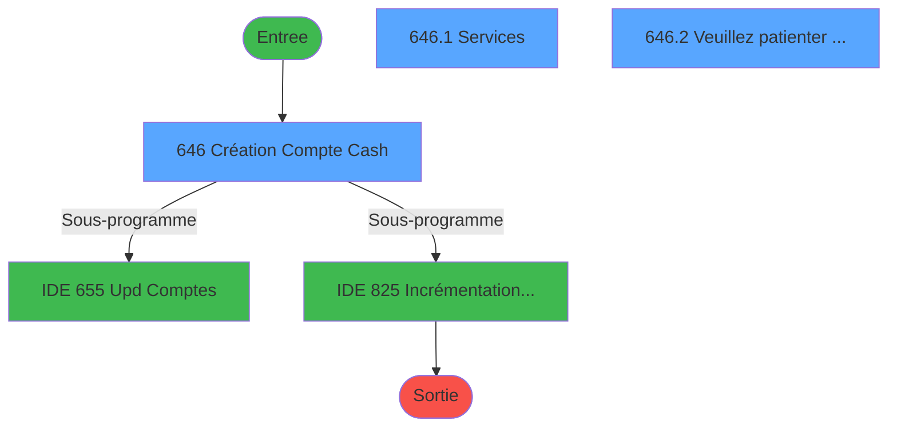
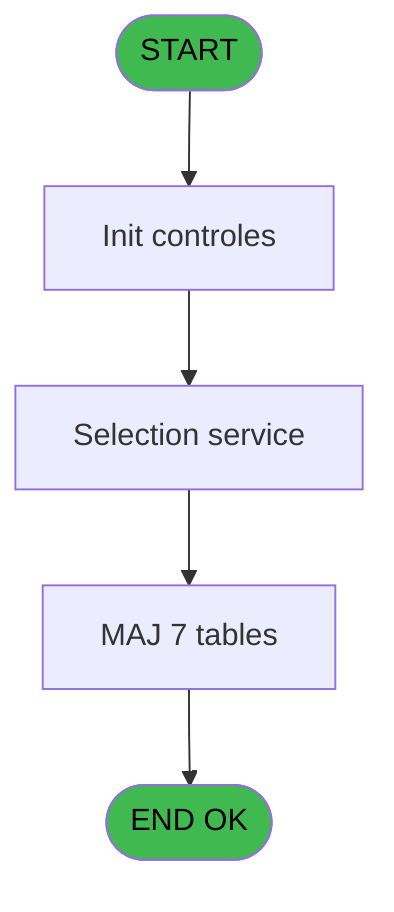
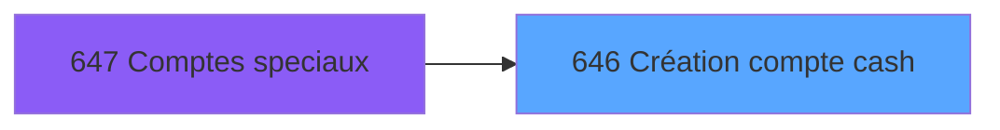
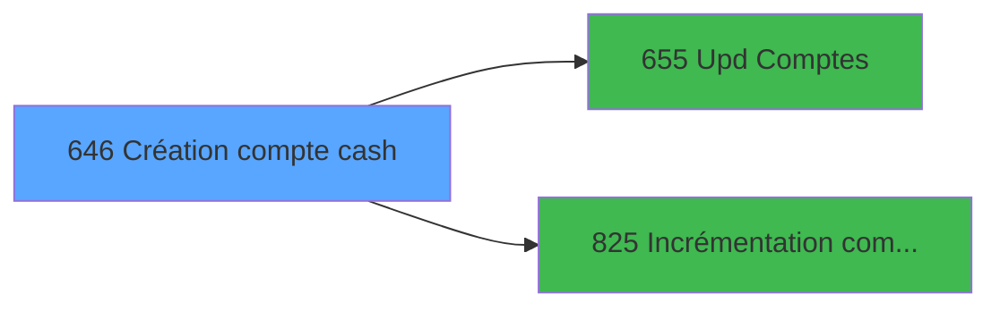

# REF IDE 646 - Création compte cash

> **Analyse**: Phases 1-4 2026-02-03 13:23 -> 13:23 (17s) | Assemblage 13:23
> **Pipeline**: V7.2 Enrichi
> **Structure**: 4 onglets (Resume | Ecrans | Donnees | Connexions)

<!-- TAB:Resume -->

## 1. FICHE D'IDENTITE

| Attribut | Valeur |
|----------|--------|
| Projet | REF |
| IDE Position | 646 |
| Nom Programme | Création compte cash |
| Fichier source | `Prg_646.xml` |
| Dossier IDE | Comptabilite |
| Taches | 14 (3 ecrans visibles) |
| Tables modifiees | 7 |
| Programmes appeles | 2 |

## 2. DESCRIPTION FONCTIONNELLE

**Création compte cash** assure la gestion complete de ce processus, accessible depuis [Comptes speciaux (IDE 647)](REF-IDE-647.md).

Le flux de traitement s'organise en **4 blocs fonctionnels** :

- **Creation** (6 taches) : insertion d'enregistrements en base (mouvements, prestations)
- **Traitement** (5 taches) : traitements metier divers
- **Validation** (2 taches) : controles et verifications de coherence
- **Calcul** (1 tache) : calculs de montants, stocks ou compteurs

**Donnees modifiees** : 7 tables en ecriture (gm-recherche_____gmr, gm-complet_______gmc, hebergement______heb, depot_garantie___dga, compte_gm________cgm, compteurs________cpt, comptes_speciaux_spc_cash).

Detail : phases du traitement

#### Phase 1 : Calcul (1 tache)

- **646** - Création Compte Cash **[[ECRAN]](#ecran-t1)**

Delegue a : [Upd Comptes (IDE 655)](REF-IDE-655.md), [Incrémentation compteur num (IDE 825)](REF-IDE-825.md)

#### Phase 2 : Traitement (5 taches)

- **646.1** - Services **[[ECRAN]](#ecran-t2)**
- **646.2** - Veuillez patienter ... **[[ECRAN]](#ecran-t5)**
- **646.2.1** - Recup Age Bebe
- **646.2.2** - Attribution N° Adherent Club
- **646.3** - Au mons un service

#### Phase 3 : Validation (2 taches)

- **646.1.1** - verif si existe pour meme date
- **646.1.2** - Verif compte cash à 0

#### Phase 4 : Creation (6 taches)

- **646.2.3** - Creation Hebergement
- **646.2.4** - Creation Hebergement
- **646.2.5** - Creation Hebergement
- **646.2.6** - Creation Hebergement
- **646.2.7** - Creation Hebergement
- **646.2.8** - Creation garantie

#### Tables impactees

| Table | Operations | Role metier |
|-------|-----------|-------------|
| comptes_speciaux_spc_cash | **W**/L (3 usages) | Comptes GM (generaux) |
| gm-recherche_____gmr | R/**W** (3 usages) | Index de recherche |
| compte_gm________cgm | **W**/L (2 usages) | Comptes GM (generaux) |
| gm-complet_______gmc | **W** (1 usages) |  |
| depot_garantie___dga | **W** (1 usages) | Depots et garanties |
| compteurs________cpt | **W** (1 usages) | Comptes GM (generaux) |
| hebergement______heb | **W** (1 usages) | Hebergement (chambres) |

## 3. BLOCS FONCTIONNELS

### 3.1 Calcul (1 tache)

Calculs metier : montants, stocks, compteurs.

---

#### 646 - Création Compte Cash [[ECRAN]](#ecran-t1)

**Role** : Traitement : Création Compte Cash.
**Ecran** : 319 x 385 DLU | [Voir mockup](#ecran-t1)
**Variables liees** : G (V.Type cash), J (V.Existe compte cash ?)
**Delegue a** : [Upd Comptes (IDE 655)](REF-IDE-655.md), [Incrémentation compteur num (IDE 825)](REF-IDE-825.md)

### 3.2 Traitement (5 taches)

Traitements internes.

---

#### 646.1 - Services [[ECRAN]](#ecran-t2)

**Role** : Traitement : Services.
**Ecran** : 584 x 253 DLU (Modal) | [Voir mockup](#ecran-t2)

---

#### 646.2 - Veuillez patienter ... [[ECRAN]](#ecran-t5)

**Role** : Traitement : Veuillez patienter ....
**Ecran** : 430 x 59 DLU (MDI) | [Voir mockup](#ecran-t5)

---

#### 646.2.1 - Recup Age Bebe

**Role** : Consultation/chargement : Recup Age Bebe.

---

#### 646.2.2 - Attribution N° Adherent Club

**Role** : Traitement : Attribution N° Adherent Club.

---

#### 646.3 - Au mons un service

**Role** : Traitement : Au mons un service.
**Variables liees** : H (L.Existe service coche ?)

### 3.3 Validation (2 taches)

Controles de coherence : 2 taches verifient les donnees et conditions.

---

#### 646.1.1 - verif si existe pour meme date

**Role** : Verification : verif si existe pour meme date.
**Variables liees** : D (V.Date début), E (V.Date fin), F (V.Date naissance), J (V.Existe compte cash ?), H (L.Existe service coche ?)

---

#### 646.1.2 - Verif compte cash à 0

**Role** : Verification : Verif compte cash à 0.
**Variables liees** : G (V.Type cash), J (V.Existe compte cash ?)

### 3.4 Creation (6 taches)

Insertion de nouveaux enregistrements en base.

---

#### 646.2.3 - Creation Hebergement

**Role** : Creation d'enregistrement : Creation Hebergement.
**Variables liees** : I (V.Confirmer creation)

---

#### 646.2.4 - Creation Hebergement

**Role** : Creation d'enregistrement : Creation Hebergement.
**Variables liees** : I (V.Confirmer creation)

---

#### 646.2.5 - Creation Hebergement

**Role** : Creation d'enregistrement : Creation Hebergement.
**Variables liees** : I (V.Confirmer creation)

---

#### 646.2.6 - Creation Hebergement

**Role** : Creation d'enregistrement : Creation Hebergement.
**Variables liees** : I (V.Confirmer creation)

---

#### 646.2.7 - Creation Hebergement

**Role** : Creation d'enregistrement : Creation Hebergement.
**Variables liees** : I (V.Confirmer creation)

---

#### 646.2.8 - Creation garantie

**Role** : Creation d'enregistrement : Creation garantie.
**Variables liees** : I (V.Confirmer creation)

## 5. REGLES METIER

*(Aucune regle metier identifiee)*

## 6. CONTEXTE

- **Appele par**: [Comptes speciaux (IDE 647)](REF-IDE-647.md)
- **Appelle**: 2 programmes | **Tables**: 10 (W:7 R:4 L:3) | **Taches**: 14 | **Expressions**: 10

<!-- TAB:Ecrans -->

## 8. ECRANS

### 8.1 Forms visibles (3 / 14)

| # | Position | Tache | Nom | Type | Largeur | Hauteur | Bloc |
|---|----------|-------|-----|------|---------|---------|------|
| 1 | 646 | 646 | Création Compte Cash | Type0 | 319 | 385 | Calcul |
| 2 | 646.1 | 646.1 | Services | Modal | 584 | 253 | Traitement |
| 3 | 646.2 | 646.2 | Veuillez patienter ... | MDI | 430 | 59 | Traitement |

### 8.2 Mockups Ecrans

---

#### 646 - Création Compte Cash
**Tache** : [646](#t1) | **Type** : Type0 | **Dimensions** : 319 x 385 DLU
**Bloc** : Calcul | **Titre IDE** : Création Compte Cash

<!-- FORM-DATA:
{
    "width":  319,
    "vFactor":  8,
    "type":  "Type0",
    "hFactor":  4,
    "controls":  [
                     {
                         "x":  6,
                         "type":  "label",
                         "var":  "",
                         "y":  2,
                         "w":  313,
                         "fmt":  "",
                         "name":  "",
                         "h":  19,
                         "color":  "",
                         "text":  "",
                         "parent":  null
                     },
                     {
                         "x":  5,
                         "type":  "label",
                         "var":  "",
                         "y":  360,
                         "w":  313,
                         "fmt":  "",
                         "name":  "",
                         "h":  24,
                         "color":  "",
                         "text":  "",
                         "parent":  null
                     },
                     {
                         "x":  7,
                         "type":  "label",
                         "var":  "",
                         "y":  31,
                         "w":  310,
                         "fmt":  "",
                         "name":  "",
                         "h":  63,
                         "color":  "195",
                         "text":  "Compte",
                         "parent":  null
                     },
                     {
                         "x":  31,
                         "type":  "label",
                         "var":  "",
                         "y":  48,
                         "w":  76,
                         "fmt":  "",
                         "name":  "",
                         "h":  10,
                         "color":  "",
                         "text":  "Séjour du",
                         "parent":  5
                     },
                     {
                         "x":  179,
                         "type":  "label",
                         "var":  "",
                         "y":  48,
                         "w":  19,
                         "fmt":  "",
                         "name":  "",
                         "h":  8,
                         "color":  "",
                         "text":  "au",
                         "parent":  5
                     },
                     {
                         "x":  31,
                         "type":  "label",
                         "var":  "",
                         "y":  62,
                         "w":  77,
                         "fmt":  "",
                         "name":  "",
                         "h":  10,
                         "color":  "",
                         "text":  "Prénom",
                         "parent":  5
                     },
                     {
                         "x":  31,
                         "type":  "label",
                         "var":  "",
                         "y":  76,
                         "w":  77,
                         "fmt":  "",
                         "name":  "",
                         "h":  12,
                         "color":  "",
                         "text":  "Activité",
                         "parent":  5
                     },
                     {
                         "x":  13,
                         "type":  "edit",
                         "var":  "",
                         "y":  6,
                         "w":  140,
                         "fmt":  "20",
                         "name":  "",
                         "h":  10,
                         "color":  "",
                         "text":  "",
                         "parent":  1
                     },
                     {
                         "x":  180,
                         "type":  "edit",
                         "var":  "",
                         "y":  7,
                         "w":  131,
                         "fmt":  "WWW DD MMM YYYYT",
                         "name":  "",
                         "h":  10,
                         "color":  "",
                         "text":  "",
                         "parent":  null
                     },
                     {
                         "x":  111,
                         "type":  "edit",
                         "var":  "",
                         "y":  48,
                         "w":  65,
                         "fmt":  "##/##/####Z",
                         "name":  "DATE_DEB_SEJ",
                         "h":  10,
                         "color":  "6",
                         "text":  "",
                         "parent":  5
                     },
                     {
                         "x":  205,
                         "type":  "edit",
                         "var":  "",
                         "y":  48,
                         "w":  65,
                         "fmt":  "##/##/####Z",
                         "name":  "DATE_FIN_SEJ",
                         "h":  10,
                         "color":  "6",
                         "text":  "",
                         "parent":  5
                     },
                     {
                         "x":  111,
                         "type":  "edit",
                         "var":  "",
                         "y":  62,
                         "w":  65,
                         "fmt":  "UX19",
                         "name":  "V.Prenom",
                         "h":  10,
                         "color":  "6",
                         "text":  "",
                         "parent":  5
                     },
                     {
                         "x":  111,
                         "type":  "combobox",
                         "var":  "",
                         "y":  76,
                         "w":  65,
                         "fmt":  "",
                         "name":  "V.Type cash",
                         "h":  12,
                         "color":  "6",
                         "text":  "",
                         "parent":  5
                     },
                     {
                         "x":  10,
                         "type":  "subform",
                         "var":  "",
                         "y":  101,
                         "w":  305,
                         "fmt":  "",
                         "name":  "Selection service",
                         "h":  256,
                         "color":  "",
                         "text":  "",
                         "parent":  null
                     },
                     {
                         "x":  11,
                         "type":  "button",
                         "var":  "",
                         "y":  363,
                         "w":  92,
                         "fmt":  "\u0026Ok",
                         "name":  "Bt_Ok",
                         "h":  18,
                         "color":  "",
                         "text":  "",
                         "parent":  4
                     },
                     {
                         "x":  221,
                         "type":  "button",
                         "var":  "",
                         "y":  363,
                         "w":  92,
                         "fmt":  "\\A\u0026bandonner",
                         "name":  "Bt_Abandonner",
                         "h":  18,
                         "color":  "",
                         "text":  "",
                         "parent":  4
                     }
                 ],
    "taskId":  "646",
    "height":  385
}
-->

<strong>Champs : 6 champs</strong>

| Pos (x,y) | Nom | Variable | Type |
|-----------|-----|----------|------|
| 13,6 | 20 | - | edit |
| 180,7 | WWW DD MMM YYYYT | - | edit |
| 111,48 | DATE_DEB_SEJ | - | edit |
| 205,48 | DATE_FIN_SEJ | - | edit |
| 111,62 | V.Prenom | - | edit |
| 111,76 | V.Type cash | - | combobox |

<strong>Boutons : 2 boutons</strong>

| Bouton | Pos (x,y) | Action |
|--------|-----------|--------|
| Ok | 11,363 | Valide la saisie et enregistre |
| \Abandonner | 221,363 | Annule et retour au menu |

---

#### 646.1 - Services
**Tache** : [646.1](#t2) | **Type** : Modal | **Dimensions** : 584 x 253 DLU
**Bloc** : Traitement | **Titre IDE** : Services

<!-- FORM-DATA:
{
    "width":  584,
    "vFactor":  8,
    "type":  "Modal",
    "hFactor":  8,
    "controls":  [
                     {
                         "x":  27,
                         "type":  "table",
                         "var":  "",
                         "name":  "",
                         "titleH":  12,
                         "color":  "110",
                         "w":  530,
                         "y":  0,
                         "fmt":  "",
                         "parent":  null,
                         "text":  "",
                         "rowH":  15,
                         "h":  251,
                         "cols":  [
                                      {
                                          "title":  "Service",
                                          "layer":  1,
                                          "w":  152
                                      },
                                      {
                                          "title":  "Libellé",
                                          "layer":  2,
                                          "w":  247
                                      },
                                      {
                                          "title":  "Cash",
                                          "layer":  3,
                                          "w":  97
                                      }
                                  ],
                         "rows":  3
                     },
                     {
                         "x":  74,
                         "type":  "edit",
                         "var":  "",
                         "y":  15,
                         "w":  64,
                         "fmt":  "",
                         "name":  "tab_code_alpha5",
                         "h":  11,
                         "color":  "110",
                         "text":  "",
                         "parent":  1
                     },
                     {
                         "x":  186,
                         "type":  "edit",
                         "var":  "",
                         "y":  15,
                         "w":  232,
                         "fmt":  "20",
                         "name":  "",
                         "h":  11,
                         "color":  "110",
                         "text":  "",
                         "parent":  1
                     },
                     {
                         "x":  464,
                         "type":  "checkbox",
                         "var":  "",
                         "y":  15,
                         "w":  24,
                         "fmt":  "",
                         "name":  "Flag cash",
                         "h":  9,
                         "color":  "110",
                         "text":  "",
                         "parent":  1
                     }
                 ],
    "taskId":  "646.1",
    "height":  253
}
-->

<strong>Champs : 3 champs</strong>

| Pos (x,y) | Nom | Variable | Type |
|-----------|-----|----------|------|
| 74,15 | tab_code_alpha5 | - | edit |
| 186,15 | 20 | - | edit |
| 464,15 | Flag cash | - | checkbox |

---

#### 646.2 - Veuillez patienter ...
**Tache** : [646.2](#t5) | **Type** : MDI | **Dimensions** : 430 x 59 DLU
**Bloc** : Traitement | **Titre IDE** : Veuillez patienter ...

<!-- FORM-DATA:
{
    "width":  430,
    "vFactor":  8,
    "type":  "MDI",
    "hFactor":  8,
    "controls":  [
                     {
                         "x":  8,
                         "type":  "label",
                         "var":  "",
                         "y":  2,
                         "w":  423,
                         "fmt":  "",
                         "name":  "",
                         "h":  29,
                         "color":  "",
                         "text":  "",
                         "parent":  null
                     },
                     {
                         "x":  119,
                         "type":  "label",
                         "var":  "",
                         "y":  12,
                         "w":  275,
                         "fmt":  "",
                         "name":  "",
                         "h":  8,
                         "color":  "7",
                         "text":  "Traitement en cours ...",
                         "parent":  null
                     },
                     {
                         "x":  8,
                         "type":  "label",
                         "var":  "",
                         "y":  31,
                         "w":  423,
                         "fmt":  "",
                         "name":  "",
                         "h":  27,
                         "color":  "",
                         "text":  "",
                         "parent":  null
                     },
                     {
                         "x":  93,
                         "type":  "label",
                         "var":  "",
                         "y":  41,
                         "w":  240,
                         "fmt":  "",
                         "name":  "",
                         "h":  8,
                         "color":  "",
                         "text":  "Enregistrement en cours",
                         "parent":  null
                     },
                     {
                         "x":  9,
                         "type":  "image",
                         "var":  "",
                         "y":  4,
                         "w":  72,
                         "fmt":  "",
                         "name":  "",
                         "h":  25,
                         "color":  "",
                         "text":  "",
                         "parent":  null
                     }
                 ],
    "taskId":  "646.2",
    "height":  59
}
-->

## 9. NAVIGATION

### 9.1 Enchainement des ecrans

**Detail par enchainement :**

| Depuis | Action | Vers | Retour |
|--------|--------|------|--------|
| Création Compte Cash | Sous-programme | [Upd Comptes (IDE 655)](REF-IDE-655.md) | Retour ecran |
| Création Compte Cash | Sous-programme | [Incrémentation compteur num (IDE 825)](REF-IDE-825.md) | Retour ecran |

### 9.3 Structure hierarchique (14 taches)

| Position | Tache | Type | Dimensions | Bloc |
|----------|-------|------|------------|------|
| **646.1** | [**Création Compte Cash** (646)](#t1) [mockup](#ecran-t1) | - | 319x385 | Calcul |
| **646.2** | [**Services** (646.1)](#t2) [mockup](#ecran-t2) | Modal | 584x253 | Traitement |
| 646.2.1 | [Veuillez patienter ... (646.2)](#t5) [mockup](#ecran-t5) | MDI | 430x59 | |
| 646.2.2 | [Recup Age Bebe (646.2.1)](#t6) | MDI | - | |
| 646.2.3 | [Attribution N° Adherent Club (646.2.2)](#t7) | MDI | - | |
| 646.2.4 | [Au mons un service (646.3)](#t14) | - | - | |
| **646.3** | [**verif si existe pour meme date** (646.1.1)](#t3) | - | - | Validation |
| 646.3.1 | [Verif compte cash à 0 (646.1.2)](#t4) | - | - | |
| **646.4** | [**Creation Hebergement** (646.2.3)](#t8) | MDI | - | Creation |
| 646.4.1 | [Creation Hebergement (646.2.4)](#t9) | MDI | - | |
| 646.4.2 | [Creation Hebergement (646.2.5)](#t10) | MDI | - | |
| 646.4.3 | [Creation Hebergement (646.2.6)](#t11) | MDI | - | |
| 646.4.4 | [Creation Hebergement (646.2.7)](#t12) | MDI | - | |
| 646.4.5 | [Creation garantie (646.2.8)](#t13) | - | - | |

### 9.4 Algorigramme

> **Legende**: Vert = START/END OK | Rouge = END KO | Bleu = Decisions
> *Algorigramme auto-genere. Utiliser `/algorigramme` pour une synthese metier detaillee.*

<!-- TAB:Donnees -->

## 10. TABLES

### Tables utilisees (10)

| ID | Nom | Description | Type | R | W | L | Usages |
|----|-----|-------------|------|---|---|---|--------|
| 30 | gm-recherche_____gmr | Index de recherche | DB | R | **W** |   | 3 |
| 31 | gm-complet_______gmc |  | DB |   | **W** |   | 1 |
| 34 | hebergement______heb | Hebergement (chambres) | DB |   | **W** |   | 1 |
| 39 | depot_garantie___dga | Depots et garanties | DB |   | **W** |   | 1 |
| 47 | compte_gm________cgm | Comptes GM (generaux) | DB |   | **W** | L | 2 |
| 67 | tables___________tab |  | DB | R |   |   | 2 |
| 68 | compteurs________cpt | Comptes GM (generaux) | DB |   | **W** |   | 1 |
| 113 | tables_village |  | DB | R |   |   | 1 |
| 758 | comptes_speciaux_spc_cash | Comptes GM (generaux) | DB |   | **W** | L | 3 |
| 759 | Temp_service_cash | Services / filieres | DB | R |   | L | 3 |

### Colonnes par table (4 / 10 tables avec colonnes identifiees)

Table 30 - gm-recherche_____gmr (R/**W**) - 3 usages

*Table utilisee uniquement en Link ou aucune colonne Real identifiee dans le DataView.*

Table 31 - gm-complet_______gmc (**W**) - 1 usages

*Table utilisee uniquement en Link ou aucune colonne Real identifiee dans le DataView.*

Table 34 - hebergement______heb (**W**) - 1 usages

*Table utilisee uniquement en Link ou aucune colonne Real identifiee dans le DataView.*

Table 39 - depot_garantie___dga (**W**) - 1 usages

*Table utilisee uniquement en Link ou aucune colonne Real identifiee dans le DataView.*

Table 47 - compte_gm________cgm (**W**/L) - 2 usages

| Lettre | Variable | Acces | Type |
|--------|----------|-------|------|
| A | V.Existe autre compte cash? | W | Logical |
| B | W2 n° compte | W | Numeric |
| J | V.Existe compte cash ? | W | Logical |

Table 67 - tables___________tab (R) - 2 usages

| Lettre | Variable | Acces | Type |
|--------|----------|-------|------|
| A | V.Existe autre compte cash? | R | Logical |
| B | V.confirm creation ? | R | Numeric |
| C | W2 n° filiation | R | Numeric |
| D | W2.Age | R | Numeric |
| E | W2.NB mois | R | Numeric |
| F | W2.Age bebe | R | Numeric |

Table 68 - compteurs________cpt (**W**) - 1 usages

*Table utilisee uniquement en Link ou aucune colonne Real identifiee dans le DataView.*

Table 113 - tables_village (R) - 1 usages

*Table utilisee uniquement en Link ou aucune colonne Real identifiee dans le DataView.*

Table 758 - comptes_speciaux_spc_cash (**W**/L) - 3 usages

| Lettre | Variable | Acces | Type |
|--------|----------|-------|------|
| A | V.Existe autre compte cash? | W | Logical |
| G | V.Type cash | W | Alpha |
| J | V.Existe compte cash ? | W | Logical |

Table 759 - Temp_service_cash (R/L) - 3 usages

| Lettre | Variable | Acces | Type |
|--------|----------|-------|------|
| A | V.Existe autre compte cash? | R | Logical |
| G | V.Type cash | R | Alpha |
| H | L.Existe service coche ? | R | Logical |
| J | V.Existe compte cash ? | R | Logical |

## 11. VARIABLES

### 11.1 Parametres entrants (1)

Variables recues du programme appelant ([Comptes speciaux (IDE 647)](REF-IDE-647.md)).

| Lettre | Nom | Type | Usage dans |
|--------|-----|------|-----------|
| A | p.Societe | Alpha | - |

### 11.2 Variables de session (7)

Variables persistantes pendant toute la session.

| Lettre | Nom | Type | Usage dans |
|--------|-----|------|-----------|
| D | V.Date début | Date | 1x session |
| E | V.Date fin | Date | 2x session |
| F | V.Date naissance | Date | - |
| G | V.Type cash | Alpha | - |
| I | V.Confirmer creation | Numeric | [646.2.3](#t8), [646.2.4](#t9), [646.2.5](#t10) |
| J | V.Existe compte cash ? | Logical | - |
| K | V.Prenom | Unicode | - |

### 11.3 Autres (3)

Variables diverses.

| Lettre | Nom | Type | Usage dans |
|--------|-----|------|-----------|
| B | Bt.Ok | Alpha | - |
| C | Bt.Abandonner | Alpha | - |
| H | L.Existe service coche ? | Logical | [646.1](#t2), [646.3](#t14) |

## 12. EXPRESSIONS

**10 / 10 expressions decodees (100%)**

### 12.1 Repartition par type

| Type | Expressions | Regles |
|------|-------------|--------|
| CALCULATION | 1 | 0 |
| CONSTANTE | 1 | 0 |
| DATE | 1 | 0 |
| CONDITION | 4 | 0 |
| NEGATION | 1 | 0 |
| CAST_LOGIQUE | 1 | 0 |
| STRING | 1 | 0 |

### 12.2 Expressions cles par type

#### CALCULATION (1 expressions)

| Type | IDE | Expression | Regle |
|------|-----|------------|-------|
| CALCULATION | 4 | `DbDel('{759,-1}'DSOURCE,'')` | - |

#### CONSTANTE (1 expressions)

| Type | IDE | Expression | Regle |
|------|-----|------------|-------|
| CONSTANTE | 1 | `'C'` | - |

#### DATE (1 expressions)

| Type | IDE | Expression | Regle |
|------|-----|------------|-------|
| DATE | 3 | `Date()` | - |

#### CONDITION (4 expressions)

| Type | IDE | Expression | Regle |
|------|-----|------------|-------|
| CONDITION | 7 | `V.Confirmer creation [I]=6` | - |
| CONDITION | 9 | `LastClicked()<>'Bt_Abandonner'` | - |
| CONDITION | 8 | `V.Date fin [E]<Date()` | - |
| CONDITION | 6 | `V.Date début [D]=0 OR V.Date fin [E]=0` | - |

#### NEGATION (1 expressions)

| Type | IDE | Expression | Regle |
|------|-----|------------|-------|
| NEGATION | 5 | `NOT L.Existe service coche ? [H]` | - |

#### CAST_LOGIQUE (1 expressions)

| Type | IDE | Expression | Regle |
|------|-----|------------|-------|
| CAST_LOGIQUE | 10 | `'FALSE'LOG` | - |

#### STRING (1 expressions)

| Type | IDE | Expression | Regle |
|------|-----|------------|-------|
| STRING | 2 | `Trim(VG1)` | - |

<!-- TAB:Connexions -->

## 13. GRAPHE D'APPELS

### 13.1 Chaine depuis Main (Callers)

Main -> ... -> [Comptes speciaux (IDE 647)](REF-IDE-647.md) -> **Création compte cash (IDE 646)**

### 13.2 Callers

| IDE | Nom Programme | Nb Appels |
|-----|---------------|-----------|
| [647](REF-IDE-647.md) | Comptes speciaux | 1 |

### 13.3 Callees (programmes appeles)

### 13.4 Detail Callees avec contexte

| IDE | Nom Programme | Appels | Contexte |
|-----|---------------|--------|----------|
| [655](REF-IDE-655.md) | Upd Comptes | 1 | Sous-programme |
| [825](REF-IDE-825.md) | Incrémentation compteur num | 1 | Sous-programme |

## 14. RECOMMANDATIONS MIGRATION

### 14.1 Profil du programme

| Metrique | Valeur | Impact migration |
|----------|--------|-----------------|
| Lignes de logique | 293 | Taille moyenne |
| Expressions | 10 | Peu de logique |
| Tables WRITE | 7 | Fort impact donnees |
| Sous-programmes | 2 | Peu de dependances |
| Ecrans visibles | 3 | Quelques ecrans |
| Code desactive | 1.4% (4 / 293) | Code sain |
| Regles metier | 0 | Pas de regle identifiee |

### 14.2 Plan de migration par bloc

#### Calcul (1 tache: 1 ecran, 0 traitement)

- **Strategie** : Services de calcul purs (Domain Services).
- Migrer la logique de calcul (stock, compteurs, montants)

#### Traitement (5 taches: 2 ecrans, 3 traitements)

- **Strategie** : Orchestrateur avec 2 ecrans (Razor/React) et 3 traitements backend (services).
- Les ecrans deviennent des composants UI, les traitements invisibles deviennent des services injectables.
- 2 sous-programme(s) a migrer ou a reutiliser depuis les services existants.
- Decomposer les taches en services unitaires testables.

#### Validation (2 taches: 0 ecran, 2 traitements)

- **Strategie** : FluentValidation avec validators specifiques.
- Chaque tache de validation -> un validator injectable

#### Creation (6 taches: 0 ecran, 6 traitements)

- **Strategie** : Repository pattern avec Entity Framework Core.
- Insertion via `IRepository<T>.CreateAsync()`

### 14.3 Dependances critiques

| Dependance | Type | Appels | Impact |
|------------|------|--------|--------|
| gm-recherche_____gmr | Table WRITE (Database) | 1x | Schema + repository |
| gm-complet_______gmc | Table WRITE (Database) | 1x | Schema + repository |
| hebergement______heb | Table WRITE (Database) | 1x | Schema + repository |
| depot_garantie___dga | Table WRITE (Database) | 1x | Schema + repository |
| compte_gm________cgm | Table WRITE (Database) | 1x | Schema + repository |
| compteurs________cpt | Table WRITE (Database) | 1x | Schema + repository |
| comptes_speciaux_spc_cash | Table WRITE (Database) | 1x | Schema + repository |
| [Incrémentation compteur num (IDE 825)](REF-IDE-825.md) | Sous-programme | 1x | Normale - Sous-programme |
| [Upd Comptes (IDE 655)](REF-IDE-655.md) | Sous-programme | 1x | Normale - Sous-programme |

---
*Spec DETAILED generee par Pipeline V7.2 - 2026-02-03 13:23*
