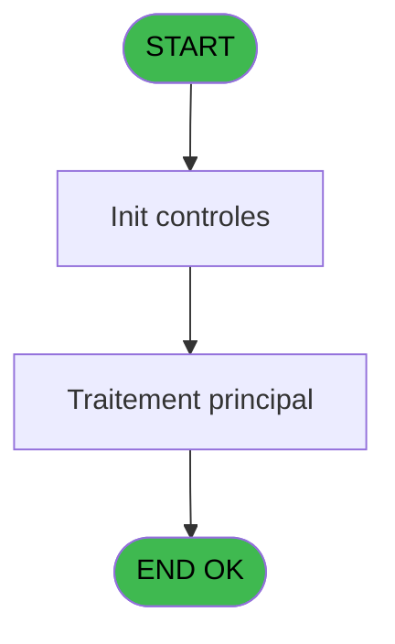
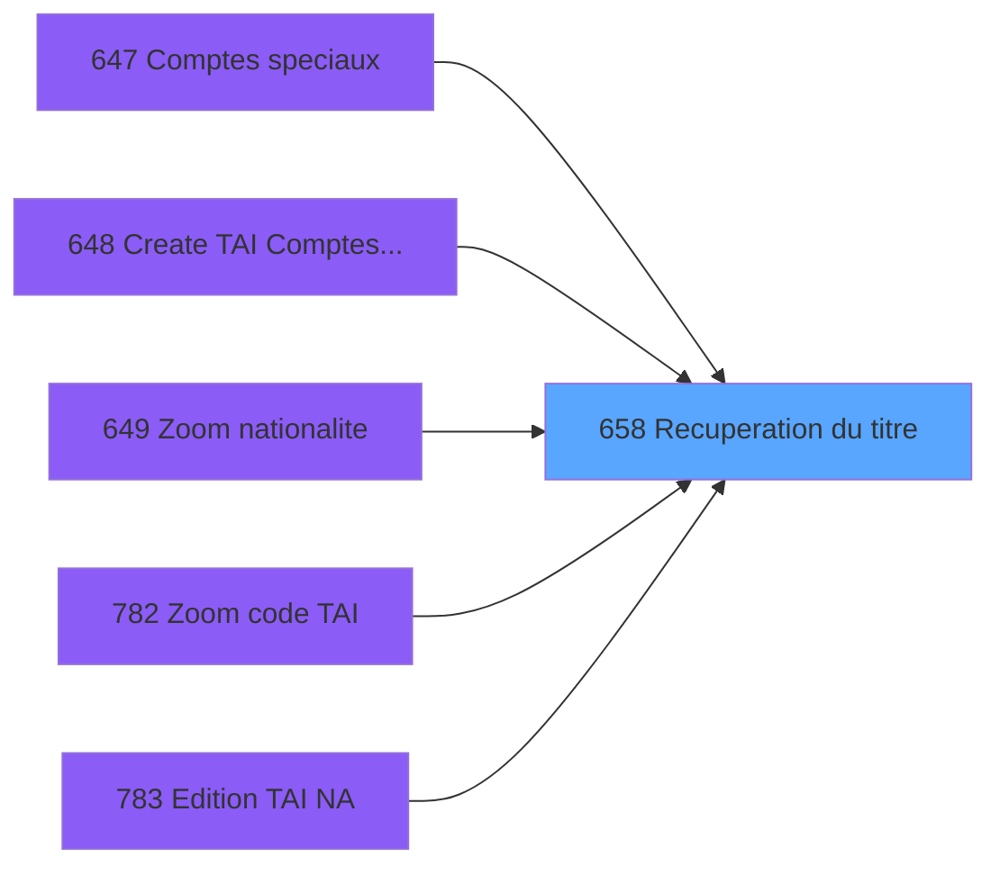

# REF IDE 658 - Recuperation du titre

> **Analyse**: Phases 1-4 2026-02-03 13:28 -> 13:28 (17s) | Assemblage 13:28
> **Pipeline**: V7.2 Enrichi
> **Structure**: 4 onglets (Resume | Ecrans | Donnees | Connexions)

<!-- TAB:Resume -->

## 1. FICHE D'IDENTITE

| Attribut | Valeur |
|----------|--------|
| Projet | REF |
| IDE Position | 658 |
| Nom Programme | Recuperation du titre |
| Fichier source | `Prg_658.xml` |
| Dossier IDE | General |
| Taches | 1 (0 ecrans visibles) |
| Tables modifiees | 0 |
| Programmes appeles | 0 |

## 2. DESCRIPTION FONCTIONNELLE

**Recuperation du titre** assure la gestion complete de ce processus, accessible depuis [Comptes speciaux (IDE 647)](REF-IDE-647.md), [Create TAI Comptes speciaux (IDE 648)](REF-IDE-648.md), [Zoom nationalite (IDE 649)](REF-IDE-649.md), [Zoom code TAI (IDE 782)](REF-IDE-782.md), [Edition TAI NA (IDE 783)](REF-IDE-783.md), [Gestion Aéroport/Gare (IDE 833)](REF-IDE-833.md), [Saisie des tickets TPE (IDE 878)](REF-IDE-878.md).

Le flux de traitement s'organise en **1 blocs fonctionnels** :

- **Traitement** (1 tache) : traitements metier divers

**Logique metier** : 1 regles identifiees couvrant conditions metier.

## 3. BLOCS FONCTIONNELS

### 3.1 Traitement (1 tache)

Traitements internes.

---

#### 658 - Recuperation du titre

**Role** : Consultation/chargement : Recuperation du titre.

## 5. REGLES METIER

1 regles identifiees:

### Autres (1 regles)

#### [RM-001] Traitement si > type  de programme [C] est renseigne

| Element | Detail |
|---------|--------|
| **Condition** | `> type  de programme [C]<>''` |
| **Si vrai** | > type  de programme [C] |
| **Si faux** | 'CV') |
| **Variables** | C (> type  de programme) |
| **Expression source** | Expression 4 : `IF(> type  de programme [C]<>'',> type  de programme [C],'CV` |
| **Exemple** | Si > type  de programme [C]<>'' → > type  de programme [C]. Sinon → 'CV') |

## 6. CONTEXTE

- **Appele par**: [Comptes speciaux (IDE 647)](REF-IDE-647.md), [Create TAI Comptes speciaux (IDE 648)](REF-IDE-648.md), [Zoom nationalite (IDE 649)](REF-IDE-649.md), [Zoom code TAI (IDE 782)](REF-IDE-782.md), [Edition TAI NA (IDE 783)](REF-IDE-783.md), [Gestion Aéroport/Gare (IDE 833)](REF-IDE-833.md), [Saisie des tickets TPE (IDE 878)](REF-IDE-878.md)
- **Appelle**: 0 programmes | **Tables**: 1 (W:0 R:1 L:0) | **Taches**: 1 | **Expressions**: 4

<!-- TAB:Ecrans -->

## 8. ECRANS

*(Programme sans ecran visible)*

## 9. NAVIGATION

### 9.3 Structure hierarchique (1 tache)

| Position | Tache | Type | Dimensions | Bloc |
|----------|-------|------|------------|------|
| **658.1** | [**Recuperation du titre** (658)](#t1) | MDI | - | Traitement |

### 9.4 Algorigramme

> **Legende**: Vert = START/END OK | Rouge = END KO | Bleu = Decisions
> *Algorigramme auto-genere. Utiliser `/algorigramme` pour une synthese metier detaillee.*

<!-- TAB:Donnees -->

## 10. TABLES

### Tables utilisees (1)

| ID | Nom | Description | Type | R | W | L | Usages |
|----|-----|-------------|------|---|---|---|--------|
| 699 | ecran | Table temporaire ecran | DB | R |   |   | 1 |

### Colonnes par table (1 / 1 tables avec colonnes identifiees)

Table 699 - ecran (R) - 1 usages

| Lettre | Variable | Acces | Type |
|--------|----------|-------|------|
| A | > code ecran | R | Numeric |
| B | < nom ecran | R | Alpha |
| C | > type  de programme | R | Alpha |

## 11. VARIABLES

### 11.1 Autres (3)

Variables diverses.

| Lettre | Nom | Type | Usage dans |
|--------|-----|------|-----------|
| A | > code ecran | Numeric | 1x refs |
| B | < nom ecran | Alpha | - |
| C | > type  de programme | Alpha | 1x refs |

## 12. EXPRESSIONS

**4 / 4 expressions decodees (100%)**

### 12.1 Repartition par type

| Type | Expressions | Regles |
|------|-------------|--------|
| CONCATENATION | 1 | 0 |
| CONDITION | 2 | 5 |
| OTHER | 1 | 0 |

### 12.2 Expressions cles par type

#### CONCATENATION (1 expressions)

| Type | IDE | Expression | Regle |
|------|-----|------------|-------|
| CONCATENATION | 3 | `Trim ([G])&' - '&Trim ([H])` | - |

#### CONDITION (2 expressions)

| Type | IDE | Expression | Regle |
|------|-----|------------|-------|
| CONDITION | 4 | `IF(> type  de programme [C]<>'',> type  de programme [C],'CV')` | [RM-001](#rm-RM-001) |
| CONDITION | 2 | `> code ecran [A]` | - |

#### OTHER (1 expressions)

| Type | IDE | Expression | Regle |
|------|-----|------------|-------|
| OTHER | 1 | `GetParam ('CODELANGUE')` | - |

<!-- TAB:Connexions -->

## 13. GRAPHE D'APPELS

### 13.1 Chaine depuis Main (Callers)

Main -> ... -> [Comptes speciaux (IDE 647)](REF-IDE-647.md) -> **Recuperation du titre (IDE 658)**

Main -> ... -> [Create TAI Comptes speciaux (IDE 648)](REF-IDE-648.md) -> **Recuperation du titre (IDE 658)**

Main -> ... -> [Zoom nationalite (IDE 649)](REF-IDE-649.md) -> **Recuperation du titre (IDE 658)**

Main -> ... -> [Zoom code TAI (IDE 782)](REF-IDE-782.md) -> **Recuperation du titre (IDE 658)**

Main -> ... -> [Edition TAI NA (IDE 783)](REF-IDE-783.md) -> **Recuperation du titre (IDE 658)**

Main -> ... -> [Gestion Aéroport/Gare (IDE 833)](REF-IDE-833.md) -> **Recuperation du titre (IDE 658)**

Main -> ... -> [Saisie des tickets TPE (IDE 878)](REF-IDE-878.md) -> **Recuperation du titre (IDE 658)**

### 13.2 Callers

| IDE | Nom Programme | Nb Appels |
|-----|---------------|-----------|
| [647](REF-IDE-647.md) | Comptes speciaux | 2 |
| [648](REF-IDE-648.md) | Create TAI Comptes speciaux | 1 |
| [649](REF-IDE-649.md) | Zoom nationalite | 1 |
| [782](REF-IDE-782.md) | Zoom code TAI | 1 |
| [783](REF-IDE-783.md) | Edition TAI NA | 1 |
| [833](REF-IDE-833.md) | Gestion Aéroport/Gare | 1 |
| [878](REF-IDE-878.md) | Saisie des tickets TPE | 1 |

### 13.3 Callees (programmes appeles)

### 13.4 Detail Callees avec contexte

| IDE | Nom Programme | Appels | Contexte |
|-----|---------------|--------|----------|
| - | (aucun) | - | - |

## 14. RECOMMANDATIONS MIGRATION

### 14.1 Profil du programme

| Metrique | Valeur | Impact migration |
|----------|--------|-----------------|
| Lignes de logique | 13 | Programme compact |
| Expressions | 4 | Peu de logique |
| Tables WRITE | 0 | Impact faible |
| Sous-programmes | 0 | Peu de dependances |
| Ecrans visibles | 0 | Ecran unique ou traitement batch |
| Code desactive | 0% (0 / 13) | Code sain |
| Regles metier | 1 | Quelques regles a preserver |

### 14.2 Plan de migration par bloc

#### Traitement (1 tache: 0 ecran, 1 traitement)

- **Strategie** : 1 service(s) backend injectable(s) (Domain Services).
- Decomposer les taches en services unitaires testables.

### 14.3 Dependances critiques

| Dependance | Type | Appels | Impact |
|------------|------|--------|--------|

---
*Spec DETAILED generee par Pipeline V7.2 - 2026-02-03 13:28*
