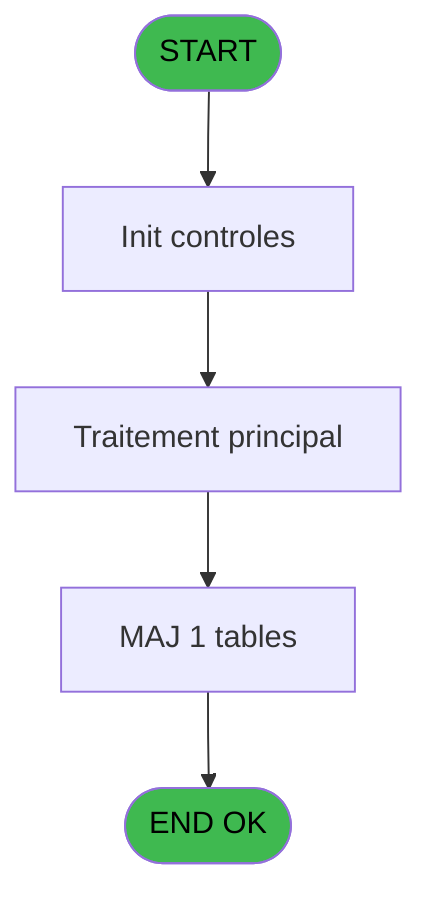

# REF IDE 661 - Calcul position reglage

> **Analyse**: Phases 1-4 2026-02-03 13:29 -> 13:29 (18s) | Assemblage 13:29
> **Pipeline**: V7.2 Enrichi
> **Structure**: 4 onglets (Resume | Ecrans | Donnees | Connexions)

<!-- TAB:Resume -->

## 1. FICHE D'IDENTITE

| Attribut | Valeur |
|----------|--------|
| Projet | REF |
| IDE Position | 661 |
| Nom Programme | Calcul position reglage |
| Fichier source | `Prg_661.xml` |
| Dossier IDE | General |
| Taches | 3 (0 ecrans visibles) |
| Tables modifiees | 1 |
| Programmes appeles | 0 |

## 2. DESCRIPTION FONCTIONNELLE

**Calcul position reglage** assure la gestion complete de ce processus, accessible depuis [Test Calcul Reglage (IDE 662)](REF-IDE-662.md).

Le flux de traitement s'organise en **2 blocs fonctionnels** :

- **Traitement** (2 taches) : traitements metier divers
- **Reglement** (1 tache) : gestion des moyens de paiement et reglements

**Donnees modifiees** : 1 tables en ecriture (position_reglage_ski).

Detail : phases du traitement

#### Phase 1 : Reglement (1 tache)

- **661** - Calcul position reglage

#### Phase 2 : Traitement (2 taches)

- **661.1** - Recup ligne taille / poids
- **661.2** - Lecture nouvelle ligne

#### Tables impactees

| Table | Operations | Role metier |
|-------|-----------|-------------|
| position_reglage_ski | **W** (2 usages) |  |

## 3. BLOCS FONCTIONNELS

### 3.1 Reglement (1 tache)

Gestion des moyens de paiement : 1 tache de reglement.

---

#### 661 - Calcul position reglage

**Role** : Calcul : Calcul position reglage.
**Variables liees** : G (P.o.Position reglage alpha), H (P.o.Position reglage num)

### 3.2 Traitement (2 taches)

Traitements internes.

---

#### 661.1 - Recup ligne taille / poids

**Role** : Consultation/chargement : Recup ligne taille / poids.
**Variables liees** : C (P.i.Poids), F (P.i.Taille), I (v.Num ligne taille / poids)

---

#### 661.2 - Lecture nouvelle ligne

**Role** : Creation d'enregistrement : Lecture nouvelle ligne.
**Variables liees** : I (v.Num ligne taille / poids)

## 5. REGLES METIER

*(Aucune regle metier identifiee)*

## 6. CONTEXTE

- **Appele par**: [Test Calcul Reglage (IDE 662)](REF-IDE-662.md)
- **Appelle**: 0 programmes | **Tables**: 2 (W:1 R:0 L:1) | **Taches**: 3 | **Expressions**: 8

<!-- TAB:Ecrans -->

## 8. ECRANS

*(Programme sans ecran visible)*

## 9. NAVIGATION

### 9.3 Structure hierarchique (3 taches)

| Position | Tache | Type | Dimensions | Bloc |
|----------|-------|------|------------|------|
| **661.1** | [**Calcul position reglage** (661)](#t1) | - | - | Reglement |
| **661.2** | [**Recup ligne taille / poids** (661.1)](#t2) | - | - | Traitement |
| 661.2.1 | [Lecture nouvelle ligne (661.2)](#t3) | - | - | |

### 9.4 Algorigramme

> **Legende**: Vert = START/END OK | Rouge = END KO | Bleu = Decisions
> *Algorigramme auto-genere. Utiliser `/algorigramme` pour une synthese metier detaillee.*

<!-- TAB:Donnees -->

## 10. TABLES

### Tables utilisees (2)

| ID | Nom | Description | Type | R | W | L | Usages |
|----|-----|-------------|------|---|---|---|--------|
| 789 | position_reglage_ski |  | DB |   | **W** |   | 2 |
| 931 | Table_931 |  | MEM |   |   | L | 1 |

### Colonnes par table (1 / 1 tables avec colonnes identifiees)

Table 789 - position_reglage_ski (**W**) - 2 usages

| Lettre | Variable | Acces | Type |
|--------|----------|-------|------|
| A | P.i.Sexe | W | Alpha |
| B | P.i.Age | W | Numeric |
| C | P.i.Poids | W | Numeric |
| D | P.i.Pointure | W | Numeric |
| E | P.i.Niveau pratique | W | Alpha |
| F | P.i.Taille | W | Numeric |
| G | P.o.Position reglage alpha | W | Alpha |
| H | P.o.Position reglage num | W | Numeric |
| I | v.Num ligne taille / poids | W | Numeric |
| J | v.retour ajustement | W | Logical |

## 11. VARIABLES

### 11.1 Parametres entrants (8)

Variables recues du programme appelant ([Test Calcul Reglage (IDE 662)](REF-IDE-662.md)).

| Lettre | Nom | Type | Usage dans |
|--------|-----|------|-----------|
| A | P.i.Sexe | Alpha | 1x parametre entrant |
| B | P.i.Age | Numeric | 1x parametre entrant |
| C | P.i.Poids | Numeric | - |
| D | P.i.Pointure | Numeric | 1x parametre entrant |
| E | P.i.Niveau pratique | Alpha | 1x parametre entrant |
| F | P.i.Taille | Numeric | - |
| G | P.o.Position reglage alpha | Alpha | - |
| H | P.o.Position reglage num | Numeric | - |

### 11.2 Variables de session (2)

Variables persistantes pendant toute la session.

| Lettre | Nom | Type | Usage dans |
|--------|-----|------|-----------|
| I | v.Num ligne taille / poids | Numeric | - |
| J | v.retour ajustement | Logical | - |

## 12. EXPRESSIONS

**8 / 8 expressions decodees (100%)**

### 12.1 Repartition par type

| Type | Expressions | Regles |
|------|-------------|--------|
| OTHER | 7 | 0 |
| STRING | 1 | 0 |

### 12.2 Expressions cles par type

#### OTHER (7 expressions)

| Type | IDE | Expression | Regle |
|------|-----|------------|-------|
| OTHER | 5 | `[O]` | - |
| OTHER | 6 | `P.i.Age [B]` | - |
| OTHER | 8 | `[P]` | - |
| OTHER | 4 | `[N]` | - |
| OTHER | 1 | `P.i.Sexe [A]` | - |
| ... | | *+2 autres* | |

#### STRING (1 expressions)

| Type | IDE | Expression | Regle |
|------|-----|------------|-------|
| STRING | 7 | `Val(P.i.Niveau pratique [E],'')` | - |

<!-- TAB:Connexions -->

## 13. GRAPHE D'APPELS

### 13.1 Chaine depuis Main (Callers)

Main -> ... -> [Test Calcul Reglage (IDE 662)](REF-IDE-662.md) -> **Calcul position reglage (IDE 661)**

### 13.2 Callers

| IDE | Nom Programme | Nb Appels |
|-----|---------------|-----------|
| [662](REF-IDE-662.md) | Test Calcul Reglage | 1 |

### 13.3 Callees (programmes appeles)

### 13.4 Detail Callees avec contexte

| IDE | Nom Programme | Appels | Contexte |
|-----|---------------|--------|----------|
| - | (aucun) | - | - |

## 14. RECOMMANDATIONS MIGRATION

### 14.1 Profil du programme

| Metrique | Valeur | Impact migration |
|----------|--------|-----------------|
| Lignes de logique | 45 | Programme compact |
| Expressions | 8 | Peu de logique |
| Tables WRITE | 1 | Impact faible |
| Sous-programmes | 0 | Peu de dependances |
| Ecrans visibles | 0 | Ecran unique ou traitement batch |
| Code desactive | 0% (0 / 45) | Code sain |
| Regles metier | 0 | Pas de regle identifiee |

### 14.2 Plan de migration par bloc

#### Reglement (1 tache: 0 ecran, 1 traitement)

- **Strategie** : Service `IReglementService` avec pattern Strategy par mode de paiement.
- Integration TPE si applicable

#### Traitement (2 taches: 0 ecran, 2 traitements)

- **Strategie** : 2 service(s) backend injectable(s) (Domain Services).
- Decomposer les taches en services unitaires testables.

### 14.3 Dependances critiques

| Dependance | Type | Appels | Impact |
|------------|------|--------|--------|
| position_reglage_ski | Table WRITE (Database) | 2x | Schema + repository |

---
*Spec DETAILED generee par Pipeline V7.2 - 2026-02-03 13:29*
