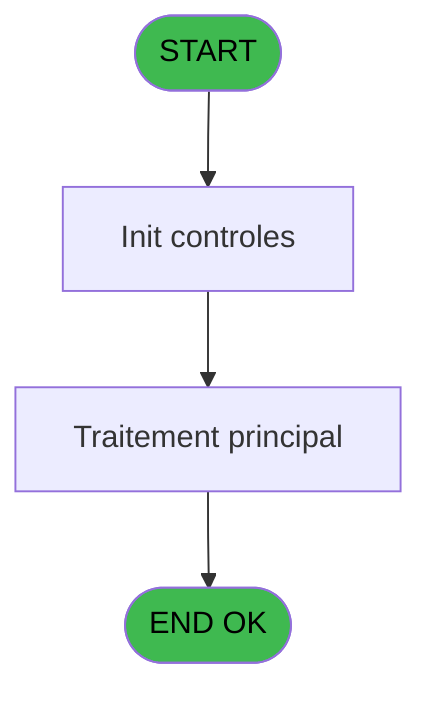
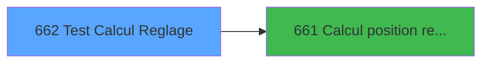

# REF IDE 662 - Test Calcul Reglage

> **Analyse**: Phases 1-4 2026-02-03 13:30 -> 13:30 (20s) | Assemblage 13:30
> **Pipeline**: V7.2 Enrichi
> **Structure**: 4 onglets (Resume | Ecrans | Donnees | Connexions)

<!-- TAB:Resume -->

## 1. FICHE D'IDENTITE

| Attribut | Valeur |
|----------|--------|
| Projet | REF |
| IDE Position | 662 |
| Nom Programme | Test Calcul Reglage |
| Fichier source | `Prg_662.xml` |
| Dossier IDE | General |
| Taches | 1 (1 ecrans visibles) |
| Tables modifiees | 0 |
| Programmes appeles | 1 |
| :warning: Statut | **ORPHELIN_POTENTIEL** |

## 2. DESCRIPTION FONCTIONNELLE

**Test Calcul Reglage** assure la gestion complete de ce processus.

Le flux de traitement s'organise en **1 blocs fonctionnels** :

- **Reglement** (1 tache) : gestion des moyens de paiement et reglements

## 3. BLOCS FONCTIONNELS

### 3.1 Reglement (1 tache)

Gestion des moyens de paiement : 1 tache de reglement.

---

#### 662 - Test Calcul Reglage [[ECRAN]](#ecran-t1)

**Role** : Calcul : Test Calcul Reglage.
**Ecran** : 396 x 98 DLU | [Voir mockup](#ecran-t1)
**Delegue a** : [Calcul position reglage (IDE 661)](REF-IDE-661.md)

## 5. REGLES METIER

*(Aucune regle metier identifiee)*

## 6. CONTEXTE

- **Appele par**: (aucun)
- **Appelle**: 1 programmes | **Tables**: 0 (W:0 R:0 L:0) | **Taches**: 1 | **Expressions**: 0

<!-- TAB:Ecrans -->

## 8. ECRANS

### 8.1 Forms visibles (1 / 1)

| # | Position | Tache | Nom | Type | Largeur | Hauteur | Bloc |
|---|----------|-------|-----|------|---------|---------|------|
| 1 | 662 | 662 | Test Calcul Reglage | Type0 | 396 | 98 | Reglement |

### 8.2 Mockups Ecrans

---

#### 662 - Test Calcul Reglage
**Tache** : [662](#t1) | **Type** : Type0 | **Dimensions** : 396 x 98 DLU
**Bloc** : Reglement | **Titre IDE** : Test Calcul Reglage

<!-- FORM-DATA:
{
    "width":  396,
    "vFactor":  8,
    "type":  "Type0",
    "hFactor":  4,
    "controls":  [
                     {
                         "x":  20,
                         "type":  "label",
                         "var":  "",
                         "y":  8,
                         "w":  28,
                         "fmt":  "",
                         "name":  "",
                         "h":  9,
                         "color":  "",
                         "text":  "v.Sexe",
                         "parent":  null
                     },
                     {
                         "x":  268,
                         "type":  "label",
                         "var":  "",
                         "y":  8,
                         "w":  62,
                         "fmt":  "",
                         "name":  "",
                         "h":  9,
                         "color":  "",
                         "text":  "v.Position Alpha",
                         "parent":  null
                     },
                     {
                         "x":  20,
                         "type":  "label",
                         "var":  "",
                         "y":  24,
                         "w":  24,
                         "fmt":  "",
                         "name":  "",
                         "h":  9,
                         "color":  "",
                         "text":  "v.Age",
                         "parent":  null
                     },
                     {
                         "x":  268,
                         "type":  "label",
                         "var":  "",
                         "y":  24,
                         "w":  58,
                         "fmt":  "",
                         "name":  "",
                         "h":  9,
                         "color":  "",
                         "text":  "v.Position Num",
                         "parent":  null
                     },
                     {
                         "x":  20,
                         "type":  "label",
                         "var":  "",
                         "y":  40,
                         "w":  30,
                         "fmt":  "",
                         "name":  "",
                         "h":  9,
                         "color":  "",
                         "text":  "v.Poids",
                         "parent":  null
                     },
                     {
                         "x":  20,
                         "type":  "label",
                         "var":  "",
                         "y":  56,
                         "w":  29,
                         "fmt":  "",
                         "name":  "",
                         "h":  9,
                         "color":  "",
                         "text":  "v.Taille",
                         "parent":  null
                     },
                     {
                         "x":  20,
                         "type":  "label",
                         "var":  "",
                         "y":  72,
                         "w":  40,
                         "fmt":  "",
                         "name":  "",
                         "h":  9,
                         "color":  "",
                         "text":  "v.Pointure",
                         "parent":  null
                     },
                     {
                         "x":  20,
                         "type":  "label",
                         "var":  "",
                         "y":  88,
                         "w":  40,
                         "fmt":  "",
                         "name":  "",
                         "h":  9,
                         "color":  "",
                         "text":  "v.Pratique",
                         "parent":  null
                     },
                     {
                         "x":  81,
                         "type":  "edit",
                         "var":  "",
                         "y":  8,
                         "w":  9,
                         "fmt":  "",
                         "name":  "v.Sexe",
                         "h":  10,
                         "color":  "",
                         "text":  "",
                         "parent":  null
                     },
                     {
                         "x":  158,
                         "type":  "button",
                         "var":  "",
                         "y":  8,
                         "w":  80,
                         "fmt":  "Calcul",
                         "name":  "",
                         "h":  14,
                         "color":  "",
                         "text":  "",
                         "parent":  null
                     },
                     {
                         "x":  334,
                         "type":  "edit",
                         "var":  "",
                         "y":  8,
                         "w":  59,
                         "fmt":  "",
                         "name":  "v.Position Alpha",
                         "h":  10,
                         "color":  "",
                         "text":  "",
                         "parent":  null
                     },
                     {
                         "x":  72,
                         "type":  "edit",
                         "var":  "",
                         "y":  24,
                         "w":  18,
                         "fmt":  "",
                         "name":  "v.Age",
                         "h":  10,
                         "color":  "",
                         "text":  "",
                         "parent":  null
                     },
                     {
                         "x":  334,
                         "type":  "edit",
                         "var":  "",
                         "y":  24,
                         "w":  37,
                         "fmt":  "",
                         "name":  "v.Position Num",
                         "h":  10,
                         "color":  "",
                         "text":  "",
                         "parent":  null
                     },
                     {
                         "x":  72,
                         "type":  "edit",
                         "var":  "",
                         "y":  40,
                         "w":  18,
                         "fmt":  "",
                         "name":  "v.Poids",
                         "h":  10,
                         "color":  "",
                         "text":  "",
                         "parent":  null
                     },
                     {
                         "x":  72,
                         "type":  "edit",
                         "var":  "",
                         "y":  56,
                         "w":  18,
                         "fmt":  "",
                         "name":  "v.Taille",
                         "h":  10,
                         "color":  "",
                         "text":  "",
                         "parent":  null
                     },
                     {
                         "x":  72,
                         "type":  "edit",
                         "var":  "",
                         "y":  72,
                         "w":  18,
                         "fmt":  "",
                         "name":  "v.Pointure",
                         "h":  10,
                         "color":  "",
                         "text":  "",
                         "parent":  null
                     },
                     {
                         "x":  72,
                         "type":  "edit",
                         "var":  "",
                         "y":  88,
                         "w":  14,
                         "fmt":  "",
                         "name":  "v.Pratique",
                         "h":  10,
                         "color":  "",
                         "text":  "",
                         "parent":  null
                     }
                 ],
    "taskId":  "662",
    "height":  98
}
-->

<strong>Champs : 8 champs</strong>

| Pos (x,y) | Nom | Variable | Type |
|-----------|-----|----------|------|
| 81,8 | v.Sexe | - | edit |
| 334,8 | v.Position Alpha | - | edit |
| 72,24 | v.Age | - | edit |
| 334,24 | v.Position Num | - | edit |
| 72,40 | v.Poids | - | edit |
| 72,56 | v.Taille | - | edit |
| 72,72 | v.Pointure | - | edit |
| 72,88 | v.Pratique | - | edit |

<strong>Boutons : 1 boutons</strong>

| Bouton | Pos (x,y) | Action |
|--------|-----------|--------|
| Calcul | 158,8 | Appel [Calcul position reglage (IDE 661)](REF-IDE-661.md) |

## 9. NAVIGATION

Ecran unique: **Test Calcul Reglage**

### 9.3 Structure hierarchique (1 tache)

| Position | Tache | Type | Dimensions | Bloc |
|----------|-------|------|------------|------|
| **662.1** | [**Test Calcul Reglage** (662)](#t1) [mockup](#ecran-t1) | - | 396x98 | Reglement |

### 9.4 Algorigramme

> **Legende**: Vert = START/END OK | Rouge = END KO | Bleu = Decisions
> *Algorigramme auto-genere. Utiliser `/algorigramme` pour une synthese metier detaillee.*

<!-- TAB:Donnees -->

## 10. TABLES

### Tables utilisees (0)

| ID | Nom | Description | Type | R | W | L | Usages |
|----|-----|-------------|------|---|---|---|--------|

### Colonnes par table (0 / 0 tables avec colonnes identifiees)

## 11. VARIABLES

### 11.1 Variables de session (8)

Variables persistantes pendant toute la session.

| Lettre | Nom | Type | Usage dans |
|--------|-----|------|-----------|
| A | v.Sexe | Alpha | - |
| B | v.Age | Numeric | - |
| C | v.Poids | Numeric | - |
| D | v.Taille | Numeric | - |
| E | v.Pratique | Alpha | - |
| F | v.Pointure | Numeric | - |
| G | v.Position Alpha | Unicode | - |
| H | v.Position Num | Numeric | - |

## 12. EXPRESSIONS

**0 / 0 expressions decodees (0%)**

### 12.1 Repartition par type

| Type | Expressions | Regles |
|------|-------------|--------|

### 12.2 Expressions cles par type

<!-- TAB:Connexions -->

## 13. GRAPHE D'APPELS

### 13.1 Chaine depuis Main (Callers)

**Chemin**: (pas de callers directs)

### 13.2 Callers

| IDE | Nom Programme | Nb Appels |
|-----|---------------|-----------|
| - | (aucun) | - |

### 13.3 Callees (programmes appeles)

### 13.4 Detail Callees avec contexte

| IDE | Nom Programme | Appels | Contexte |
|-----|---------------|--------|----------|
| [661](REF-IDE-661.md) | Calcul position reglage | 1 | Calcul de donnees |

## 14. RECOMMANDATIONS MIGRATION

### 14.1 Profil du programme

| Metrique | Valeur | Impact migration |
|----------|--------|-----------------|
| Lignes de logique | 10 | Programme compact |
| Expressions | 0 | Peu de logique |
| Tables WRITE | 0 | Impact faible |
| Sous-programmes | 1 | Peu de dependances |
| Ecrans visibles | 1 | Ecran unique ou traitement batch |
| Code desactive | 0% (0 / 10) | Code sain |
| Regles metier | 0 | Pas de regle identifiee |

### 14.2 Plan de migration par bloc

#### Reglement (1 tache: 1 ecran, 0 traitement)

- **Strategie** : Service `IReglementService` avec pattern Strategy par mode de paiement.
- Integration TPE si applicable

### 14.3 Dependances critiques

| Dependance | Type | Appels | Impact |
|------------|------|--------|--------|
| [Calcul position reglage (IDE 661)](REF-IDE-661.md) | Sous-programme | 1x | Normale - Calcul de donnees |

---
*Spec DETAILED generee par Pipeline V7.2 - 2026-02-03 13:30*
