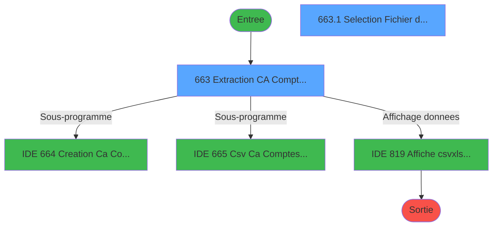
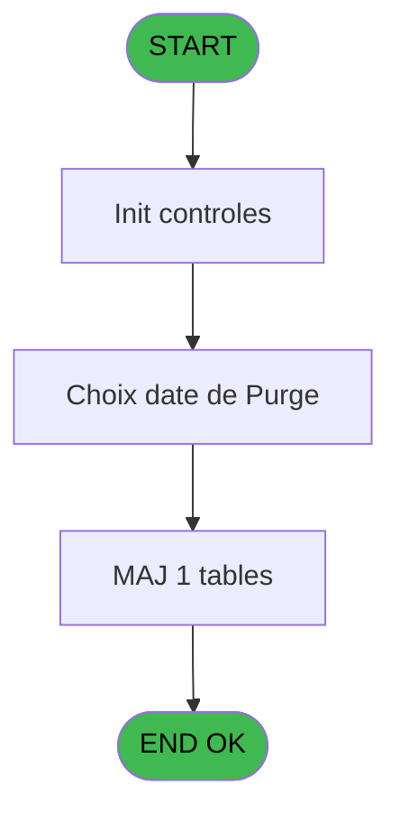
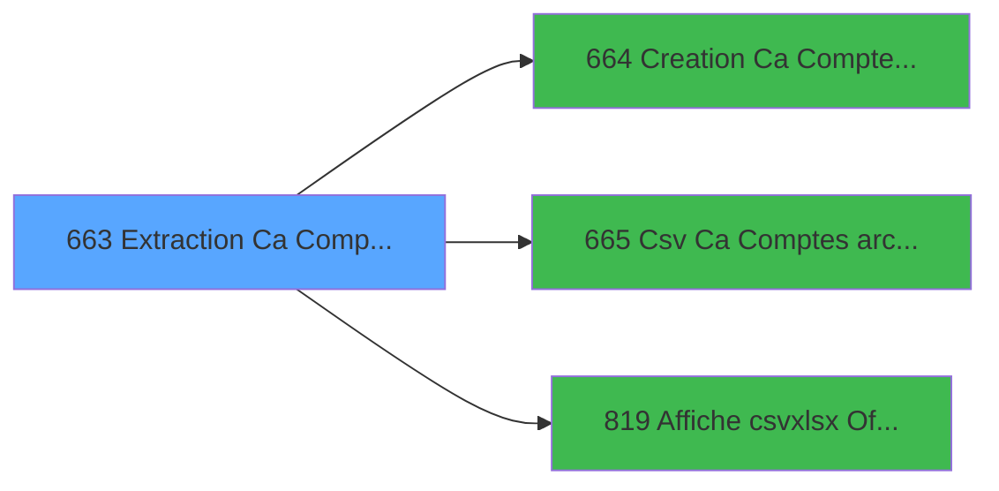

# REF IDE 663 - Extraction Ca Comptes Archivés

> **Analyse**: Phases 1-4 2026-02-03 13:30 -> 13:30 (22s) | Assemblage 13:30
> **Pipeline**: V7.2 Enrichi
> **Structure**: 4 onglets (Resume | Ecrans | Donnees | Connexions)

<!-- TAB:Resume -->

## 1. FICHE D'IDENTITE

| Attribut | Valeur |
|----------|--------|
| Projet | REF |
| IDE Position | 663 |
| Nom Programme | Extraction Ca Comptes Archivés |
| Fichier source | `Prg_663.xml` |
| Dossier IDE | Comptabilite |
| Taches | 2 (2 ecrans visibles) |
| Tables modifiees | 1 |
| Programmes appeles | 3 |
| :warning: Statut | **ORPHELIN_POTENTIEL** |

## 2. DESCRIPTION FONCTIONNELLE

**Extraction Ca Comptes Archivés** assure la gestion complete de ce processus.

Le flux de traitement s'organise en **2 blocs fonctionnels** :

- **Consultation** (1 tache) : ecrans de recherche, selection et consultation
- **Calcul** (1 tache) : calculs de montants, stocks ou compteurs

**Donnees modifiees** : 1 tables en ecriture (derniere_purge___pur).

Detail : phases du traitement

#### Phase 1 : Calcul (1 tache)

- **663** - Extraction CA Comptes Archivés **[[ECRAN]](#ecran-t1)**

Delegue a : [Creation Ca Comptes Archivés (IDE 664)](REF-IDE-664.md), [Csv Ca Comptes archivés (IDE 665)](REF-IDE-665.md)

#### Phase 2 : Consultation (1 tache)

- **663.1** - Selection Fichier d'Archivage **[[ECRAN]](#ecran-t2)**

Delegue a : [Affiche csv/xlsx Office Web (IDE 819)](REF-IDE-819.md)

#### Tables impactees

| Table | Operations | Role metier |
|-------|-----------|-------------|
| derniere_purge___pur | R/**W** (2 usages) |  |

## 3. BLOCS FONCTIONNELS

### 3.1 Calcul (1 tache)

Calculs metier : montants, stocks, compteurs.

---

#### 663 - Extraction CA Comptes Archivés [[ECRAN]](#ecran-t1)

**Role** : Traitement : Extraction CA Comptes Archivés.
**Ecran** : 430 x 158 DLU | [Voir mockup](#ecran-t1)
**Delegue a** : [Creation Ca Comptes Archivés (IDE 664)](REF-IDE-664.md), [Csv Ca Comptes archivés (IDE 665)](REF-IDE-665.md)

### 3.2 Consultation (1 tache)

Ecrans de recherche et consultation.

---

#### 663.1 - Selection Fichier d'Archivage [[ECRAN]](#ecran-t2)

**Role** : Selection par l'operateur : Selection Fichier d'Archivage.
**Ecran** : 350 x 214 DLU (MDI) | [Voir mockup](#ecran-t2)
**Variables liees** : F (v nom fichier csv)
**Delegue a** : [Affiche csv/xlsx Office Web (IDE 819)](REF-IDE-819.md)

## 5. REGLES METIER

*(Aucune regle metier identifiee)*

## 6. CONTEXTE

- **Appele par**: (aucun)
- **Appelle**: 3 programmes | **Tables**: 2 (W:1 R:1 L:1) | **Taches**: 2 | **Expressions**: 13

<!-- TAB:Ecrans -->

## 8. ECRANS

### 8.1 Forms visibles (2 / 2)

| # | Position | Tache | Nom | Type | Largeur | Hauteur | Bloc |
|---|----------|-------|-----|------|---------|---------|------|
| 1 | 663 | 663 | Extraction CA Comptes Archivés | Type0 | 430 | 158 | Calcul |
| 2 | 663.1 | 663.1 | Selection Fichier d'Archivage | MDI | 350 | 214 | Consultation |

### 8.2 Mockups Ecrans

---

#### 663 - Extraction CA Comptes Archivés
**Tache** : [663](#t1) | **Type** : Type0 | **Dimensions** : 430 x 158 DLU
**Bloc** : Calcul | **Titre IDE** : Extraction CA Comptes Archivés

<!-- FORM-DATA:
{
    "width":  430,
    "vFactor":  8,
    "type":  "Type0",
    "hFactor":  4,
    "controls":  [
                     {
                         "x":  2,
                         "type":  "label",
                         "var":  "",
                         "y":  3,
                         "w":  422,
                         "fmt":  "",
                         "name":  "",
                         "h":  18,
                         "color":  "",
                         "text":  "",
                         "parent":  null
                     },
                     {
                         "x":  2,
                         "type":  "label",
                         "var":  "",
                         "y":  25,
                         "w":  422,
                         "fmt":  "",
                         "name":  "",
                         "h":  99,
                         "color":  "",
                         "text":  "",
                         "parent":  null
                     },
                     {
                         "x":  146,
                         "type":  "label",
                         "var":  "",
                         "y":  52,
                         "w":  69,
                         "fmt":  "",
                         "name":  "",
                         "h":  10,
                         "color":  "",
                         "text":  "Date début",
                         "parent":  null
                     },
                     {
                         "x":  146,
                         "type":  "label",
                         "var":  "",
                         "y":  66,
                         "w":  69,
                         "fmt":  "",
                         "name":  "",
                         "h":  10,
                         "color":  "",
                         "text":  "Date fin",
                         "parent":  null
                     },
                     {
                         "x":  146,
                         "type":  "label",
                         "var":  "",
                         "y":  78,
                         "w":  69,
                         "fmt":  "",
                         "name":  "",
                         "h":  12,
                         "color":  "",
                         "text":  "Type d\u0027extraction",
                         "parent":  null
                     },
                     {
                         "x":  2,
                         "type":  "label",
                         "var":  "",
                         "y":  127,
                         "w":  422,
                         "fmt":  "",
                         "name":  "",
                         "h":  24,
                         "color":  "",
                         "text":  "",
                         "parent":  null
                     },
                     {
                         "x":  9,
                         "type":  "edit",
                         "var":  "",
                         "y":  8,
                         "w":  186,
                         "fmt":  "30",
                         "name":  "VG.USER",
                         "h":  8,
                         "color":  "",
                         "text":  "",
                         "parent":  null
                     },
                     {
                         "x":  288,
                         "type":  "edit",
                         "var":  "",
                         "y":  8,
                         "w":  131,
                         "fmt":  "WWW  DD MMM YYYYT",
                         "name":  "",
                         "h":  8,
                         "color":  "",
                         "text":  "",
                         "parent":  null
                     },
                     {
                         "x":  65,
                         "type":  "image",
                         "var":  "",
                         "y":  49,
                         "w":  77,
                         "fmt":  "",
                         "name":  "",
                         "h":  45,
                         "color":  "",
                         "text":  "",
                         "parent":  null
                     },
                     {
                         "x":  225,
                         "type":  "edit",
                         "var":  "",
                         "y":  52,
                         "w":  63,
                         "fmt":  "",
                         "name":  "v date début",
                         "h":  10,
                         "color":  "6",
                         "text":  "",
                         "parent":  null
                     },
                     {
                         "x":  292,
                         "type":  "button",
                         "var":  "",
                         "y":  52,
                         "w":  18,
                         "fmt":  "...",
                         "name":  "b date debut purge",
                         "h":  10,
                         "color":  "",
                         "text":  "",
                         "parent":  null
                     },
                     {
                         "x":  225,
                         "type":  "edit",
                         "var":  "",
                         "y":  66,
                         "w":  63,
                         "fmt":  "",
                         "name":  "v date fin",
                         "h":  10,
                         "color":  "6",
                         "text":  "",
                         "parent":  null
                     },
                     {
                         "x":  292,
                         "type":  "button",
                         "var":  "",
                         "y":  66,
                         "w":  18,
                         "fmt":  "...",
                         "name":  "b date fin purge",
                         "h":  10,
                         "color":  "",
                         "text":  "",
                         "parent":  null
                     },
                     {
                         "x":  225,
                         "type":  "combobox",
                         "var":  "",
                         "y":  79,
                         "w":  62,
                         "fmt":  "",
                         "name":  "v type d\u0027édition",
                         "h":  12,
                         "color":  "",
                         "text":  "1,2",
                         "parent":  null
                     },
                     {
                         "x":  9,
                         "type":  "button",
                         "var":  "",
                         "y":  132,
                         "w":  69,
                         "fmt":  "\u0026Quitter",
                         "name":  "",
                         "h":  15,
                         "color":  "",
                         "text":  "",
                         "parent":  null
                     },
                     {
                         "x":  349,
                         "type":  "button",
                         "var":  "",
                         "y":  132,
                         "w":  69,
                         "fmt":  "\u0026Validation",
                         "name":  "Validation",
                         "h":  15,
                         "color":  "",
                         "text":  "",
                         "parent":  null
                     }
                 ],
    "taskId":  "663",
    "height":  158
}
-->

<strong>Champs : 5 champs</strong>

| Pos (x,y) | Nom | Variable | Type |
|-----------|-----|----------|------|
| 9,8 | VG.USER | - | edit |
| 288,8 | WWW  DD MMM YYYYT | - | edit |
| 225,52 | v date début | - | edit |
| 225,66 | v date fin | - | edit |
| 225,79 | v type d'édition | - | combobox |

<strong>Boutons : 4 boutons</strong>

| Bouton | Pos (x,y) | Action |
|--------|-----------|--------|
| ... | 292,52 | Bouton fonctionnel |
| ... | 292,66 | Bouton fonctionnel |
| Quitter | 9,132 | Quitte le programme |
| Validation | 349,132 | Valide la saisie et enregistre |

---

#### 663.1 - Selection Fichier d'Archivage
**Tache** : [663.1](#t2) | **Type** : MDI | **Dimensions** : 350 x 214 DLU
**Bloc** : Consultation | **Titre IDE** : Selection Fichier d'Archivage

<!-- FORM-DATA:
{
    "width":  350,
    "vFactor":  8,
    "type":  "MDI",
    "hFactor":  8,
    "controls":  [
                     {
                         "x":  1,
                         "type":  "label",
                         "var":  "",
                         "y":  1,
                         "w":  346,
                         "fmt":  "",
                         "name":  "",
                         "h":  12,
                         "color":  "",
                         "text":  "",
                         "parent":  null
                     },
                     {
                         "x":  1,
                         "type":  "label",
                         "var":  "",
                         "y":  198,
                         "w":  346,
                         "fmt":  "",
                         "name":  "",
                         "h":  16,
                         "color":  "",
                         "text":  "",
                         "parent":  null
                     },
                     {
                         "x":  13,
                         "type":  "table",
                         "var":  "",
                         "name":  "",
                         "titleH":  17,
                         "color":  "110",
                         "w":  329,
                         "y":  16,
                         "fmt":  "",
                         "parent":  null,
                         "text":  "",
                         "rowH":  9,
                         "h":  179,
                         "cols":  [
                                      {
                                          "title":  "Archivage ",
                                          "layer":  1,
                                          "w":  298
                                      }
                                  ],
                         "rows":  1
                     },
                     {
                         "x":  93,
                         "type":  "edit",
                         "var":  "",
                         "y":  35,
                         "w":  143,
                         "fmt":  "DD MMMMMMMMMT YYYY",
                         "name":  "pur_date_purge",
                         "h":  7,
                         "color":  "110",
                         "text":  "",
                         "parent":  5
                     },
                     {
                         "x":  13,
                         "type":  "button",
                         "var":  "",
                         "y":  200,
                         "w":  105,
                         "fmt":  "\u0026Selectionner",
                         "name":  "",
                         "h":  12,
                         "color":  "",
                         "text":  "",
                         "parent":  null
                     },
                     {
                         "x":  226,
                         "type":  "button",
                         "var":  "",
                         "y":  200,
                         "w":  105,
                         "fmt":  "\u0026Quitter",
                         "name":  "",
                         "h":  12,
                         "color":  "",
                         "text":  "",
                         "parent":  null
                     },
                     {
                         "x":  194,
                         "type":  "edit",
                         "var":  "",
                         "y":  5,
                         "w":  144,
                         "fmt":  "WWW DD MMM YYYYT",
                         "name":  "",
                         "h":  5,
                         "color":  "",
                         "text":  "",
                         "parent":  null
                     },
                     {
                         "x":  6,
                         "type":  "edit",
                         "var":  "",
                         "y":  5,
                         "w":  167,
                         "fmt":  "30",
                         "name":  "",
                         "h":  5,
                         "color":  "",
                         "text":  "",
                         "parent":  null
                     }
                 ],
    "taskId":  "663.1",
    "height":  214
}
-->

<strong>Champs : 3 champs</strong>

| Pos (x,y) | Nom | Variable | Type |
|-----------|-----|----------|------|
| 93,35 | pur_date_purge | - | edit |
| 194,5 | WWW DD MMM YYYYT | - | edit |
| 6,5 | 30 | - | edit |

<strong>Boutons : 2 boutons</strong>

| Bouton | Pos (x,y) | Action |
|--------|-----------|--------|
| Selectionner | 13,200 | Ouvre la selection |
| Quitter | 226,200 | Quitte le programme |

## 9. NAVIGATION

### 9.1 Enchainement des ecrans

**Detail par enchainement :**

| Depuis | Action | Vers | Retour |
|--------|--------|------|--------|
| Extraction CA Comptes Archivés | Sous-programme | [Creation Ca Comptes Archivés (IDE 664)](REF-IDE-664.md) | Retour ecran |
| Extraction CA Comptes Archivés | Sous-programme | [Csv Ca Comptes archivés (IDE 665)](REF-IDE-665.md) | Retour ecran |
| Extraction CA Comptes Archivés | Affichage donnees | [Affiche csv/xlsx Office Web (IDE 819)](REF-IDE-819.md) | Retour ecran |

### 9.3 Structure hierarchique (2 taches)

| Position | Tache | Type | Dimensions | Bloc |
|----------|-------|------|------------|------|
| **663.1** | [**Extraction CA Comptes Archivés** (663)](#t1) [mockup](#ecran-t1) | - | 430x158 | Calcul |
| **663.2** | [**Selection Fichier d'Archivage** (663.1)](#t2) [mockup](#ecran-t2) | MDI | 350x214 | Consultation |

### 9.4 Algorigramme

> **Legende**: Vert = START/END OK | Rouge = END KO | Bleu = Decisions
> *Algorigramme auto-genere. Utiliser `/algorigramme` pour une synthese metier detaillee.*

<!-- TAB:Donnees -->

## 10. TABLES

### Tables utilisees (2)

| ID | Nom | Description | Type | R | W | L | Usages |
|----|-----|-------------|------|---|---|---|--------|
| 71 | derniere_purge___pur |  | DB | R | **W** |   | 2 |
| 368 | pms_village |  | DB |   |   | L | 1 |

### Colonnes par table (1 / 1 tables avec colonnes identifiees)

Table 71 - derniere_purge___pur (R/**W**) - 2 usages

| Lettre | Variable | Acces | Type |
|--------|----------|-------|------|
| A | v type d'édition | W | Alpha |
| B | b date debut purge | W | Alpha |
| C | v date début | W | Date |
| D | b date fin purge | W | Alpha |
| E | v date fin | W | Date |
| F | v nom fichier csv | W | Alpha |

## 11. VARIABLES

### 11.1 Variables de session (4)

Variables persistantes pendant toute la session.

| Lettre | Nom | Type | Usage dans |
|--------|-----|------|-----------|
| A | v type d'édition | Alpha | 1x session |
| C | v date début | Date | 1x session |
| E | v date fin | Date | 1x session |
| F | v nom fichier csv | Alpha | - |

### 11.2 Autres (2)

Variables diverses.

| Lettre | Nom | Type | Usage dans |
|--------|-----|------|-----------|
| B | b date debut purge | Alpha | - |
| D | b date fin purge | Alpha | - |

## 12. EXPRESSIONS

**13 / 13 expressions decodees (100%)**

### 12.1 Repartition par type

| Type | Expressions | Regles |
|------|-------------|--------|
| CALCULATION | 1 | 0 |
| CONDITION | 1 | 0 |
| CONSTANTE | 5 | 0 |
| DATE | 1 | 0 |
| FORMAT | 1 | 0 |
| OTHER | 4 | 0 |

### 12.2 Expressions cles par type

#### CALCULATION (1 expressions)

| Type | IDE | Expression | Regle |
|------|-----|------------|-------|
| CALCULATION | 5 | `DbDel('{857,-1}'DSOURCE,'')` | - |

#### CONDITION (1 expressions)

| Type | IDE | Expression | Regle |
|------|-----|------------|-------|
| CONDITION | 11 | `[G]<v date fin [E] OR [G]='00/00/0000'DATE OR v date fin [E]='00/00/0000'DATE` | - |

#### CONSTANTE (5 expressions)

| Type | IDE | Expression | Regle |
|------|-----|------------|-------|
| CONSTANTE | 10 | `'Date saisie incohérente !'` | - |
| CONSTANTE | 13 | `'Traitement terminé.'` | - |
| CONSTANTE | 9 | `'1'` | - |
| CONSTANTE | 1 | `'...'` | - |
| CONSTANTE | 2 | `'C'` | - |

#### DATE (1 expressions)

| Type | IDE | Expression | Regle |
|------|-----|------------|-------|
| DATE | 3 | `Date()` | - |

#### FORMAT (1 expressions)

| Type | IDE | Expression | Regle |
|------|-----|------------|-------|
| FORMAT | 6 | `Translate('%club_exportdata%')&Trim([H])&'Extract_CA_CompteArchive'&'_'&IF(v type d'édition [A]='1','G','D')&'_'&DStr(Date(),'YYYYMM')&'.csv'` | - |

#### OTHER (4 expressions)

| Type | IDE | Expression | Regle |
|------|-----|------------|-------|
| OTHER | 8 | `SetCrsr (1)` | - |
| OTHER | 12 | `'Extraction des chiffres d''affaires sur Comptes Archivés'` | - |
| OTHER | 4 | `v date début [C]` | - |
| OTHER | 7 | `SetCrsr (2)` | - |

<!-- TAB:Connexions -->

## 13. GRAPHE D'APPELS

### 13.1 Chaine depuis Main (Callers)

**Chemin**: (pas de callers directs)

### 13.2 Callers

| IDE | Nom Programme | Nb Appels |
|-----|---------------|-----------|
| - | (aucun) | - |

### 13.3 Callees (programmes appeles)

### 13.4 Detail Callees avec contexte

| IDE | Nom Programme | Appels | Contexte |
|-----|---------------|--------|----------|
| [664](REF-IDE-664.md) | Creation Ca Comptes Archivés | 1 | Sous-programme |
| [665](REF-IDE-665.md) | Csv Ca Comptes archivés | 1 | Sous-programme |
| [819](REF-IDE-819.md) | Affiche csv/xlsx Office Web | 1 | Affichage donnees |

## 14. RECOMMANDATIONS MIGRATION

### 14.1 Profil du programme

| Metrique | Valeur | Impact migration |
|----------|--------|-----------------|
| Lignes de logique | 38 | Programme compact |
| Expressions | 13 | Peu de logique |
| Tables WRITE | 1 | Impact faible |
| Sous-programmes | 3 | Peu de dependances |
| Ecrans visibles | 2 | Quelques ecrans |
| Code desactive | 0% (0 / 38) | Code sain |
| Regles metier | 0 | Pas de regle identifiee |

### 14.2 Plan de migration par bloc

#### Calcul (1 tache: 1 ecran, 0 traitement)

- **Strategie** : Services de calcul purs (Domain Services).
- Migrer la logique de calcul (stock, compteurs, montants)

#### Consultation (1 tache: 1 ecran, 0 traitement)

- **Strategie** : Composants de recherche/selection en modales.
- 1 ecran : Selection Fichier d'Archivage

### 14.3 Dependances critiques

| Dependance | Type | Appels | Impact |
|------------|------|--------|--------|
| derniere_purge___pur | Table WRITE (Database) | 1x | Schema + repository |
| [Affiche csv/xlsx Office Web (IDE 819)](REF-IDE-819.md) | Sous-programme | 1x | Normale - Affichage donnees |
| [Csv Ca Comptes archivés (IDE 665)](REF-IDE-665.md) | Sous-programme | 1x | Normale - Sous-programme |
| [Creation Ca Comptes Archivés (IDE 664)](REF-IDE-664.md) | Sous-programme | 1x | Normale - Sous-programme |

---
*Spec DETAILED generee par Pipeline V7.2 - 2026-02-03 13:30*
