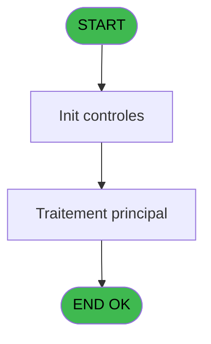

# REF IDE 664 - Creation Ca Comptes Archivés

> **Analyse**: Phases 1-4 2026-02-03 13:31 -> 13:31 (17s) | Assemblage 13:31
> **Pipeline**: V7.2 Enrichi
> **Structure**: 4 onglets (Resume | Ecrans | Donnees | Connexions)

<!-- TAB:Resume -->

## 1. FICHE D'IDENTITE

| Attribut | Valeur |
|----------|--------|
| Projet | REF |
| IDE Position | 664 |
| Nom Programme | Creation Ca Comptes Archivés |
| Fichier source | `Prg_664.xml` |
| Dossier IDE | Comptabilite |
| Taches | 3 (0 ecrans visibles) |
| Tables modifiees | 0 |
| Programmes appeles | 0 |

## 2. DESCRIPTION FONCTIONNELLE

**Creation Ca Comptes Archivés** assure la gestion complete de ce processus, accessible depuis [Extraction Ca Comptes Archivés (IDE 663)](REF-IDE-663.md).

Le flux de traitement s'organise en **2 blocs fonctionnels** :

- **Saisie** (2 taches) : ecrans de saisie utilisateur (formulaires, champs, donnees)
- **Calcul** (1 tache) : calculs de montants, stocks ou compteurs

Detail : phases du traitement

#### Phase 1 : Calcul (1 tache)

- **664** - Impression Compte

#### Phase 2 : Saisie (2 taches)

- **664.1** - Recherche Ventes
- **664.2** - Recherche Ventes

## 3. BLOCS FONCTIONNELS

### 3.1 Calcul (1 tache)

Calculs metier : montants, stocks, compteurs.

---

#### 664 - Impression Compte

**Role** : Generation du document : Impression Compte.

### 3.2 Saisie (2 taches)

Ce bloc traite la saisie des donnees de la transaction.

---

#### 664.1 - Recherche Ventes

**Role** : Saisie des donnees : Recherche Ventes.

---

#### 664.2 - Recherche Ventes

**Role** : Saisie des donnees : Recherche Ventes.

## 5. REGLES METIER

*(Aucune regle metier identifiee)*

## 6. CONTEXTE

- **Appele par**: [Extraction Ca Comptes Archivés (IDE 663)](REF-IDE-663.md)
- **Appelle**: 0 programmes | **Tables**: 8 (W:0 R:2 L:6) | **Taches**: 3 | **Expressions**: 10

<!-- TAB:Ecrans -->

## 8. ECRANS

*(Programme sans ecran visible)*

## 9. NAVIGATION

### 9.3 Structure hierarchique (3 taches)

| Position | Tache | Type | Dimensions | Bloc |
|----------|-------|------|------------|------|
| **664.1** | [**Impression Compte** (664)](#t1) | - | - | Calcul |
| **664.2** | [**Recherche Ventes** (664.1)](#t2) | - | - | Saisie |
| 664.2.1 | [Recherche Ventes (664.2)](#t3) | - | - | |

### 9.4 Algorigramme

> **Legende**: Vert = START/END OK | Rouge = END KO | Bleu = Decisions
> *Algorigramme auto-genere. Utiliser `/algorigramme` pour une synthese metier detaillee.*

<!-- TAB:Donnees -->

## 10. TABLES

### Tables utilisees (8)

| ID | Nom | Description | Type | R | W | L | Usages |
|----|-----|-------------|------|---|---|---|--------|
| 65 | comptes_recette__cre | Comptes GM (generaux) | DB | R |   |   | 2 |
| 368 | pms_village |  | DB | R |   |   | 1 |
| 722 | arc_gm-recherche_____gmr | Index de recherche | DB |   |   | L | 1 |
| 723 | arc_client_gm |  | DB |   |   | L | 1 |
| 724 | arc_comptable________cte |  | DB |   |   | L | 1 |
| 828 | arc_vente | Donnees de ventes | DB |   |   | L | 1 |
| 853 | arc_hebergement______heb | Hebergement (chambres) | DB |   |   | L | 1 |
| 857 | stat_service_archivage | Services / filieres | TMP |   |   | L | 2 |

### Colonnes par table (2 / 2 tables avec colonnes identifiees)

Table 65 - comptes_recette__cre (R) - 2 usages

*Table utilisee uniquement en Link ou aucune colonne Real identifiee dans le DataView.*

Table 368 - pms_village (R) - 1 usages

| Lettre | Variable | Acces | Type |
|--------|----------|-------|------|
| A | P Societe | R | Alpha |
| B | P Date début | R | Date |
| C | P Date fin | R | Date |
| D | P type d'edition | R | Alpha |

## 11. VARIABLES

### 11.1 Parametres entrants (4)

Variables recues du programme appelant ([Extraction Ca Comptes Archivés (IDE 663)](REF-IDE-663.md)).

| Lettre | Nom | Type | Usage dans |
|--------|-----|------|-----------|
| A | P Societe | Alpha | 2x parametre entrant |
| B | P Date début | Date | 1x parametre entrant |
| C | P Date fin | Date | 1x parametre entrant |
| D | P type d'edition | Alpha | - |

## 12. EXPRESSIONS

**10 / 10 expressions decodees (100%)**

### 12.1 Repartition par type

| Type | Expressions | Regles |
|------|-------------|--------|
| CONSTANTE | 1 | 0 |
| OTHER | 9 | 0 |

### 12.2 Expressions cles par type

#### CONSTANTE (1 expressions)

| Type | IDE | Expression | Regle |
|------|-----|------------|-------|
| CONSTANTE | 1 | `'H'` | - |

#### OTHER (9 expressions)

| Type | IDE | Expression | Regle |
|------|-----|------------|-------|
| OTHER | 8 | `[H]` | - |
| OTHER | 7 | `[G]` | - |
| OTHER | 10 | `P Societe [A]` | - |
| OTHER | 9 | `[P]` | - |
| OTHER | 6 | `[F]` | - |
| ... | | *+4 autres* | |

<!-- TAB:Connexions -->

## 13. GRAPHE D'APPELS

### 13.1 Chaine depuis Main (Callers)

Main -> ... -> [Extraction Ca Comptes Archivés (IDE 663)](REF-IDE-663.md) -> **Creation Ca Comptes Archivés (IDE 664)**

### 13.2 Callers

| IDE | Nom Programme | Nb Appels |
|-----|---------------|-----------|
| [663](REF-IDE-663.md) | Extraction Ca Comptes Archivés | 1 |

### 13.3 Callees (programmes appeles)

### 13.4 Detail Callees avec contexte

| IDE | Nom Programme | Appels | Contexte |
|-----|---------------|--------|----------|
| - | (aucun) | - | - |

## 14. RECOMMANDATIONS MIGRATION

### 14.1 Profil du programme

| Metrique | Valeur | Impact migration |
|----------|--------|-----------------|
| Lignes de logique | 118 | Programme compact |
| Expressions | 10 | Peu de logique |
| Tables WRITE | 0 | Impact faible |
| Sous-programmes | 0 | Peu de dependances |
| Ecrans visibles | 0 | Ecran unique ou traitement batch |
| Code desactive | 0.8% (1 / 118) | Code sain |
| Regles metier | 0 | Pas de regle identifiee |

### 14.2 Plan de migration par bloc

#### Calcul (1 tache: 0 ecran, 1 traitement)

- **Strategie** : Services de calcul purs (Domain Services).
- Migrer la logique de calcul (stock, compteurs, montants)

#### Saisie (2 taches: 0 ecran, 2 traitements)

- **Strategie** : Formulaire React/Blazor avec validation Zod/FluentValidation.
- Validation temps reel cote client + serveur

### 14.3 Dependances critiques

| Dependance | Type | Appels | Impact |
|------------|------|--------|--------|

---
*Spec DETAILED generee par Pipeline V7.2 - 2026-02-03 13:31*
