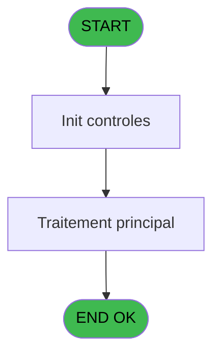

# REF IDE 665 - Csv Ca Comptes archivés

> **Analyse**: Phases 1-4 2026-02-03 13:31 -> 13:31 (17s) | Assemblage 13:31
> **Pipeline**: V7.2 Enrichi
> **Structure**: 4 onglets (Resume | Ecrans | Donnees | Connexions)

<!-- TAB:Resume -->

## 1. FICHE D'IDENTITE

| Attribut | Valeur |
|----------|--------|
| Projet | REF |
| IDE Position | 665 |
| Nom Programme | Csv Ca Comptes archivés |
| Fichier source | `Prg_665.xml` |
| Dossier IDE | Comptabilite |
| Taches | 1 (0 ecrans visibles) |
| Tables modifiees | 0 |
| Programmes appeles | 0 |

## 2. DESCRIPTION FONCTIONNELLE

**Csv Ca Comptes archivés** assure la gestion complete de ce processus, accessible depuis [Extraction Ca Comptes Archivés (IDE 663)](REF-IDE-663.md).

Le flux de traitement s'organise en **1 blocs fonctionnels** :

- **Traitement** (1 tache) : traitements metier divers

**Logique metier** : 1 regles identifiees couvrant conditions metier.

## 3. BLOCS FONCTIONNELS

### 3.1 Traitement (1 tache)

Traitements internes.

---

#### 665 - Impression [[ECRAN]](#ecran-t1)

**Role** : Generation du document : Impression.
**Ecran** : 777 x 0 DLU | [Voir mockup](#ecran-t1)

## 5. REGLES METIER

1 regles identifiees:

### Autres (1 regles)

#### [RM-001] Si [I]<0 alors ABS([I]) sinon [I]*(-1))

| Element | Detail |
|---------|--------|
| **Condition** | `[I]<0` |
| **Si vrai** | ABS([I]) |
| **Si faux** | [I]*(-1)) |
| **Expression source** | Expression 7 : `IF([I]<0,ABS([I]),[I]*(-1))` |
| **Exemple** | Si [I]<0 → ABS([I]). Sinon → [I]*(-1)) |

## 6. CONTEXTE

- **Appele par**: [Extraction Ca Comptes Archivés (IDE 663)](REF-IDE-663.md)
- **Appelle**: 0 programmes | **Tables**: 2 (W:0 R:1 L:1) | **Taches**: 1 | **Expressions**: 7

<!-- TAB:Ecrans -->

## 8. ECRANS

*(Programme sans ecran visible)*

## 9. NAVIGATION

### 9.3 Structure hierarchique (1 tache)

| Position | Tache | Type | Dimensions | Bloc |
|----------|-------|------|------------|------|
| **665.1** | [**Impression** (665)](#t1) [mockup](#ecran-t1) | - | 777x0 | Traitement |

### 9.4 Algorigramme

> **Legende**: Vert = START/END OK | Rouge = END KO | Bleu = Decisions
> *Algorigramme auto-genere. Utiliser `/algorigramme` pour une synthese metier detaillee.*

<!-- TAB:Donnees -->

## 10. TABLES

### Tables utilisees (2)

| ID | Nom | Description | Type | R | W | L | Usages |
|----|-----|-------------|------|---|---|---|--------|
| 368 | pms_village |  | DB | R |   |   | 1 |
| 857 | stat_service_archivage | Services / filieres | TMP |   |   | L | 1 |

### Colonnes par table (1 / 1 tables avec colonnes identifiees)

Table 368 - pms_village (R) - 1 usages

| Lettre | Variable | Acces | Type |
|--------|----------|-------|------|
| A | p type | R | Alpha |
| B | p file name | R | Alpha |
| C | v_montant | R | Numeric |
| D | v ligne | R | Logical |
| E | v liste variable | R | Alpha |
| F | v variable | R | Alpha |

## 11. VARIABLES

### 11.1 Parametres entrants (2)

Variables recues du programme appelant ([Extraction Ca Comptes Archivés (IDE 663)](REF-IDE-663.md)).

| Lettre | Nom | Type | Usage dans |
|--------|-----|------|-----------|
| A | p type | Alpha | 1x parametre entrant |
| B | p file name | Alpha | 1x parametre entrant |

### 11.2 Variables de session (3)

Variables persistantes pendant toute la session.

| Lettre | Nom | Type | Usage dans |
|--------|-----|------|-----------|
| D | v ligne | Logical | - |
| E | v liste variable | Alpha | - |
| F | v variable | Alpha | - |

### 11.3 Autres (1)

Variables diverses.

| Lettre | Nom | Type | Usage dans |
|--------|-----|------|-----------|
| C | v_montant | Numeric | 2x refs |

## 12. EXPRESSIONS

**7 / 7 expressions decodees (100%)**

### 12.1 Repartition par type

| Type | Expressions | Regles |
|------|-------------|--------|
| CONDITION | 2 | 5 |
| CONSTANTE | 4 | 0 |
| STRING | 1 | 0 |

### 12.2 Expressions cles par type

#### CONDITION (2 expressions)

| Type | IDE | Expression | Regle |
|------|-----|------------|-------|
| CONDITION | 7 | `IF([I]<0,ABS([I]),[I]*(-1))` | [RM-001](#rm-RM-001) |
| CONDITION | 6 | `p type [A]='1'` | - |

#### CONSTANTE (4 expressions)

| Type | IDE | Expression | Regle |
|------|-----|------------|-------|
| CONSTANTE | 4 | `'compte,filiation,nom,prenom,qualite,qualite_complementaire,date_debut_sejour,date_fin_sejour,service,v_montant,devise'` | - |
| CONSTANTE | 5 | `'compte,filiation,nom,prenom,qualite,qualite_complementaire,date_debut_sejour,date_fin_sejour,service,imputation,v_montant,devise'` | - |
| CONSTANTE | 1 | `'Adherent,Filiation,Nom,Prenom,Qualité,Qualité Complémentaire,Date début de séjour,Date fin de séjour,Service,Montant,Devise'` | - |
| CONSTANTE | 2 | `'Adherent,Filiation,Nom,Prenom,Qualité,Qualité Complémentaire,Date début de séjour,Date fin de séjour,Service,Imputation,Montant,Devise'` | - |

#### STRING (1 expressions)

| Type | IDE | Expression | Regle |
|------|-----|------------|-------|
| STRING | 3 | `DataViewToText (0,Trim([AA]),[Z],Trim(p file name [B]),';','',0)` | - |

<!-- TAB:Connexions -->

## 13. GRAPHE D'APPELS

### 13.1 Chaine depuis Main (Callers)

Main -> ... -> [Extraction Ca Comptes Archivés (IDE 663)](REF-IDE-663.md) -> **Csv Ca Comptes archivés (IDE 665)**

### 13.2 Callers

| IDE | Nom Programme | Nb Appels |
|-----|---------------|-----------|
| [663](REF-IDE-663.md) | Extraction Ca Comptes Archivés | 1 |

### 13.3 Callees (programmes appeles)

### 13.4 Detail Callees avec contexte

| IDE | Nom Programme | Appels | Contexte |
|-----|---------------|--------|----------|
| - | (aucun) | - | - |

## 14. RECOMMANDATIONS MIGRATION

### 14.1 Profil du programme

| Metrique | Valeur | Impact migration |
|----------|--------|-----------------|
| Lignes de logique | 45 | Programme compact |
| Expressions | 7 | Peu de logique |
| Tables WRITE | 0 | Impact faible |
| Sous-programmes | 0 | Peu de dependances |
| Ecrans visibles | 0 | Ecran unique ou traitement batch |
| Code desactive | 0% (0 / 45) | Code sain |
| Regles metier | 1 | Quelques regles a preserver |

### 14.2 Plan de migration par bloc

#### Traitement (1 tache: 1 ecran, 0 traitement)

- **Strategie** : 1 composant(s) UI (Razor/React) avec formulaires et validation.
- Decomposer les taches en services unitaires testables.

### 14.3 Dependances critiques

| Dependance | Type | Appels | Impact |
|------------|------|--------|--------|

---
*Spec DETAILED generee par Pipeline V7.2 - 2026-02-03 13:31*
