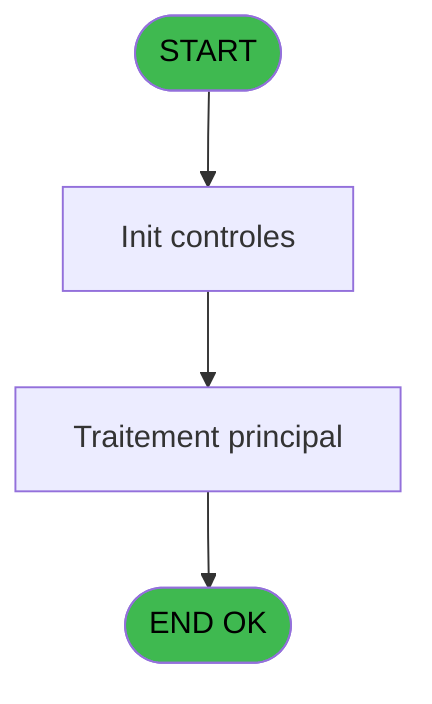

# REF IDE 666 - Requete fiche de police

> **Analyse**: Phases 1-4 2026-02-03 13:31 -> 13:32 (16s) | Assemblage 13:32
> **Pipeline**: V7.2 Enrichi
> **Structure**: 4 onglets (Resume | Ecrans | Donnees | Connexions)

<!-- TAB:Resume -->

## 1. FICHE D'IDENTITE

| Attribut | Valeur |
|----------|--------|
| Projet | REF |
| IDE Position | 666 |
| Nom Programme | Requete fiche de police |
| Fichier source | `Prg_666.xml` |
| Dossier IDE | General |
| Taches | 1 (0 ecrans visibles) |
| Tables modifiees | 0 |
| Programmes appeles | 1 |
| :warning: Statut | **ORPHELIN_POTENTIEL** |

## 2. DESCRIPTION FONCTIONNELLE

**Requete fiche de police** assure la gestion complete de ce processus.

Le flux de traitement s'organise en **1 blocs fonctionnels** :

- **Traitement** (1 tache) : traitements metier divers

**Logique metier** : 1 regles identifiees couvrant conditions metier.

## 3. BLOCS FONCTIONNELS

### 3.1 Traitement (1 tache)

Traitements internes.

---

#### 666 - Clients [[ECRAN]](#ecran-t2)

**Role** : Traitement : Clients.
**Ecran** : 832 x 290 DLU (Modal) | [Voir mockup](#ecran-t2)
**Delegue a** : [Clause Where (IDE 837)](REF-IDE-837.md)

## 5. REGLES METIER

1 regles identifiees:

### Autres (1 regles)

#### [RM-001] Si [BW] alors '<>' sinon '=')

| Element | Detail |
|---------|--------|
| **Condition** | `[BW]` |
| **Si vrai** | '<>' |
| **Si faux** | '=') |
| **Expression source** | Expression 1 : `IF ([BW],'<>','=')` |
| **Exemple** | Si [BW] → '<>'. Sinon → '=') |

## 6. CONTEXTE

- **Appele par**: (aucun)
- **Appelle**: 1 programmes | **Tables**: 0 (W:0 R:0 L:0) | **Taches**: 1 | **Expressions**: 18

<!-- TAB:Ecrans -->

## 8. ECRANS

*(Programme sans ecran visible)*

## 9. NAVIGATION

### 9.3 Structure hierarchique (1 tache)

| Position | Tache | Type | Dimensions | Bloc |
|----------|-------|------|------------|------|
| **666.1** | [**Clients** (666)](#t2) [mockup](#ecran-t2) | Modal | 832x290 | Traitement |

### 9.4 Algorigramme

> **Legende**: Vert = START/END OK | Rouge = END KO | Bleu = Decisions
> *Algorigramme auto-genere. Utiliser `/algorigramme` pour une synthese metier detaillee.*

<!-- TAB:Donnees -->

## 10. TABLES

### Tables utilisees (0)

| ID | Nom | Description | Type | R | W | L | Usages |
|----|-----|-------------|------|---|---|---|--------|

### Colonnes par table (0 / 0 tables avec colonnes identifiees)

## 11. VARIABLES

### 11.1 Variables de session (14)

Variables persistantes pendant toute la session.

| Lettre | Nom | Type | Usage dans |
|--------|-----|------|-----------|
| D | v.signe | Unicode | - |
| E | v.requette erreur date naiss | Unicode | - |
| F | v.requette erreur nationalité | Unicode | - |
| G | v.requette erreur type doc | Unicode | - |
| H | v.requette erreur ID document | Unicode | - |
| I | v.requette erreur date délivran | Unicode | - |
| J | v.requette erreur date expirati | Unicode | - |
| K | v.requette erreur sexe | Unicode | - |
| L | v.requette erreur pays naissanc | Unicode | - |
| M | v.requette erreur lieu délivran | Unicode | - |
| N | v.requette erreur pays émission | Unicode | - |
| O | v.requette erreur pays résidenc | Unicode | - |
| P | v.requette erreur ville naissan | Unicode | - |
| Q | v.requette erreur plaque immat | Unicode | - |

### 11.2 Autres (3)

Variables diverses.

| Lettre | Nom | Type | Usage dans |
|--------|-----|------|-----------|
| A | >Pays (M-aroc,T-urquie,P-ortuga | Unicode | - |
| B | >Valide? (ou invalide) Uniqueme | Logical | - |
| C | <Clause complémentaire | Unicode | - |

Toutes les 17 variables (liste complete)

| Cat | Lettre | Nom Variable | Type |
|-----|--------|--------------|------|
| V. | **D** | v.signe | Unicode |
| V. | **E** | v.requette erreur date naiss | Unicode |
| V. | **F** | v.requette erreur nationalité | Unicode |
| V. | **G** | v.requette erreur type doc | Unicode |
| V. | **H** | v.requette erreur ID document | Unicode |
| V. | **I** | v.requette erreur date délivran | Unicode |
| V. | **J** | v.requette erreur date expirati | Unicode |
| V. | **K** | v.requette erreur sexe | Unicode |
| V. | **L** | v.requette erreur pays naissanc | Unicode |
| V. | **M** | v.requette erreur lieu délivran | Unicode |
| V. | **N** | v.requette erreur pays émission | Unicode |
| V. | **O** | v.requette erreur pays résidenc | Unicode |
| V. | **P** | v.requette erreur ville naissan | Unicode |
| V. | **Q** | v.requette erreur plaque immat | Unicode |
| Autre | **A** | >Pays (M-aroc,T-urquie,P-ortuga | Unicode |
| Autre | **B** | >Valide? (ou invalide) Uniqueme | Logical |
| Autre | **C** | <Clause complémentaire | Unicode |

## 12. EXPRESSIONS

**18 / 18 expressions decodees (100%)**

### 12.1 Repartition par type

| Type | Expressions | Regles |
|------|-------------|--------|
| CONCATENATION | 12 | 0 |
| CONDITION | 4 | 5 |
| CONSTANTE | 1 | 0 |
| CAST_LOGIQUE | 1 | 0 |

### 12.2 Expressions cles par type

#### CONCATENATION (12 expressions)

| Type | IDE | Expression | Regle |
|------|-----|------------|-------|
| CONCATENATION | 8 | `'gmc_ville_naissance'&[CA]&''''''` | - |
| CONCATENATION | 7 | `'gmc_pays_naissance'&[CA]&''''''` | - |
| CONCATENATION | 6 | `'(gmc_numero_piece'&[CA]&''''''& IF([BW],'OR','AND') &' gmc_cni'&[CA]&''''')'` | - |
| CONCATENATION | 13 | `'gmc_pays_delivrance'&[CA]&''''''` | - |
| CONCATENATION | 12 | `'gmc_pays_residence'&[CA]&''''''` | - |
| ... | | *+7 autres* | |

#### CONDITION (4 expressions)

| Type | IDE | Expression | Regle |
|------|-----|------------|-------|
| CONDITION | 1 | `IF ([BW],'<>','=')` | [RM-001](#rm-RM-001) |
| CONDITION | 17 | `[BV]='P'` | - |
| CONDITION | 16 | `[BV]='M'` | - |
| CONDITION | 15 | `[BV]='T'` | - |

#### CONSTANTE (1 expressions)

| Type | IDE | Expression | Regle |
|------|-----|------------|-------|
| CONSTANTE | 18 | `''` | - |

#### CAST_LOGIQUE (1 expressions)

| Type | IDE | Expression | Regle |
|------|-----|------------|-------|
| CAST_LOGIQUE | 14 | `'FALSE'LOG` | - |

<!-- TAB:Connexions -->

## 13. GRAPHE D'APPELS

### 13.1 Chaine depuis Main (Callers)

**Chemin**: (pas de callers directs)

### 13.2 Callers

| IDE | Nom Programme | Nb Appels |
|-----|---------------|-----------|
| - | (aucun) | - |

### 13.3 Callees (programmes appeles)

### 13.4 Detail Callees avec contexte

| IDE | Nom Programme | Appels | Contexte |
|-----|---------------|--------|----------|
| [837](REF-IDE-837.md) | Clause Where | 1 | Sous-programme |

## 14. RECOMMANDATIONS MIGRATION

### 14.1 Profil du programme

| Metrique | Valeur | Impact migration |
|----------|--------|-----------------|
| Lignes de logique | 51 | Programme compact |
| Expressions | 18 | Peu de logique |
| Tables WRITE | 0 | Impact faible |
| Sous-programmes | 1 | Peu de dependances |
| Ecrans visibles | 0 | Ecran unique ou traitement batch |
| Code desactive | 9.8% (5 / 51) | A verifier |
| Regles metier | 1 | Quelques regles a preserver |

### 14.2 Plan de migration par bloc

#### Traitement (1 tache: 1 ecran, 0 traitement)

- **Strategie** : 1 composant(s) UI (Razor/React) avec formulaires et validation.
- 1 sous-programme(s) a migrer ou a reutiliser depuis les services existants.
- Decomposer les taches en services unitaires testables.

### 14.3 Dependances critiques

| Dependance | Type | Appels | Impact |
|------------|------|--------|--------|
| [Clause Where (IDE 837)](REF-IDE-837.md) | Sous-programme | 1x | Normale - Sous-programme |

---
*Spec DETAILED generee par Pipeline V7.2 - 2026-02-03 13:32*
