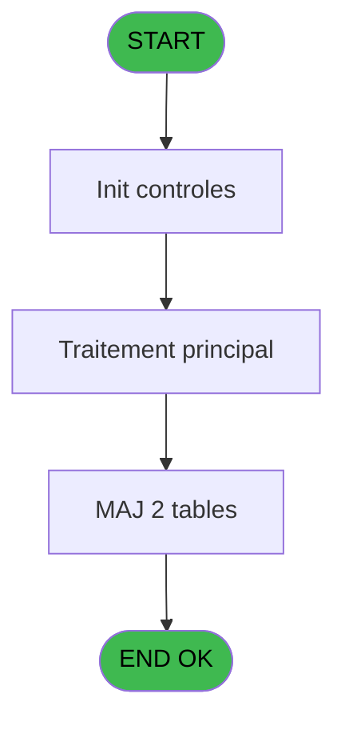

# REF IDE 667 - Affectation de Garantie

> **Analyse**: Phases 1-4 2026-02-03 13:32 -> 13:32 (16s) | Assemblage 13:32
> **Pipeline**: V7.2 Enrichi
> **Structure**: 4 onglets (Resume | Ecrans | Donnees | Connexions)

<!-- TAB:Resume -->

## 1. FICHE D'IDENTITE

| Attribut | Valeur |
|----------|--------|
| Projet | REF |
| IDE Position | 667 |
| Nom Programme | Affectation de Garantie |
| Fichier source | `Prg_667.xml` |
| Dossier IDE | Garanties |
| Taches | 5 (1 ecrans visibles) |
| Tables modifiees | 2 |
| Programmes appeles | 1 |
| :warning: Statut | **ORPHELIN_POTENTIEL** |

## 2. DESCRIPTION FONCTIONNELLE

**Affectation de Garantie** assure la gestion complete de ce processus.

Le flux de traitement s'organise en **2 blocs fonctionnels** :

- **Traitement** (4 taches) : traitements metier divers
- **Creation** (1 tache) : insertion d'enregistrements en base (mouvements, prestations)

**Donnees modifiees** : 2 tables en ecriture (gm-recherche_____gmr, depot_garantie___dga).

Detail : phases du traitement

#### Phase 1 : Traitement (4 taches)

- **667** - Affectation de Garantie **[[ECRAN]](#ecran-t1)**
- **667.1** - Traitement des Garanties
- **667.1.2** - Traitement des mails
- **667.2** - Check Nb Arrivants **[[ECRAN]](#ecran-t5)**

Delegue a : [Log batch (IDE 829)](REF-IDE-829.md)

#### Phase 2 : Creation (1 tache)

- **667.1.1** - Creation Garantie

#### Tables impactees

| Table | Operations | Role metier |
|-------|-----------|-------------|
| gm-recherche_____gmr | R/**W** (2 usages) | Index de recherche |
| depot_garantie___dga | **W**/L (2 usages) | Depots et garanties |

## 3. BLOCS FONCTIONNELS

### 3.1 Traitement (4 taches)

Traitements internes.

---

#### 667 - Affectation de Garantie [[ECRAN]](#ecran-t1)

**Role** : Traitement : Affectation de Garantie.
**Ecran** : 238 x 60 DLU | [Voir mockup](#ecran-t1)

3 sous-taches directes

| Tache | Nom | Bloc |
|-------|-----|------|
| [667.1](#t2) | Traitement des Garanties | Traitement |
| [667.1.2](#t4) | Traitement des mails | Traitement |
| [667.2](#t5) | Check Nb Arrivants **[[ECRAN]](#ecran-t5)** | Traitement |

**Delegue a** : [Log batch (IDE 829)](REF-IDE-829.md)

---

#### 667.1 - Traitement des Garanties

**Role** : Traitement : Traitement des Garanties.
**Variables liees** : A (P.i.Du Traitement Arrivants)
**Delegue a** : [Log batch (IDE 829)](REF-IDE-829.md)

---

#### 667.1.2 - Traitement des mails

**Role** : Traitement : Traitement des mails.
**Variables liees** : A (P.i.Du Traitement Arrivants)
**Delegue a** : [Log batch (IDE 829)](REF-IDE-829.md)

---

#### 667.2 - Check Nb Arrivants [[ECRAN]](#ecran-t5)

**Role** : Traitement : Check Nb Arrivants.
**Ecran** : 126 x 42 DLU | [Voir mockup](#ecran-t5)
**Variables liees** : A (P.i.Du Traitement Arrivants)
**Delegue a** : [Log batch (IDE 829)](REF-IDE-829.md)

### 3.2 Creation (1 tache)

Insertion de nouveaux enregistrements en base.

---

#### 667.1.1 - Creation Garantie

**Role** : Creation d'enregistrement : Creation Garantie.

## 5. REGLES METIER

*(Aucune regle metier identifiee)*

## 6. CONTEXTE

- **Appele par**: (aucun)
- **Appelle**: 1 programmes | **Tables**: 9 (W:2 R:2 L:7) | **Taches**: 5 | **Expressions**: 12

<!-- TAB:Ecrans -->

## 8. ECRANS

### 8.1 Forms visibles (1 / 5)

| # | Position | Tache | Nom | Type | Largeur | Hauteur | Bloc |
|---|----------|-------|-----|------|---------|---------|------|
| 1 | 667 | 667 | Affectation de Garantie | Type0 | 238 | 60 | Traitement |

### 8.2 Mockups Ecrans

---

#### 667 - Affectation de Garantie
**Tache** : [667](#t1) | **Type** : Type0 | **Dimensions** : 238 x 60 DLU
**Bloc** : Traitement | **Titre IDE** : Affectation de Garantie

<!-- FORM-DATA:
{
    "width":  238,
    "vFactor":  8,
    "type":  "Type0",
    "hFactor":  4,
    "controls":  [
                     {
                         "x":  4,
                         "type":  "label",
                         "var":  "",
                         "y":  2,
                         "w":  232,
                         "fmt":  "",
                         "name":  "",
                         "h":  29,
                         "color":  "",
                         "text":  "",
                         "parent":  null
                     },
                     {
                         "x":  52,
                         "type":  "label",
                         "var":  "",
                         "y":  12,
                         "w":  164,
                         "fmt":  "",
                         "name":  "",
                         "h":  8,
                         "color":  "7",
                         "text":  "Impression en cours ...",
                         "parent":  null
                     },
                     {
                         "x":  4,
                         "type":  "label",
                         "var":  "",
                         "y":  31,
                         "w":  232,
                         "fmt":  "",
                         "name":  "",
                         "h":  27,
                         "color":  "",
                         "text":  "",
                         "parent":  null
                     },
                     {
                         "x":  44,
                         "type":  "label",
                         "var":  "",
                         "y":  40,
                         "w":  172,
                         "fmt":  "",
                         "name":  "",
                         "h":  8,
                         "color":  "",
                         "text":  "Affectation automatique de garantie",
                         "parent":  null
                     },
                     {
                         "x":  8,
                         "type":  "image",
                         "var":  "",
                         "y":  4,
                         "w":  36,
                         "fmt":  "",
                         "name":  "",
                         "h":  25,
                         "color":  "",
                         "text":  "",
                         "parent":  null
                     }
                 ],
    "taskId":  "667",
    "height":  60
}
-->

## 9. NAVIGATION

Ecran unique: **Affectation de Garantie**

### 9.3 Structure hierarchique (5 taches)

| Position | Tache | Type | Dimensions | Bloc |
|----------|-------|------|------------|------|
| **667.1** | [**Affectation de Garantie** (667)](#t1) [mockup](#ecran-t1) | - | 238x60 | Traitement |
| 667.1.1 | [Traitement des Garanties (667.1)](#t2) | - | - | |
| 667.1.2 | [Traitement des mails (667.1.2)](#t4) | - | - | |
| 667.1.3 | [Check Nb Arrivants (667.2)](#t5) [mockup](#ecran-t5) | - | 126x42 | |
| **667.2** | [**Creation Garantie** (667.1.1)](#t3) | - | - | Creation |

### 9.4 Algorigramme

> **Legende**: Vert = START/END OK | Rouge = END KO | Bleu = Decisions
> *Algorigramme auto-genere. Utiliser `/algorigramme` pour une synthese metier detaillee.*

<!-- TAB:Donnees -->

## 10. TABLES

### Tables utilisees (9)

| ID | Nom | Description | Type | R | W | L | Usages |
|----|-----|-------------|------|---|---|---|--------|
| 30 | gm-recherche_____gmr | Index de recherche | DB | R | **W** |   | 2 |
| 34 | hebergement______heb | Hebergement (chambres) | DB |   |   | L | 1 |
| 39 | depot_garantie___dga | Depots et garanties | DB |   | **W** | L | 2 |
| 47 | compte_gm________cgm | Comptes GM (generaux) | DB |   |   | L | 1 |
| 69 | initialisation___ini |  | DB | R |   |   | 1 |
| 356 | gm_millesia |  | DB |   |   | L | 1 |
| 368 | pms_village |  | DB |   |   | L | 1 |
| 803 | code_fidelisation |  | DB |   |   | L | 1 |
| 863 | file_traitement_mail | Services / filieres | DB |   |   | L | 1 |

### Colonnes par table (5 / 3 tables avec colonnes identifiees)

Table 30 - gm-recherche_____gmr (R/**W**) - 2 usages

| Lettre | Variable | Acces | Type |
|--------|----------|-------|------|
| A | L.RetourGarantie | W | Logical |
| B | v.CtrLigne | W | Numeric |
| C | v.qualité | W | Alpha |

Table 39 - depot_garantie___dga (**W**/L) - 2 usages

| Lettre | Variable | Acces | Type |
|--------|----------|-------|------|
| A | L.RetourGarantie | W | Logical |

Table 69 - initialisation___ini (R) - 1 usages

| Lettre | Variable | Acces | Type |
|--------|----------|-------|------|
| A | P.i.Du Traitement Arrivants | R | Logical |
| B | v.Chemin | R | Alpha |
| C | v.NomFicPDF | R | Alpha |
| D | Nb Arriv Compté | R | Numeric |
| E | Date Lancement | R | Date |
| F | Heure Lancement | R | Time |

## 11. VARIABLES

### 11.1 Parametres entrants (1)

Variables recues en parametre.

| Lettre | Nom | Type | Usage dans |
|--------|-----|------|-----------|
| A | P.i.Du Traitement Arrivants | Logical | - |

### 11.2 Variables de session (2)

Variables persistantes pendant toute la session.

| Lettre | Nom | Type | Usage dans |
|--------|-----|------|-----------|
| B | v.Chemin | Alpha | - |
| C | v.NomFicPDF | Alpha | - |

### 11.3 Autres (3)

Variables diverses.

| Lettre | Nom | Type | Usage dans |
|--------|-----|------|-----------|
| D | Nb Arriv Compté | Numeric | [667.2](#t5) |
| E | Date Lancement | Date | - |
| F | Heure Lancement | Time | - |

## 12. EXPRESSIONS

**12 / 12 expressions decodees (100%)**

### 12.1 Repartition par type

| Type | Expressions | Regles |
|------|-------------|--------|
| CONSTANTE | 3 | 0 |
| FORMAT | 3 | 0 |
| DATE | 1 | 0 |
| OTHER | 4 | 0 |
| CONDITION | 1 | 0 |

### 12.2 Expressions cles par type

#### CONSTANTE (3 expressions)

| Type | IDE | Expression | Regle |
|------|-----|------------|-------|
| CONSTANTE | 12 | `'OK'` | - |
| CONSTANTE | 11 | `'NB'` | - |
| CONSTANTE | 7 | `'AFFGAR'` | - |

#### FORMAT (3 expressions)

| Type | IDE | Expression | Regle |
|------|-----|------------|-------|
| FORMAT | 9 | `'Comptés : '&Trim(Str([I],'4'))&'Seuil : '&Trim(Str([H],'4'))` | - |
| FORMAT | 10 | `DStr(Date(),'YYYYMMDD')` | - |
| FORMAT | 2 | `'AFFECTATION_GARANTIE_'&DStr(Date(),'YYYYMMDD')&'_'&TStr(Time(),'HHMMSS')&'.pdf'` | - |

#### DATE (1 expressions)

| Type | IDE | Expression | Regle |
|------|-----|------------|-------|
| DATE | 5 | `Date()` | - |

#### OTHER (4 expressions)

| Type | IDE | Expression | Regle |
|------|-----|------------|-------|
| OTHER | 6 | `Time()` | - |
| OTHER | 8 | `NOT(ExpCalc('4'EXP))` | - |
| OTHER | 1 | `Translate ('%club_exportdata%')&'PDF\'` | - |
| OTHER | 3 | `Nb Arriv Compté [D]` | - |

#### CONDITION (1 expressions)

| Type | IDE | Expression | Regle |
|------|-----|------------|-------|
| CONDITION | 4 | `[I]>=[H] AND [H]>0` | - |

<!-- TAB:Connexions -->

## 13. GRAPHE D'APPELS

### 13.1 Chaine depuis Main (Callers)

**Chemin**: (pas de callers directs)

### 13.2 Callers

| IDE | Nom Programme | Nb Appels |
|-----|---------------|-----------|
| - | (aucun) | - |

### 13.3 Callees (programmes appeles)

### 13.4 Detail Callees avec contexte

| IDE | Nom Programme | Appels | Contexte |
|-----|---------------|--------|----------|
| [829](REF-IDE-829.md) | Log batch | 2 | Sous-programme |

## 14. RECOMMANDATIONS MIGRATION

### 14.1 Profil du programme

| Metrique | Valeur | Impact migration |
|----------|--------|-----------------|
| Lignes de logique | 135 | Programme compact |
| Expressions | 12 | Peu de logique |
| Tables WRITE | 2 | Impact faible |
| Sous-programmes | 1 | Peu de dependances |
| Ecrans visibles | 1 | Ecran unique ou traitement batch |
| Code desactive | 0% (0 / 135) | Code sain |
| Regles metier | 0 | Pas de regle identifiee |

### 14.2 Plan de migration par bloc

#### Traitement (4 taches: 2 ecrans, 2 traitements)

- **Strategie** : Orchestrateur avec 2 ecrans (Razor/React) et 2 traitements backend (services).
- Les ecrans deviennent des composants UI, les traitements invisibles deviennent des services injectables.
- 1 sous-programme(s) a migrer ou a reutiliser depuis les services existants.
- Decomposer les taches en services unitaires testables.

#### Creation (1 tache: 0 ecran, 1 traitement)

- **Strategie** : Repository pattern avec Entity Framework Core.
- Insertion via `IRepository<T>.CreateAsync()`

### 14.3 Dependances critiques

| Dependance | Type | Appels | Impact |
|------------|------|--------|--------|
| gm-recherche_____gmr | Table WRITE (Database) | 1x | Schema + repository |
| depot_garantie___dga | Table WRITE (Database) | 1x | Schema + repository |
| [Log batch (IDE 829)](REF-IDE-829.md) | Sous-programme | 2x | Haute - Sous-programme |

---
*Spec DETAILED generee par Pipeline V7.2 - 2026-02-03 13:32*
