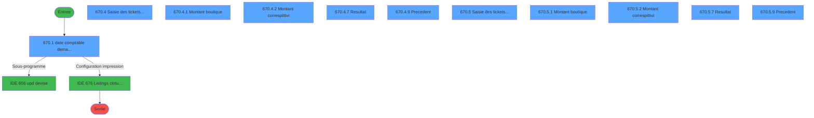
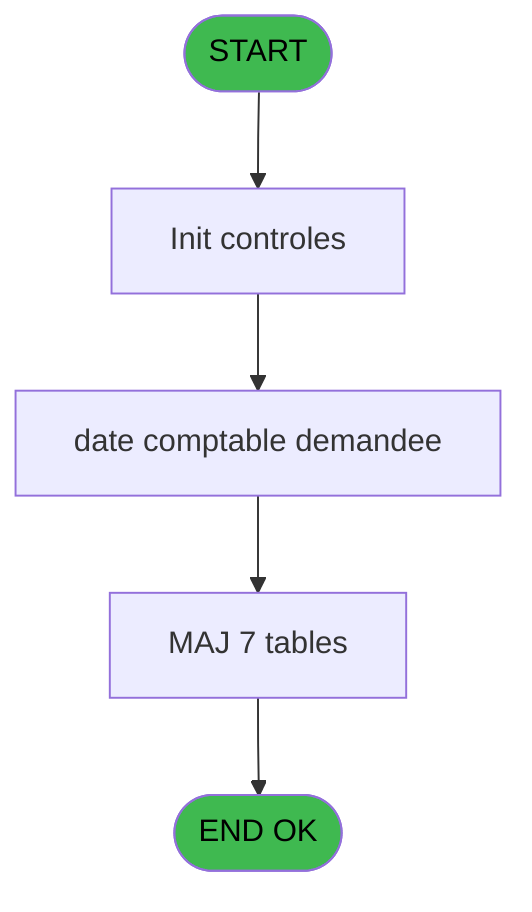
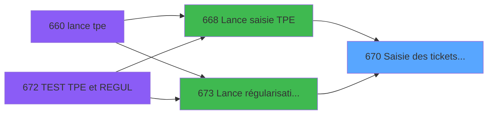
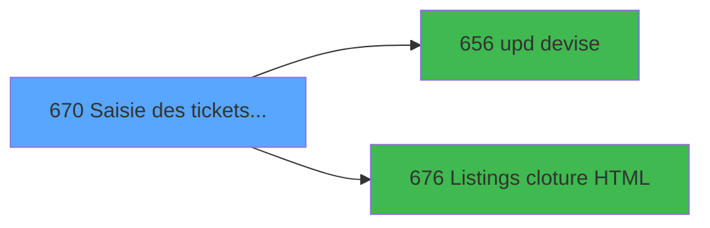

# REF IDE 670 - Saisie des tickets TPE

> **Analyse**: Phases 1-4 2026-02-03 13:33 -> 13:33 (15s) | Assemblage 13:33
> **Pipeline**: V7.2 Enrichi
> **Structure**: 4 onglets (Resume | Ecrans | Donnees | Connexions)

<!-- TAB:Resume -->

## 1. FICHE D'IDENTITE

| Attribut | Valeur |
|----------|--------|
| Projet | REF |
| IDE Position | 670 |
| Nom Programme | Saisie des tickets TPE |
| Fichier source | `Prg_670.xml` |
| Dossier IDE | Impression |
| Taches | 88 (11 ecrans visibles) |
| Tables modifiees | 7 |
| Programmes appeles | 2 |

## 2. DESCRIPTION FONCTIONNELLE

**Saisie des tickets TPE** assure la gestion complete de ce processus, accessible depuis [Lance saisie TPE (IDE 668)](REF-IDE-668.md), [Lance régularisation TPE (IDE 673)](REF-IDE-673.md).

Le flux de traitement s'organise en **6 blocs fonctionnels** :

- **Saisie** (25 taches) : ecrans de saisie utilisateur (formulaires, champs, donnees)
- **Traitement** (24 taches) : traitements metier divers
- **Calcul** (23 taches) : calculs de montants, stocks ou compteurs
- **Validation** (9 taches) : controles et verifications de coherence
- **Initialisation** (6 taches) : reinitialisation d'etats et de variables de travail
- **Creation** (1 tache) : insertion d'enregistrements en base (mouvements, prestations)

**Donnees modifiees** : 7 tables en ecriture (plan_comptable_central, saisie_pdc_boutique, suivi_pdc, tickets_tpe, tickets_tpe, total_ventes_par_mop_temp, correspittivi_boutique).

Detail : phases du traitement

#### Phase 1 : Saisie (25 taches)

- **670** - Saisie des tickets TPE 251
- **670.4** - Saisie des tickets TPE **[[ECRAN]](#ecran-t12)**
- **670.4.1.3.1** - total saisie
- **670.4.2.2.1** - total saisie
- **670.4.2.2.2** - Controle saisie
- **670.4.2.2.3.1** - Totalle saisie autre compte
- **670.4.3.2.3** - montant saisie
- **670.4.3.2.3.1** - total saisie
- **670.4.4** - total SAISIE
- **670.4.4.1** - montant saisie
- **670.4.4.1.1** - total saisie
- **670.4.4.2** - montant saisie
- **670.4.4.2.1** - total saisie
- **670.5** - Saisie des tickets TPE **[[ECRAN]](#ecran-t49)**
- **670.5.1.3.1** - total saisie
- **670.5.2.2.1** - total saisie
- **670.5.2.2.2** - Controle saisie
- **670.5.2.2.3.1** - Totalle saisie autre compte
- **670.5.3.2.3** - montant saisie
- **670.5.3.2.3.1** - total saisie
- **670.5.4** - total SAISIE
- **670.5.4.1** - montant saisie
- **670.5.4.1.1** - total saisie
- **670.5.4.2** - montant saisie
- **670.5.4.2.1** - total saisie

#### Phase 2 : Calcul (23 taches)

- **670.1** - date comptable demandee **[[ECRAN]](#ecran-t2)**
- **670.4.3** - total CALCUL
- **670.4.3.1** - montant calcul
- **670.4.3.1.1** - montant calcul
- **670.4.3.1.1.1** - total calcule
- **670.4.3.1.2** - montant calcul **[[ECRAN]](#ecran-t30)**
- **670.4.3.1.2.1** - total calcule
- **670.4.3.2** - montant calcul
- **670.4.3.2.1** - montant calcul
- **670.4.3.2.1.1** - total calcule
- **670.4.3.2.2** - montant calcul
- **670.4.3.2.2.1** - total calcule
- **670.5.3** - total CALCUL
- **670.5.3.1** - montant calcul
- **670.5.3.1.1** - montant calcul
- **670.5.3.1.1.1** - total calcule
- **670.5.3.1.2** - montant calcul **[[ECRAN]](#ecran-t67)**
- **670.5.3.1.2.1** - total calcule
- **670.5.3.2** - montant calcul
- **670.5.3.2.1** - montant calcul
- **670.5.3.2.1.1** - total calcule
- **670.5.3.2.2** - montant calcul
- **670.5.3.2.2.1** - total calcule

#### Phase 3 : Validation (9 taches)

- **670.1.1** - Validation
- **670.4.1.2** - Validation
- **670.4.1.3** - Validation suite
- **670.4.2.2** - Validation suite
- **670.4.2.2.3** - Controle autres comptes boutiq
- **670.5.1.2** - Validation
- **670.5.1.3** - Validation suite
- **670.5.2.2** - Validation suite
- **670.5.2.2.3** - Controle autres comptes boutiq

#### Phase 4 : Traitement (24 taches)

- **670.1.1.1** - secu pour abandon
- **670.4.1** - Montant boutique **[[ECRAN]](#ecran-t13)**
- **670.4.1.1** - Abandon
- **670.4.1.3.2** - total téléco v1
- **670.4.2** - Montant correspittivi **[[ECRAN]](#ecran-t19)**
- **670.4.2.1** - Abandon
- **670.4.5** - Ecart
- **670.4.6** - Ecart
- **670.4.7** - Resultat **[[ECRAN]](#ecran-t46)**
- **670.4.8** - Update suivi PDC
- **670.4.9** - Precedent **[[ECRAN]](#ecran-t48)**
- **670.5.1** - Montant boutique **[[ECRAN]](#ecran-t50)**
- **670.5.1.1** - Abandon
- **670.5.1.3.2** - total téléco T2H
- **670.5.2** - Montant correspittivi **[[ECRAN]](#ecran-t56)**
- **670.5.2.1** - Abandon
- **670.5.5** - Ecart
- **670.5.6** - Ecart
- **670.5.7** - Resultat **[[ECRAN]](#ecran-t83)**
- **670.5.8** - Update suivi PDC
- **670.5.9** - Precedent **[[ECRAN]](#ecran-t85)**
- **670.6** - retour abandon
- **670.7** - Sessions ouvertes WS
- **670.8** - param caisse

Delegue a : [upd devise (IDE 656)](REF-IDE-656.md), [Listings cloture HTML (IDE 676)](REF-IDE-676.md)

#### Phase 5 : Creation (1 tache)

- **670.1.1.1.1** - create tempo

#### Phase 6 : Initialisation (6 taches)

- **670.2** - Initialisation
- **670.2.1** - initialisation table
- **670.2.2** - initialisation table
- **670.3** - Initialisation
- **670.3.1** - initialisation table
- **670.3.2** - initialisation table

#### Tables impactees

| Table | Operations | Role metier |
|-------|-----------|-------------|
| total_ventes_par_mop_temp | **W**/L (34 usages) | Donnees de ventes |
| tickets_tpe | **W**/L (18 usages) |  |
| saisie_pdc_boutique | R/**W**/L (8 usages) |  |
| correspittivi_boutique | R/**W**/L (6 usages) |  |
| plan_comptable_central | **W** (2 usages) |  |
| suivi_pdc | **W** (2 usages) |  |
| tickets_tpe | **W**/L (2 usages) |  |

## 3. BLOCS FONCTIONNELS

### 3.1 Saisie (25 taches)

L'operateur saisit les donnees de la transaction via 2 ecrans (Saisie des tickets TPE, Saisie des tickets TPE).

---

#### 670 - Saisie des tickets TPE 251

**Role** : Tache d'orchestration : point d'entree du programme (25 sous-taches). Coordonne l'enchainement des traitements.

24 sous-taches directes

| Tache | Nom | Bloc |
|-------|-----|------|
| [670.4](#t12) | Saisie des tickets TPE **[[ECRAN]](#ecran-t12)** | Saisie |
| [670.4.1.3.1](#t17) | total saisie | Saisie |
| [670.4.2.2.1](#t22) | total saisie | Saisie |
| [670.4.2.2.2](#t23) | Controle saisie | Saisie |
| [670.4.2.2.3.1](#t25) | Totalle saisie autre compte | Saisie |
| [670.4.3.2.3](#t37) | montant saisie | Saisie |
| [670.4.3.2.3.1](#t38) | total saisie | Saisie |
| [670.4.4](#t39) | total SAISIE | Saisie |
| [670.4.4.1](#t40) | montant saisie | Saisie |
| [670.4.4.1.1](#t41) | total saisie | Saisie |
| [670.4.4.2](#t42) | montant saisie | Saisie |
| [670.4.4.2.1](#t43) | total saisie | Saisie |
| [670.5](#t49) | Saisie des tickets TPE **[[ECRAN]](#ecran-t49)** | Saisie |
| [670.5.1.3.1](#t54) | total saisie | Saisie |
| [670.5.2.2.1](#t59) | total saisie | Saisie |
| [670.5.2.2.2](#t60) | Controle saisie | Saisie |
| [670.5.2.2.3.1](#t62) | Totalle saisie autre compte | Saisie |
| [670.5.3.2.3](#t74) | montant saisie | Saisie |
| [670.5.3.2.3.1](#t75) | total saisie | Saisie |
| [670.5.4](#t76) | total SAISIE | Saisie |
| [670.5.4.1](#t77) | montant saisie | Saisie |
| [670.5.4.1.1](#t78) | total saisie | Saisie |
| [670.5.4.2](#t79) | montant saisie | Saisie |
| [670.5.4.2.1](#t80) | total saisie | Saisie |

**Variables liees** : T (v.Montant régul saisie)

---

#### 670.4 - Saisie des tickets TPE [[ECRAN]](#ecran-t12)

**Role** : Saisie des donnees : Saisie des tickets TPE.
**Ecran** : 1278 x 241 DLU (Type6) | [Voir mockup](#ecran-t12)
**Variables liees** : T (v.Montant régul saisie)

---

#### 670.4.1.3.1 - total saisie

**Role** : Saisie des donnees : total saisie.
**Variables liees** : T (v.Montant régul saisie)

---

#### 670.4.2.2.1 - total saisie

**Role** : Saisie des donnees : total saisie.
**Variables liees** : T (v.Montant régul saisie)

---

#### 670.4.2.2.2 - Controle saisie

**Role** : Saisie des donnees : Controle saisie.
**Variables liees** : T (v.Montant régul saisie)

---

#### 670.4.2.2.3.1 - Totalle saisie autre compte

**Role** : Saisie des donnees : Totalle saisie autre compte.
**Variables liees** : T (v.Montant régul saisie)

---

#### 670.4.3.2.3 - montant saisie

**Role** : Saisie des donnees : montant saisie.
**Variables liees** : M (P.o Montant Regul Sup Max?), S (v.Montant max à régulariser), T (v.Montant régul saisie)

---

#### 670.4.3.2.3.1 - total saisie

**Role** : Saisie des donnees : total saisie.
**Variables liees** : T (v.Montant régul saisie)

---

#### 670.4.4 - total SAISIE

**Role** : Saisie des donnees : total SAISIE.
**Variables liees** : T (v.Montant régul saisie)

---

#### 670.4.4.1 - montant saisie

**Role** : Saisie des donnees : montant saisie.
**Variables liees** : M (P.o Montant Regul Sup Max?), S (v.Montant max à régulariser), T (v.Montant régul saisie)

---

#### 670.4.4.1.1 - total saisie

**Role** : Saisie des donnees : total saisie.
**Variables liees** : T (v.Montant régul saisie)

---

#### 670.4.4.2 - montant saisie

**Role** : Saisie des donnees : montant saisie.
**Variables liees** : M (P.o Montant Regul Sup Max?), S (v.Montant max à régulariser), T (v.Montant régul saisie)

---

#### 670.4.4.2.1 - total saisie

**Role** : Saisie des donnees : total saisie.
**Variables liees** : T (v.Montant régul saisie)

---

#### 670.5 - Saisie des tickets TPE [[ECRAN]](#ecran-t49)

**Role** : Saisie des donnees : Saisie des tickets TPE.
**Ecran** : 1278 x 241 DLU (Type6) | [Voir mockup](#ecran-t49)
**Variables liees** : T (v.Montant régul saisie)

---

#### 670.5.1.3.1 - total saisie

**Role** : Saisie des donnees : total saisie.
**Variables liees** : T (v.Montant régul saisie)

---

#### 670.5.2.2.1 - total saisie

**Role** : Saisie des donnees : total saisie.
**Variables liees** : T (v.Montant régul saisie)

---

#### 670.5.2.2.2 - Controle saisie

**Role** : Saisie des donnees : Controle saisie.
**Variables liees** : T (v.Montant régul saisie)

---

#### 670.5.2.2.3.1 - Totalle saisie autre compte

**Role** : Saisie des donnees : Totalle saisie autre compte.
**Variables liees** : T (v.Montant régul saisie)

---

#### 670.5.3.2.3 - montant saisie

**Role** : Saisie des donnees : montant saisie.
**Variables liees** : M (P.o Montant Regul Sup Max?), S (v.Montant max à régulariser), T (v.Montant régul saisie)

---

#### 670.5.3.2.3.1 - total saisie

**Role** : Saisie des donnees : total saisie.
**Variables liees** : T (v.Montant régul saisie)

---

#### 670.5.4 - total SAISIE

**Role** : Saisie des donnees : total SAISIE.
**Variables liees** : T (v.Montant régul saisie)

---

#### 670.5.4.1 - montant saisie

**Role** : Saisie des donnees : montant saisie.
**Variables liees** : M (P.o Montant Regul Sup Max?), S (v.Montant max à régulariser), T (v.Montant régul saisie)

---

#### 670.5.4.1.1 - total saisie

**Role** : Saisie des donnees : total saisie.
**Variables liees** : T (v.Montant régul saisie)

---

#### 670.5.4.2 - montant saisie

**Role** : Saisie des donnees : montant saisie.
**Variables liees** : M (P.o Montant Regul Sup Max?), S (v.Montant max à régulariser), T (v.Montant régul saisie)

---

#### 670.5.4.2.1 - total saisie

**Role** : Saisie des donnees : total saisie.
**Variables liees** : T (v.Montant régul saisie)

### 3.2 Calcul (23 taches)

Calculs metier : montants, stocks, compteurs.

---

#### 670.1 - date comptable demandee [[ECRAN]](#ecran-t2)

**Role** : Traitement : date comptable demandee.
**Ecran** : 640 x 198 DLU (MDI) | [Voir mockup](#ecran-t2)
**Variables liees** : B (P.i. date comptable), F (P.i.o date comptable demandee), U (v.Date validée?)

---

#### 670.4.3 - total CALCUL

**Role** : Calcul : total CALCUL.

---

#### 670.4.3.1 - montant calcul

**Role** : Calcul : montant calcul.
**Variables liees** : M (P.o Montant Regul Sup Max?), S (v.Montant max à régulariser), T (v.Montant régul saisie)

---

#### 670.4.3.1.1 - montant calcul

**Role** : Calcul : montant calcul.
**Variables liees** : M (P.o Montant Regul Sup Max?), S (v.Montant max à régulariser), T (v.Montant régul saisie)

---

#### 670.4.3.1.1.1 - total calcule

**Role** : Calcul : total calcule.

---

#### 670.4.3.1.2 - montant calcul [[ECRAN]](#ecran-t30)

**Role** : Calcul : montant calcul.
**Ecran** : 960 x 0 DLU (MDI) | [Voir mockup](#ecran-t30)
**Variables liees** : M (P.o Montant Regul Sup Max?), S (v.Montant max à régulariser), T (v.Montant régul saisie)

---

#### 670.4.3.1.2.1 - total calcule

**Role** : Calcul : total calcule.

---

#### 670.4.3.2 - montant calcul

**Role** : Calcul : montant calcul.
**Variables liees** : M (P.o Montant Regul Sup Max?), S (v.Montant max à régulariser), T (v.Montant régul saisie)

---

#### 670.4.3.2.1 - montant calcul

**Role** : Calcul : montant calcul.
**Variables liees** : M (P.o Montant Regul Sup Max?), S (v.Montant max à régulariser), T (v.Montant régul saisie)

---

#### 670.4.3.2.1.1 - total calcule

**Role** : Calcul : total calcule.

---

#### 670.4.3.2.2 - montant calcul

**Role** : Calcul : montant calcul.
**Variables liees** : M (P.o Montant Regul Sup Max?), S (v.Montant max à régulariser), T (v.Montant régul saisie)

---

#### 670.4.3.2.2.1 - total calcule

**Role** : Calcul : total calcule.

---

#### 670.5.3 - total CALCUL

**Role** : Calcul : total CALCUL.

---

#### 670.5.3.1 - montant calcul

**Role** : Calcul : montant calcul.
**Variables liees** : M (P.o Montant Regul Sup Max?), S (v.Montant max à régulariser), T (v.Montant régul saisie)

---

#### 670.5.3.1.1 - montant calcul

**Role** : Calcul : montant calcul.
**Variables liees** : M (P.o Montant Regul Sup Max?), S (v.Montant max à régulariser), T (v.Montant régul saisie)

---

#### 670.5.3.1.1.1 - total calcule

**Role** : Calcul : total calcule.

---

#### 670.5.3.1.2 - montant calcul [[ECRAN]](#ecran-t67)

**Role** : Calcul : montant calcul.
**Ecran** : 960 x 0 DLU (MDI) | [Voir mockup](#ecran-t67)
**Variables liees** : M (P.o Montant Regul Sup Max?), S (v.Montant max à régulariser), T (v.Montant régul saisie)

---

#### 670.5.3.1.2.1 - total calcule

**Role** : Calcul : total calcule.

---

#### 670.5.3.2 - montant calcul

**Role** : Calcul : montant calcul.
**Variables liees** : M (P.o Montant Regul Sup Max?), S (v.Montant max à régulariser), T (v.Montant régul saisie)

---

#### 670.5.3.2.1 - montant calcul

**Role** : Calcul : montant calcul.
**Variables liees** : M (P.o Montant Regul Sup Max?), S (v.Montant max à régulariser), T (v.Montant régul saisie)

---

#### 670.5.3.2.1.1 - total calcule

**Role** : Calcul : total calcule.

---

#### 670.5.3.2.2 - montant calcul

**Role** : Calcul : montant calcul.
**Variables liees** : M (P.o Montant Regul Sup Max?), S (v.Montant max à régulariser), T (v.Montant régul saisie)

---

#### 670.5.3.2.2.1 - total calcule

**Role** : Calcul : total calcule.

### 3.3 Validation (9 taches)

Controles de coherence : 9 taches verifient les donnees et conditions.

---

#### 670.1.1 - Validation

**Role** : Verification : Validation.

---

#### 670.4.1.2 - Validation

**Role** : Verification : Validation.

---

#### 670.4.1.3 - Validation suite

**Role** : Verification : Validation suite.

---

#### 670.4.2.2 - Validation suite

**Role** : Verification : Validation suite.

---

#### 670.4.2.2.3 - Controle autres comptes boutiq

**Role** : Verification : Controle autres comptes boutiq.
**Variables liees** : I (P.i activite de la boutique)

---

#### 670.5.1.2 - Validation

**Role** : Verification : Validation.

---

#### 670.5.1.3 - Validation suite

**Role** : Verification : Validation suite.

---

#### 670.5.2.2 - Validation suite

**Role** : Verification : Validation suite.

---

#### 670.5.2.2.3 - Controle autres comptes boutiq

**Role** : Verification : Controle autres comptes boutiq.
**Variables liees** : I (P.i activite de la boutique)

### 3.4 Traitement (24 taches)

Traitements internes.

---

#### 670.1.1.1 - secu pour abandon

**Role** : Traitement : secu pour abandon.
**Variables liees** : K (P.o.abandon demande?)

---

#### 670.4.1 - Montant boutique [[ECRAN]](#ecran-t13)

**Role** : Traitement : Montant boutique.
**Ecran** : 1278 x 241 DLU (Type6) | [Voir mockup](#ecran-t13)
**Variables liees** : I (P.i activite de la boutique), M (P.o Montant Regul Sup Max?), S (v.Montant max à régulariser), T (v.Montant régul saisie)

---

#### 670.4.1.1 - Abandon

**Role** : Traitement : Abandon.
**Variables liees** : K (P.o.abandon demande?)

---

#### 670.4.1.3.2 - total téléco v1

**Role** : Traitement : total téléco v1.

---

#### 670.4.2 - Montant correspittivi [[ECRAN]](#ecran-t19)

**Role** : Traitement : Montant correspittivi.
**Ecran** : 1514 x 289 DLU (Type6) | [Voir mockup](#ecran-t19)
**Variables liees** : M (P.o Montant Regul Sup Max?), S (v.Montant max à régulariser), T (v.Montant régul saisie)

---

#### 670.4.2.1 - Abandon

**Role** : Traitement : Abandon.
**Variables liees** : K (P.o.abandon demande?)

---

#### 670.4.5 - Ecart

**Role** : Traitement : Ecart.
**Variables liees** : E (P.o ecart corrige), O (v existe ecart)

---

#### 670.4.6 - Ecart

**Role** : Traitement : Ecart.
**Variables liees** : E (P.o ecart corrige), O (v existe ecart)

---

#### 670.4.7 - Resultat [[ECRAN]](#ecran-t46)

**Role** : Traitement : Resultat.
**Ecran** : 1278 x 240 DLU (MDI) | [Voir mockup](#ecran-t46)

---

#### 670.4.8 - Update suivi PDC

**Role** : Traitement : Update suivi PDC.

---

#### 670.4.9 - Precedent [[ECRAN]](#ecran-t48)

**Role** : Traitement : Precedent.
**Ecran** : 1263 x 51 DLU (Modal) | [Voir mockup](#ecran-t48)

---

#### 670.5.1 - Montant boutique [[ECRAN]](#ecran-t50)

**Role** : Traitement : Montant boutique.
**Ecran** : 1278 x 241 DLU (Type6) | [Voir mockup](#ecran-t50)
**Variables liees** : I (P.i activite de la boutique), M (P.o Montant Regul Sup Max?), S (v.Montant max à régulariser), T (v.Montant régul saisie)

---

#### 670.5.1.1 - Abandon

**Role** : Traitement : Abandon.
**Variables liees** : K (P.o.abandon demande?)

---

#### 670.5.1.3.2 - total téléco T2H

**Role** : Traitement : total téléco T2H.

---

#### 670.5.2 - Montant correspittivi [[ECRAN]](#ecran-t56)

**Role** : Traitement : Montant correspittivi.
**Ecran** : 1514 x 289 DLU (Type6) | [Voir mockup](#ecran-t56)
**Variables liees** : M (P.o Montant Regul Sup Max?), S (v.Montant max à régulariser), T (v.Montant régul saisie)

---

#### 670.5.2.1 - Abandon

**Role** : Traitement : Abandon.
**Variables liees** : K (P.o.abandon demande?)

---

#### 670.5.5 - Ecart

**Role** : Traitement : Ecart.
**Variables liees** : E (P.o ecart corrige), O (v existe ecart)

---

#### 670.5.6 - Ecart

**Role** : Traitement : Ecart.
**Variables liees** : E (P.o ecart corrige), O (v existe ecart)

---

#### 670.5.7 - Resultat [[ECRAN]](#ecran-t83)

**Role** : Traitement : Resultat.
**Ecran** : 1278 x 240 DLU (MDI) | [Voir mockup](#ecran-t83)

---

#### 670.5.8 - Update suivi PDC

**Role** : Traitement : Update suivi PDC.

---

#### 670.5.9 - Precedent [[ECRAN]](#ecran-t85)

**Role** : Traitement : Precedent.
**Ecran** : 1263 x 51 DLU (Modal) | [Voir mockup](#ecran-t85)

---

#### 670.6 - retour abandon

**Role** : Traitement : retour abandon.
**Variables liees** : K (P.o.abandon demande?)

---

#### 670.7 - Sessions ouvertes WS

**Role** : Traitement : Sessions ouvertes WS.

---

#### 670.8 - param caisse

**Role** : Traitement : param caisse.

### 3.5 Creation (1 tache)

Insertion de nouveaux enregistrements en base.

---

#### 670.1.1.1.1 - create tempo

**Role** : Traitement : create tempo.

### 3.6 Initialisation (6 taches)

Reinitialisation d'etats et variables de travail.

---

#### 670.2 - Initialisation

**Role** : Reinitialisation : Initialisation.

---

#### 670.2.1 - initialisation table

**Role** : Reinitialisation : initialisation table.
**Variables liees** : B (P.i. date comptable), F (P.i.o date comptable demandee)

---

#### 670.2.2 - initialisation table

**Role** : Reinitialisation : initialisation table.
**Variables liees** : B (P.i. date comptable), F (P.i.o date comptable demandee)

---

#### 670.3 - Initialisation

**Role** : Reinitialisation : Initialisation.

---

#### 670.3.1 - initialisation table

**Role** : Reinitialisation : initialisation table.
**Variables liees** : B (P.i. date comptable), F (P.i.o date comptable demandee)

---

#### 670.3.2 - initialisation table

**Role** : Reinitialisation : initialisation table.
**Variables liees** : B (P.i. date comptable), F (P.i.o date comptable demandee)

## 5. REGLES METIER

*(Aucune regle metier identifiee)*

## 6. CONTEXTE

- **Appele par**: [Lance saisie TPE (IDE 668)](REF-IDE-668.md), [Lance régularisation TPE (IDE 673)](REF-IDE-673.md)
- **Appelle**: 2 programmes | **Tables**: 23 (W:7 R:12 L:15) | **Taches**: 88 | **Expressions**: 15

<!-- TAB:Ecrans -->

## 8. ECRANS

### 8.1 Forms visibles (11 / 88)

| # | Position | Tache | Nom | Type | Largeur | Hauteur | Bloc |
|---|----------|-------|-----|------|---------|---------|------|
| 1 | 670.1 | 670.1 | date comptable demandee | MDI | 640 | 198 | Calcul |
| 2 | 670.4 | 670.4 | Saisie des tickets TPE | Type6 | 1278 | 241 | Saisie |
| 3 | 670.4.1 | 670.4.1 | Montant boutique | Type6 | 1278 | 241 | Traitement |
| 4 | 670.4.2 | 670.4.2 | Montant correspittivi | Type6 | 1514 | 289 | Traitement |
| 5 | 670.4.7 | 670.4.7 | Resultat | MDI | 1278 | 240 | Traitement |
| 6 | 670.4.9 | 670.4.9 | Precedent | Modal | 1263 | 51 | Traitement |
| 7 | 670.5 | 670.5 | Saisie des tickets TPE | Type6 | 1278 | 241 | Saisie |
| 8 | 670.5.1 | 670.5.1 | Montant boutique | Type6 | 1278 | 241 | Traitement |
| 9 | 670.5.2 | 670.5.2 | Montant correspittivi | Type6 | 1514 | 289 | Traitement |
| 10 | 670.5.7 | 670.5.7 | Resultat | MDI | 1278 | 240 | Traitement |
| 11 | 670.5.9 | 670.5.9 | Precedent | Modal | 1263 | 51 | Traitement |

### 8.2 Mockups Ecrans

---

#### 670.1 - date comptable demandee
**Tache** : [670.1](#t2) | **Type** : MDI | **Dimensions** : 640 x 198 DLU
**Bloc** : Calcul | **Titre IDE** : date comptable demandee

<!-- FORM-DATA:
{
    "width":  640,
    "vFactor":  8,
    "type":  "MDI",
    "hFactor":  8,
    "controls":  [
                     {
                         "x":  0,
                         "type":  "label",
                         "var":  "",
                         "y":  1,
                         "w":  638,
                         "fmt":  "",
                         "name":  "",
                         "h":  18,
                         "color":  "",
                         "text":  "",
                         "parent":  null
                     },
                     {
                         "x":  0,
                         "type":  "label",
                         "var":  "",
                         "y":  23,
                         "w":  638,
                         "fmt":  "",
                         "name":  "",
                         "h":  148,
                         "color":  "",
                         "text":  "",
                         "parent":  null
                     },
                     {
                         "x":  313,
                         "type":  "label",
                         "var":  "",
                         "y":  73,
                         "w":  213,
                         "fmt":  "",
                         "name":  "",
                         "h":  8,
                         "color":  "",
                         "text":  "Date comptable demandée",
                         "parent":  null
                     },
                     {
                         "x":  0,
                         "type":  "label",
                         "var":  "",
                         "y":  174,
                         "w":  638,
                         "fmt":  "",
                         "name":  "",
                         "h":  24,
                         "color":  "",
                         "text":  "",
                         "parent":  null
                     },
                     {
                         "x":  356,
                         "type":  "edit",
                         "var":  "",
                         "y":  98,
                         "w":  126,
                         "fmt":  "",
                         "name":  "",
                         "h":  10,
                         "color":  "6",
                         "text":  "",
                         "parent":  null
                     },
                     {
                         "x":  409,
                         "type":  "edit",
                         "var":  "",
                         "y":  6,
                         "w":  216,
                         "fmt":  "WWW  DD MMM YYYYT",
                         "name":  "",
                         "h":  8,
                         "color":  "",
                         "text":  "",
                         "parent":  null
                     },
                     {
                         "x":  40,
                         "type":  "image",
                         "var":  "",
                         "y":  77,
                         "w":  147,
                         "fmt":  "",
                         "name":  "",
                         "h":  45,
                         "color":  "",
                         "text":  "",
                         "parent":  null
                     },
                     {
                         "x":  471,
                         "type":  "button",
                         "var":  "",
                         "y":  177,
                         "w":  154,
                         "fmt":  "\u0026Validation",
                         "name":  "",
                         "h":  18,
                         "color":  "",
                         "text":  "",
                         "parent":  null
                     },
                     {
                         "x":  7,
                         "type":  "edit",
                         "var":  "",
                         "y":  6,
                         "w":  267,
                         "fmt":  "30",
                         "name":  "",
                         "h":  8,
                         "color":  "",
                         "text":  "",
                         "parent":  null
                     },
                     {
                         "x":  15,
                         "type":  "button",
                         "var":  "",
                         "y":  177,
                         "w":  154,
                         "fmt":  "\u0026Annulation",
                         "name":  "",
                         "h":  18,
                         "color":  "",
                         "text":  "",
                         "parent":  8
                     }
                 ],
    "taskId":  "670.1",
    "height":  198
}
-->

<strong>Champs : 3 champs</strong>

| Pos (x,y) | Nom | Variable | Type |
|-----------|-----|----------|------|
| 356,98 | (sans nom) | - | edit |
| 409,6 | WWW  DD MMM YYYYT | - | edit |
| 7,6 | 30 | - | edit |

<strong>Boutons : 2 boutons</strong>

| Bouton | Pos (x,y) | Action |
|--------|-----------|--------|
| Validation | 471,177 | Valide la saisie et enregistre |
| Annulation | 15,177 | Annule et retour au menu |

---

#### 670.4 - Saisie des tickets TPE
**Tache** : [670.4](#t12) | **Type** : Type6 | **Dimensions** : 1278 x 241 DLU
**Bloc** : Saisie | **Titre IDE** : Saisie des tickets TPE

<!-- FORM-DATA:
{
    "width":  1278,
    "vFactor":  8,
    "type":  "Type6",
    "hFactor":  8,
    "controls":  [
                     {
                         "x":  2,
                         "type":  "label",
                         "var":  "",
                         "y":  1,
                         "w":  1273,
                         "fmt":  "",
                         "name":  "",
                         "h":  24,
                         "color":  "",
                         "text":  "",
                         "parent":  null
                     },
                     {
                         "x":  461,
                         "type":  "label",
                         "var":  "",
                         "y":  8,
                         "w":  190,
                         "fmt":  "",
                         "name":  "",
                         "h":  10,
                         "color":  "7",
                         "text":  "Date comptable",
                         "parent":  null
                     },
                     {
                         "x":  2,
                         "type":  "label",
                         "var":  "",
                         "y":  216,
                         "w":  1273,
                         "fmt":  "",
                         "name":  "",
                         "h":  24,
                         "color":  "",
                         "text":  "",
                         "parent":  null
                     },
                     {
                         "x":  19,
                         "type":  "table",
                         "var":  "",
                         "name":  "",
                         "titleH":  12,
                         "color":  "110",
                         "w":  1245,
                         "y":  34,
                         "fmt":  "",
                         "parent":  null,
                         "text":  "",
                         "rowH":  10,
                         "h":  171,
                         "cols":  [
                                      {
                                          "title":  "TPE",
                                          "layer":  1,
                                          "w":  79
                                      },
                                      {
                                          "title":  "Emplacement",
                                          "layer":  2,
                                          "w":  490
                                      },
                                      {
                                          "title":  "MOP",
                                          "layer":  3,
                                          "w":  89
                                      },
                                      {
                                          "title":  "Montant",
                                          "layer":  4,
                                          "w":  180
                                      },
                                      {
                                          "title":  "Numéro remise",
                                          "layer":  5,
                                          "w":  212
                                      },
                                      {
                                          "title":  "Date opération TPE",
                                          "layer":  6,
                                          "w":  160
                                      }
                                  ],
                         "rows":  6
                     },
                     {
                         "x":  26,
                         "type":  "edit",
                         "var":  "",
                         "y":  48,
                         "w":  69,
                         "fmt":  "",
                         "name":  "",
                         "h":  8,
                         "color":  "110",
                         "text":  "",
                         "parent":  7
                     },
                     {
                         "x":  594,
                         "type":  "edit",
                         "var":  "",
                         "y":  48,
                         "w":  85,
                         "fmt":  "",
                         "name":  "",
                         "h":  8,
                         "color":  "110",
                         "text":  "",
                         "parent":  7
                     },
                     {
                         "x":  685,
                         "type":  "edit",
                         "var":  "",
                         "y":  48,
                         "w":  171,
                         "fmt":  "N## ### ### ###.###Z",
                         "name":  "Montant",
                         "h":  8,
                         "color":  "110",
                         "text":  "",
                         "parent":  7
                     },
                     {
                         "x":  864,
                         "type":  "edit",
                         "var":  "",
                         "y":  48,
                         "w":  209,
                         "fmt":  "16",
                         "name":  "Numero remise",
                         "h":  8,
                         "color":  "110",
                         "text":  "",
                         "parent":  7
                     },
                     {
                         "x":  1075,
                         "type":  "edit",
                         "var":  "",
                         "y":  48,
                         "w":  152,
                         "fmt":  "##/##/####Z",
                         "name":  "",
                         "h":  8,
                         "color":  "110",
                         "text":  "",
                         "parent":  7
                     },
                     {
                         "x":  104,
                         "type":  "edit",
                         "var":  "",
                         "y":  48,
                         "w":  240,
                         "fmt":  "",
                         "name":  "",
                         "h":  8,
                         "color":  "110",
                         "text":  "",
                         "parent":  7
                     },
                     {
                         "x":  30,
                         "type":  "edit",
                         "var":  "",
                         "y":  8,
                         "w":  267,
                         "fmt":  "30",
                         "name":  "",
                         "h":  10,
                         "color":  "",
                         "text":  "",
                         "parent":  null
                     },
                     {
                         "x":  659,
                         "type":  "edit",
                         "var":  "",
                         "y":  8,
                         "w":  158,
                         "fmt":  "",
                         "name":  "",
                         "h":  10,
                         "color":  "7",
                         "text":  "",
                         "parent":  null
                     },
                     {
                         "x":  1033,
                         "type":  "edit",
                         "var":  "",
                         "y":  8,
                         "w":  216,
                         "fmt":  "WWW  DD MMM YYYYT",
                         "name":  "",
                         "h":  10,
                         "color":  "",
                         "text":  "",
                         "parent":  null
                     },
                     {
                         "x":  342,
                         "type":  "edit",
                         "var":  "",
                         "y":  48,
                         "w":  243,
                         "fmt":  "30",
                         "name":  "",
                         "h":  8,
                         "color":  "110",
                         "text":  "",
                         "parent":  7
                     },
                     {
                         "x":  30,
                         "type":  "button",
                         "var":  "",
                         "y":  219,
                         "w":  154,
                         "fmt":  "A\u0026bandon",
                         "name":  "",
                         "h":  18,
                         "color":  "",
                         "text":  "",
                         "parent":  null
                     },
                     {
                         "x":  1095,
                         "type":  "button",
                         "var":  "",
                         "y":  219,
                         "w":  154,
                         "fmt":  "\u0026Continue",
                         "name":  "",
                         "h":  18,
                         "color":  "",
                         "text":  "",
                         "parent":  null
                     }
                 ],
    "taskId":  "670.4",
    "height":  241
}
-->

<strong>Champs : 10 champs</strong>

| Pos (x,y) | Nom | Variable | Type |
|-----------|-----|----------|------|
| 26,48 | (sans nom) | - | edit |
| 594,48 | (sans nom) | - | edit |
| 685,48 | Montant | - | edit |
| 864,48 | Numero remise | - | edit |
| 1075,48 | ##/##/####Z | - | edit |
| 104,48 | (sans nom) | - | edit |
| 30,8 | 30 | - | edit |
| 659,8 | (sans nom) | - | edit |
| 1033,8 | WWW  DD MMM YYYYT | - | edit |
| 342,48 | 30 | - | edit |

<strong>Boutons : 2 boutons</strong>

| Bouton | Pos (x,y) | Action |
|--------|-----------|--------|
| Abandon | 30,219 | Annule et retour au menu |
| Continue | 1095,219 | Bouton fonctionnel |

---

#### 670.4.1 - Montant boutique
**Tache** : [670.4.1](#t13) | **Type** : Type6 | **Dimensions** : 1278 x 241 DLU
**Bloc** : Traitement | **Titre IDE** : Montant boutique

<!-- FORM-DATA:
{
    "width":  1278,
    "vFactor":  8,
    "type":  "Type6",
    "hFactor":  8,
    "controls":  [
                     {
                         "x":  1,
                         "type":  "label",
                         "var":  "",
                         "y":  2,
                         "w":  1276,
                         "fmt":  "",
                         "name":  "",
                         "h":  18,
                         "color":  "",
                         "text":  "",
                         "parent":  null
                     },
                     {
                         "x":  460,
                         "type":  "label",
                         "var":  "",
                         "y":  6,
                         "w":  190,
                         "fmt":  "",
                         "name":  "",
                         "h":  10,
                         "color":  "7",
                         "text":  "Date comptable",
                         "parent":  null
                     },
                     {
                         "x":  1,
                         "type":  "label",
                         "var":  "",
                         "y":  216,
                         "w":  1276,
                         "fmt":  "",
                         "name":  "",
                         "h":  24,
                         "color":  "",
                         "text":  "",
                         "parent":  null
                     },
                     {
                         "x":  16,
                         "type":  "table",
                         "var":  "",
                         "name":  "",
                         "titleH":  12,
                         "color":  "110",
                         "w":  1250,
                         "y":  24,
                         "fmt":  "",
                         "parent":  null,
                         "text":  "",
                         "rowH":  14,
                         "h":  180,
                         "cols":  [
                                      {
                                          "title":  "Compte",
                                          "layer":  1,
                                          "w":  94
                                      },
                                      {
                                          "title":  "Activité",
                                          "layer":  2,
                                          "w":  76
                                      },
                                      {
                                          "title":  "Libellé du compte",
                                          "layer":  3,
                                          "w":  421
                                      },
                                      {
                                          "title":  "Montant",
                                          "layer":  4,
                                          "w":  233
                                      },
                                      {
                                          "title":  "Libellé de la pièce de caisse",
                                          "layer":  5,
                                          "w":  393
                                      }
                                  ],
                         "rows":  5
                     },
                     {
                         "x":  19,
                         "type":  "edit",
                         "var":  "",
                         "y":  38,
                         "w":  90,
                         "fmt":  "",
                         "name":  "",
                         "h":  12,
                         "color":  "110",
                         "text":  "",
                         "parent":  7
                     },
                     {
                         "x":  117,
                         "type":  "edit",
                         "var":  "",
                         "y":  38,
                         "w":  67,
                         "fmt":  "",
                         "name":  "",
                         "h":  12,
                         "color":  "110",
                         "text":  "",
                         "parent":  7
                     },
                     {
                         "x":  613,
                         "type":  "edit",
                         "var":  "",
                         "y":  38,
                         "w":  222,
                         "fmt":  "N## ### ### ###.###Z",
                         "name":  "",
                         "h":  12,
                         "color":  "110",
                         "text":  "",
                         "parent":  7
                     },
                     {
                         "x":  846,
                         "type":  "edit",
                         "var":  "",
                         "y":  38,
                         "w":  376,
                         "fmt":  "",
                         "name":  "",
                         "h":  12,
                         "color":  "110",
                         "text":  "",
                         "parent":  7
                     },
                     {
                         "x":  5,
                         "type":  "edit",
                         "var":  "",
                         "y":  7,
                         "w":  384,
                         "fmt":  "30",
                         "name":  "",
                         "h":  8,
                         "color":  "",
                         "text":  "",
                         "parent":  null
                     },
                     {
                         "x":  1036,
                         "type":  "edit",
                         "var":  "",
                         "y":  7,
                         "w":  216,
                         "fmt":  "WWW  DD MMM YYYYT",
                         "name":  "",
                         "h":  8,
                         "color":  "",
                         "text":  "",
                         "parent":  null
                     },
                     {
                         "x":  190,
                         "type":  "edit",
                         "var":  "",
                         "y":  38,
                         "w":  412,
                         "fmt":  "128",
                         "name":  "",
                         "h":  12,
                         "color":  "110",
                         "text":  "",
                         "parent":  7
                     },
                     {
                         "x":  21,
                         "type":  "button",
                         "var":  "",
                         "y":  219,
                         "w":  154,
                         "fmt":  "Abandon",
                         "name":  "",
                         "h":  18,
                         "color":  "",
                         "text":  "",
                         "parent":  null
                     },
                     {
                         "x":  1098,
                         "type":  "button",
                         "var":  "",
                         "y":  219,
                         "w":  154,
                         "fmt":  "\u0026Validation",
                         "name":  "",
                         "h":  18,
                         "color":  "",
                         "text":  "",
                         "parent":  null
                     },
                     {
                         "x":  658,
                         "type":  "edit",
                         "var":  "",
                         "y":  6,
                         "w":  158,
                         "fmt":  "",
                         "name":  "",
                         "h":  10,
                         "color":  "7",
                         "text":  "",
                         "parent":  null
                     }
                 ],
    "taskId":  "670.4.1",
    "height":  241
}
-->

<strong>Champs : 8 champs</strong>

| Pos (x,y) | Nom | Variable | Type |
|-----------|-----|----------|------|
| 19,38 | (sans nom) | - | edit |
| 117,38 | (sans nom) | - | edit |
| 613,38 | N## ### ### ###.###Z | - | edit |
| 846,38 | (sans nom) | - | edit |
| 5,7 | 30 | - | edit |
| 1036,7 | WWW  DD MMM YYYYT | - | edit |
| 190,38 | 128 | - | edit |
| 658,6 | (sans nom) | - | edit |

<strong>Boutons : 2 boutons</strong>

| Bouton | Pos (x,y) | Action |
|--------|-----------|--------|
| Abandon | 21,219 | Annule et retour au menu |
| Validation | 1098,219 | Valide la saisie et enregistre |

---

#### 670.4.2 - Montant correspittivi
**Tache** : [670.4.2](#t19) | **Type** : Type6 | **Dimensions** : 1514 x 289 DLU
**Bloc** : Traitement | **Titre IDE** : Montant correspittivi

<!-- FORM-DATA:
{
    "width":  1514,
    "vFactor":  8,
    "type":  "Type6",
    "hFactor":  8,
    "controls":  [
                     {
                         "x":  1,
                         "type":  "label",
                         "var":  "",
                         "y":  2,
                         "w":  1492,
                         "fmt":  "",
                         "name":  "",
                         "h":  18,
                         "color":  "",
                         "text":  "",
                         "parent":  null
                     },
                     {
                         "x":  578,
                         "type":  "label",
                         "var":  "",
                         "y":  6,
                         "w":  190,
                         "fmt":  "",
                         "name":  "",
                         "h":  10,
                         "color":  "7",
                         "text":  "Date comptable",
                         "parent":  null
                     },
                     {
                         "x":  326,
                         "type":  "label",
                         "var":  "",
                         "y":  28,
                         "w":  861,
                         "fmt":  "",
                         "name":  "",
                         "h":  11,
                         "color":  "179",
                         "text":  "ATTENTION, LES MONTANTS SONT A SAISIR TOUTES TAXES COMPRISES",
                         "parent":  null
                     },
                     {
                         "x":  326,
                         "type":  "label",
                         "var":  "",
                         "y":  44,
                         "w":  861,
                         "fmt":  "",
                         "name":  "",
                         "h":  11,
                         "color":  "179",
                         "text":  "",
                         "parent":  null
                     },
                     {
                         "x":  1,
                         "type":  "label",
                         "var":  "",
                         "y":  262,
                         "w":  1492,
                         "fmt":  "",
                         "name":  "",
                         "h":  24,
                         "color":  "",
                         "text":  "",
                         "parent":  null
                     },
                     {
                         "x":  16,
                         "type":  "table",
                         "var":  "",
                         "name":  "",
                         "titleH":  12,
                         "color":  "110",
                         "w":  1477,
                         "y":  70,
                         "fmt":  "",
                         "parent":  null,
                         "text":  "",
                         "rowH":  14,
                         "h":  180,
                         "cols":  [
                                      {
                                          "title":  "Compte",
                                          "layer":  1,
                                          "w":  106
                                      },
                                      {
                                          "title":  "Tva",
                                          "layer":  2,
                                          "w":  67
                                      },
                                      {
                                          "title":  "Libellé du compte",
                                          "layer":  3,
                                          "w":  796
                                      },
                                      {
                                          "title":  "Montant TTC",
                                          "layer":  4,
                                          "w":  244
                                      },
                                      {
                                          "title":  "Montant HT",
                                          "layer":  5,
                                          "w":  224
                                      }
                                  ],
                         "rows":  5
                     },
                     {
                         "x":  19,
                         "type":  "edit",
                         "var":  "",
                         "y":  84,
                         "w":  101,
                         "fmt":  "",
                         "name":  "cos_compte_analytique",
                         "h":  12,
                         "color":  "110",
                         "text":  "",
                         "parent":  9
                     },
                     {
                         "x":  998,
                         "type":  "edit",
                         "var":  "",
                         "y":  84,
                         "w":  222,
                         "fmt":  "N## ### ### ###.###Z",
                         "name":  "cob_montant_ttc",
                         "h":  12,
                         "color":  "110",
                         "text":  "",
                         "parent":  9
                     },
                     {
                         "x":  8,
                         "type":  "edit",
                         "var":  "",
                         "y":  7,
                         "w":  384,
                         "fmt":  "30",
                         "name":  "",
                         "h":  8,
                         "color":  "",
                         "text":  "",
                         "parent":  null
                     },
                     {
                         "x":  1260,
                         "type":  "edit",
                         "var":  "",
                         "y":  7,
                         "w":  216,
                         "fmt":  "WWW  DD MMM YYYYT",
                         "name":  "",
                         "h":  8,
                         "color":  "",
                         "text":  "",
                         "parent":  null
                     },
                     {
                         "x":  194,
                         "type":  "edit",
                         "var":  "",
                         "y":  84,
                         "w":  790,
                         "fmt":  "128",
                         "name":  "",
                         "h":  12,
                         "color":  "110",
                         "text":  "",
                         "parent":  9
                     },
                     {
                         "x":  1325,
                         "type":  "button",
                         "var":  "",
                         "y":  265,
                         "w":  154,
                         "fmt":  "\u0026Validation",
                         "name":  "",
                         "h":  18,
                         "color":  "",
                         "text":  "",
                         "parent":  null
                     },
                     {
                         "x":  776,
                         "type":  "edit",
                         "var":  "",
                         "y":  6,
                         "w":  158,
                         "fmt":  "",
                         "name":  "",
                         "h":  10,
                         "color":  "7",
                         "text":  "",
                         "parent":  null
                     },
                     {
                         "x":  128,
                         "type":  "edit",
                         "var":  "",
                         "y":  84,
                         "w":  54,
                         "fmt":  "2.2Z",
                         "name":  "cos_tva",
                         "h":  12,
                         "color":  "110",
                         "text":  "",
                         "parent":  9
                     },
                     {
                         "x":  1235,
                         "type":  "edit",
                         "var":  "",
                         "y":  85,
                         "w":  214,
                         "fmt":  "N## ### ### ###.###Z",
                         "name":  "cob_montant_ht",
                         "h":  10,
                         "color":  "110",
                         "text":  "",
                         "parent":  9
                     },
                     {
                         "x":  19,
                         "type":  "button",
                         "var":  "",
                         "y":  265,
                         "w":  154,
                         "fmt":  "\u0026Abandon",
                         "name":  "",
                         "h":  18,
                         "color":  "",
                         "text":  "",
                         "parent":  null
                     }
                 ],
    "taskId":  "670.4.2",
    "height":  289
}
-->

<strong>Champs : 8 champs</strong>

| Pos (x,y) | Nom | Variable | Type |
|-----------|-----|----------|------|
| 19,84 | cos_compte_analytique | - | edit |
| 998,84 | cob_montant_ttc | - | edit |
| 8,7 | 30 | - | edit |
| 1260,7 | WWW  DD MMM YYYYT | - | edit |
| 194,84 | 128 | - | edit |
| 776,6 | (sans nom) | - | edit |
| 128,84 | cos_tva | - | edit |
| 1235,85 | cob_montant_ht | - | edit |

<strong>Boutons : 2 boutons</strong>

| Bouton | Pos (x,y) | Action |
|--------|-----------|--------|
| Validation | 1325,265 | Valide la saisie et enregistre |
| Abandon | 19,265 | Annule et retour au menu |

---

#### 670.4.7 - Resultat
**Tache** : [670.4.7](#t46) | **Type** : MDI | **Dimensions** : 1278 x 240 DLU
**Bloc** : Traitement | **Titre IDE** : Resultat

<!-- FORM-DATA:
{
    "width":  1278,
    "vFactor":  8,
    "type":  "MDI",
    "hFactor":  8,
    "controls":  [
                     {
                         "x":  3,
                         "type":  "label",
                         "var":  "",
                         "y":  2,
                         "w":  1271,
                         "fmt":  "",
                         "name":  "",
                         "h":  24,
                         "color":  "",
                         "text":  "",
                         "parent":  null
                     },
                     {
                         "x":  461,
                         "type":  "label",
                         "var":  "",
                         "y":  9,
                         "w":  190,
                         "fmt":  "",
                         "name":  "",
                         "h":  10,
                         "color":  "7",
                         "text":  "Date comptable",
                         "parent":  null
                     },
                     {
                         "x":  341,
                         "type":  "label",
                         "var":  "",
                         "y":  34,
                         "w":  310,
                         "fmt":  "",
                         "name":  "",
                         "h":  10,
                         "color":  "166",
                         "text":  "Date comptable demandée",
                         "parent":  null
                     },
                     {
                         "x":  560,
                         "type":  "label",
                         "var":  "",
                         "y":  182,
                         "w":  200,
                         "fmt":  "",
                         "name":  "",
                         "h":  10,
                         "color":  "144",
                         "text":  "Aucun écart",
                         "parent":  null
                     },
                     {
                         "x":  3,
                         "type":  "label",
                         "var":  "",
                         "y":  214,
                         "w":  1271,
                         "fmt":  "",
                         "name":  "",
                         "h":  24,
                         "color":  "",
                         "text":  "",
                         "parent":  null
                     },
                     {
                         "x":  169,
                         "type":  "table",
                         "var":  "",
                         "name":  "",
                         "titleH":  12,
                         "color":  "110",
                         "w":  945,
                         "y":  55,
                         "fmt":  "",
                         "parent":  null,
                         "text":  "",
                         "rowH":  13,
                         "h":  104,
                         "cols":  [
                                      {
                                          "title":  "MOP",
                                          "layer":  1,
                                          "w":  65
                                      },
                                      {
                                          "title":  "Libellé",
                                          "layer":  2,
                                          "w":  250
                                      },
                                      {
                                          "title":  "Montant calculé",
                                          "layer":  3,
                                          "w":  233
                                      },
                                      {
                                          "title":  "Montant saisi",
                                          "layer":  4,
                                          "w":  233
                                      },
                                      {
                                          "title":  "Ecart",
                                          "layer":  5,
                                          "w":  133
                                      }
                                  ],
                         "rows":  5
                     },
                     {
                         "x":  175,
                         "type":  "edit",
                         "var":  "",
                         "y":  69,
                         "w":  53,
                         "fmt":  "",
                         "name":  "",
                         "h":  10,
                         "color":  "110",
                         "text":  "",
                         "parent":  10
                     },
                     {
                         "x":  490,
                         "type":  "edit",
                         "var":  "",
                         "y":  69,
                         "w":  221,
                         "fmt":  "",
                         "name":  "",
                         "h":  10,
                         "color":  "110",
                         "text":  "",
                         "parent":  10
                     },
                     {
                         "x":  723,
                         "type":  "edit",
                         "var":  "",
                         "y":  69,
                         "w":  221,
                         "fmt":  "",
                         "name":  "",
                         "h":  10,
                         "color":  "110",
                         "text":  "",
                         "parent":  10
                     },
                     {
                         "x":  1002,
                         "type":  "checkbox",
                         "var":  "",
                         "y":  69,
                         "w":  30,
                         "fmt":  "",
                         "name":  "",
                         "h":  10,
                         "color":  "110",
                         "text":  "",
                         "parent":  10
                     },
                     {
                         "x":  240,
                         "type":  "edit",
                         "var":  "",
                         "y":  69,
                         "w":  238,
                         "fmt":  "",
                         "name":  "",
                         "h":  10,
                         "color":  "110",
                         "text":  "",
                         "parent":  10
                     },
                     {
                         "x":  659,
                         "type":  "edit",
                         "var":  "",
                         "y":  9,
                         "w":  158,
                         "fmt":  "",
                         "name":  "",
                         "h":  10,
                         "color":  "7",
                         "text":  "",
                         "parent":  null
                     },
                     {
                         "x":  1046,
                         "type":  "edit",
                         "var":  "",
                         "y":  10,
                         "w":  216,
                         "fmt":  "WWW  DD MMM YYYYT",
                         "name":  "",
                         "h":  8,
                         "color":  "",
                         "text":  "",
                         "parent":  null
                     },
                     {
                         "x":  659,
                         "type":  "edit",
                         "var":  "",
                         "y":  34,
                         "w":  158,
                         "fmt":  "",
                         "name":  "",
                         "h":  10,
                         "color":  "166",
                         "text":  "",
                         "parent":  null
                     },
                     {
                         "x":  1108,
                         "type":  "button",
                         "var":  "",
                         "y":  217,
                         "w":  154,
                         "fmt":  "\u0026Quitter",
                         "name":  "",
                         "h":  18,
                         "color":  "",
                         "text":  "",
                         "parent":  null
                     },
                     {
                         "x":  7,
                         "type":  "edit",
                         "var":  "",
                         "y":  10,
                         "w":  249,
                         "fmt":  "30",
                         "name":  "",
                         "h":  8,
                         "color":  "",
                         "text":  "",
                         "parent":  null
                     }
                 ],
    "taskId":  "670.4.7",
    "height":  240
}
-->

<strong>Champs : 9 champs</strong>

| Pos (x,y) | Nom | Variable | Type |
|-----------|-----|----------|------|
| 175,69 | (sans nom) | - | edit |
| 490,69 | (sans nom) | - | edit |
| 723,69 | (sans nom) | - | edit |
| 1002,69 | (sans nom) | - | checkbox |
| 240,69 | (sans nom) | - | edit |
| 659,9 | (sans nom) | - | edit |
| 1046,10 | WWW  DD MMM YYYYT | - | edit |
| 659,34 | (sans nom) | - | edit |
| 7,10 | 30 | - | edit |

<strong>Boutons : 1 boutons</strong>

| Bouton | Pos (x,y) | Action |
|--------|-----------|--------|
| Quitter | 1108,217 | Quitte le programme |

---

#### 670.4.9 - Precedent
**Tache** : [670.4.9](#t48) | **Type** : Modal | **Dimensions** : 1263 x 51 DLU
**Bloc** : Traitement | **Titre IDE** : Precedent

<!-- FORM-DATA:
{
    "width":  1263,
    "vFactor":  8,
    "type":  "Modal",
    "hFactor":  8,
    "controls":  [
                     {
                         "x":  4,
                         "type":  "table",
                         "var":  "",
                         "name":  "",
                         "titleH":  9,
                         "color":  "110",
                         "w":  1242,
                         "y":  0,
                         "fmt":  "",
                         "parent":  null,
                         "text":  "",
                         "rowH":  10,
                         "h":  49,
                         "cols":  [
                                      {
                                          "title":  "TPE",
                                          "layer":  1,
                                          "w":  79
                                      },
                                      {
                                          "title":  "Emplacement",
                                          "layer":  2,
                                          "w":  490
                                      },
                                      {
                                          "title":  "MOP",
                                          "layer":  3,
                                          "w":  89
                                      },
                                      {
                                          "title":  "Montant",
                                          "layer":  4,
                                          "w":  180
                                      },
                                      {
                                          "title":  "Numéro remise",
                                          "layer":  5,
                                          "w":  212
                                      },
                                      {
                                          "title":  "Date opération TPE",
                                          "layer":  6,
                                          "w":  158
                                      }
                                  ],
                         "rows":  6
                     },
                     {
                         "x":  10,
                         "type":  "edit",
                         "var":  "",
                         "y":  11,
                         "w":  69,
                         "fmt":  "",
                         "name":  "Numero TPE",
                         "h":  8,
                         "color":  "110",
                         "text":  "",
                         "parent":  1
                     },
                     {
                         "x":  579,
                         "type":  "edit",
                         "var":  "",
                         "y":  11,
                         "w":  77,
                         "fmt":  "",
                         "name":  "Moyen de paiement",
                         "h":  8,
                         "color":  "110",
                         "text":  "",
                         "parent":  1
                     },
                     {
                         "x":  670,
                         "type":  "edit",
                         "var":  "",
                         "y":  11,
                         "w":  168,
                         "fmt":  "N## ### ### ###.###Z",
                         "name":  "Montant",
                         "h":  8,
                         "color":  "110",
                         "text":  "",
                         "parent":  1
                     },
                     {
                         "x":  851,
                         "type":  "edit",
                         "var":  "",
                         "y":  11,
                         "w":  197,
                         "fmt":  "16",
                         "name":  "Numero remise",
                         "h":  8,
                         "color":  "110",
                         "text":  "",
                         "parent":  1
                     },
                     {
                         "x":  1059,
                         "type":  "edit",
                         "var":  "",
                         "y":  11,
                         "w":  126,
                         "fmt":  "",
                         "name":  "Date operation TPE",
                         "h":  8,
                         "color":  "110",
                         "text":  "",
                         "parent":  1
                     },
                     {
                         "x":  90,
                         "type":  "edit",
                         "var":  "",
                         "y":  11,
                         "w":  240,
                         "fmt":  "",
                         "name":  "",
                         "h":  8,
                         "color":  "110",
                         "text":  "",
                         "parent":  1
                     },
                     {
                         "x":  328,
                         "type":  "edit",
                         "var":  "",
                         "y":  11,
                         "w":  245,
                         "fmt":  "30",
                         "name":  "",
                         "h":  8,
                         "color":  "110",
                         "text":  "",
                         "parent":  1
                     }
                 ],
    "taskId":  "670.4.9",
    "height":  51
}
-->

<strong>Champs : 7 champs</strong>

| Pos (x,y) | Nom | Variable | Type |
|-----------|-----|----------|------|
| 10,11 | Numero TPE | - | edit |
| 579,11 | Moyen de paiement | - | edit |
| 670,11 | Montant | - | edit |
| 851,11 | Numero remise | - | edit |
| 1059,11 | Date operation TPE | - | edit |
| 90,11 | (sans nom) | - | edit |
| 328,11 | 30 | - | edit |

---

#### 670.5 - Saisie des tickets TPE
**Tache** : [670.5](#t49) | **Type** : Type6 | **Dimensions** : 1278 x 241 DLU
**Bloc** : Saisie | **Titre IDE** : Saisie des tickets TPE

<!-- FORM-DATA:
{
    "width":  1278,
    "vFactor":  8,
    "type":  "Type6",
    "hFactor":  8,
    "controls":  [
                     {
                         "x":  2,
                         "type":  "label",
                         "var":  "",
                         "y":  1,
                         "w":  1273,
                         "fmt":  "",
                         "name":  "",
                         "h":  24,
                         "color":  "",
                         "text":  "",
                         "parent":  null
                     },
                     {
                         "x":  461,
                         "type":  "label",
                         "var":  "",
                         "y":  8,
                         "w":  190,
                         "fmt":  "",
                         "name":  "",
                         "h":  10,
                         "color":  "7",
                         "text":  "Date comptable",
                         "parent":  null
                     },
                     {
                         "x":  2,
                         "type":  "label",
                         "var":  "",
                         "y":  216,
                         "w":  1273,
                         "fmt":  "",
                         "name":  "",
                         "h":  24,
                         "color":  "",
                         "text":  "",
                         "parent":  null
                     },
                     {
                         "x":  19,
                         "type":  "table",
                         "var":  "",
                         "name":  "",
                         "titleH":  12,
                         "color":  "110",
                         "w":  1245,
                         "y":  34,
                         "fmt":  "",
                         "parent":  null,
                         "text":  "",
                         "rowH":  10,
                         "h":  171,
                         "cols":  [
                                      {
                                          "title":  "TPE",
                                          "layer":  1,
                                          "w":  79
                                      },
                                      {
                                          "title":  "Emplacement",
                                          "layer":  2,
                                          "w":  490
                                      },
                                      {
                                          "title":  "MOP",
                                          "layer":  3,
                                          "w":  89
                                      },
                                      {
                                          "title":  "Montant",
                                          "layer":  4,
                                          "w":  180
                                      },
                                      {
                                          "title":  "Numéro remise",
                                          "layer":  5,
                                          "w":  212
                                      },
                                      {
                                          "title":  "Date opération TPE",
                                          "layer":  6,
                                          "w":  160
                                      }
                                  ],
                         "rows":  6
                     },
                     {
                         "x":  26,
                         "type":  "edit",
                         "var":  "",
                         "y":  48,
                         "w":  69,
                         "fmt":  "",
                         "name":  "",
                         "h":  8,
                         "color":  "110",
                         "text":  "",
                         "parent":  7
                     },
                     {
                         "x":  594,
                         "type":  "edit",
                         "var":  "",
                         "y":  48,
                         "w":  85,
                         "fmt":  "",
                         "name":  "",
                         "h":  8,
                         "color":  "110",
                         "text":  "",
                         "parent":  7
                     },
                     {
                         "x":  685,
                         "type":  "edit",
                         "var":  "",
                         "y":  48,
                         "w":  171,
                         "fmt":  "N## ### ### ###.###Z",
                         "name":  "Montant",
                         "h":  8,
                         "color":  "110",
                         "text":  "",
                         "parent":  7
                     },
                     {
                         "x":  864,
                         "type":  "edit",
                         "var":  "",
                         "y":  48,
                         "w":  209,
                         "fmt":  "16",
                         "name":  "Numero remise",
                         "h":  8,
                         "color":  "110",
                         "text":  "",
                         "parent":  7
                     },
                     {
                         "x":  1075,
                         "type":  "edit",
                         "var":  "",
                         "y":  48,
                         "w":  152,
                         "fmt":  "##/##/####Z",
                         "name":  "",
                         "h":  8,
                         "color":  "110",
                         "text":  "",
                         "parent":  7
                     },
                     {
                         "x":  104,
                         "type":  "edit",
                         "var":  "",
                         "y":  48,
                         "w":  240,
                         "fmt":  "",
                         "name":  "",
                         "h":  8,
                         "color":  "110",
                         "text":  "",
                         "parent":  7
                     },
                     {
                         "x":  30,
                         "type":  "edit",
                         "var":  "",
                         "y":  8,
                         "w":  267,
                         "fmt":  "30",
                         "name":  "",
                         "h":  10,
                         "color":  "",
                         "text":  "",
                         "parent":  null
                     },
                     {
                         "x":  659,
                         "type":  "edit",
                         "var":  "",
                         "y":  8,
                         "w":  158,
                         "fmt":  "",
                         "name":  "",
                         "h":  10,
                         "color":  "7",
                         "text":  "",
                         "parent":  null
                     },
                     {
                         "x":  1033,
                         "type":  "edit",
                         "var":  "",
                         "y":  8,
                         "w":  216,
                         "fmt":  "WWW  DD MMM YYYYT",
                         "name":  "",
                         "h":  10,
                         "color":  "",
                         "text":  "",
                         "parent":  null
                     },
                     {
                         "x":  342,
                         "type":  "edit",
                         "var":  "",
                         "y":  48,
                         "w":  243,
                         "fmt":  "30",
                         "name":  "",
                         "h":  8,
                         "color":  "110",
                         "text":  "",
                         "parent":  7
                     },
                     {
                         "x":  30,
                         "type":  "button",
                         "var":  "",
                         "y":  219,
                         "w":  154,
                         "fmt":  "A\u0026bandon",
                         "name":  "",
                         "h":  18,
                         "color":  "",
                         "text":  "",
                         "parent":  null
                     },
                     {
                         "x":  1095,
                         "type":  "button",
                         "var":  "",
                         "y":  219,
                         "w":  154,
                         "fmt":  "\u0026Continue",
                         "name":  "",
                         "h":  18,
                         "color":  "",
                         "text":  "",
                         "parent":  null
                     }
                 ],
    "taskId":  "670.5",
    "height":  241
}
-->

<strong>Champs : 10 champs</strong>

| Pos (x,y) | Nom | Variable | Type |
|-----------|-----|----------|------|
| 26,48 | (sans nom) | - | edit |
| 594,48 | (sans nom) | - | edit |
| 685,48 | Montant | - | edit |
| 864,48 | Numero remise | - | edit |
| 1075,48 | ##/##/####Z | - | edit |
| 104,48 | (sans nom) | - | edit |
| 30,8 | 30 | - | edit |
| 659,8 | (sans nom) | - | edit |
| 1033,8 | WWW  DD MMM YYYYT | - | edit |
| 342,48 | 30 | - | edit |

<strong>Boutons : 2 boutons</strong>

| Bouton | Pos (x,y) | Action |
|--------|-----------|--------|
| Abandon | 30,219 | Annule et retour au menu |
| Continue | 1095,219 | Bouton fonctionnel |

---

#### 670.5.1 - Montant boutique
**Tache** : [670.5.1](#t50) | **Type** : Type6 | **Dimensions** : 1278 x 241 DLU
**Bloc** : Traitement | **Titre IDE** : Montant boutique

<!-- FORM-DATA:
{
    "width":  1278,
    "vFactor":  8,
    "type":  "Type6",
    "hFactor":  8,
    "controls":  [
                     {
                         "x":  1,
                         "type":  "label",
                         "var":  "",
                         "y":  2,
                         "w":  1276,
                         "fmt":  "",
                         "name":  "",
                         "h":  18,
                         "color":  "",
                         "text":  "",
                         "parent":  null
                     },
                     {
                         "x":  460,
                         "type":  "label",
                         "var":  "",
                         "y":  6,
                         "w":  190,
                         "fmt":  "",
                         "name":  "",
                         "h":  10,
                         "color":  "7",
                         "text":  "Date comptable",
                         "parent":  null
                     },
                     {
                         "x":  1,
                         "type":  "label",
                         "var":  "",
                         "y":  216,
                         "w":  1276,
                         "fmt":  "",
                         "name":  "",
                         "h":  24,
                         "color":  "",
                         "text":  "",
                         "parent":  null
                     },
                     {
                         "x":  16,
                         "type":  "table",
                         "var":  "",
                         "name":  "",
                         "titleH":  12,
                         "color":  "110",
                         "w":  1250,
                         "y":  24,
                         "fmt":  "",
                         "parent":  null,
                         "text":  "",
                         "rowH":  14,
                         "h":  180,
                         "cols":  [
                                      {
                                          "title":  "Compte",
                                          "layer":  1,
                                          "w":  94
                                      },
                                      {
                                          "title":  "Activité",
                                          "layer":  2,
                                          "w":  76
                                      },
                                      {
                                          "title":  "Libellé du compte",
                                          "layer":  3,
                                          "w":  421
                                      },
                                      {
                                          "title":  "Montant",
                                          "layer":  4,
                                          "w":  233
                                      },
                                      {
                                          "title":  "Libellé de la pièce de caisse",
                                          "layer":  5,
                                          "w":  393
                                      }
                                  ],
                         "rows":  5
                     },
                     {
                         "x":  19,
                         "type":  "edit",
                         "var":  "",
                         "y":  38,
                         "w":  90,
                         "fmt":  "",
                         "name":  "",
                         "h":  12,
                         "color":  "110",
                         "text":  "",
                         "parent":  7
                     },
                     {
                         "x":  117,
                         "type":  "edit",
                         "var":  "",
                         "y":  38,
                         "w":  67,
                         "fmt":  "",
                         "name":  "",
                         "h":  12,
                         "color":  "110",
                         "text":  "",
                         "parent":  7
                     },
                     {
                         "x":  613,
                         "type":  "edit",
                         "var":  "",
                         "y":  38,
                         "w":  222,
                         "fmt":  "N## ### ### ###.###Z",
                         "name":  "",
                         "h":  12,
                         "color":  "110",
                         "text":  "",
                         "parent":  7
                     },
                     {
                         "x":  846,
                         "type":  "edit",
                         "var":  "",
                         "y":  38,
                         "w":  376,
                         "fmt":  "",
                         "name":  "",
                         "h":  12,
                         "color":  "110",
                         "text":  "",
                         "parent":  7
                     },
                     {
                         "x":  5,
                         "type":  "edit",
                         "var":  "",
                         "y":  7,
                         "w":  384,
                         "fmt":  "30",
                         "name":  "",
                         "h":  8,
                         "color":  "",
                         "text":  "",
                         "parent":  null
                     },
                     {
                         "x":  1036,
                         "type":  "edit",
                         "var":  "",
                         "y":  7,
                         "w":  216,
                         "fmt":  "WWW  DD MMM YYYYT",
                         "name":  "",
                         "h":  8,
                         "color":  "",
                         "text":  "",
                         "parent":  null
                     },
                     {
                         "x":  190,
                         "type":  "edit",
                         "var":  "",
                         "y":  38,
                         "w":  412,
                         "fmt":  "128",
                         "name":  "",
                         "h":  12,
                         "color":  "110",
                         "text":  "",
                         "parent":  7
                     },
                     {
                         "x":  21,
                         "type":  "button",
                         "var":  "",
                         "y":  219,
                         "w":  154,
                         "fmt":  "Abandon",
                         "name":  "",
                         "h":  18,
                         "color":  "",
                         "text":  "",
                         "parent":  null
                     },
                     {
                         "x":  1098,
                         "type":  "button",
                         "var":  "",
                         "y":  219,
                         "w":  154,
                         "fmt":  "\u0026Validation",
                         "name":  "",
                         "h":  18,
                         "color":  "",
                         "text":  "",
                         "parent":  null
                     },
                     {
                         "x":  658,
                         "type":  "edit",
                         "var":  "",
                         "y":  6,
                         "w":  158,
                         "fmt":  "",
                         "name":  "",
                         "h":  10,
                         "color":  "7",
                         "text":  "",
                         "parent":  null
                     }
                 ],
    "taskId":  "670.5.1",
    "height":  241
}
-->

<strong>Champs : 8 champs</strong>

| Pos (x,y) | Nom | Variable | Type |
|-----------|-----|----------|------|
| 19,38 | (sans nom) | - | edit |
| 117,38 | (sans nom) | - | edit |
| 613,38 | N## ### ### ###.###Z | - | edit |
| 846,38 | (sans nom) | - | edit |
| 5,7 | 30 | - | edit |
| 1036,7 | WWW  DD MMM YYYYT | - | edit |
| 190,38 | 128 | - | edit |
| 658,6 | (sans nom) | - | edit |

<strong>Boutons : 2 boutons</strong>

| Bouton | Pos (x,y) | Action |
|--------|-----------|--------|
| Abandon | 21,219 | Annule et retour au menu |
| Validation | 1098,219 | Valide la saisie et enregistre |

---

#### 670.5.2 - Montant correspittivi
**Tache** : [670.5.2](#t56) | **Type** : Type6 | **Dimensions** : 1514 x 289 DLU
**Bloc** : Traitement | **Titre IDE** : Montant correspittivi

<!-- FORM-DATA:
{
    "width":  1514,
    "vFactor":  8,
    "type":  "Type6",
    "hFactor":  8,
    "controls":  [
                     {
                         "x":  1,
                         "type":  "label",
                         "var":  "",
                         "y":  2,
                         "w":  1492,
                         "fmt":  "",
                         "name":  "",
                         "h":  18,
                         "color":  "",
                         "text":  "",
                         "parent":  null
                     },
                     {
                         "x":  578,
                         "type":  "label",
                         "var":  "",
                         "y":  6,
                         "w":  190,
                         "fmt":  "",
                         "name":  "",
                         "h":  10,
                         "color":  "7",
                         "text":  "Date comptable",
                         "parent":  null
                     },
                     {
                         "x":  326,
                         "type":  "label",
                         "var":  "",
                         "y":  28,
                         "w":  861,
                         "fmt":  "",
                         "name":  "",
                         "h":  11,
                         "color":  "179",
                         "text":  "ATTENTION, LES MONTANTS SONT A SAISIR TOUTES TAXES COMPRISES",
                         "parent":  null
                     },
                     {
                         "x":  326,
                         "type":  "label",
                         "var":  "",
                         "y":  44,
                         "w":  861,
                         "fmt":  "",
                         "name":  "",
                         "h":  11,
                         "color":  "179",
                         "text":  "",
                         "parent":  null
                     },
                     {
                         "x":  1,
                         "type":  "label",
                         "var":  "",
                         "y":  262,
                         "w":  1492,
                         "fmt":  "",
                         "name":  "",
                         "h":  24,
                         "color":  "",
                         "text":  "",
                         "parent":  null
                     },
                     {
                         "x":  16,
                         "type":  "table",
                         "var":  "",
                         "name":  "",
                         "titleH":  12,
                         "color":  "110",
                         "w":  1477,
                         "y":  70,
                         "fmt":  "",
                         "parent":  null,
                         "text":  "",
                         "rowH":  14,
                         "h":  180,
                         "cols":  [
                                      {
                                          "title":  "Compte",
                                          "layer":  1,
                                          "w":  106
                                      },
                                      {
                                          "title":  "Tva",
                                          "layer":  2,
                                          "w":  67
                                      },
                                      {
                                          "title":  "Libellé du compte",
                                          "layer":  3,
                                          "w":  796
                                      },
                                      {
                                          "title":  "Montant TTC",
                                          "layer":  4,
                                          "w":  244
                                      },
                                      {
                                          "title":  "Montant HT",
                                          "layer":  5,
                                          "w":  224
                                      }
                                  ],
                         "rows":  5
                     },
                     {
                         "x":  19,
                         "type":  "edit",
                         "var":  "",
                         "y":  84,
                         "w":  101,
                         "fmt":  "",
                         "name":  "cos_compte_analytique",
                         "h":  12,
                         "color":  "110",
                         "text":  "",
                         "parent":  9
                     },
                     {
                         "x":  998,
                         "type":  "edit",
                         "var":  "",
                         "y":  84,
                         "w":  222,
                         "fmt":  "N## ### ### ###.###Z",
                         "name":  "cob_montant_ttc",
                         "h":  12,
                         "color":  "110",
                         "text":  "",
                         "parent":  9
                     },
                     {
                         "x":  8,
                         "type":  "edit",
                         "var":  "",
                         "y":  7,
                         "w":  384,
                         "fmt":  "30",
                         "name":  "",
                         "h":  8,
                         "color":  "",
                         "text":  "",
                         "parent":  null
                     },
                     {
                         "x":  1260,
                         "type":  "edit",
                         "var":  "",
                         "y":  7,
                         "w":  216,
                         "fmt":  "WWW  DD MMM YYYYT",
                         "name":  "",
                         "h":  8,
                         "color":  "",
                         "text":  "",
                         "parent":  null
                     },
                     {
                         "x":  194,
                         "type":  "edit",
                         "var":  "",
                         "y":  84,
                         "w":  790,
                         "fmt":  "128",
                         "name":  "",
                         "h":  12,
                         "color":  "110",
                         "text":  "",
                         "parent":  9
                     },
                     {
                         "x":  1325,
                         "type":  "button",
                         "var":  "",
                         "y":  265,
                         "w":  154,
                         "fmt":  "\u0026Validation",
                         "name":  "",
                         "h":  18,
                         "color":  "",
                         "text":  "",
                         "parent":  null
                     },
                     {
                         "x":  776,
                         "type":  "edit",
                         "var":  "",
                         "y":  6,
                         "w":  158,
                         "fmt":  "",
                         "name":  "",
                         "h":  10,
                         "color":  "7",
                         "text":  "",
                         "parent":  null
                     },
                     {
                         "x":  128,
                         "type":  "edit",
                         "var":  "",
                         "y":  84,
                         "w":  54,
                         "fmt":  "2.2Z",
                         "name":  "cos_tva",
                         "h":  12,
                         "color":  "110",
                         "text":  "",
                         "parent":  9
                     },
                     {
                         "x":  1235,
                         "type":  "edit",
                         "var":  "",
                         "y":  85,
                         "w":  214,
                         "fmt":  "N## ### ### ###.###Z",
                         "name":  "cob_montant_ht",
                         "h":  10,
                         "color":  "110",
                         "text":  "",
                         "parent":  9
                     },
                     {
                         "x":  19,
                         "type":  "button",
                         "var":  "",
                         "y":  265,
                         "w":  154,
                         "fmt":  "\u0026Abandon",
                         "name":  "",
                         "h":  18,
                         "color":  "",
                         "text":  "",
                         "parent":  null
                     }
                 ],
    "taskId":  "670.5.2",
    "height":  289
}
-->

<strong>Champs : 8 champs</strong>

| Pos (x,y) | Nom | Variable | Type |
|-----------|-----|----------|------|
| 19,84 | cos_compte_analytique | - | edit |
| 998,84 | cob_montant_ttc | - | edit |
| 8,7 | 30 | - | edit |
| 1260,7 | WWW  DD MMM YYYYT | - | edit |
| 194,84 | 128 | - | edit |
| 776,6 | (sans nom) | - | edit |
| 128,84 | cos_tva | - | edit |
| 1235,85 | cob_montant_ht | - | edit |

<strong>Boutons : 2 boutons</strong>

| Bouton | Pos (x,y) | Action |
|--------|-----------|--------|
| Validation | 1325,265 | Valide la saisie et enregistre |
| Abandon | 19,265 | Annule et retour au menu |

---

#### 670.5.7 - Resultat
**Tache** : [670.5.7](#t83) | **Type** : MDI | **Dimensions** : 1278 x 240 DLU
**Bloc** : Traitement | **Titre IDE** : Resultat

<!-- FORM-DATA:
{
    "width":  1278,
    "vFactor":  8,
    "type":  "MDI",
    "hFactor":  8,
    "controls":  [
                     {
                         "x":  3,
                         "type":  "label",
                         "var":  "",
                         "y":  2,
                         "w":  1271,
                         "fmt":  "",
                         "name":  "",
                         "h":  24,
                         "color":  "",
                         "text":  "",
                         "parent":  null
                     },
                     {
                         "x":  461,
                         "type":  "label",
                         "var":  "",
                         "y":  9,
                         "w":  190,
                         "fmt":  "",
                         "name":  "",
                         "h":  10,
                         "color":  "7",
                         "text":  "Date comptable",
                         "parent":  null
                     },
                     {
                         "x":  341,
                         "type":  "label",
                         "var":  "",
                         "y":  34,
                         "w":  310,
                         "fmt":  "",
                         "name":  "",
                         "h":  10,
                         "color":  "166",
                         "text":  "Date comptable demandée",
                         "parent":  null
                     },
                     {
                         "x":  560,
                         "type":  "label",
                         "var":  "",
                         "y":  182,
                         "w":  200,
                         "fmt":  "",
                         "name":  "",
                         "h":  10,
                         "color":  "144",
                         "text":  "Aucun écart",
                         "parent":  null
                     },
                     {
                         "x":  3,
                         "type":  "label",
                         "var":  "",
                         "y":  214,
                         "w":  1271,
                         "fmt":  "",
                         "name":  "",
                         "h":  24,
                         "color":  "",
                         "text":  "",
                         "parent":  null
                     },
                     {
                         "x":  169,
                         "type":  "table",
                         "var":  "",
                         "name":  "",
                         "titleH":  12,
                         "color":  "110",
                         "w":  945,
                         "y":  55,
                         "fmt":  "",
                         "parent":  null,
                         "text":  "",
                         "rowH":  13,
                         "h":  104,
                         "cols":  [
                                      {
                                          "title":  "MOP",
                                          "layer":  1,
                                          "w":  65
                                      },
                                      {
                                          "title":  "Libellé",
                                          "layer":  2,
                                          "w":  250
                                      },
                                      {
                                          "title":  "Montant calculé",
                                          "layer":  3,
                                          "w":  233
                                      },
                                      {
                                          "title":  "Montant saisi",
                                          "layer":  4,
                                          "w":  233
                                      },
                                      {
                                          "title":  "Ecart",
                                          "layer":  5,
                                          "w":  133
                                      }
                                  ],
                         "rows":  5
                     },
                     {
                         "x":  175,
                         "type":  "edit",
                         "var":  "",
                         "y":  69,
                         "w":  53,
                         "fmt":  "",
                         "name":  "",
                         "h":  10,
                         "color":  "110",
                         "text":  "",
                         "parent":  10
                     },
                     {
                         "x":  490,
                         "type":  "edit",
                         "var":  "",
                         "y":  69,
                         "w":  221,
                         "fmt":  "",
                         "name":  "",
                         "h":  10,
                         "color":  "110",
                         "text":  "",
                         "parent":  10
                     },
                     {
                         "x":  723,
                         "type":  "edit",
                         "var":  "",
                         "y":  69,
                         "w":  221,
                         "fmt":  "",
                         "name":  "",
                         "h":  10,
                         "color":  "110",
                         "text":  "",
                         "parent":  10
                     },
                     {
                         "x":  1002,
                         "type":  "checkbox",
                         "var":  "",
                         "y":  69,
                         "w":  30,
                         "fmt":  "",
                         "name":  "",
                         "h":  10,
                         "color":  "110",
                         "text":  "",
                         "parent":  10
                     },
                     {
                         "x":  240,
                         "type":  "edit",
                         "var":  "",
                         "y":  69,
                         "w":  238,
                         "fmt":  "",
                         "name":  "",
                         "h":  10,
                         "color":  "110",
                         "text":  "",
                         "parent":  10
                     },
                     {
                         "x":  659,
                         "type":  "edit",
                         "var":  "",
                         "y":  9,
                         "w":  158,
                         "fmt":  "",
                         "name":  "",
                         "h":  10,
                         "color":  "7",
                         "text":  "",
                         "parent":  null
                     },
                     {
                         "x":  1046,
                         "type":  "edit",
                         "var":  "",
                         "y":  10,
                         "w":  216,
                         "fmt":  "WWW  DD MMM YYYYT",
                         "name":  "",
                         "h":  8,
                         "color":  "",
                         "text":  "",
                         "parent":  null
                     },
                     {
                         "x":  659,
                         "type":  "edit",
                         "var":  "",
                         "y":  34,
                         "w":  158,
                         "fmt":  "",
                         "name":  "",
                         "h":  10,
                         "color":  "166",
                         "text":  "",
                         "parent":  null
                     },
                     {
                         "x":  1108,
                         "type":  "button",
                         "var":  "",
                         "y":  217,
                         "w":  154,
                         "fmt":  "\u0026Quitter",
                         "name":  "",
                         "h":  18,
                         "color":  "",
                         "text":  "",
                         "parent":  null
                     },
                     {
                         "x":  7,
                         "type":  "edit",
                         "var":  "",
                         "y":  10,
                         "w":  249,
                         "fmt":  "30",
                         "name":  "",
                         "h":  8,
                         "color":  "",
                         "text":  "",
                         "parent":  null
                     }
                 ],
    "taskId":  "670.5.7",
    "height":  240
}
-->

<strong>Champs : 9 champs</strong>

| Pos (x,y) | Nom | Variable | Type |
|-----------|-----|----------|------|
| 175,69 | (sans nom) | - | edit |
| 490,69 | (sans nom) | - | edit |
| 723,69 | (sans nom) | - | edit |
| 1002,69 | (sans nom) | - | checkbox |
| 240,69 | (sans nom) | - | edit |
| 659,9 | (sans nom) | - | edit |
| 1046,10 | WWW  DD MMM YYYYT | - | edit |
| 659,34 | (sans nom) | - | edit |
| 7,10 | 30 | - | edit |

<strong>Boutons : 1 boutons</strong>

| Bouton | Pos (x,y) | Action |
|--------|-----------|--------|
| Quitter | 1108,217 | Quitte le programme |

---

#### 670.5.9 - Precedent
**Tache** : [670.5.9](#t85) | **Type** : Modal | **Dimensions** : 1263 x 51 DLU
**Bloc** : Traitement | **Titre IDE** : Precedent

<!-- FORM-DATA:
{
    "width":  1263,
    "vFactor":  8,
    "type":  "Modal",
    "hFactor":  8,
    "controls":  [
                     {
                         "x":  4,
                         "type":  "table",
                         "var":  "",
                         "name":  "",
                         "titleH":  9,
                         "color":  "110",
                         "w":  1242,
                         "y":  0,
                         "fmt":  "",
                         "parent":  null,
                         "text":  "",
                         "rowH":  10,
                         "h":  49,
                         "cols":  [
                                      {
                                          "title":  "TPE",
                                          "layer":  1,
                                          "w":  79
                                      },
                                      {
                                          "title":  "Emplacement",
                                          "layer":  2,
                                          "w":  490
                                      },
                                      {
                                          "title":  "MOP",
                                          "layer":  3,
                                          "w":  89
                                      },
                                      {
                                          "title":  "Montant",
                                          "layer":  4,
                                          "w":  180
                                      },
                                      {
                                          "title":  "Numéro remise",
                                          "layer":  5,
                                          "w":  212
                                      },
                                      {
                                          "title":  "Date opération TPE",
                                          "layer":  6,
                                          "w":  158
                                      }
                                  ],
                         "rows":  6
                     },
                     {
                         "x":  10,
                         "type":  "edit",
                         "var":  "",
                         "y":  11,
                         "w":  69,
                         "fmt":  "",
                         "name":  "Numero TPE",
                         "h":  8,
                         "color":  "110",
                         "text":  "",
                         "parent":  1
                     },
                     {
                         "x":  579,
                         "type":  "edit",
                         "var":  "",
                         "y":  11,
                         "w":  77,
                         "fmt":  "",
                         "name":  "Moyen de paiement",
                         "h":  8,
                         "color":  "110",
                         "text":  "",
                         "parent":  1
                     },
                     {
                         "x":  670,
                         "type":  "edit",
                         "var":  "",
                         "y":  11,
                         "w":  168,
                         "fmt":  "N## ### ### ###.###Z",
                         "name":  "Montant",
                         "h":  8,
                         "color":  "110",
                         "text":  "",
                         "parent":  1
                     },
                     {
                         "x":  851,
                         "type":  "edit",
                         "var":  "",
                         "y":  11,
                         "w":  197,
                         "fmt":  "16",
                         "name":  "Numero remise",
                         "h":  8,
                         "color":  "110",
                         "text":  "",
                         "parent":  1
                     },
                     {
                         "x":  1059,
                         "type":  "edit",
                         "var":  "",
                         "y":  11,
                         "w":  126,
                         "fmt":  "",
                         "name":  "Date operation TPE",
                         "h":  8,
                         "color":  "110",
                         "text":  "",
                         "parent":  1
                     },
                     {
                         "x":  90,
                         "type":  "edit",
                         "var":  "",
                         "y":  11,
                         "w":  240,
                         "fmt":  "",
                         "name":  "",
                         "h":  8,
                         "color":  "110",
                         "text":  "",
                         "parent":  1
                     },
                     {
                         "x":  328,
                         "type":  "edit",
                         "var":  "",
                         "y":  11,
                         "w":  245,
                         "fmt":  "30",
                         "name":  "",
                         "h":  8,
                         "color":  "110",
                         "text":  "",
                         "parent":  1
                     }
                 ],
    "taskId":  "670.5.9",
    "height":  51
}
-->

<strong>Champs : 7 champs</strong>

| Pos (x,y) | Nom | Variable | Type |
|-----------|-----|----------|------|
| 10,11 | Numero TPE | - | edit |
| 579,11 | Moyen de paiement | - | edit |
| 670,11 | Montant | - | edit |
| 851,11 | Numero remise | - | edit |
| 1059,11 | Date operation TPE | - | edit |
| 90,11 | (sans nom) | - | edit |
| 328,11 | 30 | - | edit |

## 9. NAVIGATION

### 9.1 Enchainement des ecrans

**Detail par enchainement :**

| Depuis | Action | Vers | Retour |
|--------|--------|------|--------|
| date comptable demandee | Sous-programme | [upd devise (IDE 656)](REF-IDE-656.md) | Retour ecran |
| date comptable demandee | Configuration impression | [Listings cloture HTML (IDE 676)](REF-IDE-676.md) | Retour ecran |

### 9.3 Structure hierarchique (88 taches)

| Position | Tache | Type | Dimensions | Bloc |
|----------|-------|------|------------|------|
| **670.1** | [**Saisie des tickets TPE 251** (670)](#t1) | MDI | - | Saisie |
| 670.1.1 | [Saisie des tickets TPE (670.4)](#t12) [mockup](#ecran-t12) | Type6 | 1278x241 | |
| 670.1.2 | [total saisie (670.4.1.3.1)](#t17) | MDI | - | |
| 670.1.3 | [total saisie (670.4.2.2.1)](#t22) | MDI | - | |
| 670.1.4 | [Controle saisie (670.4.2.2.2)](#t23) | - | - | |
| 670.1.5 | [Totalle saisie autre compte (670.4.2.2.3.1)](#t25) | - | - | |
| 670.1.6 | [montant saisie (670.4.3.2.3)](#t37) | MDI | - | |
| 670.1.7 | [total saisie (670.4.3.2.3.1)](#t38) | MDI | - | |
| 670.1.8 | [total SAISIE (670.4.4)](#t39) | MDI | - | |
| 670.1.9 | [montant saisie (670.4.4.1)](#t40) | MDI | - | |
| 670.1.10 | [total saisie (670.4.4.1.1)](#t41) | MDI | - | |
| 670.1.11 | [montant saisie (670.4.4.2)](#t42) | MDI | - | |
| 670.1.12 | [total saisie (670.4.4.2.1)](#t43) | MDI | - | |
| 670.1.13 | [Saisie des tickets TPE (670.5)](#t49) [mockup](#ecran-t49) | Type6 | 1278x241 | |
| 670.1.14 | [total saisie (670.5.1.3.1)](#t54) | MDI | - | |
| 670.1.15 | [total saisie (670.5.2.2.1)](#t59) | MDI | - | |
| 670.1.16 | [Controle saisie (670.5.2.2.2)](#t60) | - | - | |
| 670.1.17 | [Totalle saisie autre compte (670.5.2.2.3.1)](#t62) | - | - | |
| 670.1.18 | [montant saisie (670.5.3.2.3)](#t74) | MDI | - | |
| 670.1.19 | [total saisie (670.5.3.2.3.1)](#t75) | MDI | - | |
| 670.1.20 | [total SAISIE (670.5.4)](#t76) | MDI | - | |
| 670.1.21 | [montant saisie (670.5.4.1)](#t77) | MDI | - | |
| 670.1.22 | [total saisie (670.5.4.1.1)](#t78) | MDI | - | |
| 670.1.23 | [montant saisie (670.5.4.2)](#t79) | MDI | - | |
| 670.1.24 | [total saisie (670.5.4.2.1)](#t80) | MDI | - | |
| **670.2** | [**date comptable demandee** (670.1)](#t2) [mockup](#ecran-t2) | MDI | 640x198 | Calcul |
| 670.2.1 | [total CALCUL (670.4.3)](#t26) | MDI | - | |
| 670.2.2 | [montant calcul (670.4.3.1)](#t27) | MDI | - | |
| 670.2.3 | [montant calcul (670.4.3.1.1)](#t28) | MDI | - | |
| 670.2.4 | [total calcule (670.4.3.1.1.1)](#t29) | MDI | - | |
| 670.2.5 | [montant calcul (670.4.3.1.2)](#t30) [mockup](#ecran-t30) | MDI | 960x0 | |
| 670.2.6 | [total calcule (670.4.3.1.2.1)](#t31) | MDI | - | |
| 670.2.7 | [montant calcul (670.4.3.2)](#t32) | MDI | - | |
| 670.2.8 | [montant calcul (670.4.3.2.1)](#t33) | MDI | - | |
| 670.2.9 | [total calcule (670.4.3.2.1.1)](#t34) | MDI | - | |
| 670.2.10 | [montant calcul (670.4.3.2.2)](#t35) | MDI | - | |
| 670.2.11 | [total calcule (670.4.3.2.2.1)](#t36) | MDI | - | |
| 670.2.12 | [total CALCUL (670.5.3)](#t63) | MDI | - | |
| 670.2.13 | [montant calcul (670.5.3.1)](#t64) | MDI | - | |
| 670.2.14 | [montant calcul (670.5.3.1.1)](#t65) | MDI | - | |
| 670.2.15 | [total calcule (670.5.3.1.1.1)](#t66) | MDI | - | |
| 670.2.16 | [montant calcul (670.5.3.1.2)](#t67) [mockup](#ecran-t67) | MDI | 960x0 | |
| 670.2.17 | [total calcule (670.5.3.1.2.1)](#t68) | MDI | - | |
| 670.2.18 | [montant calcul (670.5.3.2)](#t69) | MDI | - | |
| 670.2.19 | [montant calcul (670.5.3.2.1)](#t70) | MDI | - | |
| 670.2.20 | [total calcule (670.5.3.2.1.1)](#t71) | MDI | - | |
| 670.2.21 | [montant calcul (670.5.3.2.2)](#t72) | MDI | - | |
| 670.2.22 | [total calcule (670.5.3.2.2.1)](#t73) | MDI | - | |
| **670.3** | [**Validation** (670.1.1)](#t3) | MDI | - | Validation |
| 670.3.1 | [Validation (670.4.1.2)](#t15) | MDI | - | |
| 670.3.2 | [Validation suite (670.4.1.3)](#t16) | MDI | - | |
| 670.3.3 | [Validation suite (670.4.2.2)](#t21) | MDI | - | |
| 670.3.4 | [Controle autres comptes boutiq (670.4.2.2.3)](#t24) | - | - | |
| 670.3.5 | [Validation (670.5.1.2)](#t52) | MDI | - | |
| 670.3.6 | [Validation suite (670.5.1.3)](#t53) | MDI | - | |
| 670.3.7 | [Validation suite (670.5.2.2)](#t58) | MDI | - | |
| 670.3.8 | [Controle autres comptes boutiq (670.5.2.2.3)](#t61) | - | - | |
| **670.4** | [**secu pour abandon** (670.1.1.1)](#t4) | MDI | - | Traitement |
| 670.4.1 | [Montant boutique (670.4.1)](#t13) [mockup](#ecran-t13) | Type6 | 1278x241 | |
| 670.4.2 | [Abandon (670.4.1.1)](#t14) | MDI | - | |
| 670.4.3 | [total téléco v1 (670.4.1.3.2)](#t18) | MDI | - | |
| 670.4.4 | [Montant correspittivi (670.4.2)](#t19) [mockup](#ecran-t19) | Type6 | 1514x289 | |
| 670.4.5 | [Abandon (670.4.2.1)](#t20) | MDI | - | |
| 670.4.6 | [Ecart (670.4.5)](#t44) | MDI | - | |
| 670.4.7 | [Ecart (670.4.6)](#t45) | MDI | - | |
| 670.4.8 | [Resultat (670.4.7)](#t46) [mockup](#ecran-t46) | MDI | 1278x240 | |
| 670.4.9 | [Update suivi PDC (670.4.8)](#t47) | MDI | - | |
| 670.4.10 | [Precedent (670.4.9)](#t48) [mockup](#ecran-t48) | Modal | 1263x51 | |
| 670.4.11 | [Montant boutique (670.5.1)](#t50) [mockup](#ecran-t50) | Type6 | 1278x241 | |
| 670.4.12 | [Abandon (670.5.1.1)](#t51) | MDI | - | |
| 670.4.13 | [total téléco T2H (670.5.1.3.2)](#t55) | MDI | - | |
| 670.4.14 | [Montant correspittivi (670.5.2)](#t56) [mockup](#ecran-t56) | Type6 | 1514x289 | |
| 670.4.15 | [Abandon (670.5.2.1)](#t57) | MDI | - | |
| 670.4.16 | [Ecart (670.5.5)](#t81) | MDI | - | |
| 670.4.17 | [Ecart (670.5.6)](#t82) | MDI | - | |
| 670.4.18 | [Resultat (670.5.7)](#t83) [mockup](#ecran-t83) | MDI | 1278x240 | |
| 670.4.19 | [Update suivi PDC (670.5.8)](#t84) | MDI | - | |
| 670.4.20 | [Precedent (670.5.9)](#t85) [mockup](#ecran-t85) | Modal | 1263x51 | |
| 670.4.21 | [retour abandon (670.6)](#t86) | MDI | - | |
| 670.4.22 | [Sessions ouvertes WS (670.7)](#t87) | MDI | - | |
| 670.4.23 | [param caisse (670.8)](#t88) | MDI | - | |
| **670.5** | [**create tempo** (670.1.1.1.1)](#t5) | MDI | - | Creation |
| **670.6** | [**Initialisation** (670.2)](#t6) | MDI | - | Initialisation |
| 670.6.1 | [initialisation table (670.2.1)](#t7) | MDI | - | |
| 670.6.2 | [initialisation table (670.2.2)](#t8) | MDI | - | |
| 670.6.3 | [Initialisation (670.3)](#t9) | MDI | - | |
| 670.6.4 | [initialisation table (670.3.1)](#t10) | MDI | - | |
| 670.6.5 | [initialisation table (670.3.2)](#t11) | MDI | - | |

### 9.4 Algorigramme

> **Legende**: Vert = START/END OK | Rouge = END KO | Bleu = Decisions
> *Algorigramme auto-genere. Utiliser `/algorigramme` pour une synthese metier detaillee.*

<!-- TAB:Donnees -->

## 10. TABLES

### Tables utilisees (23)

| ID | Nom | Description | Type | R | W | L | Usages |
|----|-----|-------------|------|---|---|---|--------|
| 24 | imprimante_______prn |  | DB | R |   |   | 4 |
| 40 | comptable________cte |  | DB | R |   |   | 4 |
| 89 | moyen_paiement___mop |  | DB | R |   | L | 10 |
| 209 | plan_comptable_central |  | DB |   | **W** |   | 2 |
| 239 | total_od |  | DB | R |   |   | 2 |
| 240 | saisie_pdc_boutique |  | DB | R | **W** | L | 8 |
| 246 | histo_sessions_caisse | Sessions de caisse | DB | R |   |   | 1 |
| 249 | histo_sessions_caisse_detail | Sessions de caisse | DB |   |   | L | 1 |
| 255 | suivi_pdc |  | DB |   | **W** |   | 2 |
| 256 | terminaux_boutique |  | DB | R |   |   | 2 |
| 258 | liste_des_tpe |  | DB | R |   | L | 6 |
| 259 | tpe_par_service | Services / filieres | DB | R |   | L | 15 |
| 260 | tickets_tpe |  | DB |   | **W** | L | 2 |
| 263 | vente | Donnees de ventes | DB |   |   | L | 4 |
| 368 | pms_village |  | DB |   |   | L | 1 |
| 538 | tickets_tpe |  | TMP |   | **W** | L | 18 |
| 539 | total_ventes_par_mop_temp | Donnees de ventes | TMP |   | **W** | L | 34 |
| 677 | parametres_caisse | Sessions de caisse | DB | R |   |   | 1 |
| 712 | services_ims_par_pc | Services / filieres | DB |   |   | L | 7 |
| 834 | tpe_par_terminal |  | DB |   |   | L | 2 |
| 835 | num_tpe_par_service | Services / filieres | DB |   |   | L | 7 |
| 850 | correspittivi_settings |  | DB | R |   | L | 6 |
| 854 | correspittivi_boutique |  | DB | R | **W** | L | 6 |

### Colonnes par table (14 / 17 tables avec colonnes identifiees)

Table 24 - imprimante_______prn (R) - 4 usages

| Lettre | Variable | Acces | Type |
|--------|----------|-------|------|
| A | BP. Detail | R | Alpha |
| B | V.Est un terminal du service ? | R | Logical |
| C | titre | R | Alpha |
| D | V.Passage prefixe | R | Logical |

Table 40 - comptable________cte (R) - 4 usages

| Lettre | Variable | Acces | Type |
|--------|----------|-------|------|
| A | Date comptable demandee | R | Date |
| B | P.i. date comptable | R | Date |
| F | P.i.o date comptable demandee | R | Date |

Table 89 - moyen_paiement___mop (R/L) - 10 usages

| Lettre | Variable | Acces | Type |
|--------|----------|-------|------|
| A | V.Est un terminal du service | R | Logical |
| B | V.Est un TPE du service ? | R | Logical |

Table 209 - plan_comptable_central (**W**) - 2 usages

| Lettre | Variable | Acces | Type |
|--------|----------|-------|------|
| A | Date comptable demandee | W | Date |
| B | P.i. date comptable | W | Date |
| F | P.i.o date comptable demandee | W | Date |

Table 239 - total_od (R) - 2 usages

| Lettre | Variable | Acces | Type |
|--------|----------|-------|------|
| A | Total saisie marchandise | R | Numeric |
| B | Total OD marchandise | R | Numeric |
| C | Total compte marchandise | R | Numeric |
| D | Total boutique marchandise | R | Numeric |
| E | V.compte marchandise | R | Numeric |
| F | V.erreur autre compte ? | R | Logical |

Table 240 - saisie_pdc_boutique (R/**W**/L) - 8 usages

| Lettre | Variable | Acces | Type |
|--------|----------|-------|------|
| A | Total saisie | W | Numeric |
| D | Total boutique marchandise | W | Numeric |
| I | P.i activite de la boutique | W | Numeric |
| T | v.Montant régul saisie | W | Numeric |

Table 246 - histo_sessions_caisse (R) - 1 usages

*Table utilisee uniquement en Link ou aucune colonne Real identifiee dans le DataView.*

Table 255 - suivi_pdc (**W**) - 2 usages

*Table utilisee uniquement en Link ou aucune colonne Real identifiee dans le DataView.*

Table 256 - terminaux_boutique (R) - 2 usages

| Lettre | Variable | Acces | Type |
|--------|----------|-------|------|
| D | Total boutique marchandise | R | Numeric |
| I | P.i activite de la boutique | R | Numeric |

Table 258 - liste_des_tpe (R/L) - 6 usages

| Lettre | Variable | Acces | Type |
|--------|----------|-------|------|
| A | V.Est un terminal du service | R | Logical |
| B | v.Code TPE | R | Unicode |

Table 259 - tpe_par_service (R/L) - 15 usages

| Lettre | Variable | Acces | Type |
|--------|----------|-------|------|
| A | V.Est un terminal du service | R | Logical |
| B | V.Est un TPE du service ? | R | Logical |

Table 260 - tickets_tpe (**W**/L) - 2 usages

*Table utilisee uniquement en Link ou aucune colonne Real identifiee dans le DataView.*

Table 538 - tickets_tpe (**W**/L) - 18 usages

*Table utilisee uniquement en Link ou aucune colonne Real identifiee dans le DataView.*

Table 539 - total_ventes_par_mop_temp (**W**/L) - 34 usages

| Lettre | Variable | Acces | Type |
|--------|----------|-------|------|
| A | Total saisie | W | Numeric |
| B | Total télécollecte | W | Numeric |
| C | Total compte marchandise | W | Numeric |
| D | Total boutique marchandise | W | Numeric |

Table 677 - parametres_caisse (R) - 1 usages

*Table utilisee uniquement en Link ou aucune colonne Real identifiee dans le DataView.*

Table 850 - correspittivi_settings (R/L) - 6 usages

*Table utilisee uniquement en Link ou aucune colonne Real identifiee dans le DataView.*

Table 854 - correspittivi_boutique (R/**W**/L) - 6 usages

| Lettre | Variable | Acces | Type |
|--------|----------|-------|------|
| D | Total boutique marchandise | W | Numeric |
| I | P.i activite de la boutique | W | Numeric |

## 11. VARIABLES

### 11.1 Parametres entrants (13)

Variables recues du programme appelant ([Lance saisie TPE (IDE 668)](REF-IDE-668.md)).

| Lettre | Nom | Type | Usage dans |
|--------|-----|------|-----------|
| A | P.i. societe | Alpha | - |
| B | P.i. date comptable | Date | - |
| C | P.i masque | Alpha | - |
| D | P.i code service | Alpha | - |
| E | P.o ecart corrige | Logical | - |
| F | P.i.o date comptable demandee | Date | - |
| G | P.i Appel de PVE | Logical | 3x parametre entrant |
| H | P.i Cloture Auto | Logical | - |
| I | P.i activite de la boutique | Numeric | - |
| J | P.i est un term BOUT? | Logical | - |
| K | P.o.abandon demande? | Logical | 1x parametre entrant |
| L | P.i. Régularisation? | Logical | 1x parametre entrant |
| M | P.o Montant Regul Sup Max? | Logical | - |

### 11.2 Variables de session (8)

Variables persistantes pendant toute la session.

| Lettre | Nom | Type | Usage dans |
|--------|-----|------|-----------|
| N | V.Service | Alpha | - |
| O | v existe ecart | Logical | - |
| P | v existe session | Logical | [670.7](#t87) |
| Q | v existe session ouverte Recept | Logical | - |
| R | v mode cloture auto | Logical | - |
| S | v.Montant max à régulariser | Numeric | - |
| T | v.Montant régul saisie | Numeric | - |
| U | v.Date validée? | Logical | 2x session |

Toutes les 21 variables (liste complete)

| Cat | Lettre | Nom Variable | Type |
|-----|--------|--------------|------|
| P0 | **A** | P.i. societe | Alpha |
| P0 | **B** | P.i. date comptable | Date |
| P0 | **C** | P.i masque | Alpha |
| P0 | **D** | P.i code service | Alpha |
| P0 | **E** | P.o ecart corrige | Logical |
| P0 | **F** | P.i.o date comptable demandee | Date |
| P0 | **G** | P.i Appel de PVE | Logical |
| P0 | **H** | P.i Cloture Auto | Logical |
| P0 | **I** | P.i activite de la boutique | Numeric |
| P0 | **J** | P.i est un term BOUT? | Logical |
| P0 | **K** | P.o.abandon demande? | Logical |
| P0 | **L** | P.i. Régularisation? | Logical |
| P0 | **M** | P.o Montant Regul Sup Max? | Logical |
| V. | **N** | V.Service | Alpha |
| V. | **O** | v existe ecart | Logical |
| V. | **P** | v existe session | Logical |
| V. | **Q** | v existe session ouverte Recept | Logical |
| V. | **R** | v mode cloture auto | Logical |
| V. | **S** | v.Montant max à régulariser | Numeric |
| V. | **T** | v.Montant régul saisie | Numeric |
| V. | **U** | v.Date validée? | Logical |

## 12. EXPRESSIONS

**15 / 15 expressions decodees (100%)**

### 12.1 Repartition par type

| Type | Expressions | Regles |
|------|-------------|--------|
| CONDITION | 2 | 0 |
| CALCULATION | 2 | 0 |
| CAST_LOGIQUE | 2 | 0 |
| OTHER | 6 | 0 |
| NEGATION | 2 | 0 |
| REFERENCE_VG | 1 | 0 |

### 12.2 Expressions cles par type

#### CONDITION (2 expressions)

| Type | IDE | Expression | Regle |
|------|-----|------------|-------|
| CONDITION | 7 | `P.i.o date comptable d... [F]<>'00/00/0000'DATE AND v.Date validée? [U]` | - |
| CONDITION | 6 | `P.i.o date comptable d... [F]='00/00/0000'DATE` | - |

#### CALCULATION (2 expressions)

| Type | IDE | Expression | Regle |
|------|-----|------------|-------|
| CALCULATION | 15 | `DbDel('{858,-1}'DSOURCE,'')` | - |
| CALCULATION | 14 | `DbDel('{538,-1}'DSOURCE,'')` | - |

#### CAST_LOGIQUE (2 expressions)

| Type | IDE | Expression | Regle |
|------|-----|------------|-------|
| CAST_LOGIQUE | 4 | `'TRUE'LOG` | - |
| CAST_LOGIQUE | 1 | `'FALSE'LOG` | - |

#### OTHER (6 expressions)

| Type | IDE | Expression | Regle |
|------|-----|------------|-------|
| OTHER | 8 | `v.Date validée? [U]` | - |
| OTHER | 10 | `GetParam ('SERVICE')` | - |
| OTHER | 11 | `P.i Appel de PVE [G]` | - |
| OTHER | 2 | `v existe session ouver... [Q] AND NOT(P.i. Régularisation? [L])` | - |
| OTHER | 3 | `NOT(ExpCalc('2'EXP)) OR P.i Appel de PVE [G]` | - |
| ... | | *+1 autres* | |

#### NEGATION (2 expressions)

| Type | IDE | Expression | Regle |
|------|-----|------------|-------|
| NEGATION | 12 | `NOT VG29` | - |
| NEGATION | 9 | `NOT P.i Appel de PVE [G]` | - |

#### REFERENCE_VG (1 expressions)

| Type | IDE | Expression | Regle |
|------|-----|------------|-------|
| REFERENCE_VG | 13 | `VG29` | - |

<!-- TAB:Connexions -->

## 13. GRAPHE D'APPELS

### 13.1 Chaine depuis Main (Callers)

Main -> ... -> [Lance saisie TPE (IDE 668)](REF-IDE-668.md) -> **Saisie des tickets TPE (IDE 670)**

Main -> ... -> [Lance régularisation TPE (IDE 673)](REF-IDE-673.md) -> **Saisie des tickets TPE (IDE 670)**

### 13.2 Callers

| IDE | Nom Programme | Nb Appels |
|-----|---------------|-----------|
| [668](REF-IDE-668.md) | Lance saisie TPE | 1 |
| [673](REF-IDE-673.md) | Lance régularisation TPE | 1 |

### 13.3 Callees (programmes appeles)

### 13.4 Detail Callees avec contexte

| IDE | Nom Programme | Appels | Contexte |
|-----|---------------|--------|----------|
| [656](REF-IDE-656.md) | upd devise | 2 | Sous-programme |
| [676](REF-IDE-676.md) | Listings cloture HTML | 1 | Configuration impression |

## 14. RECOMMANDATIONS MIGRATION

### 14.1 Profil du programme

| Metrique | Valeur | Impact migration |
|----------|--------|-----------------|
| Lignes de logique | 1445 | Programme volumineux |
| Expressions | 15 | Peu de logique |
| Tables WRITE | 7 | Fort impact donnees |
| Sous-programmes | 2 | Peu de dependances |
| Ecrans visibles | 11 | Interface complexe multi-ecrans |
| Code desactive | 1% (14 / 1445) | Code sain |
| Regles metier | 0 | Pas de regle identifiee |

### 14.2 Plan de migration par bloc

#### Saisie (25 taches: 2 ecrans, 23 traitements)

- **Strategie** : Formulaire React/Blazor avec validation Zod/FluentValidation.
- Reproduire 2 ecrans : Saisie des tickets TPE, Saisie des tickets TPE
- Validation temps reel cote client + serveur

#### Calcul (23 taches: 3 ecrans, 20 traitements)

- **Strategie** : Services de calcul purs (Domain Services).
- Migrer la logique de calcul (stock, compteurs, montants)

#### Validation (9 taches: 0 ecran, 9 traitements)

- **Strategie** : FluentValidation avec validators specifiques.
- Chaque tache de validation -> un validator injectable

#### Traitement (24 taches: 8 ecrans, 16 traitements)

- **Strategie** : Orchestrateur avec 8 ecrans (Razor/React) et 16 traitements backend (services).
- Les ecrans deviennent des composants UI, les traitements invisibles deviennent des services injectables.
- 2 sous-programme(s) a migrer ou a reutiliser depuis les services existants.
- Decomposer les taches en services unitaires testables.

#### Creation (1 tache: 0 ecran, 1 traitement)

- **Strategie** : Repository pattern avec Entity Framework Core.
- Insertion via `IRepository<T>.CreateAsync()`

#### Initialisation (6 taches: 0 ecran, 6 traitements)

- **Strategie** : Constructeur/methode `InitAsync()` dans l'orchestrateur.

### 14.3 Dependances critiques

| Dependance | Type | Appels | Impact |
|------------|------|--------|--------|
| plan_comptable_central | Table WRITE (Database) | 2x | Schema + repository |
| saisie_pdc_boutique | Table WRITE (Database) | 2x | Schema + repository |
| suivi_pdc | Table WRITE (Database) | 2x | Schema + repository |
| tickets_tpe | Table WRITE (Database) | 1x | Schema + repository |
| tickets_tpe | Table WRITE (Temp) | 5x | Schema + repository |
| total_ventes_par_mop_temp | Table WRITE (Temp) | 18x | Schema + repository |
| correspittivi_boutique | Table WRITE (Database) | 2x | Schema + repository |
| [upd devise (IDE 656)](REF-IDE-656.md) | Sous-programme | 2x | Haute - Sous-programme |
| [Listings cloture HTML (IDE 676)](REF-IDE-676.md) | Sous-programme | 1x | Normale - Configuration impression |

---
*Spec DETAILED generee par Pipeline V7.2 - 2026-02-03 13:33*
