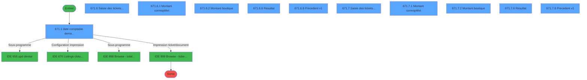
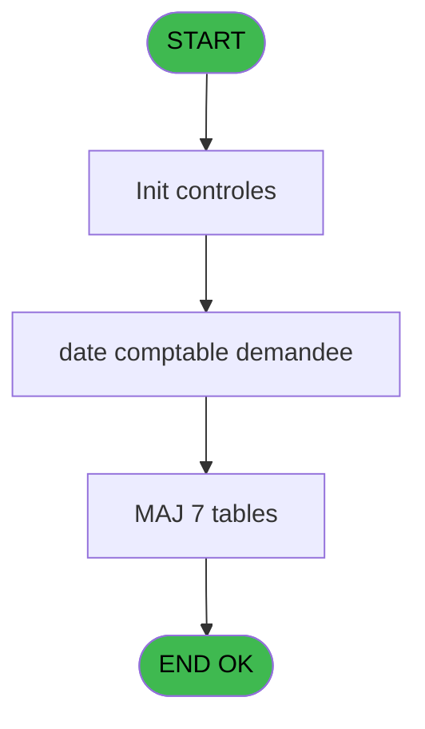
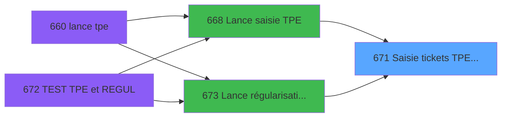
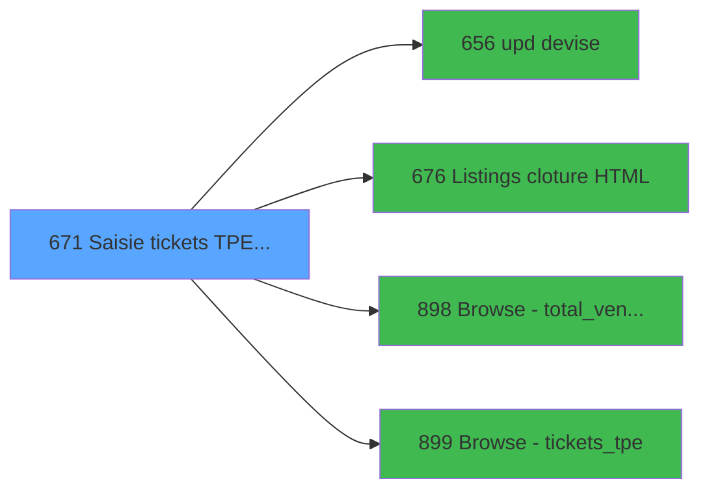

# REF IDE 671 - Saisie tickets TPE Interfacés

> **Analyse**: Phases 1-4 2026-02-03 13:33 -> 13:33 (14s) | Assemblage 13:33
> **Pipeline**: V7.2 Enrichi
> **Structure**: 4 onglets (Resume | Ecrans | Donnees | Connexions)

<!-- TAB:Resume -->

## 1. FICHE D'IDENTITE

| Attribut | Valeur |
|----------|--------|
| Projet | REF |
| IDE Position | 671 |
| Nom Programme | Saisie tickets TPE Interfacés |
| Fichier source | `Prg_671.xml` |
| Dossier IDE | Impression |
| Taches | 76 (11 ecrans visibles) |
| Tables modifiees | 7 |
| Programmes appeles | 4 |

## 2. DESCRIPTION FONCTIONNELLE

**Saisie tickets TPE Interfacés** assure la gestion complete de ce processus, accessible depuis [Lance saisie TPE (IDE 668)](REF-IDE-668.md), [Lance régularisation TPE (IDE 673)](REF-IDE-673.md).

Le flux de traitement s'organise en **6 blocs fonctionnels** :

- **Traitement** (29 taches) : traitements metier divers
- **Saisie** (15 taches) : ecrans de saisie utilisateur (formulaires, champs, donnees)
- **Calcul** (12 taches) : calculs de montants, stocks ou compteurs
- **Validation** (10 taches) : controles et verifications de coherence
- **Creation** (7 taches) : insertion d'enregistrements en base (mouvements, prestations)
- **Initialisation** (3 taches) : reinitialisation d'etats et de variables de travail

**Donnees modifiees** : 7 tables en ecriture (plan_comptable_central, saisie_pdc_boutique, suivi_pdc, tickets_tpe, tickets_tpe, correspittivi_boutique, total_ventes_term_mop).

Detail : phases du traitement

#### Phase 1 : Saisie (15 taches)

- **671** - Saisie des tickets TPE 251 **[[ECRAN]](#ecran-t1)**
- **671.1.4** - Calcul  Ventes&Compta
- **671.1.4.1.1** - Calcul Caisse vente **[[ECRAN]](#ecran-t12)**
- **671.1.4.2.3** - montant saisie
- **671.1.4.2.3.1** - total saisie
- **671.6** - Saisie des tickets TPE **[[ECRAN]](#ecran-t35)**
- **671.6.1.2.1** - total saisie
- **671.6.1.2.2** - Controle saisie
- **671.6.1.2.3.1** - Totalle saisie autre compte
- **671.6.2.3.1** - total saisie
- **671.7** - Saisie des tickets TPE **[[ECRAN]](#ecran-t55)**
- **671.7.1.2.1** - total saisie
- **671.7.1.2.2** - Controle saisie
- **671.7.1.2.3.1** - Totalle saisie autre compte
- **671.7.2.3.1** - total saisie

Delegue a : [Browse - total_ventes_term_mop (IDE 898)](REF-IDE-898.md)

#### Phase 2 : Calcul (12 taches)

- **671.1** - date comptable demandee **[[ECRAN]](#ecran-t2)**
- **671.1.2** - Calcul Code Remise BOUT **[[ECRAN]](#ecran-t6)**
- **671.1.4.1** - Calcul courant
- **671.1.4.1.1.1** - total calcule
- **671.1.4.1.2** - calcul OD **[[ECRAN]](#ecran-t14)**
- **671.1.4.1.2.1** - total calcule
- **671.1.4.2** - montant calcul
- **671.1.4.2.1** - montant calcul
- **671.1.4.2.1.1** - total calcule
- **671.1.4.2.2** - montant calcul **[[ECRAN]](#ecran-t19)**
- **671.1.4.2.2.1** - total calcule
- **671.1.5** - Calcul Code Remise **[[ECRAN]](#ecran-t23)**

#### Phase 3 : Initialisation (3 taches)

- **671.1.1** - Initialisation
- **671.1.1.1** - initialisation table v1
- **671.1.1.2** - initialisation table

#### Phase 4 : Validation (10 taches)

- **671.1.3** - Validation
- **671.1.9** - verif ancien tpe
- **671.6.1.2** - Validation suite
- **671.6.1.2.3** - Controle autres comptes boutiq
- **671.6.2.2** - Validation
- **671.6.2.3** - Validation suite
- **671.7.1.2** - Validation suite
- **671.7.1.2.3** - Controle autres comptes boutiq
- **671.7.2.2** - Validation
- **671.7.2.3** - Validation suite

#### Phase 5 : Traitement (29 taches)

- **671.1.3.1** - secu pour abandon
- **671.1.8** - delete ligne vide
- **671.2** - Retour Abandon
- **671.2.1** - retour abandon
- **671.3** - Sessions ouvertes WS
- **671.4** - param caisse
- **671.5** - Remise
- **671.6.1** - Montant correspittivi **[[ECRAN]](#ecran-t36)**
- **671.6.1.1** - Abandon
- **671.6.2** - Montant boutique **[[ECRAN]](#ecran-t43)**
- **671.6.2.1** - Abandon
- **671.6.2.3.2** - total téléco
- **671.6.3** - Maj des Totaux
- **671.6.4** - Ecart **[[ECRAN]](#ecran-t50)**
- **671.6.5** - Ecart **[[ECRAN]](#ecran-t51)**
- **671.6.6** - Resultat **[[ECRAN]](#ecran-t52)**
- **671.6.7** - Update suivi PDC
- **671.6.8** - Precedent v1 **[[ECRAN]](#ecran-t54)**
- **671.7.1** - Montant correspittivi **[[ECRAN]](#ecran-t56)**
- **671.7.1.1** - Abandon
- **671.7.2** - Montant boutique **[[ECRAN]](#ecran-t63)**
- **671.7.2.1** - Abandon
- **671.7.2.3.2** - total téléco
- **671.7.3** - Maj des Totaux
- **671.7.4** - Ecart **[[ECRAN]](#ecran-t70)**
- **671.7.5** - Ecart **[[ECRAN]](#ecran-t71)**
- **671.7.6** - Resultat **[[ECRAN]](#ecran-t72)**
- **671.7.7** - Update suivi PDC
- **671.7.8** - Precedent v1 **[[ECRAN]](#ecran-t74)**

Delegue a : [upd devise (IDE 656)](REF-IDE-656.md), [Listings cloture HTML (IDE 676)](REF-IDE-676.md)

#### Phase 6 : Creation (7 taches)

- **671.1.3.1.1** - create tempo
- **671.1.6** - Insert v1 **[[ECRAN]](#ecran-t24)**
- **671.1.6.1** - Create Ligne Sepaation
- **671.1.7** - Insert v1 **[[ECRAN]](#ecran-t26)**
- **671.1.7.1** - Create Ligne Sepaation
- **671.1.6.2** - Insert v1 **[[ECRAN]](#ecran-t77)**
- **671.1.7.2** - Insert v1 **[[ECRAN]](#ecran-t80)**

#### Tables impactees

| Table | Operations | Role metier |
|-------|-----------|-------------|
| total_ventes_term_mop | **W**/L (23 usages) | Donnees de ventes |
| tickets_tpe | R/**W**/L (21 usages) |  |
| saisie_pdc_boutique | R/**W**/L (8 usages) |  |
| correspittivi_boutique | R/**W**/L (6 usages) |  |
| tickets_tpe | **W**/L (3 usages) |  |
| plan_comptable_central | **W** (2 usages) |  |
| suivi_pdc | **W** (2 usages) |  |

## 3. BLOCS FONCTIONNELS

### 3.1 Saisie (15 taches)

L'operateur saisit les donnees de la transaction via 4 ecrans (Saisie des tickets TPE 251, Calcul Caisse vente, Saisie des tickets TPE, Saisie des tickets TPE).

---

#### 671 - Saisie des tickets TPE 251 [[ECRAN]](#ecran-t1)

**Role** : Tache d'orchestration : point d'entree du programme (15 sous-taches). Coordonne l'enchainement des traitements.
**Ecran** : 856 x 408 DLU (MDI) | [Voir mockup](#ecran-t1)

14 sous-taches directes

| Tache | Nom | Bloc |
|-------|-----|------|
| [671.1.4](#t10) | Calcul  Ventes&Compta | Saisie |
| [671.1.4.1.1](#t12) | Calcul Caisse vente **[[ECRAN]](#ecran-t12)** | Saisie |
| [671.1.4.2.3](#t21) | montant saisie | Saisie |
| [671.1.4.2.3.1](#t22) | total saisie | Saisie |
| [671.6](#t35) | Saisie des tickets TPE **[[ECRAN]](#ecran-t35)** | Saisie |
| [671.6.1.2.1](#t39) | total saisie | Saisie |
| [671.6.1.2.2](#t40) | Controle saisie | Saisie |
| [671.6.1.2.3.1](#t42) | Totalle saisie autre compte | Saisie |
| [671.6.2.3.1](#t47) | total saisie | Saisie |
| [671.7](#t55) | Saisie des tickets TPE **[[ECRAN]](#ecran-t55)** | Saisie |
| [671.7.1.2.1](#t59) | total saisie | Saisie |
| [671.7.1.2.2](#t60) | Controle saisie | Saisie |
| [671.7.1.2.3.1](#t62) | Totalle saisie autre compte | Saisie |
| [671.7.2.3.1](#t67) | total saisie | Saisie |

**Variables liees** : X (v.Montant régul saisie)

---

#### 671.1.4 - Calcul  Ventes&Compta

**Role** : Saisie des donnees : Calcul  Ventes&Compta.

---

#### 671.1.4.1.1 - Calcul Caisse vente [[ECRAN]](#ecran-t12)

**Role** : Saisie des donnees : Calcul Caisse vente.
**Ecran** : 993 x 407 DLU (MDI) | [Voir mockup](#ecran-t12)

---

#### 671.1.4.2.3 - montant saisie

**Role** : Saisie des donnees : montant saisie.
**Variables liees** : M (P.o Montant Regul Sup Max?), W (v.Montant max à régulariser), X (v.Montant régul saisie)

---

#### 671.1.4.2.3.1 - total saisie

**Role** : Saisie des donnees : total saisie.
**Variables liees** : X (v.Montant régul saisie)

---

#### 671.6 - Saisie des tickets TPE [[ECRAN]](#ecran-t35)

**Role** : Saisie des donnees : Saisie des tickets TPE.
**Ecran** : 1286 x 275 DLU (Type6) | [Voir mockup](#ecran-t35)
**Variables liees** : X (v.Montant régul saisie)

---

#### 671.6.1.2.1 - total saisie

**Role** : Saisie des donnees : total saisie.
**Variables liees** : X (v.Montant régul saisie)

---

#### 671.6.1.2.2 - Controle saisie

**Role** : Saisie des donnees : Controle saisie.
**Variables liees** : X (v.Montant régul saisie)

---

#### 671.6.1.2.3.1 - Totalle saisie autre compte

**Role** : Saisie des donnees : Totalle saisie autre compte.
**Variables liees** : X (v.Montant régul saisie)

---

#### 671.6.2.3.1 - total saisie

**Role** : Saisie des donnees : total saisie.
**Variables liees** : X (v.Montant régul saisie)

---

#### 671.7 - Saisie des tickets TPE [[ECRAN]](#ecran-t55)

**Role** : Saisie des donnees : Saisie des tickets TPE.
**Ecran** : 1286 x 275 DLU (Type6) | [Voir mockup](#ecran-t55)
**Variables liees** : X (v.Montant régul saisie)

---

#### 671.7.1.2.1 - total saisie

**Role** : Saisie des donnees : total saisie.
**Variables liees** : X (v.Montant régul saisie)

---

#### 671.7.1.2.2 - Controle saisie

**Role** : Saisie des donnees : Controle saisie.
**Variables liees** : X (v.Montant régul saisie)

---

#### 671.7.1.2.3.1 - Totalle saisie autre compte

**Role** : Saisie des donnees : Totalle saisie autre compte.
**Variables liees** : X (v.Montant régul saisie)

---

#### 671.7.2.3.1 - total saisie

**Role** : Saisie des donnees : total saisie.
**Variables liees** : X (v.Montant régul saisie)

### 3.2 Calcul (12 taches)

Calculs metier : montants, stocks, compteurs.

---

#### 671.1 - date comptable demandee [[ECRAN]](#ecran-t2)

**Role** : Traitement : date comptable demandee.
**Ecran** : 640 x 198 DLU (MDI) | [Voir mockup](#ecran-t2)
**Variables liees** : B (P.i date comptable), F (P.i.o date comptable demandee), Y (v.Date validée?)

---

#### 671.1.2 - Calcul Code Remise BOUT [[ECRAN]](#ecran-t6)

**Role** : Calcul : Calcul Code Remise BOUT.
**Ecran** : 754 x 0 DLU | [Voir mockup](#ecran-t6)
**Variables liees** : D (P.i code service), I (P.i activite de la boutique), J (P.i est un term BOUT), S (v Remise Numero Commercant), T (V Remise Emv (Visa Mastercard))

---

#### 671.1.4.1 - Calcul courant

**Role** : Calcul : Calcul courant.

---

#### 671.1.4.1.1.1 - total calcule

**Role** : Calcul : total calcule.

---

#### 671.1.4.1.2 - calcul OD [[ECRAN]](#ecran-t14)

**Role** : Calcul : calcul OD.
**Ecran** : 960 x 445 DLU (MDI) | [Voir mockup](#ecran-t14)

---

#### 671.1.4.1.2.1 - total calcule

**Role** : Calcul : total calcule.

---

#### 671.1.4.2 - montant calcul

**Role** : Calcul : montant calcul.
**Variables liees** : M (P.o Montant Regul Sup Max?), W (v.Montant max à régulariser), X (v.Montant régul saisie)

---

#### 671.1.4.2.1 - montant calcul

**Role** : Calcul : montant calcul.
**Variables liees** : M (P.o Montant Regul Sup Max?), W (v.Montant max à régulariser), X (v.Montant régul saisie)

---

#### 671.1.4.2.1.1 - total calcule

**Role** : Calcul : total calcule.

---

#### 671.1.4.2.2 - montant calcul [[ECRAN]](#ecran-t19)

**Role** : Calcul : montant calcul.
**Ecran** : 845 x 262 DLU (MDI) | [Voir mockup](#ecran-t19)
**Variables liees** : M (P.o Montant Regul Sup Max?), W (v.Montant max à régulariser), X (v.Montant régul saisie)

---

#### 671.1.4.2.2.1 - total calcule

**Role** : Calcul : total calcule.

---

#### 671.1.5 - Calcul Code Remise [[ECRAN]](#ecran-t23)

**Role** : Calcul : Calcul Code Remise.
**Ecran** : 754 x 0 DLU | [Voir mockup](#ecran-t23)
**Variables liees** : D (P.i code service), S (v Remise Numero Commercant), T (V Remise Emv (Visa Mastercard)), U (V Remise Amex), V (V Remise VAD)

### 3.3 Initialisation (3 taches)

Reinitialisation d'etats et variables de travail.

---

#### 671.1.1 - Initialisation

**Role** : Reinitialisation : Initialisation.

---

#### 671.1.1.1 - initialisation table v1

**Role** : Reinitialisation : initialisation table v1.
**Variables liees** : B (P.i date comptable), F (P.i.o date comptable demandee)

---

#### 671.1.1.2 - initialisation table

**Role** : Reinitialisation : initialisation table.
**Variables liees** : B (P.i date comptable), F (P.i.o date comptable demandee)

### 3.4 Validation (10 taches)

Controles de coherence : 10 taches verifient les donnees et conditions.

---

#### 671.1.3 - Validation

**Role** : Verification : Validation.

---

#### 671.1.9 - verif ancien tpe

**Role** : Verification : verif ancien tpe.

---

#### 671.6.1.2 - Validation suite

**Role** : Verification : Validation suite.

---

#### 671.6.1.2.3 - Controle autres comptes boutiq

**Role** : Verification : Controle autres comptes boutiq.
**Variables liees** : I (P.i activite de la boutique)

---

#### 671.6.2.2 - Validation

**Role** : Verification : Validation.

---

#### 671.6.2.3 - Validation suite

**Role** : Verification : Validation suite.

---

#### 671.7.1.2 - Validation suite

**Role** : Verification : Validation suite.

---

#### 671.7.1.2.3 - Controle autres comptes boutiq

**Role** : Verification : Controle autres comptes boutiq.
**Variables liees** : I (P.i activite de la boutique)

---

#### 671.7.2.2 - Validation

**Role** : Verification : Validation.

---

#### 671.7.2.3 - Validation suite

**Role** : Verification : Validation suite.

### 3.5 Traitement (29 taches)

Traitements internes.

---

#### 671.1.3.1 - secu pour abandon

**Role** : Traitement : secu pour abandon.
**Variables liees** : K (P.o abandon demande)

---

#### 671.1.8 - delete ligne vide

**Role** : Traitement : delete ligne vide.

---

#### 671.2 - Retour Abandon

**Role** : Traitement : Retour Abandon.
**Variables liees** : K (P.o abandon demande)

---

#### 671.2.1 - retour abandon

**Role** : Traitement : retour abandon.
**Variables liees** : K (P.o abandon demande)

---

#### 671.3 - Sessions ouvertes WS

**Role** : Traitement : Sessions ouvertes WS.

---

#### 671.4 - param caisse

**Role** : Traitement : param caisse.

---

#### 671.5 - Remise

**Role** : Calcul fidelite/avantage : Remise.
**Variables liees** : S (v Remise Numero Commercant), T (V Remise Emv (Visa Mastercard)), U (V Remise Amex), V (V Remise VAD)

---

#### 671.6.1 - Montant correspittivi [[ECRAN]](#ecran-t36)

**Role** : Traitement : Montant correspittivi.
**Ecran** : 1514 x 289 DLU (Type6) | [Voir mockup](#ecran-t36)
**Variables liees** : M (P.o Montant Regul Sup Max?), W (v.Montant max à régulariser), X (v.Montant régul saisie)

---

#### 671.6.1.1 - Abandon

**Role** : Traitement : Abandon.
**Variables liees** : K (P.o abandon demande)

---

#### 671.6.2 - Montant boutique [[ECRAN]](#ecran-t43)

**Role** : Traitement : Montant boutique.
**Ecran** : 1278 x 241 DLU (Type6) | [Voir mockup](#ecran-t43)
**Variables liees** : I (P.i activite de la boutique), M (P.o Montant Regul Sup Max?), W (v.Montant max à régulariser), X (v.Montant régul saisie)

---

#### 671.6.2.1 - Abandon

**Role** : Traitement : Abandon.
**Variables liees** : K (P.o abandon demande)

---

#### 671.6.2.3.2 - total téléco

**Role** : Traitement : total téléco.

---

#### 671.6.3 - Maj des Totaux

**Role** : Calcul : Maj des Totaux.

---

#### 671.6.4 - Ecart [[ECRAN]](#ecran-t50)

**Role** : Traitement : Ecart.
**Ecran** : 721 x 359 DLU (MDI) | [Voir mockup](#ecran-t50)
**Variables liees** : E (P.o ecart corrige), O (v existe ecart)

---

#### 671.6.5 - Ecart [[ECRAN]](#ecran-t51)

**Role** : Traitement : Ecart.
**Ecran** : 721 x 359 DLU (MDI) | [Voir mockup](#ecran-t51)
**Variables liees** : E (P.o ecart corrige), O (v existe ecart)

---

#### 671.6.6 - Resultat [[ECRAN]](#ecran-t52)

**Role** : Traitement : Resultat.
**Ecran** : 1278 x 240 DLU (MDI) | [Voir mockup](#ecran-t52)

---

#### 671.6.7 - Update suivi PDC

**Role** : Traitement : Update suivi PDC.

---

#### 671.6.8 - Precedent v1 [[ECRAN]](#ecran-t54)

**Role** : Traitement : Precedent v1.
**Ecran** : 1263 x 51 DLU (Modal) | [Voir mockup](#ecran-t54)

---

#### 671.7.1 - Montant correspittivi [[ECRAN]](#ecran-t56)

**Role** : Traitement : Montant correspittivi.
**Ecran** : 1514 x 289 DLU (Type6) | [Voir mockup](#ecran-t56)
**Variables liees** : M (P.o Montant Regul Sup Max?), W (v.Montant max à régulariser), X (v.Montant régul saisie)

---

#### 671.7.1.1 - Abandon

**Role** : Traitement : Abandon.
**Variables liees** : K (P.o abandon demande)

---

#### 671.7.2 - Montant boutique [[ECRAN]](#ecran-t63)

**Role** : Traitement : Montant boutique.
**Ecran** : 1278 x 241 DLU (Type6) | [Voir mockup](#ecran-t63)
**Variables liees** : I (P.i activite de la boutique), M (P.o Montant Regul Sup Max?), W (v.Montant max à régulariser), X (v.Montant régul saisie)

---

#### 671.7.2.1 - Abandon

**Role** : Traitement : Abandon.
**Variables liees** : K (P.o abandon demande)

---

#### 671.7.2.3.2 - total téléco

**Role** : Traitement : total téléco.

---

#### 671.7.3 - Maj des Totaux

**Role** : Calcul : Maj des Totaux.

---

#### 671.7.4 - Ecart [[ECRAN]](#ecran-t70)

**Role** : Traitement : Ecart.
**Ecran** : 721 x 359 DLU (MDI) | [Voir mockup](#ecran-t70)
**Variables liees** : E (P.o ecart corrige), O (v existe ecart)

---

#### 671.7.5 - Ecart [[ECRAN]](#ecran-t71)

**Role** : Traitement : Ecart.
**Ecran** : 721 x 359 DLU (MDI) | [Voir mockup](#ecran-t71)
**Variables liees** : E (P.o ecart corrige), O (v existe ecart)

---

#### 671.7.6 - Resultat [[ECRAN]](#ecran-t72)

**Role** : Traitement : Resultat.
**Ecran** : 1278 x 240 DLU (MDI) | [Voir mockup](#ecran-t72)

---

#### 671.7.7 - Update suivi PDC

**Role** : Traitement : Update suivi PDC.

---

#### 671.7.8 - Precedent v1 [[ECRAN]](#ecran-t74)

**Role** : Traitement : Precedent v1.
**Ecran** : 1263 x 51 DLU (Modal) | [Voir mockup](#ecran-t74)

### 3.6 Creation (7 taches)

Insertion de nouveaux enregistrements en base.

---

#### 671.1.3.1.1 - create tempo

**Role** : Traitement : create tempo.

---

#### 671.1.6 - Insert v1 [[ECRAN]](#ecran-t24)

**Role** : Creation d'enregistrement : Insert v1.
**Ecran** : 646 x 0 DLU | [Voir mockup](#ecran-t24)

---

#### 671.1.6.1 - Create Ligne Sepaation

**Role** : Traitement : Create Ligne Sepaation.

---

#### 671.1.7 - Insert v1 [[ECRAN]](#ecran-t26)

**Role** : Creation d'enregistrement : Insert v1.
**Ecran** : 646 x 0 DLU | [Voir mockup](#ecran-t26)

---

#### 671.1.7.1 - Create Ligne Sepaation

**Role** : Traitement : Create Ligne Sepaation.

---

#### 671.1.6.2 - Insert v1 [[ECRAN]](#ecran-t77)

**Role** : Creation d'enregistrement : Insert v1.
**Ecran** : 646 x 0 DLU | [Voir mockup](#ecran-t77)

---

#### 671.1.7.2 - Insert v1 [[ECRAN]](#ecran-t80)

**Role** : Creation d'enregistrement : Insert v1.
**Ecran** : 646 x 0 DLU | [Voir mockup](#ecran-t80)

## 5. REGLES METIER

*(Aucune regle metier identifiee)*

## 6. CONTEXTE

- **Appele par**: [Lance saisie TPE (IDE 668)](REF-IDE-668.md), [Lance régularisation TPE (IDE 673)](REF-IDE-673.md)
- **Appelle**: 4 programmes | **Tables**: 24 (W:7 R:14 L:15) | **Taches**: 76 | **Expressions**: 17

<!-- TAB:Ecrans -->

## 8. ECRANS

### 8.1 Forms visibles (11 / 76)

| # | Position | Tache | Nom | Type | Largeur | Hauteur | Bloc |
|---|----------|-------|-----|------|---------|---------|------|
| 1 | 671.1 | 671.1 | date comptable demandee | MDI | 640 | 198 | Calcul |
| 2 | 671.6 | 671.6 | Saisie des tickets TPE | Type6 | 1286 | 275 | Saisie |
| 3 | 671.6.1 | 671.6.1 | Montant correspittivi | Type6 | 1514 | 289 | Traitement |
| 4 | 671.6.2 | 671.6.2 | Montant boutique | Type6 | 1278 | 241 | Traitement |
| 5 | 671.6.6 | 671.6.6 | Resultat | MDI | 1278 | 240 | Traitement |
| 6 | 671.6.8 | 671.6.8 | Precedent v1 | Modal | 1263 | 51 | Traitement |
| 7 | 671.7 | 671.7 | Saisie des tickets TPE | Type6 | 1286 | 275 | Saisie |
| 8 | 671.7.1 | 671.7.1 | Montant correspittivi | Type6 | 1514 | 289 | Traitement |
| 9 | 671.7.2 | 671.7.2 | Montant boutique | Type6 | 1278 | 241 | Traitement |
| 10 | 671.7.6 | 671.7.6 | Resultat | MDI | 1278 | 240 | Traitement |
| 11 | 671.7.8 | 671.7.8 | Precedent v1 | Modal | 1263 | 51 | Traitement |

### 8.2 Mockups Ecrans

---

#### 671.1 - date comptable demandee
**Tache** : [671.1](#t2) | **Type** : MDI | **Dimensions** : 640 x 198 DLU
**Bloc** : Calcul | **Titre IDE** : date comptable demandee

<!-- FORM-DATA:
{
    "width":  640,
    "vFactor":  8,
    "type":  "MDI",
    "hFactor":  8,
    "controls":  [
                     {
                         "x":  0,
                         "type":  "label",
                         "var":  "",
                         "y":  1,
                         "w":  638,
                         "fmt":  "",
                         "name":  "",
                         "h":  18,
                         "color":  "",
                         "text":  "",
                         "parent":  null
                     },
                     {
                         "x":  0,
                         "type":  "label",
                         "var":  "",
                         "y":  23,
                         "w":  638,
                         "fmt":  "",
                         "name":  "",
                         "h":  148,
                         "color":  "",
                         "text":  "",
                         "parent":  null
                     },
                     {
                         "x":  313,
                         "type":  "label",
                         "var":  "",
                         "y":  73,
                         "w":  213,
                         "fmt":  "",
                         "name":  "",
                         "h":  8,
                         "color":  "",
                         "text":  "Date comptable demandée",
                         "parent":  null
                     },
                     {
                         "x":  0,
                         "type":  "label",
                         "var":  "",
                         "y":  174,
                         "w":  638,
                         "fmt":  "",
                         "name":  "",
                         "h":  24,
                         "color":  "",
                         "text":  "",
                         "parent":  null
                     },
                     {
                         "x":  356,
                         "type":  "edit",
                         "var":  "",
                         "y":  98,
                         "w":  126,
                         "fmt":  "",
                         "name":  "",
                         "h":  10,
                         "color":  "6",
                         "text":  "",
                         "parent":  null
                     },
                     {
                         "x":  409,
                         "type":  "edit",
                         "var":  "",
                         "y":  6,
                         "w":  216,
                         "fmt":  "WWW  DD MMM YYYYT",
                         "name":  "",
                         "h":  8,
                         "color":  "",
                         "text":  "",
                         "parent":  null
                     },
                     {
                         "x":  40,
                         "type":  "image",
                         "var":  "",
                         "y":  77,
                         "w":  147,
                         "fmt":  "",
                         "name":  "",
                         "h":  45,
                         "color":  "",
                         "text":  "",
                         "parent":  null
                     },
                     {
                         "x":  471,
                         "type":  "button",
                         "var":  "",
                         "y":  177,
                         "w":  154,
                         "fmt":  "\u0026Validation",
                         "name":  "",
                         "h":  18,
                         "color":  "",
                         "text":  "",
                         "parent":  null
                     },
                     {
                         "x":  7,
                         "type":  "edit",
                         "var":  "",
                         "y":  6,
                         "w":  267,
                         "fmt":  "30",
                         "name":  "",
                         "h":  8,
                         "color":  "",
                         "text":  "",
                         "parent":  null
                     },
                     {
                         "x":  17,
                         "type":  "button",
                         "var":  "",
                         "y":  177,
                         "w":  154,
                         "fmt":  "\u0026Annulation",
                         "name":  "",
                         "h":  18,
                         "color":  "",
                         "text":  "",
                         "parent":  null
                     }
                 ],
    "taskId":  "671.1",
    "height":  198
}
-->

<strong>Champs : 3 champs</strong>

| Pos (x,y) | Nom | Variable | Type |
|-----------|-----|----------|------|
| 356,98 | (sans nom) | - | edit |
| 409,6 | WWW  DD MMM YYYYT | - | edit |
| 7,6 | 30 | - | edit |

<strong>Boutons : 2 boutons</strong>

| Bouton | Pos (x,y) | Action |
|--------|-----------|--------|
| Validation | 471,177 | Valide la saisie et enregistre |
| Annulation | 17,177 | Annule et retour au menu |

---

#### 671.6 - Saisie des tickets TPE
**Tache** : [671.6](#t35) | **Type** : Type6 | **Dimensions** : 1286 x 275 DLU
**Bloc** : Saisie | **Titre IDE** : Saisie des tickets TPE

<!-- FORM-DATA:
{
    "width":  1286,
    "vFactor":  8,
    "type":  "Type6",
    "hFactor":  8,
    "controls":  [
                     {
                         "x":  2,
                         "type":  "label",
                         "var":  "",
                         "y":  1,
                         "w":  1280,
                         "fmt":  "",
                         "name":  "",
                         "h":  24,
                         "color":  "",
                         "text":  "",
                         "parent":  null
                     },
                     {
                         "x":  278,
                         "type":  "label",
                         "var":  "",
                         "y":  8,
                         "w":  76,
                         "fmt":  "",
                         "name":  "",
                         "h":  10,
                         "color":  "42",
                         "text":  "Service",
                         "parent":  null
                     },
                     {
                         "x":  486,
                         "type":  "label",
                         "var":  "",
                         "y":  8,
                         "w":  164,
                         "fmt":  "",
                         "name":  "",
                         "h":  10,
                         "color":  "42",
                         "text":  "Date comptable",
                         "parent":  null
                     },
                     {
                         "x":  2,
                         "type":  "label",
                         "var":  "",
                         "y":  249,
                         "w":  1277,
                         "fmt":  "",
                         "name":  "",
                         "h":  24,
                         "color":  "",
                         "text":  "",
                         "parent":  null
                     },
                     {
                         "x":  19,
                         "type":  "table",
                         "var":  "",
                         "name":  "",
                         "titleH":  12,
                         "color":  "110",
                         "w":  1262,
                         "y":  34,
                         "fmt":  "",
                         "parent":  null,
                         "text":  "",
                         "rowH":  13,
                         "h":  208,
                         "cols":  [
                                      {
                                          "title":  "TPE",
                                          "layer":  1,
                                          "w":  53
                                      },
                                      {
                                          "title":  "Terminal",
                                          "layer":  2,
                                          "w":  77
                                      },
                                      {
                                          "title":  "Emplacement",
                                          "layer":  3,
                                          "w":  358
                                      },
                                      {
                                          "title":  "MOP",
                                          "layer":  4,
                                          "w":  67
                                      },
                                      {
                                          "title":  "Montant Calculé",
                                          "layer":  5,
                                          "w":  161
                                      },
                                      {
                                          "title":  "Montant Corrigé",
                                          "layer":  6,
                                          "w":  151
                                      },
                                      {
                                          "title":  "Numéro remise",
                                          "layer":  7,
                                          "w":  199
                                      },
                                      {
                                          "title":  "Date opération TPE",
                                          "layer":  8,
                                          "w":  160
                                      }
                                  ],
                         "rows":  8
                     },
                     {
                         "x":  26,
                         "type":  "edit",
                         "var":  "",
                         "y":  49,
                         "w":  40,
                         "fmt":  "",
                         "name":  "",
                         "h":  8,
                         "color":  "110",
                         "text":  "",
                         "parent":  9
                     },
                     {
                         "x":  518,
                         "type":  "edit",
                         "var":  "",
                         "y":  49,
                         "w":  53,
                         "fmt":  "",
                         "name":  "",
                         "h":  8,
                         "color":  "110",
                         "text":  "",
                         "parent":  9
                     },
                     {
                         "x":  743,
                         "type":  "edit",
                         "var":  "",
                         "y":  49,
                         "w":  134,
                         "fmt":  "10.3",
                         "name":  "Montant",
                         "h":  8,
                         "color":  "110",
                         "text":  "",
                         "parent":  9
                     },
                     {
                         "x":  893,
                         "type":  "edit",
                         "var":  "",
                         "y":  49,
                         "w":  187,
                         "fmt":  "16",
                         "name":  "Numero remise",
                         "h":  8,
                         "color":  "110",
                         "text":  "",
                         "parent":  9
                     },
                     {
                         "x":  1091,
                         "type":  "edit",
                         "var":  "",
                         "y":  49,
                         "w":  152,
                         "fmt":  "##/##/####Z",
                         "name":  "",
                         "h":  8,
                         "color":  "110",
                         "text":  "",
                         "parent":  9
                     },
                     {
                         "x":  9,
                         "type":  "edit",
                         "var":  "",
                         "y":  8,
                         "w":  267,
                         "fmt":  "30",
                         "name":  "",
                         "h":  10,
                         "color":  "",
                         "text":  "",
                         "parent":  null
                     },
                     {
                         "x":  642,
                         "type":  "edit",
                         "var":  "",
                         "y":  8,
                         "w":  158,
                         "fmt":  "",
                         "name":  "",
                         "h":  10,
                         "color":  "42",
                         "text":  "",
                         "parent":  null
                     },
                     {
                         "x":  999,
                         "type":  "edit",
                         "var":  "",
                         "y":  8,
                         "w":  216,
                         "fmt":  "WWW  DD MMM YYYYT",
                         "name":  "",
                         "h":  10,
                         "color":  "",
                         "text":  "",
                         "parent":  null
                     },
                     {
                         "x":  158,
                         "type":  "edit",
                         "var":  "",
                         "y":  49,
                         "w":  336,
                         "fmt":  "30",
                         "name":  "",
                         "h":  8,
                         "color":  "110",
                         "text":  "",
                         "parent":  9
                     },
                     {
                         "x":  11,
                         "type":  "button",
                         "var":  "",
                         "y":  252,
                         "w":  154,
                         "fmt":  "A\u0026bandon",
                         "name":  "",
                         "h":  18,
                         "color":  "",
                         "text":  "",
                         "parent":  null
                     },
                     {
                         "x":  1116,
                         "type":  "button",
                         "var":  "",
                         "y":  252,
                         "w":  154,
                         "fmt":  "\u0026Continue",
                         "name":  "",
                         "h":  18,
                         "color":  "",
                         "text":  "",
                         "parent":  null
                     },
                     {
                         "x":  89,
                         "type":  "edit",
                         "var":  "",
                         "y":  49,
                         "w":  34,
                         "fmt":  "4",
                         "name":  "terminal",
                         "h":  8,
                         "color":  "110",
                         "text":  "",
                         "parent":  9
                     },
                     {
                         "x":  580,
                         "type":  "edit",
                         "var":  "",
                         "y":  49,
                         "w":  144,
                         "fmt":  "N10.3",
                         "name":  "montant_calcule",
                         "h":  8,
                         "color":  "110",
                         "text":  "",
                         "parent":  9
                     },
                     {
                         "x":  362,
                         "type":  "edit",
                         "var":  "",
                         "y":  8,
                         "w":  75,
                         "fmt":  "",
                         "name":  "Param code service",
                         "h":  10,
                         "color":  "42",
                         "text":  "",
                         "parent":  null
                     }
                 ],
    "taskId":  "671.6",
    "height":  275
}
-->

<strong>Champs : 12 champs</strong>

| Pos (x,y) | Nom | Variable | Type |
|-----------|-----|----------|------|
| 26,49 | (sans nom) | - | edit |
| 518,49 | (sans nom) | - | edit |
| 743,49 | Montant | - | edit |
| 893,49 | Numero remise | - | edit |
| 1091,49 | ##/##/####Z | - | edit |
| 9,8 | 30 | - | edit |
| 642,8 | (sans nom) | - | edit |
| 999,8 | WWW  DD MMM YYYYT | - | edit |
| 158,49 | 30 | - | edit |
| 89,49 | terminal | - | edit |
| 580,49 | montant_calcule | - | edit |
| 362,8 | Param code service | - | edit |

<strong>Boutons : 2 boutons</strong>

| Bouton | Pos (x,y) | Action |
|--------|-----------|--------|
| Abandon | 11,252 | Annule et retour au menu |
| Continue | 1116,252 | Bouton fonctionnel |

---

#### 671.6.1 - Montant correspittivi
**Tache** : [671.6.1](#t36) | **Type** : Type6 | **Dimensions** : 1514 x 289 DLU
**Bloc** : Traitement | **Titre IDE** : Montant correspittivi

<!-- FORM-DATA:
{
    "width":  1514,
    "vFactor":  8,
    "type":  "Type6",
    "hFactor":  8,
    "controls":  [
                     {
                         "x":  1,
                         "type":  "label",
                         "var":  "",
                         "y":  2,
                         "w":  1492,
                         "fmt":  "",
                         "name":  "",
                         "h":  18,
                         "color":  "",
                         "text":  "",
                         "parent":  null
                     },
                     {
                         "x":  578,
                         "type":  "label",
                         "var":  "",
                         "y":  6,
                         "w":  190,
                         "fmt":  "",
                         "name":  "",
                         "h":  10,
                         "color":  "7",
                         "text":  "Date comptable",
                         "parent":  null
                     },
                     {
                         "x":  326,
                         "type":  "label",
                         "var":  "",
                         "y":  28,
                         "w":  861,
                         "fmt":  "",
                         "name":  "",
                         "h":  11,
                         "color":  "179",
                         "text":  "ATTENTION, LES MONTANTS SONT A SAISIR TOUTES TAXES COMPRISES",
                         "parent":  null
                     },
                     {
                         "x":  326,
                         "type":  "label",
                         "var":  "",
                         "y":  44,
                         "w":  861,
                         "fmt":  "",
                         "name":  "",
                         "h":  11,
                         "color":  "179",
                         "text":  "",
                         "parent":  null
                     },
                     {
                         "x":  1,
                         "type":  "label",
                         "var":  "",
                         "y":  262,
                         "w":  1492,
                         "fmt":  "",
                         "name":  "",
                         "h":  24,
                         "color":  "",
                         "text":  "",
                         "parent":  null
                     },
                     {
                         "x":  16,
                         "type":  "table",
                         "var":  "",
                         "name":  "",
                         "titleH":  12,
                         "color":  "110",
                         "w":  1477,
                         "y":  70,
                         "fmt":  "",
                         "parent":  null,
                         "text":  "",
                         "rowH":  14,
                         "h":  180,
                         "cols":  [
                                      {
                                          "title":  "Compte",
                                          "layer":  1,
                                          "w":  106
                                      },
                                      {
                                          "title":  "Tva",
                                          "layer":  2,
                                          "w":  67
                                      },
                                      {
                                          "title":  "Libellé du compte",
                                          "layer":  3,
                                          "w":  796
                                      },
                                      {
                                          "title":  "Montant TTC",
                                          "layer":  4,
                                          "w":  244
                                      },
                                      {
                                          "title":  "Montant HT",
                                          "layer":  5,
                                          "w":  224
                                      }
                                  ],
                         "rows":  5
                     },
                     {
                         "x":  19,
                         "type":  "edit",
                         "var":  "",
                         "y":  84,
                         "w":  101,
                         "fmt":  "",
                         "name":  "cos_compte_analytique",
                         "h":  12,
                         "color":  "110",
                         "text":  "",
                         "parent":  9
                     },
                     {
                         "x":  998,
                         "type":  "edit",
                         "var":  "",
                         "y":  84,
                         "w":  222,
                         "fmt":  "N## ### ### ###.###Z",
                         "name":  "cob_montant_ttc",
                         "h":  12,
                         "color":  "110",
                         "text":  "",
                         "parent":  9
                     },
                     {
                         "x":  8,
                         "type":  "edit",
                         "var":  "",
                         "y":  7,
                         "w":  384,
                         "fmt":  "30",
                         "name":  "",
                         "h":  8,
                         "color":  "",
                         "text":  "",
                         "parent":  null
                     },
                     {
                         "x":  1260,
                         "type":  "edit",
                         "var":  "",
                         "y":  7,
                         "w":  216,
                         "fmt":  "WWW  DD MMM YYYYT",
                         "name":  "",
                         "h":  8,
                         "color":  "",
                         "text":  "",
                         "parent":  null
                     },
                     {
                         "x":  194,
                         "type":  "edit",
                         "var":  "",
                         "y":  84,
                         "w":  790,
                         "fmt":  "128",
                         "name":  "",
                         "h":  12,
                         "color":  "110",
                         "text":  "",
                         "parent":  9
                     },
                     {
                         "x":  1325,
                         "type":  "button",
                         "var":  "",
                         "y":  265,
                         "w":  154,
                         "fmt":  "\u0026Validation",
                         "name":  "",
                         "h":  18,
                         "color":  "",
                         "text":  "",
                         "parent":  null
                     },
                     {
                         "x":  776,
                         "type":  "edit",
                         "var":  "",
                         "y":  6,
                         "w":  158,
                         "fmt":  "",
                         "name":  "",
                         "h":  10,
                         "color":  "7",
                         "text":  "",
                         "parent":  null
                     },
                     {
                         "x":  128,
                         "type":  "edit",
                         "var":  "",
                         "y":  84,
                         "w":  54,
                         "fmt":  "2.2Z",
                         "name":  "cos_tva",
                         "h":  12,
                         "color":  "110",
                         "text":  "",
                         "parent":  9
                     },
                     {
                         "x":  1235,
                         "type":  "edit",
                         "var":  "",
                         "y":  85,
                         "w":  214,
                         "fmt":  "N## ### ### ###.###Z",
                         "name":  "cob_montant_ht",
                         "h":  10,
                         "color":  "110",
                         "text":  "",
                         "parent":  9
                     },
                     {
                         "x":  19,
                         "type":  "button",
                         "var":  "",
                         "y":  265,
                         "w":  154,
                         "fmt":  "\u0026Abandon",
                         "name":  "",
                         "h":  18,
                         "color":  "",
                         "text":  "",
                         "parent":  null
                     }
                 ],
    "taskId":  "671.6.1",
    "height":  289
}
-->

<strong>Champs : 8 champs</strong>

| Pos (x,y) | Nom | Variable | Type |
|-----------|-----|----------|------|
| 19,84 | cos_compte_analytique | - | edit |
| 998,84 | cob_montant_ttc | - | edit |
| 8,7 | 30 | - | edit |
| 1260,7 | WWW  DD MMM YYYYT | - | edit |
| 194,84 | 128 | - | edit |
| 776,6 | (sans nom) | - | edit |
| 128,84 | cos_tva | - | edit |
| 1235,85 | cob_montant_ht | - | edit |

<strong>Boutons : 2 boutons</strong>

| Bouton | Pos (x,y) | Action |
|--------|-----------|--------|
| Validation | 1325,265 | Valide la saisie et enregistre |
| Abandon | 19,265 | Annule et retour au menu |

---

#### 671.6.2 - Montant boutique
**Tache** : [671.6.2](#t43) | **Type** : Type6 | **Dimensions** : 1278 x 241 DLU
**Bloc** : Traitement | **Titre IDE** : Montant boutique

<!-- FORM-DATA:
{
    "width":  1278,
    "vFactor":  8,
    "type":  "Type6",
    "hFactor":  8,
    "controls":  [
                     {
                         "x":  1,
                         "type":  "label",
                         "var":  "",
                         "y":  2,
                         "w":  1276,
                         "fmt":  "",
                         "name":  "",
                         "h":  18,
                         "color":  "",
                         "text":  "",
                         "parent":  null
                     },
                     {
                         "x":  460,
                         "type":  "label",
                         "var":  "",
                         "y":  6,
                         "w":  190,
                         "fmt":  "",
                         "name":  "",
                         "h":  10,
                         "color":  "7",
                         "text":  "Date comptable",
                         "parent":  null
                     },
                     {
                         "x":  1,
                         "type":  "label",
                         "var":  "",
                         "y":  216,
                         "w":  1276,
                         "fmt":  "",
                         "name":  "",
                         "h":  24,
                         "color":  "",
                         "text":  "",
                         "parent":  null
                     },
                     {
                         "x":  16,
                         "type":  "table",
                         "var":  "",
                         "name":  "",
                         "titleH":  12,
                         "color":  "110",
                         "w":  1250,
                         "y":  24,
                         "fmt":  "",
                         "parent":  null,
                         "text":  "",
                         "rowH":  14,
                         "h":  180,
                         "cols":  [
                                      {
                                          "title":  "Compte",
                                          "layer":  1,
                                          "w":  94
                                      },
                                      {
                                          "title":  "Activité",
                                          "layer":  2,
                                          "w":  76
                                      },
                                      {
                                          "title":  "Libellé du compte",
                                          "layer":  3,
                                          "w":  421
                                      },
                                      {
                                          "title":  "Montant",
                                          "layer":  4,
                                          "w":  233
                                      },
                                      {
                                          "title":  "Libellé de la pièce de caisse",
                                          "layer":  5,
                                          "w":  393
                                      }
                                  ],
                         "rows":  5
                     },
                     {
                         "x":  19,
                         "type":  "edit",
                         "var":  "",
                         "y":  38,
                         "w":  90,
                         "fmt":  "",
                         "name":  "",
                         "h":  12,
                         "color":  "110",
                         "text":  "",
                         "parent":  7
                     },
                     {
                         "x":  117,
                         "type":  "edit",
                         "var":  "",
                         "y":  38,
                         "w":  67,
                         "fmt":  "",
                         "name":  "",
                         "h":  12,
                         "color":  "110",
                         "text":  "",
                         "parent":  7
                     },
                     {
                         "x":  613,
                         "type":  "edit",
                         "var":  "",
                         "y":  38,
                         "w":  222,
                         "fmt":  "N## ### ### ###.###Z",
                         "name":  "",
                         "h":  12,
                         "color":  "110",
                         "text":  "",
                         "parent":  7
                     },
                     {
                         "x":  846,
                         "type":  "edit",
                         "var":  "",
                         "y":  38,
                         "w":  376,
                         "fmt":  "",
                         "name":  "",
                         "h":  12,
                         "color":  "110",
                         "text":  "",
                         "parent":  7
                     },
                     {
                         "x":  5,
                         "type":  "edit",
                         "var":  "",
                         "y":  7,
                         "w":  384,
                         "fmt":  "30",
                         "name":  "",
                         "h":  8,
                         "color":  "",
                         "text":  "",
                         "parent":  null
                     },
                     {
                         "x":  1036,
                         "type":  "edit",
                         "var":  "",
                         "y":  7,
                         "w":  216,
                         "fmt":  "WWW  DD MMM YYYYT",
                         "name":  "",
                         "h":  8,
                         "color":  "",
                         "text":  "",
                         "parent":  null
                     },
                     {
                         "x":  190,
                         "type":  "edit",
                         "var":  "",
                         "y":  38,
                         "w":  412,
                         "fmt":  "128",
                         "name":  "",
                         "h":  12,
                         "color":  "110",
                         "text":  "",
                         "parent":  7
                     },
                     {
                         "x":  21,
                         "type":  "button",
                         "var":  "",
                         "y":  219,
                         "w":  154,
                         "fmt":  "Abandon",
                         "name":  "",
                         "h":  18,
                         "color":  "",
                         "text":  "",
                         "parent":  null
                     },
                     {
                         "x":  1098,
                         "type":  "button",
                         "var":  "",
                         "y":  219,
                         "w":  154,
                         "fmt":  "\u0026Validation",
                         "name":  "",
                         "h":  18,
                         "color":  "",
                         "text":  "",
                         "parent":  null
                     },
                     {
                         "x":  658,
                         "type":  "edit",
                         "var":  "",
                         "y":  6,
                         "w":  158,
                         "fmt":  "",
                         "name":  "",
                         "h":  10,
                         "color":  "7",
                         "text":  "",
                         "parent":  null
                     }
                 ],
    "taskId":  "671.6.2",
    "height":  241
}
-->

<strong>Champs : 8 champs</strong>

| Pos (x,y) | Nom | Variable | Type |
|-----------|-----|----------|------|
| 19,38 | (sans nom) | - | edit |
| 117,38 | (sans nom) | - | edit |
| 613,38 | N## ### ### ###.###Z | - | edit |
| 846,38 | (sans nom) | - | edit |
| 5,7 | 30 | - | edit |
| 1036,7 | WWW  DD MMM YYYYT | - | edit |
| 190,38 | 128 | - | edit |
| 658,6 | (sans nom) | - | edit |

<strong>Boutons : 2 boutons</strong>

| Bouton | Pos (x,y) | Action |
|--------|-----------|--------|
| Abandon | 21,219 | Annule et retour au menu |
| Validation | 1098,219 | Valide la saisie et enregistre |

---

#### 671.6.6 - Resultat
**Tache** : [671.6.6](#t52) | **Type** : MDI | **Dimensions** : 1278 x 240 DLU
**Bloc** : Traitement | **Titre IDE** : Resultat

<!-- FORM-DATA:
{
    "width":  1278,
    "vFactor":  8,
    "type":  "MDI",
    "hFactor":  8,
    "controls":  [
                     {
                         "x":  3,
                         "type":  "label",
                         "var":  "",
                         "y":  2,
                         "w":  1271,
                         "fmt":  "",
                         "name":  "",
                         "h":  24,
                         "color":  "",
                         "text":  "",
                         "parent":  null
                     },
                     {
                         "x":  307,
                         "type":  "label",
                         "var":  "",
                         "y":  9,
                         "w":  76,
                         "fmt":  "",
                         "name":  "",
                         "h":  10,
                         "color":  "42",
                         "text":  "Service",
                         "parent":  null
                     },
                     {
                         "x":  652,
                         "type":  "label",
                         "var":  "",
                         "y":  9,
                         "w":  161,
                         "fmt":  "",
                         "name":  "",
                         "h":  10,
                         "color":  "42",
                         "text":  "Date comptable",
                         "parent":  null
                     },
                     {
                         "x":  568,
                         "type":  "label",
                         "var":  "",
                         "y":  34,
                         "w":  245,
                         "fmt":  "",
                         "name":  "",
                         "h":  9,
                         "color":  "120",
                         "text":  "Date comptable demandée",
                         "parent":  null
                     },
                     {
                         "x":  534,
                         "type":  "label",
                         "var":  "",
                         "y":  198,
                         "w":  200,
                         "fmt":  "",
                         "name":  "",
                         "h":  10,
                         "color":  "120",
                         "text":  "Aucun écart",
                         "parent":  null
                     },
                     {
                         "x":  3,
                         "type":  "label",
                         "var":  "",
                         "y":  214,
                         "w":  1271,
                         "fmt":  "",
                         "name":  "",
                         "h":  24,
                         "color":  "",
                         "text":  "",
                         "parent":  null
                     },
                     {
                         "x":  12,
                         "type":  "table",
                         "var":  "",
                         "name":  "",
                         "titleH":  12,
                         "color":  "110",
                         "w":  1235,
                         "y":  56,
                         "fmt":  "",
                         "parent":  null,
                         "text":  "",
                         "rowH":  13,
                         "h":  136,
                         "cols":  [
                                      {
                                          "title":  "TPE",
                                          "layer":  1,
                                          "w":  63
                                      },
                                      {
                                          "title":  "MOP",
                                          "layer":  2,
                                          "w":  65
                                      },
                                      {
                                          "title":  "Libellé",
                                          "layer":  3,
                                          "w":  250
                                      },
                                      {
                                          "title":  "Numéro de remise",
                                          "layer":  4,
                                          "w":  234
                                      },
                                      {
                                          "title":  "Montant calculé",
                                          "layer":  5,
                                          "w":  233
                                      },
                                      {
                                          "title":  "Montant saisi",
                                          "layer":  6,
                                          "w":  233
                                      },
                                      {
                                          "title":  "Ecart",
                                          "layer":  7,
                                          "w":  112
                                      }
                                  ],
                         "rows":  7
                     },
                     {
                         "x":  82,
                         "type":  "edit",
                         "var":  "",
                         "y":  72,
                         "w":  53,
                         "fmt":  "",
                         "name":  "mop",
                         "h":  8,
                         "color":  "110",
                         "text":  "",
                         "parent":  12
                     },
                     {
                         "x":  631,
                         "type":  "edit",
                         "var":  "",
                         "y":  72,
                         "w":  221,
                         "fmt":  "",
                         "name":  "montant_calcule",
                         "h":  8,
                         "color":  "110",
                         "text":  "",
                         "parent":  12
                     },
                     {
                         "x":  863,
                         "type":  "edit",
                         "var":  "",
                         "y":  72,
                         "w":  221,
                         "fmt":  "",
                         "name":  "montant_saisi",
                         "h":  8,
                         "color":  "110",
                         "text":  "",
                         "parent":  12
                     },
                     {
                         "x":  1143,
                         "type":  "checkbox",
                         "var":  "",
                         "y":  71,
                         "w":  30,
                         "fmt":  "",
                         "name":  "ecart",
                         "h":  10,
                         "color":  "110",
                         "text":  "",
                         "parent":  12
                     },
                     {
                         "x":  146,
                         "type":  "edit",
                         "var":  "",
                         "y":  72,
                         "w":  238,
                         "fmt":  "",
                         "name":  "",
                         "h":  8,
                         "color":  "110",
                         "text":  "",
                         "parent":  12
                     },
                     {
                         "x":  821,
                         "type":  "edit",
                         "var":  "",
                         "y":  9,
                         "w":  123,
                         "fmt":  "",
                         "name":  "",
                         "h":  10,
                         "color":  "42",
                         "text":  "",
                         "parent":  null
                     },
                     {
                         "x":  1046,
                         "type":  "edit",
                         "var":  "",
                         "y":  10,
                         "w":  216,
                         "fmt":  "WWW  DD MMM YYYYT",
                         "name":  "",
                         "h":  8,
                         "color":  "",
                         "text":  "",
                         "parent":  null
                     },
                     {
                         "x":  821,
                         "type":  "edit",
                         "var":  "",
                         "y":  34,
                         "w":  123,
                         "fmt":  "",
                         "name":  "",
                         "h":  10,
                         "color":  "120",
                         "text":  "",
                         "parent":  null
                     },
                     {
                         "x":  1108,
                         "type":  "button",
                         "var":  "",
                         "y":  217,
                         "w":  154,
                         "fmt":  "\u0026Quitter",
                         "name":  "",
                         "h":  18,
                         "color":  "",
                         "text":  "",
                         "parent":  null
                     },
                     {
                         "x":  7,
                         "type":  "edit",
                         "var":  "",
                         "y":  10,
                         "w":  249,
                         "fmt":  "30",
                         "name":  "",
                         "h":  8,
                         "color":  "",
                         "text":  "",
                         "parent":  null
                     },
                     {
                         "x":  18,
                         "type":  "edit",
                         "var":  "",
                         "y":  72,
                         "w":  51,
                         "fmt":  "",
                         "name":  "terminal",
                         "h":  8,
                         "color":  "110",
                         "text":  "",
                         "parent":  12
                     },
                     {
                         "x":  396,
                         "type":  "edit",
                         "var":  "",
                         "y":  72,
                         "w":  224,
                         "fmt":  "",
                         "name":  "num_remise",
                         "h":  8,
                         "color":  "110",
                         "text":  "",
                         "parent":  12
                     },
                     {
                         "x":  391,
                         "type":  "edit",
                         "var":  "",
                         "y":  9,
                         "w":  99,
                         "fmt":  "",
                         "name":  "Param code service",
                         "h":  10,
                         "color":  "42",
                         "text":  "",
                         "parent":  null
                     }
                 ],
    "taskId":  "671.6.6",
    "height":  240
}
-->

<strong>Champs : 12 champs</strong>

| Pos (x,y) | Nom | Variable | Type |
|-----------|-----|----------|------|
| 82,72 | mop | - | edit |
| 631,72 | montant_calcule | - | edit |
| 863,72 | montant_saisi | - | edit |
| 1143,71 | ecart | - | checkbox |
| 146,72 | (sans nom) | - | edit |
| 821,9 | (sans nom) | - | edit |
| 1046,10 | WWW  DD MMM YYYYT | - | edit |
| 821,34 | (sans nom) | - | edit |
| 7,10 | 30 | - | edit |
| 18,72 | terminal | - | edit |
| 396,72 | num_remise | - | edit |
| 391,9 | Param code service | - | edit |

<strong>Boutons : 1 boutons</strong>

| Bouton | Pos (x,y) | Action |
|--------|-----------|--------|
| Quitter | 1108,217 | Quitte le programme |

---

#### 671.6.8 - Precedent v1
**Tache** : [671.6.8](#t54) | **Type** : Modal | **Dimensions** : 1263 x 51 DLU
**Bloc** : Traitement | **Titre IDE** : Precedent v1

<!-- FORM-DATA:
{
    "width":  1263,
    "vFactor":  8,
    "type":  "Modal",
    "hFactor":  8,
    "controls":  [
                     {
                         "x":  4,
                         "type":  "table",
                         "var":  "",
                         "name":  "",
                         "titleH":  9,
                         "color":  "110",
                         "w":  1258,
                         "y":  0,
                         "fmt":  "",
                         "parent":  null,
                         "text":  "",
                         "rowH":  10,
                         "h":  49,
                         "cols":  [
                                      {
                                          "title":  "Emplacement",
                                          "layer":  1,
                                          "w":  549
                                      },
                                      {
                                          "title":  "MOP",
                                          "layer":  2,
                                          "w":  96
                                      },
                                      {
                                          "title":  "Montant",
                                          "layer":  3,
                                          "w":  212
                                      },
                                      {
                                          "title":  "Numéro remise",
                                          "layer":  4,
                                          "w":  207
                                      }
                                  ],
                         "rows":  4
                     },
                     {
                         "x":  566,
                         "type":  "edit",
                         "var":  "",
                         "y":  11,
                         "w":  77,
                         "fmt":  "",
                         "name":  "Moyen de paiement",
                         "h":  8,
                         "color":  "110",
                         "text":  "",
                         "parent":  1
                     },
                     {
                         "x":  660,
                         "type":  "edit",
                         "var":  "",
                         "y":  11,
                         "w":  200,
                         "fmt":  "N## ### ### ###.###Z",
                         "name":  "Montant",
                         "h":  8,
                         "color":  "110",
                         "text":  "",
                         "parent":  1
                     },
                     {
                         "x":  870,
                         "type":  "edit",
                         "var":  "",
                         "y":  11,
                         "w":  195,
                         "fmt":  "16",
                         "name":  "Numero remise",
                         "h":  8,
                         "color":  "110",
                         "text":  "",
                         "parent":  1
                     },
                     {
                         "x":  1080,
                         "type":  "edit",
                         "var":  "",
                         "y":  11,
                         "w":  147,
                         "fmt":  "##/##/####Z",
                         "name":  "Date operation TPE",
                         "h":  8,
                         "color":  "110",
                         "text":  "",
                         "parent":  1
                     },
                     {
                         "x":  17,
                         "type":  "edit",
                         "var":  "",
                         "y":  11,
                         "w":  534,
                         "fmt":  "30",
                         "name":  "",
                         "h":  8,
                         "color":  "110",
                         "text":  "",
                         "parent":  1
                     }
                 ],
    "taskId":  "671.6.8",
    "height":  51
}
-->

<strong>Champs : 5 champs</strong>

| Pos (x,y) | Nom | Variable | Type |
|-----------|-----|----------|------|
| 566,11 | Moyen de paiement | - | edit |
| 660,11 | Montant | - | edit |
| 870,11 | Numero remise | - | edit |
| 1080,11 | Date operation TPE | - | edit |
| 17,11 | 30 | - | edit |

---

#### 671.7 - Saisie des tickets TPE
**Tache** : [671.7](#t55) | **Type** : Type6 | **Dimensions** : 1286 x 275 DLU
**Bloc** : Saisie | **Titre IDE** : Saisie des tickets TPE

<!-- FORM-DATA:
{
    "width":  1286,
    "vFactor":  8,
    "type":  "Type6",
    "hFactor":  8,
    "controls":  [
                     {
                         "x":  2,
                         "type":  "label",
                         "var":  "",
                         "y":  1,
                         "w":  1280,
                         "fmt":  "",
                         "name":  "",
                         "h":  24,
                         "color":  "",
                         "text":  "",
                         "parent":  null
                     },
                     {
                         "x":  278,
                         "type":  "label",
                         "var":  "",
                         "y":  8,
                         "w":  76,
                         "fmt":  "",
                         "name":  "",
                         "h":  10,
                         "color":  "42",
                         "text":  "Service",
                         "parent":  null
                     },
                     {
                         "x":  486,
                         "type":  "label",
                         "var":  "",
                         "y":  8,
                         "w":  164,
                         "fmt":  "",
                         "name":  "",
                         "h":  10,
                         "color":  "42",
                         "text":  "Date comptable",
                         "parent":  null
                     },
                     {
                         "x":  2,
                         "type":  "label",
                         "var":  "",
                         "y":  249,
                         "w":  1277,
                         "fmt":  "",
                         "name":  "",
                         "h":  24,
                         "color":  "",
                         "text":  "",
                         "parent":  null
                     },
                     {
                         "x":  19,
                         "type":  "table",
                         "var":  "",
                         "name":  "",
                         "titleH":  12,
                         "color":  "110",
                         "w":  1262,
                         "y":  34,
                         "fmt":  "",
                         "parent":  null,
                         "text":  "",
                         "rowH":  13,
                         "h":  208,
                         "cols":  [
                                      {
                                          "title":  "TPE",
                                          "layer":  1,
                                          "w":  53
                                      },
                                      {
                                          "title":  "Terminal",
                                          "layer":  2,
                                          "w":  77
                                      },
                                      {
                                          "title":  "Emplacement",
                                          "layer":  3,
                                          "w":  358
                                      },
                                      {
                                          "title":  "MOP",
                                          "layer":  4,
                                          "w":  67
                                      },
                                      {
                                          "title":  "Montant Calculé",
                                          "layer":  5,
                                          "w":  161
                                      },
                                      {
                                          "title":  "Montant Corrigé",
                                          "layer":  6,
                                          "w":  151
                                      },
                                      {
                                          "title":  "Numéro remise",
                                          "layer":  7,
                                          "w":  199
                                      },
                                      {
                                          "title":  "Date opération TPE",
                                          "layer":  8,
                                          "w":  160
                                      }
                                  ],
                         "rows":  8
                     },
                     {
                         "x":  26,
                         "type":  "edit",
                         "var":  "",
                         "y":  49,
                         "w":  40,
                         "fmt":  "",
                         "name":  "",
                         "h":  8,
                         "color":  "110",
                         "text":  "",
                         "parent":  9
                     },
                     {
                         "x":  518,
                         "type":  "edit",
                         "var":  "",
                         "y":  49,
                         "w":  53,
                         "fmt":  "",
                         "name":  "",
                         "h":  8,
                         "color":  "110",
                         "text":  "",
                         "parent":  9
                     },
                     {
                         "x":  743,
                         "type":  "edit",
                         "var":  "",
                         "y":  49,
                         "w":  134,
                         "fmt":  "10.3",
                         "name":  "Montant",
                         "h":  8,
                         "color":  "110",
                         "text":  "",
                         "parent":  9
                     },
                     {
                         "x":  893,
                         "type":  "edit",
                         "var":  "",
                         "y":  49,
                         "w":  187,
                         "fmt":  "16",
                         "name":  "Numero remise",
                         "h":  8,
                         "color":  "110",
                         "text":  "",
                         "parent":  9
                     },
                     {
                         "x":  1091,
                         "type":  "edit",
                         "var":  "",
                         "y":  49,
                         "w":  152,
                         "fmt":  "##/##/####Z",
                         "name":  "",
                         "h":  8,
                         "color":  "110",
                         "text":  "",
                         "parent":  9
                     },
                     {
                         "x":  9,
                         "type":  "edit",
                         "var":  "",
                         "y":  8,
                         "w":  267,
                         "fmt":  "30",
                         "name":  "",
                         "h":  10,
                         "color":  "",
                         "text":  "",
                         "parent":  null
                     },
                     {
                         "x":  642,
                         "type":  "edit",
                         "var":  "",
                         "y":  8,
                         "w":  158,
                         "fmt":  "",
                         "name":  "",
                         "h":  10,
                         "color":  "42",
                         "text":  "",
                         "parent":  null
                     },
                     {
                         "x":  999,
                         "type":  "edit",
                         "var":  "",
                         "y":  8,
                         "w":  216,
                         "fmt":  "WWW  DD MMM YYYYT",
                         "name":  "",
                         "h":  10,
                         "color":  "",
                         "text":  "",
                         "parent":  null
                     },
                     {
                         "x":  158,
                         "type":  "edit",
                         "var":  "",
                         "y":  49,
                         "w":  336,
                         "fmt":  "30",
                         "name":  "",
                         "h":  8,
                         "color":  "110",
                         "text":  "",
                         "parent":  9
                     },
                     {
                         "x":  11,
                         "type":  "button",
                         "var":  "",
                         "y":  252,
                         "w":  154,
                         "fmt":  "A\u0026bandon",
                         "name":  "",
                         "h":  18,
                         "color":  "",
                         "text":  "",
                         "parent":  null
                     },
                     {
                         "x":  1116,
                         "type":  "button",
                         "var":  "",
                         "y":  252,
                         "w":  154,
                         "fmt":  "\u0026Continue",
                         "name":  "",
                         "h":  18,
                         "color":  "",
                         "text":  "",
                         "parent":  null
                     },
                     {
                         "x":  89,
                         "type":  "edit",
                         "var":  "",
                         "y":  49,
                         "w":  34,
                         "fmt":  "4",
                         "name":  "terminal",
                         "h":  8,
                         "color":  "110",
                         "text":  "",
                         "parent":  9
                     },
                     {
                         "x":  580,
                         "type":  "edit",
                         "var":  "",
                         "y":  49,
                         "w":  144,
                         "fmt":  "N10.3",
                         "name":  "montant_calcule",
                         "h":  8,
                         "color":  "110",
                         "text":  "",
                         "parent":  9
                     },
                     {
                         "x":  362,
                         "type":  "edit",
                         "var":  "",
                         "y":  8,
                         "w":  75,
                         "fmt":  "",
                         "name":  "Param code service",
                         "h":  10,
                         "color":  "42",
                         "text":  "",
                         "parent":  null
                     }
                 ],
    "taskId":  "671.7",
    "height":  275
}
-->

<strong>Champs : 12 champs</strong>

| Pos (x,y) | Nom | Variable | Type |
|-----------|-----|----------|------|
| 26,49 | (sans nom) | - | edit |
| 518,49 | (sans nom) | - | edit |
| 743,49 | Montant | - | edit |
| 893,49 | Numero remise | - | edit |
| 1091,49 | ##/##/####Z | - | edit |
| 9,8 | 30 | - | edit |
| 642,8 | (sans nom) | - | edit |
| 999,8 | WWW  DD MMM YYYYT | - | edit |
| 158,49 | 30 | - | edit |
| 89,49 | terminal | - | edit |
| 580,49 | montant_calcule | - | edit |
| 362,8 | Param code service | - | edit |

<strong>Boutons : 2 boutons</strong>

| Bouton | Pos (x,y) | Action |
|--------|-----------|--------|
| Abandon | 11,252 | Annule et retour au menu |
| Continue | 1116,252 | Bouton fonctionnel |

---

#### 671.7.1 - Montant correspittivi
**Tache** : [671.7.1](#t56) | **Type** : Type6 | **Dimensions** : 1514 x 289 DLU
**Bloc** : Traitement | **Titre IDE** : Montant correspittivi

<!-- FORM-DATA:
{
    "width":  1514,
    "vFactor":  8,
    "type":  "Type6",
    "hFactor":  8,
    "controls":  [
                     {
                         "x":  1,
                         "type":  "label",
                         "var":  "",
                         "y":  2,
                         "w":  1492,
                         "fmt":  "",
                         "name":  "",
                         "h":  18,
                         "color":  "",
                         "text":  "",
                         "parent":  null
                     },
                     {
                         "x":  578,
                         "type":  "label",
                         "var":  "",
                         "y":  6,
                         "w":  190,
                         "fmt":  "",
                         "name":  "",
                         "h":  10,
                         "color":  "7",
                         "text":  "Date comptable",
                         "parent":  null
                     },
                     {
                         "x":  326,
                         "type":  "label",
                         "var":  "",
                         "y":  28,
                         "w":  861,
                         "fmt":  "",
                         "name":  "",
                         "h":  11,
                         "color":  "179",
                         "text":  "ATTENTION, LES MONTANTS SONT A SAISIR TOUTES TAXES COMPRISES",
                         "parent":  null
                     },
                     {
                         "x":  326,
                         "type":  "label",
                         "var":  "",
                         "y":  44,
                         "w":  861,
                         "fmt":  "",
                         "name":  "",
                         "h":  11,
                         "color":  "179",
                         "text":  "",
                         "parent":  null
                     },
                     {
                         "x":  1,
                         "type":  "label",
                         "var":  "",
                         "y":  262,
                         "w":  1492,
                         "fmt":  "",
                         "name":  "",
                         "h":  24,
                         "color":  "",
                         "text":  "",
                         "parent":  null
                     },
                     {
                         "x":  16,
                         "type":  "table",
                         "var":  "",
                         "name":  "",
                         "titleH":  12,
                         "color":  "110",
                         "w":  1477,
                         "y":  70,
                         "fmt":  "",
                         "parent":  null,
                         "text":  "",
                         "rowH":  14,
                         "h":  180,
                         "cols":  [
                                      {
                                          "title":  "Compte",
                                          "layer":  1,
                                          "w":  106
                                      },
                                      {
                                          "title":  "Tva",
                                          "layer":  2,
                                          "w":  67
                                      },
                                      {
                                          "title":  "Libellé du compte",
                                          "layer":  3,
                                          "w":  796
                                      },
                                      {
                                          "title":  "Montant TTC",
                                          "layer":  4,
                                          "w":  244
                                      },
                                      {
                                          "title":  "Montant HT",
                                          "layer":  5,
                                          "w":  224
                                      }
                                  ],
                         "rows":  5
                     },
                     {
                         "x":  19,
                         "type":  "edit",
                         "var":  "",
                         "y":  84,
                         "w":  101,
                         "fmt":  "",
                         "name":  "cos_compte_analytique",
                         "h":  12,
                         "color":  "110",
                         "text":  "",
                         "parent":  9
                     },
                     {
                         "x":  998,
                         "type":  "edit",
                         "var":  "",
                         "y":  84,
                         "w":  222,
                         "fmt":  "N## ### ### ###.###Z",
                         "name":  "cob_montant_ttc",
                         "h":  12,
                         "color":  "110",
                         "text":  "",
                         "parent":  9
                     },
                     {
                         "x":  8,
                         "type":  "edit",
                         "var":  "",
                         "y":  7,
                         "w":  384,
                         "fmt":  "30",
                         "name":  "",
                         "h":  8,
                         "color":  "",
                         "text":  "",
                         "parent":  null
                     },
                     {
                         "x":  1260,
                         "type":  "edit",
                         "var":  "",
                         "y":  7,
                         "w":  216,
                         "fmt":  "WWW  DD MMM YYYYT",
                         "name":  "",
                         "h":  8,
                         "color":  "",
                         "text":  "",
                         "parent":  null
                     },
                     {
                         "x":  194,
                         "type":  "edit",
                         "var":  "",
                         "y":  84,
                         "w":  790,
                         "fmt":  "128",
                         "name":  "",
                         "h":  12,
                         "color":  "110",
                         "text":  "",
                         "parent":  9
                     },
                     {
                         "x":  1325,
                         "type":  "button",
                         "var":  "",
                         "y":  265,
                         "w":  154,
                         "fmt":  "\u0026Validation",
                         "name":  "",
                         "h":  18,
                         "color":  "",
                         "text":  "",
                         "parent":  null
                     },
                     {
                         "x":  776,
                         "type":  "edit",
                         "var":  "",
                         "y":  6,
                         "w":  158,
                         "fmt":  "",
                         "name":  "",
                         "h":  10,
                         "color":  "7",
                         "text":  "",
                         "parent":  null
                     },
                     {
                         "x":  128,
                         "type":  "edit",
                         "var":  "",
                         "y":  84,
                         "w":  54,
                         "fmt":  "2.2Z",
                         "name":  "cos_tva",
                         "h":  12,
                         "color":  "110",
                         "text":  "",
                         "parent":  9
                     },
                     {
                         "x":  1235,
                         "type":  "edit",
                         "var":  "",
                         "y":  85,
                         "w":  214,
                         "fmt":  "N## ### ### ###.###Z",
                         "name":  "cob_montant_ht",
                         "h":  10,
                         "color":  "110",
                         "text":  "",
                         "parent":  9
                     },
                     {
                         "x":  19,
                         "type":  "button",
                         "var":  "",
                         "y":  265,
                         "w":  154,
                         "fmt":  "\u0026Abandon",
                         "name":  "",
                         "h":  18,
                         "color":  "",
                         "text":  "",
                         "parent":  null
                     }
                 ],
    "taskId":  "671.7.1",
    "height":  289
}
-->

<strong>Champs : 8 champs</strong>

| Pos (x,y) | Nom | Variable | Type |
|-----------|-----|----------|------|
| 19,84 | cos_compte_analytique | - | edit |
| 998,84 | cob_montant_ttc | - | edit |
| 8,7 | 30 | - | edit |
| 1260,7 | WWW  DD MMM YYYYT | - | edit |
| 194,84 | 128 | - | edit |
| 776,6 | (sans nom) | - | edit |
| 128,84 | cos_tva | - | edit |
| 1235,85 | cob_montant_ht | - | edit |

<strong>Boutons : 2 boutons</strong>

| Bouton | Pos (x,y) | Action |
|--------|-----------|--------|
| Validation | 1325,265 | Valide la saisie et enregistre |
| Abandon | 19,265 | Annule et retour au menu |

---

#### 671.7.2 - Montant boutique
**Tache** : [671.7.2](#t63) | **Type** : Type6 | **Dimensions** : 1278 x 241 DLU
**Bloc** : Traitement | **Titre IDE** : Montant boutique

<!-- FORM-DATA:
{
    "width":  1278,
    "vFactor":  8,
    "type":  "Type6",
    "hFactor":  8,
    "controls":  [
                     {
                         "x":  1,
                         "type":  "label",
                         "var":  "",
                         "y":  2,
                         "w":  1276,
                         "fmt":  "",
                         "name":  "",
                         "h":  18,
                         "color":  "",
                         "text":  "",
                         "parent":  null
                     },
                     {
                         "x":  460,
                         "type":  "label",
                         "var":  "",
                         "y":  6,
                         "w":  190,
                         "fmt":  "",
                         "name":  "",
                         "h":  10,
                         "color":  "7",
                         "text":  "Date comptable",
                         "parent":  null
                     },
                     {
                         "x":  1,
                         "type":  "label",
                         "var":  "",
                         "y":  216,
                         "w":  1276,
                         "fmt":  "",
                         "name":  "",
                         "h":  24,
                         "color":  "",
                         "text":  "",
                         "parent":  null
                     },
                     {
                         "x":  16,
                         "type":  "table",
                         "var":  "",
                         "name":  "",
                         "titleH":  12,
                         "color":  "110",
                         "w":  1250,
                         "y":  24,
                         "fmt":  "",
                         "parent":  null,
                         "text":  "",
                         "rowH":  14,
                         "h":  180,
                         "cols":  [
                                      {
                                          "title":  "Compte",
                                          "layer":  1,
                                          "w":  94
                                      },
                                      {
                                          "title":  "Activité",
                                          "layer":  2,
                                          "w":  76
                                      },
                                      {
                                          "title":  "Libellé du compte",
                                          "layer":  3,
                                          "w":  421
                                      },
                                      {
                                          "title":  "Montant",
                                          "layer":  4,
                                          "w":  233
                                      },
                                      {
                                          "title":  "Libellé de la pièce de caisse",
                                          "layer":  5,
                                          "w":  393
                                      }
                                  ],
                         "rows":  5
                     },
                     {
                         "x":  19,
                         "type":  "edit",
                         "var":  "",
                         "y":  38,
                         "w":  90,
                         "fmt":  "",
                         "name":  "",
                         "h":  12,
                         "color":  "110",
                         "text":  "",
                         "parent":  7
                     },
                     {
                         "x":  117,
                         "type":  "edit",
                         "var":  "",
                         "y":  38,
                         "w":  67,
                         "fmt":  "",
                         "name":  "",
                         "h":  12,
                         "color":  "110",
                         "text":  "",
                         "parent":  7
                     },
                     {
                         "x":  613,
                         "type":  "edit",
                         "var":  "",
                         "y":  38,
                         "w":  222,
                         "fmt":  "N## ### ### ###.###Z",
                         "name":  "",
                         "h":  12,
                         "color":  "110",
                         "text":  "",
                         "parent":  7
                     },
                     {
                         "x":  846,
                         "type":  "edit",
                         "var":  "",
                         "y":  38,
                         "w":  376,
                         "fmt":  "",
                         "name":  "",
                         "h":  12,
                         "color":  "110",
                         "text":  "",
                         "parent":  7
                     },
                     {
                         "x":  5,
                         "type":  "edit",
                         "var":  "",
                         "y":  7,
                         "w":  384,
                         "fmt":  "30",
                         "name":  "",
                         "h":  8,
                         "color":  "",
                         "text":  "",
                         "parent":  null
                     },
                     {
                         "x":  1036,
                         "type":  "edit",
                         "var":  "",
                         "y":  7,
                         "w":  216,
                         "fmt":  "WWW  DD MMM YYYYT",
                         "name":  "",
                         "h":  8,
                         "color":  "",
                         "text":  "",
                         "parent":  null
                     },
                     {
                         "x":  190,
                         "type":  "edit",
                         "var":  "",
                         "y":  38,
                         "w":  412,
                         "fmt":  "128",
                         "name":  "",
                         "h":  12,
                         "color":  "110",
                         "text":  "",
                         "parent":  7
                     },
                     {
                         "x":  21,
                         "type":  "button",
                         "var":  "",
                         "y":  219,
                         "w":  154,
                         "fmt":  "Abandon",
                         "name":  "",
                         "h":  18,
                         "color":  "",
                         "text":  "",
                         "parent":  null
                     },
                     {
                         "x":  1098,
                         "type":  "button",
                         "var":  "",
                         "y":  219,
                         "w":  154,
                         "fmt":  "\u0026Validation",
                         "name":  "",
                         "h":  18,
                         "color":  "",
                         "text":  "",
                         "parent":  null
                     },
                     {
                         "x":  658,
                         "type":  "edit",
                         "var":  "",
                         "y":  6,
                         "w":  158,
                         "fmt":  "",
                         "name":  "",
                         "h":  10,
                         "color":  "7",
                         "text":  "",
                         "parent":  null
                     }
                 ],
    "taskId":  "671.7.2",
    "height":  241
}
-->

<strong>Champs : 8 champs</strong>

| Pos (x,y) | Nom | Variable | Type |
|-----------|-----|----------|------|
| 19,38 | (sans nom) | - | edit |
| 117,38 | (sans nom) | - | edit |
| 613,38 | N## ### ### ###.###Z | - | edit |
| 846,38 | (sans nom) | - | edit |
| 5,7 | 30 | - | edit |
| 1036,7 | WWW  DD MMM YYYYT | - | edit |
| 190,38 | 128 | - | edit |
| 658,6 | (sans nom) | - | edit |

<strong>Boutons : 2 boutons</strong>

| Bouton | Pos (x,y) | Action |
|--------|-----------|--------|
| Abandon | 21,219 | Annule et retour au menu |
| Validation | 1098,219 | Valide la saisie et enregistre |

---

#### 671.7.6 - Resultat
**Tache** : [671.7.6](#t72) | **Type** : MDI | **Dimensions** : 1278 x 240 DLU
**Bloc** : Traitement | **Titre IDE** : Resultat

<!-- FORM-DATA:
{
    "width":  1278,
    "vFactor":  8,
    "type":  "MDI",
    "hFactor":  8,
    "controls":  [
                     {
                         "x":  3,
                         "type":  "label",
                         "var":  "",
                         "y":  2,
                         "w":  1271,
                         "fmt":  "",
                         "name":  "",
                         "h":  24,
                         "color":  "",
                         "text":  "",
                         "parent":  null
                     },
                     {
                         "x":  307,
                         "type":  "label",
                         "var":  "",
                         "y":  9,
                         "w":  76,
                         "fmt":  "",
                         "name":  "",
                         "h":  10,
                         "color":  "42",
                         "text":  "Service",
                         "parent":  null
                     },
                     {
                         "x":  652,
                         "type":  "label",
                         "var":  "",
                         "y":  9,
                         "w":  161,
                         "fmt":  "",
                         "name":  "",
                         "h":  10,
                         "color":  "42",
                         "text":  "Date comptable",
                         "parent":  null
                     },
                     {
                         "x":  568,
                         "type":  "label",
                         "var":  "",
                         "y":  34,
                         "w":  245,
                         "fmt":  "",
                         "name":  "",
                         "h":  9,
                         "color":  "120",
                         "text":  "Date comptable demandée",
                         "parent":  null
                     },
                     {
                         "x":  534,
                         "type":  "label",
                         "var":  "",
                         "y":  198,
                         "w":  200,
                         "fmt":  "",
                         "name":  "",
                         "h":  10,
                         "color":  "120",
                         "text":  "Aucun écart",
                         "parent":  null
                     },
                     {
                         "x":  3,
                         "type":  "label",
                         "var":  "",
                         "y":  214,
                         "w":  1271,
                         "fmt":  "",
                         "name":  "",
                         "h":  24,
                         "color":  "",
                         "text":  "",
                         "parent":  null
                     },
                     {
                         "x":  12,
                         "type":  "table",
                         "var":  "",
                         "name":  "",
                         "titleH":  12,
                         "color":  "110",
                         "w":  1235,
                         "y":  56,
                         "fmt":  "",
                         "parent":  null,
                         "text":  "",
                         "rowH":  13,
                         "h":  136,
                         "cols":  [
                                      {
                                          "title":  "TPE",
                                          "layer":  1,
                                          "w":  63
                                      },
                                      {
                                          "title":  "MOP",
                                          "layer":  2,
                                          "w":  65
                                      },
                                      {
                                          "title":  "Libellé",
                                          "layer":  3,
                                          "w":  250
                                      },
                                      {
                                          "title":  "Numéro de remise",
                                          "layer":  4,
                                          "w":  234
                                      },
                                      {
                                          "title":  "Montant calculé",
                                          "layer":  5,
                                          "w":  233
                                      },
                                      {
                                          "title":  "Montant saisi",
                                          "layer":  6,
                                          "w":  233
                                      },
                                      {
                                          "title":  "Ecart",
                                          "layer":  7,
                                          "w":  112
                                      }
                                  ],
                         "rows":  7
                     },
                     {
                         "x":  82,
                         "type":  "edit",
                         "var":  "",
                         "y":  72,
                         "w":  53,
                         "fmt":  "",
                         "name":  "mop",
                         "h":  8,
                         "color":  "110",
                         "text":  "",
                         "parent":  12
                     },
                     {
                         "x":  631,
                         "type":  "edit",
                         "var":  "",
                         "y":  72,
                         "w":  221,
                         "fmt":  "",
                         "name":  "montant_calcule",
                         "h":  8,
                         "color":  "110",
                         "text":  "",
                         "parent":  12
                     },
                     {
                         "x":  863,
                         "type":  "edit",
                         "var":  "",
                         "y":  72,
                         "w":  221,
                         "fmt":  "",
                         "name":  "montant_saisi",
                         "h":  8,
                         "color":  "110",
                         "text":  "",
                         "parent":  12
                     },
                     {
                         "x":  1143,
                         "type":  "checkbox",
                         "var":  "",
                         "y":  71,
                         "w":  30,
                         "fmt":  "",
                         "name":  "ecart",
                         "h":  10,
                         "color":  "110",
                         "text":  "",
                         "parent":  12
                     },
                     {
                         "x":  146,
                         "type":  "edit",
                         "var":  "",
                         "y":  72,
                         "w":  238,
                         "fmt":  "",
                         "name":  "",
                         "h":  8,
                         "color":  "110",
                         "text":  "",
                         "parent":  12
                     },
                     {
                         "x":  821,
                         "type":  "edit",
                         "var":  "",
                         "y":  9,
                         "w":  123,
                         "fmt":  "",
                         "name":  "",
                         "h":  10,
                         "color":  "42",
                         "text":  "",
                         "parent":  null
                     },
                     {
                         "x":  1046,
                         "type":  "edit",
                         "var":  "",
                         "y":  10,
                         "w":  216,
                         "fmt":  "WWW  DD MMM YYYYT",
                         "name":  "",
                         "h":  8,
                         "color":  "",
                         "text":  "",
                         "parent":  null
                     },
                     {
                         "x":  821,
                         "type":  "edit",
                         "var":  "",
                         "y":  34,
                         "w":  123,
                         "fmt":  "",
                         "name":  "",
                         "h":  10,
                         "color":  "120",
                         "text":  "",
                         "parent":  null
                     },
                     {
                         "x":  1108,
                         "type":  "button",
                         "var":  "",
                         "y":  217,
                         "w":  154,
                         "fmt":  "\u0026Quitter",
                         "name":  "",
                         "h":  18,
                         "color":  "",
                         "text":  "",
                         "parent":  null
                     },
                     {
                         "x":  7,
                         "type":  "edit",
                         "var":  "",
                         "y":  10,
                         "w":  249,
                         "fmt":  "30",
                         "name":  "",
                         "h":  8,
                         "color":  "",
                         "text":  "",
                         "parent":  null
                     },
                     {
                         "x":  18,
                         "type":  "edit",
                         "var":  "",
                         "y":  72,
                         "w":  51,
                         "fmt":  "",
                         "name":  "terminal",
                         "h":  8,
                         "color":  "110",
                         "text":  "",
                         "parent":  12
                     },
                     {
                         "x":  396,
                         "type":  "edit",
                         "var":  "",
                         "y":  72,
                         "w":  224,
                         "fmt":  "",
                         "name":  "num_remise",
                         "h":  8,
                         "color":  "110",
                         "text":  "",
                         "parent":  12
                     },
                     {
                         "x":  391,
                         "type":  "edit",
                         "var":  "",
                         "y":  9,
                         "w":  99,
                         "fmt":  "",
                         "name":  "Param code service",
                         "h":  10,
                         "color":  "42",
                         "text":  "",
                         "parent":  null
                     }
                 ],
    "taskId":  "671.7.6",
    "height":  240
}
-->

<strong>Champs : 12 champs</strong>

| Pos (x,y) | Nom | Variable | Type |
|-----------|-----|----------|------|
| 82,72 | mop | - | edit |
| 631,72 | montant_calcule | - | edit |
| 863,72 | montant_saisi | - | edit |
| 1143,71 | ecart | - | checkbox |
| 146,72 | (sans nom) | - | edit |
| 821,9 | (sans nom) | - | edit |
| 1046,10 | WWW  DD MMM YYYYT | - | edit |
| 821,34 | (sans nom) | - | edit |
| 7,10 | 30 | - | edit |
| 18,72 | terminal | - | edit |
| 396,72 | num_remise | - | edit |
| 391,9 | Param code service | - | edit |

<strong>Boutons : 1 boutons</strong>

| Bouton | Pos (x,y) | Action |
|--------|-----------|--------|
| Quitter | 1108,217 | Quitte le programme |

---

#### 671.7.8 - Precedent v1
**Tache** : [671.7.8](#t74) | **Type** : Modal | **Dimensions** : 1263 x 51 DLU
**Bloc** : Traitement | **Titre IDE** : Precedent v1

<!-- FORM-DATA:
{
    "width":  1263,
    "vFactor":  8,
    "type":  "Modal",
    "hFactor":  8,
    "controls":  [
                     {
                         "x":  4,
                         "type":  "table",
                         "var":  "",
                         "name":  "",
                         "titleH":  9,
                         "color":  "110",
                         "w":  1258,
                         "y":  0,
                         "fmt":  "",
                         "parent":  null,
                         "text":  "",
                         "rowH":  10,
                         "h":  49,
                         "cols":  [
                                      {
                                          "title":  "Emplacement",
                                          "layer":  1,
                                          "w":  549
                                      },
                                      {
                                          "title":  "MOP",
                                          "layer":  2,
                                          "w":  96
                                      },
                                      {
                                          "title":  "Montant",
                                          "layer":  3,
                                          "w":  212
                                      },
                                      {
                                          "title":  "Numéro remise",
                                          "layer":  4,
                                          "w":  207
                                      }
                                  ],
                         "rows":  4
                     },
                     {
                         "x":  566,
                         "type":  "edit",
                         "var":  "",
                         "y":  11,
                         "w":  77,
                         "fmt":  "",
                         "name":  "Moyen de paiement",
                         "h":  8,
                         "color":  "110",
                         "text":  "",
                         "parent":  1
                     },
                     {
                         "x":  660,
                         "type":  "edit",
                         "var":  "",
                         "y":  11,
                         "w":  200,
                         "fmt":  "N## ### ### ###.###Z",
                         "name":  "Montant",
                         "h":  8,
                         "color":  "110",
                         "text":  "",
                         "parent":  1
                     },
                     {
                         "x":  870,
                         "type":  "edit",
                         "var":  "",
                         "y":  11,
                         "w":  195,
                         "fmt":  "16",
                         "name":  "Numero remise",
                         "h":  8,
                         "color":  "110",
                         "text":  "",
                         "parent":  1
                     },
                     {
                         "x":  1080,
                         "type":  "edit",
                         "var":  "",
                         "y":  11,
                         "w":  147,
                         "fmt":  "##/##/####Z",
                         "name":  "Date operation TPE",
                         "h":  8,
                         "color":  "110",
                         "text":  "",
                         "parent":  1
                     },
                     {
                         "x":  17,
                         "type":  "edit",
                         "var":  "",
                         "y":  11,
                         "w":  534,
                         "fmt":  "30",
                         "name":  "",
                         "h":  8,
                         "color":  "110",
                         "text":  "",
                         "parent":  1
                     }
                 ],
    "taskId":  "671.7.8",
    "height":  51
}
-->

<strong>Champs : 5 champs</strong>

| Pos (x,y) | Nom | Variable | Type |
|-----------|-----|----------|------|
| 566,11 | Moyen de paiement | - | edit |
| 660,11 | Montant | - | edit |
| 870,11 | Numero remise | - | edit |
| 1080,11 | Date operation TPE | - | edit |
| 17,11 | 30 | - | edit |

## 9. NAVIGATION

### 9.1 Enchainement des ecrans

**Detail par enchainement :**

| Depuis | Action | Vers | Retour |
|--------|--------|------|--------|
| date comptable demandee | Sous-programme | [upd devise (IDE 656)](REF-IDE-656.md) | Retour ecran |
| date comptable demandee | Configuration impression | [Listings cloture HTML (IDE 676)](REF-IDE-676.md) | Retour ecran |
| date comptable demandee | Sous-programme | [Browse - total_ventes_term_mop (IDE 898)](REF-IDE-898.md) | Retour ecran |
| date comptable demandee | Impression ticket/document | [Browse - tickets_tpe (IDE 899)](REF-IDE-899.md) | Retour ecran |

### 9.3 Structure hierarchique (76 taches)

| Position | Tache | Type | Dimensions | Bloc |
|----------|-------|------|------------|------|
| **671.1** | [**Saisie des tickets TPE 251** (671)](#t1) [mockup](#ecran-t1) | MDI | 856x408 | Saisie |
| 671.1.1 | [Calcul  Ventes&Compta (671.1.4)](#t10) | MDI | - | |
| 671.1.2 | [Calcul Caisse vente (671.1.4.1.1)](#t12) [mockup](#ecran-t12) | MDI | 993x407 | |
| 671.1.3 | [montant saisie (671.1.4.2.3)](#t21) | MDI | - | |
| 671.1.4 | [total saisie (671.1.4.2.3.1)](#t22) | MDI | - | |
| 671.1.5 | [Saisie des tickets TPE (671.6)](#t35) [mockup](#ecran-t35) | Type6 | 1286x275 | |
| 671.1.6 | [total saisie (671.6.1.2.1)](#t39) | MDI | - | |
| 671.1.7 | [Controle saisie (671.6.1.2.2)](#t40) | - | - | |
| 671.1.8 | [Totalle saisie autre compte (671.6.1.2.3.1)](#t42) | - | - | |
| 671.1.9 | [total saisie (671.6.2.3.1)](#t47) | MDI | - | |
| 671.1.10 | [Saisie des tickets TPE (671.7)](#t55) [mockup](#ecran-t55) | Type6 | 1286x275 | |
| 671.1.11 | [total saisie (671.7.1.2.1)](#t59) | MDI | - | |
| 671.1.12 | [Controle saisie (671.7.1.2.2)](#t60) | - | - | |
| 671.1.13 | [Totalle saisie autre compte (671.7.1.2.3.1)](#t62) | - | - | |
| 671.1.14 | [total saisie (671.7.2.3.1)](#t67) | MDI | - | |
| **671.2** | [**date comptable demandee** (671.1)](#t2) [mockup](#ecran-t2) | MDI | 640x198 | Calcul |
| 671.2.1 | [Calcul Code Remise BOUT (671.1.2)](#t6) [mockup](#ecran-t6) | - | 754x0 | |
| 671.2.2 | [Calcul courant (671.1.4.1)](#t11) | MDI | - | |
| 671.2.3 | [total calcule (671.1.4.1.1.1)](#t13) | MDI | - | |
| 671.2.4 | [calcul OD (671.1.4.1.2)](#t14) [mockup](#ecran-t14) | MDI | 960x445 | |
| 671.2.5 | [total calcule (671.1.4.1.2.1)](#t15) | MDI | - | |
| 671.2.6 | [montant calcul (671.1.4.2)](#t16) | MDI | - | |
| 671.2.7 | [montant calcul (671.1.4.2.1)](#t17) | MDI | - | |
| 671.2.8 | [total calcule (671.1.4.2.1.1)](#t18) | MDI | - | |
| 671.2.9 | [montant calcul (671.1.4.2.2)](#t19) [mockup](#ecran-t19) | MDI | 845x262 | |
| 671.2.10 | [total calcule (671.1.4.2.2.1)](#t20) | MDI | - | |
| 671.2.11 | [Calcul Code Remise (671.1.5)](#t23) [mockup](#ecran-t23) | - | 754x0 | |
| **671.3** | [**Initialisation** (671.1.1)](#t3) | MDI | - | Initialisation |
| 671.3.1 | [initialisation table v1 (671.1.1.1)](#t4) | MDI | - | |
| 671.3.2 | [initialisation table (671.1.1.2)](#t5) | MDI | - | |
| **671.4** | [**Validation** (671.1.3)](#t7) | MDI | - | Validation |
| 671.4.1 | [verif ancien tpe (671.1.9)](#t29) | - | - | |
| 671.4.2 | [Validation suite (671.6.1.2)](#t38) | MDI | - | |
| 671.4.3 | [Controle autres comptes boutiq (671.6.1.2.3)](#t41) | - | - | |
| 671.4.4 | [Validation (671.6.2.2)](#t45) | MDI | - | |
| 671.4.5 | [Validation suite (671.6.2.3)](#t46) | MDI | - | |
| 671.4.6 | [Validation suite (671.7.1.2)](#t58) | MDI | - | |
| 671.4.7 | [Controle autres comptes boutiq (671.7.1.2.3)](#t61) | - | - | |
| 671.4.8 | [Validation (671.7.2.2)](#t65) | MDI | - | |
| 671.4.9 | [Validation suite (671.7.2.3)](#t66) | MDI | - | |
| **671.5** | [**secu pour abandon** (671.1.3.1)](#t8) | MDI | - | Traitement |
| 671.5.1 | [delete ligne vide (671.1.8)](#t28) | - | - | |
| 671.5.2 | [Retour Abandon (671.2)](#t30) | - | - | |
| 671.5.3 | [retour abandon (671.2.1)](#t31) | MDI | - | |
| 671.5.4 | [Sessions ouvertes WS (671.3)](#t32) | MDI | - | |
| 671.5.5 | [param caisse (671.4)](#t33) | MDI | - | |
| 671.5.6 | [Remise (671.5)](#t34) | - | - | |
| 671.5.7 | [Montant correspittivi (671.6.1)](#t36) [mockup](#ecran-t36) | Type6 | 1514x289 | |
| 671.5.8 | [Abandon (671.6.1.1)](#t37) | MDI | - | |
| 671.5.9 | [Montant boutique (671.6.2)](#t43) [mockup](#ecran-t43) | Type6 | 1278x241 | |
| 671.5.10 | [Abandon (671.6.2.1)](#t44) | MDI | - | |
| 671.5.11 | [total téléco (671.6.2.3.2)](#t48) | MDI | - | |
| 671.5.12 | [Maj des Totaux (671.6.3)](#t49) | - | - | |
| 671.5.13 | [Ecart (671.6.4)](#t50) [mockup](#ecran-t50) | MDI | 721x359 | |
| 671.5.14 | [Ecart (671.6.5)](#t51) [mockup](#ecran-t51) | MDI | 721x359 | |
| 671.5.15 | [Resultat (671.6.6)](#t52) [mockup](#ecran-t52) | MDI | 1278x240 | |
| 671.5.16 | [Update suivi PDC (671.6.7)](#t53) | MDI | - | |
| 671.5.17 | [Precedent v1 (671.6.8)](#t54) [mockup](#ecran-t54) | Modal | 1263x51 | |
| 671.5.18 | [Montant correspittivi (671.7.1)](#t56) [mockup](#ecran-t56) | Type6 | 1514x289 | |
| 671.5.19 | [Abandon (671.7.1.1)](#t57) | MDI | - | |
| 671.5.20 | [Montant boutique (671.7.2)](#t63) [mockup](#ecran-t63) | Type6 | 1278x241 | |
| 671.5.21 | [Abandon (671.7.2.1)](#t64) | MDI | - | |
| 671.5.22 | [total téléco (671.7.2.3.2)](#t68) | MDI | - | |
| 671.5.23 | [Maj des Totaux (671.7.3)](#t69) | - | - | |
| 671.5.24 | [Ecart (671.7.4)](#t70) [mockup](#ecran-t70) | MDI | 721x359 | |
| 671.5.25 | [Ecart (671.7.5)](#t71) [mockup](#ecran-t71) | MDI | 721x359 | |
| 671.5.26 | [Resultat (671.7.6)](#t72) [mockup](#ecran-t72) | MDI | 1278x240 | |
| 671.5.27 | [Update suivi PDC (671.7.7)](#t73) | MDI | - | |
| 671.5.28 | [Precedent v1 (671.7.8)](#t74) [mockup](#ecran-t74) | Modal | 1263x51 | |
| **671.6** | [**create tempo** (671.1.3.1.1)](#t9) | MDI | - | Creation |
| 671.6.1 | [Insert v1 (671.1.6)](#t24) [mockup](#ecran-t24) | - | 646x0 | |
| 671.6.2 | [Create Ligne Sepaation (671.1.6.1)](#t25) | - | - | |
| 671.6.3 | [Insert v1 (671.1.7)](#t26) [mockup](#ecran-t26) | - | 646x0 | |
| 671.6.4 | [Create Ligne Sepaation (671.1.7.1)](#t27) | - | - | |
| 671.6.5 | [Insert v1 (671.1.6.2)](#t77) [mockup](#ecran-t77) | - | 646x0 | |
| 671.6.6 | [Insert v1 (671.1.7.2)](#t80) [mockup](#ecran-t80) | - | 646x0 | |

### 9.4 Algorigramme

> **Legende**: Vert = START/END OK | Rouge = END KO | Bleu = Decisions
> *Algorigramme auto-genere. Utiliser `/algorigramme` pour une synthese metier detaillee.*

<!-- TAB:Donnees -->

## 10. TABLES

### Tables utilisees (24)

| ID | Nom | Description | Type | R | W | L | Usages |
|----|-----|-------------|------|---|---|---|--------|
| 24 | imprimante_______prn |  | DB | R |   |   | 4 |
| 40 | comptable________cte |  | DB | R |   |   | 2 |
| 89 | moyen_paiement___mop |  | DB | R |   | L | 6 |
| 209 | plan_comptable_central |  | DB |   | **W** |   | 2 |
| 239 | total_od |  | DB | R |   |   | 2 |
| 240 | saisie_pdc_boutique |  | DB | R | **W** | L | 8 |
| 246 | histo_sessions_caisse | Sessions de caisse | DB | R |   |   | 1 |
| 249 | histo_sessions_caisse_detail | Sessions de caisse | DB |   |   | L | 1 |
| 255 | suivi_pdc |  | DB |   | **W** |   | 2 |
| 256 | terminaux_boutique |  | DB | R |   |   | 3 |
| 258 | liste_des_tpe |  | DB | R |   | L | 5 |
| 259 | tpe_par_service | Services / filieres | DB | R |   | L | 9 |
| 260 | tickets_tpe |  | DB |   | **W** | L | 3 |
| 263 | vente | Donnees de ventes | DB |   |   | L | 2 |
| 368 | pms_village |  | DB | R |   |   | 1 |
| 538 | tickets_tpe |  | TMP | R | **W** | L | 21 |
| 539 | total_ventes_par_mop_temp | Donnees de ventes | TMP |   |   | L | 1 |
| 677 | parametres_caisse | Sessions de caisse | DB | R |   |   | 1 |
| 712 | services_ims_par_pc | Services / filieres | DB |   |   | L | 3 |
| 834 | tpe_par_terminal |  | DB |   |   | L | 2 |
| 835 | num_tpe_par_service | Services / filieres | DB |   |   | L | 1 |
| 850 | correspittivi_settings |  | DB | R |   | L | 6 |
| 854 | correspittivi_boutique |  | DB | R | **W** | L | 6 |
| 858 | total_ventes_term_mop | Donnees de ventes | TMP |   | **W** | L | 23 |

### Colonnes par table (15 / 18 tables avec colonnes identifiees)

Table 24 - imprimante_______prn (R) - 4 usages

| Lettre | Variable | Acces | Type |
|--------|----------|-------|------|
| A | BP. Detail | R | Alpha |
| B | V.Est un terminal du service ? | R | Logical |
| C | titre | R | Alpha |
| D | V.Passage prefixe | R | Logical |
| E | V.Passage prefixe | R | Logical |

Table 40 - comptable________cte (R) - 2 usages

| Lettre | Variable | Acces | Type |
|--------|----------|-------|------|
| A | Date comptable demandee | R | Date |
| B | P.i date comptable | R | Date |
| C | P.i. Date comptable demandée | R | Date |
| F | P.i.o date comptable demandee | R | Date |

Table 89 - moyen_paiement___mop (R/L) - 6 usages

*Table utilisee uniquement en Link ou aucune colonne Real identifiee dans le DataView.*

Table 209 - plan_comptable_central (**W**) - 2 usages

| Lettre | Variable | Acces | Type |
|--------|----------|-------|------|
| A | Date comptable demandee | W | Date |
| B | P.i date comptable | W | Date |
| C | P.i. Date comptable demandée | W | Date |
| F | P.i.o date comptable demandee | W | Date |

Table 239 - total_od (R) - 2 usages

| Lettre | Variable | Acces | Type |
|--------|----------|-------|------|
| A | Total saisie marchandise | R | Numeric |
| B | Total OD marchandise | R | Numeric |
| C | Total compte marchandise | R | Numeric |
| D | Total boutique marchandise | R | Numeric |
| E | V.compte marchandise | R | Numeric |
| F | V.erreur autre compte ? | R | Logical |

Table 240 - saisie_pdc_boutique (R/**W**/L) - 8 usages

| Lettre | Variable | Acces | Type |
|--------|----------|-------|------|
| A | Est ce un terminal Boutique ? | W | Logical |
| D | Total boutique marchandise | W | Numeric |
| E | v.Existe ordre saisie? | W | Logical |
| I | P.i activite de la boutique | W | Numeric |
| X | v.Montant régul saisie | W | Numeric |

Table 246 - histo_sessions_caisse (R) - 1 usages

*Table utilisee uniquement en Link ou aucune colonne Real identifiee dans le DataView.*

Table 255 - suivi_pdc (**W**) - 2 usages

*Table utilisee uniquement en Link ou aucune colonne Real identifiee dans le DataView.*

Table 256 - terminaux_boutique (R) - 3 usages

| Lettre | Variable | Acces | Type |
|--------|----------|-------|------|
| A | Est ce un terminal Boutique ? | R | Logical |
| D | Total boutique marchandise | R | Numeric |
| I | P.i activite de la boutique | R | Numeric |

Table 258 - liste_des_tpe (R/L) - 5 usages

| Lettre | Variable | Acces | Type |
|--------|----------|-------|------|
| B | v Liste Tpe Utilsé | R | Alpha |

Table 259 - tpe_par_service (R/L) - 9 usages

| Lettre | Variable | Acces | Type |
|--------|----------|-------|------|
| A | V.Est un terminal du service | R | Logical |
| B | V.Est un terminal du service ? | R | Logical |
| C | V.Est un TPE du service ? | R | Logical |
| D | P.i code service | R | Alpha |
| N | V.Service | R | Alpha |

Table 260 - tickets_tpe (**W**/L) - 3 usages

*Table utilisee uniquement en Link ou aucune colonne Real identifiee dans le DataView.*

Table 368 - pms_village (R) - 1 usages

*Table utilisee uniquement en Link ou aucune colonne Real identifiee dans le DataView.*

Table 538 - tickets_tpe (R/**W**/L) - 21 usages

| Lettre | Variable | Acces | Type |
|--------|----------|-------|------|
| A | V ordre de saisie | W | Numeric |
| B | v.existe Ticket_tpe? | W | Logical |
| C | P.i. Date comptable demandée | W | Date |
| D | P.o. Ordre_saisie | W | Numeric |
| E | v.Existe ordre saisie? | W | Logical |

Table 677 - parametres_caisse (R) - 1 usages

*Table utilisee uniquement en Link ou aucune colonne Real identifiee dans le DataView.*

Table 850 - correspittivi_settings (R/L) - 6 usages

*Table utilisee uniquement en Link ou aucune colonne Real identifiee dans le DataView.*

Table 854 - correspittivi_boutique (R/**W**/L) - 6 usages

| Lettre | Variable | Acces | Type |
|--------|----------|-------|------|
| A | Est ce un terminal Boutique ? | W | Logical |
| D | Total boutique marchandise | W | Numeric |
| I | P.i activite de la boutique | W | Numeric |

Table 858 - total_ventes_term_mop (**W**/L) - 23 usages

| Lettre | Variable | Acces | Type |
|--------|----------|-------|------|
| A | V.Est un terminal du service | W | Logical |
| B | V.Est un terminal du service ? | W | Logical |
| C | Total compte marchandise | W | Numeric |
| D | Total boutique marchandise | W | Numeric |
| J | P.i est un term BOUT | W | Logical |

## 11. VARIABLES

### 11.1 Parametres entrants (13)

Variables recues du programme appelant ([Lance saisie TPE (IDE 668)](REF-IDE-668.md)).

| Lettre | Nom | Type | Usage dans |
|--------|-----|------|-----------|
| A | P.i societe | Alpha | - |
| B | P.i date comptable | Date | - |
| C | P.i masque | Alpha | - |
| D | P.i code service | Alpha | [671.1.2](#t6), [671.1.5](#t23) |
| E | P.o ecart corrige | Logical | - |
| F | P.i.o date comptable demandee | Date | - |
| G | P.i Appel de PVE | Logical | 3x parametre entrant |
| H | P.i Cloture Auto | Logical | - |
| I | P.i activite de la boutique | Numeric | - |
| J | P.i est un term BOUT | Logical | - |
| K | P.o abandon demande | Logical | [671.1](#t2), [671.1.3.1](#t8), [671.2](#t30) |
| L | P.i. Régularisation? | Logical | 2x parametre entrant |
| M | P.o Montant Regul Sup Max? | Logical | - |

### 11.2 Variables de session (12)

Variables persistantes pendant toute la session.

| Lettre | Nom | Type | Usage dans |
|--------|-----|------|-----------|
| N | V.Service | Alpha | - |
| O | v existe ecart | Logical | - |
| P | v existe session | Logical | [671.3](#t32) |
| Q | v existe session ouverte Recept | Logical | - |
| R | v mode cloture auto | Logical | - |
| S | v Remise Numero Commercant | Alpha | - |
| T | V Remise Emv (Visa Mastercard) | Alpha | - |
| U | V Remise Amex | Alpha | - |
| V | V Remise VAD | Alpha | - |
| W | v.Montant max à régulariser | Numeric | - |
| X | v.Montant régul saisie | Numeric | - |
| Y | v.Date validée? | Logical | 1x session |

Toutes les 25 variables (liste complete)

| Cat | Lettre | Nom Variable | Type |
|-----|--------|--------------|------|
| P0 | **A** | P.i societe | Alpha |
| P0 | **B** | P.i date comptable | Date |
| P0 | **C** | P.i masque | Alpha |
| P0 | **D** | P.i code service | Alpha |
| P0 | **E** | P.o ecart corrige | Logical |
| P0 | **F** | P.i.o date comptable demandee | Date |
| P0 | **G** | P.i Appel de PVE | Logical |
| P0 | **H** | P.i Cloture Auto | Logical |
| P0 | **I** | P.i activite de la boutique | Numeric |
| P0 | **J** | P.i est un term BOUT | Logical |
| P0 | **K** | P.o abandon demande | Logical |
| P0 | **L** | P.i. Régularisation? | Logical |
| P0 | **M** | P.o Montant Regul Sup Max? | Logical |
| V. | **N** | V.Service | Alpha |
| V. | **O** | v existe ecart | Logical |
| V. | **P** | v existe session | Logical |
| V. | **Q** | v existe session ouverte Recept | Logical |
| V. | **R** | v mode cloture auto | Logical |
| V. | **S** | v Remise Numero Commercant | Alpha |
| V. | **T** | V Remise Emv (Visa Mastercard) | Alpha |
| V. | **U** | V Remise Amex | Alpha |
| V. | **V** | V Remise VAD | Alpha |
| V. | **W** | v.Montant max à régulariser | Numeric |
| V. | **X** | v.Montant régul saisie | Numeric |
| V. | **Y** | v.Date validée? | Logical |

## 12. EXPRESSIONS

**17 / 17 expressions decodees (100%)**

### 12.1 Repartition par type

| Type | Expressions | Regles |
|------|-------------|--------|
| CONDITION | 2 | 0 |
| CALCULATION | 2 | 0 |
| CONSTANTE | 1 | 0 |
| CAST_LOGIQUE | 2 | 0 |
| OTHER | 7 | 0 |
| NEGATION | 2 | 0 |
| REFERENCE_VG | 1 | 0 |

### 12.2 Expressions cles par type

#### CONDITION (2 expressions)

| Type | IDE | Expression | Regle |
|------|-----|------------|-------|
| CONDITION | 7 | `P.i.o date comptable d... [F]<>'00/00/0000'DATE` | - |
| CONDITION | 6 | `P.i.o date comptable d... [F]='00/00/0000'DATE` | - |

#### CALCULATION (2 expressions)

| Type | IDE | Expression | Regle |
|------|-----|------------|-------|
| CALCULATION | 13 | `DbDel('{858,-1}'DSOURCE,'')` | - |
| CALCULATION | 12 | `DbDel('{538,-1}'DSOURCE,'')` | - |

#### CONSTANTE (1 expressions)

| Type | IDE | Expression | Regle |
|------|-----|------------|-------|
| CONSTANTE | 17 | `2` | - |

#### CAST_LOGIQUE (2 expressions)

| Type | IDE | Expression | Regle |
|------|-----|------------|-------|
| CAST_LOGIQUE | 4 | `'TRUE'LOG` | - |
| CAST_LOGIQUE | 1 | `'FALSE'LOG` | - |

#### OTHER (7 expressions)

| Type | IDE | Expression | Regle |
|------|-----|------------|-------|
| OTHER | 10 | `P.i code service [D]` | - |
| OTHER | 11 | `P.i Appel de PVE [G]` | - |
| OTHER | 16 | `P.i. Régularisation? [L]` | - |
| OTHER | 8 | `v.Date validée? [Y]` | - |
| OTHER | 2 | `v existe session ouver... [Q] AND NOT(P.i. Régularisation? [L])` | - |
| ... | | *+2 autres* | |

#### NEGATION (2 expressions)

| Type | IDE | Expression | Regle |
|------|-----|------------|-------|
| NEGATION | 14 | `NOT VG29` | - |
| NEGATION | 9 | `NOT P.i Appel de PVE [G]` | - |

#### REFERENCE_VG (1 expressions)

| Type | IDE | Expression | Regle |
|------|-----|------------|-------|
| REFERENCE_VG | 15 | `VG29` | - |

<!-- TAB:Connexions -->

## 13. GRAPHE D'APPELS

### 13.1 Chaine depuis Main (Callers)

Main -> ... -> [Lance saisie TPE (IDE 668)](REF-IDE-668.md) -> **Saisie tickets TPE Interfacés (IDE 671)**

Main -> ... -> [Lance régularisation TPE (IDE 673)](REF-IDE-673.md) -> **Saisie tickets TPE Interfacés (IDE 671)**

### 13.2 Callers

| IDE | Nom Programme | Nb Appels |
|-----|---------------|-----------|
| [668](REF-IDE-668.md) | Lance saisie TPE | 1 |
| [673](REF-IDE-673.md) | Lance régularisation TPE | 1 |

### 13.3 Callees (programmes appeles)

### 13.4 Detail Callees avec contexte

| IDE | Nom Programme | Appels | Contexte |
|-----|---------------|--------|----------|
| [656](REF-IDE-656.md) | upd devise | 2 | Sous-programme |
| [676](REF-IDE-676.md) | Listings cloture HTML | 1 | Configuration impression |
| [898](REF-IDE-898.md) | Browse - total_ventes_term_mop | 1 | Sous-programme |
| [899](REF-IDE-899.md) | Browse - tickets_tpe | 1 | Impression ticket/document |

## 14. RECOMMANDATIONS MIGRATION

### 14.1 Profil du programme

| Metrique | Valeur | Impact migration |
|----------|--------|-----------------|
| Lignes de logique | 1476 | Programme volumineux |
| Expressions | 17 | Peu de logique |
| Tables WRITE | 7 | Fort impact donnees |
| Sous-programmes | 4 | Peu de dependances |
| Ecrans visibles | 11 | Interface complexe multi-ecrans |
| Code desactive | 0.4% (6 / 1476) | Code sain |
| Regles metier | 0 | Pas de regle identifiee |

### 14.2 Plan de migration par bloc

#### Saisie (15 taches: 4 ecrans, 11 traitements)

- **Strategie** : Formulaire React/Blazor avec validation Zod/FluentValidation.
- Reproduire 4 ecrans : Saisie des tickets TPE 251, Calcul Caisse vente, Saisie des tickets TPE, Saisie des tickets TPE
- Validation temps reel cote client + serveur

#### Calcul (12 taches: 5 ecrans, 7 traitements)

- **Strategie** : Services de calcul purs (Domain Services).
- Migrer la logique de calcul (stock, compteurs, montants)

#### Initialisation (3 taches: 0 ecran, 3 traitements)

- **Strategie** : Constructeur/methode `InitAsync()` dans l'orchestrateur.

#### Validation (10 taches: 0 ecran, 10 traitements)

- **Strategie** : FluentValidation avec validators specifiques.
- Chaque tache de validation -> un validator injectable

#### Traitement (29 taches: 12 ecrans, 17 traitements)

- **Strategie** : Orchestrateur avec 12 ecrans (Razor/React) et 17 traitements backend (services).
- Les ecrans deviennent des composants UI, les traitements invisibles deviennent des services injectables.
- 4 sous-programme(s) a migrer ou a reutiliser depuis les services existants.
- Decomposer les taches en services unitaires testables.

#### Creation (7 taches: 4 ecrans, 3 traitements)

- **Strategie** : Repository pattern avec Entity Framework Core.
- Insertion via `IRepository<T>.CreateAsync()`

### 14.3 Dependances critiques

| Dependance | Type | Appels | Impact |
|------------|------|--------|--------|
| plan_comptable_central | Table WRITE (Database) | 2x | Schema + repository |
| saisie_pdc_boutique | Table WRITE (Database) | 2x | Schema + repository |
| suivi_pdc | Table WRITE (Database) | 2x | Schema + repository |
| tickets_tpe | Table WRITE (Database) | 2x | Schema + repository |
| tickets_tpe | Table WRITE (Temp) | 7x | Schema + repository |
| correspittivi_boutique | Table WRITE (Database) | 2x | Schema + repository |
| total_ventes_term_mop | Table WRITE (Temp) | 10x | Schema + repository |
| [upd devise (IDE 656)](REF-IDE-656.md) | Sous-programme | 2x | Haute - Sous-programme |
| [Browse - tickets_tpe (IDE 899)](REF-IDE-899.md) | Sous-programme | 1x | Normale - Impression ticket/document |
| [Browse - total_ventes_term_mop (IDE 898)](REF-IDE-898.md) | Sous-programme | 1x | Normale - Sous-programme |
| [Listings cloture HTML (IDE 676)](REF-IDE-676.md) | Sous-programme | 1x | Normale - Configuration impression |

---
*Spec DETAILED generee par Pipeline V7.2 - 2026-02-03 13:34*
