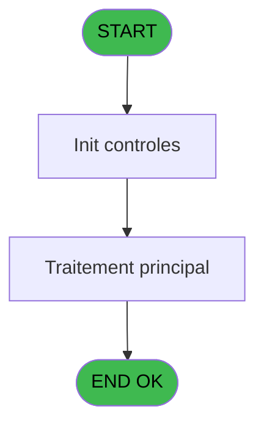
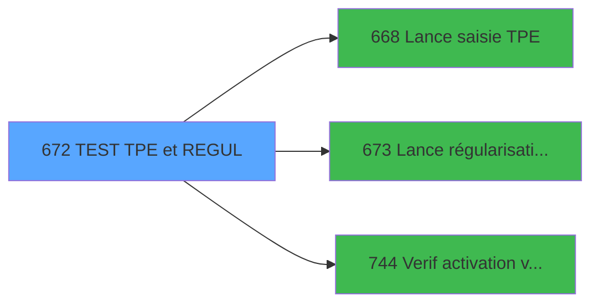

# REF IDE 672 - TEST TPE et REGUL

> **Analyse**: Phases 1-4 2026-02-03 13:34 -> 13:34 (15s) | Assemblage 13:34
> **Pipeline**: V7.2 Enrichi
> **Structure**: 4 onglets (Resume | Ecrans | Donnees | Connexions)

<!-- TAB:Resume -->

## 1. FICHE D'IDENTITE

| Attribut | Valeur |
|----------|--------|
| Projet | REF |
| IDE Position | 672 |
| Nom Programme | TEST TPE et REGUL |
| Fichier source | `Prg_672.xml` |
| Dossier IDE | General |
| Taches | 1 (1 ecrans visibles) |
| Tables modifiees | 0 |
| Programmes appeles | 3 |
| :warning: Statut | **ORPHELIN_POTENTIEL** |

## 2. DESCRIPTION FONCTIONNELLE

**TEST TPE et REGUL** assure la gestion complete de ce processus.

Le flux de traitement s'organise en **1 blocs fonctionnels** :

- **Traitement** (1 tache) : traitements metier divers

**Logique metier** : 1 regles identifiees couvrant conditions metier.

## 3. BLOCS FONCTIONNELS

### 3.1 Traitement (1 tache)

Traitements internes.

---

#### 672 - TEST REGUL [[ECRAN]](#ecran-t1)

**Role** : Verification : TEST REGUL.
**Ecran** : 320 x 209 DLU | [Voir mockup](#ecran-t1)
**Delegue a** : [Lance régularisation TPE (IDE 673)](REF-IDE-673.md)

## 5. REGLES METIER

1 regles identifiees:

### Autres (1 regles)

#### [RM-001] Si [K] alors '' sinon 'BARD')

| Element | Detail |
|---------|--------|
| **Condition** | `[K]` |
| **Si vrai** | '' |
| **Si faux** | 'BARD') |
| **Expression source** | Expression 8 : `IF([K],'','BARD')` |
| **Exemple** | Si [K] → ''. Sinon → 'BARD') |

## 6. CONTEXTE

- **Appele par**: (aucun)
- **Appelle**: 3 programmes | **Tables**: 1 (W:0 R:1 L:0) | **Taches**: 1 | **Expressions**: 9

<!-- TAB:Ecrans -->

## 8. ECRANS

### 8.1 Forms visibles (1 / 1)

| # | Position | Tache | Nom | Type | Largeur | Hauteur | Bloc |
|---|----------|-------|-----|------|---------|---------|------|
| 1 | 672 | 672 | TEST REGUL | Type0 | 320 | 209 | Traitement |

### 8.2 Mockups Ecrans

---

#### 672 - TEST REGUL
**Tache** : [672](#t1) | **Type** : Type0 | **Dimensions** : 320 x 209 DLU
**Bloc** : Traitement | **Titre IDE** : TEST REGUL

<!-- FORM-DATA:
{
    "width":  320,
    "vFactor":  8,
    "type":  "Type0",
    "hFactor":  4,
    "controls":  [
                     {
                         "x":  88,
                         "type":  "label",
                         "var":  "",
                         "y":  24,
                         "w":  69,
                         "fmt":  "",
                         "name":  "",
                         "h":  9,
                         "color":  "",
                         "text":  "v.Date comptable",
                         "parent":  null
                     },
                     {
                         "x":  88,
                         "type":  "label",
                         "var":  "",
                         "y":  40,
                         "w":  81,
                         "fmt":  "",
                         "name":  "",
                         "h":  9,
                         "color":  "",
                         "text":  "v.Ecart TPE corrigé?",
                         "parent":  null
                     },
                     {
                         "x":  88,
                         "type":  "label",
                         "var":  "",
                         "y":  56,
                         "w":  57,
                         "fmt":  "",
                         "name":  "",
                         "h":  9,
                         "color":  "",
                         "text":  "v.Appel PVE.?",
                         "parent":  null
                     },
                     {
                         "x":  88,
                         "type":  "label",
                         "var":  "",
                         "y":  72,
                         "w":  60,
                         "fmt":  "",
                         "name":  "",
                         "h":  9,
                         "color":  "",
                         "text":  "v.Cloture Auto?",
                         "parent":  null
                     },
                     {
                         "x":  88,
                         "type":  "label",
                         "var":  "",
                         "y":  88,
                         "w":  71,
                         "fmt":  "",
                         "name":  "",
                         "h":  9,
                         "color":  "",
                         "text":  "v.activité boutique",
                         "parent":  null
                     },
                     {
                         "x":  88,
                         "type":  "label",
                         "var":  "",
                         "y":  104,
                         "w":  90,
                         "fmt":  "",
                         "name":  "",
                         "h":  9,
                         "color":  "",
                         "text":  "v.est un term boutique?",
                         "parent":  null
                     },
                     {
                         "x":  88,
                         "type":  "label",
                         "var":  "",
                         "y":  120,
                         "w":  66,
                         "fmt":  "",
                         "name":  "",
                         "h":  9,
                         "color":  "",
                         "text":  "v.TPE interfacé?",
                         "parent":  null
                     },
                     {
                         "x":  88,
                         "type":  "label",
                         "var":  "",
                         "y":  136,
                         "w":  38,
                         "fmt":  "",
                         "name":  "",
                         "h":  9,
                         "color":  "",
                         "text":  "v.Service",
                         "parent":  null
                     },
                     {
                         "x":  80,
                         "type":  "label",
                         "var":  "",
                         "y":  8,
                         "w":  117,
                         "fmt":  "",
                         "name":  "",
                         "h":  9,
                         "color":  "",
                         "text":  "VG.DROIT DEVELOPPEUR ?",
                         "parent":  null
                     },
                     {
                         "x":  216,
                         "type":  "label",
                         "var":  "",
                         "y":  168,
                         "w":  42,
                         "fmt":  "",
                         "name":  "",
                         "h":  9,
                         "color":  "",
                         "text":  "VG.LOGIN",
                         "parent":  null
                     },
                     {
                         "x":  201,
                         "type":  "edit",
                         "var":  "",
                         "y":  8,
                         "w":  31,
                         "fmt":  "",
                         "name":  "VG.DROIT DEVELOPPEUR ?",
                         "h":  10,
                         "color":  "",
                         "text":  "",
                         "parent":  null
                     },
                     {
                         "x":  188,
                         "type":  "edit",
                         "var":  "",
                         "y":  24,
                         "w":  61,
                         "fmt":  "",
                         "name":  "v.Date comptable",
                         "h":  10,
                         "color":  "6",
                         "text":  "",
                         "parent":  null
                     },
                     {
                         "x":  188,
                         "type":  "checkbox",
                         "var":  "",
                         "y":  40,
                         "w":  12,
                         "fmt":  "",
                         "name":  "v.Ecart TPE corrigé?_0001",
                         "h":  12,
                         "color":  "",
                         "text":  "",
                         "parent":  null
                     },
                     {
                         "x":  188,
                         "type":  "checkbox",
                         "var":  "",
                         "y":  57,
                         "w":  12,
                         "fmt":  "",
                         "name":  "v.Appel PVE.?_0001",
                         "h":  12,
                         "color":  "",
                         "text":  "",
                         "parent":  null
                     },
                     {
                         "x":  188,
                         "type":  "checkbox",
                         "var":  "",
                         "y":  72,
                         "w":  12,
                         "fmt":  "",
                         "name":  "v.Cloture Auto?_0001",
                         "h":  12,
                         "color":  "",
                         "text":  "",
                         "parent":  null
                     },
                     {
                         "x":  188,
                         "type":  "edit",
                         "var":  "",
                         "y":  88,
                         "w":  18,
                         "fmt":  "",
                         "name":  "v.activité boutique",
                         "h":  10,
                         "color":  "",
                         "text":  "",
                         "parent":  null
                     },
                     {
                         "x":  188,
                         "type":  "checkbox",
                         "var":  "",
                         "y":  102,
                         "w":  12,
                         "fmt":  "",
                         "name":  "v.est un term boutique?_0001",
                         "h":  12,
                         "color":  "",
                         "text":  "",
                         "parent":  null
                     },
                     {
                         "x":  188,
                         "type":  "checkbox",
                         "var":  "",
                         "y":  119,
                         "w":  12,
                         "fmt":  "",
                         "name":  "v.TPE interfacé?_0001",
                         "h":  12,
                         "color":  "",
                         "text":  "",
                         "parent":  null
                     },
                     {
                         "x":  188,
                         "type":  "edit",
                         "var":  "",
                         "y":  136,
                         "w":  26,
                         "fmt":  "",
                         "name":  "v.Service",
                         "h":  10,
                         "color":  "",
                         "text":  "",
                         "parent":  null
                     },
                     {
                         "x":  228,
                         "type":  "checkbox",
                         "var":  "",
                         "y":  136,
                         "w":  72,
                         "fmt":  "",
                         "name":  "NOSERVICE",
                         "h":  12,
                         "color":  "",
                         "text":  "Pas de service",
                         "parent":  null
                     },
                     {
                         "x":  104,
                         "type":  "button",
                         "var":  "",
                         "y":  160,
                         "w":  96,
                         "fmt":  "Button TPE",
                         "name":  "",
                         "h":  14,
                         "color":  "",
                         "text":  "",
                         "parent":  null
                     },
                     {
                         "x":  262,
                         "type":  "edit",
                         "var":  "",
                         "y":  168,
                         "w":  48,
                         "fmt":  "",
                         "name":  "VG.LOGIN",
                         "h":  10,
                         "color":  "",
                         "text":  "",
                         "parent":  null
                     },
                     {
                         "x":  104,
                         "type":  "button",
                         "var":  "",
                         "y":  184,
                         "w":  96,
                         "fmt":  "Button Régul TPE",
                         "name":  "",
                         "h":  14,
                         "color":  "",
                         "text":  "",
                         "parent":  null
                     }
                 ],
    "taskId":  "672",
    "height":  209
}
-->

<strong>Champs : 11 champs</strong>

| Pos (x,y) | Nom | Variable | Type |
|-----------|-----|----------|------|
| 201,8 | VG.DROIT DEVELOPPEUR ? | - | edit |
| 188,24 | v.Date comptable | - | edit |
| 188,40 | v.Ecart TPE corrigé?_0001 | - | checkbox |
| 188,57 | v.Appel PVE.?_0001 | - | checkbox |
| 188,72 | v.Cloture Auto?_0001 | - | checkbox |
| 188,88 | v.activité boutique | - | edit |
| 188,102 | v.est un term boutique?_0001 | - | checkbox |
| 188,119 | v.TPE interfacé?_0001 | - | checkbox |
| 188,136 | v.Service | - | edit |
| 228,136 | NOSERVICE | - | checkbox |
| 262,168 | VG.LOGIN | - | edit |

<strong>Boutons : 2 boutons</strong>

| Bouton | Pos (x,y) | Action |
|--------|-----------|--------|
| Button TPE | 104,160 | Bouton fonctionnel |
| Button Régul TPE | 104,184 | Bouton fonctionnel |

## 9. NAVIGATION

Ecran unique: **TEST REGUL**

### 9.3 Structure hierarchique (1 tache)

| Position | Tache | Type | Dimensions | Bloc |
|----------|-------|------|------------|------|
| **672.1** | [**TEST REGUL** (672)](#t1) [mockup](#ecran-t1) | - | 320x209 | Traitement |

### 9.4 Algorigramme

> **Legende**: Vert = START/END OK | Rouge = END KO | Bleu = Decisions
> *Algorigramme auto-genere. Utiliser `/algorigramme` pour une synthese metier detaillee.*

<!-- TAB:Donnees -->

## 10. TABLES

### Tables utilisees (1)

| ID | Nom | Description | Type | R | W | L | Usages |
|----|-----|-------------|------|---|---|---|--------|
| 70 | date_comptable___dat |  | DB | R |   |   | 1 |

### Colonnes par table (1 / 1 tables avec colonnes identifiees)

Table 70 - date_comptable___dat (R) - 1 usages

| Lettre | Variable | Acces | Type |
|--------|----------|-------|------|
| A | v.Date comptable | R | Date |
| B | v.Ecart TPE corrigé? | R | Logical |
| C | v.Appel PVE.? | R | Logical |
| D | v.Cloture Auto? | R | Logical |
| E | v.activité boutique | R | Numeric |
| F | v.est un term boutique? | R | Logical |
| G | v.TPE interfacé? | R | Logical |
| H | v.No service? | R | Logical |
| I | v.Service | R | Unicode |

## 11. VARIABLES

### 11.1 Variables de session (9)

Variables persistantes pendant toute la session.

| Lettre | Nom | Type | Usage dans |
|--------|-----|------|-----------|
| A | v.Date comptable | Date | - |
| B | v.Ecart TPE corrigé? | Logical | - |
| C | v.Appel PVE.? | Logical | 1x session |
| D | v.Cloture Auto? | Logical | - |
| E | v.activité boutique | Numeric | - |
| F | v.est un term boutique? | Logical | - |
| G | v.TPE interfacé? | Logical | - |
| H | v.No service? | Logical | - |
| I | v.Service | Unicode | - |

## 12. EXPRESSIONS

**9 / 9 expressions decodees (100%)**

### 12.1 Repartition par type

| Type | Expressions | Regles |
|------|-------------|--------|
| CONDITION | 1 | 5 |
| CONSTANTE | 4 | 0 |
| CAST_LOGIQUE | 2 | 0 |
| OTHER | 2 | 0 |

### 12.2 Expressions cles par type

#### CONDITION (1 expressions)

| Type | IDE | Expression | Regle |
|------|-----|------------|-------|
| CONDITION | 8 | `IF([K],'','BARD')` | [RM-001](#rm-RM-001) |

#### CONSTANTE (4 expressions)

| Type | IDE | Expression | Regle |
|------|-----|------------|-------|
| CONSTANTE | 6 | `'TPE'` | - |
| CONSTANTE | 7 | `'1.00'` | - |
| CONSTANTE | 1 | `'C'` | - |
| CONSTANTE | 2 | `'N11.2CZ'` | - |

#### CAST_LOGIQUE (2 expressions)

| Type | IDE | Expression | Regle |
|------|-----|------------|-------|
| CAST_LOGIQUE | 4 | `'FALSE'LOG` | - |
| CAST_LOGIQUE | 3 | `'TRUE'LOG` | - |

#### OTHER (2 expressions)

| Type | IDE | Expression | Regle |
|------|-----|------------|-------|
| OTHER | 9 | `NOT([K])` | - |
| OTHER | 5 | `v.Appel PVE.? [C]` | - |

<!-- TAB:Connexions -->

## 13. GRAPHE D'APPELS

### 13.1 Chaine depuis Main (Callers)

**Chemin**: (pas de callers directs)

### 13.2 Callers

| IDE | Nom Programme | Nb Appels |
|-----|---------------|-----------|
| - | (aucun) | - |

### 13.3 Callees (programmes appeles)

### 13.4 Detail Callees avec contexte

| IDE | Nom Programme | Appels | Contexte |
|-----|---------------|--------|----------|
| [668](REF-IDE-668.md) | Lance saisie TPE | 1 | Sous-programme |
| [673](REF-IDE-673.md) | Lance régularisation TPE | 1 | Sous-programme |
| [744](REF-IDE-744.md) | Verif activation version | 1 | Controle/validation |

## 14. RECOMMANDATIONS MIGRATION

### 14.1 Profil du programme

| Metrique | Valeur | Impact migration |
|----------|--------|-----------------|
| Lignes de logique | 19 | Programme compact |
| Expressions | 9 | Peu de logique |
| Tables WRITE | 0 | Impact faible |
| Sous-programmes | 3 | Peu de dependances |
| Ecrans visibles | 1 | Ecran unique ou traitement batch |
| Code desactive | 0% (0 / 19) | Code sain |
| Regles metier | 1 | Quelques regles a preserver |

### 14.2 Plan de migration par bloc

#### Traitement (1 tache: 1 ecran, 0 traitement)

- **Strategie** : 1 composant(s) UI (Razor/React) avec formulaires et validation.
- 3 sous-programme(s) a migrer ou a reutiliser depuis les services existants.
- Decomposer les taches en services unitaires testables.

### 14.3 Dependances critiques

| Dependance | Type | Appels | Impact |
|------------|------|--------|--------|
| [Verif activation version (IDE 744)](REF-IDE-744.md) | Sous-programme | 1x | Normale - Controle/validation |
| [Lance régularisation TPE (IDE 673)](REF-IDE-673.md) | Sous-programme | 1x | Normale - Sous-programme |
| [Lance saisie TPE (IDE 668)](REF-IDE-668.md) | Sous-programme | 1x | Normale - Sous-programme |

---
*Spec DETAILED generee par Pipeline V7.2 - 2026-02-03 13:34*
