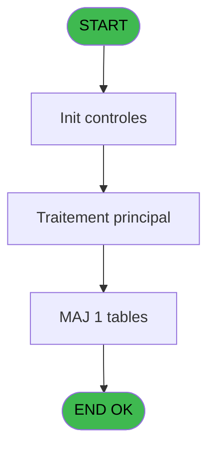
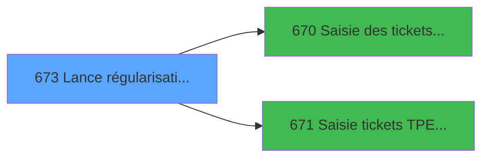

# REF IDE 673 - Lance régularisation TPE

> **Analyse**: Phases 1-4 2026-02-03 13:34 -> 13:34 (16s) | Assemblage 13:34
> **Pipeline**: V7.2 Enrichi
> **Structure**: 4 onglets (Resume | Ecrans | Donnees | Connexions)

<!-- TAB:Resume -->

## 1. FICHE D'IDENTITE

| Attribut | Valeur |
|----------|--------|
| Projet | REF |
| IDE Position | 673 |
| Nom Programme | Lance régularisation TPE |
| Fichier source | `Prg_673.xml` |
| Dossier IDE | General |
| Taches | 2 (0 ecrans visibles) |
| Tables modifiees | 1 |
| Programmes appeles | 2 |

## 2. DESCRIPTION FONCTIONNELLE

**Lance régularisation TPE** assure la gestion complete de ce processus, accessible depuis [TEST TPE et REGUL (IDE 672)](REF-IDE-672.md).

Le flux de traitement s'organise en **1 blocs fonctionnels** :

- **Traitement** (2 taches) : traitements metier divers

**Donnees modifiees** : 1 tables en ecriture (tickets_tpe).

## 3. BLOCS FONCTIONNELS

### 3.1 Traitement (2 taches)

Traitements internes.

---

#### 673 - Lance régularisation TPE

**Role** : Traitement : Lance régularisation TPE.

---

#### 673.1 - Sauvegarde des données

**Role** : Traitement : Sauvegarde des données.

## 5. REGLES METIER

*(Aucune regle metier identifiee)*

## 6. CONTEXTE

- **Appele par**: [TEST TPE et REGUL (IDE 672)](REF-IDE-672.md)
- **Appelle**: 2 programmes | **Tables**: 2 (W:1 R:0 L:1) | **Taches**: 2 | **Expressions**: 10

<!-- TAB:Ecrans -->

## 8. ECRANS

*(Programme sans ecran visible)*

## 9. NAVIGATION

### 9.3 Structure hierarchique (2 taches)

| Position | Tache | Type | Dimensions | Bloc |
|----------|-------|------|------------|------|
| **673.1** | [**Lance régularisation TPE** (673)](#t1) | MDI | - | Traitement |
| 673.1.1 | [Sauvegarde des données (673.1)](#t2) | - | - | |

### 9.4 Algorigramme

> **Legende**: Vert = START/END OK | Rouge = END KO | Bleu = Decisions
> *Algorigramme auto-genere. Utiliser `/algorigramme` pour une synthese metier detaillee.*

<!-- TAB:Donnees -->

## 10. TABLES

### Tables utilisees (2)

| ID | Nom | Description | Type | R | W | L | Usages |
|----|-----|-------------|------|---|---|---|--------|
| 260 | tickets_tpe |  | DB |   | **W** |   | 1 |
| 538 | tickets_tpe |  | TMP |   |   | L | 1 |

### Colonnes par table (0 / 1 tables avec colonnes identifiees)

Table 260 - tickets_tpe (**W**) - 1 usages

*Table utilisee uniquement en Link ou aucune colonne Real identifiee dans le DataView.*

## 11. VARIABLES

### 11.1 Parametres entrants (10)

Variables recues du programme appelant ([TEST TPE et REGUL (IDE 672)](REF-IDE-672.md)).

| Lettre | Nom | Type | Usage dans |
|--------|-----|------|-----------|
| A | P.Param societe | Alpha | - |
| B | P.Date comptable | Date | - |
| C | P.Param masque | Alpha | - |
| D | P.Ecart TPE corrige | Logical | 2x parametre entrant |
| E | P.Appel PVE | Logical | - |
| F | P.Cloture auto | Logical | - |
| G | P.Activite de la boutique | Numeric | - |
| H | P.Est un terminal boutique | Logical | - |
| I | P.VG.TPE ACTIF | Logical | 2x parametre entrant |
| J | P.Service | Alpha | - |

### 11.2 Variables de session (2)

Variables persistantes pendant toute la session.

| Lettre | Nom | Type | Usage dans |
|--------|-----|------|-----------|
| L | v.abandon demandé? | Logical | 2x session |
| M | v.montant sup mnt max regul? | Logical | - |

### 11.3 Autres (1)

Variables diverses.

| Lettre | Nom | Type | Usage dans |
|--------|-----|------|-----------|
| K | DATE COMPTABLE DEMANDEE | Date | - |

## 12. EXPRESSIONS

**10 / 10 expressions decodees (100%)**

### 12.1 Repartition par type

| Type | Expressions | Regles |
|------|-------------|--------|
| CONSTANTE | 1 | 0 |
| OTHER | 6 | 0 |
| NEGATION | 2 | 0 |
| CAST_LOGIQUE | 1 | 0 |

### 12.2 Expressions cles par type

#### CONSTANTE (1 expressions)

| Type | IDE | Expression | Regle |
|------|-----|------------|-------|
| CONSTANTE | 4 | `''` | - |

#### OTHER (6 expressions)

| Type | IDE | Expression | Regle |
|------|-----|------------|-------|
| OTHER | 7 | `P.Est un terminal bout... [H]` | - |
| OTHER | 9 | `NOT(v.abandon demandé? [L])` | - |
| OTHER | 10 | `v.montant sup mnt max ... [M]` | - |
| OTHER | 1 | `NOT(P.VG.TPE ACTIF [I])` | - |
| OTHER | 2 | `P.VG.TPE ACTIF [I]` | - |
| ... | | *+1 autres* | |

#### NEGATION (2 expressions)

| Type | IDE | Expression | Regle |
|------|-----|------------|-------|
| NEGATION | 6 | `NOT P.Est un terminal bout... [H]` | - |
| NEGATION | 5 | `NOT (P.Ecart TPE corrige [D])` | - |

#### CAST_LOGIQUE (1 expressions)

| Type | IDE | Expression | Regle |
|------|-----|------------|-------|
| CAST_LOGIQUE | 8 | `'TRUE'LOG` | - |

<!-- TAB:Connexions -->

## 13. GRAPHE D'APPELS

### 13.1 Chaine depuis Main (Callers)

Main -> ... -> [TEST TPE et REGUL (IDE 672)](REF-IDE-672.md) -> **Lance régularisation TPE (IDE 673)**

### 13.2 Callers

| IDE | Nom Programme | Nb Appels |
|-----|---------------|-----------|
| [672](REF-IDE-672.md) | TEST TPE et REGUL | 1 |

### 13.3 Callees (programmes appeles)

### 13.4 Detail Callees avec contexte

| IDE | Nom Programme | Appels | Contexte |
|-----|---------------|--------|----------|
| [670](REF-IDE-670.md) | Saisie des tickets TPE | 1 | Impression ticket/document |
| [671](REF-IDE-671.md) | Saisie tickets TPE Interfacés | 1 | Impression ticket/document |

## 14. RECOMMANDATIONS MIGRATION

### 14.1 Profil du programme

| Metrique | Valeur | Impact migration |
|----------|--------|-----------------|
| Lignes de logique | 83 | Programme compact |
| Expressions | 10 | Peu de logique |
| Tables WRITE | 1 | Impact faible |
| Sous-programmes | 2 | Peu de dependances |
| Ecrans visibles | 0 | Ecran unique ou traitement batch |
| Code desactive | 0% (0 / 83) | Code sain |
| Regles metier | 0 | Pas de regle identifiee |

### 14.2 Plan de migration par bloc

#### Traitement (2 taches: 0 ecran, 2 traitements)

- **Strategie** : 2 service(s) backend injectable(s) (Domain Services).
- 2 sous-programme(s) a migrer ou a reutiliser depuis les services existants.
- Decomposer les taches en services unitaires testables.

### 14.3 Dependances critiques

| Dependance | Type | Appels | Impact |
|------------|------|--------|--------|
| tickets_tpe | Table WRITE (Database) | 1x | Schema + repository |
| [Saisie tickets TPE Interfacés (IDE 671)](REF-IDE-671.md) | Sous-programme | 1x | Normale - Impression ticket/document |
| [Saisie des tickets TPE (IDE 670)](REF-IDE-670.md) | Sous-programme | 1x | Normale - Impression ticket/document |

---
*Spec DETAILED generee par Pipeline V7.2 - 2026-02-03 13:34*
