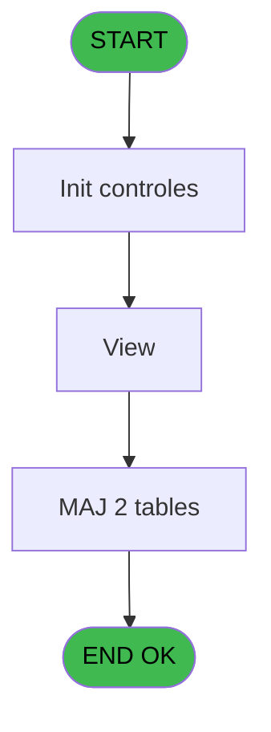
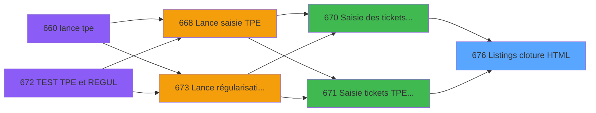

# REF IDE 676 - Listings cloture HTML

> **Analyse**: Phases 1-4 2026-02-03 13:35 -> 13:35 (15s) | Assemblage 13:35
> **Pipeline**: V7.2 Enrichi
> **Structure**: 4 onglets (Resume | Ecrans | Donnees | Connexions)

<!-- TAB:Resume -->

## 1. FICHE D'IDENTITE

| Attribut | Valeur |
|----------|--------|
| Projet | REF |
| IDE Position | 676 |
| Nom Programme | Listings cloture HTML |
| Fichier source | `Prg_676.xml` |
| Dossier IDE | General |
| Taches | 10 (0 ecrans visibles) |
| Tables modifiees | 2 |
| Programmes appeles | 1 |

## 2. DESCRIPTION FONCTIONNELLE

**Listings cloture HTML** assure la gestion complete de ce processus, accessible depuis [Saisie des tickets TPE (IDE 670)](REF-IDE-670.md), [Saisie tickets TPE Interfacés (IDE 671)](REF-IDE-671.md).

Le flux de traitement s'organise en **1 blocs fonctionnels** :

- **Traitement** (10 taches) : traitements metier divers

**Donnees modifiees** : 2 tables en ecriture (temp_histo_sessions_caisse, situation_devise).

Detail : phases du traitement

#### Phase 1 : Traitement (10 taches)

- **676** - CV  Menu listings complement. **[[ECRAN]](#ecran-t1)**
- **676.1** - Truncate table SQL
- **676.2** - Versements/Retraits
- **676.2.1** - (sans nom)
- **676.2.1.1** - UNI
- **676.2.1.2** - BI
- **676.3** - Lecture solde veille
- **676.4** - Gen 341
- **676.5** - Gen 341
- **676.6** - View

#### Tables impactees

| Table | Operations | Role metier |
|-------|-----------|-------------|
| temp_histo_sessions_caisse | **W** (1 usages) | Sessions de caisse |
| situation_devise | **W** (1 usages) | Devises / taux de change |

## 3. BLOCS FONCTIONNELS

### 3.1 Traitement (10 taches)

Traitements internes.

---

#### 676 - CV  Menu listings complement. [[ECRAN]](#ecran-t1)

**Role** : Tache d'orchestration : point d'entree du programme (10 sous-taches). Coordonne l'enchainement des traitements.
**Ecran** : 342 x 17 DLU (MDI) | [Voir mockup](#ecran-t1)

9 sous-taches directes

| Tache | Nom | Bloc |
|-------|-----|------|
| [676.1](#t2) | Truncate table SQL | Traitement |
| [676.2](#t3) | Versements/Retraits | Traitement |
| [676.2.1](#t4) | (sans nom) | Traitement |
| [676.2.1.1](#t5) | UNI | Traitement |
| [676.2.1.2](#t6) | BI | Traitement |
| [676.3](#t7) | Lecture solde veille | Traitement |
| [676.4](#t8) | Gen 341 | Traitement |
| [676.5](#t9) | Gen 341 | Traitement |
| [676.6](#t10) | View | Traitement |

---

#### 676.1 - Truncate table SQL

**Role** : Traitement : Truncate table SQL.
**Variables liees** : D (P0 date comptable)

---

#### 676.2 - Versements/Retraits

**Role** : Traitement : Versements/Retraits.

---

#### 676.2.1 - (sans nom)

**Role** : Traitement interne.

---

#### 676.2.1.1 - UNI

**Role** : Traitement interne.

---

#### 676.2.1.2 - BI

**Role** : Traitement interne.

---

#### 676.3 - Lecture solde veille

**Role** : Consultation/chargement : Lecture solde veille.
**Variables liees** : J (W0 solde veille)

---

#### 676.4 - Gen 341

**Role** : Traitement : Gen 341.

---

#### 676.5 - Gen 341

**Role** : Traitement : Gen 341.

---

#### 676.6 - View

**Role** : Traitement : View.

## 5. REGLES METIER

*(Aucune regle metier identifiee)*

## 6. CONTEXTE

- **Appele par**: [Saisie des tickets TPE (IDE 670)](REF-IDE-670.md), [Saisie tickets TPE Interfacés (IDE 671)](REF-IDE-671.md)
- **Appelle**: 1 programmes | **Tables**: 8 (W:2 R:4 L:2) | **Taches**: 10 | **Expressions**: 6

<!-- TAB:Ecrans -->

## 8. ECRANS

*(Programme sans ecran visible)*

## 9. NAVIGATION

### 9.3 Structure hierarchique (10 taches)

| Position | Tache | Type | Dimensions | Bloc |
|----------|-------|------|------------|------|
| **676.1** | [**CV  Menu listings complement.** (676)](#t1) [mockup](#ecran-t1) | MDI | 342x17 | Traitement |
| 676.1.1 | [Truncate table SQL (676.1)](#t2) | - | - | |
| 676.1.2 | [Versements/Retraits (676.2)](#t3) | MDI | - | |
| 676.1.3 | [(sans nom) (676.2.1)](#t4) | MDI | - | |
| 676.1.4 | [UNI (676.2.1.1)](#t5) | MDI | - | |
| 676.1.5 | [BI (676.2.1.2)](#t6) | MDI | - | |
| 676.1.6 | [Lecture solde veille (676.3)](#t7) | MDI | - | |
| 676.1.7 | [Gen 341 (676.4)](#t8) | MDI | - | |
| 676.1.8 | [Gen 341 (676.5)](#t9) | MDI | - | |
| 676.1.9 | [View (676.6)](#t10) | - | - | |

### 9.4 Algorigramme

> **Legende**: Vert = START/END OK | Rouge = END KO | Bleu = Decisions
> *Algorigramme auto-genere. Utiliser `/algorigramme` pour une synthese metier detaillee.*

<!-- TAB:Donnees -->

## 10. TABLES

### Tables utilisees (8)

| ID | Nom | Description | Type | R | W | L | Usages |
|----|-----|-------------|------|---|---|---|--------|
| 17 | backup_devises_caisse | Sessions de caisse | DB |   |   | L | 1 |
| 18 | backup_histo_sessions_caisse | Sessions de caisse | DB |   |   | L | 1 |
| 40 | comptable________cte |  | DB | R |   |   | 1 |
| 55 | solde_caisse_____sks | Sessions de caisse | DB | R |   |   | 1 |
| 89 | moyen_paiement___mop |  | DB | R |   |   | 1 |
| 140 | moyen_paiement___mop |  | DB | R |   |   | 1 |
| 460 | temp_histo_sessions_caisse | Sessions de caisse | DB |   | **W** |   | 1 |
| 490 | situation_devise | Devises / taux de change | TMP |   | **W** |   | 1 |

### Colonnes par table (2 / 6 tables avec colonnes identifiees)

Table 40 - comptable________cte (R) - 1 usages

| Lettre | Variable | Acces | Type |
|--------|----------|-------|------|
| D | P0 date comptable | R | Date |

Table 55 - solde_caisse_____sks (R) - 1 usages

| Lettre | Variable | Acces | Type |
|--------|----------|-------|------|
| J | W0 solde veille | R | Numeric |

Table 89 - moyen_paiement___mop (R) - 1 usages

*Table utilisee uniquement en Link ou aucune colonne Real identifiee dans le DataView.*

Table 140 - moyen_paiement___mop (R) - 1 usages

*Table utilisee uniquement en Link ou aucune colonne Real identifiee dans le DataView.*

Table 460 - temp_histo_sessions_caisse (**W**) - 1 usages

*Table utilisee uniquement en Link ou aucune colonne Real identifiee dans le DataView.*

Table 490 - situation_devise (**W**) - 1 usages

*Table utilisee uniquement en Link ou aucune colonne Real identifiee dans le DataView.*

## 11. VARIABLES

### 11.1 Parametres entrants (7)

Variables recues du programme appelant ([Saisie des tickets TPE (IDE 670)](REF-IDE-670.md)).

| Lettre | Nom | Type | Usage dans |
|--------|-----|------|-----------|
| A | P0 societe | Alpha | - |
| B | P0 picture montant | Alpha | - |
| C | P0 nbre decimales | Numeric | 1x parametre entrant |
| D | P0 date comptable | Date | - |
| E | P0 Uni / Bi | Alpha | - |
| F | P0 juste Montant Ecart? | Logical | 1x parametre entrant |
| G | P0 Montant Ecart | Numeric | - |

### 11.2 Variables de travail (10)

Variables internes au programme.

| Lettre | Nom | Type | Usage dans |
|--------|-----|------|-----------|
| I | W0 param bidon | Numeric | - |
| J | W0 solde veille | Numeric | - |
| K | W0 montant versmnt | Numeric | - |
| L | W0 montant retrait | Numeric | - |
| M | W0 pkes recettes | Numeric | - |
| N | W0 pkes depenses | Numeric | - |
| O | W0 Versement CASH | Numeric | - |
| P | W0 Versement NON CASH | Numeric | - |
| Q | W0 Retrait CASH | Numeric | - |
| R | W0 Retrait NON CASH | Numeric | - |

### 11.3 Autres (1)

Variables diverses.

| Lettre | Nom | Type | Usage dans |
|--------|-----|------|-----------|
| H | WP0 masque cumul | Alpha | - |

Toutes les 18 variables (liste complete)

| Cat | Lettre | Nom Variable | Type |
|-----|--------|--------------|------|
| P0 | **A** | P0 societe | Alpha |
| P0 | **B** | P0 picture montant | Alpha |
| P0 | **C** | P0 nbre decimales | Numeric |
| P0 | **D** | P0 date comptable | Date |
| P0 | **E** | P0 Uni / Bi | Alpha |
| P0 | **F** | P0 juste Montant Ecart? | Logical |
| P0 | **G** | P0 Montant Ecart | Numeric |
| W0 | **I** | W0 param bidon | Numeric |
| W0 | **J** | W0 solde veille | Numeric |
| W0 | **K** | W0 montant versmnt | Numeric |
| W0 | **L** | W0 montant retrait | Numeric |
| W0 | **M** | W0 pkes recettes | Numeric |
| W0 | **N** | W0 pkes depenses | Numeric |
| W0 | **O** | W0 Versement CASH | Numeric |
| W0 | **P** | W0 Versement NON CASH | Numeric |
| W0 | **Q** | W0 Retrait CASH | Numeric |
| W0 | **R** | W0 Retrait NON CASH | Numeric |
| Autre | **H** | WP0 masque cumul | Alpha |

## 12. EXPRESSIONS

**6 / 6 expressions decodees (100%)**

### 12.1 Repartition par type

| Type | Expressions | Regles |
|------|-------------|--------|
| CALCULATION | 2 | 0 |
| CONSTANTE | 1 | 0 |
| CONCATENATION | 1 | 0 |
| OTHER | 2 | 0 |

### 12.2 Expressions cles par type

#### CALCULATION (2 expressions)

| Type | IDE | Expression | Regle |
|------|-----|------------|-------|
| CALCULATION | 4 | `DbName ('{460,-1}'DSOURCE)` | - |
| CALCULATION | 3 | `DbDel ('{490,-1}'DSOURCE,'')` | - |

#### CONSTANTE (1 expressions)

| Type | IDE | Expression | Regle |
|------|-----|------------|-------|
| CONSTANTE | 2 | `'O'` | - |

#### CONCATENATION (1 expressions)

| Type | IDE | Expression | Regle |
|------|-----|------------|-------|
| CONCATENATION | 1 | `'N'&Right (' ### ### ### ###'&Left ('.',P0 nbre decimales [C])&Left ('###',P0 nbre decimales [C]),16)&'Z'` | - |

#### OTHER (2 expressions)

| Type | IDE | Expression | Regle |
|------|-----|------------|-------|
| OTHER | 6 | `{1,1}` | - |
| OTHER | 5 | `NOT(P0 juste Montant Ecart? [F])` | - |

<!-- TAB:Connexions -->

## 13. GRAPHE D'APPELS

### 13.1 Chaine depuis Main (Callers)

Main -> ... -> [Saisie des tickets TPE (IDE 670)](REF-IDE-670.md) -> **Listings cloture HTML (IDE 676)**

Main -> ... -> [Saisie tickets TPE Interfacés (IDE 671)](REF-IDE-671.md) -> **Listings cloture HTML (IDE 676)**

### 13.2 Callers

| IDE | Nom Programme | Nb Appels |
|-----|---------------|-----------|
| [670](REF-IDE-670.md) | Saisie des tickets TPE | 1 |
| [671](REF-IDE-671.md) | Saisie tickets TPE Interfacés | 1 |

### 13.3 Callees (programmes appeles)

### 13.4 Detail Callees avec contexte

| IDE | Nom Programme | Appels | Contexte |
|-----|---------------|--------|----------|
| [677](REF-IDE-677.md) | Print brouillard/cloture | 1 | Impression ticket/document |

## 14. RECOMMANDATIONS MIGRATION

### 14.1 Profil du programme

| Metrique | Valeur | Impact migration |
|----------|--------|-----------------|
| Lignes de logique | 142 | Programme compact |
| Expressions | 6 | Peu de logique |
| Tables WRITE | 2 | Impact faible |
| Sous-programmes | 1 | Peu de dependances |
| Ecrans visibles | 0 | Ecran unique ou traitement batch |
| Code desactive | 0.7% (1 / 142) | Code sain |
| Regles metier | 0 | Pas de regle identifiee |

### 14.2 Plan de migration par bloc

#### Traitement (10 taches: 1 ecran, 9 traitements)

- **Strategie** : Orchestrateur avec 1 ecrans (Razor/React) et 9 traitements backend (services).
- Les ecrans deviennent des composants UI, les traitements invisibles deviennent des services injectables.
- 1 sous-programme(s) a migrer ou a reutiliser depuis les services existants.
- Decomposer les taches en services unitaires testables.

### 14.3 Dependances critiques

| Dependance | Type | Appels | Impact |
|------------|------|--------|--------|
| temp_histo_sessions_caisse | Table WRITE (Database) | 1x | Schema + repository |
| situation_devise | Table WRITE (Temp) | 1x | Schema + repository |
| [Print brouillard/cloture (IDE 677)](REF-IDE-677.md) | Sous-programme | 1x | Normale - Impression ticket/document |

---
*Spec DETAILED generee par Pipeline V7.2 - 2026-02-03 13:35*
