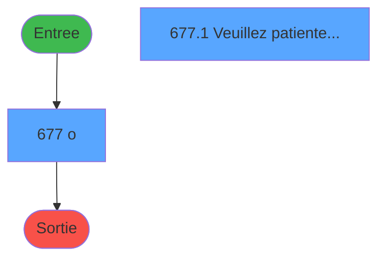
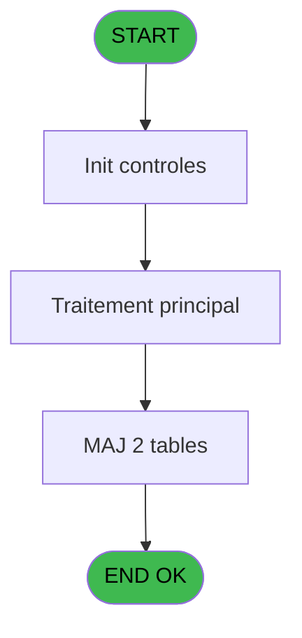
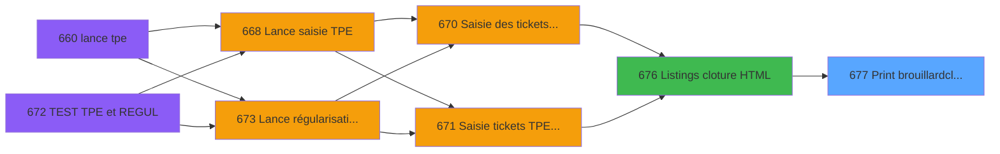

# REF IDE 677 - Print brouillard/cloture

> **Analyse**: Phases 1-4 2026-02-03 13:36 -> 13:36 (15s) | Assemblage 13:36
> **Pipeline**: V7.2 Enrichi
> **Structure**: 4 onglets (Resume | Ecrans | Donnees | Connexions)

<!-- TAB:Resume -->

## 1. FICHE D'IDENTITE

| Attribut | Valeur |
|----------|--------|
| Projet | REF |
| IDE Position | 677 |
| Nom Programme | Print brouillard/cloture |
| Fichier source | `Prg_677.xml` |
| Dossier IDE | Impression |
| Taches | 29 (2 ecrans visibles) |
| Tables modifiees | 2 |
| Programmes appeles | 0 |

## 2. DESCRIPTION FONCTIONNELLE

**Print brouillard/cloture** assure la gestion complete de ce processus, accessible depuis [Listings cloture HTML (IDE 0)](REF-IDE-0.md), [Listings cloture HTML (IDE 676)](REF-IDE-676.md).

Le flux de traitement s'organise en **4 blocs fonctionnels** :

- **Traitement** (24 taches) : traitements metier divers
- **Creation** (2 taches) : insertion d'enregistrements en base (mouvements, prestations)
- **Impression** (2 taches) : generation de tickets et documents
- **Calcul** (1 tache) : calculs de montants, stocks ou compteurs

**Donnees modifiees** : 2 tables en ecriture (recap_devise_cloture, modif__caisse____mks).

**Logique metier** : 6 regles identifiees couvrant conditions metier.

Detail : phases du traitement

#### Phase 1 : Traitement (24 taches)

- **677** - o **[[ECRAN]](#ecran-t4)**
- **677.1** - Veuillez patienter .... **[[ECRAN]](#ecran-t153)**
- **677.1.1** - COFFRE 2 v1
- **677.1.2** - COFFRE 2 v1
- **677.1.3** - parametre change
- **677.1.5** - Recapitulatif
- **677.1.5.1** - COFFRE
- **677.1.5.1.1** - Devises du coffre
- **677.1.5.1.1.1** - RECAP DEVISE
- **677.1.5.2** - Lecture user
- **677.1.5.2.1** - Last FDR
- **677.1.5.2.2** - solde PMS coffre
- **677.1.5.2.3** - Sessions caisses
- **677.1.5.2.3.1** - CAISSE
- **677.1.5.2.4** - Sessions caisses
- **677.1.5.3** - Lecture user
- **677.1.5.3.1** - Sessions caisses
- **677.1.5.3.1.1** - CAISSE
- **677.1.5.3.1.2** - CAISSE
- **677.1.5.3.1.3** - RECAP DEVISE
- **677.1.5.4.1** - Devises totaux
- **677.1.5.4.3** - Existe
- **677.1.5.4.4** - Devises
- **677.1.5.4.5** - Devises totaux

#### Phase 2 : Impression (2 taches)

- **677.1.4** - Edition des modifications MKS
- **677.1.5.4** - Print recap devises

#### Phase 3 : Calcul (1 tache)

- **677.1.5.4.2** - Calcul totaux devises

#### Phase 4 : Creation (2 taches)

- **677.1.5.4.2.1** - creation total
- **677.1.5.4.2.2** - creation total

#### Tables impactees

| Table | Operations | Role metier |
|-------|-----------|-------------|
| recap_devise_cloture | R/**W**/L (10 usages) | Donnees reseau/cloture |
| modif__caisse____mks | **W** (1 usages) | Sessions de caisse |

## 3. BLOCS FONCTIONNELS

### 3.1 Traitement (24 taches)

Traitements internes.

---

#### 677 - o [[ECRAN]](#ecran-t4)

**Role** : Traitement interne.
**Ecran** : 424 x 56 DLU (MDI) | [Voir mockup](#ecran-t4)

---

#### 677.1 - Veuillez patienter .... [[ECRAN]](#ecran-t153)

**Role** : Traitement : Veuillez patienter .....
**Ecran** : 424 x 56 DLU (MDI) | [Voir mockup](#ecran-t153)

---

#### 677.1.1 - COFFRE 2 v1

**Role** : Traitement : COFFRE 2 v1.
**Variables liees** : V (W0 Coffre2 actif), W (WO Term Coffre2), X (WO Host Coffre2)

---

#### 677.1.2 - COFFRE 2 v1

**Role** : Traitement : COFFRE 2 v1.
**Variables liees** : V (W0 Coffre2 actif), W (WO Term Coffre2), X (WO Host Coffre2)

---

#### 677.1.3 - parametre change

**Role** : Traitement : parametre change.
**Variables liees** : U (W0 Imputation change)

---

#### 677.1.5 - Recapitulatif

**Role** : Traitement : Recapitulatif.

---

#### 677.1.5.1 - COFFRE

**Role** : Traitement : COFFRE.
**Variables liees** : V (W0 Coffre2 actif), W (WO Term Coffre2), X (WO Host Coffre2)

---

#### 677.1.5.1.1 - Devises du coffre

**Role** : Traitement : Devises du coffre.
**Variables liees** : V (W0 Coffre2 actif), W (WO Term Coffre2), X (WO Host Coffre2)

---

#### 677.1.5.1.1.1 - RECAP DEVISE

**Role** : Traitement : RECAP DEVISE.

---

#### 677.1.5.2 - Lecture user

**Role** : Traitement : Lecture user.

---

#### 677.1.5.2.1 - Last FDR

**Role** : Traitement : Last FDR.

---

#### 677.1.5.2.2 - solde PMS coffre

**Role** : Consultation/chargement : solde PMS coffre.
**Variables liees** : D (P0 solde veille), V (W0 Coffre2 actif), W (WO Term Coffre2), X (WO Host Coffre2)

---

#### 677.1.5.2.3 - Sessions caisses

**Role** : Traitement : Sessions caisses.

---

#### 677.1.5.2.3.1 - CAISSE

**Role** : Traitement : CAISSE.

---

#### 677.1.5.2.4 - Sessions caisses

**Role** : Traitement : Sessions caisses.

---

#### 677.1.5.3 - Lecture user

**Role** : Traitement : Lecture user.

---

#### 677.1.5.3.1 - Sessions caisses

**Role** : Traitement : Sessions caisses.

---

#### 677.1.5.3.1.1 - CAISSE

**Role** : Traitement : CAISSE.

---

#### 677.1.5.3.1.2 - CAISSE

**Role** : Traitement : CAISSE.

---

#### 677.1.5.3.1.3 - RECAP DEVISE

**Role** : Traitement : RECAP DEVISE.

---

#### 677.1.5.4.1 - Devises totaux

**Role** : Calcul : Devises totaux.

---

#### 677.1.5.4.3 - Existe

**Role** : Traitement : Existe.

---

#### 677.1.5.4.4 - Devises

**Role** : Traitement : Devises.

---

#### 677.1.5.4.5 - Devises totaux

**Role** : Calcul : Devises totaux.

### 3.2 Impression (2 taches)

Generation des documents et tickets.

---

#### 677.1.4 - Edition des modifications MKS

**Role** : Generation du document : Edition des modifications MKS.
**Variables liees** : O (P0 edition cloture auto), P (P0 edition HTML)

---

#### 677.1.5.4 - Print recap devises

**Role** : Generation du document : Print recap devises.

### 3.3 Calcul (1 tache)

Calculs metier : montants, stocks, compteurs.

---

#### 677.1.5.4.2 - Calcul totaux devises

**Role** : Calcul : Calcul totaux devises.
**Variables liees** : Q (P0 juste calcul Ecart?)

### 3.4 Creation (2 taches)

Insertion de nouveaux enregistrements en base.

---

#### 677.1.5.4.2.1 - creation total

**Role** : Creation d'enregistrement : creation total.

---

#### 677.1.5.4.2.2 - creation total

**Role** : Creation d'enregistrement : creation total.

## 5. REGLES METIER

6 regles identifiees:

### Autres (6 regles)

#### [RM-001] Si P0 juste calcul Ecart? [Q] alors 0 sinon 53)

| Element | Detail |
|---------|--------|
| **Condition** | `P0 juste calcul Ecart? [Q]` |
| **Si vrai** | 0 |
| **Si faux** | 53) |
| **Variables** | Q (P0 juste calcul Ecart?) |
| **Expression source** | Expression 4 : `IF(P0 juste calcul Ecart? [Q],0,53)` |
| **Exemple** | Si P0 juste calcul Ecart? [Q] → 0. Sinon → 53) |
| **Impact** | [677.1.5.4.2 - Calcul totaux devises](#t175) |

#### [RM-002] Si [Z]='A' alors 'annul' sinon '')

| Element | Detail |
|---------|--------|
| **Condition** | `[Z]='A'` |
| **Si vrai** | 'annul' |
| **Si faux** | '') |
| **Expression source** | Expression 18 : `IF ([Z]='A','annul','')` |
| **Exemple** | Si [Z]='A' → 'annul'. Sinon → '') |

#### [RM-003] Traitement conditionnel si [AB]> est a zero

| Element | Detail |
|---------|--------|
| **Condition** | `[AB]>=0` |
| **Si vrai** | [AB] |
| **Si faux** | 0) |
| **Expression source** | Expression 19 : `IF ([AB]>=0,[AB],0)` |
| **Exemple** | Si [AB]>=0 → [AB]. Sinon → 0) |

#### [RM-004] Si [AB]<0 alors ABS ([AB]) sinon 0)

| Element | Detail |
|---------|--------|
| **Condition** | `[AB]<0` |
| **Si vrai** | ABS ([AB]) |
| **Si faux** | 0) |
| **Expression source** | Expression 20 : `IF ([AB]<0,ABS ([AB]),0)` |
| **Exemple** | Si [AB]<0 → ABS ([AB]). Sinon → 0) |

#### [RM-005] Si P0 clôture/brouillar [I]='O' alors MlsTrans ('CLOTURE') sinon MlsTrans ('BROUILLARD'))&' '&MlsTrans ('DU')&' '&DStr (P0 date comptable [C],'DD/MM/YYYY')

| Element | Detail |
|---------|--------|
| **Condition** | `P0 clôture/brouillar [I]='O'` |
| **Si vrai** | MlsTrans ('CLOTURE') |
| **Si faux** | MlsTrans ('BROUILLARD'))&' '&MlsTrans ('DU')&' '&DStr (P0 date comptable [C],'DD/MM/YYYY') |
| **Variables** | C (P0 date comptable), I (P0 clôture/brouillar) |
| **Expression source** | Expression 26 : `IF (P0 clôture/brouillar [I]='O',MlsTrans ('CLOTURE'),MlsTra` |
| **Exemple** | Si P0 clôture/brouillar [I]='O' → MlsTrans ('CLOTURE') |

#### [RM-006] Si WO Term Coffre2 [W]='D' alors MlsTrans ('DEPENSES') sinon MlsTrans ('RECETTES'))

| Element | Detail |
|---------|--------|
| **Condition** | `WO Term Coffre2 [W]='D'` |
| **Si vrai** | MlsTrans ('DEPENSES') |
| **Si faux** | MlsTrans ('RECETTES')) |
| **Variables** | W (WO Term Coffre2) |
| **Expression source** | Expression 27 : `IF (WO Term Coffre2 [W]='D',MlsTrans ('DEPENSES'),MlsTrans (` |
| **Exemple** | Si WO Term Coffre2 [W]='D' → MlsTrans ('DEPENSES'). Sinon → MlsTrans ('RECETTES')) |
| **Impact** | [677.1.1 - COFFRE 2 v1](#t154) |

## 6. CONTEXTE

- **Appele par**: [Listings cloture HTML (IDE 0)](REF-IDE-0.md), [Listings cloture HTML (IDE 676)](REF-IDE-676.md)
- **Appelle**: 0 programmes | **Tables**: 17 (W:2 R:12 L:7) | **Taches**: 29 | **Expressions**: 34

<!-- TAB:Ecrans -->

## 8. ECRANS

### 8.1 Forms visibles (2 / 29)

| # | Position | Tache | Nom | Type | Largeur | Hauteur | Bloc |
|---|----------|-------|-----|------|---------|---------|------|
| 1 | 677.1 | 677 | o | MDI | 424 | 56 | Traitement |
| 2 | 677.1.1 | 677.1 | Veuillez patienter .... | MDI | 424 | 56 | Traitement |

### 8.2 Mockups Ecrans

---

#### 677.1 - o
**Tache** : [677](#t4) | **Type** : MDI | **Dimensions** : 424 x 56 DLU
**Bloc** : Traitement | **Titre IDE** : o

<!-- FORM-DATA:
{
    "width":  424,
    "vFactor":  8,
    "type":  "MDI",
    "hFactor":  8,
    "controls":  [
                     {
                         "x":  1,
                         "type":  "label",
                         "var":  "",
                         "y":  0,
                         "w":  423,
                         "fmt":  "",
                         "name":  "",
                         "h":  29,
                         "color":  "",
                         "text":  "",
                         "parent":  null
                     },
                     {
                         "x":  118,
                         "type":  "label",
                         "var":  "",
                         "y":  10,
                         "w":  275,
                         "fmt":  "",
                         "name":  "",
                         "h":  8,
                         "color":  "7",
                         "text":  "Impression en cours",
                         "parent":  null
                     },
                     {
                         "x":  1,
                         "type":  "label",
                         "var":  "",
                         "y":  29,
                         "w":  423,
                         "fmt":  "",
                         "name":  "",
                         "h":  27,
                         "color":  "",
                         "text":  "",
                         "parent":  null
                     },
                     {
                         "x":  59,
                         "type":  "label",
                         "var":  "",
                         "y":  39,
                         "w":  306,
                         "fmt":  "",
                         "name":  "",
                         "h":  8,
                         "color":  "",
                         "text":  "Impression  brouillard de caisse",
                         "parent":  null
                     },
                     {
                         "x":  59,
                         "type":  "label",
                         "var":  "",
                         "y":  39,
                         "w":  306,
                         "fmt":  "",
                         "name":  "",
                         "h":  8,
                         "color":  "",
                         "text":  "Impression  clôture de caisse",
                         "parent":  null
                     },
                     {
                         "x":  2,
                         "type":  "image",
                         "var":  "",
                         "y":  2,
                         "w":  72,
                         "fmt":  "",
                         "name":  "",
                         "h":  25,
                         "color":  "",
                         "text":  "",
                         "parent":  null
                     }
                 ],
    "taskId":  "677.1",
    "height":  56
}
-->

---

#### 677.1.1 - Veuillez patienter ....
**Tache** : [677.1](#t153) | **Type** : MDI | **Dimensions** : 424 x 56 DLU
**Bloc** : Traitement | **Titre IDE** : Veuillez patienter ....

<!-- FORM-DATA:
{
    "width":  424,
    "vFactor":  8,
    "type":  "MDI",
    "hFactor":  8,
    "controls":  [
                     {
                         "x":  1,
                         "type":  "label",
                         "var":  "",
                         "y":  0,
                         "w":  423,
                         "fmt":  "",
                         "name":  "",
                         "h":  29,
                         "color":  "",
                         "text":  "",
                         "parent":  null
                     },
                     {
                         "x":  118,
                         "type":  "label",
                         "var":  "",
                         "y":  10,
                         "w":  275,
                         "fmt":  "",
                         "name":  "",
                         "h":  8,
                         "color":  "7",
                         "text":  "Impression en cours",
                         "parent":  null
                     },
                     {
                         "x":  1,
                         "type":  "label",
                         "var":  "",
                         "y":  29,
                         "w":  423,
                         "fmt":  "",
                         "name":  "",
                         "h":  27,
                         "color":  "",
                         "text":  "",
                         "parent":  null
                     },
                     {
                         "x":  59,
                         "type":  "label",
                         "var":  "",
                         "y":  39,
                         "w":  306,
                         "fmt":  "",
                         "name":  "",
                         "h":  8,
                         "color":  "",
                         "text":  "Impression  brouillard de caisse",
                         "parent":  null
                     },
                     {
                         "x":  59,
                         "type":  "label",
                         "var":  "",
                         "y":  39,
                         "w":  306,
                         "fmt":  "",
                         "name":  "",
                         "h":  8,
                         "color":  "",
                         "text":  "Impression  clôture de caisse",
                         "parent":  null
                     },
                     {
                         "x":  2,
                         "type":  "image",
                         "var":  "",
                         "y":  2,
                         "w":  72,
                         "fmt":  "",
                         "name":  "",
                         "h":  25,
                         "color":  "",
                         "text":  "",
                         "parent":  null
                     }
                 ],
    "taskId":  "677.1.1",
    "height":  56
}
-->

## 9. NAVIGATION

### 9.1 Enchainement des ecrans

**Detail par enchainement :**

| Depuis | Action | Vers | Retour |
|--------|--------|------|--------|

### 9.3 Structure hierarchique (29 taches)

| Position | Tache | Type | Dimensions | Bloc |
|----------|-------|------|------------|------|
| **677.1** | [**o** (677)](#t4) [mockup](#ecran-t4) | MDI | 424x56 | Traitement |
| 677.1.1 | [Veuillez patienter .... (677.1)](#t153) [mockup](#ecran-t153) | MDI | 424x56 | |
| 677.1.2 | [COFFRE 2 v1 (677.1.1)](#t154) | MDI | - | |
| 677.1.3 | [COFFRE 2 v1 (677.1.2)](#t155) | MDI | - | |
| 677.1.4 | [parametre change (677.1.3)](#t156) | MDI | - | |
| 677.1.5 | [Recapitulatif (677.1.5)](#t158) | MDI | - | |
| 677.1.6 | [COFFRE (677.1.5.1)](#t159) | MDI | - | |
| 677.1.7 | [Devises du coffre (677.1.5.1.1)](#t160) | MDI | - | |
| 677.1.8 | [RECAP DEVISE (677.1.5.1.1.1)](#t161) | MDI | - | |
| 677.1.9 | [Lecture user (677.1.5.2)](#t162) | MDI | - | |
| 677.1.10 | [Last FDR (677.1.5.2.1)](#t163) | MDI | - | |
| 677.1.11 | [solde PMS coffre (677.1.5.2.2)](#t164) | MDI | - | |
| 677.1.12 | [Sessions caisses (677.1.5.2.3)](#t165) | MDI | - | |
| 677.1.13 | [CAISSE (677.1.5.2.3.1)](#t166) | MDI | - | |
| 677.1.14 | [Sessions caisses (677.1.5.2.4)](#t167) | MDI | - | |
| 677.1.15 | [Lecture user (677.1.5.3)](#t168) | MDI | - | |
| 677.1.16 | [Sessions caisses (677.1.5.3.1)](#t169) | MDI | - | |
| 677.1.17 | [CAISSE (677.1.5.3.1.1)](#t170) | MDI | - | |
| 677.1.18 | [CAISSE (677.1.5.3.1.2)](#t171) | MDI | - | |
| 677.1.19 | [RECAP DEVISE (677.1.5.3.1.3)](#t172) | MDI | - | |
| 677.1.20 | [Devises totaux (677.1.5.4.1)](#t174) | MDI | - | |
| 677.1.21 | [Existe (677.1.5.4.3)](#t178) | MDI | - | |
| 677.1.22 | [Devises (677.1.5.4.4)](#t179) | MDI | - | |
| 677.1.23 | [Devises totaux (677.1.5.4.5)](#t180) | MDI | - | |
| **677.2** | [**Edition des modifications MKS** (677.1.4)](#t157) | MDI | - | Impression |
| 677.2.1 | [Print recap devises (677.1.5.4)](#t173) | MDI | - | |
| **677.3** | [**Calcul totaux devises** (677.1.5.4.2)](#t175) | MDI | - | Calcul |
| **677.4** | [**creation total** (677.1.5.4.2.1)](#t176) | MDI | - | Creation |
| 677.4.1 | [creation total (677.1.5.4.2.2)](#t177) | MDI | - | |

### 9.4 Algorigramme

> **Legende**: Vert = START/END OK | Rouge = END KO | Bleu = Decisions
> *Algorigramme auto-genere. Utiliser `/algorigramme` pour une synthese metier detaillee.*

<!-- TAB:Donnees -->

## 10. TABLES

### Tables utilisees (17)

| ID | Nom | Description | Type | R | W | L | Usages |
|----|-----|-------------|------|---|---|---|--------|
| 7 | recap_devise_cloture | Donnees reseau/cloture | TMP | R | **W** | L | 10 |
| 54 | pieces_caisse____pks | Sessions de caisse | DB | R |   |   | 2 |
| 56 | modif__caisse____mks | Sessions de caisse | DB |   | **W** |   | 1 |
| 57 | devises_caisse___ddk | Sessions de caisse | DB |   |   | L | 1 |
| 66 | imputations______imp |  | DB | R |   |   | 1 |
| 67 | tables___________tab |  | DB | R |   |   | 3 |
| 224 | complement_pieces_de_caisse | Sessions de caisse | DB |   |   | L | 1 |
| 228 | detail_coffre | Etat du coffre | DB | R |   | L | 2 |
| 229 | detail_coffre_devise | Etat du coffre | DB | R |   |   | 1 |
| 246 | histo_sessions_caisse | Sessions de caisse | DB | R |   |   | 4 |
| 249 | histo_sessions_caisse_detail | Sessions de caisse | DB | R |   | L | 6 |
| 250 | histo_sessions_caisse_devise | Sessions de caisse | DB | R |   |   | 1 |
| 254 | histo_fdr | Historique / journal | DB | R |   |   | 1 |
| 255 | suivi_pdc |  | DB | R |   |   | 1 |
| 257 | numero_des_terminaux_ims |  | DB | R |   |   | 2 |
| 490 | situation_devise | Devises / taux de change | TMP |   |   | L | 1 |
| 677 | parametres_caisse | Sessions de caisse | DB |   |   | L | 2 |

### Colonnes par table (12 / 13 tables avec colonnes identifiees)

Table 7 - recap_devise_cloture (R/**W**/L) - 10 usages

| Lettre | Variable | Acces | Type |
|--------|----------|-------|------|
| A | code_mop | W | Alpha |
| B | total | W | Numeric |

Table 54 - pieces_caisse____pks (R) - 2 usages

| Lettre | Variable | Acces | Type |
|--------|----------|-------|------|
| A | P0 societe | R | Alpha |
| B | P0 masque cumul | R | Alpha |
| C | P0 date comptable | R | Date |
| D | P0 solde veille | R | Numeric |
| E | P0 montant versmnt | R | Numeric |
| F | P0 montant retrait | R | Numeric |
| G | P0 pkes recette | R | Numeric |
| H | P0 pkes depense | R | Numeric |
| I | P0 clôture/brouillar | R | Alpha |
| J | P0 nom village | R | Alpha |
| K | P0 versement CASH | R | Numeric |
| L | P0 versement NON CASH | R | Numeric |
| M | P0 retrait CASH | R | Numeric |
| N | P0 retrait NON CASH | R | Numeric |
| O | P0 edition cloture auto | R | Logical |
| P | P0 edition HTML | R | Logical |
| Q | P0 juste calcul Ecart? | R | Logical |
| R | P0 Montant Ecart | R | Numeric |
| S | W0 date listing | R | Date |
| T | W0 heure listing | R | Time |
| U | W0 Imputation change | R | Numeric |
| V | W0 Coffre2 actif | R | Alpha |
| W | WO Term Coffre2 | R | Numeric |
| X | WO Host Coffre2 | R | Unicode |

Table 56 - modif__caisse____mks (**W**) - 1 usages

| Lettre | Variable | Acces | Type |
|--------|----------|-------|------|
| A | v cumul monnaie caisse | W | Numeric |

Table 66 - imputations______imp (R) - 1 usages

*Table utilisee uniquement en Link ou aucune colonne Real identifiee dans le DataView.*

Table 67 - tables___________tab (R) - 3 usages

*Table utilisee uniquement en Link ou aucune colonne Real identifiee dans le DataView.*

Table 228 - detail_coffre (R/L) - 2 usages

| Lettre | Variable | Acces | Type |
|--------|----------|-------|------|
| A | v.montant coffre/sessions | R | Numeric |
| B | v.produits coffre/sessions | R | Numeric |
| C | LibCoffreAvec2EstCompte | R | Alpha |
| D | LibCoffreAvec2NonCompte | R | Alpha |
| V | W0 Coffre2 actif | R | Alpha |
| W | WO Term Coffre2 | R | Numeric |
| X | WO Host Coffre2 | R | Unicode |

Table 229 - detail_coffre_devise (R) - 1 usages

| Lettre | Variable | Acces | Type |
|--------|----------|-------|------|
| A | v.montant coffre/sessions | R | Numeric |
| B | v.produits coffre/sessions | R | Numeric |
| C | LibCoffreAvec2EstCompte | R | Alpha |
| D | LibCoffreAvec2NonCompte | R | Alpha |
| V | W0 Coffre2 actif | R | Alpha |
| W | WO Term Coffre2 | R | Numeric |
| X | WO Host Coffre2 | R | Unicode |

Table 246 - histo_sessions_caisse (R) - 4 usages

| Lettre | Variable | Acces | Type |
|--------|----------|-------|------|
| A | v cumul monnaie caisse | R | Numeric |
| B | v last fdr | R | Numeric |
| C | v solde PMS coffre | R | Numeric |

Table 249 - histo_sessions_caisse_detail (R/L) - 6 usages

| Lettre | Variable | Acces | Type |
|--------|----------|-------|------|
| A | v.montant coffre/sessions | R | Numeric |
| B | v.produits coffre/sessions | R | Numeric |

Table 250 - histo_sessions_caisse_devise (R) - 1 usages

| Lettre | Variable | Acces | Type |
|--------|----------|-------|------|
| A | v.montant coffre/sessions | R | Numeric |
| B | v.produits coffre/sessions | R | Numeric |

Table 254 - histo_fdr (R) - 1 usages

*Table utilisee uniquement en Link ou aucune colonne Real identifiee dans le DataView.*

Table 255 - suivi_pdc (R) - 1 usages

| Lettre | Variable | Acces | Type |
|--------|----------|-------|------|
| A | LibCoffreSans2EstCompte | R | Alpha |
| B | LibCoffreSans2NonCompte | R | Alpha |
| C | LibCoffreAvec2EstCompte | R | Alpha |
| D | LibCoffreAvec2NonCompte | R | Alpha |

Table 257 - numero_des_terminaux_ims (R) - 2 usages

*Table utilisee uniquement en Link ou aucune colonne Real identifiee dans le DataView.*

## 11. VARIABLES

### 11.1 Parametres entrants (18)

Variables recues du programme appelant ([Listings cloture HTML (IDE 0)](REF-IDE-0.md)).

| Lettre | Nom | Type | Usage dans |
|--------|-----|------|-----------|
| A | P0 societe | Alpha | 1x parametre entrant |
| B | P0 masque cumul | Alpha | 1x parametre entrant |
| C | P0 date comptable | Date | 3x parametre entrant |
| D | P0 solde veille | Numeric | [677.1.5.2.2](#t164) |
| E | P0 montant versmnt | Numeric | 1x parametre entrant |
| F | P0 montant retrait | Numeric | 2x parametre entrant |
| G | P0 pkes recette | Numeric | 2x parametre entrant |
| H | P0 pkes depense | Numeric | 3x parametre entrant |
| I | P0 clôture/brouillar | Alpha | 3x parametre entrant |
| J | P0 nom village | Alpha | - |
| K | P0 versement CASH | Numeric | - |
| L | P0 versement NON CASH | Numeric | - |
| M | P0 retrait CASH | Numeric | 1x parametre entrant |
| N | P0 retrait NON CASH | Numeric | 1x parametre entrant |
| O | P0 edition cloture auto | Logical | - |
| P | P0 edition HTML | Logical | - |
| Q | P0 juste calcul Ecart? | Logical | [677.1.5.4.2](#t175) |
| R | P0 Montant Ecart | Numeric | 1x parametre entrant |

### 11.2 Variables de travail (4)

Variables internes au programme.

| Lettre | Nom | Type | Usage dans |
|--------|-----|------|-----------|
| S | W0 date listing | Date | - |
| T | W0 heure listing | Time | - |
| U | W0 Imputation change | Numeric | - |
| V | W0 Coffre2 actif | Alpha | - |

### 11.3 Autres (2)

Variables diverses.

| Lettre | Nom | Type | Usage dans |
|--------|-----|------|-----------|
| W | WO Term Coffre2 | Numeric | 1x refs |
| X | WO Host Coffre2 | Unicode | - |

Toutes les 24 variables (liste complete)

| Cat | Lettre | Nom Variable | Type |
|-----|--------|--------------|------|
| P0 | **A** | P0 societe | Alpha |
| P0 | **B** | P0 masque cumul | Alpha |
| P0 | **C** | P0 date comptable | Date |
| P0 | **D** | P0 solde veille | Numeric |
| P0 | **E** | P0 montant versmnt | Numeric |
| P0 | **F** | P0 montant retrait | Numeric |
| P0 | **G** | P0 pkes recette | Numeric |
| P0 | **H** | P0 pkes depense | Numeric |
| P0 | **I** | P0 clôture/brouillar | Alpha |
| P0 | **J** | P0 nom village | Alpha |
| P0 | **K** | P0 versement CASH | Numeric |
| P0 | **L** | P0 versement NON CASH | Numeric |
| P0 | **M** | P0 retrait CASH | Numeric |
| P0 | **N** | P0 retrait NON CASH | Numeric |
| P0 | **O** | P0 edition cloture auto | Logical |
| P0 | **P** | P0 edition HTML | Logical |
| P0 | **Q** | P0 juste calcul Ecart? | Logical |
| P0 | **R** | P0 Montant Ecart | Numeric |
| W0 | **S** | W0 date listing | Date |
| W0 | **T** | W0 heure listing | Time |
| W0 | **U** | W0 Imputation change | Numeric |
| W0 | **V** | W0 Coffre2 actif | Alpha |
| Autre | **W** | WO Term Coffre2 | Numeric |
| Autre | **X** | WO Host Coffre2 | Unicode |

## 12. EXPRESSIONS

**34 / 34 expressions decodees (100%)**

### 12.1 Repartition par type

| Type | Expressions | Regles |
|------|-------------|--------|
| CALCULATION | 3 | 0 |
| CONCATENATION | 2 | 5 |
| CONDITION | 11 | 5 |
| CONSTANTE | 1 | 0 |
| FORMAT | 2 | 0 |
| DATE | 1 | 0 |
| OTHER | 13 | 0 |
| CAST_LOGIQUE | 1 | 0 |

### 12.2 Expressions cles par type

#### CALCULATION (3 expressions)

| Type | IDE | Expression | Regle |
|------|-----|------------|-------|
| CALCULATION | 25 | `P0 solde veille [D]+P0 montant versmnt [E]+P0 montant retrait [F]+P0 pkes recette [G]+P0 pkes depense [H]` | - |
| CALCULATION | 22 | `P0 pkes depense [H]+[AB]` | - |
| CALCULATION | 21 | `P0 pkes recette [G]+[AB]` | - |

#### CONCATENATION (2 expressions)

| Type | IDE | Expression | Regle |
|------|-----|------------|-------|
| CONCATENATION | 26 | `IF (P0 clôture/brouillar [I]='O',MlsTrans ('CLOTURE'),MlsTrans ('BROUILLARD'))&' '&MlsTrans ('DU')&' '&DStr (P0 date comptable [C],'DD/MM/YYYY')` | [RM-005](#rm-RM-005) |
| CONCATENATION | 34 | `'- '&Str (Page (0,1),'3P0Z0')&' -'` | - |

#### CONDITION (11 expressions)

| Type | IDE | Expression | Regle |
|------|-----|------------|-------|
| CONDITION | 19 | `IF ([AB]>=0,[AB],0)` | [RM-003](#rm-RM-003) |
| CONDITION | 20 | `IF ([AB]<0,ABS ([AB]),0)` | [RM-004](#rm-RM-004) |
| CONDITION | 27 | `IF (WO Term Coffre2 [W]='D',MlsTrans ('DEPENSES'),MlsTrans ('RECETTES'))` | [RM-006](#rm-RM-006) |
| CONDITION | 4 | `IF(P0 juste calcul Ecart? [Q],0,53)` | [RM-001](#rm-RM-001) |
| CONDITION | 18 | `IF ([Z]='A','annul','')` | [RM-002](#rm-RM-002) |
| ... | | *+6 autres* | |

#### CONSTANTE (1 expressions)

| Type | IDE | Expression | Regle |
|------|-----|------------|-------|
| CONSTANTE | 32 | `0` | - |

#### FORMAT (2 expressions)

| Type | IDE | Expression | Regle |
|------|-----|------------|-------|
| FORMAT | 8 | `'Montant : '&Str(P0 Montant Ecart [R],'N13.2')` | - |
| FORMAT | 9 | `DStr(P0 date comptable [C],'DD/MM/YYYY')` | - |

#### DATE (1 expressions)

| Type | IDE | Expression | Regle |
|------|-----|------------|-------|
| DATE | 14 | `Date ()` | - |

#### OTHER (13 expressions)

| Type | IDE | Expression | Regle |
|------|-----|------------|-------|
| OTHER | 28 | `ABS (P0 montant retrait [F])` | - |
| OTHER | 17 | `P0 date comptable [C]` | - |
| OTHER | 16 | `P0 masque cumul [B]` | - |
| OTHER | 31 | `ABS (P0 pkes depense [H])` | - |
| OTHER | 30 | `ABS (P0 retrait NON CASH [N])` | - |
| ... | | *+8 autres* | |

#### CAST_LOGIQUE (1 expressions)

| Type | IDE | Expression | Regle |
|------|-----|------------|-------|
| CAST_LOGIQUE | 6 | `INIPut('IOTiming = O','FALSE'LOG)` | - |

### 12.3 Toutes les expressions (34)

Voir les 34 expressions

#### CALCULATION (3)

| IDE | Expression Decodee |
|-----|-------------------|
| 21 | `P0 pkes recette [G]+[AB]` |
| 22 | `P0 pkes depense [H]+[AB]` |
| 25 | `P0 solde veille [D]+P0 montant versmnt [E]+P0 montant retrait [F]+P0 pkes recette [G]+P0 pkes depense [H]` |

#### CONCATENATION (2)

| IDE | Expression Decodee |
|-----|-------------------|
| 34 | `'- '&Str (Page (0,1),'3P0Z0')&' -'` |
| 26 | `IF (P0 clôture/brouillar [I]='O',MlsTrans ('CLOTURE'),MlsTrans ('BROUILLARD'))&' '&MlsTrans ('DU')&' '&DStr (P0 date comptable [C],'DD/MM/YYYY')` |

#### CONDITION (11)

| IDE | Expression Decodee |
|-----|-------------------|
| 4 | `IF(P0 juste calcul Ecart? [Q],0,53)` |
| 5 | `IF(P0 juste calcul Ecart? [Q],0,7)` |
| 18 | `IF ([Z]='A','annul','')` |
| 19 | `IF ([AB]>=0,[AB],0)` |
| 20 | `IF ([AB]<0,ABS ([AB]),0)` |
| 27 | `IF (WO Term Coffre2 [W]='D',MlsTrans ('DEPENSES'),MlsTrans ('RECETTES'))` |
| 1 | `P0 clôture/brouillar [I]<>'O'` |
| 2 | `P0 clôture/brouillar [I]='O'` |
| 23 | `[AB]>=0` |
| 24 | `[AB]<0` |
| 33 | `INIGet ('[MAGIC_LOGICAL_NAMES]preview')='O' AND NOT(P0 juste calcul Ecart? [Q])` |

#### CONSTANTE (1)

| IDE | Expression Decodee |
|-----|-------------------|
| 32 | `0` |

#### FORMAT (2)

| IDE | Expression Decodee |
|-----|-------------------|
| 9 | `DStr(P0 date comptable [C],'DD/MM/YYYY')` |
| 8 | `'Montant : '&Str(P0 Montant Ecart [R],'N13.2')` |

#### DATE (1)

| IDE | Expression Decodee |
|-----|-------------------|
| 14 | `Date ()` |

#### OTHER (13)

| IDE | Expression Decodee |
|-----|-------------------|
| 3 | `NOT(P0 juste calcul Ecart? [Q])` |
| 7 | `P0 juste calcul Ecart? [Q]` |
| 10 | `GetParam ('DTCLOSURE')` |
| 11 | `SetCrsr (1)` |
| 12 | `SetCrsr (2)` |
| 13 | `P0 societe [A]` |
| 15 | `Time ()` |
| 16 | `P0 masque cumul [B]` |
| 17 | `P0 date comptable [C]` |
| 28 | `ABS (P0 montant retrait [F])` |
| 29 | `ABS (P0 retrait CASH [M])` |
| 30 | `ABS (P0 retrait NON CASH [N])` |
| 31 | `ABS (P0 pkes depense [H])` |

#### CAST_LOGIQUE (1)

| IDE | Expression Decodee |
|-----|-------------------|
| 6 | `INIPut('IOTiming = O','FALSE'LOG)` |

<!-- TAB:Connexions -->

## 13. GRAPHE D'APPELS

### 13.1 Chaine depuis Main (Callers)

Main -> ... -> [Listings cloture HTML (IDE 0)](REF-IDE-0.md) -> **Print brouillard/cloture (IDE 677)**

Main -> ... -> [Listings cloture HTML (IDE 676)](REF-IDE-676.md) -> **Print brouillard/cloture (IDE 677)**

### 13.2 Callers

| IDE | Nom Programme | Nb Appels |
|-----|---------------|-----------|
| [0](REF-IDE-0.md) | Listings cloture HTML | 1 |
| [676](REF-IDE-676.md) | Listings cloture HTML | 1 |

### 13.3 Callees (programmes appeles)

### 13.4 Detail Callees avec contexte

| IDE | Nom Programme | Appels | Contexte |
|-----|---------------|--------|----------|
| - | (aucun) | - | - |

## 14. RECOMMANDATIONS MIGRATION

### 14.1 Profil du programme

| Metrique | Valeur | Impact migration |
|----------|--------|-----------------|
| Lignes de logique | 489 | Taille moyenne |
| Expressions | 34 | Peu de logique |
| Tables WRITE | 2 | Impact faible |
| Sous-programmes | 0 | Peu de dependances |
| Ecrans visibles | 2 | Quelques ecrans |
| Code desactive | 0.6% (3 / 489) | Code sain |
| Regles metier | 6 | Quelques regles a preserver |

### 14.2 Plan de migration par bloc

#### Traitement (24 taches: 2 ecrans, 22 traitements)

- **Strategie** : Orchestrateur avec 2 ecrans (Razor/React) et 22 traitements backend (services).
- Les ecrans deviennent des composants UI, les traitements invisibles deviennent des services injectables.
- Decomposer les taches en services unitaires testables.

#### Impression (2 taches: 0 ecran, 2 traitements)

- **Strategie** : Templates HTML -> PDF via wkhtmltopdf ou Puppeteer.
- `PrintService` injectable avec choix imprimante

#### Calcul (1 tache: 0 ecran, 1 traitement)

- **Strategie** : Services de calcul purs (Domain Services).
- Migrer la logique de calcul (stock, compteurs, montants)

#### Creation (2 taches: 0 ecran, 2 traitements)

- **Strategie** : Repository pattern avec Entity Framework Core.
- Insertion via `IRepository<T>.CreateAsync()`

### 14.3 Dependances critiques

| Dependance | Type | Appels | Impact |
|------------|------|--------|--------|
| recap_devise_cloture | Table WRITE (Temp) | 4x | Schema + repository |
| modif__caisse____mks | Table WRITE (Database) | 1x | Schema + repository |

---
*Spec DETAILED generee par Pipeline V7.2 - 2026-02-03 13:36*
