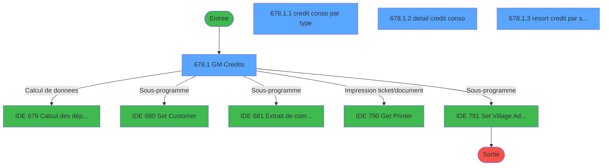
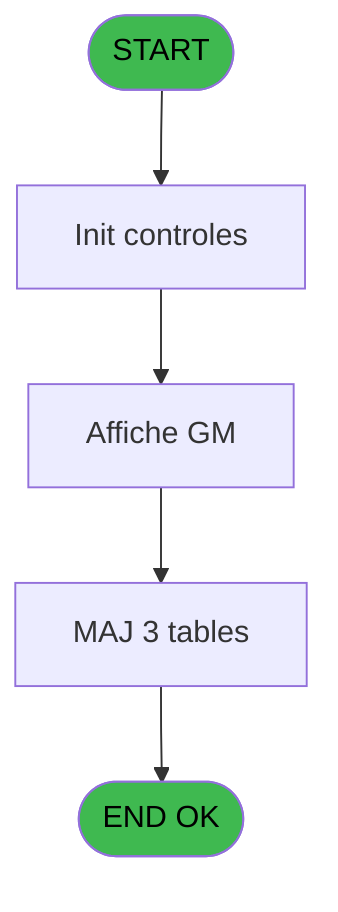
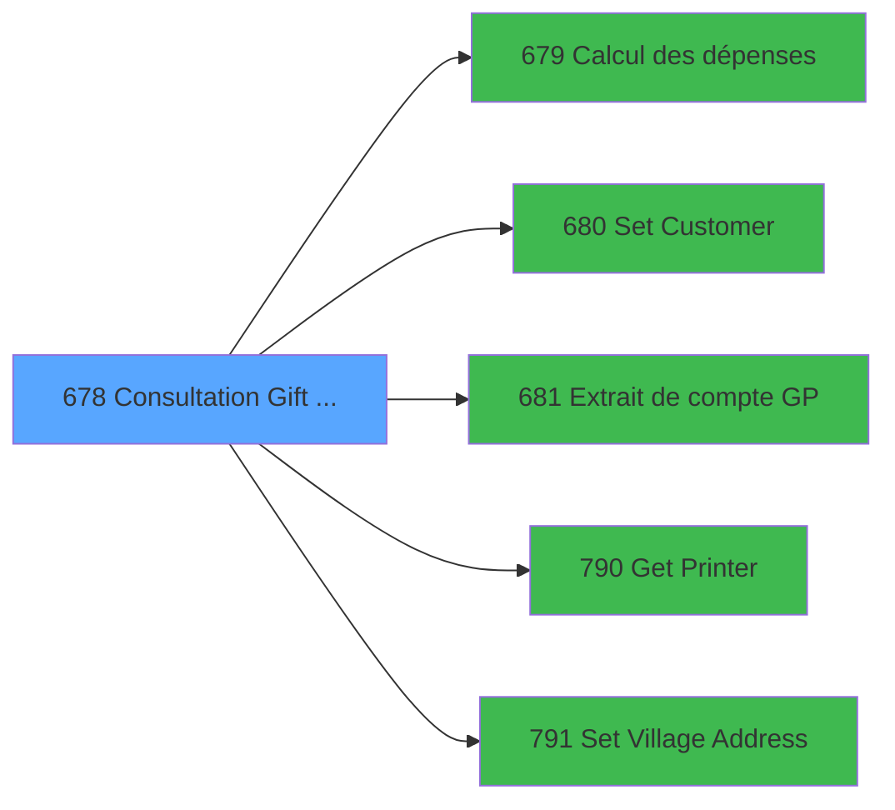

# REF IDE 678 - Consultation Gift Pass

> **Analyse**: Phases 1-4 2026-02-03 13:36 -> 13:36 (15s) | Assemblage 13:36
> **Pipeline**: V7.2 Enrichi
> **Structure**: 4 onglets (Resume | Ecrans | Donnees | Connexions)

<!-- TAB:Resume -->

## 1. FICHE D'IDENTITE

| Attribut | Valeur |
|----------|--------|
| Projet | REF |
| IDE Position | 678 |
| Nom Programme | Consultation Gift Pass |
| Fichier source | `Prg_678.xml` |
| Dossier IDE | General |
| Taches | 13 (4 ecrans visibles) |
| Tables modifiees | 3 |
| Programmes appeles | 5 |
| :warning: Statut | **ORPHELIN_POTENTIEL** |

## 2. DESCRIPTION FONCTIONNELLE

**Consultation Gift Pass** assure la gestion complete de ce processus.

Le flux de traitement s'organise en **1 blocs fonctionnels** :

- **Traitement** (13 taches) : traitements metier divers

**Donnees modifiees** : 3 tables en ecriture (gm-recherche_____gmr, cc_total_par_type, resort_credit).

Detail : phases du traitement

#### Phase 1 : Traitement (13 taches)

- **678** - Consultation Gift Pass **[[ECRAN]](#ecran-t1)**
- **678.1** - GM Credits **[[ECRAN]](#ecran-t2)**
- **678.1.1** - credit conso par type **[[ECRAN]](#ecran-t3)**
- **678.1.2** - detail credit conso **[[ECRAN]](#ecran-t4)**
- **678.1.3** - resort credit par service **[[ECRAN]](#ecran-t5)**
- **678.1.4** - Get Balance Credits Bar
- **678.1.5** - Get GiftPass Credit
- **678.1.6** - Get Resort Credit
- **678.1.7** - Annulation GP
- **678.2** - Gratuites bar GM **[[ECRAN]](#ecran-t10)**
- **678.2.1** - Browse - CC detail **[[ECRAN]](#ecran-t11)**
- **678.2.2** - Browse - CC par type
- **678.2.3** - Browse - Resort Credit

Delegue a : [Set Customer (IDE 680)](REF-IDE-680.md), [Set Village Address (IDE 791)](REF-IDE-791.md)

#### Tables impactees

| Table | Operations | Role metier |
|-------|-----------|-------------|
| cc_total_par_type | R/**W**/L (6 usages) |  |
| gm-recherche_____gmr | **W** (2 usages) | Index de recherche |
| resort_credit | R/**W** (2 usages) | Resort Credit |

## 3. BLOCS FONCTIONNELS

### 3.1 Traitement (13 taches)

Traitements internes.

---

#### 678 - Consultation Gift Pass [[ECRAN]](#ecran-t1)

**Role** : Tache d'orchestration : point d'entree du programme (13 sous-taches). Coordonne l'enchainement des traitements.
**Ecran** : 713 x 453 DLU (MDI) | [Voir mockup](#ecran-t1)

12 sous-taches directes

| Tache | Nom | Bloc |
|-------|-----|------|
| [678.1](#t2) | GM Credits **[[ECRAN]](#ecran-t2)** | Traitement |
| [678.1.1](#t3) | credit conso par type **[[ECRAN]](#ecran-t3)** | Traitement |
| [678.1.2](#t4) | detail credit conso **[[ECRAN]](#ecran-t4)** | Traitement |
| [678.1.3](#t5) | resort credit par service **[[ECRAN]](#ecran-t5)** | Traitement |
| [678.1.4](#t6) | Get Balance Credits Bar | Traitement |
| [678.1.5](#t7) | Get GiftPass Credit | Traitement |
| [678.1.6](#t8) | Get Resort Credit | Traitement |
| [678.1.7](#t9) | Annulation GP | Traitement |
| [678.2](#t10) | Gratuites bar GM **[[ECRAN]](#ecran-t10)** | Traitement |
| [678.2.1](#t11) | Browse - CC detail **[[ECRAN]](#ecran-t11)** | Traitement |
| [678.2.2](#t12) | Browse - CC par type | Traitement |
| [678.2.3](#t13) | Browse - Resort Credit | Traitement |

---

#### 678.1 - GM Credits [[ECRAN]](#ecran-t2)

**Role** : Calcul fidelite/avantage : GM Credits.
**Ecran** : 514 x 330 DLU (MDI) | [Voir mockup](#ecran-t2)

---

#### 678.1.1 - credit conso par type [[ECRAN]](#ecran-t3)

**Role** : Calcul fidelite/avantage : credit conso par type.
**Ecran** : 255 x 79 DLU (Modal) | [Voir mockup](#ecran-t3)
**Variables liees** : D (P type), F (P Type GO/GM), N (v.type CS), O (v.List combo type CS), Q (v.Edtion type)

---

#### 678.1.2 - detail credit conso [[ECRAN]](#ecran-t4)

**Role** : Calcul fidelite/avantage : detail credit conso.
**Ecran** : 226 x 77 DLU (Modal) | [Voir mockup](#ecran-t4)

---

#### 678.1.3 - resort credit par service [[ECRAN]](#ecran-t5)

**Role** : Calcul fidelite/avantage : resort credit par service.
**Ecran** : 255 x 79 DLU | [Voir mockup](#ecran-t5)
**Variables liees** : E (P.Service)

---

#### 678.1.4 - Get Balance Credits Bar

**Role** : Consultation/chargement : Get Balance Credits Bar.

---

#### 678.1.5 - Get GiftPass Credit

**Role** : Consultation/chargement : Get GiftPass Credit.

---

#### 678.1.6 - Get Resort Credit

**Role** : Consultation/chargement : Get Resort Credit.

---

#### 678.1.7 - Annulation GP

**Role** : Traitement : Annulation GP.

---

#### 678.2 - Gratuites bar GM [[ECRAN]](#ecran-t10)

**Role** : Traitement : Gratuites bar GM.
**Ecran** : 424 x 57 DLU (MDI) | [Voir mockup](#ecran-t10)

---

#### 678.2.1 - Browse - CC detail [[ECRAN]](#ecran-t11)

**Role** : Traitement : Browse - CC detail.
**Ecran** : 680 x 0 DLU (MDI) | [Voir mockup](#ecran-t11)

---

#### 678.2.2 - Browse - CC par type

**Role** : Traitement : Browse - CC par type.
**Variables liees** : D (P type), F (P Type GO/GM), N (v.type CS), O (v.List combo type CS), Q (v.Edtion type)

---

#### 678.2.3 - Browse - Resort Credit

**Role** : Calcul fidelite/avantage : Browse - Resort Credit.

## 5. REGLES METIER

*(Aucune regle metier identifiee)*

## 6. CONTEXTE

- **Appele par**: (aucun)
- **Appelle**: 5 programmes | **Tables**: 10 (W:3 R:4 L:8) | **Taches**: 13 | **Expressions**: 4

<!-- TAB:Ecrans -->

## 8. ECRANS

### 8.1 Forms visibles (4 / 13)

| # | Position | Tache | Nom | Type | Largeur | Hauteur | Bloc |
|---|----------|-------|-----|------|---------|---------|------|
| 1 | 678.1 | 678.1 | GM Credits | MDI | 514 | 330 | Traitement |
| 2 | 678.1.1 | 678.1.1 | credit conso par type | Modal | 255 | 79 | Traitement |
| 3 | 678.1.2 | 678.1.2 | detail credit conso | Modal | 226 | 77 | Traitement |
| 4 | 678.1.3 | 678.1.3 | resort credit par service | Type0 | 255 | 79 | Traitement |

### 8.2 Mockups Ecrans

---

#### 678.1 - GM Credits
**Tache** : [678.1](#t2) | **Type** : MDI | **Dimensions** : 514 x 330 DLU
**Bloc** : Traitement | **Titre IDE** : GM Credits

<!-- FORM-DATA:
{
    "width":  514,
    "vFactor":  8,
    "type":  "MDI",
    "hFactor":  4,
    "controls":  [
                     {
                         "x":  0,
                         "type":  "label",
                         "var":  "",
                         "y":  298,
                         "w":  513,
                         "fmt":  "",
                         "name":  "",
                         "h":  32,
                         "color":  "6",
                         "text":  "",
                         "parent":  null
                     },
                     {
                         "x":  272,
                         "type":  "label",
                         "var":  "",
                         "y":  33,
                         "w":  228,
                         "fmt":  "",
                         "name":  "",
                         "h":  102,
                         "color":  "183",
                         "text":  "",
                         "parent":  null
                     },
                     {
                         "x":  279,
                         "type":  "label",
                         "var":  "",
                         "y":  48,
                         "w":  133,
                         "fmt":  "",
                         "name":  "",
                         "h":  11,
                         "color":  "183",
                         "text":  "Points before stay",
                         "parent":  2
                     },
                     {
                         "x":  279,
                         "type":  "label",
                         "var":  "",
                         "y":  64,
                         "w":  133,
                         "fmt":  "",
                         "name":  "",
                         "h":  11,
                         "color":  "183",
                         "text":  "Spendings Potential",
                         "parent":  2
                     },
                     {
                         "x":  279,
                         "type":  "label",
                         "var":  "",
                         "y":  80,
                         "w":  133,
                         "fmt":  "",
                         "name":  "",
                         "h":  11,
                         "color":  "183",
                         "text":  "Spendings Potential Amount",
                         "parent":  2
                     },
                     {
                         "x":  279,
                         "type":  "label",
                         "var":  "",
                         "y":  96,
                         "w":  133,
                         "fmt":  "",
                         "name":  "",
                         "h":  11,
                         "color":  "183",
                         "text":  "Service Spendings",
                         "parent":  2
                     },
                     {
                         "x":  279,
                         "type":  "label",
                         "var":  "",
                         "y":  112,
                         "w":  133,
                         "fmt":  "",
                         "name":  "",
                         "h":  11,
                         "color":  "183",
                         "text":  "Village Spendings",
                         "parent":  2
                     },
                     {
                         "x":  0,
                         "type":  "label",
                         "var":  "",
                         "y":  3,
                         "w":  513,
                         "fmt":  "",
                         "name":  "",
                         "h":  23,
                         "color":  "182",
                         "text":  "",
                         "parent":  null
                     },
                     {
                         "x":  7,
                         "type":  "label",
                         "var":  "",
                         "y":  189,
                         "w":  231,
                         "fmt":  "",
                         "name":  "",
                         "h":  12,
                         "color":  "187",
                         "text":  "Balance by credit type",
                         "parent":  null
                     },
                     {
                         "x":  264,
                         "type":  "label",
                         "var":  "",
                         "y":  189,
                         "w":  208,
                         "fmt":  "",
                         "name":  "",
                         "h":  12,
                         "color":  "187",
                         "text":  "Credits History",
                         "parent":  null
                     },
                     {
                         "x":  8,
                         "type":  "label",
                         "var":  "",
                         "y":  33,
                         "w":  255,
                         "fmt":  "",
                         "name":  "",
                         "h":  39,
                         "color":  "183",
                         "text":  "Filter",
                         "parent":  null
                     },
                     {
                         "x":  8,
                         "type":  "label",
                         "var":  "",
                         "y":  75,
                         "w":  255,
                         "fmt":  "",
                         "name":  "",
                         "h":  95,
                         "color":  "183",
                         "text":  "",
                         "parent":  null
                     },
                     {
                         "x":  25,
                         "type":  "label",
                         "var":  "",
                         "y":  89,
                         "w":  67,
                         "fmt":  "",
                         "name":  "",
                         "h":  11,
                         "color":  "183",
                         "text":  "First Name",
                         "parent":  18
                     },
                     {
                         "x":  25,
                         "type":  "label",
                         "var":  "",
                         "y":  103,
                         "w":  57,
                         "fmt":  "",
                         "name":  "",
                         "h":  11,
                         "color":  "183",
                         "text":  "Name",
                         "parent":  18
                     },
                     {
                         "x":  25,
                         "type":  "label",
                         "var":  "",
                         "y":  119,
                         "w":  75,
                         "fmt":  "",
                         "name":  "",
                         "h":  11,
                         "color":  "183",
                         "text":  "Arrival Date",
                         "parent":  18
                     },
                     {
                         "x":  25,
                         "type":  "label",
                         "var":  "",
                         "y":  135,
                         "w":  79,
                         "fmt":  "",
                         "name":  "",
                         "h":  11,
                         "color":  "183",
                         "text":  "Departure Date",
                         "parent":  18
                     },
                     {
                         "x":  272,
                         "type":  "label",
                         "var":  "",
                         "y":  138,
                         "w":  228,
                         "fmt":  "",
                         "name":  "",
                         "h":  32,
                         "color":  "183",
                         "text":  "",
                         "parent":  null
                     },
                     {
                         "x":  285,
                         "type":  "label",
                         "var":  "",
                         "y":  148,
                         "w":  76,
                         "fmt":  "",
                         "name":  "",
                         "h":  13,
                         "color":  "187",
                         "text":  "BALANCE",
                         "parent":  27
                     },
                     {
                         "x":  112,
                         "type":  "edit",
                         "var":  "",
                         "y":  103,
                         "w":  100,
                         "fmt":  "",
                         "name":  "GM nom",
                         "h":  11,
                         "color":  "187",
                         "text":  "",
                         "parent":  18
                     },
                     {
                         "x":  112,
                         "type":  "edit",
                         "var":  "",
                         "y":  89,
                         "w":  67,
                         "fmt":  "",
                         "name":  "GM prenom",
                         "h":  11,
                         "color":  "187",
                         "text":  "",
                         "parent":  18
                     },
                     {
                         "x":  112,
                         "type":  "edit",
                         "var":  "",
                         "y":  119,
                         "w":  60,
                         "fmt":  "",
                         "name":  "gmr_debut_sejour",
                         "h":  11,
                         "color":  "187",
                         "text":  "",
                         "parent":  18
                     },
                     {
                         "x":  112,
                         "type":  "edit",
                         "var":  "",
                         "y":  135,
                         "w":  60,
                         "fmt":  "",
                         "name":  "gmr_fin_sejour",
                         "h":  11,
                         "color":  "187",
                         "text":  "",
                         "parent":  18
                     },
                     {
                         "x":  385,
                         "type":  "edit",
                         "var":  "",
                         "y":  148,
                         "w":  97,
                         "fmt":  "N13.2",
                         "name":  "solde_credit_conso_0001",
                         "h":  13,
                         "color":  "187",
                         "text":  "",
                         "parent":  27
                     },
                     {
                         "x":  52,
                         "type":  "combobox",
                         "var":  "",
                         "y":  44,
                         "w":  166,
                         "fmt":  "",
                         "name":  "v.combo type",
                         "h":  12,
                         "color":  "103",
                         "text":  "30,99,31",
                         "parent":  16
                     },
                     {
                         "x":  420,
                         "type":  "button",
                         "var":  "",
                         "y":  302,
                         "w":  89,
                         "fmt":  "Print",
                         "name":  "HI",
                         "h":  24,
                         "color":  "",
                         "text":  "",
                         "parent":  null
                     },
                     {
                         "x":  328,
                         "type":  "button",
                         "var":  "",
                         "y":  302,
                         "w":  89,
                         "fmt":  "\u0026Exit",
                         "name":  "",
                         "h":  24,
                         "color":  "",
                         "text":  "",
                         "parent":  null
                     },
                     {
                         "x":  8,
                         "type":  "subform",
                         "var":  "",
                         "y":  206,
                         "w":  255,
                         "fmt":  "",
                         "name":  "credit conso par type",
                         "h":  77,
                         "color":  "",
                         "text":  "",
                         "parent":  null
                     },
                     {
                         "x":  272,
                         "type":  "subform",
                         "var":  "",
                         "y":  205,
                         "w":  228,
                         "fmt":  "",
                         "name":  "detail credit conso",
                         "h":  77,
                         "color":  "",
                         "text":  "",
                         "parent":  null
                     },
                     {
                         "x":  418,
                         "type":  "edit",
                         "var":  "",
                         "y":  48,
                         "w":  75,
                         "fmt":  "",
                         "name":  "mil_nbpoints",
                         "h":  11,
                         "color":  "187",
                         "text":  "",
                         "parent":  2
                     },
                     {
                         "x":  418,
                         "type":  "edit",
                         "var":  "",
                         "y":  64,
                         "w":  75,
                         "fmt":  "",
                         "name":  "mil_score",
                         "h":  11,
                         "color":  "187",
                         "text":  "",
                         "parent":  2
                     },
                     {
                         "x":  418,
                         "type":  "edit",
                         "var":  "",
                         "y":  80,
                         "w":  75,
                         "fmt":  "4",
                         "name":  "mil_montant_score",
                         "h":  11,
                         "color":  "187",
                         "text":  "",
                         "parent":  2
                     },
                     {
                         "x":  418,
                         "type":  "edit",
                         "var":  "",
                         "y":  96,
                         "w":  75,
                         "fmt":  "6.2",
                         "name":  "v.Depenses Service",
                         "h":  11,
                         "color":  "187",
                         "text":  "",
                         "parent":  2
                     },
                     {
                         "x":  418,
                         "type":  "edit",
                         "var":  "",
                         "y":  112,
                         "w":  75,
                         "fmt":  "6.2",
                         "name":  "v.Depenses Global_0001",
                         "h":  11,
                         "color":  "187",
                         "text":  "",
                         "parent":  2
                     },
                     {
                         "x":  6,
                         "type":  "button",
                         "var":  "",
                         "y":  302,
                         "w":  177,
                         "fmt":  "\u0026GP Account statement",
                         "name":  "Extrait GP",
                         "h":  24,
                         "color":  "",
                         "text":  "",
                         "parent":  null
                     },
                     {
                         "x":  186,
                         "type":  "button",
                         "var":  "",
                         "y":  302,
                         "w":  139,
                         "fmt":  "\u0026Cancel GP Credit",
                         "name":  "CancelGPCredit",
                         "h":  24,
                         "color":  "",
                         "text":  "",
                         "parent":  null
                     }
                 ],
    "taskId":  "678.1",
    "height":  330
}
-->

<strong>Champs : 11 champs</strong>

| Pos (x,y) | Nom | Variable | Type |
|-----------|-----|----------|------|
| 112,103 | GM nom | - | edit |
| 112,89 | GM prenom | - | edit |
| 112,119 | gmr_debut_sejour | - | edit |
| 112,135 | gmr_fin_sejour | - | edit |
| 385,148 | solde_credit_conso_0001 | - | edit |
| 52,44 | v.combo type | - | combobox |
| 418,48 | mil_nbpoints | - | edit |
| 418,64 | mil_score | - | edit |
| 418,80 | mil_montant_score | - | edit |
| 418,96 | v.Depenses Service | - | edit |
| 418,112 | v.Depenses Global_0001 | - | edit |

<strong>Boutons : 4 boutons</strong>

| Bouton | Pos (x,y) | Action |
|--------|-----------|--------|
| Print | 420,302 | Appel [Get Printer (IDE 790)](REF-IDE-790.md) |
| Exit | 328,302 | Quitte le programme |
| GP Account statement | 6,302 | Bouton fonctionnel |
| Cancel GP Credit | 186,302 | Annule et retour au menu Modifie l'element |

---

#### 678.1.1 - credit conso par type
**Tache** : [678.1.1](#t3) | **Type** : Modal | **Dimensions** : 255 x 79 DLU
**Bloc** : Traitement | **Titre IDE** : credit conso par type

<!-- FORM-DATA:
{
    "width":  255,
    "vFactor":  8,
    "type":  "Modal",
    "hFactor":  4,
    "controls":  [
                     {
                         "x":  5,
                         "type":  "label",
                         "var":  "",
                         "y":  5,
                         "w":  233,
                         "fmt":  "",
                         "name":  "",
                         "h":  15,
                         "color":  "",
                         "text":  "",
                         "parent":  null
                     },
                     {
                         "x":  4,
                         "type":  "table",
                         "var":  "",
                         "name":  "",
                         "titleH":  16,
                         "color":  "6",
                         "w":  240,
                         "y":  0,
                         "fmt":  "",
                         "parent":  null,
                         "text":  "",
                         "rowH":  12,
                         "h":  66,
                         "cols":  [
                                      {
                                          "title":  "Credit Type",
                                          "layer":  1,
                                          "w":  125
                                      },
                                      {
                                          "title":  "Balance",
                                          "layer":  2,
                                          "w":  97
                                      }
                                  ],
                         "rows":  2
                     },
                     {
                         "x":  133,
                         "type":  "edit",
                         "var":  "",
                         "y":  18,
                         "w":  87,
                         "fmt":  "",
                         "name":  "",
                         "h":  10,
                         "color":  "6",
                         "text":  "",
                         "parent":  2
                     },
                     {
                         "x":  9,
                         "type":  "edit",
                         "var":  "",
                         "y":  18,
                         "w":  115,
                         "fmt":  "",
                         "name":  "libelle_credit",
                         "h":  10,
                         "color":  "6",
                         "text":  "",
                         "parent":  2
                     }
                 ],
    "taskId":  "678.1.1",
    "height":  79
}
-->

<strong>Champs : 2 champs</strong>

| Pos (x,y) | Nom | Variable | Type |
|-----------|-----|----------|------|
| 133,18 | (sans nom) | - | edit |
| 9,18 | libelle_credit | - | edit |

---

#### 678.1.2 - detail credit conso
**Tache** : [678.1.2](#t4) | **Type** : Modal | **Dimensions** : 226 x 77 DLU
**Bloc** : Traitement | **Titre IDE** : detail credit conso

<!-- FORM-DATA:
{
    "width":  226,
    "vFactor":  8,
    "type":  "Modal",
    "hFactor":  4,
    "controls":  [
                     {
                         "x":  0,
                         "type":  "table",
                         "var":  "",
                         "name":  "",
                         "titleH":  16,
                         "color":  "6",
                         "w":  217,
                         "y":  0,
                         "fmt":  "",
                         "parent":  null,
                         "text":  "",
                         "rowH":  12,
                         "h":  66,
                         "cols":  [
                                      {
                                          "title":  "Amount",
                                          "layer":  1,
                                          "w":  69
                                      },
                                      {
                                          "title":  "Credit Type",
                                          "layer":  2,
                                          "w":  65
                                      },
                                      {
                                          "title":  "Date",
                                          "layer":  3,
                                          "w":  63
                                      }
                                  ],
                         "rows":  3
                     },
                     {
                         "x":  4,
                         "type":  "edit",
                         "var":  "",
                         "y":  17,
                         "w":  61,
                         "fmt":  "N13.2C",
                         "name":  "",
                         "h":  11,
                         "color":  "6",
                         "text":  "",
                         "parent":  1
                     },
                     {
                         "x":  138,
                         "type":  "edit",
                         "var":  "",
                         "y":  17,
                         "w":  56,
                         "fmt":  "",
                         "name":  "",
                         "h":  11,
                         "color":  "6",
                         "text":  "",
                         "parent":  1
                     },
                     {
                         "x":  73,
                         "type":  "edit",
                         "var":  "",
                         "y":  17,
                         "w":  56,
                         "fmt":  "10",
                         "name":  "",
                         "h":  8,
                         "color":  "6",
                         "text":  "",
                         "parent":  1
                     }
                 ],
    "taskId":  "678.1.2",
    "height":  77
}
-->

<strong>Champs : 3 champs</strong>

| Pos (x,y) | Nom | Variable | Type |
|-----------|-----|----------|------|
| 4,17 | N13.2C | - | edit |
| 138,17 | (sans nom) | - | edit |
| 73,17 | 10 | - | edit |

---

#### 678.1.3 - resort credit par service
**Tache** : [678.1.3](#t5) | **Type** : Type0 | **Dimensions** : 255 x 79 DLU
**Bloc** : Traitement | **Titre IDE** : resort credit par service

<!-- FORM-DATA:
{
    "width":  255,
    "vFactor":  8,
    "type":  "Type0",
    "hFactor":  4,
    "controls":  [
                     {
                         "x":  4,
                         "type":  "table",
                         "var":  "",
                         "name":  "",
                         "titleH":  16,
                         "color":  "6",
                         "w":  240,
                         "y":  0,
                         "fmt":  "",
                         "parent":  null,
                         "text":  "",
                         "rowH":  12,
                         "h":  66,
                         "cols":  [
                                      {
                                          "title":  "service",
                                          "layer":  1,
                                          "w":  100
                                      },
                                      {
                                          "title":  "Credit",
                                          "layer":  2,
                                          "w":  123
                                      }
                                  ],
                         "rows":  2
                     },
                     {
                         "x":  8,
                         "type":  "edit",
                         "var":  "",
                         "y":  17,
                         "w":  92,
                         "fmt":  "",
                         "name":  "service",
                         "h":  10,
                         "color":  "6",
                         "text":  "",
                         "parent":  1
                     },
                     {
                         "x":  108,
                         "type":  "edit",
                         "var":  "",
                         "y":  17,
                         "w":  118,
                         "fmt":  "",
                         "name":  "montant",
                         "h":  10,
                         "color":  "6",
                         "text":  "",
                         "parent":  1
                     }
                 ],
    "taskId":  "678.1.3",
    "height":  79
}
-->

<strong>Champs : 2 champs</strong>

| Pos (x,y) | Nom | Variable | Type |
|-----------|-----|----------|------|
| 8,17 | service | - | edit |
| 108,17 | montant | - | edit |

## 9. NAVIGATION

### 9.1 Enchainement des ecrans

**Detail par enchainement :**

| Depuis | Action | Vers | Retour |
|--------|--------|------|--------|
| GM Credits | Calcul de donnees | [Calcul des dépenses (IDE 679)](REF-IDE-679.md) | Retour ecran |
| GM Credits | Sous-programme | [Set Customer (IDE 680)](REF-IDE-680.md) | Retour ecran |
| GM Credits | Sous-programme | [Extrait de compte GP (IDE 681)](REF-IDE-681.md) | Retour ecran |
| GM Credits | Impression ticket/document | [Get Printer (IDE 790)](REF-IDE-790.md) | Retour ecran |
| GM Credits | Sous-programme | [Set Village Address (IDE 791)](REF-IDE-791.md) | Retour ecran |

### 9.3 Structure hierarchique (13 taches)

| Position | Tache | Type | Dimensions | Bloc |
|----------|-------|------|------------|------|
| **678.1** | [**Consultation Gift Pass** (678)](#t1) [mockup](#ecran-t1) | MDI | 713x453 | Traitement |
| 678.1.1 | [GM Credits (678.1)](#t2) [mockup](#ecran-t2) | MDI | 514x330 | |
| 678.1.2 | [credit conso par type (678.1.1)](#t3) [mockup](#ecran-t3) | Modal | 255x79 | |
| 678.1.3 | [detail credit conso (678.1.2)](#t4) [mockup](#ecran-t4) | Modal | 226x77 | |
| 678.1.4 | [resort credit par service (678.1.3)](#t5) [mockup](#ecran-t5) | - | 255x79 | |
| 678.1.5 | [Get Balance Credits Bar (678.1.4)](#t6) | - | - | |
| 678.1.6 | [Get GiftPass Credit (678.1.5)](#t7) | - | - | |
| 678.1.7 | [Get Resort Credit (678.1.6)](#t8) | - | - | |
| 678.1.8 | [Annulation GP (678.1.7)](#t9) | - | - | |
| 678.1.9 | [Gratuites bar GM (678.2)](#t10) [mockup](#ecran-t10) | MDI | 424x57 | |
| 678.1.10 | [Browse - CC detail (678.2.1)](#t11) [mockup](#ecran-t11) | MDI | 680x0 | |
| 678.1.11 | [Browse - CC par type (678.2.2)](#t12) | MDI | - | |
| 678.1.12 | [Browse - Resort Credit (678.2.3)](#t13) | MDI | - | |

### 9.4 Algorigramme

> **Legende**: Vert = START/END OK | Rouge = END KO | Bleu = Decisions
> *Algorigramme auto-genere. Utiliser `/algorigramme` pour une synthese metier detaillee.*

<!-- TAB:Donnees -->

## 10. TABLES

### Tables utilisees (10)

| ID | Nom | Description | Type | R | W | L | Usages |
|----|-----|-------------|------|---|---|---|--------|
| 30 | gm-recherche_____gmr | Index de recherche | DB |   | **W** |   | 2 |
| 34 | hebergement______heb | Hebergement (chambres) | DB |   |   | L | 1 |
| 268 | cc_total_par_type |  | DB | R | **W** | L | 6 |
| 271 | cc_total |  | DB |   |   | L | 1 |
| 272 | cc_type_detail |  | DB | R |   | L | 5 |
| 273 | cc_type |  | DB | R |   | L | 3 |
| 356 | gm_millesia |  | DB |   |   | L | 2 |
| 378 | pv_customer |  | DB |   |   | L | 2 |
| 803 | code_fidelisation |  | DB |   |   | L | 1 |
| 908 | resort_credit | Resort Credit | DB | R | **W** |   | 2 |

### Colonnes par table (7 / 5 tables avec colonnes identifiees)

Table 30 - gm-recherche_____gmr (**W**) - 2 usages

| Lettre | Variable | Acces | Type |
|--------|----------|-------|------|
| A | v.combo type | W | Alpha |
| B | v.presence credit | W | Logical |
| C | v.Balance Crédit Bar | W | Numeric |
| D | v.total depose | W | Numeric |
| E | v.nom prenom cpt | W | Alpha |
| F | v.ExistResortCredit | W | Logical |
| G | v.qualitéProprietaire | W | Logical |
| H | v.Depenses Service | W | Numeric |
| I | v.Depenses Global | W | Numeric |
| J | CHG_REASON_v.combo type | W | Numeric |
| K | CHG_PRV_v.combo type | W | Alpha |
| L | v.Confirmation ? | W | Numeric |

Table 268 - cc_total_par_type (R/**W**/L) - 6 usages

| Lettre | Variable | Acces | Type |
|--------|----------|-------|------|
| A | v.combo type | W | Alpha |
| B | v.cummul type depose | W | Numeric |
| C | v.total restant | W | Numeric |
| D | P type | W | Alpha |
| F | P Type GO/GM | W | Alpha |
| J | CHG_REASON_v.combo type | W | Numeric |
| K | CHG_PRV_v.combo type | W | Alpha |
| N | v.type CS | W | Alpha |
| O | v.List combo type CS | W | Alpha |
| Q | v.Edtion type | W | Alpha |

Table 272 - cc_type_detail (R/L) - 5 usages

| Lettre | Variable | Acces | Type |
|--------|----------|-------|------|
| A | v.combo type | R | Alpha |
| B | v.cummul type depose | R | Numeric |
| D | P type | R | Alpha |
| F | P Type GO/GM | R | Alpha |
| J | CHG_REASON_v.combo type | R | Numeric |
| K | CHG_PRV_v.combo type | R | Alpha |
| N | v.type CS | R | Alpha |
| O | v.List combo type CS | R | Alpha |
| Q | v.Edtion type | R | Alpha |

Table 273 - cc_type (R/L) - 3 usages

| Lettre | Variable | Acces | Type |
|--------|----------|-------|------|
| A | P.Societe | R | Alpha |
| B | P.Compte | R | Numeric |
| C | P.Filiale | R | Numeric |
| D | P type | R | Alpha |
| E | P.Service | R | Alpha |
| F | P Type GO/GM | R | Alpha |
| G | p.code-devise | R | Alpha |
| H | p.nom village | R | Alpha |
| I | p.masque-mtt | R | Alpha |
| J | p.masque-mtt sans Z | R | Alpha |
| K | p.Application en cours | R | Alpha |
| L | v.action | R | Alpha |
| M | v.montant | R | Numeric |
| N | v.type CS | R | Alpha |
| O | v.List combo type CS | R | Alpha |
| P | v.last name | R | Alpha |
| Q | v.Edtion type | R | Alpha |

Table 908 - resort_credit (R/**W**) - 2 usages

| Lettre | Variable | Acces | Type |
|--------|----------|-------|------|
| B | v.presence credit | W | Logical |
| D | v.GiftPassCredit | W | Numeric |
| E | v.ResortCredit | W | Numeric |
| F | v.ExistResortCredit | W | Logical |

## 11. VARIABLES

### 11.1 Parametres entrants (11)

Variables recues en parametre.

| Lettre | Nom | Type | Usage dans |
|--------|-----|------|-----------|
| A | P.Societe | Alpha | - |
| B | P.Compte | Numeric | - |
| C | P.Filiale | Numeric | - |
| D | P type | Alpha | - |
| E | P.Service | Alpha | - |
| F | P Type GO/GM | Alpha | - |
| G | p.code-devise | Alpha | - |
| H | p.nom village | Alpha | - |
| I | p.masque-mtt | Alpha | - |
| J | p.masque-mtt sans Z | Alpha | - |
| K | p.Application en cours | Alpha | - |

### 11.2 Variables de session (6)

Variables persistantes pendant toute la session.

| Lettre | Nom | Type | Usage dans |
|--------|-----|------|-----------|
| L | v.action | Alpha | 2x session |
| M | v.montant | Numeric | - |
| N | v.type CS | Alpha | 1x session |
| O | v.List combo type CS | Alpha | - |
| P | v.last name | Alpha | - |
| Q | v.Edtion type | Alpha | - |

Toutes les 17 variables (liste complete)

| Cat | Lettre | Nom Variable | Type |
|-----|--------|--------------|------|
| P0 | **A** | P.Societe | Alpha |
| P0 | **B** | P.Compte | Numeric |
| P0 | **C** | P.Filiale | Numeric |
| P0 | **D** | P type | Alpha |
| P0 | **E** | P.Service | Alpha |
| P0 | **F** | P Type GO/GM | Alpha |
| P0 | **G** | p.code-devise | Alpha |
| P0 | **H** | p.nom village | Alpha |
| P0 | **I** | p.masque-mtt | Alpha |
| P0 | **J** | p.masque-mtt sans Z | Alpha |
| P0 | **K** | p.Application en cours | Alpha |
| V. | **L** | v.action | Alpha |
| V. | **M** | v.montant | Numeric |
| V. | **N** | v.type CS | Alpha |
| V. | **O** | v.List combo type CS | Alpha |
| V. | **P** | v.last name | Alpha |
| V. | **Q** | v.Edtion type | Alpha |

## 12. EXPRESSIONS

**4 / 4 expressions decodees (100%)**

### 12.1 Repartition par type

| Type | Expressions | Regles |
|------|-------------|--------|
| CONSTANTE | 1 | 0 |
| CONDITION | 2 | 0 |
| OTHER | 1 | 0 |

### 12.2 Expressions cles par type

#### CONSTANTE (1 expressions)

| Type | IDE | Expression | Regle |
|------|-----|------------|-------|
| CONSTANTE | 1 | `'F'` | - |

#### CONDITION (2 expressions)

| Type | IDE | Expression | Regle |
|------|-----|------------|-------|
| CONDITION | 4 | `v.action [L]='I'` | - |
| CONDITION | 2 | `v.action [L]='F'` | - |

#### OTHER (1 expressions)

| Type | IDE | Expression | Regle |
|------|-----|------------|-------|
| OTHER | 3 | `v.type CS [N]` | - |

<!-- TAB:Connexions -->

## 13. GRAPHE D'APPELS

### 13.1 Chaine depuis Main (Callers)

**Chemin**: (pas de callers directs)

### 13.2 Callers

| IDE | Nom Programme | Nb Appels |
|-----|---------------|-----------|
| - | (aucun) | - |

### 13.3 Callees (programmes appeles)

### 13.4 Detail Callees avec contexte

| IDE | Nom Programme | Appels | Contexte |
|-----|---------------|--------|----------|
| [679](REF-IDE-679.md) | Calcul des dépenses | 2 | Calcul de donnees |
| [680](REF-IDE-680.md) | Set Customer | 1 | Sous-programme |
| [681](REF-IDE-681.md) | Extrait de compte GP | 1 | Sous-programme |
| [790](REF-IDE-790.md) | Get Printer | 1 | Impression ticket/document |
| [791](REF-IDE-791.md) | Set Village Address | 1 | Sous-programme |

## 14. RECOMMANDATIONS MIGRATION

### 14.1 Profil du programme

| Metrique | Valeur | Impact migration |
|----------|--------|-----------------|
| Lignes de logique | 320 | Taille moyenne |
| Expressions | 4 | Peu de logique |
| Tables WRITE | 3 | Impact modere |
| Sous-programmes | 5 | Peu de dependances |
| Ecrans visibles | 4 | Quelques ecrans |
| Code desactive | 0% (0 / 320) | Code sain |
| Regles metier | 0 | Pas de regle identifiee |

### 14.2 Plan de migration par bloc

#### Traitement (13 taches: 7 ecrans, 6 traitements)

- **Strategie** : Orchestrateur avec 7 ecrans (Razor/React) et 6 traitements backend (services).
- Les ecrans deviennent des composants UI, les traitements invisibles deviennent des services injectables.
- 5 sous-programme(s) a migrer ou a reutiliser depuis les services existants.
- Decomposer les taches en services unitaires testables.

### 14.3 Dependances critiques

| Dependance | Type | Appels | Impact |
|------------|------|--------|--------|
| gm-recherche_____gmr | Table WRITE (Database) | 2x | Schema + repository |
| cc_total_par_type | Table WRITE (Database) | 1x | Schema + repository |
| resort_credit | Table WRITE (Database) | 1x | Schema + repository |
| [Calcul des dépenses (IDE 679)](REF-IDE-679.md) | Sous-programme | 2x | Haute - Calcul de donnees |
| [Get Printer (IDE 790)](REF-IDE-790.md) | Sous-programme | 1x | Normale - Impression ticket/document |
| [Set Village Address (IDE 791)](REF-IDE-791.md) | Sous-programme | 1x | Normale - Sous-programme |
| [Set Customer (IDE 680)](REF-IDE-680.md) | Sous-programme | 1x | Normale - Sous-programme |
| [Extrait de compte GP (IDE 681)](REF-IDE-681.md) | Sous-programme | 1x | Normale - Sous-programme |

---
*Spec DETAILED generee par Pipeline V7.2 - 2026-02-03 13:36*
