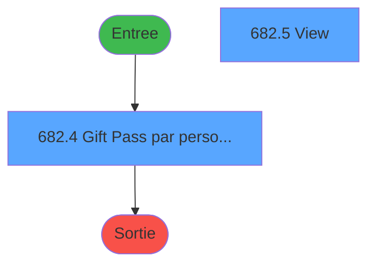
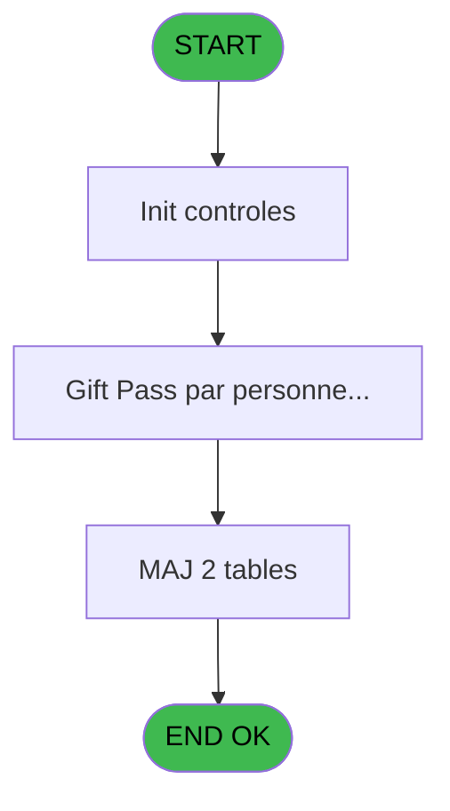

# REF IDE 682 - Affectation Gift Pass

> **Analyse**: Phases 1-4 2026-02-03 13:37 -> 13:38 (16s) | Assemblage 13:38
> **Pipeline**: V7.2 Enrichi
> **Structure**: 4 onglets (Resume | Ecrans | Donnees | Connexions)

<!-- TAB:Resume -->

## 1. FICHE D'IDENTITE

| Attribut | Valeur |
|----------|--------|
| Projet | REF |
| IDE Position | 682 |
| Nom Programme | Affectation Gift Pass |
| Fichier source | `Prg_682.xml` |
| Dossier IDE | General |
| Taches | 8 (2 ecrans visibles) |
| Tables modifiees | 2 |
| Programmes appeles | 0 |
| :warning: Statut | **ORPHELIN_POTENTIEL** |

## 2. DESCRIPTION FONCTIONNELLE

**Affectation Gift Pass** assure la gestion complete de ce processus.

Le flux de traitement s'organise en **3 blocs fonctionnels** :

- **Traitement** (5 taches) : traitements metier divers
- **Calcul** (2 taches) : calculs de montants, stocks ou compteurs
- **Creation** (1 tache) : insertion d'enregistrements en base (mouvements, prestations)

**Donnees modifiees** : 2 tables en ecriture (cc_total_par_type, cc_type_detail).

**Logique metier** : 1 regles identifiees couvrant conditions metier.

Detail : phases du traitement

#### Phase 1 : Traitement (5 taches)

- **682** - Affectation Gift Pass
- **682.2** - Affectation Gift Pass
- **682.4** - Gift Pass par personne old **[[ECRAN]](#ecran-t5)**
- **682.5** - View **[[ECRAN]](#ecran-t6)**
- **682.6** - Gift Pass par personne **[[ECRAN]](#ecran-t9)**

#### Phase 2 : Calcul (2 taches)

- **682.1** - Calcul Gift Pass Devise Locale
- **682.3** - Calcul cumul Gift Pass

#### Phase 3 : Creation (1 tache)

- **682.7** - Creation Dejeuner Arrivée

#### Tables impactees

| Table | Operations | Role metier |
|-------|-----------|-------------|
| cc_type_detail | **W**/L (2 usages) |  |
| cc_total_par_type | **W** (1 usages) |  |

## 3. BLOCS FONCTIONNELS

### 3.1 Traitement (5 taches)

Traitements internes.

---

#### 682 - Affectation Gift Pass

**Role** : Calcul fidelite/avantage : Affectation Gift Pass.

4 sous-taches directes

| Tache | Nom | Bloc |
|-------|-----|------|
| [682.2](#t3) | Affectation Gift Pass | Traitement |
| [682.4](#t5) | Gift Pass par personne old **[[ECRAN]](#ecran-t5)** | Traitement |
| [682.5](#t6) | View **[[ECRAN]](#ecran-t6)** | Traitement |
| [682.6](#t9) | Gift Pass par personne **[[ECRAN]](#ecran-t9)** | Traitement |

**Variables liees** : E (Cumul Gift Pass deja affecté), F (Montant Gift Pass Devise Villag)

---

#### 682.2 - Affectation Gift Pass

**Role** : Calcul fidelite/avantage : Affectation Gift Pass.
**Variables liees** : E (Cumul Gift Pass deja affecté), F (Montant Gift Pass Devise Villag)

---

#### 682.4 - Gift Pass par personne old [[ECRAN]](#ecran-t5)

**Role** : Calcul fidelite/avantage : Gift Pass par personne old.
**Ecran** : 782 x 290 DLU | [Voir mockup](#ecran-t5)
**Variables liees** : E (Cumul Gift Pass deja affecté), F (Montant Gift Pass Devise Villag)

---

#### 682.5 - View [[ECRAN]](#ecran-t6)

**Role** : Traitement : View.
**Ecran** : 677 x 195 DLU | [Voir mockup](#ecran-t6)

---

#### 682.6 - Gift Pass par personne [[ECRAN]](#ecran-t9)

**Role** : Calcul fidelite/avantage : Gift Pass par personne.
**Ecran** : 918 x 195 DLU | [Voir mockup](#ecran-t9)
**Variables liees** : E (Cumul Gift Pass deja affecté), F (Montant Gift Pass Devise Villag)

### 3.2 Calcul (2 taches)

Calculs metier : montants, stocks, compteurs.

---

#### 682.1 - Calcul Gift Pass Devise Locale

**Role** : Calcul : Calcul Gift Pass Devise Locale.
**Variables liees** : E (Cumul Gift Pass deja affecté), F (Montant Gift Pass Devise Villag)

---

#### 682.3 - Calcul cumul Gift Pass

**Role** : Calcul : Calcul cumul Gift Pass.
**Variables liees** : E (Cumul Gift Pass deja affecté), F (Montant Gift Pass Devise Villag)

### 3.3 Creation (1 tache)

Insertion de nouveaux enregistrements en base.

---

#### 682.7 - Creation Dejeuner Arrivée

**Role** : Creation d'enregistrement : Creation Dejeuner Arrivée.

## 5. REGLES METIER

1 regles identifiees:

### Autres (1 regles)

#### [RM-001] Si [AI]>[AH] alors [AI]-[AH] sinon 0)

| Element | Detail |
|---------|--------|
| **Condition** | `[AI]>[AH]` |
| **Si vrai** | [AI]-[AH] |
| **Si faux** | 0) |
| **Expression source** | Expression 14 : `IF([AI]>[AH],[AI]-[AH],0)` |
| **Exemple** | Si [AI]>[AH] → [AI]-[AH]. Sinon → 0) |

## 6. CONTEXTE

- **Appele par**: (aucun)
- **Appelle**: 0 programmes | **Tables**: 10 (W:2 R:2 L:7) | **Taches**: 8 | **Expressions**: 31

<!-- TAB:Ecrans -->

## 8. ECRANS

### 8.1 Forms visibles (2 / 8)

| # | Position | Tache | Nom | Type | Largeur | Hauteur | Bloc |
|---|----------|-------|-----|------|---------|---------|------|
| 1 | 682.2 | 682.4 | Gift Pass par personne old | Type0 | 782 | 290 | Traitement |
| 2 | 682.7 | 682.5 | View | Type0 | 677 | 195 | Traitement |

### 8.2 Mockups Ecrans

---

#### 682.2 - Gift Pass par personne old
**Tache** : [682.4](#t5) | **Type** : Type0 | **Dimensions** : 782 x 290 DLU
**Bloc** : Traitement | **Titre IDE** : Gift Pass par personne old

<!-- FORM-DATA:
{
    "width":  782,
    "vFactor":  8,
    "type":  "Type0",
    "hFactor":  4,
    "controls":  [
                     {
                         "x":  4,
                         "type":  "table",
                         "var":  "",
                         "name":  "",
                         "titleH":  12,
                         "color":  "",
                         "w":  772,
                         "y":  8,
                         "fmt":  "",
                         "parent":  null,
                         "text":  "",
                         "rowH":  13,
                         "h":  272,
                         "cols":  [
                                      {
                                          "title":  "gmr_code_gm",
                                          "layer":  1,
                                          "w":  57
                                      },
                                      {
                                          "title":  "gmr_filiation_villag",
                                          "layer":  2,
                                          "w":  71
                                      },
                                      {
                                          "title":  "gmr_acces",
                                          "layer":  3,
                                          "w":  45
                                      },
                                      {
                                          "title":  "gmr_age_num",
                                          "layer":  4,
                                          "w":  57
                                      },
                                      {
                                          "title":  "Valeur",
                                          "layer":  5,
                                          "w":  63
                                      },
                                      {
                                          "title":  "nb_nuits_min",
                                          "layer":  6,
                                          "w":  53
                                      },
                                      {
                                          "title":  "nb_nuits_max",
                                          "layer":  7,
                                          "w":  55
                                      }
                                  ],
                         "rows":  7
                     },
                     {
                         "x":  8,
                         "type":  "edit",
                         "var":  "",
                         "y":  23,
                         "w":  42,
                         "fmt":  "",
                         "name":  "gmr_code_gm",
                         "h":  10,
                         "color":  "",
                         "text":  "",
                         "parent":  1
                     },
                     {
                         "x":  65,
                         "type":  "edit",
                         "var":  "",
                         "y":  23,
                         "w":  18,
                         "fmt":  "",
                         "name":  "gmr_filiation_villag",
                         "h":  10,
                         "color":  "",
                         "text":  "",
                         "parent":  1
                     },
                     {
                         "x":  136,
                         "type":  "edit",
                         "var":  "",
                         "y":  23,
                         "w":  9,
                         "fmt":  "",
                         "name":  "gmr_acces",
                         "h":  10,
                         "color":  "",
                         "text":  "",
                         "parent":  1
                     },
                     {
                         "x":  181,
                         "type":  "edit",
                         "var":  "",
                         "y":  23,
                         "w":  18,
                         "fmt":  "",
                         "name":  "gmr_age_num",
                         "h":  10,
                         "color":  "",
                         "text":  "",
                         "parent":  1
                     },
                     {
                         "x":  238,
                         "type":  "edit",
                         "var":  "",
                         "y":  23,
                         "w":  56,
                         "fmt":  "",
                         "name":  "Valeur",
                         "h":  10,
                         "color":  "",
                         "text":  "",
                         "parent":  1
                     },
                     {
                         "x":  301,
                         "type":  "edit",
                         "var":  "",
                         "y":  23,
                         "w":  22,
                         "fmt":  "",
                         "name":  "nb_nuits_min",
                         "h":  10,
                         "color":  "",
                         "text":  "",
                         "parent":  1
                     },
                     {
                         "x":  354,
                         "type":  "edit",
                         "var":  "",
                         "y":  23,
                         "w":  22,
                         "fmt":  "",
                         "name":  "nb_nuits_max",
                         "h":  10,
                         "color":  "",
                         "text":  "",
                         "parent":  1
                     }
                 ],
    "taskId":  "682.2",
    "height":  290
}
-->

<strong>Champs : 7 champs</strong>

| Pos (x,y) | Nom | Variable | Type |
|-----------|-----|----------|------|
| 8,23 | gmr_code_gm | - | edit |
| 65,23 | gmr_filiation_villag | - | edit |
| 136,23 | gmr_acces | - | edit |
| 181,23 | gmr_age_num | - | edit |
| 238,23 | Valeur | - | edit |
| 301,23 | nb_nuits_min | - | edit |
| 354,23 | nb_nuits_max | - | edit |

---

#### 682.7 - View
**Tache** : [682.5](#t6) | **Type** : Type0 | **Dimensions** : 677 x 195 DLU
**Bloc** : Traitement | **Titre IDE** : View

<!-- FORM-DATA:
{
    "width":  677,
    "vFactor":  8,
    "type":  "Type0",
    "hFactor":  4,
    "controls":  [
                     {
                         "x":  8,
                         "type":  "table",
                         "var":  "",
                         "name":  "",
                         "titleH":  12,
                         "color":  "",
                         "w":  655,
                         "y":  8,
                         "fmt":  "",
                         "parent":  null,
                         "text":  "",
                         "rowH":  13,
                         "h":  182,
                         "cols":  [
                                      {
                                          "title":  "gmr_code_gm",
                                          "layer":  1,
                                          "w":  63
                                      },
                                      {
                                          "title":  "gmr_filiation_villag",
                                          "layer":  2,
                                          "w":  71
                                      },
                                      {
                                          "title":  "gmr_nom__30_",
                                          "layer":  3,
                                          "w":  178
                                      },
                                      {
                                          "title":  "gmr_prenom__8_",
                                          "layer":  4,
                                          "w":  69
                                      },
                                      {
                                          "title":  "gmr_acces",
                                          "layer":  5,
                                          "w":  45
                                      },
                                      {
                                          "title":  "gmr_age_num",
                                          "layer":  6,
                                          "w":  63
                                      },
                                      {
                                          "title":  "gmr_age_nb_mois",
                                          "layer":  7,
                                          "w":  72
                                      },
                                      {
                                          "title":  "agp_valeur",
                                          "layer":  8,
                                          "w":  77
                                      }
                                  ],
                         "rows":  8
                     },
                     {
                         "x":  12,
                         "type":  "edit",
                         "var":  "",
                         "y":  23,
                         "w":  56,
                         "fmt":  "",
                         "name":  "gmr_code_gm",
                         "h":  10,
                         "color":  "",
                         "text":  "",
                         "parent":  1
                     },
                     {
                         "x":  75,
                         "type":  "edit",
                         "var":  "",
                         "y":  23,
                         "w":  56,
                         "fmt":  "",
                         "name":  "gmr_filiation_villag",
                         "h":  10,
                         "color":  "",
                         "text":  "",
                         "parent":  1
                     },
                     {
                         "x":  146,
                         "type":  "edit",
                         "var":  "",
                         "y":  23,
                         "w":  171,
                         "fmt":  "",
                         "name":  "gmr_nom__30_",
                         "h":  10,
                         "color":  "",
                         "text":  "",
                         "parent":  1
                     },
                     {
                         "x":  324,
                         "type":  "edit",
                         "var":  "",
                         "y":  23,
                         "w":  59,
                         "fmt":  "",
                         "name":  "gmr_prenom__8_",
                         "h":  10,
                         "color":  "",
                         "text":  "",
                         "parent":  1
                     },
                     {
                         "x":  393,
                         "type":  "edit",
                         "var":  "",
                         "y":  23,
                         "w":  9,
                         "fmt":  "",
                         "name":  "gmr_acces",
                         "h":  10,
                         "color":  "",
                         "text":  "",
                         "parent":  1
                     },
                     {
                         "x":  438,
                         "type":  "edit",
                         "var":  "",
                         "y":  23,
                         "w":  56,
                         "fmt":  "",
                         "name":  "gmr_age_num",
                         "h":  10,
                         "color":  "",
                         "text":  "",
                         "parent":  1
                     },
                     {
                         "x":  501,
                         "type":  "edit",
                         "var":  "",
                         "y":  23,
                         "w":  56,
                         "fmt":  "",
                         "name":  "gmr_age_nb_mois",
                         "h":  10,
                         "color":  "",
                         "text":  "",
                         "parent":  1
                     },
                     {
                         "x":  573,
                         "type":  "edit",
                         "var":  "",
                         "y":  23,
                         "w":  70,
                         "fmt":  "",
                         "name":  "agp_valeur",
                         "h":  10,
                         "color":  "",
                         "text":  "",
                         "parent":  1
                     }
                 ],
    "taskId":  "682.7",
    "height":  195
}
-->

<strong>Champs : 8 champs</strong>

| Pos (x,y) | Nom | Variable | Type |
|-----------|-----|----------|------|
| 12,23 | gmr_code_gm | - | edit |
| 75,23 | gmr_filiation_villag | - | edit |
| 146,23 | gmr_nom__30_ | - | edit |
| 324,23 | gmr_prenom__8_ | - | edit |
| 393,23 | gmr_acces | - | edit |
| 438,23 | gmr_age_num | - | edit |
| 501,23 | gmr_age_nb_mois | - | edit |
| 573,23 | agp_valeur | - | edit |

## 9. NAVIGATION

### 9.1 Enchainement des ecrans

**Detail par enchainement :**

| Depuis | Action | Vers | Retour |
|--------|--------|------|--------|

### 9.3 Structure hierarchique (8 taches)

| Position | Tache | Type | Dimensions | Bloc |
|----------|-------|------|------------|------|
| **682.1** | [**Affectation Gift Pass** (682)](#t1) | - | - | Traitement |
| 682.1.1 | [Affectation Gift Pass (682.2)](#t3) | - | - | |
| 682.1.2 | [Gift Pass par personne old (682.4)](#t5) [mockup](#ecran-t5) | - | 782x290 | |
| 682.1.3 | [View (682.5)](#t6) [mockup](#ecran-t6) | - | 677x195 | |
| 682.1.4 | [Gift Pass par personne (682.6)](#t9) [mockup](#ecran-t9) | - | 918x195 | |
| **682.2** | [**Calcul Gift Pass Devise Locale** (682.1)](#t2) | - | - | Calcul |
| 682.2.1 | [Calcul cumul Gift Pass (682.3)](#t4) | - | - | |
| **682.3** | [**Creation Dejeuner Arrivée** (682.7)](#t10) | - | - | Creation |

### 9.4 Algorigramme

> **Legende**: Vert = START/END OK | Rouge = END KO | Bleu = Decisions
> *Algorigramme auto-genere. Utiliser `/algorigramme` pour une synthese metier detaillee.*

<!-- TAB:Donnees -->

## 10. TABLES

### Tables utilisees (10)

| ID | Nom | Description | Type | R | W | L | Usages |
|----|-----|-------------|------|---|---|---|--------|
| 30 | gm-recherche_____gmr | Index de recherche | DB | R |   |   | 2 |
| 34 | hebergement______heb | Hebergement (chambres) | DB |   |   | L | 1 |
| 50 | moyens_reglement_mor | Reglements / paiements | DB | R |   |   | 1 |
| 69 | initialisation___ini |  | DB |   |   | L | 1 |
| 268 | cc_total_par_type |  | DB |   | **W** |   | 1 |
| 272 | cc_type_detail |  | DB |   | **W** | L | 2 |
| 356 | gm_millesia |  | DB |   |   | L | 1 |
| 368 | pms_village |  | DB |   |   | L | 2 |
| 707 | parametre_generaux |  | DB |   |   | L | 1 |
| 868 | Affectation_Gift_Pass |  | DB |   |   | L | 2 |

### Colonnes par table (2 / 4 tables avec colonnes identifiees)

Table 30 - gm-recherche_____gmr (R) - 2 usages

| Lettre | Variable | Acces | Type |
|--------|----------|-------|------|
| A | P.Societe | R | Unicode |
| B | P.Compte | R | Numeric |
| C | P.Filiation | R | Numeric |
| D | V.DureeSejour | R | Numeric |
| E | Cumul Gift Pass deja affecté | R | Numeric |
| F | Montant Gift Pass Devise Villag | R | Numeric |

Table 50 - moyens_reglement_mor (R) - 1 usages

*Table utilisee uniquement en Link ou aucune colonne Real identifiee dans le DataView.*

Table 268 - cc_total_par_type (**W**) - 1 usages

*Table utilisee uniquement en Link ou aucune colonne Real identifiee dans le DataView.*

Table 272 - cc_type_detail (**W**/L) - 2 usages

*Table utilisee uniquement en Link ou aucune colonne Real identifiee dans le DataView.*

## 11. VARIABLES

### 11.1 Parametres entrants (3)

Variables recues en parametre.

| Lettre | Nom | Type | Usage dans |
|--------|-----|------|-----------|
| A | P.Societe | Unicode | 2x parametre entrant |
| B | P.Compte | Numeric | 2x parametre entrant |
| C | P.Filiation | Numeric | 2x parametre entrant |

### 11.2 Variables de session (1)

Variables persistantes pendant toute la session.

| Lettre | Nom | Type | Usage dans |
|--------|-----|------|-----------|
| D | V.DureeSejour | Numeric | 1x session |

### 11.3 Autres (4)

Variables diverses.

| Lettre | Nom | Type | Usage dans |
|--------|-----|------|-----------|
| E | Cumul Gift Pass deja affecté | Numeric | - |
| F | Montant Gift Pass Devise Villag | Numeric | - |
| G | gmr_age_nb_mois | Numeric | - |
| H | agp_valeur | Numeric | - |

## 12. EXPRESSIONS

**31 / 31 expressions decodees (100%)**

### 12.1 Repartition par type

| Type | Expressions | Regles |
|------|-------------|--------|
| CONDITION | 8 | 5 |
| CALCULATION | 1 | 0 |
| CONSTANTE | 6 | 0 |
| REFERENCE_VG | 1 | 0 |
| OTHER | 12 | 0 |
| FORMAT | 3 | 0 |

### 12.2 Expressions cles par type

#### CONDITION (8 expressions)

| Type | IDE | Expression | Regle |
|------|-----|------------|-------|
| CONDITION | 14 | `IF([AI]>[AH],[AI]-[AH],0)` | [RM-001](#rm-RM-001) |
| CONDITION | 13 | `Cumul Gift Pass deja a... [E]<>'EUR'` | - |
| CONDITION | 15 | `[AI]>0` | - |
| CONDITION | 31 | `NOT([BN]<>0 AND [BN]<Val([BM],'2'))` | - |
| CONDITION | 11 | `[AT]='GM' AND [BB]<>'CLUB' AND (ExpCalc('9'EXP) OR VG133)` | - |
| ... | | *+3 autres* | |

#### CALCULATION (1 expressions)

| Type | IDE | Expression | Regle |
|------|-----|------------|-------|
| CALCULATION | 21 | `[V]- [Q]` | - |

#### CONSTANTE (6 expressions)

| Type | IDE | Expression | Regle |
|------|-----|------------|-------|
| CONSTANTE | 20 | `'Z'` | - |
| CONSTANTE | 27 | `'H'` | - |
| CONSTANTE | 30 | `'C'` | - |
| CONSTANTE | 5 | `'FID'` | - |
| CONSTANTE | 8 | `'VIP'` | - |
| ... | | *+1 autres* | |

#### REFERENCE_VG (1 expressions)

| Type | IDE | Expression | Regle |
|------|-----|------------|-------|
| REFERENCE_VG | 1 | `VG133` | - |

#### OTHER (12 expressions)

| Type | IDE | Expression | Regle |
|------|-----|------------|-------|
| OTHER | 18 | `P.Filiation [C]` | - |
| OTHER | 17 | `P.Compte [B]` | - |
| OTHER | 16 | `P.Societe [A]` | - |
| OTHER | 29 | `V.DureeSejour [D]` | - |
| OTHER | 26 | `[Q]` | - |
| ... | | *+7 autres* | |

#### FORMAT (3 expressions)

| Type | IDE | Expression | Regle |
|------|-----|------------|-------|
| FORMAT | 25 | `'Calcul RESTE a AFFECTER: '&Str([AI],'N13.2')` | - |
| FORMAT | 24 | `'Calcul Devise Locale: '&Str([AI],'N13.2')` | - |
| FORMAT | 23 | `'Calcul GPP: '&Str([AI],'N13.2')` | - |

### 12.3 Toutes les expressions (31)

Voir les 31 expressions

#### CONDITION (8)

| IDE | Expression Decodee |
|-----|-------------------|
| 10 | `[AB]+[AG]>0 AND [L]<>'O'` |
| 14 | `IF([AI]>[AH],[AI]-[AH],0)` |
| 28 | `VG138 AND [BC] AND Date()=[Q] AND Time()<=[BH]` |
| 7 | `[K]<>'N'` |
| 11 | `[AT]='GM' AND [BB]<>'CLUB' AND (ExpCalc('9'EXP) OR VG133)` |
| 13 | `Cumul Gift Pass deja a... [E]<>'EUR'` |
| 15 | `[AI]>0` |
| 31 | `NOT([BN]<>0 AND [BN]<Val([BM],'2'))` |

#### CALCULATION (1)

| IDE | Expression Decodee |
|-----|-------------------|
| 21 | `[V]- [Q]` |

#### CONSTANTE (6)

| IDE | Expression Decodee |
|-----|-------------------|
| 5 | `'FID'` |
| 8 | `'VIP'` |
| 19 | `'A'` |
| 20 | `'Z'` |
| 27 | `'H'` |
| 30 | `'C'` |

#### REFERENCE_VG (1)

| IDE | Expression Decodee |
|-----|-------------------|
| 1 | `VG133` |

#### OTHER (12)

| IDE | Expression Decodee |
|-----|-------------------|
| 2 | `P.Societe [A]` |
| 3 | `P.Compte [B]` |
| 4 | `P.Filiation [C]` |
| 6 | `[J]` |
| 9 | `[K]` |
| 12 | `MAX([AB],[AG])` |
| 16 | `P.Societe [A]` |
| 17 | `P.Compte [B]` |
| 18 | `P.Filiation [C]` |
| 22 | `CndRange(VG27,[W])` |
| 26 | `[Q]` |
| 29 | `V.DureeSejour [D]` |

#### FORMAT (3)

| IDE | Expression Decodee |
|-----|-------------------|
| 23 | `'Calcul GPP: '&Str([AI],'N13.2')` |
| 24 | `'Calcul Devise Locale: '&Str([AI],'N13.2')` |
| 25 | `'Calcul RESTE a AFFECTER: '&Str([AI],'N13.2')` |

<!-- TAB:Connexions -->

## 13. GRAPHE D'APPELS

### 13.1 Chaine depuis Main (Callers)

**Chemin**: (pas de callers directs)

### 13.2 Callers

| IDE | Nom Programme | Nb Appels |
|-----|---------------|-----------|
| - | (aucun) | - |

### 13.3 Callees (programmes appeles)

### 13.4 Detail Callees avec contexte

| IDE | Nom Programme | Appels | Contexte |
|-----|---------------|--------|----------|
| - | (aucun) | - | - |

## 14. RECOMMANDATIONS MIGRATION

### 14.1 Profil du programme

| Metrique | Valeur | Impact migration |
|----------|--------|-----------------|
| Lignes de logique | 205 | Taille moyenne |
| Expressions | 31 | Peu de logique |
| Tables WRITE | 2 | Impact faible |
| Sous-programmes | 0 | Peu de dependances |
| Ecrans visibles | 2 | Quelques ecrans |
| Code desactive | 2% (4 / 205) | Code sain |
| Regles metier | 1 | Quelques regles a preserver |

### 14.2 Plan de migration par bloc

#### Traitement (5 taches: 3 ecrans, 2 traitements)

- **Strategie** : Orchestrateur avec 3 ecrans (Razor/React) et 2 traitements backend (services).
- Les ecrans deviennent des composants UI, les traitements invisibles deviennent des services injectables.
- Decomposer les taches en services unitaires testables.

#### Calcul (2 taches: 0 ecran, 2 traitements)

- **Strategie** : Services de calcul purs (Domain Services).
- Migrer la logique de calcul (stock, compteurs, montants)

#### Creation (1 tache: 0 ecran, 1 traitement)

- **Strategie** : Repository pattern avec Entity Framework Core.
- Insertion via `IRepository<T>.CreateAsync()`

### 14.3 Dependances critiques

| Dependance | Type | Appels | Impact |
|------------|------|--------|--------|
| cc_total_par_type | Table WRITE (Database) | 1x | Schema + repository |
| cc_type_detail | Table WRITE (Database) | 1x | Schema + repository |

---
*Spec DETAILED generee par Pipeline V7.2 - 2026-02-03 13:38*
