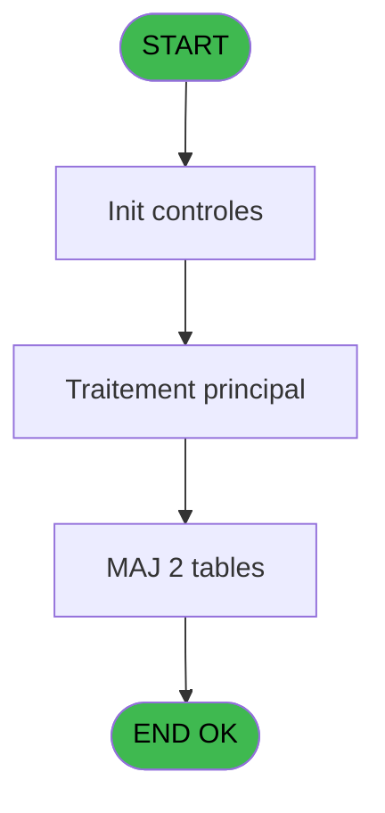

# REF IDE 683 - Désaffectation Gift Pass

> **Analyse**: Phases 1-4 2026-02-03 13:38 -> 13:38 (16s) | Assemblage 13:38
> **Pipeline**: V7.2 Enrichi
> **Structure**: 4 onglets (Resume | Ecrans | Donnees | Connexions)

<!-- TAB:Resume -->

## 1. FICHE D'IDENTITE

| Attribut | Valeur |
|----------|--------|
| Projet | REF |
| IDE Position | 683 |
| Nom Programme | Désaffectation Gift Pass |
| Fichier source | `Prg_683.xml` |
| Dossier IDE | General |
| Taches | 6 (0 ecrans visibles) |
| Tables modifiees | 2 |
| Programmes appeles | 0 |
| :warning: Statut | **ORPHELIN_POTENTIEL** |

## 2. DESCRIPTION FONCTIONNELLE

**Désaffectation Gift Pass** assure la gestion complete de ce processus.

Le flux de traitement s'organise en **2 blocs fonctionnels** :

- **Calcul** (3 taches) : calculs de montants, stocks ou compteurs
- **Traitement** (3 taches) : traitements metier divers

**Donnees modifiees** : 2 tables en ecriture (cc_total_par_type, cc_type_detail).

**Logique metier** : 2 regles identifiees couvrant conditions metier.

Detail : phases du traitement

#### Phase 1 : Traitement (3 taches)

- **683** - Désaffectation Gift Pass **[[ECRAN]](#ecran-t1)**
- **683.4** - Affectation Gift Pass
- **683.5** - Gift Pass par personne **[[ECRAN]](#ecran-t25)**

#### Phase 2 : Calcul (3 taches)

- **683.1** - Calcul cumul Gift Pass
- **683.2** - Calcul cumul Gift Pass
- **683.3** - Calcul Gift Pass Devise Locale

#### Tables impactees

| Table | Operations | Role metier |
|-------|-----------|-------------|
| cc_type_detail | **W**/L (2 usages) |  |
| cc_total_par_type | **W** (2 usages) |  |

## 3. BLOCS FONCTIONNELS

### 3.1 Traitement (3 taches)

Traitements internes.

---

#### 683 - Désaffectation Gift Pass [[ECRAN]](#ecran-t1)

**Role** : Calcul fidelite/avantage : Désaffectation Gift Pass.
**Ecran** : 522 x 254 DLU | [Voir mockup](#ecran-t1)

---

#### 683.4 - Affectation Gift Pass

**Role** : Calcul fidelite/avantage : Affectation Gift Pass.

---

#### 683.5 - Gift Pass par personne [[ECRAN]](#ecran-t25)

**Role** : Calcul fidelite/avantage : Gift Pass par personne.
**Ecran** : 677 x 195 DLU | [Voir mockup](#ecran-t25)

### 3.2 Calcul (3 taches)

Calculs metier : montants, stocks, compteurs.

---

#### 683.1 - Calcul cumul Gift Pass

**Role** : Calcul : Calcul cumul Gift Pass.
**Variables liees** : K (V.Cumul GP deja affecte)

---

#### 683.2 - Calcul cumul Gift Pass

**Role** : Calcul : Calcul cumul Gift Pass.
**Variables liees** : K (V.Cumul GP deja affecte)

---

#### 683.3 - Calcul Gift Pass Devise Locale

**Role** : Calcul : Calcul Gift Pass Devise Locale.

## 5. REGLES METIER

2 regles identifiees:

### Autres (2 regles)

#### [RM-001] Si [AL]>[AT] alors [AJ] sinon [AU]-[AT])

| Element | Detail |
|---------|--------|
| **Condition** | `[AL]>[AT]` |
| **Si vrai** | [AJ] |
| **Si faux** | [AU]-[AT]) |
| **Expression source** | Expression 22 : `IF([AL]>[AT],[AJ],[AU]-[AT])` |
| **Exemple** | Si [AL]>[AT] → [AJ]. Sinon → [AU]-[AT]) |

#### [RM-002] Si [AU]<=[AJ] alors [AU] sinon [AJ])

| Element | Detail |
|---------|--------|
| **Condition** | `[AU]<=[AJ]` |
| **Si vrai** | [AU] |
| **Si faux** | [AJ]) |
| **Expression source** | Expression 27 : `IF([AU]<=[AJ],[AU],[AJ])` |
| **Exemple** | Si [AU]<=[AJ] → [AU]. Sinon → [AJ]) |

## 6. CONTEXTE

- **Appele par**: (aucun)
- **Appelle**: 0 programmes | **Tables**: 9 (W:2 R:2 L:6) | **Taches**: 6 | **Expressions**: 28

<!-- TAB:Ecrans -->

## 8. ECRANS

*(Programme sans ecran visible)*

## 9. NAVIGATION

### 9.3 Structure hierarchique (6 taches)

| Position | Tache | Type | Dimensions | Bloc |
|----------|-------|------|------------|------|
| **683.1** | [**Désaffectation Gift Pass** (683)](#t1) [mockup](#ecran-t1) | - | 522x254 | Traitement |
| 683.1.1 | [Affectation Gift Pass (683.4)](#t13) | - | - | |
| 683.1.2 | [Gift Pass par personne (683.5)](#t25) [mockup](#ecran-t25) | - | 677x195 | |
| **683.2** | [**Calcul cumul Gift Pass** (683.1)](#t2) | - | - | Calcul |
| 683.2.1 | [Calcul cumul Gift Pass (683.2)](#t5) | - | - | |
| 683.2.2 | [Calcul Gift Pass Devise Locale (683.3)](#t11) | - | - | |

### 9.4 Algorigramme

> **Legende**: Vert = START/END OK | Rouge = END KO | Bleu = Decisions
> *Algorigramme auto-genere. Utiliser `/algorigramme` pour une synthese metier detaillee.*

<!-- TAB:Donnees -->

## 10. TABLES

### Tables utilisees (9)

| ID | Nom | Description | Type | R | W | L | Usages |
|----|-----|-------------|------|---|---|---|--------|
| 34 | hebergement______heb | Hebergement (chambres) | DB | R |   |   | 1 |
| 50 | moyens_reglement_mor | Reglements / paiements | DB | R |   |   | 1 |
| 69 | initialisation___ini |  | DB |   |   | L | 1 |
| 131 | fichier_validation |  | DB |   |   | L | 1 |
| 268 | cc_total_par_type |  | DB |   | **W** |   | 2 |
| 272 | cc_type_detail |  | DB |   | **W** | L | 2 |
| 356 | gm_millesia |  | DB |   |   | L | 1 |
| 368 | pms_village |  | DB |   |   | L | 1 |
| 868 | Affectation_Gift_Pass |  | DB |   |   | L | 1 |

### Colonnes par table (1 / 4 tables avec colonnes identifiees)

Table 34 - hebergement______heb (R) - 1 usages

| Lettre | Variable | Acces | Type |
|--------|----------|-------|------|
| A | P.Societe | R | Unicode |
| B | P.Compte | R | Numeric |
| C | P.Filiation | R | Numeric |
| D | V.DureeSejour | R | Numeric |
| E | v.Mnt GP autre filliation | R | Numeric |
| F | v.Mnt GP du GO à dévalider | R | Numeric |
| G | v.Mnt GP autre filliation TX | R | Numeric |
| H | v.Mnt GP du GO à dévalider TX | R | Numeric |
| I | v.Mnt solde GP | R | Numeric |
| J | v.Depenses | R | Numeric |
| K | V.Cumul GP deja affecte | R | Numeric |
| L | v.Mnt GP à retirer | R | Numeric |

Table 50 - moyens_reglement_mor (R) - 1 usages

*Table utilisee uniquement en Link ou aucune colonne Real identifiee dans le DataView.*

Table 268 - cc_total_par_type (**W**) - 2 usages

*Table utilisee uniquement en Link ou aucune colonne Real identifiee dans le DataView.*

Table 272 - cc_type_detail (**W**/L) - 2 usages

*Table utilisee uniquement en Link ou aucune colonne Real identifiee dans le DataView.*

## 11. VARIABLES

### 11.1 Parametres entrants (3)

Variables recues en parametre.

| Lettre | Nom | Type | Usage dans |
|--------|-----|------|-----------|
| A | P.Societe | Unicode | 2x parametre entrant |
| B | P.Compte | Numeric | 2x parametre entrant |
| C | P.Filiation | Numeric | 3x parametre entrant |

### 11.2 Variables de session (9)

Variables persistantes pendant toute la session.

| Lettre | Nom | Type | Usage dans |
|--------|-----|------|-----------|
| D | V.DureeSejour | Numeric | - |
| E | v.Mnt GP autre filliation | Numeric | - |
| F | v.Mnt GP du GO à dévalider | Numeric | - |
| G | v.Mnt GP autre filliation TX | Numeric | - |
| H | v.Mnt GP du GO à dévalider TX | Numeric | - |
| I | v.Mnt solde GP | Numeric | 2x session |
| J | v.Depenses | Numeric | - |
| K | V.Cumul GP deja affecte | Numeric | 1x session |
| L | v.Mnt GP à retirer | Numeric | - |

## 12. EXPRESSIONS

**28 / 28 expressions decodees (100%)**

### 12.1 Repartition par type

| Type | Expressions | Regles |
|------|-------------|--------|
| CALCULATION | 2 | 0 |
| CONDITION | 8 | 2 |
| CONSTANTE | 4 | 0 |
| OTHER | 12 | 0 |
| REFERENCE_VG | 1 | 0 |
| FORMAT | 1 | 0 |

### 12.2 Expressions cles par type

#### CALCULATION (2 expressions)

| Type | IDE | Expression | Regle |
|------|-----|------------|-------|
| CALCULATION | 20 | `[AU]-[AJ]` | - |
| CALCULATION | 15 | `[V]- [Q]` | - |

#### CONDITION (8 expressions)

| Type | IDE | Expression | Regle |
|------|-----|------------|-------|
| CONDITION | 27 | `IF([AU]<=[AJ],[AU],[AJ])` | [RM-002](#rm-RM-002) |
| CONDITION | 22 | `IF([AL]>[AT],[AJ],[AU]-[AT])` | [RM-001](#rm-RM-001) |
| CONDITION | 19 | `P.Filiation [C]=v.Mnt GP du GO à déval... [F] AND v.Mnt solde GP [I]<>'O'` | - |
| CONDITION | 21 | `[AM]>[AH]` | - |
| CONDITION | 26 | `[AU]>0` | - |
| ... | | *+3 autres* | |

#### CONSTANTE (4 expressions)

| Type | IDE | Expression | Regle |
|------|-----|------------|-------|
| CONSTANTE | 13 | `'A'` | - |
| CONSTANTE | 14 | `'Z'` | - |
| CONSTANTE | 4 | `'FID'` | - |
| CONSTANTE | 7 | `'VIP'` | - |

#### OTHER (12 expressions)

| Type | IDE | Expression | Regle |
|------|-----|------------|-------|
| OTHER | 16 | `CndRange(VG27,[W])` | - |
| OTHER | 12 | `P.Filiation [C]` | - |
| OTHER | 11 | `P.Compte [B]` | - |
| OTHER | 24 | `[AM]` | - |
| OTHER | 23 | `[AH]` | - |
| ... | | *+7 autres* | |

#### REFERENCE_VG (1 expressions)

| Type | IDE | Expression | Regle |
|------|-----|------------|-------|
| REFERENCE_VG | 25 | `VG133` | - |

#### FORMAT (1 expressions)

| Type | IDE | Expression | Regle |
|------|-----|------------|-------|
| FORMAT | 28 | `'Gift Pass calculé :'&Str([AU],'')` | - |

### 12.3 Toutes les expressions (28)

Voir les 28 expressions

#### CALCULATION (2)

| IDE | Expression Decodee |
|-----|-------------------|
| 15 | `[V]- [Q]` |
| 20 | `[AU]-[AJ]` |

#### CONDITION (8)

| IDE | Expression Decodee |
|-----|-------------------|
| 22 | `IF([AL]>[AT],[AJ],[AU]-[AT])` |
| 27 | `IF([AU]<=[AJ],[AU],[AJ])` |
| 6 | `v.Mnt GP du GO à déval... [H]<>'N'` |
| 9 | `V.Cumul GP deja affecte [K]<>'EUR'` |
| 18 | `P.Filiation [C]<>v.Mnt GP du GO à déval... [F] AND v.Mnt solde GP [I]<>'O' AND ExpCalc('17'EXP)>[AH] AND [AQ]='O'` |
| 19 | `P.Filiation [C]=v.Mnt GP du GO à déval... [F] AND v.Mnt solde GP [I]<>'O'` |
| 21 | `[AM]>[AH]` |
| 26 | `[AU]>0` |

#### CONSTANTE (4)

| IDE | Expression Decodee |
|-----|-------------------|
| 4 | `'FID'` |
| 7 | `'VIP'` |
| 13 | `'A'` |
| 14 | `'Z'` |

#### OTHER (12)

| IDE | Expression Decodee |
|-----|-------------------|
| 1 | `P.Societe [A]` |
| 2 | `P.Compte [B]` |
| 3 | `v.Mnt GP du GO à déval... [F]` |
| 5 | `v.Mnt GP autre filliat... [G]` |
| 8 | `v.Mnt GP du GO à déval... [H]` |
| 10 | `P.Societe [A]` |
| 11 | `P.Compte [B]` |
| 12 | `P.Filiation [C]` |
| 16 | `CndRange(VG27,[W])` |
| 17 | `MAX([AB],[AG])` |
| 23 | `[AH]` |
| 24 | `[AM]` |

#### REFERENCE_VG (1)

| IDE | Expression Decodee |
|-----|-------------------|
| 25 | `VG133` |

#### FORMAT (1)

| IDE | Expression Decodee |
|-----|-------------------|
| 28 | `'Gift Pass calculé :'&Str([AU],'')` |

<!-- TAB:Connexions -->

## 13. GRAPHE D'APPELS

### 13.1 Chaine depuis Main (Callers)

**Chemin**: (pas de callers directs)

### 13.2 Callers

| IDE | Nom Programme | Nb Appels |
|-----|---------------|-----------|
| - | (aucun) | - |

### 13.3 Callees (programmes appeles)

### 13.4 Detail Callees avec contexte

| IDE | Nom Programme | Appels | Contexte |
|-----|---------------|--------|----------|
| - | (aucun) | - | - |

## 14. RECOMMANDATIONS MIGRATION

### 14.1 Profil du programme

| Metrique | Valeur | Impact migration |
|----------|--------|-----------------|
| Lignes de logique | 169 | Programme compact |
| Expressions | 28 | Peu de logique |
| Tables WRITE | 2 | Impact faible |
| Sous-programmes | 0 | Peu de dependances |
| Ecrans visibles | 0 | Ecran unique ou traitement batch |
| Code desactive | 0.6% (1 / 169) | Code sain |
| Regles metier | 2 | Quelques regles a preserver |

### 14.2 Plan de migration par bloc

#### Traitement (3 taches: 2 ecrans, 1 traitement)

- **Strategie** : Orchestrateur avec 2 ecrans (Razor/React) et 1 traitements backend (services).
- Les ecrans deviennent des composants UI, les traitements invisibles deviennent des services injectables.
- Decomposer les taches en services unitaires testables.

#### Calcul (3 taches: 0 ecran, 3 traitements)

- **Strategie** : Services de calcul purs (Domain Services).
- Migrer la logique de calcul (stock, compteurs, montants)

### 14.3 Dependances critiques

| Dependance | Type | Appels | Impact |
|------------|------|--------|--------|
| cc_total_par_type | Table WRITE (Database) | 2x | Schema + repository |
| cc_type_detail | Table WRITE (Database) | 1x | Schema + repository |

---
*Spec DETAILED generee par Pipeline V7.2 - 2026-02-03 13:38*
