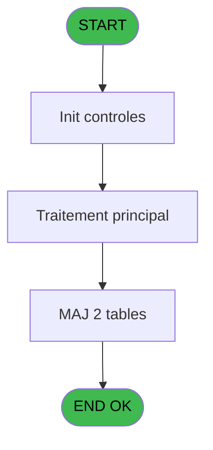
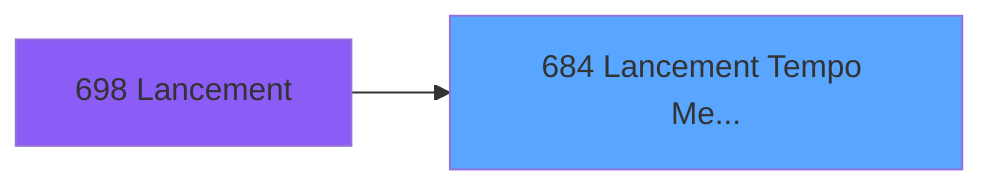
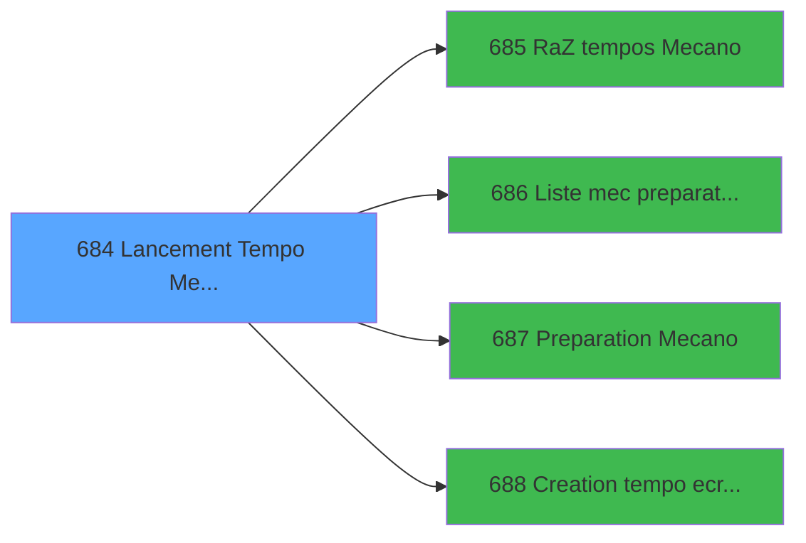

# REF IDE 684 - Lancement Tempo Mecano

> **Analyse**: Phases 1-4 2026-02-03 13:38 -> 13:39 (20s) | Assemblage 13:39
> **Pipeline**: V7.2 Enrichi
> **Structure**: 4 onglets (Resume | Ecrans | Donnees | Connexions)

<!-- TAB:Resume -->

## 1. FICHE D'IDENTITE

| Attribut | Valeur |
|----------|--------|
| Projet | REF |
| IDE Position | 684 |
| Nom Programme | Lancement Tempo Mecano |
| Fichier source | `Prg_684.xml` |
| Dossier IDE | General |
| Taches | 3 (0 ecrans visibles) |
| Tables modifiees | 2 |
| Programmes appeles | 4 |

## 2. DESCRIPTION FONCTIONNELLE

**Lancement Tempo Mecano** assure la gestion complete de ce processus, accessible depuis [Lancement (IDE 698)](REF-IDE-698.md).

Le flux de traitement s'organise en **1 blocs fonctionnels** :

- **Traitement** (3 taches) : traitements metier divers

**Donnees modifiees** : 2 tables en ecriture (code_logement____clo, tables_qualites__qua).

## 3. BLOCS FONCTIONNELS

### 3.1 Traitement (3 taches)

Traitements internes.

---

#### 684 - Lancement Tempo Mecano

**Role** : Traitement : Lancement Tempo Mecano.
**Delegue a** : [Liste mec preparation planning (IDE 686)](REF-IDE-686.md), [Preparation Mecano (IDE 687)](REF-IDE-687.md)

---

#### 684.1 - Flag Toutes Qualités

**Role** : Traitement : Flag Toutes Qualités.
**Variables liees** : K (P.i.Toutes Qualités)
**Delegue a** : [Liste mec preparation planning (IDE 686)](REF-IDE-686.md), [Preparation Mecano (IDE 687)](REF-IDE-687.md)

---

#### 684.2 - Flag Codes Logements

**Role** : Traitement : Flag Codes Logements.
**Variables liees** : L (P.i.Tous Codes Logements)
**Delegue a** : [Liste mec preparation planning (IDE 686)](REF-IDE-686.md), [Preparation Mecano (IDE 687)](REF-IDE-687.md)

## 5. REGLES METIER

*(Aucune regle metier identifiee)*

## 6. CONTEXTE

- **Appele par**: [Lancement (IDE 698)](REF-IDE-698.md)
- **Appelle**: 4 programmes | **Tables**: 3 (W:2 R:0 L:1) | **Taches**: 3 | **Expressions**: 3

<!-- TAB:Ecrans -->

## 8. ECRANS

*(Programme sans ecran visible)*

## 9. NAVIGATION

### 9.3 Structure hierarchique (3 taches)

| Position | Tache | Type | Dimensions | Bloc |
|----------|-------|------|------------|------|
| **684.1** | [**Lancement Tempo Mecano** (684)](#t1) | - | - | Traitement |
| 684.1.1 | [Flag Toutes Qualités (684.1)](#t2) | - | - | |
| 684.1.2 | [Flag Codes Logements (684.2)](#t3) | - | - | |

### 9.4 Algorigramme

> **Legende**: Vert = START/END OK | Rouge = END KO | Bleu = Decisions
> *Algorigramme auto-genere. Utiliser `/algorigramme` pour une synthese metier detaillee.*

<!-- TAB:Donnees -->

## 10. TABLES

### Tables utilisees (3)

| ID | Nom | Description | Type | R | W | L | Usages |
|----|-----|-------------|------|---|---|---|--------|
| 108 | code_logement____clo |  | DB |   | **W** |   | 1 |
| 120 | tables_qualites__qua |  | DB |   | **W** |   | 1 |
| 619 | tempo_userlist | Table temporaire ecran | TMP |   |   | L | 2 |

### Colonnes par table (1 / 2 tables avec colonnes identifiees)

Table 108 - code_logement____clo (**W**) - 1 usages

| Lettre | Variable | Acces | Type |
|--------|----------|-------|------|
| L | P.i.Tous Codes Logements | W | Logical |

Table 120 - tables_qualites__qua (**W**) - 1 usages

*Table utilisee uniquement en Link ou aucune colonne Real identifiee dans le DataView.*

## 11. VARIABLES

### 11.1 Parametres entrants (12)

Variables recues du programme appelant ([Lancement (IDE 698)](REF-IDE-698.md)).

| Lettre | Nom | Type | Usage dans |
|--------|-----|------|-----------|
| A | P.i.Societe | Unicode | 1x parametre entrant |
| B | P.i.Ordre de tri | Alpha | 1x parametre entrant |
| C | P.i.Date | Date | 1x parametre entrant |
| D | P.i.Categorie | Alpha | 1x parametre entrant |
| E | P.i.Sejour | Alpha | - |
| F | P.i.o.Total | Numeric | - |
| G | P.i.o.Nb Select | Numeric | - |
| H | P.i.Seminaire | Alpha | - |
| I | P.i.Date Alpha | Alpha | - |
| J | P.i.Filtre Fidelisation | Logical | 1x parametre entrant |
| K | P.i.Toutes Qualités | Logical | [684.1](#t2) |
| L | P.i.Tous Codes Logements | Logical | [684.2](#t3) |

## 12. EXPRESSIONS

**3 / 3 expressions decodees (100%)**

### 12.1 Repartition par type

| Type | Expressions | Regles |
|------|-------------|--------|
| FORMAT | 1 | 0 |
| OTHER | 2 | 0 |

### 12.2 Expressions cles par type

#### FORMAT (1 expressions)

| Type | IDE | Expression | Regle |
|------|-----|------------|-------|
| FORMAT | 3 | `'date : '&DStr(P.i.Date [C],'DD/MM/YYYY')&' Tri : '&P.i.Ordre de tri [B]&' Societe : '&P.i.Societe [A]&' Categorie : '&P.i.Categorie [D]&IF(P.i.Filtre Fidelisation [J],'Filtre Fid','Pas de filtre fid')` | - |

#### OTHER (2 expressions)

| Type | IDE | Expression | Regle |
|------|-----|------------|-------|
| OTHER | 2 | `P.i.Tous Codes Logements [L]` | - |
| OTHER | 1 | `P.i.Toutes Qualités [K]` | - |

<!-- TAB:Connexions -->

## 13. GRAPHE D'APPELS

### 13.1 Chaine depuis Main (Callers)

Main -> ... -> [Lancement (IDE 698)](REF-IDE-698.md) -> **Lancement Tempo Mecano (IDE 684)**

### 13.2 Callers

| IDE | Nom Programme | Nb Appels |
|-----|---------------|-----------|
| [698](REF-IDE-698.md) | Lancement | 1 |

### 13.3 Callees (programmes appeles)

### 13.4 Detail Callees avec contexte

| IDE | Nom Programme | Appels | Contexte |
|-----|---------------|--------|----------|
| [685](REF-IDE-685.md) | RaZ tempos Mecano | 1 | Reinitialisation |
| [686](REF-IDE-686.md) | Liste mec preparation planning | 1 | Configuration impression |
| [687](REF-IDE-687.md) | Preparation Mecano | 1 | Sous-programme |
| [688](REF-IDE-688.md) | Creation tempo ecran generique | 1 | Sous-programme |

## 14. RECOMMANDATIONS MIGRATION

### 14.1 Profil du programme

| Metrique | Valeur | Impact migration |
|----------|--------|-----------------|
| Lignes de logique | 58 | Programme compact |
| Expressions | 3 | Peu de logique |
| Tables WRITE | 2 | Impact faible |
| Sous-programmes | 4 | Peu de dependances |
| Ecrans visibles | 0 | Ecran unique ou traitement batch |
| Code desactive | 1.7% (1 / 58) | Code sain |
| Regles metier | 0 | Pas de regle identifiee |

### 14.2 Plan de migration par bloc

#### Traitement (3 taches: 0 ecran, 3 traitements)

- **Strategie** : 3 service(s) backend injectable(s) (Domain Services).
- 4 sous-programme(s) a migrer ou a reutiliser depuis les services existants.
- Decomposer les taches en services unitaires testables.

### 14.3 Dependances critiques

| Dependance | Type | Appels | Impact |
|------------|------|--------|--------|
| code_logement____clo | Table WRITE (Database) | 1x | Schema + repository |
| tables_qualites__qua | Table WRITE (Database) | 1x | Schema + repository |
| [Preparation Mecano (IDE 687)](REF-IDE-687.md) | Sous-programme | 1x | Normale - Sous-programme |
| [Creation tempo ecran generique (IDE 688)](REF-IDE-688.md) | Sous-programme | 1x | Normale - Sous-programme |
| [RaZ tempos Mecano (IDE 685)](REF-IDE-685.md) | Sous-programme | 1x | Normale - Reinitialisation |
| [Liste mec preparation planning (IDE 686)](REF-IDE-686.md) | Sous-programme | 1x | Normale - Configuration impression |

---
*Spec DETAILED generee par Pipeline V7.2 - 2026-02-03 13:39*
