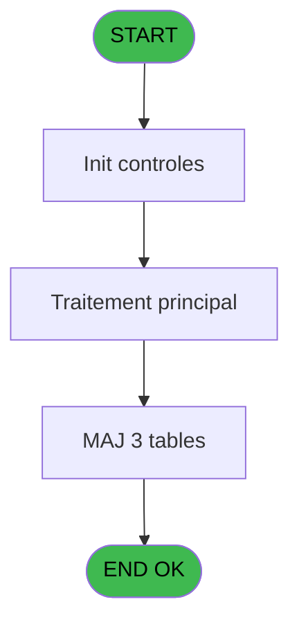
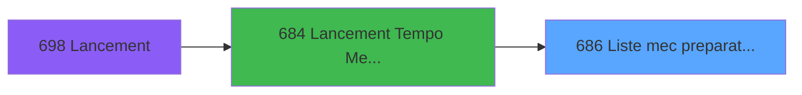

# REF IDE 686 - Liste mec preparation planning

> **Analyse**: Phases 1-4 2026-02-03 13:39 -> 13:40 (20s) | Assemblage 13:40
> **Pipeline**: V7.2 Enrichi
> **Structure**: 4 onglets (Resume | Ecrans | Donnees | Connexions)

<!-- TAB:Resume -->

## 1. FICHE D'IDENTITE

| Attribut | Valeur |
|----------|--------|
| Projet | REF |
| IDE Position | 686 |
| Nom Programme | Liste mec preparation planning |
| Fichier source | `Prg_686.xml` |
| Dossier IDE | General |
| Taches | 4 (1 ecrans visibles) |
| Tables modifiees | 3 |
| Programmes appeles | 0 |

## 2. DESCRIPTION FONCTIONNELLE

**Liste mec preparation planning** assure la gestion complete de ce processus, accessible depuis [Lancement Tempo Mecano (IDE 684)](REF-IDE-684.md).

Le flux de traitement s'organise en **2 blocs fonctionnels** :

- **Creation** (3 taches) : insertion d'enregistrements en base (mouvements, prestations)
- **Traitement** (1 tache) : traitements metier divers

**Donnees modifiees** : 3 tables en ecriture (tempo_mecano_1__mec1, tempo_mecano_2__mec2, tempo_mecano_doss_adh).

**Logique metier** : 2 regles identifiees couvrant conditions metier.

Detail : phases du traitement

#### Phase 1 : Traitement (1 tache)

- **686** - Veuillez patienter ... **[[ECRAN]](#ecran-t1)**

#### Phase 2 : Creation (3 taches)

- **686.1** - creation mecano 1
- **686.2** - creation mecano 2
- **686.3** - creation mecano 1

#### Tables impactees

| Table | Operations | Role metier |
|-------|-----------|-------------|
| tempo_mecano_doss_adh | **W**/L (2 usages) | Table temporaire ecran |
| tempo_mecano_2__mec2 | **W** (1 usages) | Table temporaire ecran |
| tempo_mecano_1__mec1 | **W** (1 usages) | Table temporaire ecran |

## 3. BLOCS FONCTIONNELS

### 3.1 Traitement (1 tache)

Traitements internes.

---

#### 686 - Veuillez patienter ... [[ECRAN]](#ecran-t1)

**Role** : Traitement : Veuillez patienter ....
**Ecran** : 427 x 58 DLU (MDI) | [Voir mockup](#ecran-t1)

### 3.2 Creation (3 taches)

Insertion de nouveaux enregistrements en base.

---

#### 686.1 - creation mecano 1

**Role** : Creation d'enregistrement : creation mecano 1.

---

#### 686.2 - creation mecano 2

**Role** : Creation d'enregistrement : creation mecano 2.

---

#### 686.3 - creation mecano 1

**Role** : Creation d'enregistrement : creation mecano 1.

## 5. REGLES METIER

2 regles identifiees:

### Autres (2 regles)

#### [RM-001] Condition toujours vraie (flag actif)

| Element | Detail |
|---------|--------|
| **Condition** | `[BU]='TRUE'LOG` |
| **Si vrai** | '> Heb' |
| **Si faux** | IF ([BN]='TRUE'LOG,'> '&[BT],'')) |
| **Expression source** | Expression 1 : `IF ([BU]='TRUE'LOG,'> Heb',IF ([BN]='TRUE'LOG,'> '&[BT],''))` |
| **Exemple** | Si [BU]='TRUE'LOG → '> Heb'. Sinon → IF ([BN]='TRUE'LOG,'> '&[BT],'')) |

#### [RM-002] Condition toujours vraie (flag actif)

| Element | Detail |
|---------|--------|
| **Condition** | `>Filtre Fidelisation [H]` |
| **Si vrai** | [CR] |
| **Si faux** | 'TRUE'LOG) |
| **Variables** | H (>Filtre Fidelisation) |
| **Expression source** | Expression 38 : `IF(>Filtre Fidelisation [H],[CR],'TRUE'LOG)` |
| **Exemple** | Si >Filtre Fidelisation [H] → [CR]. Sinon → 'TRUE'LOG) |

## 6. CONTEXTE

- **Appele par**: [Lancement Tempo Mecano (IDE 684)](REF-IDE-684.md)
- **Appelle**: 0 programmes | **Tables**: 11 (W:3 R:1 L:8) | **Taches**: 4 | **Expressions**: 38

<!-- TAB:Ecrans -->

## 8. ECRANS

### 8.1 Forms visibles (1 / 4)

| # | Position | Tache | Nom | Type | Largeur | Hauteur | Bloc |
|---|----------|-------|-----|------|---------|---------|------|
| 1 | 686 | 686 | Veuillez patienter ... | MDI | 427 | 58 | Traitement |

### 8.2 Mockups Ecrans

---

#### 686 - Veuillez patienter ...
**Tache** : [686](#t1) | **Type** : MDI | **Dimensions** : 427 x 58 DLU
**Bloc** : Traitement | **Titre IDE** : Veuillez patienter ...

<!-- FORM-DATA:
{
    "width":  427,
    "vFactor":  8,
    "type":  "MDI",
    "hFactor":  8,
    "controls":  [
                     {
                         "x":  0,
                         "type":  "label",
                         "var":  "",
                         "y":  0,
                         "w":  423,
                         "fmt":  "",
                         "name":  "",
                         "h":  29,
                         "color":  "",
                         "text":  "",
                         "parent":  null
                     },
                     {
                         "x":  120,
                         "type":  "label",
                         "var":  "",
                         "y":  10,
                         "w":  221,
                         "fmt":  "",
                         "name":  "",
                         "h":  8,
                         "color":  "7",
                         "text":  "Traitement en cours ...",
                         "parent":  null
                     },
                     {
                         "x":  0,
                         "type":  "label",
                         "var":  "",
                         "y":  29,
                         "w":  423,
                         "fmt":  "",
                         "name":  "",
                         "h":  27,
                         "color":  "",
                         "text":  "",
                         "parent":  null
                     },
                     {
                         "x":  110,
                         "type":  "label",
                         "var":  "",
                         "y":  32,
                         "w":  114,
                         "fmt":  "",
                         "name":  "",
                         "h":  8,
                         "color":  "",
                         "text":  "Analyses :",
                         "parent":  4
                     },
                     {
                         "x":  110,
                         "type":  "label",
                         "var":  "",
                         "y":  44,
                         "w":  139,
                         "fmt":  "",
                         "name":  "",
                         "h":  8,
                         "color":  "",
                         "text":  "Selectiones :",
                         "parent":  4
                     },
                     {
                         "x":  4,
                         "type":  "image",
                         "var":  "",
                         "y":  2,
                         "w":  72,
                         "fmt":  "",
                         "name":  "",
                         "h":  25,
                         "color":  "",
                         "text":  "",
                         "parent":  null
                     },
                     {
                         "x":  259,
                         "type":  "edit",
                         "var":  "",
                         "y":  32,
                         "w":  56,
                         "fmt":  "",
                         "name":  "",
                         "h":  9,
                         "color":  "",
                         "text":  "",
                         "parent":  4
                     },
                     {
                         "x":  259,
                         "type":  "edit",
                         "var":  "",
                         "y":  44,
                         "w":  56,
                         "fmt":  "",
                         "name":  "",
                         "h":  9,
                         "color":  "",
                         "text":  "",
                         "parent":  4
                     }
                 ],
    "taskId":  "686",
    "height":  58
}
-->

<strong>Champs : 2 champs</strong>

| Pos (x,y) | Nom | Variable | Type |
|-----------|-----|----------|------|
| 259,32 | (sans nom) | - | edit |
| 259,44 | (sans nom) | - | edit |

## 9. NAVIGATION

Ecran unique: **Veuillez patienter ...**

### 9.3 Structure hierarchique (4 taches)

| Position | Tache | Type | Dimensions | Bloc |
|----------|-------|------|------------|------|
| **686.1** | [**Veuillez patienter ...** (686)](#t1) [mockup](#ecran-t1) | MDI | 427x58 | Traitement |
| **686.2** | [**creation mecano 1** (686.1)](#t2) | MDI | - | Creation |
| 686.2.1 | [creation mecano 2 (686.2)](#t4) | MDI | - | |
| 686.2.2 | [creation mecano 1 (686.3)](#t6) | MDI | - | |

### 9.4 Algorigramme

> **Legende**: Vert = START/END OK | Rouge = END KO | Bleu = Decisions
> *Algorigramme auto-genere. Utiliser `/algorigramme` pour une synthese metier detaillee.*

<!-- TAB:Donnees -->

## 10. TABLES

### Tables utilisees (11)

| ID | Nom | Description | Type | R | W | L | Usages |
|----|-----|-------------|------|---|---|---|--------|
| 30 | gm-recherche_____gmr | Index de recherche | DB | R |   |   | 1 |
| 31 | gm-complet_______gmc |  | DB |   |   | L | 1 |
| 34 | hebergement______heb | Hebergement (chambres) | DB |   |   | L | 1 |
| 36 | client_gm |  | DB |   |   | L | 1 |
| 120 | tables_qualites__qua |  | DB |   |   | L | 1 |
| 356 | gm_millesia |  | DB |   |   | L | 1 |
| 584 | tempo_type_millesia | Table temporaire ecran | TMP |   |   | L | 1 |
| 604 | tempo_mecano_1__mec1 | Table temporaire ecran | TMP |   | **W** |   | 1 |
| 605 | tempo_mecano_2__mec2 | Table temporaire ecran | TMP |   | **W** |   | 1 |
| 607 | tempo_mecano_doss_adh | Table temporaire ecran | TMP |   | **W** | L | 2 |
| 619 | tempo_userlist | Table temporaire ecran | TMP |   |   | L | 1 |

### Colonnes par table (1 / 4 tables avec colonnes identifiees)

Table 30 - gm-recherche_____gmr (R) - 1 usages

| Lettre | Variable | Acces | Type |
|--------|----------|-------|------|
| A | >Date | R | Date |
| B | >Categorie | R | Alpha |
| C | >Sejour | R | Alpha |
| D | <Total | R | Numeric |
| E | <NbSelect | R | Numeric |
| F | >Seminaire | R | Alpha |
| G | >Date Alpha | R | Alpha |
| H | >Filtre Fidelisation | R | Logical |
| I | >Societe | R | Unicode |
| J | w0_Circuit | R | Alpha |
| K | w0_RetQualite | R | Logical |
| L | w0_PackA----------------------- | R | Alpha |
| M | w0_RetCirApres----------------- | R | Logical |
| N | w0_RetHebApres----------------- | R | Logical |

Table 604 - tempo_mecano_1__mec1 (**W**) - 1 usages

*Table utilisee uniquement en Link ou aucune colonne Real identifiee dans le DataView.*

Table 605 - tempo_mecano_2__mec2 (**W**) - 1 usages

*Table utilisee uniquement en Link ou aucune colonne Real identifiee dans le DataView.*

Table 607 - tempo_mecano_doss_adh (**W**/L) - 2 usages

*Table utilisee uniquement en Link ou aucune colonne Real identifiee dans le DataView.*

## 11. VARIABLES

### 11.1 Autres (14)

Variables diverses.

| Lettre | Nom | Type | Usage dans |
|--------|-----|------|-----------|
| A | >Date | Date | - |
| B | >Categorie | Alpha | 1x refs |
| C | >Sejour | Alpha | 2x refs |
| D | <Total | Numeric | 1x refs |
| E | <NbSelect | Numeric | 1x refs |
| F | >Seminaire | Alpha | 1x refs |
| G | >Date Alpha | Alpha | - |
| H | >Filtre Fidelisation | Logical | 1x refs |
| I | >Societe | Unicode | 1x refs |
| J | w0_Circuit | Alpha | - |
| K | w0_RetQualite | Logical | 1x refs |
| L | w0_PackA----------------------- | Alpha | - |
| M | w0_RetCirApres----------------- | Logical | - |
| N | w0_RetHebApres----------------- | Logical | - |

## 12. EXPRESSIONS

**38 / 38 expressions decodees (100%)**

### 12.1 Repartition par type

| Type | Expressions | Regles |
|------|-------------|--------|
| CONDITION | 6 | 0 |
| CALCULATION | 8 | 0 |
| CAST_LOGIQUE | 2 | 2 |
| CONSTANTE | 7 | 0 |
| OTHER | 14 | 0 |
| REFERENCE_VG | 1 | 0 |

### 12.2 Expressions cles par type

#### CONDITION (6 expressions)

| Type | IDE | Expression | Regle |
|------|-----|------------|-------|
| CONDITION | 2 | `(>Categorie [B]=[BM] OR >Categorie [B]=MlsTrans ('Toutes') OR Trim (>Categorie [B])='') 
AND 
(>Sejour [C]=[AS] OR >Sejour [C]='') 
AND 
[BB] 
AND 
[CG] 
AND 
([CM] OR [AT]='')` | - |
| CONDITION | 29 | `CndRange (Trim (>Seminaire [F])<>'',>Seminaire [F])` | - |
| CONDITION | 32 | `CndRange (Trim (>Sejour [C])<>'',>Sejour [C])` | - |
| CONDITION | 19 | `<Total [D]+1` | - |
| CONDITION | 20 | `<NbSelect [E]+1` | - |
| ... | | *+1 autres* | |

#### CALCULATION (8 expressions)

| Type | IDE | Expression | Regle |
|------|-----|------------|-------|
| CALCULATION | 26 | `DbDel ('{608,-1}'DSOURCE,'')` | - |
| CALCULATION | 25 | `DbDel ('{607,-1}'DSOURCE,'')` | - |
| CALCULATION | 28 | `DbDel ('{610,-1}'DSOURCE,'')` | - |
| CALCULATION | 27 | `DbDel ('{609,-1}'DSOURCE,'')` | - |
| CALCULATION | 22 | `DbDel ('{604,-1}'DSOURCE,'')` | - |
| ... | | *+3 autres* | |

#### CAST_LOGIQUE (2 expressions)

| Type | IDE | Expression | Regle |
|------|-----|------------|-------|
| CAST_LOGIQUE | 38 | `IF(>Filtre Fidelisation [H],[CR],'TRUE'LOG)` | [RM-002](#rm-RM-002) |
| CAST_LOGIQUE | 1 | `IF ([BU]='TRUE'LOG,'> Heb',IF ([BN]='TRUE'LOG,'> '&[BT],''))` | [RM-001](#rm-RM-001) |

#### CONSTANTE (7 expressions)

| Type | IDE | Expression | Regle |
|------|-----|------------|-------|
| CONSTANTE | 16 | `'TQUME'` | - |
| CONSTANTE | 30 | `'D'` | - |
| CONSTANTE | 31 | `'TCLME'` | - |
| CONSTANTE | 11 | `'H'` | - |
| CONSTANTE | 3 | `'A'` | - |
| ... | | *+2 autres* | |

#### OTHER (14 expressions)

| Type | IDE | Expression | Regle |
|------|-----|------------|-------|
| OTHER | 33 | `[AT]` | - |
| OTHER | 18 | `[AQ]` | - |
| OTHER | 17 | `[AP]` | - |
| OTHER | 34 | `w0_PackA--------------... [L]` | - |
| OTHER | 37 | `[CQ]` | - |
| ... | | *+9 autres* | |

#### REFERENCE_VG (1 expressions)

| Type | IDE | Expression | Regle |
|------|-----|------------|-------|
| REFERENCE_VG | 15 | `VG1` | - |

### 12.3 Toutes les expressions (38)

Voir les 38 expressions

#### CONDITION (6)

| IDE | Expression Decodee |
|-----|-------------------|
| 19 | `<Total [D]+1` |
| 20 | `<NbSelect [E]+1` |
| 12 | `>Societe [I]` |
| 2 | `(>Categorie [B]=[BM] OR >Categorie [B]=MlsTrans ('Toutes') OR Trim (>Categorie [B])='') 
AND 
(>Sejour [C]=[AS] OR >Sejour [C]='') 
AND 
[BB] 
AND 
[CG] 
AND 
([CM] OR [AT]='')` |
| 29 | `CndRange (Trim (>Seminaire [F])<>'',>Seminaire [F])` |
| 32 | `CndRange (Trim (>Sejour [C])<>'',>Sejour [C])` |

#### CALCULATION (8)

| IDE | Expression Decodee |
|-----|-------------------|
| 21 | `DbDel ('{594,-1}'DSOURCE,'')` |
| 22 | `DbDel ('{604,-1}'DSOURCE,'')` |
| 23 | `DbDel ('{605,-1}'DSOURCE,'')` |
| 24 | `DbDel ('{606,-1}'DSOURCE,'')` |
| 25 | `DbDel ('{607,-1}'DSOURCE,'')` |
| 26 | `DbDel ('{608,-1}'DSOURCE,'')` |
| 27 | `DbDel ('{609,-1}'DSOURCE,'')` |
| 28 | `DbDel ('{610,-1}'DSOURCE,'')` |

#### CAST_LOGIQUE (2)

| IDE | Expression Decodee |
|-----|-------------------|
| 1 | `IF ([BU]='TRUE'LOG,'> Heb',IF ([BN]='TRUE'LOG,'> '&[BT],''))` |
| 38 | `IF(>Filtre Fidelisation [H],[CR],'TRUE'LOG)` |

#### CONSTANTE (7)

| IDE | Expression Decodee |
|-----|-------------------|
| 3 | `'A'` |
| 4 | `'1'` |
| 7 | `'C'` |
| 11 | `'H'` |
| 16 | `'TQUME'` |
| 30 | `'D'` |
| 31 | `'TCLME'` |

#### OTHER (14)

| IDE | Expression Decodee |
|-----|-------------------|
| 5 | `[AP]` |
| 6 | `[AQ]` |
| 8 | `[AD]` |
| 9 | `[AE]` |
| 10 | `[AC]` |
| 13 | `w0_RetQualite [K]` |
| 14 | `[AN]` |
| 17 | `[AP]` |
| 18 | `[AQ]` |
| 33 | `[AT]` |
| 34 | `w0_PackA--------------... [L]` |
| 35 | `w0_RetCirApres--------... [M]` |
| 36 | `[X]` |
| 37 | `[CQ]` |

#### REFERENCE_VG (1)

| IDE | Expression Decodee |
|-----|-------------------|
| 15 | `VG1` |

<!-- TAB:Connexions -->

## 13. GRAPHE D'APPELS

### 13.1 Chaine depuis Main (Callers)

Main -> ... -> [Lancement Tempo Mecano (IDE 684)](REF-IDE-684.md) -> **Liste mec preparation planning (IDE 686)**

### 13.2 Callers

| IDE | Nom Programme | Nb Appels |
|-----|---------------|-----------|
| [684](REF-IDE-684.md) | Lancement Tempo Mecano | 1 |

### 13.3 Callees (programmes appeles)

### 13.4 Detail Callees avec contexte

| IDE | Nom Programme | Appels | Contexte |
|-----|---------------|--------|----------|
| - | (aucun) | - | - |

## 14. RECOMMANDATIONS MIGRATION

### 14.1 Profil du programme

| Metrique | Valeur | Impact migration |
|----------|--------|-----------------|
| Lignes de logique | 225 | Taille moyenne |
| Expressions | 38 | Peu de logique |
| Tables WRITE | 3 | Impact modere |
| Sous-programmes | 0 | Peu de dependances |
| Ecrans visibles | 1 | Ecran unique ou traitement batch |
| Code desactive | 0% (0 / 225) | Code sain |
| Regles metier | 2 | Quelques regles a preserver |

### 14.2 Plan de migration par bloc

#### Traitement (1 tache: 1 ecran, 0 traitement)

- **Strategie** : 1 composant(s) UI (Razor/React) avec formulaires et validation.
- Decomposer les taches en services unitaires testables.

#### Creation (3 taches: 0 ecran, 3 traitements)

- **Strategie** : Repository pattern avec Entity Framework Core.
- Insertion via `IRepository<T>.CreateAsync()`

### 14.3 Dependances critiques

| Dependance | Type | Appels | Impact |
|------------|------|--------|--------|
| tempo_mecano_1__mec1 | Table WRITE (Temp) | 1x | Schema + repository |
| tempo_mecano_2__mec2 | Table WRITE (Temp) | 1x | Schema + repository |
| tempo_mecano_doss_adh | Table WRITE (Temp) | 1x | Schema + repository |

---
*Spec DETAILED generee par Pipeline V7.2 - 2026-02-03 13:40*
