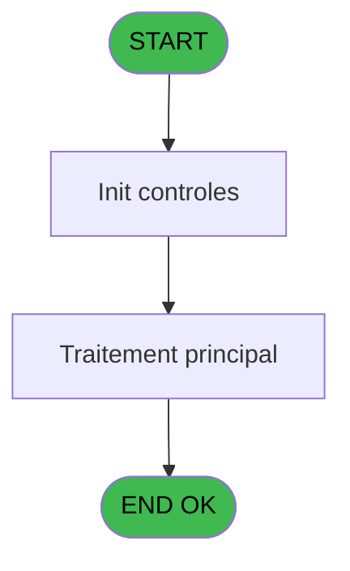
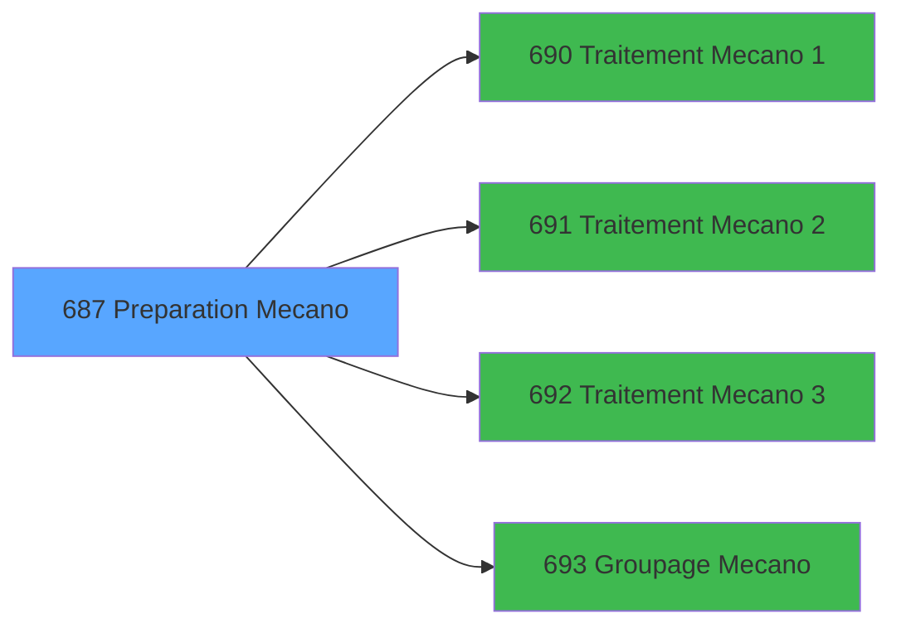

# REF IDE 687 - Preparation Mecano

> **Analyse**: Phases 1-4 2026-02-03 13:40 -> 13:40 (19s) | Assemblage 13:40
> **Pipeline**: V7.2 Enrichi
> **Structure**: 4 onglets (Resume | Ecrans | Donnees | Connexions)

<!-- TAB:Resume -->

## 1. FICHE D'IDENTITE

| Attribut | Valeur |
|----------|--------|
| Projet | REF |
| IDE Position | 687 |
| Nom Programme | Preparation Mecano |
| Fichier source | `Prg_687.xml` |
| Dossier IDE | General |
| Taches | 1 (0 ecrans visibles) |
| Tables modifiees | 0 |
| Programmes appeles | 4 |

## 2. DESCRIPTION FONCTIONNELLE

**Preparation Mecano** assure la gestion complete de ce processus, accessible depuis [Lancement Tempo Mecano (IDE 684)](REF-IDE-684.md).

Le flux de traitement s'organise en **1 blocs fonctionnels** :

- **Traitement** (1 tache) : traitements metier divers

## 3. BLOCS FONCTIONNELS

### 3.1 Traitement (1 tache)

Traitements internes.

---

#### 687 - Preparation Mecano

**Role** : Traitement : Preparation Mecano.
**Delegue a** : [Traitement Mecano 1 (IDE 690)](REF-IDE-690.md), [Traitement Mecano 2 (IDE 691)](REF-IDE-691.md), [Traitement Mecano 3 (IDE 692)](REF-IDE-692.md)

## 5. REGLES METIER

*(Aucune regle metier identifiee)*

## 6. CONTEXTE

- **Appele par**: [Lancement Tempo Mecano (IDE 684)](REF-IDE-684.md)
- **Appelle**: 4 programmes | **Tables**: 0 (W:0 R:0 L:0) | **Taches**: 1 | **Expressions**: 2

<!-- TAB:Ecrans -->

## 8. ECRANS

*(Programme sans ecran visible)*

## 9. NAVIGATION

### 9.3 Structure hierarchique (1 tache)

| Position | Tache | Type | Dimensions | Bloc |
|----------|-------|------|------------|------|
| **687.1** | [**Preparation Mecano** (687)](#t1) | MDI | - | Traitement |

### 9.4 Algorigramme

> **Legende**: Vert = START/END OK | Rouge = END KO | Bleu = Decisions
> *Algorigramme auto-genere. Utiliser `/algorigramme` pour une synthese metier detaillee.*

<!-- TAB:Donnees -->

## 10. TABLES

### Tables utilisees (0)

| ID | Nom | Description | Type | R | W | L | Usages |
|----|-----|-------------|------|---|---|---|--------|

### Colonnes par table (0 / 0 tables avec colonnes identifiees)

## 11. VARIABLES

### 11.1 Autres (4)

Variables diverses.

| Lettre | Nom | Type | Usage dans |
|--------|-----|------|-----------|
| A | W1 Passe | Numeric | 1x refs |
| B | W1 Traitement 1 | Numeric | 1x refs |
| C | W1 Traitement 2 | Numeric | 1x refs |
| D | W1 Traitement 3 | Numeric | 1x refs |

## 12. EXPRESSIONS

**2 / 2 expressions decodees (100%)**

### 12.1 Repartition par type

| Type | Expressions | Regles |
|------|-------------|--------|
| CALCULATION | 1 | 0 |
| CONDITION | 1 | 0 |

### 12.2 Expressions cles par type

#### CALCULATION (1 expressions)

| Type | IDE | Expression | Regle |
|------|-----|------------|-------|
| CALCULATION | 2 | `W1 Passe [A]+1` | - |

#### CONDITION (1 expressions)

| Type | IDE | Expression | Regle |
|------|-----|------------|-------|
| CONDITION | 1 | `W1 Traitement 1 [B]=W1 Traitement 2 [C] AND W1 Traitement 1 [B]=W1 Traitement 3 [D]` | - |

<!-- TAB:Connexions -->

## 13. GRAPHE D'APPELS

### 13.1 Chaine depuis Main (Callers)

Main -> ... -> [Lancement Tempo Mecano (IDE 684)](REF-IDE-684.md) -> **Preparation Mecano (IDE 687)**

### 13.2 Callers

| IDE | Nom Programme | Nb Appels |
|-----|---------------|-----------|
| [684](REF-IDE-684.md) | Lancement Tempo Mecano | 1 |

### 13.3 Callees (programmes appeles)

### 13.4 Detail Callees avec contexte

| IDE | Nom Programme | Appels | Contexte |
|-----|---------------|--------|----------|
| [690](REF-IDE-690.md) | Traitement Mecano 1 | 1 | Sous-programme |
| [691](REF-IDE-691.md) | Traitement Mecano 2 | 1 | Sous-programme |
| [692](REF-IDE-692.md) | Traitement Mecano 3 | 1 | Sous-programme |
| [693](REF-IDE-693.md) | Groupage Mecano | 1 | Sous-programme |

## 14. RECOMMANDATIONS MIGRATION

### 14.1 Profil du programme

| Metrique | Valeur | Impact migration |
|----------|--------|-----------------|
| Lignes de logique | 12 | Programme compact |
| Expressions | 2 | Peu de logique |
| Tables WRITE | 0 | Impact faible |
| Sous-programmes | 4 | Peu de dependances |
| Ecrans visibles | 0 | Ecran unique ou traitement batch |
| Code desactive | 0% (0 / 12) | Code sain |
| Regles metier | 0 | Pas de regle identifiee |

### 14.2 Plan de migration par bloc

#### Traitement (1 tache: 0 ecran, 1 traitement)

- **Strategie** : 1 service(s) backend injectable(s) (Domain Services).
- 4 sous-programme(s) a migrer ou a reutiliser depuis les services existants.
- Decomposer les taches en services unitaires testables.

### 14.3 Dependances critiques

| Dependance | Type | Appels | Impact |
|------------|------|--------|--------|
| [Traitement Mecano 3 (IDE 692)](REF-IDE-692.md) | Sous-programme | 1x | Normale - Sous-programme |
| [Groupage Mecano (IDE 693)](REF-IDE-693.md) | Sous-programme | 1x | Normale - Sous-programme |
| [Traitement Mecano 1 (IDE 690)](REF-IDE-690.md) | Sous-programme | 1x | Normale - Sous-programme |
| [Traitement Mecano 2 (IDE 691)](REF-IDE-691.md) | Sous-programme | 1x | Normale - Sous-programme |

---
*Spec DETAILED generee par Pipeline V7.2 - 2026-02-03 13:40*
