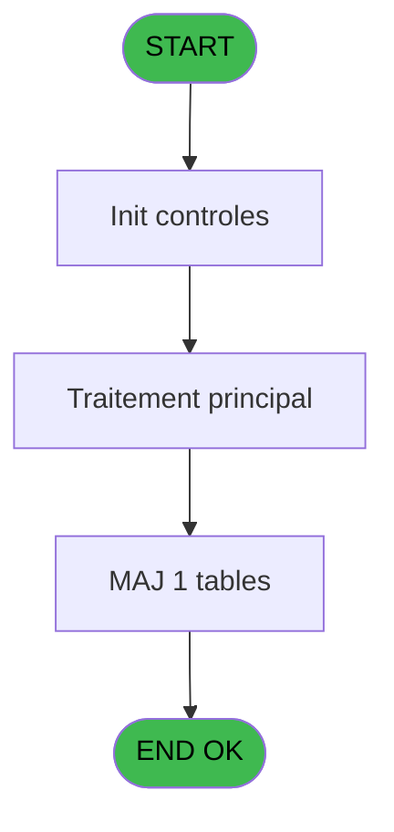
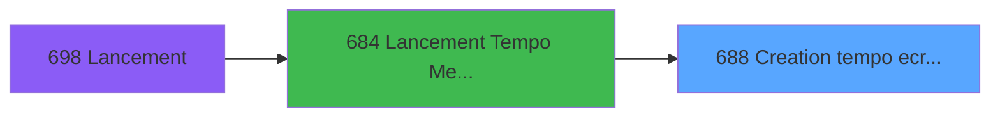

# REF IDE 688 - Creation tempo ecran generique

> **Analyse**: Phases 1-4 2026-02-03 13:40 -> 13:41 (20s) | Assemblage 13:41
> **Pipeline**: V7.2 Enrichi
> **Structure**: 4 onglets (Resume | Ecrans | Donnees | Connexions)

<!-- TAB:Resume -->

## 1. FICHE D'IDENTITE

| Attribut | Valeur |
|----------|--------|
| Projet | REF |
| IDE Position | 688 |
| Nom Programme | Creation tempo ecran generique |
| Fichier source | `Prg_688.xml` |
| Dossier IDE | General |
| Taches | 3 (1 ecrans visibles) |
| Tables modifiees | 1 |
| Programmes appeles | 1 |

## 2. DESCRIPTION FONCTIONNELLE

**Creation tempo ecran generique** assure la gestion complete de ce processus, accessible depuis [Lancement Tempo Mecano (IDE 684)](REF-IDE-684.md).

Le flux de traitement s'organise en **2 blocs fonctionnels** :

- **Creation** (2 taches) : insertion d'enregistrements en base (mouvements, prestations)
- **Traitement** (1 tache) : traitements metier divers

**Donnees modifiees** : 1 tables en ecriture (tempo_ecran_mecano).

**Logique metier** : 4 regles identifiees couvrant conditions metier.

Detail : phases du traitement

#### Phase 1 : Traitement (1 tache)

- **688** - Veuillez patienter ... **[[ECRAN]](#ecran-t1)**

Delegue a : [Determination Age Bebe (IDE 776)](REF-IDE-776.md)

#### Phase 2 : Creation (2 taches)

- **688.1** - Creat separateur
- **688.2** - Creat Blanc

#### Tables impactees

| Table | Operations | Role metier |
|-------|-----------|-------------|
| tempo_ecran_mecano | **W**/L (3 usages) | Table temporaire ecran |

## 3. BLOCS FONCTIONNELS

### 3.1 Traitement (1 tache)

Traitements internes.

---

#### 688 - Veuillez patienter ... [[ECRAN]](#ecran-t1)

**Role** : Traitement : Veuillez patienter ....
**Ecran** : 427 x 59 DLU (MDI) | [Voir mockup](#ecran-t1)
**Delegue a** : [Determination Age Bebe (IDE 776)](REF-IDE-776.md)

### 3.2 Creation (2 taches)

Insertion de nouveaux enregistrements en base.

---

#### 688.1 - Creat separateur

**Role** : Traitement : Creat separateur.

---

#### 688.2 - Creat Blanc

**Role** : Traitement : Creat Blanc.
**Variables liees** : K (v.LigneBlanche)

## 5. REGLES METIER

4 regles identifiees:

### Autres (4 regles)

#### [RM-001] Traitement si [AN] est renseigne

| Element | Detail |
|---------|--------|
| **Condition** | `[AN]<>''` |
| **Si vrai** | [AN] |
| **Si faux** | IF([AJ]='GO',[BC],'')) |
| **Expression source** | Expression 12 : `IF([AN]<>'',[AN],IF([AJ]='GO',[BC],''))` |
| **Exemple** | Si [AN]<>'' → [AN]. Sinon → IF([AJ]='GO',[BC],'')) |

#### [RM-002] Si [AT]>0 alors Str ([AI] sinon '3Z'),'40')

| Element | Detail |
|---------|--------|
| **Condition** | `[AT]>0` |
| **Si vrai** | Str ([AI] |
| **Si faux** | '3Z'),'40') |
| **Expression source** | Expression 17 : `IF ([AT]>0,Str ([AI],'3Z'),'40')` |
| **Exemple** | Si [AT]>0 → Str ([AI]. Sinon → '3Z'),'40') |

#### [RM-003] Si [AT]>0 AND [AI]<=[BL] alors 'B' sinon '')

| Element | Detail |
|---------|--------|
| **Condition** | `[AT]>0 AND [AI]<=[BL]` |
| **Si vrai** | 'B' |
| **Si faux** | '') |
| **Expression source** | Expression 28 : `IF ([AT]>0 AND [AI]<=[BL],'B','')` |
| **Exemple** | Si [AT]>0 AND [AI]<=[BL] → 'B'. Sinon → '') |

#### [RM-004] Traitement si Trim([AA]) est renseigne

| Element | Detail |
|---------|--------|
| **Condition** | `Trim([AA])<>''` |
| **Si vrai** | [AA]<>[DC] |
| **Si faux** | [DA]>0 AND [DA]<>v.Chambre [L]) |
| **Variables** | L (v.Chambre) |
| **Expression source** | Expression 53 : `IF(Trim([AA])<>'',[AA]<>[DC],[DA]>0 AND [DA]<>v.Chambre [L])` |
| **Exemple** | Si Trim([AA])<>'' → [AA]<>[DC]. Sinon → [DA]>0 AND [DA]<>v.Chambre [L]) |

## 6. CONTEXTE

- **Appele par**: [Lancement Tempo Mecano (IDE 684)](REF-IDE-684.md)
- **Appelle**: 1 programmes | **Tables**: 11 (W:1 R:1 L:10) | **Taches**: 3 | **Expressions**: 65

<!-- TAB:Ecrans -->

## 8. ECRANS

### 8.1 Forms visibles (1 / 3)

| # | Position | Tache | Nom | Type | Largeur | Hauteur | Bloc |
|---|----------|-------|-----|------|---------|---------|------|
| 1 | 688 | 688 | Veuillez patienter ... | MDI | 427 | 59 | Traitement |

### 8.2 Mockups Ecrans

---

#### 688 - Veuillez patienter ...
**Tache** : [688](#t1) | **Type** : MDI | **Dimensions** : 427 x 59 DLU
**Bloc** : Traitement | **Titre IDE** : Veuillez patienter ...

<!-- FORM-DATA:
{
    "width":  427,
    "vFactor":  8,
    "type":  "MDI",
    "hFactor":  8,
    "controls":  [
                     {
                         "x":  0,
                         "type":  "label",
                         "var":  "",
                         "y":  0,
                         "w":  423,
                         "fmt":  "",
                         "name":  "",
                         "h":  29,
                         "color":  "",
                         "text":  "",
                         "parent":  null
                     },
                     {
                         "x":  120,
                         "type":  "label",
                         "var":  "",
                         "y":  10,
                         "w":  221,
                         "fmt":  "",
                         "name":  "",
                         "h":  8,
                         "color":  "7",
                         "text":  "Traitement en cours ...",
                         "parent":  null
                     },
                     {
                         "x":  0,
                         "type":  "label",
                         "var":  "",
                         "y":  29,
                         "w":  423,
                         "fmt":  "",
                         "name":  "",
                         "h":  27,
                         "color":  "",
                         "text":  "",
                         "parent":  null
                     },
                     {
                         "x":  110,
                         "type":  "label",
                         "var":  "",
                         "y":  32,
                         "w":  114,
                         "fmt":  "",
                         "name":  "",
                         "h":  8,
                         "color":  "",
                         "text":  "Analyses :",
                         "parent":  4
                     },
                     {
                         "x":  110,
                         "type":  "label",
                         "var":  "",
                         "y":  44,
                         "w":  139,
                         "fmt":  "",
                         "name":  "",
                         "h":  8,
                         "color":  "",
                         "text":  "Selectiones :",
                         "parent":  4
                     },
                     {
                         "x":  4,
                         "type":  "image",
                         "var":  "",
                         "y":  2,
                         "w":  72,
                         "fmt":  "",
                         "name":  "",
                         "h":  25,
                         "color":  "",
                         "text":  "",
                         "parent":  null
                     },
                     {
                         "x":  259,
                         "type":  "edit",
                         "var":  "",
                         "y":  32,
                         "w":  56,
                         "fmt":  "",
                         "name":  "",
                         "h":  9,
                         "color":  "",
                         "text":  "",
                         "parent":  4
                     },
                     {
                         "x":  259,
                         "type":  "edit",
                         "var":  "",
                         "y":  44,
                         "w":  56,
                         "fmt":  "",
                         "name":  "",
                         "h":  9,
                         "color":  "",
                         "text":  "",
                         "parent":  4
                     }
                 ],
    "taskId":  "688",
    "height":  59
}
-->

<strong>Champs : 2 champs</strong>

| Pos (x,y) | Nom | Variable | Type |
|-----------|-----|----------|------|
| 259,32 | (sans nom) | - | edit |
| 259,44 | (sans nom) | - | edit |

## 9. NAVIGATION

Ecran unique: **Veuillez patienter ...**

### 9.3 Structure hierarchique (3 taches)

| Position | Tache | Type | Dimensions | Bloc |
|----------|-------|------|------------|------|
| **688.1** | [**Veuillez patienter ...** (688)](#t1) [mockup](#ecran-t1) | MDI | 427x59 | Traitement |
| **688.2** | [**Creat separateur** (688.1)](#t2) | MDI | - | Creation |
| 688.2.1 | [Creat Blanc (688.2)](#t3) | MDI | - | |

### 9.4 Algorigramme

> **Legende**: Vert = START/END OK | Rouge = END KO | Bleu = Decisions
> *Algorigramme auto-genere. Utiliser `/algorigramme` pour une synthese metier detaillee.*

<!-- TAB:Donnees -->

## 10. TABLES

### Tables utilisees (11)

| ID | Nom | Description | Type | R | W | L | Usages |
|----|-----|-------------|------|---|---|---|--------|
| 30 | gm-recherche_____gmr | Index de recherche | DB | R |   |   | 1 |
| 31 | gm-complet_______gmc |  | DB |   |   | L | 1 |
| 35 | personnel_go______go |  | DB |   |   | L | 1 |
| 36 | client_gm |  | DB |   |   | L | 1 |
| 121 | tables_pays_ventes | Donnees de ventes | DB |   |   | L | 1 |
| 356 | gm_millesia |  | DB |   |   | L | 1 |
| 584 | tempo_type_millesia | Table temporaire ecran | TMP |   |   | L | 1 |
| 594 | tempo_ecran_mecano | Table temporaire ecran | TMP |   | **W** | L | 3 |
| 606 | tempo_mecano_3_mec3 | Table temporaire ecran | TMP |   |   | L | 1 |
| 610 | tempo_nombres | Table temporaire ecran | TMP |   |   | L | 1 |
| 621 | tempo_ecran_mecano | Table temporaire ecran | TMP |   |   | L | 1 |

### Colonnes par table (1 / 2 tables avec colonnes identifiees)

Table 30 - gm-recherche_____gmr (R) - 1 usages

| Lettre | Variable | Acces | Type |
|--------|----------|-------|------|
| A | P.i.Total | R | Numeric |
| B | P.i.NbSelect | R | Numeric |
| C | P.i.Ordre Tri | R | Alpha |
| D | P.i.Societe | R | Unicode |
| E | v.Sequence | R | Numeric |
| F | v.Fidelisation ? | R | Logical |
| G | v.AgeBebe | R | Numeric |
| H | v.AgeEnfant | R | Numeric |
| I | v.NomGroupe | R | Alpha |
| J | v.NumAdher | R | Numeric |
| K | v.LigneBlanche | R | Logical |
| L | v.Chambre | R | Alpha |
| M | v.Num Dossier | R | Numeric |

Table 594 - tempo_ecran_mecano (**W**/L) - 3 usages

*Table utilisee uniquement en Link ou aucune colonne Real identifiee dans le DataView.*

## 11. VARIABLES

### 11.1 Parametres entrants (4)

Variables recues du programme appelant ([Lancement Tempo Mecano (IDE 684)](REF-IDE-684.md)).

| Lettre | Nom | Type | Usage dans |
|--------|-----|------|-----------|
| A | P.i.Total | Numeric | - |
| B | P.i.NbSelect | Numeric | - |
| C | P.i.Ordre Tri | Alpha | 5x parametre entrant |
| D | P.i.Societe | Unicode | 1x parametre entrant |

### 11.2 Variables de session (9)

Variables persistantes pendant toute la session.

| Lettre | Nom | Type | Usage dans |
|--------|-----|------|-----------|
| E | v.Sequence | Numeric | 2x session |
| F | v.Fidelisation ? | Logical | - |
| G | v.AgeBebe | Numeric | - |
| H | v.AgeEnfant | Numeric | - |
| I | v.NomGroupe | Alpha | 2x session |
| J | v.NumAdher | Numeric | - |
| K | v.LigneBlanche | Logical | - |
| L | v.Chambre | Alpha | 4x session |
| M | v.Num Dossier | Numeric | - |

## 12. EXPRESSIONS

**65 / 65 expressions decodees (100%)**

### 12.1 Repartition par type

| Type | Expressions | Regles |
|------|-------------|--------|
| CALCULATION | 9 | 0 |
| CONDITION | 20 | 4 |
| CONSTANTE | 3 | 0 |
| REFERENCE_VG | 1 | 0 |
| OTHER | 27 | 0 |
| CAST_LOGIQUE | 1 | 0 |
| STRING | 3 | 0 |
| CONCATENATION | 1 | 0 |

### 12.2 Expressions cles par type

#### CALCULATION (9 expressions)

| Type | IDE | Expression | Regle |
|------|-----|------------|-------|
| CALCULATION | 46 | `[CX]+1` | - |
| CALCULATION | 45 | `[CW]+1` | - |
| CALCULATION | 49 | `v.Sequence [E]+1` | - |
| CALCULATION | 48 | `[CY]+1` | - |
| CALCULATION | 44 | `[CV]+1` | - |
| ... | | *+4 autres* | |

#### CONDITION (20 expressions)

| Type | IDE | Expression | Regle |
|------|-----|------------|-------|
| CONDITION | 28 | `IF ([AT]>0 AND [AI]<=[BL],'B','')` | [RM-003](#rm-RM-003) |
| CONDITION | 53 | `IF(Trim([AA])<>'',[AA]<>[DC],[DA]>0 AND [DA]<>v.Chambre [L])` | [RM-004](#rm-RM-004) |
| CONDITION | 12 | `IF([AN]<>'',[AN],IF([AJ]='GO',[BC],''))` | [RM-001](#rm-RM-001) |
| CONDITION | 17 | `IF ([AT]>0,Str ([AI],'3Z'),'40')` | [RM-002](#rm-RM-002) |
| CONDITION | 62 | `[DD]<>0 AND [DD]<>[Z]` | - |
| ... | | *+15 autres* | |

#### CONSTANTE (3 expressions)

| Type | IDE | Expression | Regle |
|------|-----|------------|-------|
| CONSTANTE | 30 | `''` | - |
| CONSTANTE | 9 | `'VENFA'` | - |
| CONSTANTE | 8 | `'VBEBE'` | - |

#### REFERENCE_VG (1 expressions)

| Type | IDE | Expression | Regle |
|------|-----|------------|-------|
| REFERENCE_VG | 1 | `VG1` | - |

#### OTHER (27 expressions)

| Type | IDE | Expression | Regle |
|------|-----|------------|-------|
| OTHER | 26 | `[W]` | - |
| OTHER | 27 | `[X]` | - |
| OTHER | 31 | `[Y]` | - |
| OTHER | 23 | `[T]` | - |
| OTHER | 24 | `[U]` | - |
| ... | | *+22 autres* | |

#### CAST_LOGIQUE (1 expressions)

| Type | IDE | Expression | Regle |
|------|-----|------------|-------|
| CAST_LOGIQUE | 50 | `'FALSE'LOG` | - |

#### STRING (3 expressions)

| Type | IDE | Expression | Regle |
|------|-----|------------|-------|
| STRING | 22 | `Str ([AO],'9')` | - |
| STRING | 20 | `Str ([S],'2')` | - |
| STRING | 16 | `Str ([N],'2')&Str (v.Chambre [L],'10P0Z0')` | - |

#### CONCATENATION (1 expressions)

| Type | IDE | Expression | Regle |
|------|-----|------------|-------|
| CONCATENATION | 29 | `Trim([BH])&IF(VG138 AND [DN]='O','N','')` | - |

### 12.3 Toutes les expressions (65)

Voir les 65 expressions

#### CALCULATION (9)

| IDE | Expression Decodee |
|-----|-------------------|
| 36 | `[CR]+1` |
| 38 | `[CS]+1` |
| 41 | `[CT]+1` |
| 42 | `[CU]+1` |
| 44 | `[CV]+1` |
| 45 | `[CW]+1` |
| 46 | `[CX]+1` |
| 48 | `[CY]+1` |
| 49 | `v.Sequence [E]+1` |

#### CONDITION (20)

| IDE | Expression Decodee |
|-----|-------------------|
| 12 | `IF([AN]<>'',[AN],IF([AJ]='GO',[BC],''))` |
| 17 | `IF ([AT]>0,Str ([AI],'3Z'),'40')` |
| 28 | `IF ([AT]>0 AND [AI]<=[BL],'B','')` |
| 53 | `IF(Trim([AA])<>'',[AA]<>[DC],[DA]>0 AND [DA]<>v.Chambre [L])` |
| 58 | `CASE(P.i.Ordre Tri [C],'1','2'INDEX,'2','4'INDEX,'3','5'INDEX,'4','6'INDEX,'2'INDEX)` |
| 35 | `[AT]=0 OR [AI]>IF ([BM]=0,12,[BM])` |
| 37 | `[AH]<>'F'` |
| 39 | `[AH]='F'` |
| 40 | `[AI]>IF ([BL]=0,2,[BL]) AND [AI]<=IF ([BM]=0,12,[BM])` |
| 43 | `[AT]>0 AND [AI]<=IF ([BL]=0,2,[BL])` |
| 51 | `[CZ]<>'' AND [CZ]<>v.NomGroupe [I]` |
| 52 | `[DA]>0 AND [DA]<>v.Chambre [L]` |
| 57 | `P.i.Ordre Tri [C]='1'` |
| 59 | `P.i.Ordre Tri [C]='2'` |
| 62 | `[DD]<>0 AND [DD]<>[Z]` |
| 63 | `[DA]<>0 AND [DD]<>[Z]` |
| 64 | `P.i.Ordre Tri [C]='3'` |
| 65 | `P.i.Ordre Tri [C]='4'` |
| 47 | `Trim(MID ([V],2,2))='1'` |
| 56 | `Trim([BH])<>''` |

#### CONSTANTE (3)

| IDE | Expression Decodee |
|-----|-------------------|
| 8 | `'VBEBE'` |
| 9 | `'VENFA'` |
| 30 | `''` |

#### REFERENCE_VG (1)

| IDE | Expression Decodee |
|-----|-------------------|
| 1 | `VG1` |

#### OTHER (27)

| IDE | Expression Decodee |
|-----|-------------------|
| 2 | `P.i.Societe [D]` |
| 3 | `v.Chambre [L]` |
| 4 | `[N]` |
| 5 | `[AF]` |
| 6 | `[AG]` |
| 7 | `[BH]` |
| 10 | `v.Sequence [E]` |
| 11 | `[AN]` |
| 13 | `[AQ]` |
| 14 | `[AR]` |
| 15 | `[AS]` |
| 18 | `[Q]` |
| 19 | `[R]` |
| 21 | `[AY]` |
| 23 | `[T]` |
| 24 | `[U]` |
| 25 | `[V]` |
| 26 | `[W]` |
| 27 | `[X]` |
| 31 | `[Y]` |
| 32 | `[AP]` |
| 33 | `[CM]` |
| 34 | `[CN]` |
| 54 | `v.NomGroupe [I]` |
| 55 | `[BI]` |
| 60 | `[AA]` |
| 61 | `[Z]` |

#### CAST_LOGIQUE (1)

| IDE | Expression Decodee |
|-----|-------------------|
| 50 | `'FALSE'LOG` |

#### STRING (3)

| IDE | Expression Decodee |
|-----|-------------------|
| 16 | `Str ([N],'2')&Str (v.Chambre [L],'10P0Z0')` |
| 20 | `Str ([S],'2')` |
| 22 | `Str ([AO],'9')` |

#### CONCATENATION (1)

| IDE | Expression Decodee |
|-----|-------------------|
| 29 | `Trim([BH])&IF(VG138 AND [DN]='O','N','')` |

<!-- TAB:Connexions -->

## 13. GRAPHE D'APPELS

### 13.1 Chaine depuis Main (Callers)

Main -> ... -> [Lancement Tempo Mecano (IDE 684)](REF-IDE-684.md) -> **Creation tempo ecran generique (IDE 688)**

### 13.2 Callers

| IDE | Nom Programme | Nb Appels |
|-----|---------------|-----------|
| [684](REF-IDE-684.md) | Lancement Tempo Mecano | 1 |

### 13.3 Callees (programmes appeles)

### 13.4 Detail Callees avec contexte

| IDE | Nom Programme | Appels | Contexte |
|-----|---------------|--------|----------|
| [776](REF-IDE-776.md) | Determination Age Bebe | 2 | Sous-programme |

## 14. RECOMMANDATIONS MIGRATION

### 14.1 Profil du programme

| Metrique | Valeur | Impact migration |
|----------|--------|-----------------|
| Lignes de logique | 247 | Taille moyenne |
| Expressions | 65 | Logique moderee |
| Tables WRITE | 1 | Impact faible |
| Sous-programmes | 1 | Peu de dependances |
| Ecrans visibles | 1 | Ecran unique ou traitement batch |
| Code desactive | 0% (0 / 247) | Code sain |
| Regles metier | 4 | Quelques regles a preserver |

### 14.2 Plan de migration par bloc

#### Traitement (1 tache: 1 ecran, 0 traitement)

- **Strategie** : 1 composant(s) UI (Razor/React) avec formulaires et validation.
- 1 sous-programme(s) a migrer ou a reutiliser depuis les services existants.
- Decomposer les taches en services unitaires testables.

#### Creation (2 taches: 0 ecran, 2 traitements)

- **Strategie** : Repository pattern avec Entity Framework Core.
- Insertion via `IRepository<T>.CreateAsync()`

### 14.3 Dependances critiques

| Dependance | Type | Appels | Impact |
|------------|------|--------|--------|
| tempo_ecran_mecano | Table WRITE (Temp) | 2x | Schema + repository |
| [Determination Age Bebe (IDE 776)](REF-IDE-776.md) | Sous-programme | 2x | Haute - Sous-programme |

---
*Spec DETAILED generee par Pipeline V7.2 - 2026-02-03 13:41*
