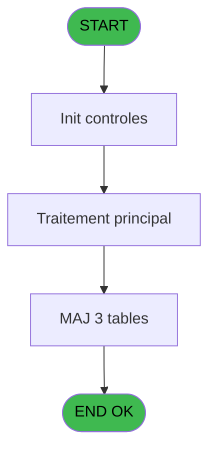
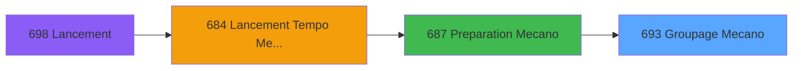
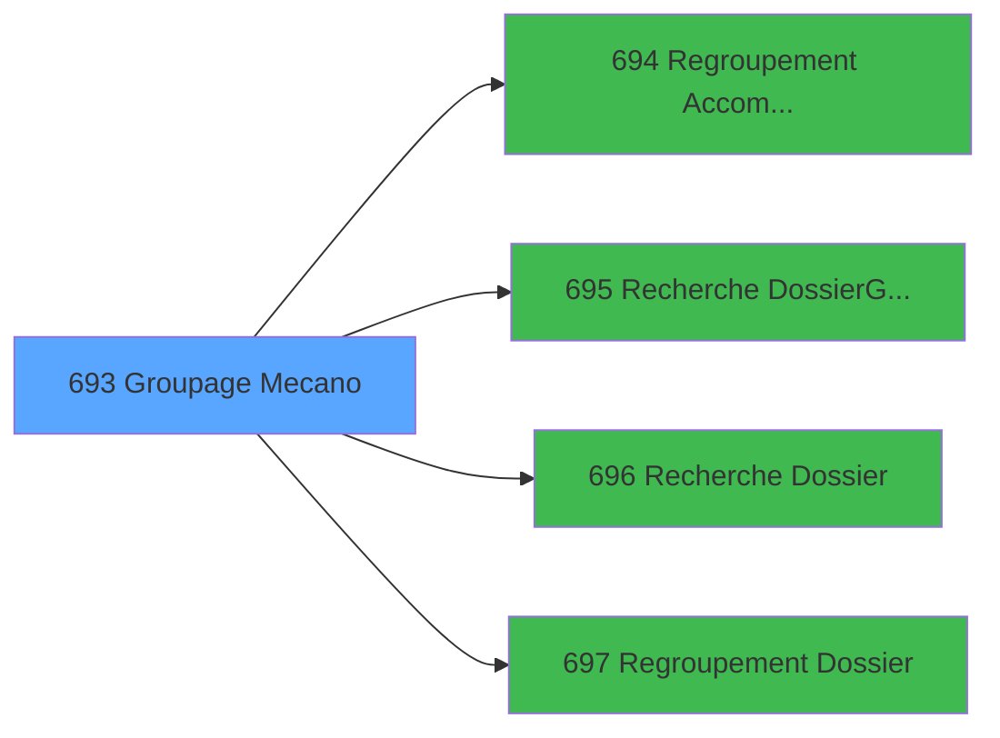

# REF IDE 693 - Groupage Mecano

> **Analyse**: Phases 1-4 2026-02-03 13:43 -> 13:43 (19s) | Assemblage 13:43
> **Pipeline**: V7.2 Enrichi
> **Structure**: 4 onglets (Resume | Ecrans | Donnees | Connexions)

<!-- TAB:Resume -->

## 1. FICHE D'IDENTITE

| Attribut | Valeur |
|----------|--------|
| Projet | REF |
| IDE Position | 693 |
| Nom Programme | Groupage Mecano |
| Fichier source | `Prg_693.xml` |
| Dossier IDE | General |
| Taches | 7 (1 ecrans visibles) |
| Tables modifiees | 3 |
| Programmes appeles | 4 |

## 2. DESCRIPTION FONCTIONNELLE

**Groupage Mecano** assure la gestion complete de ce processus, accessible depuis [Preparation Mecano (IDE 687)](REF-IDE-687.md).

Le flux de traitement s'organise en **3 blocs fonctionnels** :

- **Traitement** (5 taches) : traitements metier divers
- **Creation** (1 tache) : insertion d'enregistrements en base (mouvements, prestations)
- **Transfert** (1 tache) : transferts de donnees entre modules ou deversements

**Donnees modifiees** : 3 tables en ecriture (tempo_mecano_1__mec1, tempo_mecano_2__mec2, tempo_mecano_3_mec3).

Detail : phases du traitement

#### Phase 1 : Traitement (5 taches)

- **693** - Veuillez patienter ... **[[ECRAN]](#ecran-t1)**
- **693.2** - Groupage Adherent
- **693.2.1.1** - Si pas meme Num
- **693.3** - Marquage Adherent
- **693.3.1** - Marquage Groupe

Delegue a : [   Regroupement Accompagnant (IDE 694)](REF-IDE-694.md), [   Regroupement Dossier (IDE 697)](REF-IDE-697.md)

#### Phase 2 : Transfert (1 tache)

- **693.1** - Transfert Mecano

#### Phase 3 : Creation (1 tache)

- **693.2.1** - Creation Groupage

#### Tables impactees

| Table | Operations | Role metier |
|-------|-----------|-------------|
| tempo_mecano_3_mec3 | **W**/L (5 usages) | Table temporaire ecran |
| tempo_mecano_1__mec1 | R/**W** (2 usages) | Table temporaire ecran |
| tempo_mecano_2__mec2 | **W** (1 usages) | Table temporaire ecran |

## 3. BLOCS FONCTIONNELS

### 3.1 Traitement (5 taches)

Traitements internes.

---

#### 693 - Veuillez patienter ... [[ECRAN]](#ecran-t1)

**Role** : Traitement : Veuillez patienter ....
**Ecran** : 427 x 57 DLU (MDI) | [Voir mockup](#ecran-t1)

4 sous-taches directes

| Tache | Nom | Bloc |
|-------|-----|------|
| [693.2](#t3) | Groupage Adherent | Traitement |
| [693.2.1.1](#t5) | Si pas meme Num | Traitement |
| [693.3](#t6) | Marquage Adherent | Traitement |
| [693.3.1](#t7) | Marquage Groupe | Traitement |

**Delegue a** : [   Regroupement Accompagnant (IDE 694)](REF-IDE-694.md), [   Regroupement Dossier (IDE 697)](REF-IDE-697.md)

---

#### 693.2 - Groupage Adherent

**Role** : Traitement : Groupage Adherent.
**Delegue a** : [   Regroupement Accompagnant (IDE 694)](REF-IDE-694.md), [   Regroupement Dossier (IDE 697)](REF-IDE-697.md)

---

#### 693.2.1.1 - Si pas meme Num

**Role** : Traitement : Si pas meme Num.
**Delegue a** : [   Regroupement Accompagnant (IDE 694)](REF-IDE-694.md), [   Regroupement Dossier (IDE 697)](REF-IDE-697.md)

---

#### 693.3 - Marquage Adherent

**Role** : Traitement : Marquage Adherent.
**Delegue a** : [   Regroupement Accompagnant (IDE 694)](REF-IDE-694.md), [   Regroupement Dossier (IDE 697)](REF-IDE-697.md)

---

#### 693.3.1 - Marquage Groupe

**Role** : Traitement : Marquage Groupe.
**Variables liees** : B (W1-Sous Groupe)
**Delegue a** : [   Regroupement Accompagnant (IDE 694)](REF-IDE-694.md), [   Regroupement Dossier (IDE 697)](REF-IDE-697.md)

### 3.2 Transfert (1 tache)

Transfert de donnees entre modules.

---

#### 693.1 - Transfert Mecano

**Role** : Transfert de donnees : Transfert Mecano.

### 3.3 Creation (1 tache)

Insertion de nouveaux enregistrements en base.

---

#### 693.2.1 - Creation Groupage

**Role** : Creation d'enregistrement : Creation Groupage.

## 5. REGLES METIER

*(Aucune regle metier identifiee)*

## 6. CONTEXTE

- **Appele par**: [Preparation Mecano (IDE 687)](REF-IDE-687.md)
- **Appelle**: 4 programmes | **Tables**: 3 (W:3 R:1 L:1) | **Taches**: 7 | **Expressions**: 1

<!-- TAB:Ecrans -->

## 8. ECRANS

### 8.1 Forms visibles (1 / 7)

| # | Position | Tache | Nom | Type | Largeur | Hauteur | Bloc |
|---|----------|-------|-----|------|---------|---------|------|
| 1 | 693 | 693 | Veuillez patienter ... | MDI | 427 | 57 | Traitement |

### 8.2 Mockups Ecrans

---

#### 693 - Veuillez patienter ...
**Tache** : [693](#t1) | **Type** : MDI | **Dimensions** : 427 x 57 DLU
**Bloc** : Traitement | **Titre IDE** : Veuillez patienter ...

<!-- FORM-DATA:
{
    "width":  427,
    "vFactor":  8,
    "type":  "MDI",
    "hFactor":  8,
    "controls":  [
                     {
                         "x":  0,
                         "type":  "label",
                         "var":  "",
                         "y":  0,
                         "w":  423,
                         "fmt":  "",
                         "name":  "",
                         "h":  29,
                         "color":  "",
                         "text":  "",
                         "parent":  null
                     },
                     {
                         "x":  120,
                         "type":  "label",
                         "var":  "",
                         "y":  10,
                         "w":  221,
                         "fmt":  "",
                         "name":  "",
                         "h":  8,
                         "color":  "7",
                         "text":  "Traitement en cours ...",
                         "parent":  null
                     },
                     {
                         "x":  0,
                         "type":  "label",
                         "var":  "",
                         "y":  29,
                         "w":  423,
                         "fmt":  "",
                         "name":  "",
                         "h":  27,
                         "color":  "",
                         "text":  "",
                         "parent":  null
                     },
                     {
                         "x":  69,
                         "type":  "label",
                         "var":  "",
                         "y":  38,
                         "w":  286,
                         "fmt":  "",
                         "name":  "",
                         "h":  8,
                         "color":  "",
                         "text":  "Groupement mecanographique",
                         "parent":  null
                     },
                     {
                         "x":  4,
                         "type":  "image",
                         "var":  "",
                         "y":  2,
                         "w":  72,
                         "fmt":  "",
                         "name":  "",
                         "h":  25,
                         "color":  "",
                         "text":  "",
                         "parent":  null
                     }
                 ],
    "taskId":  "693",
    "height":  57
}
-->

## 9. NAVIGATION

Ecran unique: **Veuillez patienter ...**

### 9.3 Structure hierarchique (7 taches)

| Position | Tache | Type | Dimensions | Bloc |
|----------|-------|------|------------|------|
| **693.1** | [**Veuillez patienter ...** (693)](#t1) [mockup](#ecran-t1) | MDI | 427x57 | Traitement |
| 693.1.1 | [Groupage Adherent (693.2)](#t3) | - | - | |
| 693.1.2 | [Si pas meme Num (693.2.1.1)](#t5) | MDI | - | |
| 693.1.3 | [Marquage Adherent (693.3)](#t6) | MDI | - | |
| 693.1.4 | [Marquage Groupe (693.3.1)](#t7) | MDI | - | |
| **693.2** | [**Transfert Mecano** (693.1)](#t2) | MDI | - | Transfert |
| **693.3** | [**Creation Groupage** (693.2.1)](#t4) | MDI | - | Creation |

### 9.4 Algorigramme

> **Legende**: Vert = START/END OK | Rouge = END KO | Bleu = Decisions
> *Algorigramme auto-genere. Utiliser `/algorigramme` pour une synthese metier detaillee.*

<!-- TAB:Donnees -->

## 10. TABLES

### Tables utilisees (3)

| ID | Nom | Description | Type | R | W | L | Usages |
|----|-----|-------------|------|---|---|---|--------|
| 604 | tempo_mecano_1__mec1 | Table temporaire ecran | TMP | R | **W** |   | 2 |
| 605 | tempo_mecano_2__mec2 | Table temporaire ecran | TMP |   | **W** |   | 1 |
| 606 | tempo_mecano_3_mec3 | Table temporaire ecran | TMP |   | **W** | L | 5 |

### Colonnes par table (1 / 3 tables avec colonnes identifiees)

Table 604 - tempo_mecano_1__mec1 (R/**W**) - 2 usages

*Table utilisee uniquement en Link ou aucune colonne Real identifiee dans le DataView.*

Table 605 - tempo_mecano_2__mec2 (**W**) - 1 usages

| Lettre | Variable | Acces | Type |
|--------|----------|-------|------|
| A | W1-N° Groupe | W | Numeric |
| B | W1-Sous Groupe | W | Numeric |
| C | W1 Old Numero | W | Numeric |

Table 606 - tempo_mecano_3_mec3 (**W**/L) - 5 usages

*Table utilisee uniquement en Link ou aucune colonne Real identifiee dans le DataView.*

## 11. VARIABLES

### 11.1 Autres (3)

Variables diverses.

| Lettre | Nom | Type | Usage dans |
|--------|-----|------|-----------|
| A | W0-Fin de Tache | Alpha | - |
| B | W1-Sous Groupe | Numeric | - |
| C | W1 Old Numero | Numeric | - |

## 12. EXPRESSIONS

**1 / 1 expressions decodees (100%)**

### 12.1 Repartition par type

| Type | Expressions | Regles |
|------|-------------|--------|
| CONSTANTE | 1 | 0 |

### 12.2 Expressions cles par type

#### CONSTANTE (1 expressions)

| Type | IDE | Expression | Regle |
|------|-----|------------|-------|
| CONSTANTE | 1 | `'F'` | - |

<!-- TAB:Connexions -->

## 13. GRAPHE D'APPELS

### 13.1 Chaine depuis Main (Callers)

Main -> ... -> [Preparation Mecano (IDE 687)](REF-IDE-687.md) -> **Groupage Mecano (IDE 693)**

### 13.2 Callers

| IDE | Nom Programme | Nb Appels |
|-----|---------------|-----------|
| [687](REF-IDE-687.md) | Preparation Mecano | 1 |

### 13.3 Callees (programmes appeles)

### 13.4 Detail Callees avec contexte

| IDE | Nom Programme | Appels | Contexte |
|-----|---------------|--------|----------|
| [694](REF-IDE-694.md) |    Regroupement Accompagnant | 1 | Sous-programme |
| [695](REF-IDE-695.md) |    Recherche Dossier/Groupe | 1 | Sous-programme |
| [696](REF-IDE-696.md) |    Recherche Dossier | 1 | Sous-programme |
| [697](REF-IDE-697.md) |    Regroupement Dossier | 1 | Sous-programme |

## 14. RECOMMANDATIONS MIGRATION

### 14.1 Profil du programme

| Metrique | Valeur | Impact migration |
|----------|--------|-----------------|
| Lignes de logique | 125 | Programme compact |
| Expressions | 1 | Peu de logique |
| Tables WRITE | 3 | Impact modere |
| Sous-programmes | 4 | Peu de dependances |
| Ecrans visibles | 1 | Ecran unique ou traitement batch |
| Code desactive | 0% (0 / 125) | Code sain |
| Regles metier | 0 | Pas de regle identifiee |

### 14.2 Plan de migration par bloc

#### Traitement (5 taches: 1 ecran, 4 traitements)

- **Strategie** : Orchestrateur avec 1 ecrans (Razor/React) et 4 traitements backend (services).
- Les ecrans deviennent des composants UI, les traitements invisibles deviennent des services injectables.
- 4 sous-programme(s) a migrer ou a reutiliser depuis les services existants.
- Decomposer les taches en services unitaires testables.

#### Transfert (1 tache: 0 ecran, 1 traitement)

- **Strategie** : Service `ITransfertService` avec logique de deversement.

#### Creation (1 tache: 0 ecran, 1 traitement)

- **Strategie** : Repository pattern avec Entity Framework Core.
- Insertion via `IRepository<T>.CreateAsync()`

### 14.3 Dependances critiques

| Dependance | Type | Appels | Impact |
|------------|------|--------|--------|
| tempo_mecano_1__mec1 | Table WRITE (Temp) | 1x | Schema + repository |
| tempo_mecano_2__mec2 | Table WRITE (Temp) | 1x | Schema + repository |
| tempo_mecano_3_mec3 | Table WRITE (Temp) | 3x | Schema + repository |
| [   Recherche Dossier (IDE 696)](REF-IDE-696.md) | Sous-programme | 1x | Normale - Sous-programme |
| [   Regroupement Dossier (IDE 697)](REF-IDE-697.md) | Sous-programme | 1x | Normale - Sous-programme |
| [   Regroupement Accompagnant (IDE 694)](REF-IDE-694.md) | Sous-programme | 1x | Normale - Sous-programme |
| [   Recherche Dossier/Groupe (IDE 695)](REF-IDE-695.md) | Sous-programme | 1x | Normale - Sous-programme |

---
*Spec DETAILED generee par Pipeline V7.2 - 2026-02-03 13:43*
