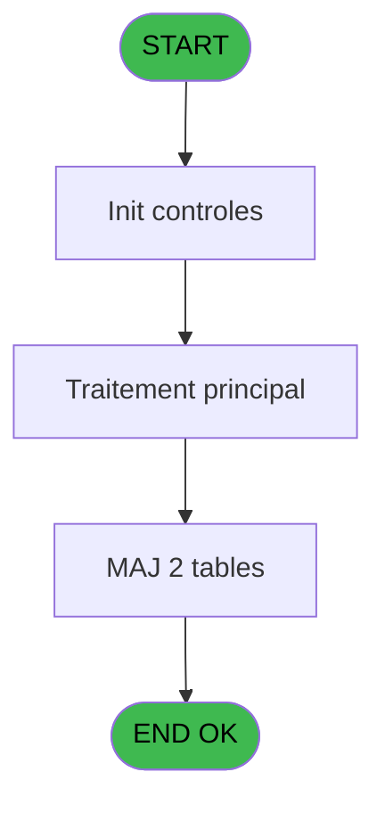
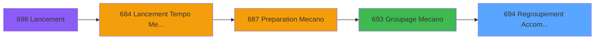
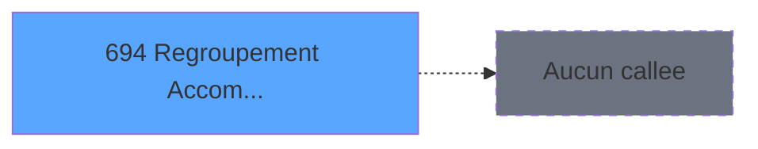

# REF IDE 694 - Regroupement Accompagnant

> **Analyse**: Phases 1-4 2026-02-03 13:43 -> 13:44 (22s) | Assemblage 13:44
> **Pipeline**: V7.2 Enrichi
> **Structure**: 4 onglets (Resume | Ecrans | Donnees | Connexions)

<!-- TAB:Resume -->

## 1. FICHE D'IDENTITE

| Attribut | Valeur |
|----------|--------|
| Projet | REF |
| IDE Position | 694 |
| Nom Programme | Regroupement Accompagnant |
| Fichier source | `Prg_694.xml` |
| Dossier IDE | General |
| Taches | 4 (1 ecrans visibles) |
| Tables modifiees | 2 |
| Programmes appeles | 0 |

## 2. DESCRIPTION FONCTIONNELLE

**Regroupement Accompagnant** assure la gestion complete de ce processus, accessible depuis [Groupage Mecano (IDE 693)](REF-IDE-693.md).

Le flux de traitement s'organise en **2 blocs fonctionnels** :

- **Traitement** (3 taches) : traitements metier divers
- **Creation** (1 tache) : insertion d'enregistrements en base (mouvements, prestations)

**Donnees modifiees** : 2 tables en ecriture (tempo_mecano_2__mec2, tempo_mecano_3_mec3).

Detail : phases du traitement

#### Phase 1 : Traitement (3 taches)

- **694** - Veuillez patienter ... **[[ECRAN]](#ecran-t1)**
- **694.1** - Groupage Adherent
- **694.1.2** - Groupage Adherent

#### Phase 2 : Creation (1 tache)

- **694.1.1** - Creation Sous-Groupage **[[ECRAN]](#ecran-t3)**

#### Tables impactees

| Table | Operations | Role metier |
|-------|-----------|-------------|
| tempo_mecano_3_mec3 | R/**W** (2 usages) | Table temporaire ecran |
| tempo_mecano_2__mec2 | **W** (1 usages) | Table temporaire ecran |

## 3. BLOCS FONCTIONNELS

### 3.1 Traitement (3 taches)

Traitements internes.

---

#### 694 - Veuillez patienter ... [[ECRAN]](#ecran-t1)

**Role** : Traitement : Veuillez patienter ....
**Ecran** : 427 x 58 DLU (MDI) | [Voir mockup](#ecran-t1)

---

#### 694.1 - Groupage Adherent

**Role** : Traitement : Groupage Adherent.

---

#### 694.1.2 - Groupage Adherent

**Role** : Traitement : Groupage Adherent.

### 3.2 Creation (1 tache)

Insertion de nouveaux enregistrements en base.

---

#### 694.1.1 - Creation Sous-Groupage [[ECRAN]](#ecran-t3)

**Role** : Creation d'enregistrement : Creation Sous-Groupage.
**Ecran** : 248 x 206 DLU (MDI) | [Voir mockup](#ecran-t3)

## 5. REGLES METIER

*(Aucune regle metier identifiee)*

## 6. CONTEXTE

- **Appele par**: [Groupage Mecano (IDE 693)](REF-IDE-693.md)
- **Appelle**: 0 programmes | **Tables**: 2 (W:2 R:1 L:0) | **Taches**: 4 | **Expressions**: 1

<!-- TAB:Ecrans -->

## 8. ECRANS

### 8.1 Forms visibles (1 / 4)

| # | Position | Tache | Nom | Type | Largeur | Hauteur | Bloc |
|---|----------|-------|-----|------|---------|---------|------|
| 1 | 694 | 694 | Veuillez patienter ... | MDI | 427 | 58 | Traitement |

### 8.2 Mockups Ecrans

---

#### 694 - Veuillez patienter ...
**Tache** : [694](#t1) | **Type** : MDI | **Dimensions** : 427 x 58 DLU
**Bloc** : Traitement | **Titre IDE** : Veuillez patienter ...

<!-- FORM-DATA:
{
    "width":  427,
    "vFactor":  8,
    "type":  "MDI",
    "hFactor":  8,
    "controls":  [
                     {
                         "x":  0,
                         "type":  "label",
                         "var":  "",
                         "y":  0,
                         "w":  423,
                         "fmt":  "",
                         "name":  "",
                         "h":  29,
                         "color":  "",
                         "text":  "",
                         "parent":  null
                     },
                     {
                         "x":  120,
                         "type":  "label",
                         "var":  "",
                         "y":  10,
                         "w":  221,
                         "fmt":  "",
                         "name":  "",
                         "h":  8,
                         "color":  "7",
                         "text":  "Traitement en cours ...",
                         "parent":  null
                     },
                     {
                         "x":  0,
                         "type":  "label",
                         "var":  "",
                         "y":  29,
                         "w":  423,
                         "fmt":  "",
                         "name":  "",
                         "h":  27,
                         "color":  "",
                         "text":  "",
                         "parent":  null
                     },
                     {
                         "x":  69,
                         "type":  "label",
                         "var":  "",
                         "y":  38,
                         "w":  286,
                         "fmt":  "",
                         "name":  "",
                         "h":  8,
                         "color":  "",
                         "text":  "Groupement accompagnants",
                         "parent":  null
                     },
                     {
                         "x":  4,
                         "type":  "image",
                         "var":  "",
                         "y":  2,
                         "w":  72,
                         "fmt":  "",
                         "name":  "",
                         "h":  25,
                         "color":  "",
                         "text":  "",
                         "parent":  null
                     }
                 ],
    "taskId":  "694",
    "height":  58
}
-->

## 9. NAVIGATION

Ecran unique: **Veuillez patienter ...**

### 9.3 Structure hierarchique (4 taches)

| Position | Tache | Type | Dimensions | Bloc |
|----------|-------|------|------------|------|
| **694.1** | [**Veuillez patienter ...** (694)](#t1) [mockup](#ecran-t1) | MDI | 427x58 | Traitement |
| 694.1.1 | [Groupage Adherent (694.1)](#t2) | - | - | |
| 694.1.2 | [Groupage Adherent (694.1.2)](#t4) | MDI | - | |
| **694.2** | [**Creation Sous-Groupage** (694.1.1)](#t3) [mockup](#ecran-t3) | MDI | 248x206 | Creation |

### 9.4 Algorigramme

> **Legende**: Vert = START/END OK | Rouge = END KO | Bleu = Decisions
> *Algorigramme auto-genere. Utiliser `/algorigramme` pour une synthese metier detaillee.*

<!-- TAB:Donnees -->

## 10. TABLES

### Tables utilisees (2)

| ID | Nom | Description | Type | R | W | L | Usages |
|----|-----|-------------|------|---|---|---|--------|
| 605 | tempo_mecano_2__mec2 | Table temporaire ecran | TMP |   | **W** |   | 1 |
| 606 | tempo_mecano_3_mec3 | Table temporaire ecran | TMP | R | **W** |   | 2 |

### Colonnes par table (2 / 2 tables avec colonnes identifiees)

Table 605 - tempo_mecano_2__mec2 (**W**) - 1 usages

| Lettre | Variable | Acces | Type |
|--------|----------|-------|------|
| A | W1 Groupe Adh | W | Numeric |
| B | W1 Sous Groupe Adh | W | Numeric |
| C | W1 Groupe Acc | W | Numeric |
| D | W1 Sous Groupe Acc | W | Numeric |

Table 606 - tempo_mecano_3_mec3 (R/**W**) - 2 usages

| Lettre | Variable | Acces | Type |
|--------|----------|-------|------|
| A | W1-N°Groupe | W | Numeric |
| B | W1-Sous-Groupe | W | Numeric |

## 11. VARIABLES

### 11.1 Autres (4)

Variables diverses.

| Lettre | Nom | Type | Usage dans |
|--------|-----|------|-----------|
| A | W0-Fin de Tache | Alpha | - |
| B | W1 Sous Groupe Adh | Numeric | - |
| C | W1 Groupe Acc | Numeric | - |
| D | W1 Sous Groupe Acc | Numeric | - |

## 12. EXPRESSIONS

**1 / 1 expressions decodees (100%)**

### 12.1 Repartition par type

| Type | Expressions | Regles |
|------|-------------|--------|
| CONSTANTE | 1 | 0 |

### 12.2 Expressions cles par type

#### CONSTANTE (1 expressions)

| Type | IDE | Expression | Regle |
|------|-----|------------|-------|
| CONSTANTE | 1 | `'F'` | - |

<!-- TAB:Connexions -->

## 13. GRAPHE D'APPELS

### 13.1 Chaine depuis Main (Callers)

Main -> ... -> [Groupage Mecano (IDE 693)](REF-IDE-693.md) -> **Regroupement Accompagnant (IDE 694)**

### 13.2 Callers

| IDE | Nom Programme | Nb Appels |
|-----|---------------|-----------|
| [693](REF-IDE-693.md) | Groupage Mecano | 1 |

### 13.3 Callees (programmes appeles)

### 13.4 Detail Callees avec contexte

| IDE | Nom Programme | Appels | Contexte |
|-----|---------------|--------|----------|
| - | (aucun) | - | - |

## 14. RECOMMANDATIONS MIGRATION

### 14.1 Profil du programme

| Metrique | Valeur | Impact migration |
|----------|--------|-----------------|
| Lignes de logique | 61 | Programme compact |
| Expressions | 1 | Peu de logique |
| Tables WRITE | 2 | Impact faible |
| Sous-programmes | 0 | Peu de dependances |
| Ecrans visibles | 1 | Ecran unique ou traitement batch |
| Code desactive | 0% (0 / 61) | Code sain |
| Regles metier | 0 | Pas de regle identifiee |

### 14.2 Plan de migration par bloc

#### Traitement (3 taches: 1 ecran, 2 traitements)

- **Strategie** : Orchestrateur avec 1 ecrans (Razor/React) et 2 traitements backend (services).
- Les ecrans deviennent des composants UI, les traitements invisibles deviennent des services injectables.
- Decomposer les taches en services unitaires testables.

#### Creation (1 tache: 1 ecran, 0 traitement)

- **Strategie** : Repository pattern avec Entity Framework Core.
- Insertion via `IRepository<T>.CreateAsync()`

### 14.3 Dependances critiques

| Dependance | Type | Appels | Impact |
|------------|------|--------|--------|
| tempo_mecano_2__mec2 | Table WRITE (Temp) | 1x | Schema + repository |
| tempo_mecano_3_mec3 | Table WRITE (Temp) | 1x | Schema + repository |

---
*Spec DETAILED generee par Pipeline V7.2 - 2026-02-03 13:44*
